# Synapse — Technical Documentation

> [!IMPORTANT]
> **Synapse** is an AI-powered study-note generator. It ingests heterogeneous learning materials (PDFs, Word documents, PowerPoint slides, plain text, YouTube videos, and web pages), extracts their content, and produces polished, Obsidian-ready Markdown study guides enriched with LaTeX math, Mermaid diagrams, callouts, and internal wiki links.

---

## Table of Contents

1. [Product Overview](#1-product-overview)
2. [System Architecture](#2-system-architecture)
3. [End-to-End Pipeline](#3-end-to-end-pipeline)
4. [Application Bootstrap & Configuration](#4-application-bootstrap--configuration)
5. [Web Layer — Routes & Controllers](#5-web-layer--routes--controllers)
6. [Frontend User Interface](#6-frontend-user-interface)
7. [Domain Models](#7-domain-models)
8. [Stage 1 — Ingestion & Extraction](#8-stage-1--ingestion--extraction)
9. [Stage 2 — Document Processing](#9-stage-2--document-processing)
10. [Stage 3 — Chunking](#10-stage-3--chunking)
11. [Stage 4 — AI Generation](#11-stage-4--ai-generation)
12. [Stage 5 — Merge & Document Structure](#12-stage-5--merge--document-structure)
13. [Stage 6 — Rendering & Quality Assurance](#13-stage-6--rendering--quality-assurance)
14. [Stage 7 — Export](#14-stage-7--export)
15. [LLM Provider Strategy & Rate Limiting](#15-llm-provider-strategy--rate-limiting)
16. [Prompt Engineering Reference](#16-prompt-engineering-reference)
17. [Data Flow Diagrams](#17-data-flow-diagrams)
18. [File Reference Index](#18-file-reference-index)

---

## 1. Product Overview

### What Synapse Does

Synapse transforms raw educational content into structured, personal study notes. Unlike simple summarizers, Synapse uses a **multi-stage AI pipeline** that mirrors how an expert educator would prepare materials:

1. **Extract** text from diverse source formats
2. **Clean and normalize** the raw text
3. **Chunk** content into LLM-friendly segments
4. **Plan** an outline mapping topics to source chunks
5. **Extract structured knowledge** (definitions, mechanisms, examples, pitfalls, etc.)
6. **Teach** — write human-friendly study notes from that knowledge
7. **Merge** sections with transitions, navigation, glossary, and part dividers
8. **Render and lint** the Markdown for Obsidian compatibility
9. **Export** the final `.md` file

### Supported Input Types

| Input Type | Format | Extractor Used |
|------------|--------|----------------|
| PDF | `.pdf` | `PDFExtractor` (PyMuPDF) |
| Word | `.docx` | `DocxExtractor` (python-docx) |
| PowerPoint | `.pptx` | `PPTXExtractor` (python-pptx) |
| Plain text | `.txt` | `TxtExtractor` |
| YouTube | URL (`youtube.com`, `youtu.be`) | `YouTubeExtractor` |
| Web page | Any other URL | `WebExtractor` (Trafilatura) |

### Output Characteristics

The generated notes are optimized for **Obsidian** and include:

- LaTeX math (`$...$` inline, `$$...$$` display, `\boxed{}` for key formulas)
- Mermaid diagrams (flowcharts, xycharts, pie charts, timelines)
- Obsidian callouts (`> [!tip]`, `> [!warning]`, etc.)
- Internal wiki links (`[[#Heading Title]]`)
- Grouped navigation table of contents with Roman-numeral parts
- End-of-document glossary and source attribution

---

## 2. System Architecture

Synapse follows a **layered service architecture** built on Flask. Each layer has a single responsibility, and the pipeline orchestrates them sequentially (with parallel AI calls where safe).

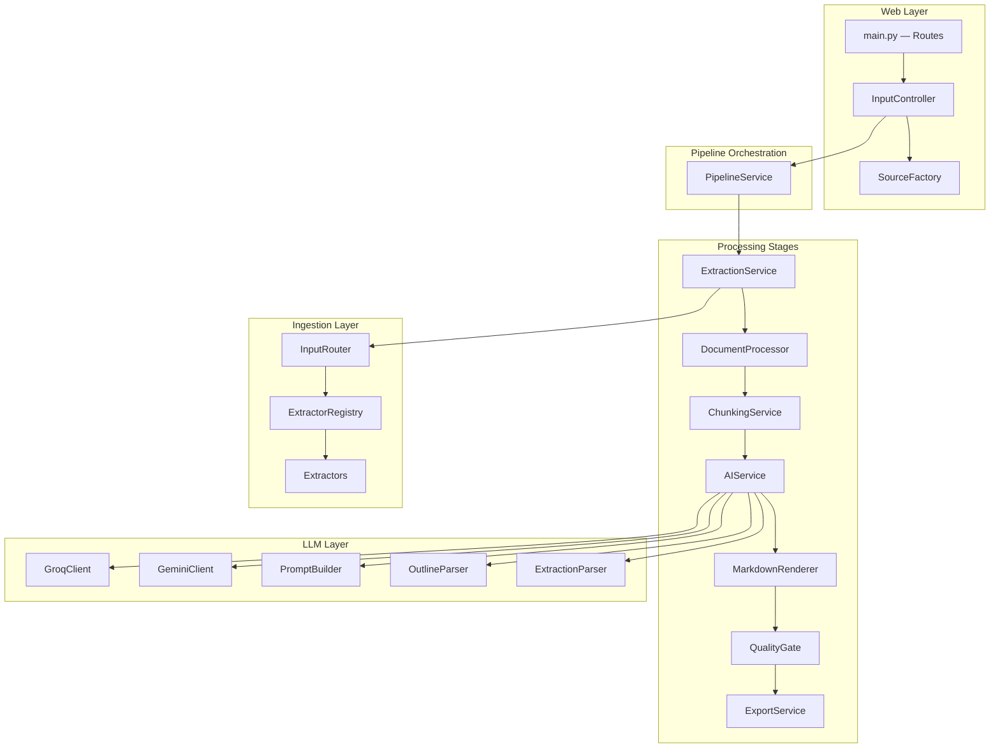

### Layer Responsibilities

| Layer | Responsibility |
|-------|----------------|
| **Routes & Controllers** | HTTP handling, file upload, URL parsing, request orchestration |
| **Models** | Typed data structures for sources, collections, chunks, and LLM I/O |
| **Ingestion** | Format-specific text extraction from files and URLs |
| **Processing** | Text cleaning, metadata enrichment, token estimation |
| **Chunking** | Splitting large documents into bounded token segments |
| **LLM** | Prompt construction, API calls, response parsing |
| **Services** | Business logic orchestration (pipeline, AI, quality) |
| **Rendering** | Markdown post-processing and linting |
| **Export** | Writing final output to disk |

---

## 3. End-to-End Pipeline

The heart of Synapse is `PipelineService.process()`, a **Python generator** that yields progress tuples `(percentage, message, title)` for real-time frontend updates, and returns the output file path on completion.

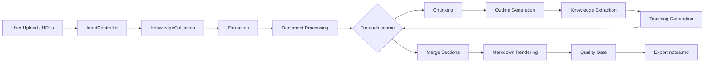

### Progress Milestones

| Progress % | Stage |
|------------|-------|
| 2% | Pipeline started |
| 5% | Extraction |
| 8% | Document processing |
| 10–78% | Per-source chunking + AI (proportional) |
| 78% | Merge sections |
| 85% | Markdown rendering |
| 90% | Quality checks |
| 95% | Export |
| 100% | Complete |

> [!NOTE]
> Sources with fewer than **200 characters** of extractable text are marked as `FAILED` and receive a placeholder section in the output rather than blocking the entire pipeline.

---

## 4. Application Bootstrap & Configuration

These files run before any request is handled. They load environment variables, validate API keys, and create the Flask application.

### `run.py`

The application entry point. Imports `create_app()` from the app factory and starts the Flask development server.

- **Host:** `0.0.0.0` (accessible on the local network)
- **Port:** Configurable via `PORT` env var (default `5000`)
- **Debug:** Enabled when `FLASK_DEBUG=1`
- **Reloader:** Disabled (`use_reloader=False`) to prevent double-initialization during development

### `config.py`

Central configuration loaded from a `.env` file via `python-dotenv`.

| Variable | Purpose | Default |
|----------|---------|---------|
| `GROQ_API_KEY` | Groq API authentication | — (required) |
| `GEMINI_API_KEY` | Google Gemini API authentication | — (required) |
| `LLM_PROVIDER` | Default LLM provider | `groq` |
| `FAST_MODEL` | Groq fast model for outline/extraction | `llama-3.3-70b-versatile` |
| `GEMINI_FAST_MODEL` | Gemini fast model | `gemini-3.1-flash-lite` |
| `REASONING_MODEL` | Groq reasoning model for teaching | `openai/gpt-oss-120b` |

`Config.validate()` raises a `RuntimeError` at startup if either API key is missing, ensuring the application fails fast rather than mid-pipeline.

### `app/__init__.py`

The **Flask application factory** (`create_app()`):

1. Calls `Config.validate()`
2. Creates a `Flask` instance
3. Loads config via `app.config.from_object(Config)`
4. Registers the `main_bp` blueprint from `app.routes.main`

This factory pattern allows clean testing and deployment (e.g., with Gunicorn).

### `requirements.txt`

Python dependencies:

| Package | Role |
|---------|------|
| `Flask` | Web framework |
| `python-dotenv` | Environment variable loading |
| `groq` | Groq LLM API client |
| `google-genai` | Google Gemini API client |
| `PyMuPDF` | PDF text extraction |
| `python-docx` | Word document parsing |
| `python-pptx` | PowerPoint parsing |
| `youtube-transcript-api` | YouTube transcript fetching |
| `trafilatura` | Web page content extraction |
| `tenacity` | Retry logic for API calls |
| `gunicorn` | Production WSGI server |

---

## 5. Web Layer — Routes & Controllers

### `app/routes/main.py`

Defines the Flask blueprint with three routes:

| Route | Method | Purpose |
|-------|--------|---------|
| `/` | GET | Serves the upload UI (`index.html`) |
| `/about` | GET | Serves the about page (`about.html`) |
| `/process` | POST | Runs the full pipeline |

The `/process` endpoint supports two response modes:

1. **Standard form submission** — Consumes the entire generator silently, then returns the file as a download attachment (`notes.md`).
2. **XHR/AJAX streaming** — Detected via `X-Requested-With: XMLHttpRequest`. Streams JSON lines with progress updates, then sends the final Markdown content inline:

```json
{"pct": 45, "msg": "Teaching: Gradient Descent", "title": "Gradient Descent"}
{"type": "file", "content": "# Study Notes...", "filename": "notes.md"}
```

> [!TIP]
> The generator-based progress reporting is implemented by yielding tuples from `PipelineService.process()` and catching `StopIteration.value` for the final return value — a clean Python pattern for streaming progress from deep in the call stack.

### `app/controllers/input_controller.py`

The **request preparation layer**. Does not modify content — only converts HTTP input into domain objects.

**Workflow:**

1. Creates an empty `KnowledgeCollection`
2. Ensures an `uploads/` directory exists
3. Iterates uploaded files:
   - Sanitizes filenames with `secure_filename()`
   - Saves to disk
   - Creates a `KnowledgeSource` via `SourceFactory.from_upload_file()`
   - Stores the file path in `source.metadata["path"]`
4. Parses newline-separated URLs from the form
   - Creates sources via `SourceFactory.from_url()`
   - Stores the URL in `source.metadata["url"]`
5. Delegates to `PipelineService.process()`

### `app/controllers/source_factory.py`

A **factory class** that maps raw inputs to typed `KnowledgeSource` objects.

**File uploads** — Extension-to-enum mapping:

```
.pdf  → SourceType.PDF
.docx → SourceType.DOCX
.pptx → SourceType.PPTX
.txt  → SourceType.TXT
```

Unsupported extensions raise `ValueError`.

**URLs** — Heuristic routing:

- Contains `youtube.com` or `youtu.be` → `SourceType.YOUTUBE`
- All other URLs → `SourceType.WEBPAGE`

---

## 6. Frontend User Interface

Synapse's frontend is a **self-contained, single-page product UI** built entirely in HTML, CSS, and JavaScript — embedded directly inside two Flask Jinja templates with no external frontend framework, build step, or npm dependency tree.

| File | Route | Purpose |
|------|-------|---------|
| `app/templates/index.html` | `/` | Main landing page, upload form, and generation UI |
| `app/templates/about.html` | `/about` | Product story, architecture overview, and author page |

Both templates share a unified design system (CSS custom properties, Inter + JetBrains Mono typography, light/dark themes) and are served as static HTML by Flask's `render_template()`.

### AI-Assisted Frontend Development

> [!IMPORTANT]
> **The entire frontend UI was built with LLM assistance — primarily Claude — by a developer who does not write HTML, CSS, or JavaScript by hand.** Synapse's author focused on the Python backend pipeline; the visual product layer was produced through iterative AI collaboration rather than manual frontend engineering.

This approach worked efficiently because:

1. **The author defined intent, not implementation** — Descriptions like *"a cream-and-green landing page with a drag-and-drop upload zone and a streaming progress bar"* were translated into production-quality markup and styles by the LLM, without requiring knowledge of CSS flexbox, `@property` animations, or the Fetch Streams API.

2. **Backend contracts were already fixed** — The Python pipeline exposed a clear API surface (`POST /process` with `FormData`, JSON-line streaming via `X-Requested-With: XMLHttpRequest`). The LLM could wire the frontend to match this contract precisely, including edge cases like partial stream buffering and client-side file download via `Blob` URLs.

3. **Iterative refinement replaced framework knowledge** — Instead of learning React, Tailwind, or a component library, the developer described visual changes (*"make the hero parallax softer"*, *"add an ETA to the progress bar"*, *"toggle between Gemini and Llama"*) and the LLM applied targeted edits to the existing template.

4. **Single-file architecture reduced complexity** — Keeping all CSS and JS inline inside each template meant no webpack config, no module bundler, and no separate frontend repo. The LLM could read and modify the entire UI context in one pass.

5. **Design quality without a designer** — Claude produced a polished product aesthetic: mesh gradient backgrounds, animated SVG neural-network branding, scroll-reveal animations, bento-grid feature cards, and accessible dark mode — all from natural-language direction.

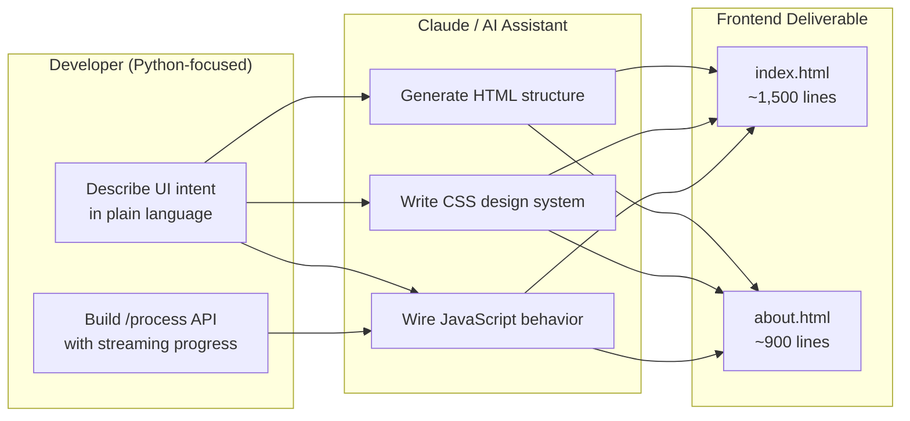

> [!TIP]
> This pattern — **backend-first development with LLM-generated UI** — is viable for solo developers and small products where the interface is a thin wrapper around a powerful server-side pipeline. The key is defining stable API contracts on the backend first, then describing the UX to the LLM in terms of user actions and server responses.

### Design System

Both templates use a shared CSS variable palette defined in `:root`:

| Token | Light Mode | Purpose |
|-------|------------|---------|
| `--cream` | `#F4EBDD` | Page background |
| `--green` | `#2D6A4F` | Primary brand color |
| `--gold` | `#D4A373` | Accent highlights |
| `--ink` | `#1A1A1A` | Body text |
| `--synapse-gradient` | Green gradient | Buttons, badges, headings |

Dark mode is toggled via a `data-theme="dark"` attribute on `<html>`, with a full alternate palette. The theme preference persists in `localStorage`.

Typography uses **Inter** for body text and **JetBrains Mono** for code-like elements, loaded from Google Fonts.

Visual effects include:

- **Mesh blob background** — Animated gradient orbs with parallax on mouse movement
- **Grain overlay** — SVG noise texture for depth
- **Custom cursor glow** — Radial gradient following the pointer (desktop only)
- **Scroll-reveal animations** — Intersection Observer adds `.in-view` class to elements
- **Reduced-motion support** — `@media (prefers-reduced-motion: reduce)` disables animations

### `index.html` — Main Application Page

The index page is structured as a vertical landing page with six functional zones:

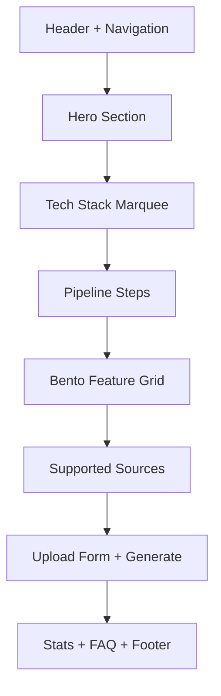

#### Page Sections

| Section | ID | Content |
|---------|-----|---------|
| **Hero** | — | Headline, CTA buttons, animated SVG synapse network, mock note preview card |
| **Marquee** | — | Scrolling tech stack badges (Groq, Gemini, Obsidian, Flask, Mermaid, LaTeX) |
| **How It Works** | `#process` | Four step cards: Upload → Analyze → Generate → Download |
| **Why Synapse** | `#why` | Bento grid explaining pipeline differentiators |
| **Supported Sources** | `#sources` | Icon grid for all six input types |
| **Upload Form** | `#upload` | File dropzone, URL textarea, model toggle, generate button |
| **Stats** | — | Animated counters (sources processed, topics generated) |
| **FAQ** | — | Accordion with common questions |

#### Upload Form — Backend Integration

The upload form is the critical bridge between the UI and the Python pipeline:

```html
<form action="/process" method="POST" enctype="multipart/form-data" id="uploadForm">
```

**Input controls:**

| Control | Element | Backend field |
|---------|---------|---------------|
| File dropzone | `#dropzone` + `#fileInput` | `files` (multipart, multiple) |
| URL textarea | `#urlInput` | `urls` (newline-separated) |
| Model toggle | `#modelToggle` | `fast_model` (`gemini` or `llama`) |

**JavaScript behavior (inline `<script>`):**

1. **Drag-and-drop file management** — Files are held in a client-side `filesArr` array (not native form state), rendered as removable chips, and appended to `FormData` on submit
2. **Validation** — Blocks submission if both files and URLs are empty; shows inline error state
3. **Streaming fetch** — Posts to `/process` with `X-Requested-With: XMLHttpRequest` header
4. **Progress parsing** — Reads the response body as a stream, splits on newlines, parses each JSON line:
   - `{"pct": 45, "msg": "Teaching: ...", "title": "..."}` → updates progress bar and status text
   - `{"type": "file", "content": "...", "filename": "notes.md"}` → triggers download
5. **ETA calculation** — Estimates remaining time from progress rate between updates
6. **Client-side download** — Creates a `Blob` from the Markdown content and triggers an `<a download>` click — no server round-trip for the file

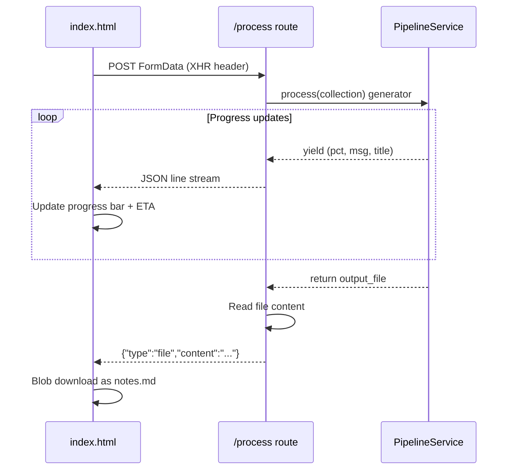

#### Interactive Features

| Feature | Implementation |
|---------|----------------|
| Dark/light theme | Toggle button → `data-theme` attribute + `localStorage` |
| Mobile navigation | Hamburger menu with slide-out panel |
| FAQ accordion | Click to expand/collapse with `maxHeight` animation |
| Stat counters | Intersection Observer triggers animated count-up |
| 3D card tilt | Mouse position → `rotateX`/`rotateY` on step/bento cards |
| Hero parallax | Scroll position → translateY on hero visual |
| Model selector | Toggle buttons update hidden `fast_model` input |

### `about.html` — Product & Story Page

The about page reuses the same design system and header/footer but focuses on narrative content:

| Section | Content |
|---------|---------|
| **Hero** | *"Built to teach, not just summarize"* |
| **Architecture** | Visual pipeline diagram: Document → Outline → Topics → Extract → Teach → Merge |
| **Story** | Five-phase development timeline |
| **About the Author** | Personal background and motivation |
| **CTA** | Link back to the upload form on the index page |

This page was also AI-generated to match the index page's visual language, ensuring brand consistency without manual CSS work.

### Frontend ↔ Backend Contract

The frontend and backend communicate through a deliberately simple contract:

| Aspect | Frontend sends | Backend returns |
|--------|---------------|-----------------|
| **Request format** | `multipart/form-data` via `FormData` | — |
| **Streaming trigger** | Header: `X-Requested-With: XMLHttpRequest` | Newline-delimited JSON |
| **Progress lines** | — | `{"pct": int, "msg": str, "title": str}` |
| **Final payload** | — | `{"type": "file", "content": str, "filename": str}` |
| **Non-streaming fallback** | No XHR header | Direct file download attachment |

> [!NOTE]
> The frontend contains **no business logic** — it does not chunk text, call LLMs, or process Markdown. It is purely a presentation and I/O layer. All intelligence lives in the Python pipeline, which makes the UI replaceable (CLI, API, browser extension) without changing core functionality.

### Accessibility & Responsiveness

Both templates include:

- Semantic HTML landmarks (`<header>`, `<main>`, `<section>`, `<footer>`)
- `aria-label` attributes on interactive elements (dropzone, remove buttons)
- Keyboard support on the dropzone (`Enter` / `Space` to open file picker)
- `:focus-visible` outlines for keyboard navigation
- `prefers-reduced-motion` media query disabling animations
- Responsive layout with mobile breakpoints (collapsing navigation, stacked upload panels)
- Viewport meta tag for mobile scaling

---

## 7. Domain Models

These dataclasses form the typed backbone of the pipeline. Data flows through them at every stage.

### `app/models/enums.py`

Three enumerations:

**`SourceType`** — Identifies the input format (`youtube`, `webpage`, `pdf`, `docx`, `pptx`, `txt`).

**`ProcessingStatus`** — Tracks lifecycle state:

```
PENDING → EXTRACTING → EXTRACTED → PREPROCESSED → CHUNKED → COMPLETED
                                                              ↘ FAILED
```

**`BlockType`** — Defines semantic block types for structured content (heading, paragraph, bullets, code, formula, diagram, warning, tip, example, table, quote). Reserved for future structured rendering.

### `app/models/knowledge_source.py`

Represents a **single input source** (one file or one URL).

| Field | Type | Description |
|-------|------|-------------|
| `source_type` | `SourceType` | Format identifier |
| `title` | `str` | Filename or URL |
| `raw_content` | `str` | Extracted and cleaned text |
| `metadata` | `dict` | Path, URL, word count, token estimate |
| `status` | `ProcessingStatus` | Current pipeline state |
| `error` | `Optional[str]` | Failure reason |
| `id` | `str` | UUID |

Each uploaded file or URL becomes one `KnowledgeSource`.

### `app/models/knowledge_collection.py`

A **container** holding all sources from a single user request.

| Field | Type | Description |
|-------|------|-------------|
| `sources` | `list[KnowledgeSource]` | All input sources |
| `topic` | `str` | Optional topic label |
| `status` | `ProcessingStatus` | Aggregate status |
| `created_at` | `datetime` | Creation timestamp |
| `id` | `str` | UUID |

One-to-many relationship: one collection, many sources.

---

## 8. Stage 1 — Ingestion & Extraction

Ingestion is the first processing stage. It converts binary files and remote URLs into plain text stored in `KnowledgeSource.raw_content`.

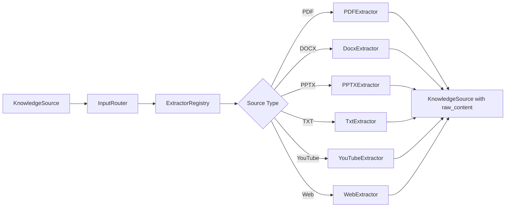

### `app/services/extraction_service.py`

Orchestrates extraction across all sources in a collection:

1. Sets each source's status to `EXTRACTING`
2. Routes to the correct extractor via `InputRouter`
3. Copies extracted text into `source.raw_content`
4. Validates minimum content length (200 characters)
5. Sets status to `EXTRACTED` or `FAILED`

Errors are caught per-source — one failed PDF does not abort the entire batch.

### `app/ingestion/router.py`

Thin routing layer. Receives a `KnowledgeSource`, looks up the extractor from `ExtractorRegistry`, and calls `extractor.extract(source)`.

### `app/ingestion/registry.py`

**Registry pattern** mapping `SourceType` enum values to singleton extractor instances:

```python
{
    SourceType.PDF:     PDFExtractor(),
    SourceType.DOCX:    DocxExtractor(),
    SourceType.PPTX:    PPTXExtractor(),
    SourceType.YOUTUBE: YouTubeExtractor(),
    SourceType.WEBPAGE: WebExtractor(),
    SourceType.TXT:     TxtExtractor(),
}
```

Adding a new input format requires: create an extractor, register it here.

### `app/ingestion/base_extractor.py`

Abstract base class (`ABC`) defining the extractor contract:

```python
@abstractmethod
def extract(self, source: KnowledgeSource) -> KnowledgeSource
```

All extractors must populate `source.raw_content` and return the modified source.

### Extractors

#### `app/ingestion/extractors/pdf_extractor.py`

Uses **PyMuPDF** (`fitz`) to open the PDF from `source.metadata["path"]`, iterate every page, and concatenate `page.get_text()` output.

#### `app/ingestion/extractors/docx_extractor.py`

Uses **python-docx** to read all paragraph texts from a Word document and join them with newlines.

#### `app/ingestion/extractors/pptx_extractor.py`

Uses **python-pptx** to iterate all slides and shapes, collecting text from any shape that has a `.text` attribute.

#### `app/ingestion/extractors/txt_extractor.py`

Reads the file at `source.metadata["path"]` with UTF-8 encoding. The simplest extractor — direct file read.

#### `app/ingestion/extractors/youtube_extractor.py`

Fetches YouTube video transcripts:

1. **`extract_video_id_from_url()`** — Parses video IDs from both `youtu.be/ID` and `youtube.com/watch?v=ID` formats
2. **`YouTubeTranscriptApi().fetch(video_id)`** — Retrieves transcript data
3. **`TextFormatter().format_transcript()`** — Converts to plain text
4. Replaces newlines with spaces for continuous prose

> [!WARNING]
> YouTube extraction depends on captions being available for the video. Videos without transcripts will fail extraction.

#### `app/ingestion/extractors/web_extractor.py`

Uses **Trafilatura** for intelligent web content extraction:

1. `trafilatura.fetch_url(url)` — Downloads HTML
2. `trafilatura.extract(html)` — Extracts main article content, stripping navigation, ads, and boilerplate

Raises `ValueError` if the URL cannot be downloaded.

---

## 9. Stage 2 — Document Processing

After extraction, raw text passes through cleaning and metadata enrichment before chunking.

### `app/processing/document_processor.py`

Orchestrates three sub-processors for each source in the collection:

1. **Clean** text via `TextCleaner`
2. **Enrich** metadata via `MetadataExtractor`
3. **Estimate** tokens via `TokenEstimator`

### `app/processing/cleaners.py`

**`TextCleaner`** normalizes whitespace to reduce token waste:

| Operation | Pattern | Result |
|-----------|---------|--------|
| Line endings | `\r` | `\n` |
| Excessive newlines | `\n{3,}` | `\n\n` |
| Whitespace runs | `[ \t]+` | single space |
| Trim | leading/trailing | stripped |

### `app/processing/metadata.py`

**`MetadataExtractor`** adds computed fields to `source.metadata`:

- `character_count` — Length of raw content
- `word_count` — Split on whitespace count

### `app/processing/token_estimator.py`

**`TokenEstimator`** provides a rough token count using the rule of thumb: **1 token ≈ 4 characters** of English text (`len(text) // 4`). Used for metadata and chunk sizing decisions.

---

## 10. Stage 3 — Chunking

Large documents must be split into segments that fit within LLM context windows. Chunking enables the outline generator to reference specific portions of the source material.

### `app/chunking/chunk.py`

Dataclass representing a single chunk:

| Field | Type | Description |
|-------|------|-------------|
| `id` | `int` | 1-based chunk identifier |
| `text` | `str` | Chunk content |
| `estimated_tokens` | `int` | Approximate token count |

### `app/chunking/chunker.py`

**`Chunker`** splits text by words with a configurable `max_tokens` (default **1200**).

**Algorithm:**

1. Split text into words
2. Accumulate words into the current chunk, estimating ~4 chars per token per word
3. When adding the next word would exceed `max_tokens`, finalize the current chunk and start a new one
4. Append any remaining words as the final chunk

Chunk IDs are 1-based and sequential. The chunker logs chunk count and per-chunk token estimates to stdout.

### `app/services/chunking_service.py`

Thin wrapper around `Chunker`. Accepts a `KnowledgeSource` and returns `chunker.chunk(source.raw_content)`.

---

## 11. Stage 4 — AI Generation

The AI stage is the most complex part of Synapse. For each valid source, it runs a **four-step AI workflow**: outline → extraction → teaching → (later) merge.

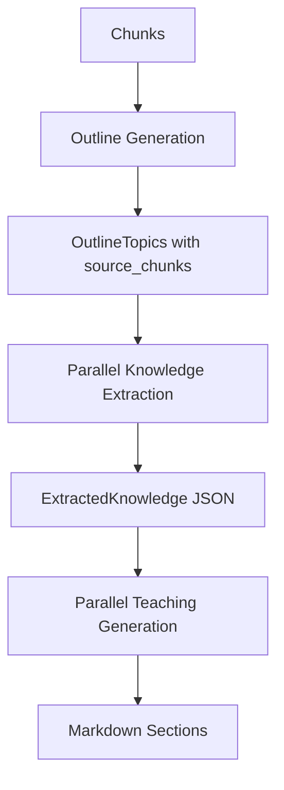

### `app/services/ai_service.py`

The **central AI orchestrator**. Manages two LLM providers, rate limiting, parallel execution, and the full generate-merge workflow.

#### Key Methods

| Method | Purpose |
|--------|---------|
| `generate_outline(chunks, fast_model)` | Creates topic plan with chunk mappings |
| `generate_from_chunks(chunks, outline, fast_model)` | Runs extraction + teaching in parallel |
| `merge_sections(sections, connections_info)` | Combines sections with transitions and structure |
| `repair_block(broken_block, category, message)` | Fixes individual Markdown issues |

#### Outline Generation — Segmented for Large Documents

When a source produces more than 20 chunks, outline generation splits into segments:

- Number of segments: `min(5, max(2, (total + 10) // 20))`
- Each segment generates its own outline
- Chunk indices are offset-adjusted to maintain global numbering

Topic count scales with chunk count:

| Chunks | Min Topics | Max Topics |
|--------|------------|------------|
| ≤ 8 | 3 | 5 |
| ≤ 20 | 5 | 9 |
| ≤ 40 | 8 | 13 |
| > 40 | 12 | 18 |

#### Parallel Execution Strategy

**Extraction phase** — `ThreadPoolExecutor(max_workers=3)`:
- Each outline topic gets its own extraction call
- Results stored at their original index (order preserved despite async completion)

**Teaching phase** — `ThreadPoolExecutor(max_workers=2)`:
- Uses Groq's reasoning model (`REASONING_MODEL`) by default
- Falls back through: OSS-120B → Llama 3.3 70B → Gemini Flash Lite on rate limits

#### Model Fallback Chain (Teaching)

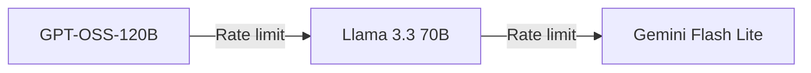

#### Groq TPM Rate Limiting

Synapse implements a **sliding-window token tracker** per Groq model:

| Model | TPM Limit |
|-------|-----------|
| `llama-3.3-70b-versatile` | 12,000 |
| `openai/gpt-oss-120b` | 8,000 |

Before each Groq call, `_wait_for_groq_tpm()` checks if the last 60 seconds of usage exceeds 90% of the limit. If so, it sleeps until the window clears.

### LLM Clients

#### `app/llm/client.py` — GroqClient

Wraps the Groq SDK with:

- **Retry logic** via `tenacity` (5 attempts, exponential backoff 2–30s)
- System + user message formatting
- Optional `max_tokens` parameter
- Usage tracking (prompt, completion, total tokens)
- Strips `<think>` tags from model output

#### `app/llm/gemini_client.py` — GeminiClient

Mirrors GroqClient for Google's Gemini API:

- Uses `google.genai.Client` with `GenerateContentConfig`
- System instruction via `system_instruction` parameter
- Same retry, usage tracking, and thinking-tag stripping

### LLM Data Models

#### `app/llm/models.py`

| Class | Purpose |
|-------|---------|
| `LLMRequest` | System prompt, user prompt, optional max_tokens |
| `LLMResponse` | Raw output, optional parsed output, usage dict |
| `PromptContext` | Source type, chunk index, document title (reserved) |
| `OutlineSection` | Title, summary, chunk indices (legacy) |
| `Outline` | List of outline sections (legacy) |

#### `app/llm/knowledge_models.py`

**`ExtractedKnowledge`** — Structured dataclass with 16 fields representing everything the extraction prompt asks for:

```
concepts, definitions, mechanisms, algorithms, reasoning, intuition,
why_it_matters, examples, important_details, common_misconceptions,
prerequisites, connections, formulas, pitfalls, summary, coverage
```

The `coverage` field (`thin` | `adequate` | `rich`) controls how much the teaching prompt elaborates.

### Prompt Construction

#### `app/llm/prompt_builder.py`

Assembles `LLMRequest` objects for each pipeline stage:

| Method | Prompt Used | Purpose |
|--------|-------------|---------|
| `build_outline(chunks)` | `OUTLINE_PROMPT` | Topic planning |
| `build_extraction(text)` | `EXTRACTION_PROMPT` | Structured knowledge extraction |
| `build_teaching(...)` | `TEACHING_PROMPT` | Study note writing |
| `build_transition(prev, next)` | `TRANSITION_PROMPT` | Section bridges |
| `build_document_structure(doc, words)` | `DOCUMENT_STRUCTURE_PROMPT` | TOC, glossary, sources |

Dynamic topic count ranges are injected into the outline prompt based on chunk count.

### Response Parsers

#### `app/llm/outline_parser.py`

Parses the LLM's outline response into `OutlineTopic` objects:

```python
@dataclass
class OutlineTopic:
    title: str
    description: str
    role: str          # Motivation | Intuition | Mechanism | Procedure | Example | Edge Case | Takeaway
    source_chunks: list[int]  # 1-based chunk references, supports ranges (e.g., "1, 3-5")
```

The parser handles comma-separated chunk lists and hyphenated ranges (e.g., `Source Chunks: 1, 3-5, 8` → `[1, 3, 4, 5, 8]`).

#### `app/llm/extraction_parser.py`

Parses JSON output from the extraction LLM call into an `ExtractedKnowledge` dataclass. Returns an empty `ExtractedKnowledge()` on parse failure (graceful degradation).

---

## 12. Stage 5 — Merge & Document Structure

After all sources are processed, individual teaching sections are merged into a cohesive document.

### Merge Workflow (`AIService.merge_sections`)

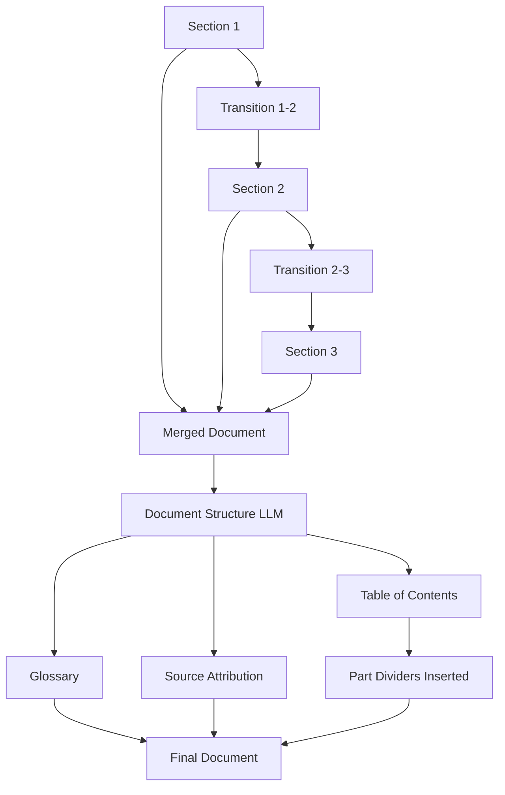

**Steps:**

1. **Transitions** — For each adjacent section pair, Gemini generates a one-sentence bridge using the last 100 words of the previous section and the first 100 words of the next
2. **Concatenation** — Sections joined with transitions interleaved
3. **Document structure** — Gemini generates:
   - Grouped TOC with Roman-numeral parts (`---TOC---` markers)
   - Master glossary table (`---GLOSSARY---` markers)
   - Source attribution line (`---SOURCES---` markers)
4. **Part dividers** — Programmatic insertion of `# ▣ Part I: Label` dividers based on TOC grouping
5. **Subheading renumbering** — H3 headings under parts get numbered (e.g., `### 1.1 — Title`)
6. **Content preservation check** — If merged word count drops below 85% of teaching total, falls back to raw concatenation

> [!IMPORTANT]
> The merge stage explicitly sets `target_words = teaching_words` to prevent the LLM from summarizing or trimming content during structure generation.

---

## 13. Stage 6 — Rendering & Quality Assurance

### `app/rendering/markdown_renderer.py`

**`MarkdownRenderer`** applies a deterministic chain of post-processing fixes optimized for Obsidian rendering. Order matters — earlier fixes may create patterns that later fixes handle.

| Step | Method | Fix |
|------|--------|-----|
| 1 | `_wrap_naked_mermaid` | Wrap bare `mermaid` lines in code fences |
| 2 | `_strip_fences` | Remove document-level ` ```markdown ` wrappers |
| 3 | `_strip_math_fences` | Remove ` ```latex ` / ` ```math ` around equations |
| 4 | `_strip_mermaid_live_links` | Remove dead mermaid.live image URLs |
| 5 | `_fix_latex_delimiters` | Convert `\[...\]` → `$$...$$`, `\(...\)` → `$...$` |
| 6 | `_cleanup_latex` | Fix stray backslashes |
| 7 | `_fix_math_notation` | Replace Unicode math chars with LaTeX |
| 8 | `_normalize_headings` | Demote multiple H1s to H2s |
| 9 | `_flatten_heading_depth` | Cap heading depth at H3 |
| 10 | `_fix_mermaid_nodes` | Fix nested brackets in Mermaid labels |
| 11 | `_fix_callouts` | Fix `**[!type]**` → `[!type]` |
| 12 | `_fix_heading_callouts` | Separate embedded callouts from headings |
| 13 | `_fix_wiki_links` | Fuzzy-match broken `[[#...]]` links to headings |
| 14 | `_collapse_blank_lines` | Reduce 3+ blank lines to 2 |

### `app/rendering/linter.py`

**`MarkdownLinter`** detects issues in three categories:

| Category | Checks |
|----------|--------|
| **Mermaid** | Empty blocks, unbalanced brackets/braces/parens/quotes, missing xychart-beta fields |
| **Math** | Unbalanced `$` delimiters, Unicode math in LaTeX blocks, formulas trapped in code backticks |
| **Wiki links** | `[[#Target]]` references that don't match any heading |

Each issue is a `LintIssue` dataclass with severity (`error` | `warning`), category, message, line number, character range, and the offending block text.

### `app/services/quality_gate.py`

**`QualityGate`** is the final inspection stage:

1. **Mermaid validation** — Attempts to render each diagram via `npx @mermaid-js/mermaid-cli` (mmdc). Falls back to bracket-balance heuristics if mmdc is unavailable
2. **AI repair** — Broken diagrams are sent to `AIService.repair_block()` with the `REPAIR_PROMPT`
3. **Stripping** — Diagrams that fail repair are removed entirely
4. **Linting** — Runs `MarkdownLinter` on the full document
5. **Error repair** — Lint errors trigger targeted AI repairs via `repair_block()`, with safeguards:
   - Skips repairs covering >50% of the document
   - Skips repairs with empty block content
   - Processes issues in reverse order to preserve character offsets

---

## 14. Stage 7 — Export

### `app/services/export_service.py`

**`ExportService`** writes the final Markdown to disk:

- **Output directory:** `app/outputs/` (created if missing)
- **Filename:** `{filename}.md` (default: `notes.md`)
- **Encoding:** UTF-8

Returns the `Path` object, which the pipeline yields back to the route handler for download.

---

## 15. LLM Provider Strategy & Rate Limiting

Synapse uses a **dual-provider strategy** to balance speed, quality, and cost:

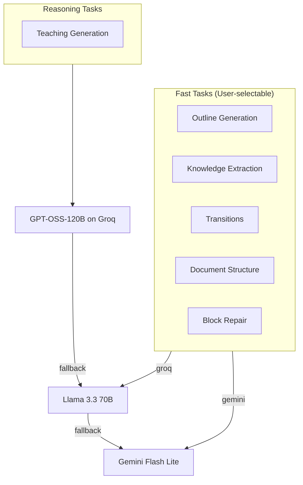

| Task | Primary Model | Provider | Fallback |
|------|--------------|----------|----------|
| Outline | User choice | Gemini or Groq | — |
| Extraction | User choice | Gemini or Groq | — |
| Teaching | GPT-OSS-120B | Groq | Llama 3.3 → Gemini |
| Transitions | Gemini Flash Lite | Gemini | — |
| Document structure | Gemini Flash Lite | Gemini | — |
| Block repair | User choice | Gemini or Groq | — |

> [!TIP]
> The user selects the fast model (`gemini` or `groq`) via the frontend. Teaching always attempts the reasoning model first for higher-quality prose.

---

## 16. Prompt Engineering Reference

All prompts inherit from a shared base role defined in `app/llm/prompts/base.py`:

> Expert educator, technical writer, and instructional designer. Transform educational material into accurate, well-structured learning resources. Never invent facts. Preserve technical accuracy. Prioritize clarity.

### Prompt Files

| File | Role | Output Format |
|------|------|---------------|
| `prompts/base.py` | Shared `BASE_ROLE` persona | — |
| `prompts/outline.py` | Topic planning with chunk mapping | Structured text (Title, Description, Role, Source Chunks) |
| `prompts/extraction.py` | Structured knowledge preservation | JSON (`ExtractedKnowledge` schema) |
| `prompts/teaching.py` | Human-friendly study note writing | Raw Markdown with LaTeX, Mermaid, callouts |
| `prompts/transition.py` | One-sentence section bridges | Plain text |
| `prompts/document_structure.py` | TOC, glossary, source attribution | Marker-delimited sections |
| `prompts/repair.py` | Targeted Markdown fixes | Corrected block only |
| `prompts/__init__.py` | Re-exports all prompt constants | — |

### Teaching Prompt Highlights

The teaching prompt (`prompts/teaching.py`) is the most detailed, specifying:

- **Voice:** Conversational, friend-over-coffee tone
- **Math:** LaTeX delimiters, no code-fenced math, `\boxed{}` for key formulas
- **Diagrams:** Mermaid with plain-alphanumeric node labels only
- **Callouts:** 10 Obsidian callout types with exact formatting
- **Structure:** Worked examples, comparison tables, intuition patterns
- **Coverage-aware elaboration:** Respects the `thin`/`adequate`/`rich` signal
- **Internal links:** `[[#Exact Heading]]` wiki links to prior sections

---

## 17. Data Flow Diagrams

### Single-Source Processing

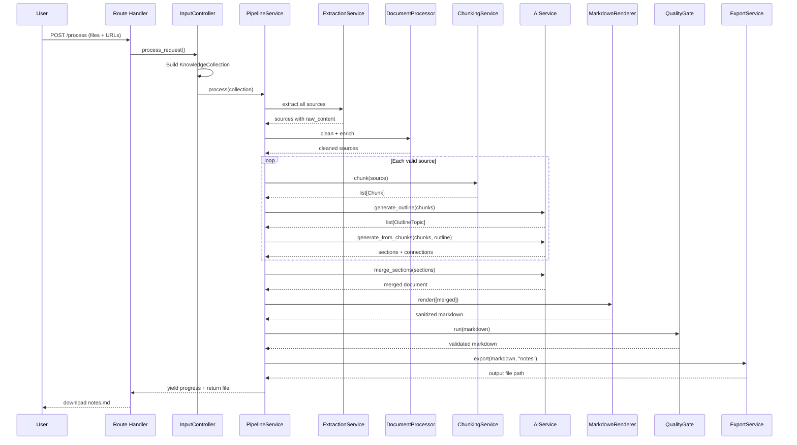

### Knowledge Extraction → Teaching Flow

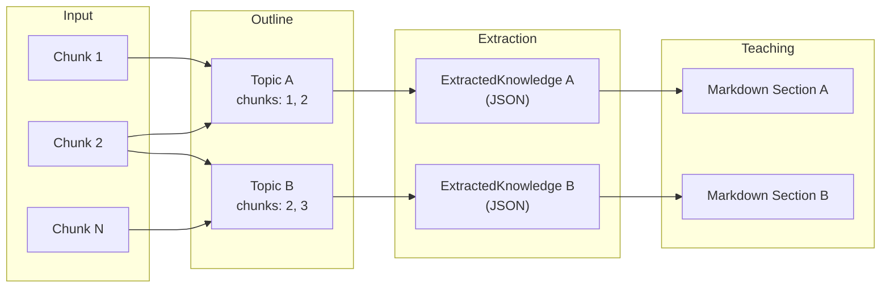

---

## 18. File Reference Index

Complete file listing organized by pipeline stage.

### Root

| File | Stage | Description |
|------|-------|-------------|
| `run.py` | Bootstrap | Application entry point |
| `config.py` | Bootstrap | Environment configuration and validation |
| `requirements.txt` | Bootstrap | Python dependencies |

### Application Core

| File | Stage | Description |
|------|-------|-------------|
| `app/__init__.py` | Bootstrap | Flask app factory |
| `app/routes/main.py` | Web | HTTP routes and streaming response |
| `app/controllers/input_controller.py` | Input | Request → KnowledgeCollection conversion |
| `app/controllers/source_factory.py` | Input | File/URL → KnowledgeSource factory |

### Models

| File | Stage | Description |
|------|-------|-------------|
| `app/models/enums.py` | Domain | SourceType, ProcessingStatus, BlockType enums |
| `app/models/knowledge_source.py` | Domain | Single source dataclass |
| `app/models/knowledge_collection.py` | Domain | Multi-source container dataclass |

### Ingestion

| File | Stage | Description |
|------|-------|-------------|
| `app/services/extraction_service.py` | Extraction | Extraction orchestrator |
| `app/ingestion/router.py` | Extraction | Extractor routing |
| `app/ingestion/registry.py` | Extraction | SourceType → Extractor mapping |
| `app/ingestion/base_extractor.py` | Extraction | Abstract extractor interface |
| `app/ingestion/extractors/pdf_extractor.py` | Extraction | PDF text extraction (PyMuPDF) |
| `app/ingestion/extractors/docx_extractor.py` | Extraction | Word document extraction |
| `app/ingestion/extractors/pptx_extractor.py` | Extraction | PowerPoint text extraction |
| `app/ingestion/extractors/txt_extractor.py` | Extraction | Plain text file reading |
| `app/ingestion/extractors/youtube_extractor.py` | Extraction | YouTube transcript fetching |
| `app/ingestion/extractors/web_extractor.py` | Extraction | Web page content extraction |

### Processing

| File | Stage | Description |
|------|-------|-------------|
| `app/processing/document_processor.py` | Processing | Clean + enrich orchestrator |
| `app/processing/cleaners.py` | Processing | Whitespace normalization |
| `app/processing/metadata.py` | Processing | Character/word count enrichment |
| `app/processing/token_estimator.py` | Processing | Token count estimation |

### Chunking

| File | Stage | Description |
|------|-------|-------------|
| `app/chunking/chunk.py` | Chunking | Chunk dataclass |
| `app/chunking/chunker.py` | Chunking | Word-based chunk splitting |
| `app/services/chunking_service.py` | Chunking | Chunking service wrapper |

### Pipeline & AI Services

| File | Stage | Description |
|------|-------|-------------|
| `app/services/pipeline_service.py` | Orchestration | Full pipeline generator |
| `app/services/ai_service.py` | AI | LLM orchestration, parallel execution, merge |
| `app/services/quality_gate.py` | QA | Mermaid validation, linting, AI repair |
| `app/services/export_service.py` | Export | Markdown file writing |

### LLM Layer

| File | Stage | Description |
|------|-------|-------------|
| `app/llm/client.py` | LLM | Groq API client with retry |
| `app/llm/gemini_client.py` | LLM | Gemini API client with retry |
| `app/llm/models.py` | LLM | LLMRequest, LLMResponse dataclasses |
| `app/llm/knowledge_models.py` | LLM | ExtractedKnowledge schema |
| `app/llm/prompt_builder.py` | LLM | Prompt assembly for all stages |
| `app/llm/outline_parser.py` | LLM | Outline response parser |
| `app/llm/extraction_parser.py` | LLM | JSON extraction response parser |
| `app/llm/prompts/base.py` | LLM | Shared AI persona |
| `app/llm/prompts/outline.py` | LLM | Outline generation prompt |
| `app/llm/prompts/extraction.py` | LLM | Knowledge extraction prompt |
| `app/llm/prompts/teaching.py` | LLM | Study note writing prompt |
| `app/llm/prompts/transition.py` | LLM | Section transition prompt |
| `app/llm/prompts/document_structure.py` | LLM | TOC/glossary/sources prompt |
| `app/llm/prompts/repair.py` | LLM | Markdown repair prompt |
| `app/llm/prompts/__init__.py` | LLM | Prompt re-exports |

### Rendering

| File | Stage | Description |
|------|-------|-------------|
| `app/rendering/markdown_renderer.py` | Rendering | Obsidian-compatible Markdown fixes |
| `app/rendering/linter.py` | QA | Mermaid, math, and wiki-link linting |

---

### Frontend

| File | Stage | Description |
|------|-------|-------------|
| `app/templates/index.html` | UI | Main landing page, upload form, streaming progress UI (AI-assisted) |
| `app/templates/about.html` | UI | Product story, architecture overview, author page (AI-assisted) |

---

*Documentation for Synapse v1.0 — August 2026*
