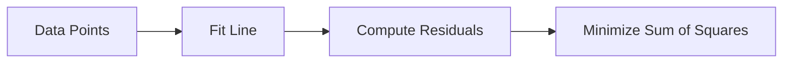

# Synapse

**Turn any learning material into polished, Obsidian-ready study notes — powered by AI.**

Synapse ingests PDFs, Word documents, PowerPoint slides, plain text, YouTube videos, and web pages, then generates structured Markdown study guides with LaTeX math, Mermaid diagrams, callouts, and internal navigation.

---

## Features

- **Multi-format ingestion** — Upload files or paste URLs; Synapse handles the rest
- **Intelligent chunking** — Large documents are split and mapped to topic outlines automatically
- **Two-stage AI pipeline** — Structured knowledge extraction followed by human-friendly teaching prose
- **Obsidian-optimized output** — LaTeX math, Mermaid diagrams, callouts, wiki links, and grouped navigation
- **Dual LLM providers** — Groq and Google Gemini with automatic fallback on rate limits
- **Quality assurance** — Mermaid validation, Markdown linting, and AI-powered block repair
- **Real-time progress** — Streaming progress updates during generation

---

## Supported Inputs

| Type | Formats |
|------|---------|
| Documents | `.pdf`, `.docx`, `.pptx`, `.txt` |
| Video | YouTube URLs (`youtube.com`, `youtu.be`) |
| Web | Any article or blog URL |

---

## Quick Start

### Prerequisites

- Python 3.11+
- [Groq API key](https://console.groq.com/)
- [Google Gemini API key](https://aistudio.google.com/apikey)
- Node.js (optional, for Mermaid diagram validation via `mmdc`)

### Installation

```bash
git clone https://github.com/your-username/Synapse.git
cd Synapse
python -m venv .venv

# Windows
.venv\Scripts\activate

# macOS / Linux
source .venv/bin/activate

pip install -r requirements.txt
```

### Configuration

Create a `.env` file in the project root:

```env
GROQ_API_KEY=your_groq_api_key
GEMINI_API_KEY=your_gemini_api_key

# Optional overrides
LLM_PROVIDER=groq
FAST_MODEL=llama-3.3-70b-versatile
GEMINI_FAST_MODEL=gemini-3.1-flash-lite
REASONING_MODEL=openai/gpt-oss-120b
PORT=5000
FLASK_DEBUG=1
```

### Run

```bash
python run.py
```

Open [http://localhost:5000](http://localhost:5000), upload your materials or paste URLs, and download your generated `notes.md`.

### Production Deployment

```bash
gunicorn -w 2 -b 0.0.0.0:5000 "run:app"
```

---

## How It Works

Synapse runs a seven-stage pipeline for every request:

```
Upload / URLs
    │
    ▼
① Extraction ──────── Pull text from PDFs, docs, videos, web pages
    │
    ▼
② Processing ──────── Clean whitespace, enrich metadata
    │
    ▼
③ Chunking ────────── Split into ~1200-token segments
    │
    ▼
④ AI Generation ───── Outline → Extract knowledge → Write study notes
    │
    ▼
⑤ Merge ───────────── Transitions, navigation, glossary, part dividers
    │
    ▼
⑥ Rendering & QA ──── Obsidian fixes, Mermaid validation, lint repair
    │
    ▼
⑦ Export ──────────── Download notes.md
```

Each source is processed independently through stages ③–④, then all sections are merged in stage ⑤.

> For the full technical breakdown — architecture diagrams, file-by-file reference, prompt engineering details, frontend UI, and data flow sequences — see **[Documentation.md](Documentation.md)**.

---

## Output Example

Generated notes include:

```markdown
## 🗺️ Navigation

### Part I: Linear Regression
- [[#Ordinary Least Squares]]
- [[#Gradient Descent]]

---

## Ordinary Least Squares

The goal is to find the line that minimizes the sum of squared residuals...

$$J(\theta) = \frac{1}{2m} \sum_{i=1}^{m} \left(h_\theta(x^{(i)}) - y^{(i)}\right)^2$$

> [!tip] **Why Squared?**
> Squaring makes errors positive and punishes large errors disproportionately.



---

## 📖 Glossary

| Term | Definition |
|------|------------|
| **Residual** | The difference between predicted and actual value |
| **Cost Function** | A measure of how wrong the model's predictions are |
```

---

## Project Structure

```
Synapse/
├── run.py                          # Application entry point
├── config.py                       # Environment configuration
├── requirements.txt                # Python dependencies
├── Documentation.md                # Full technical documentation
│
├── app/
│   ├── __init__.py                 # Flask app factory
│   ├── routes/
│   │   └── main.py                 # HTTP routes (/process streaming)
│   ├── controllers/
│   │   ├── input_controller.py     # Request → KnowledgeCollection
│   │   └── source_factory.py       # File/URL type detection
│   ├── models/
│   │   ├── enums.py                # SourceType, ProcessingStatus
│   │   ├── knowledge_source.py     # Single input source
│   │   └── knowledge_collection.py # Multi-source container
│   ├── ingestion/
│   │   ├── router.py               # Extractor routing
│   │   ├── registry.py             # SourceType → Extractor map
│   │   ├── base_extractor.py       # Abstract extractor
│   │   └── extractors/             # PDF, DOCX, PPTX, TXT, YouTube, Web
│   ├── processing/
│   │   ├── document_processor.py   # Clean + enrich orchestrator
│   │   ├── cleaners.py             # Whitespace normalization
│   │   ├── metadata.py             # Word/character counts
│   │   └── token_estimator.py      # Token estimation
│   ├── chunking/
│   │   ├── chunk.py                # Chunk dataclass
│   │   └── chunker.py              # Word-based splitting
│   ├── llm/
│   │   ├── client.py               # Groq API client
│   │   ├── gemini_client.py        # Gemini API client
│   │   ├── prompt_builder.py       # Prompt assembly
│   │   ├── outline_parser.py       # Outline response parser
│   │   ├── extraction_parser.py    # JSON knowledge parser
│   │   ├── models.py               # LLM request/response types
│   │   ├── knowledge_models.py     # ExtractedKnowledge schema
│   │   └── prompts/                # All LLM system prompts
│   ├── services/
│   │   ├── pipeline_service.py     # Full pipeline orchestrator
│   │   ├── extraction_service.py   # Extraction orchestrator
│   │   ├── chunking_service.py     # Chunking wrapper
│   │   ├── ai_service.py           # LLM orchestration + merge
│   │   ├── quality_gate.py         # Validation + AI repair
│   │   └── export_service.py       # File output
│   ├── rendering/
│   │   ├── markdown_renderer.py    # Obsidian-compatible fixes
│   │   └── linter.py               # Mermaid/math/wikilink linting
│   ├── templates/                  # Frontend HTML (index, about)
│   └── outputs/                    # Generated notes (gitignored)
│
├── uploads/                        # Temporary uploads (gitignored)
└── notes_test/                     # Sample output files
```

---

## Tech Stack

| Component | Technology |
|-----------|------------|
| Web framework | Flask 3.1 |
| LLM providers | Groq (Llama 3.3, GPT-OSS-120B), Google Gemini |
| PDF extraction | PyMuPDF |
| Document parsing | python-docx, python-pptx |
| YouTube transcripts | youtube-transcript-api |
| Web extraction | Trafilatura |
| Retry logic | Tenacity |
| Production server | Gunicorn |
| Output format | Markdown (Obsidian-compatible) |

---

## Configuration Reference

| Variable | Required | Default | Description |
|----------|----------|---------|-------------|
| `GROQ_API_KEY` | Yes | — | Groq API authentication |
| `GEMINI_API_KEY` | Yes | — | Google Gemini API authentication |
| `LLM_PROVIDER` | No | `groq` | Default LLM provider |
| `FAST_MODEL` | No | `llama-3.3-70b-versatile` | Groq model for outline/extraction |
| `GEMINI_FAST_MODEL` | No | `gemini-3.1-flash-lite` | Gemini model for fast tasks |
| `REASONING_MODEL` | No | `openai/gpt-oss-120b` | Groq model for teaching generation |
| `PORT` | No | `5000` | Server port |
| `FLASK_DEBUG` | No | — | Set to `1` for debug mode |

---

## LLM Model Strategy

Synapse assigns models by task complexity:

| Task | Model | Why |
|------|-------|-----|
| Outline planning | Fast (user choice) | Structured output, low creativity needed |
| Knowledge extraction | Fast (user choice) | JSON extraction, factual |
| Teaching / writing | Reasoning (GPT-OSS-120B) | High-quality prose, analogies, examples |
| Transitions | Gemini Flash Lite | Short, creative bridges |
| Document structure | Gemini Flash Lite | TOC and glossary generation |
| Block repair | Fast (user choice) | Targeted syntax fixes |

Teaching generation includes automatic fallback: **GPT-OSS-120B → Llama 3.3 70B → Gemini Flash Lite** on rate limit errors.

---

## Documentation

| Document | Description |
|----------|-------------|
| **[Documentation.md](Documentation.md)** | Complete technical reference — architecture, pipeline stages, every file explained, prompt engineering, data flow diagrams |

---

## License

This project is provided as-is for personal and educational use.

---

## Acknowledgments

Built with [Groq](https://groq.com/), [Google Gemini](https://deepmind.google/technologies/gemini/), [Flask](https://flask.palletsprojects.com/), and designed for [Obsidian](https://obsidian.md/) note-taking workflows.
