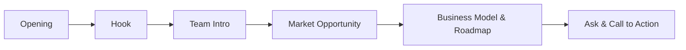

# EngiNova Pitch Deck Study Guide

---

## 📚 Navigation

**Part I — Foundations**  
[[#🏁 Why This Matters]] · [[#💡 Value Proposition & Market Opportunity]] · [[#🧑‍🤝‍🧑 Team Introduction]] · [[#📈 Market Opportunity Details]]  

**Part II — Pitch Structure**  
[[#📋 Pitch Flow Overview]] · [[#🎤 Delivery Tips]] · [[#💰 Deal Terms – Equity for Capital]] · [[#📊 Investment Deployment Strategy]] · [[#📉 Worked Example – Valuation Math]] · [[#⚠️ Common Misconceptions & Pitfalls]]  

**Part III — References**  
[[#📖 Glossary]] · [[#📚 Sources]]

---

## ## Part I — Foundations

### 🏁 Why This Matters

Investors aren’t just buying a piece of software; they’re buying a story about how a market can be reshaped. In the **$53 billion** engineering‑software arena, a clear **value proposition** and a vivid picture of the problem make the difference between a quick “nice idea” and a serious funding conversation. Framing the pitch around the mission **“Engineering Innovation Through Software”** signals why the market needs a fresh approach and why your team is the one to deliver it.

> [!tip] Think of the market as a stage. Your story (the pitch) is the spotlight that makes the audience (investors) focus on the problem you solve.

### 💡 Value Proposition & Market Opportunity

**Value Proposition** – Our AI‑and‑cloud‑powered platform cuts the cost of legacy engineering tools (e.g., Autodesk) by up to **40 %** while delivering faster simulations. This directly challenges the entrenched pricing models of legacy software.

**Market Opportunity** – The engineering‑software sector is a **$53 billion** market growing at **~18 % YoY**. Even a modest **5 %** share translates to **$2.6 billion** in addressable revenue.

- **Competitive Positioning** – By leveraging AI and cloud computing, we can offer subscription pricing that undercuts traditional perpetual‑license models.
- **R&D Focus** – **40 %** of our funding is earmarked for product development (R&D), ensuring a sustained technical edge.

> [!important] The strongest pitches tie the **value proposition** directly to a quantifiable market slice; numbers speak louder than adjectives.

### 🧑‍🤝‍🧑 Team Introduction

| Role            | Name          | Core Strengths |
|-----------------|---------------|----------------|
| **CEO**         | Parul Verma   | Vision, market strategy, investor relations |
| **CTO**         | Arib          | AI‑cloud architecture, product road‑mapping |
| **COO**         | Parth         | Scaling operations from small startups to large manufacturers |
| **Lead Engineer**| Uday          | Hands‑on development of core simulation tools |
| **Head of Sales**| Maya          | Enterprise sales, channel partnerships |

> [!tip] Present the team as the **engine** of a car: without a well‑tuned engine (founders), even the sleekest design (logo) won’t go far.

### 📈 Market Opportunity Details

- **Total Addressable Market (TAM):** $53 B (global engineering‑software spend).  
- **Serviceable Available Market (SAM):** $12 B (mid‑size manufacturers seeking cloud‑based tools).  
- **Serviceable Obtainable Market (SOM):** $600 M (first‑five‑year capture target).  

> [!warning] **Common mistake:** quoting only TAM can look unrealistic. Always break down to SAM and SOM to show a credible path.

---

## ## Part II — Pitch Structure

### 📋 Pitch Flow Overview

Think of the pitch as a short movie script: opening, hook, characters (team), plot (market), climax (ask). The flowchart below visualises the five beats that keep a 5‑minute pitch engaging.


*Five‑beat storyline for a compelling pitch.*

### 🎤 Delivery Tips

- **Walk up confidently** and pause for a beat before you speak – the silence is a tiny spotlight on you.  
- **Maintain eye contact** with the whole room, not just the front row.  
- **Introduce each founder** with name + one‑sentence superpower (e.g., “Parul Verma – the market visionary”).  

> [!tip] Slow down during the **hook** and the **final ask**. A measured pace lets key phrases settle in listeners’ heads.

### 💰 Deal Terms – Equity for Capital

| Term                | Description |
|---------------------|--------------|
| **Pre‑money valuation** | $20 M (based on comparable comps). |
| **Investment amount**   | $2 M seed round. |
| **Equity offered**      | 9 % (post‑money valuation = $22 M). |
| **Use‑of‑funds**        | R&D (40 %), Hiring (30 %), Marketing & Sales (20 %), Operating buffer (10 %). |

> [!note] The equity percentage is derived from:  $\text{Equity} = \frac{\text{Investment}}{\text{Pre‑money} + \text{Investment}}$.

### 📊 Investment Deployment Strategy

1. **R&D (40 %)** – Build core AI models, integrate cloud infrastructure, and create the MVP.  
2. **Talent acquisition (30 %)** – Hire two senior ML engineers and a sales lead.  
3. **Go‑to‑market (20 %)** – Early‑access program with pilot manufacturers.  
4. **Operating buffer (10 %)** – Legal, accounting, and runway extension.

> [!tip] Align each spend bucket with a measurable milestone (e.g., “MVP ready by month 4”).

### 📉 Worked Example – Valuation Math

> [!example] **Calculating post‑money valuation and equity**

| Item | Value |
|------|-------|
| Pre‑money valuation | $20 M |
| Investment amount   | $2 M |
| Post‑money valuation| $22 M (= $20 M + $2 M) |
| Equity given        | $ \frac{2}{22} = 9.09\% $ |

**Step‑by‑step:**

1. Add the investment to the pre‑money valuation: $20 M + $2 M = $22 M.  
2. Divide the investment by the post‑money valuation: $2 M ÷ $22 M ≈ 0.0909 → **9 % equity**.  

> [!tip] A **9 %** equity ask for a $2 M seed round signals confidence without over‑dilution; investors see upside potential.

### ⚠️ Common Misconceptions & Pitfalls

| Pitfall | Why it hurts | Remedy |
|---------|--------------|--------|
| **Over‑loading slides** | Dilutes focus; investors lose the story thread. | Keep each slide to **one** core idea. |
| **Skipping the “team” slide** | Increases perceived risk. | Show chemistry and complementary skills. |
| **Using vague market numbers** | Appears unprepared. | Cite specific TAM/SAM/SOM with sources. |
| **Talking too fast** | Listeners miss key points. | Practice pausing after each major beat. |

> [!danger] **Pitfall:** Treating the pitch as a data dump (many charts, dense text) will make investors disengage. Simplicity wins.

---

## ## Part III — References

### 📖 Glossary

| Term | Definition | Formula |
|------|------------|---------|
| **Value Proposition** | The unique benefit your product delivers compared to legacy solutions. | — |
| **Market Opportunity** | Quantified size of the addressable market (TAM, SAM, SOM). | — |
| **Pre‑money valuation** | Company valuation before new capital is added. | — |
| **Post‑money valuation** | Pre‑money plus new investment. | $V_{post}=V_{pre}+I$ |
| **Equity offered** | Percentage of ownership given to investors. | $\frac{I}{V_{post}}$ |
| **R&D** | Research & Development; funds allocated to product creation. | — |
| **Legacy Software** | Established tools (e.g., Autodesk) that dominate the market but have high pricing/rigidity. | — |
| **AI‑cloud architecture** | Combination of artificial‑intelligence models deployed on scalable cloud infrastructure. | — |

### 📚 Sources

*StatQuest with Josh Starmer · Andrew Ng — Machine Learning Specialization (Coursera) · Hands‑On ML with Scikit‑Learn, Keras & TensorFlow (Aurélien Géron) · Krish Naik ML Playlist*  

--- 

## 📊 Big Picture – Full Pitch Pipeline

```mermaid
flowchart TD
    I[Idea & Problem] --> V[Value Proposition]
    V --> T[Team Formation]
    T --> M[Market Research]
    M --> P[Product Development (AI + Cloud)]
    P --> R[Roadmap & Business Model]
    R --> D[Deck Creation]
    D --> S[Pitch Delivery]
    S --> F[Funding Decision]
```
*End‑to‑end flow from concept to funded startup.*

## 🧭 Decision Flowchart – What To Do Next?

```mermaid
flowchart TD
    A[Pitch completed] --> B{Did investors ask follow‑up?}
    B -->|Yes| C[Provide deeper data (unit economics, demo)] 
    B -->|No| D{Was the ask clear?}
    D -->|Yes| E[Schedule next meeting] 
    D -->|No| F[Refine ask slide & rehearse] 
```
*Quick self‑check after each presentation.*

--- 

*End of Study Guide*