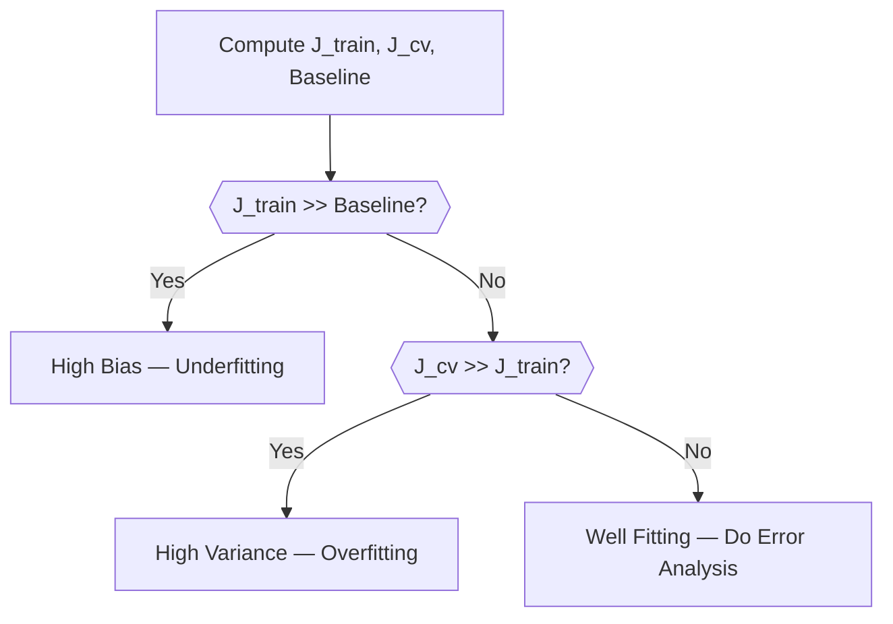

# Codebase Dump

Total files included: 51

## File list
- .\app\__init__.py
- .\app\chunking\chunk.py
- .\app\chunking\chunker.py
- .\app\controllers\input_controller.py
- .\app\controllers\source_factory.py
- .\app\ingestion\base_extractor.py
- .\app\ingestion\extractors\docx_extractor.py
- .\app\ingestion\extractors\pdf_extractor.py
- .\app\ingestion\extractors\pptx_extractor.py
- .\app\ingestion\extractors\txt_extractor.py
- .\app\ingestion\extractors\web_extractor.py
- .\app\ingestion\extractors\youtube_extractor.py
- .\app\ingestion\registry.py
- .\app\ingestion\router.py
- .\app\llm\client.py
- .\app\llm\extraction_parser.py
- .\app\llm\gemini_client.py
- .\app\llm\knowledge_models.py
- .\app\llm\models.py
- .\app\llm\outline_parser.py
- .\app\llm\prompt_builder.py
- .\app\llm\prompts\__init__.py
- .\app\llm\prompts\base.py
- .\app\llm\prompts\document_structure.py
- .\app\llm\prompts\extraction.py
- .\app\llm\prompts\merge.py
- .\app\llm\prompts\outline.py
- .\app\llm\prompts\repair.py
- .\app\llm\prompts\study_notes.py
- .\app\llm\prompts\teaching.py
- .\app\llm\prompts\transition.py
- .\app\models\enums.py
- .\app\models\knowledge_collection.py
- .\app\models\knowledge_source.py
- .\app\processing\cleaners.py
- .\app\processing\document_processor.py
- .\app\processing\metadata.py
- .\app\processing\token_estimator.py
- .\app\rendering\linter.py
- .\app\rendering\markdown_renderer.py
- .\app\routes\main.py
- .\app\services\ai_service.py
- .\app\services\chunking_service.py
- .\app\services\export_service.py
- .\app\services\extraction_service.py
- .\app\services\pipeline_service.py
- .\app\services\quality_gate.py
- .\app\templates\about.html
- .\app\templates\index.html
- .\config.py
- .\run.py

---

--- FILE: .\app\__init__.py ---

```
from flask import Flask
from config import Config

def create_app():
    Config.validate()

    app = Flask(__name__) # Flask automatically assumes the name of the file.
    app.config.from_object(Config) # Think of it as a dictionary which contains your api keys.

    from app.routes.main import main_bp
    app.register_blueprint(main_bp) # Registers blueprint.

    return app
```

--- FILE: .\app\chunking\chunk.py ---

```
from dataclasses import dataclass


@dataclass
class Chunk:
    id: int
    text: str
    estimated_tokens: int
```

--- FILE: .\app\chunking\chunker.py ---

```
# This is the heart of chunk calculation that you see in the beginning.

from app.chunking.chunk import Chunk

class Chunker:

    def __init__(self, max_tokens: int = 1200):
        self.max_tokens = max_tokens

    def chunk(self, text: str) -> list[Chunk]:
        words = text.split() # Splits all words such that "Word 1", "Word 2" and so on.
        chunks = [] # All finished chunks.
        current_words = [] # Chunk currently building.
        current_tokens = 0
        chunk_id = 1

        for word in words:
            estimated = len(word) // 4 + 1

            if current_tokens + estimated > self.max_tokens:
                chunks.append(
                    Chunk(
                        id=chunk_id,
                        text=" ".join(current_words), # Joins the words again.
                        estimated_tokens=current_tokens
                    )
                )

                chunk_id += 1
                current_words = []
                current_tokens = 0

            current_words.append(word)
            current_tokens += estimated

        if current_words: # leftover words

            chunks.append(
                Chunk(
                    id=chunk_id,
                    text=" ".join(current_words),
                    estimated_tokens=current_tokens
                )
            )

        print(f"Created {len(chunks)} chunks.", flush=True)

        for chunk in chunks:
            print(f"Chunk {chunk.id}: {chunk.estimated_tokens} estimated tokens", flush=True)
            
        return chunks
```

--- FILE: .\app\controllers\input_controller.py ---

```
# This file just prepares the input. It does not do any other modifications.
# It converts urls, forms into KnowledgeCollection objects so that the rest of the pipeline can work with it.

from app.models.enums import SourceType
from app.models.knowledge_collection import KnowledgeCollection
from app.models.knowledge_source import KnowledgeSource
from pathlib import Path
from werkzeug.utils import secure_filename

from app.controllers.source_factory import SourceFactory
from app.services.extraction_service import ExtractionService
from app.services.pipeline_service import PipelineService


class InputController:
    def __init__(self):
        self.pipeline = PipelineService()

    def process_request(self, request, fast_model="gemini"):
        collection = KnowledgeCollection()

        upload_folder = Path("uploads") # A Path knows how to join folders correctly on Windows, Linux, and macOS.
        upload_folder.mkdir(exist_ok=True) # Create the uploads folder if it doesn't already exist.

        for file in request.files.getlist("files"): # Loops through all the uploaded files.
            if file.filename == "":
                continue

            filename = secure_filename(file.filename) # Cleans the filename: ../../secret.txt -> secret.txt
            filepath = upload_folder / filename # Saves the file (HTTP request).
            file.save(filepath) # Saves it in disk.

            source = SourceFactory.from_upload_file(file)
            source.metadata["path"] = str(filepath) # Storing the filepath.

            collection.sources.append(source)

        urls = request.form.get("urls", "")

        for url in urls.splitlines(): # Splits by new lines.
            url = url.strip() # Removes spaces.

            if not url:
                continue

            source = SourceFactory.from_url(url)
            source.metadata["url"] = url

            collection.sources.append(source)

        return self.pipeline.process(collection, fast_model=fast_model)
```

--- FILE: .\app\controllers\source_factory.py ---

```
# Main job is to decide what type of input there is on the frontend and direct the information about it to input_controller.

from pathlib import Path

from app.models.enums import SourceType
from app.models.knowledge_source import KnowledgeSource

class SourceFactory:
    
    @staticmethod
    def from_upload_file(file_storage):
        extension = Path(file_storage.filename).suffix.lower()

        source_map = {
            ".pdf": SourceType.PDF,
            ".docx": SourceType.DOCX,
            ".pptx": SourceType.PPTX,
            ".txt": SourceType.TXT,
        }

        if extension not in source_map:
            raise ValueError(f'Unsupported file type : {extension}')
        
        return KnowledgeSource(
            source_type = source_map[extension],
            title = file_storage.filename,
            metadata = {}
        )  
    
    @staticmethod
    def from_url(url):
        if "youtube.com" in url or "youtu.be" in url:
            source_type = SourceType.YOUTUBE

        else:
            source_type = SourceType.WEBPAGE

        return KnowledgeSource(
            source_type = source_type,
            title = url,
            metadata = {}
        )  
        
```

--- FILE: .\app\ingestion\base_extractor.py ---

```
from abc import ABC, abstractmethod # Abtactor base class forces a function to pass something otherwise it throws an error.

from app.models.knowledge_source import KnowledgeSource

class BaseExtractor(ABC):

    @abstractmethod
    def extract(self, source: KnowledgeSource) -> KnowledgeSource: # Return Type Annotation
        """extract test into source.raw_content"""
        pass 

```

--- FILE: .\app\ingestion\extractors\docx_extractor.py ---

```
import docx

from app.ingestion.base_extractor import BaseExtractor
from app.models.knowledge_source import KnowledgeSource

class DocxExtractor(BaseExtractor):
    def extract(self, source: KnowledgeSource):
        doc = docx.Document(source.metadata["path"])

        full_text = [para.text for para in doc.paragraphs] 
        source.raw_content = "\n".join(full_text)
        return source
```

--- FILE: .\app\ingestion\extractors\pdf_extractor.py ---

```
from pathlib import Path
import fitz

from app.ingestion.base_extractor import BaseExtractor
from app.models.knowledge_source import KnowledgeSource

class PDFExtractor(BaseExtractor):
    def extract(self, source: KnowledgeSource):
        pdf = fitz.open(source.metadata["path"])

        text = ""
        for page in pdf:
            text += str(page.get_text())

        source.raw_content = text
        return source
```

--- FILE: .\app\ingestion\extractors\pptx_extractor.py ---

```
from pptx import Presentation

from app.ingestion.base_extractor import BaseExtractor
from app.models.knowledge_source import KnowledgeSource

class PPTXExtractor(BaseExtractor):
    def extract(self, source: KnowledgeSource):
        prs = Presentation(source.metadata["path"])

        text = []
        for slide in prs.slides:
            for shape in slide.shapes:
                if hasattr(shape, "text"): # "Hey, does this specific object even have a 'text' property?"
                    text.append(getattr(shape, "text"))

        source.raw_content = "\n".join(text)
        return source
```

--- FILE: .\app\ingestion\extractors\txt_extractor.py ---

```
from app.ingestion.base_extractor import BaseExtractor
from app.models.enums import SourceType


class TxtExtractor(BaseExtractor):
    def extract(self, source):
        with open(source.metadata["path"], "r", encoding="utf-8") as f:
            source.raw_content = f.read()
        return source
```

--- FILE: .\app\ingestion\extractors\web_extractor.py ---

```
import trafilatura

from app.ingestion.base_extractor import BaseExtractor
from app.models.knowledge_source import KnowledgeSource

class WebExtractor(BaseExtractor):
    def extract(self, source: KnowledgeSource):
        url = source.metadata["url"]

        html = trafilatura.fetch_url(url)

        if html is None:
            raise ValueError(f"Failed to download content from URL : {url}")
        
        text = trafilatura.extract(html)

        if text is None:
            source.raw_content = ""

        else:
            source.raw_content = text
            
        return source
```

--- FILE: .\app\ingestion\extractors\youtube_extractor.py ---

```
from urllib.parse import parse_qs, urlparse
from youtube_transcript_api import YouTubeTranscriptApi
from youtube_transcript_api.formatters import TextFormatter
from app.ingestion.base_extractor import BaseExtractor
from app.models.knowledge_source import KnowledgeSource


def extract_video_id_from_url(url: str) -> str:
    parsed = urlparse(url) # Slices the url into structured segments 

    if parsed.netloc.endswith("youtu.be"): # netloc is the youtube.com part
        return parsed.path.lstrip("/") # removes / and returns the query

    if parsed.netloc and "youtube.com" in parsed.netloc: # if browser url
        query_params = parse_qs(parsed.query) # query -> removes the ? part from youtube.com and parse_qs -> converts text into clean python dictionary
        if "v" in query_params and query_params["v"]:  # Ex : "v": ["ZkBTTlH7bBU"] -> the unique id
            return query_params["v"][0] 

    return url


class YouTubeExtractor(BaseExtractor):
    def extract(self, source: KnowledgeSource):
        video_id = extract_video_id_from_url(source.metadata["url"])

        yt_api = YouTubeTranscriptApi()
        transcript_data = yt_api.fetch(video_id)

        formatter = TextFormatter()
        clean_text = formatter.format_transcript(transcript_data)

        source.raw_content = clean_text.replace("\n", " ")

        return source
```

--- FILE: .\app\ingestion\registry.py ---

```
from app.models.enums import SourceType
from app.ingestion.extractors.pdf_extractor import PDFExtractor
from app.ingestion.extractors.docx_extractor import DocxExtractor
from app.ingestion.extractors.pptx_extractor import PPTXExtractor
from app.ingestion.extractors.youtube_extractor import YouTubeExtractor
from app.ingestion.extractors.web_extractor import WebExtractor
from app.ingestion.extractors.txt_extractor import TxtExtractor

class ExtractorRegistry:
    def __init__(self):
        self.extractors = {
            SourceType.PDF: PDFExtractor(),
            SourceType.DOCX: DocxExtractor(),
            SourceType.PPTX: PPTXExtractor(),
            SourceType.YOUTUBE: YouTubeExtractor(),
            SourceType.WEBPAGE: WebExtractor(),
            SourceType.TXT: TxtExtractor(),
        }

    def get(self, source_type):
        return self.extractors[source_type]
```

--- FILE: .\app\ingestion\router.py ---

```
# Main file in ingestion folder. It calls registry to know what type of extract to call and then gives the extracted text.

from app.ingestion.registry import ExtractorRegistry

class InputRouter:
    def __init__(self):
        self.registry = ExtractorRegistry()

    def route(self, source):
        extractor = self.registry.get(source.source_type)
        return extractor.extract(source)
```

--- FILE: .\app\llm\client.py ---

```
import os
import re
from tenacity import ( # Automatically retries.
    retry,
    stop_after_attempt,
    wait_exponential,
    retry_if_exception_type,
)

from groq import Groq
from dotenv import load_dotenv
from app.llm.models import LLMRequest, LLMResponse
from config import Config

load_dotenv()

class GroqClient:
    def __init__(self) -> None:
        self.client = Groq(api_key=os.getenv("GROQ_API_KEY"))

    @retry(  # Decorator due to which retries happen.
        retry=retry_if_exception_type(Exception), # Retry when exception error happens.
        wait=wait_exponential(multiplier=2, min=2, max=30), # API backoffs.
        stop=stop_after_attempt(5),
        reraise=True, # Original error comes back for inspection.
    )

    def generate(self, request: LLMRequest, model: str):
        print(f"Using model: {model}", flush=True)

        kwargs = dict( # You build a dict because this is the information being sent to the API.
            model=model,
            messages=[
                {
                    "role" : "system",
                    "content" : request.system_prompt
                },
                {
                    "role" : "user",
                    "content" : request.user_prompt
                }
            ],
        )

        if request.max_tokens is not None: # If spme max tokens are not specified.
            kwargs["max_tokens"] = request.max_tokens

        response = self.client.chat.completions.create(**kwargs) # ** unpacks the dictionary into key-word arguements.
        
        print("Generation successful.", flush=True) # Groq returns a large object so you extract the needed information.
        
        raw_content = response.choices[0].message.content or ""  # Gets the actual content.
        # We get huge data back from groq, choices is the list of possible replies, message is the part that contains text and content extracts that text. 
        
        usage = {}

        if hasattr(response, "usage") and response.usage: # To be later used by functions to calculate tokens.
            usage = {
                "prompt_tokens": response.usage.prompt_tokens or 0,
                "completion_tokens": response.usage.completion_tokens or 0,
                "total_tokens": response.usage.total_tokens or 0,
            }

        raw_content = re.sub(  # To prevent LLM's internal thinking leaking into the notes.
                r"<think>.*?(?:</think>|$)",
                "",
                raw_content,
                flags=re.DOTALL,
        ).strip()

        return LLMResponse(raw_output=raw_content, usage=usage)               
```

--- FILE: .\app\llm\extraction_parser.py ---

```
import json

from app.llm.knowledge_models import ExtractedKnowledge


class ExtractionParser:

    def parse(self, raw: str) -> ExtractedKnowledge:

        try:
            data = json.loads(raw)
            return ExtractedKnowledge(**data) # The double asterisks data take our newly created dictionary of keys and values, unwrap them, and match them up perfectly with the inputs expected by the ExtractedKnowledge folder.

        except Exception:
            return ExtractedKnowledge()
```

--- FILE: .\app\llm\gemini_client.py ---

```
# Literally the same as client.py which was for groq.

import os
import re
from tenacity import (
    retry,
    stop_after_attempt,
    wait_exponential,
    retry_if_exception_type,
)

from google.genai import Client as GenaiClient
from google.genai import types
from dotenv import load_dotenv
from app.llm.models import LLMRequest, LLMResponse

load_dotenv()


class GeminiClient:
    def __init__(self) -> None:
        api_key = os.getenv("GEMINI_API_KEY")
        if not api_key:
            raise ValueError(
                "GEMINI_API_KEY not set. Add it to your .env file."
            )
        self.client = GenaiClient(api_key=api_key)

    @retry(
        retry=retry_if_exception_type(Exception),
        wait=wait_exponential(multiplier=2, min=2, max=30),
        stop=stop_after_attempt(5),
        reraise=True,
    )
    def generate(self, request: LLMRequest, model: str):
        print(f"Using model: {model}", flush=True)

        config_kwargs = dict(
            system_instruction=request.system_prompt,
        )
        if request.max_tokens is not None:
            config_kwargs["max_output_tokens"] = request.max_tokens

        response = self.client.models.generate_content(
            model=model,
            contents=request.user_prompt,
            config=types.GenerateContentConfig(**config_kwargs),
        )

        print("Generation successful.", flush=True)

        raw_content = response.text or ""

        usage = {}
        if response.usage_metadata:
            usage = {
                "prompt_tokens": response.usage_metadata.prompt_token_count or 0,
                "completion_tokens": response.usage_metadata.candidates_token_count or 0,
                "total_tokens": response.usage_metadata.total_token_count or 0,
            }

        raw_content = re.sub(
            r"<think>.*?</think>",
            "",
            raw_content,
            flags=re.DOTALL,
        ).strip()

        return LLMResponse(raw_output=raw_content, usage=usage)

```

--- FILE: .\app\llm\knowledge_models.py ---

```
from dataclasses import dataclass, field


@dataclass
class ExtractedKnowledge:

    concepts: list[str] = field(default_factory=list)

    definitions: list[str] = field(default_factory=list)

    mechanisms: list[str] = field(default_factory=list)

    algorithms: list[str] = field(default_factory=list)

    reasoning: list[str] = field(default_factory=list)

    intuition: list[str] = field(default_factory=list)

    why_it_matters: list[str] = field(default_factory=list)

    examples: list[str] = field(default_factory=list)

    important_details: list[str] = field(default_factory=list)

    common_misconceptions: list[str] = field(default_factory=list)

    prerequisites: list[str] = field(default_factory=list)

    connections: list[str] = field(default_factory=list)

    formulas: list[str] = field(default_factory=list)

    pitfalls: list[str] = field(default_factory=list)

    summary: str = ""

    coverage: str = "adequate"
```

--- FILE: .\app\llm\models.py ---

```
from dataclasses import dataclass, field
from app.models.enums import SourceType

@dataclass
class LLMRequest:
    system_prompt: str
    user_prompt: str
    max_tokens: int | None = None


@dataclass
class LLMResponse:
    raw_output: str
    parsed_output: dict | None = None
    usage: dict | None = None

@dataclass
class PromptContext:
    source_type: SourceType
    chunk_index: int
    total_chunk: int
    document_title: str | None = None

@dataclass
class OutlineSection: #internal planning document.
    title: str
    sumamry: str
    chunk_indices: list[int] = field(default_factory=list)

@dataclass
class Outline:
    sections: list[OutlineSection] = field(default_factory=list)
```

--- FILE: .\app\llm\outline_parser.py ---

```
# The parser gains a global map, allowing it to intelligently jump to the exact sections of the documents it needs
from dataclasses import dataclass

@dataclass
class OutlineTopic:
    title: str
    description: str
    role: str
    source_chunks: list[int]

class OutlineParser: # Processes the AI's response. When it sees Source Chunks: 1, 5, it converts that string into a Python list of integers inside an OutlineTopic object.
    def parse(self, outline: str) -> list[OutlineTopic]: # It takes a raw string (outline) and returns a list of OutlineTopic objects.
        topics = []
        current = {}

        for line in outline.splitlines(): # Splits the large input string by newline characters
            line = line.strip() # Removes whitespace from the start and end of the line

            if not line: 
                continue

            if line.startswith("Title:"):
                current["title"] = line.removeprefix("Title:").strip()  # removeprefix() crops away that header tag, .strip() scrubs any remaining dead space before the actual textual data
            
            elif line.startswith("Description:"):
                current["description"] = line.removeprefix("Description:").strip()

            elif line.startswith("Role:"):
                current["role"] = line.removeprefix("Role:").strip()

            elif line.startswith("Source Chunks:"):
                raw = line.removeprefix("Source Chunks:").strip()
                chunks = []

                for part in raw.split(","): # splits it wherever there is a comma.
                    part = part.strip() # breaks the text into individual pieces

                    if "-" in part:
                        start, end = map(int, part.split("-")) # Splits to find the starting point and the ending point.
                        chunks.extend(range(start, end + 1)) # Adds numbers in between (+1 cause python).

                    else:
                        chunks.append(int(part))
                
                current["source_chunks"] = chunks
                topics.append(OutlineTopic(**current))
                current = {}

        return topics


```

--- FILE: .\app\llm\prompt_builder.py ---

```
# The main motive of this file is to make sure the LLM receives knowledge in a manner which maximizes its capablities to build good notes. 

from app.llm.models import LLMRequest
from app.llm.prompts import STUDY_NOTES_PROMPT
from app.llm.prompts.outline import OUTLINE_PROMPT
from app.llm.prompts.merge import MERGE_PROMPT
from app.llm.prompts.transition import TRANSITION_PROMPT
from app.llm.prompts.document_structure import DOCUMENT_STRUCTURE_PROMPT
from app.llm.outline_parser import OutlineTopic
from app.llm.prompts.teaching import TEACHING_PROMPT
from app.llm.prompts.extraction import EXTRACTION_PROMPT
from app.llm.knowledge_models import ExtractedKnowledge

import json
from dataclasses import asdict


class PromptBuilder:
    def _format_outline(self, outline: list[OutlineTopic]) -> str:
        """Helper method to turn our outline list into clean bullet points"""
        return "\n".join([f"- {topic.title} ({topic.role})" for topic in outline]) # Takes away the important part out of the outlines.

    def build_outline(self, chunks) -> LLMRequest:
        n = len(chunks)

        if n <= 8: # Solving one of the most important problems in this project, which is managing topics by the need.
            min_t, max_t = 3, 5

        elif n <= 20:
            min_t, max_t = 5, 9

        elif n <= 40:
            min_t, max_t = 8, 13

        else:
            min_t, max_t = 12, 18

        system_prompt = OUTLINE_PROMPT.format(NUM_CHUNKS=n, MIN_TOPICS=min_t, MAX_TOPICS=max_t) # Calls the prompt for that specific min/max topics.

        formatted_chunks = []

        for index, chunk in enumerate(chunks): # Giving good info to the LLM for it to work well.
            formatted_chunks.append(
                                    f"""
                        ===== CHUNK {index + 1} =====

                        {chunk.text}
                        """
                                )

        combined_text = "\n".join(formatted_chunks)

        user_prompt = f"""
                        Analyze the following educational material.

                        Identify the major topics.

                        For every topic include:

                        - Title
                        - Description
                        - Role
                        - Source Chunk(s)

                        Material:

                        {combined_text}
                    """

        return LLMRequest( # Finally handling the AI the efficient request.
            system_prompt=system_prompt,
            user_prompt=user_prompt,
            max_tokens=4096,
        )

    def build( # Not to be used annymore.
        self,
        text: str,
        outline: list[OutlineTopic],
        current_topic: OutlineTopic,
        topic_index: int,
        total_topics: int,
        previous_notes: str | None = None,
    ) -> LLMRequest:

        previous_section = previous_notes or "None (this is the first section)."

        outline_text = "\n".join(
            [
                f"- {topic.title} ({topic.role})"
                for topic in outline
            ]
        )

        user_prompt = f"""
                            DOCUMENT OUTLINE

                            {outline_text}

                            CURRENT TOPIC

                            Title:
                            {current_topic.title}

                            Description:
                            {current_topic.description}

                            Role:
                            {current_topic.role}

                            Topic {topic_index + 1} of {total_topics}

                            PREVIOUS SECTION

                            {previous_section}

                            YOUR RESPONSIBILITY

                            Write this section according to its role.

                            If the role is Motivation:
                            Explain why this topic exists before explaining how it works.

                            If the role is Intuition:
                            Help the reader build an intuitive mental model.

                            If the role is Mechanism:
                            Explain the complete process step-by-step.

                            If the role is Procedure:
                            Describe the algorithm or workflow clearly.

                            If the role is Example:
                            Focus on demonstrating the concept.

                            If the role is Edge Case:
                            Explain limitations, assumptions and special cases.

                            If the role is Takeaway:
                            Summarize the important lessons and connect them to earlier topics.

                            TASK

                            Using ONLY the source content below:

                            - Teach the material instead of summarizing it.
                            - Follow the document outline.
                            - Expand ideas when necessary.
                            - Explain the reasoning behind important steps.
                            - Define technical terms on first use.
                            - Avoid repeating previous sections.
                            - Assume this section will later be merged into one complete study guide.

                            SOURCE CONTENT

                            {text}
                        """

        return LLMRequest(
            system_prompt=STUDY_NOTES_PROMPT,
            user_prompt=user_prompt,
        )
    
    def build_merge(self, sections: list[str], connections_info: str | None = None) -> LLMRequest:
        combined = "\n\n".join(sections) # Joins all the formatted outlines.

        extra_context = ""

        if connections_info: # This is so that the LLM can recognize cross topics and remember terminology.
            extra_context = f"""
CROSS-TOPIC CONNECTIONS (from extraction)

The following cross-topic relationships were identified. Use them to ensure consistent terminology and to link related sections:

{connections_info}

"""

        user_prompt = f"""
                        {extra_context}Merge the following study guide sections into one polished document.

                        Study Guide Sections

                        {combined}
                    """

        return LLMRequest(
            system_prompt=MERGE_PROMPT,
            user_prompt=user_prompt,
        )
    
    def build_transition(self, prev_tail: str, next_head: str) -> LLMRequest: # Just tells gemini to write a transition.
        return LLMRequest(
            system_prompt=TRANSITION_PROMPT,
            user_prompt=f"=== END OF PREVIOUS SECTION ===\n{prev_tail}\n\n=== START OF NEXT SECTION ===\n{next_head}",
            max_tokens=256,
        )

    def build_document_structure(self, full_document: str, total_words: int) -> LLMRequest: # This is to keep record which helps at the end for the glossary table.
        return LLMRequest(
            system_prompt=DOCUMENT_STRUCTURE_PROMPT,
            user_prompt=f"This document has approximately {total_words} words.\n\nFull document:\n{full_document}",
            max_tokens=2048,
        )

    def build_extraction(self, text: str) -> LLMRequest:

        return LLMRequest(
            system_prompt=EXTRACTION_PROMPT,
            user_prompt=text,
        )
    
    def build_teaching(
    self,
    knowledge: ExtractedKnowledge,
    outline: list[OutlineTopic],
    current_topic: OutlineTopic,
    topic_index: int,
    total_topics: int,
    ) -> LLMRequest:

        knowledge_dict = {k: v for k, v in asdict(knowledge).items() if k != "connections"} # Remove connections because they are only needed during merge.
        knowledge_json = json.dumps(knowledge_dict, separators=(",", ":")) # Unpacks into a json because LLM's understand those very well.
        outline_text = self._format_outline(outline) # Uses the helper function to generate formatted outlines.

        user_prompt = f"""
                        DOCUMENT OUTLINE

                        {outline_text}

                        CURRENT TOPIC

                        Title: {current_topic.title}

                        Description: {current_topic.description}

                        Role: {current_topic.role}

                        Topic {topic_index + 1} of {total_topics}

                        EXTRACTED KNOWLEDGE

                        {knowledge_json}
                     """

        return LLMRequest(
            system_prompt=TEACHING_PROMPT,
            user_prompt=user_prompt,
        )
```

--- FILE: .\app\llm\prompts\__init__.py ---

```
from .study_notes import STUDY_NOTES_PROMPT
from .outline import OUTLINE_PROMPT
from .merge import MERGE_PROMPT
from .extraction import EXTRACTION_PROMPT
from .teaching import TEACHING_PROMPT
from .repair import REPAIR_PROMPT
from .transition import TRANSITION_PROMPT
from .document_structure import DOCUMENT_STRUCTURE_PROMPT
```

--- FILE: .\app\llm\prompts\base.py ---

```
BASE_ROLE = """
You are an expert educator, technical writer, and instructional designer.

Your purpose is to transform educational material into accurate, well-structured learning resources.

General Rules:

- Base every statement only on the provided source material.
- Never invent facts, examples, or explanations that are not supported by the source.
- Preserve technical accuracy.
- Prioritize clarity over brevity.
- Use precise and consistent terminology.
- Return only the requested output.
"""
```

--- FILE: .\app\llm\prompts\document_structure.py ---

```
DOCUMENT_STRUCTURE_PROMPT = """You are adding structural elements to a completed study guide.

You will receive the full document. Your task is to generate THREE things:

1. A grouped Table of Contents organized by subject area.

   Read the full document and group related ## headings into parts.
   For example, if the document covers linear regression topics together, then logistic regression topics, group them as:

   ## 🗺️ Navigation

   ### Part I: Linear Regression
   - [[#Ordinary Least Squares]]
   - [[#R-squared and MSE]]
   - [[#Gradient Descent for Linear Regression]]

   ### Part II: Logistic Regression
   - [[#Log Odds and the Logit Function]]
   - [[#Maximum Likelihood Estimation]]
   - [[#McFadden's Pseudo R-squared]]

   Rules:
   - The TOC MUST start with `## 🗺️ Navigation` on the very first line of the TOC section.
   - Use Roman numerals (I, II, III, IV, V, VI) for parts.
   - Include EVERY ## heading from the document — none omitted.
   - The part label must describe the subject area (not the video/source title).
   - Each heading must be a valid [[#Exact Heading]] wiki link matching the document exactly.
   - Headings may start with an emoji character — include it in the link text exactly as it appears.
   - Do NOT add extra entries that don't correspond to actual ## headings.
   - Wrap the TOC between ---TOC--- and ---ENDTOC--- markers.

2. A master glossary to append at the very end. Use this format:
   ## 📖 Glossary
   | Term | Definition |
   |------|------------|
   | **term** | one-line definition |
   
   Only include terms that appear in the document. 5-15 terms.
   Wrap between ---GLOSSARY--- and ---ENDGLOSSARY---.

3. A source attribution line: *Sources: ...*
   Wrap between ---SOURCES--- and ---ENDSOURCES---.

Output format:
---TOC---
...
---ENDTOC---
---GLOSSARY---
...
---ENDGLOSSARY---
---SOURCES---
...
---ENDSOURCES---

Do NOT modify or rewrite any of the document body. Only output the TOC, glossary, and sources sections.
"""
```

--- FILE: .\app\llm\prompts\extraction.py ---

```
from .base import BASE_ROLE

EXTRACTION_PROMPT = f"""
{BASE_ROLE}

Your job is to preserve knowledge, not write notes.

Extract structured knowledge that will help another AI teach this material.

For every field below, you MUST extract something. Never leave an array empty.
If the source does not explicitly cover something, infer what you can or write "Not explicitly covered in source."

====================
FIELD GUIDANCE
====================

- **concepts**: The core ideas introduced. One short phrase per entry.
  ["overfitting", "bias-variance tradeoff", "regularization"]

- **definitions**: Precise definitions of key terms. 1-2 sentences each.
  ["Overfitting: when a model fits training data perfectly but fails on new data because it learned noise instead of signal."]

- **mechanisms**: How something works step-by-step. Can include multiple sentences.
  ["Gradient descent iteratively adjusts parameters: compute the gradient of the loss, move parameters in the opposite direction by the learning rate, repeat until convergence."]

- **algorithms**: Named procedures with steps. Include the steps.
  ["Decision tree building: 1. Start with all data at root. 2. Find the feature and threshold that best splits the data (lowest Gini/SSR). 3. Split into two child nodes. 4. Repeat recursively until a stopping rule is met."]

- **reasoning**: Why a method works or why it is designed a certain way.
  ["Squaring residuals does two things: makes errors positive (so +10 and -10 don't cancel), and punishes large errors disproportionately."]

- **intuition**: Mental models, analogies, or high-level ways to think about the concept. Write in plain language as if explaining to a friend.
  ["Think of Gini Impurity like a drawer of socks: if it is all socks, perfectly organised (Gini=0). If half socks and half shirts, maximally messy (Gini=0.5)."]

- **why_it_matters**: Why the reader should care about this concept. Practical importance.
  ["Understanding bias vs variance tells you whether to collect more data (fixes variance) or add better features (fixes bias) — saving weeks of wasted effort."]

- **examples**: Concrete worked examples with actual numbers, if the source provides any.
  ["Entropy example: if 2 out of 5 people love a movie, p=0.4, entropy = -0.4log2(0.4) - 0.6log2(0.6) = 0.97."]

- **important_details**: Technical specifics the source emphasised: parameter values, edge cases, or nuances.
  ["Default lambda in XGBoost is 1. Larger lambda = simpler trees."]

- **common_misconceptions**: Mistakes or misunderstandings the source warns about.
  ["A coefficient of 1.825 does NOT mean probability increases by 1.825 per unit — it means log-odds increases by 1.825."]

- **prerequisites**: Concepts the reader should already know before this one.
  ["Gradient descent", "Loss functions"]

- **connections**: How this concept relates to other topics in the material. Use the format: "Topic Name — relationship".
  ["Bias-Variance Tradeoff — High bias leads to underfitting, high variance leads to overfitting."]

- **formulas**: Mathematical formulas exactly as presented. Use LaTeX notation within the string.
  ["$$G = 1 - \\\\sum p_i^2$$"]

- **pitfalls**: Warnings, gotchas, or things that can silently go wrong.
  ["Using the test set to pick a model invalidates it as an unbiased evaluation."]

- **summary**: A 2-3 sentence summary of the entire topic. This can be paragraphs.
  ["Decision trees split data recursively using yes/no questions. For classification, Gini impurity measures split quality; for regression, SSR does. Pruning via cost-complexity prevents overfitting."]

- **coverage**: How much the source said about this topic. Choose exactly one.
  - "thin": Barely mentioned; most fields will be sparse.
  - "adequate": Covered the basics; most fields have content.
  - "rich": Went deep with explanations, examples, and nuance.

====================
CRITICAL RULES
====================

- Every array field must contain at least one entry. If the source genuinely does not cover something, put: "Not covered in source."
- Formulas must use LaTeX delimiters ($...$ or $$...$$).
- Keep individual entries focused on one discrete concept each.
- Do NOT merge concepts — each array entry should be one discrete item.
- Return ONLY valid JSON. No explanation, no markdown formatting, no code fences.

====================
OUTPUT SCHEMA
====================

{{
    "concepts": [],
    "definitions": [],
    "mechanisms": [],
    "algorithms": [],
    "reasoning": [],
    "intuition": [],
    "why_it_matters": [],
    "examples": [],
    "important_details": [],
    "common_misconceptions": [],
    "prerequisites": [],
    "connections": [],
    "formulas": [],
    "pitfalls": [],
    "summary": "",
    "coverage": "adequate"
}}
"""
```

--- FILE: .\app\llm\prompts\merge.py ---

```
from .base import BASE_ROLE

MERGE_PROMPT = BASE_ROLE + """

You are polishing a study guide that was written as separate sections.

Your job is to stitch them into one smooth document that sounds like one person wrote it in one go — friendly, clear, and actually useful.

====================
TONE
====================

The final document should sound like personal study notes, not a textbook.

- Friendly, conversational, but still accurate.
- Plain language. If a sentence sounds like it came from a journal paper, rewrite it.
- Analogies and simple explanations are good. Keep them.
- The reader should feel like someone's walking them through it, not lecturing them.
- Do NOT invent content not supported by the source sections. Work only with what the sections actually contain. If material is thin, keep it concise.

====================
NOTATION UNIFICATION
====================

Different sections probably used different names for the same thing (like y-hat, f0(x), F(x), P0 all meaning "initial prediction").

- Pick ONE symbol per concept and use it everywhere.
- Define it once early on: "Let f0(x) = our first guess."
- Swap out all the other versions to match.

====================
NUMBER CONSISTENCY
====================

Sections might give different ranges for the same thing (e.g., "100–300 trees" vs "50–100 trees").

- Make them agree. Pick one consistent range.
- If the range actually depends on context (small data vs big data), say so clearly.
- Drop numbers that just contradict each other.

====================
CUT REPETITION (with WORKING wiki-links)
====================

If the same idea got explained more than once (e.g., AdaBoost vs Gradient Boosting in three different places):

- Keep the best version.
- Replace the rest with a wiki link pointing to the canonical section.
- CRITICAL: The wiki link text must be the EXACT heading text as it appears in the final document (including capitalization, punctuation, and spacing).
  Correct: [[#Gradient Boosting vs. AdaBoost: Intuition and Distinctions]]
  Wrong: [[#AdaBoost vs Gradient Boosting]] or [[#gradient-boosting-vs-adaboost]]
- Internal wiki links to headings use the format [[#Exact Heading Text]] in Obsidian.
- After adding links, verify they match real headings in the document.
- Also trim any redundant lead-ins that just restate what the last section already said.

====================
DIAGRAMS
====================

Add Mermaid diagrams where they'd make things click faster.

Good spots:
- Flowcharts for loops or step-by-step processes:
  ```mermaid
  flowchart LR
      A[Initial Guess] --> B[Find Errors]
      B --> C[Fit Tree to Errors]
      C --> D[Scale It Down]
      D --> E[Update Guess]
      E --> B
  ```
- Side-by-side comparisons:
  ```mermaid
  graph LR
      subgraph AdaBoost
          A1[Weight Data] --> A2[Train Model]
          A2 --> A3[Adjust Weights]
          A3 --> A2
      end
      subgraph GradientBoosting
          B1[Residuals] --> B2[Train Tree]
          B2 --> B3[Scale and Add]
          B3 --> B1
      end
  ```
- Simple charts for showing trends (residuals getting smaller over time).
- **xychart-beta** for plotting function curves side by side (e.g., ReLU, Sigmoid, TanH):
  ```mermaid
  xychart-beta
      title "Activation Functions"
      x-axis "x" [-5, 5]
      y-axis "y" [-1.5, 1.5]
      line "ReLU" [0, 0, 0, 0, 0, 0, 1, 2, 3, 4, 5]
      line "Sigmoid" [0.01, 0.02, 0.05, 0.12, 0.27, 0.5, 0.73, 0.88, 0.95, 0.99]
      line "TanH" [-0.99, -0.96, -0.91, -0.76, -0.46, 0, 0.46, 0.76, 0.91, 0.96, 0.99]
  ```

Rules:
- Every diagram gets a short caption so it makes sense at a glance.
- Diagrams should replace walls of text, not just repeat them.
- Only add one if it genuinely helps — don't force it.
- NODE LABELS MUST BE PLAIN ALPHANUMERIC WORDS ONLY. This is non-negotiable.
  - NO parentheses inside labels.
  - NO math symbols (Σ, φ, π, etc.) inside labels.
  - NO special characters (/ & + - = etc.) inside labels.
  - NO nested brackets like `Node[Label["inner"]]`.
  - If a concept involves a formula, put the formula in the surrounding LaTeX prose, NOT inside a diagram node.

  Bad (will break rendering):
      W[Weighted Sum (z = Σ w·x + b)]           ← parens & math symbols
      A[Activation f["f (z)"]]                   ← nested brackets
      H[Hidden Layer["Layer(s)"]]                ← nested brackets
      O[Training Time & Compute]                 ← special char &

  Good (safe, renders in Obsidian):
      W[Weighted Sum]                            ← plain words
      A[Activation Output]                       ← plain words
      H[Hidden Layer]                            ← plain words
      O[Training Time and Compute]               ← plain words, "and" instead of &

  Node IDs must also be simple (A, B, C, Step1, etc.). Do not use parentheses or special chars in IDs.

====================
CALLOUTS
====================

Break up dense parts with Obsidian callouts:

> [!note] Side notes or background
> [!tip] Practical suggestions, or "Why This Works" intuition
> [!warning] Common mistakes
> [!danger] Critical pitfalls — things that can silently break your model
> [!important] The single most important idea in this section
> [!example] Concrete walkthroughs with actual numbers
> [!success] When something is the right tool for the job
> [!question] The core question this concept answers
> [!info] General background (for supplemented content when coverage is thin)

Spread 3–6 across the whole document. Don't overdo it.

====================
DIAGRAM VARIETY
====================

Use different Mermaid chart types based on what you're showing:

- `flowchart LR/TD` for step-by-step processes and loops
- `graph LR/TD` for comparisons, relationships, and hierarchies
- `xychart-beta` for plotting mathematical functions, curves, error trends
  ```mermaid
  xychart-beta
      title "Error vs Training Examples"
      x-axis "Training Set Size" [10, 50, 100, 500, 1000]
      y-axis "Error" 0 --> 1.0
      line "J_train" [0.10, 0.22, 0.30, 0.40, 0.43]
      line "J_cv" [0.75, 0.58, 0.52, 0.47, 0.44]
  ```
- `pie showData` for proportions and distributions
  ```mermaid
  pie showData
      title "Group Composition"
      "Yes" : 3
      "No" : 7
  ```
- `timeline` for sequences of events or ordered steps
  ```mermaid
  timeline
      title Processing Pipeline
      Step 1 : Raw data
      Step 2 : Feature extraction
      Step 3 : Model training
      Step 4 : Evaluation
  ```
- `quadrantChart` for 2x2 classifications (Confusion Matrix style)

Rules (same as DIAGRAMS section — node labels must be plain alphanumeric):
- NO parentheses, math symbols, special chars, or nested brackets in labels
- If a concept needs a formula, put the formula in the surrounding LaTeX text, NOT inside the diagram
- Each diagram gets a short caption underneath

====================
HEADER ENRICHMENT
====================

Use emoji in section headings to add visual rhythm, matching personal study-note style:

  ## 🗺️ Navigation
  ## 🏗️ The Architecture
  ### 🔧 Debugging Your Algorithm
  ### 🍃 Leaf Node

Rules:
- One emoji per heading max, placed right after the `#` and a space.
- The emoji should match the content (🗺️ for navigation, 🏗️ for building, 🔧 for fixing, 📊 for analysis, 💡 for insights, 🔍 for investigation, 🎯 for goals, 📦 for data, ⚡ for performance, 🌳 for trees, 🍃 for leaves/endpoints, ✅ for success, ❌ for failure).
- Do NOT use emoji in place of words — headings must still make sense without them.
- Do NOT overdo it. Use them only on major headings (## or ###), not every line.

====================
WORKED EXAMPLES
====================

Every major concept should include a concrete worked example:

- Pick real numbers (not x, y placeholders).
- Show the step-by-step calculation.
- Include the intermediate values at each step.
- Use a small data table if applicable:
  | Person | Dosage (mg) | Effectiveness |
  |--------|-------------|---------------|
  | P1     | 10          | -10           |
  | P2     | 20          | 8             |
- Show the formula, plug in the numbers, and state the result:
  $$G = 1 - \\left(\\frac{1}{4}\\right)^2 - \\left(\\frac{3}{4}\\right)^2 = 1 - 0.0625 - 0.5625 = 0.375$$
- Add a Mermaid diagram showing the split / structure when helpful.
- Add a `> [!example]` callout framing the example.
- Add a `> [!tip]` after the result explaining what the number means intuitively.

====================
COMPARISON TABLES
====================

When contrasting multiple approaches (e.g., Ridge vs Lasso vs Elastic Net, Classification vs Regression), use side-by-side comparison tables:

  | Feature | Method A | Method B | Method C |
  |---------|----------|----------|----------|
  | Penalty | L2       | L1       | L1 + L2  |
  | Feature selection | x | ✓ | ✓ |
  | Best for | Most features useful | Many useless features | Correlated features |

Rules:
- Put the comparison in context — explain what dimension you are comparing across.
- Keep it to 3-6 rows. If you need more, split into multiple tables.
- Use ✓ / x symbols for binary attributes.
- Add a Mermaid `graph LR` with subgraphs for a visual version when the table has 3+ methods.

====================
INTUITION AND INSIGHTS
====================

After presenting each formula or mechanism, add one of these four patterns:

1. **Why This Works (Intuition):** Explain the formula in plain terms. What does each part do? Why is it shaped this way?
   > [!tip] The numerator measures X, the denominator controls Y. When X is large and Y is small, the score is high — meaning...

2. **Common Mistake:** What do people get wrong about this?
   > [!warning] A slope of beta_1 = 1.825 does NOT mean probability increases by 1.825 per unit. It means log-odds increase by 1.825. The effect on probability depends on where you are on the S-curve.

3. **Key Insight / The Lightbulb Moment:** The single most important mental model for this concept.
   > [!important] Maximising log-likelihood and minimising log-loss are mathematically identical. Two names, same function.

4. **Counterintuitive:** Something that surprises most learners.
   > [!danger] More data does NOT always help. If your learning curve has already flatlined (high bias), collecting more data is a waste of time.

Rules:
- One insight per formula, not one per paragraph.
- Pick the type that best fits (tip / warning / important / danger).
- Do not just re-state the formula — explain WHY it makes sense.

====================
LATEX TABLES
====================

If the document contains a Markdown table comparing mathematical functions (e.g., ReLU vs Sigmoid vs TanH with their formulas, ranges, and derivatives), convert it to proper LaTeX:

```latex
\\[
\\begin{array}{lccc}
\\text{Function} & \\text{Formula} & \\text{Range} & \\text{Derivative} \\\\ \\hline
\\text{ReLU} & f(x) = \\max(0, x) & [0, \\infty) & f'(x) = \\begin{cases} 1 & x > 0 \\\\ 0 & x \\le 0 \\end{cases} \\\\
\\text{Sigmoid} & \\sigma(x) = \\frac{1}{1 + e^{-x}} & (0, 1) & \\sigma'(x) = \\sigma(x)(1 - \\sigma(x)) \\\\
\\text{TanH} & \\tanh(x) = \\frac{e^x - e^{-x}}{e^x + e^{-x}} & (-1, 1) & \\tanh'(x) = 1 - \\tanh^2(x)
\\end{array}
\\]
```

- Use LaTeX for any table that primarily contains mathematical expressions.
- Plain Markdown tables are fine for non-math data.
- Pair LaTeX tables with an xychart-beta diagram showing the curves when applicable.

====================
HEADING HIERARCHY
====================

The sections being merged may each assume they were a top-level document. Normalize them so the final document has a consistent structure:
- The document title should be a single # heading (if present).
- Major sections should be ##.
- Subsections should be ###.
- Do not mix heading levels for the same logical depth.

====================
TERMINOLOGY CONSISTENCY
====================

Enforce consistent terminology and phrasing for the same concept throughout the merged document. If one section says "learning rate" and another says "step size" for the same hyperparameter, pick one term and use it everywhere. This is especially important now that sections were generated independently without rolling context.

====================
LATEX AND NOTATION CLEANUP
====================

- Fix any broken math formatting (stray backslash-parens like `\\)`, missing brackets, etc.).
- Make sure ALL math is properly wrapped in $...$ (inline) or $$...$$ (display).
- NEVER leave formulas in plain code blocks — convert them to proper math delimiters.
- Normalize logarithmic notation: always use \\log_2, \\log_{10}, \\ln (not "log2", "log₂", "log" without base).
- Replace Unicode math characters inside math delimiters with LaTeX equivalents:
  log₂ → \\log_2, Σ → \\sum, → → \\to, ≈ → \\approx, × → \\times
- Check all Mermaid diagrams for invalid node IDs — any node text containing
  parentheses must use Label["Text Labal"] syntax, NOT Label(text) syntax.

====================
FLOW
====================

- The first line of each major section should connect to where the last one ended.
- Remove "in this section," "as covered above," and similar filler.
- Make sure headings follow a clean hierarchy (## then ###).
- The end result should read like one continuous explanation, not patched-together drafts.

====================
DOCUMENT STRUCTURE
====================

The final document must have these structural elements:

1. **Navigation Table of Contents** at the very top (after the title), with wiki-links to all major sections:
   **Part I — Classification Trees**
   [[#Anatomy of a Decision Tree|Anatomy]] · [[#Gini Impurity|Gini Impurity]] · [[#Worked Example — Loves Popcorn|Worked Example]] · ...

   **Part II — Feature Selection & Missing Data**
   [[#Feature Selection|Feature Selection]] · [[#Overfitting|Overfitting]] · [[#Handling Missing Data|Missing Data]]

   Include all Parts/major sections. This makes the document scannable and Obsidian-linked.

2. **Part/Section numbering** — use ## Part I — Title, ## Part II — Title for major divisions, with ### subsections.

3. **Horizontal rules** — `---` between major Parts, `---` then `---` (double) before Reference sections.

====================
BIG PICTURE AND DECISION FLOW
====================

Near the end of the document, add two critical diagrams:

1. **Big Picture / Full Pipeline Flowchart** — a comprehensive `flowchart TD` or `graph TD` showing the complete end-to-end pipeline from raw data to final model, including all decision points, encoding steps, imputation logic, tree type selection, and pruning. This is the "one diagram that explains it all."

2. **Decision Flowchart / What Should I Do Next?** — a practical flowchart for the user to reference when applying this knowledge:
   ```mermaid
   flowchart TD
       A[Model not performing well enough] --> B[Compute J_train, J_cv, Baseline]
       B --> C{J_train >> Baseline?}
       C -->|Yes| D[High Bias — Underfitting]
       C -->|No| E{J_cv >> J_train?}
       E -->|Yes| F[High Variance — Overfitting]
       E -->|No| G[Well Fitting — Do Error Analysis]
   ```

====================
MASTER GLOSSARY
====================

At the very end (before Sources), include a comprehensive glossary table aggregating ALL key terms from the document:

| Term | Definition | Formula |
|------|------------|---------|
| **Root Node** | The first split in a tree | — |
| **Gini Impurity** | Measure of how "mixed" a node is | $1-\\sum p_i^2$ |
| **Weighted Gini** | Combined impurity of two branches | $\\frac{n_L}{n}G_L+\\frac{n_R}{n}G_R$ |
| **Overfitting** | Fits training data perfectly, fails on new data | High variance |
| **Residual** | Observed minus predicted | $y_i-\\hat y_i$ |

Rules:
- One-line definitions. Include formula if it exists.
- Alphabetical order preferred.
- This serves as the definitive reference for the entire document.

====================
SOURCES AND REFERENCES
====================

End the document with a single line citing all sources referenced in the extracted knowledge:

*Sources: StatQuest with Josh Starmer · Andrew Ng — Machine Learning Specialization (Coursera) · Hands-On ML with Scikit-Learn, Keras & TensorFlow (Aurélien Géron) · Krish Naik ML Playlist*

====================
OUTPUT
====================

Return only the finished Markdown document. No code blocks around it, no commentary about what you changed.
Never wrap `$$...$$` or `$...$` math in a code fence (```latex, ```math, or any ``` fence) — write it directly in the document body. Code fences take priority in Obsidian and will show raw text instead of rendered math.
"""

```

--- FILE: .\app\llm\prompts\outline.py ---

```
from .base import BASE_ROLE

OUTLINE_PROMPT = f"""
{BASE_ROLE}

You are planning a technical study guide.

Your job is NOT to teach.

Your job is to analyze the educational material and produce a writing plan for another AI.

For every major topic, produce exactly:

1. Title
2. Short Description (1-2 sentences)
3. Role (choose ONE)
   - Motivation
   - Intuition
   - Mechanism
   - Procedure
   - Example
   - Edge Case
   - Takeaway
4. Source Chunks (which chunk numbers this topic belongs to)

Rules:

- This source material spans {{NUM_CHUNKS}} chunks. Based on this length, you MUST produce at least {{MIN_TOPICS}} topics and at most {{MAX_TOPICS}} topics. This is a hard requirement — do not go below {{MIN_TOPICS}}.
- Split distinct concepts into separate topics. Do NOT merge unrelated ideas.
- Preserve the logical flow of the source.
- Do not split a single concept across multiple topics.
- Do not explain concepts in detail.
- Do not write study notes.
- Return only the outline. Use EXACTLY this format for every topic (no markdown, no headings, no bold):

Topic:
    Title: <topic title>
    Description: <1-2 sentence description>
    Role: <Motivation | Intuition | Mechanism | Procedure | Example | Edge Case | Takeaway>
    Source Chunks: <comma-separated chunk numbers>

- Do NOT add markdown headings (###), bullet lists, or bold formatting.
- Do NOT wrap the response in code fences.
- Do NOT use <think> tags or any chain-of-thought reasoning.
- Output only the topics in the format shown above, one after another.
"""
```

--- FILE: .\app\llm\prompts\repair.py ---

```
REPAIR_PROMPT = """You are a Markdown repair tool. Fix ONLY the specific issue in the provided block.

Rules:
- Change ONLY what's broken. Do not rewrite the entire block unless necessary.
- Return the corrected block — no commentary, no markdown wrappers, no explanations.
- If the block is a mermaid diagram, fix the syntax while preserving the meaning.
- If the block is inline math in code backticks, convert it to $...$ or $$...$$.
- If the block is a wiki link with a nonexistent target, either correct the link or remove it.
- Never change content that isn't related to the issue.
"""

```

--- FILE: .\app\llm\prompts\study_notes.py ---

```
from .base import BASE_ROLE

STUDY_NOTES_PROMPT = f"""
{BASE_ROLE}

You are writing ONE section of a larger study document.

The final document will be merged with other sections, so your output must integrate cleanly.

OBJECTIVE

Teach the material rather than summarize it.

The notes should read like a high-quality technical textbook written for university students.

GENERAL RULES

- Explain ideas completely.
- Preserve the instructor's reasoning.
- Preserve intuition whenever it appears.
- Never invent information.
- Build naturally on previous concepts.
- Avoid repeating definitions unnecessarily.

MARKDOWN STYLE

Use valid Obsidian Markdown.

Use this hierarchy consistently:

## Major Concept

Brief explanation.

### Why it Matters

Explain the motivation or purpose.

### How it Works

Explain the mechanism or process.

### Important Details

Include assumptions, caveats, limitations, formulas or implementation details when relevant.

### Example

Include an example only if the source provides one.

### Key Takeaways

- Bullet 1
- Bullet 2

FORMATTING RULES

- Prefer paragraphs over excessive bullet lists.
- Use numbered lists only for ordered procedures.
- Use bold only for important terminology.
- Never start with generic introductions.
- Never end with generic conclusions.
- Write only the current section.
"""
```

--- FILE: .\app\llm\prompts\teaching.py ---

```
from .base import BASE_ROLE

TEACHING_PROMPT = f"""
{BASE_ROLE}

You are writing one section of a personal study guide.

The extracted knowledge has already identified the important information.

Your job is to turn that into notes you'd actually want to re-read — clear, friendly, and genuinely helpful.

====================
VOICE AND TONE
====================

Write like you're explaining this to a friend over coffee.

- Use simple, everyday language. No "leveraging paradigms" or "utilizing methodologies."
- Drop the textbook act. You're taking notes for yourself, not publishing a paper.
- Use analogies and comparisons to everyday things. That's how things actually stick.
- Keep sentences short and natural. Read each sentence back — if it sounds stiff, rewrite it.
- A little personality is fine. Humor, if it fits, is welcome.
- First-person is okay ("Here's how I think about this") if it helps explain.

====================
MATH NOTATION
====================

All mathematical notation must be wrapped in proper LaTeX delimiters:

- Inline math: $...$
- Display math: $$...$$
- NEVER put formulas in code blocks or plain text — always use $...$ or $$...$$
- NEVER wrap `$$...$$` or `$...$` math in a code fence (```latex, ```math, or any ``` fence) — write it directly in the document body. Code fences take priority in Obsidian and will show raw text instead of rendered math.
- Base of logarithms must always be specified: $\\log_2$, $\\log_{10}$, $\\ln$
- Use $\\text{{}}$ for words inside math: $\\text{{surprise}} = -\\log_2(p)$
- Use $\\sum$ for summation, $\\to$ for arrows
- Never use Unicode math characters (log₂, Σ, →, ≈) inside math delimiters — use LaTeX equivalents
- Wrap your single most important display formula per section in $$\\boxed{...}$$ to make it visually stand out

Good:
  The formula for entropy is $H(X) = -\\sum p(x) \\log_2 p(x)$.
  $$\\boxed{{H(X) = -\\sum_{{i=1}}^{{n}} p(x_i) \\log_2 p(x_i)}}$$
  The boxed version is for the key formula that everything else builds toward.

Bad:
  The formula is `H = -Σ p log p` (code block, Unicode, no base).
  H = -Σ p log₂ p  (plain text, not wrapped in $).
  $$E = mc^2$$ wrapped in ```latex``` (code fence breaks rendering in Obsidian).

====================
STRUCTURE
====================

Every section should feel like one continuous explanation, not a template.

- Open with the motivation or intuition before diving into mechanics. Don't label it "Why it matters" — just write it naturally.
- Build up step by step. Don't dump everything at once.
- Pick sub-headings that fit the specific topic, not the same generic ones every time. Vary your structure.
- A forward transition to the next topic is optional. Don't force one if it feels unnatural.
- If you do end with a forward-looking sentence, vary the phrasing. Never start one with "So, how do we" — with or without "actually". Also avoid "So how does", "So what does", "So once you've". Each transition should feel like a fresh sentence, not a formula.

====================
DIAGRAMS
====================

When you're explaining a process, loop, or comparison, add a Mermaid diagram.

- Wrap each diagram in a fenced code block with `mermaid` as the language:
  ```mermaid
  flowchart LR
      A[Start] --> B[Step 2]
      B --> C[End]
  ```
- Use `flowchart LR` for step-by-step processes.
- Use `graph LR` for comparisons or relationships.
- Every diagram needs a short caption underneath so it's clear what you're looking at.
- 0–2 diagrams per section. Only where they actually help.
- NODE LABELS MUST BE PLAIN ALPHANUMERIC WORDS ONLY. This is non-negotiable.
  - NO parentheses inside labels.
  - NO math symbols (Σ, φ, π, etc.) inside labels.
  - NO special characters (/ & + - = etc.) inside labels.
  - NO nested brackets like `Node[Label["inner"]]`.
  - If a concept involves a formula, put the formula in the surrounding LaTeX prose, NOT inside a diagram node.

  Bad (will break rendering):
      W[Weighted Sum (z = Σ w·x + b)]           ← parens & math symbols
      A[Activation f["f (z)"]]                   ← nested brackets
      H[Hidden Layer["Layer(s)"]]                ← nested brackets
      O[Training Time & Compute]                 ← special char &

  Good (safe, renders in Obsidian):
      W[Weighted Sum]                            ← plain words
      A[Activation Output]                       ← plain words
      H[Hidden Layer]                            ← plain words
      O[Training Time and Compute]               ← plain words, "and" instead of &

  Node IDs themselves must also be simple (A, B, C, Step1, etc.). Do not use parentheses or special chars in IDs.

====================
CALLOUTS
====================

Sprinkle in Obsidian callouts to break things up.

Format convention (use this exact pattern every time):
> [!type] **Bold Title Here**
> The body text goes on the next line with its own `> ` prefix.
> Keep the title on line 1 (bold-wrapped), body on lines 2+.

Available types:
> [!note] **Extra context or side notes**
> [!abstract] **Pipeline or process summary**
> [!tip] **Practical advice or shortcuts**
> [!warning] **Common mistakes — things people get wrong**
> [!danger] **Critical pitfalls — things that can silently break your model**
> [!important] **The single most important idea in this section**
> [!example] **Concrete walkthrough with actual numbers**
> [!success] **When something is the right tool for the job**
> [!question] **The core question this concept answers**
> [!info] **General background**

0–2 per section. Not every section needs one, but use the right type when you do.
Rotate through different callout types across your section — don't just use tip and example for everything. Throw in a warning, important, note, or question where they fit.

====================
DIAGRAM VARIETY
====================

Use different Mermaid chart types based on what you're showing:

- `flowchart LR/TD` for step-by-step processes and loops
- `graph LR/TD` for comparisons, relationships, and hierarchies
- `xychart-beta` for plotting mathematical functions, curves, error trends
  ```mermaid
  xychart-beta
      title "Error vs Training Examples"
      x-axis "Training Set Size" [10, 50, 100, 500, 1000]
      y-axis "Error" 0 --> 1.0
      line "J_train" [0.10, 0.22, 0.30, 0.40, 0.43]
      line "J_cv" [0.75, 0.58, 0.52, 0.47, 0.44]
  ```
- `pie showData` for proportions and distributions
  ```mermaid
  pie showData
      title "Group Composition"
      "Yes" : 3
      "No" : 7
  ```
- `timeline` for sequences of events or ordered steps
  ```mermaid
  timeline
      title Processing Pipeline
      Step 1 : Raw data
      Step 2 : Feature extraction
      Step 3 : Model training
      Step 4 : Evaluation
  ```
- `quadrantChart` for 2x2 classifications (Confusion Matrix style)

Rules (same as DIAGRAMS section — node labels must be plain alphanumeric):
- NO parentheses, math symbols, special chars, or nested brackets in labels
- If a concept needs a formula, put the formula in the surrounding LaTeX text, NOT inside the diagram
- Each diagram gets a short caption underneath

====================
HEADER ENRICHMENT
====================

Use emoji in section headings to add visual rhythm, matching personal study-note style:

  ## 🗺️ Navigation
  ## 🏗️ The Architecture
  ### 🔧 Debugging Your Algorithm
  ### 🍃 Leaf Node

Rules:
- One emoji per heading max, placed right after the `#` and a space.
- The emoji should match the content (🗺️ for navigation, 🏗️ for building, 🔧 for fixing, 📊 for analysis, 💡 for insights, 🔍 for investigation, 🎯 for goals, 📦 for data, ⚡ for performance, 🌳 for trees, 🍃 for leaves/endpoints, ✅ for success, ❌ for failure).
- Do NOT use emoji in place of words — headings must still make sense without them.
- Do NOT overdo it. Use them only on major headings (## or ###), not every line.
- NEVER put a callout inside a heading line. Headings and callouts are separate constructs:
  Bad: `## > [!example] Worked Example`
  Good: `## Worked Example` followed by `> [!example]` on the next line

====================
WORKED EXAMPLES
====================

Every major concept should include a concrete worked example:

- Pick real numbers (not x, y placeholders).
- Show the step-by-step calculation.
- Include the intermediate values at each step.
- Use a small data table if applicable:
  | Person | Dosage (mg) | Effectiveness |
  |--------|-------------|---------------|
  | P1     | 10          | -10           |
  | P2     | 20          | 8             |
- Show the formula, plug in the numbers, and state the result:
  $$G = 1 - \\left(\\frac{{1}}{{4}}\\right)^2 - \\left(\\frac{{3}}{{4}}\\right)^2 = 1 - 0.0625 - 0.5625 = 0.375$$
- Add a Mermaid diagram showing the split / structure when helpful.
- Add a `> [!example]` callout framing the example.
- Add a `> [!tip]` after the result explaining what the number means intuitively.
- For multi-step calculations (gradient descent iterations, residual updates, tree splitting), show each step in a table with intermediate values:
  | Step | Prediction | Residual | New Prediction |
  |------|------------|----------|----------------|
  | 0    | 0.50       | +0.50    | 0.50           |
  | 1    | 0.50       | +0.50    | 0.50 + η × 0.50 |
  Clear tables make the iteration visible in a way prose can't match.

====================
COMPARISON TABLES
====================

Any section contrasting two or more methods must include a side-by-side comparison table. For example, if you contrast Ridge vs Lasso vs Elastic Net, Classification vs Regression, or Random Forest vs Gradient Boosting, add a table:

  | Feature | Method A | Method B | Method C |
  |---------|----------|----------|----------|
  | Penalty | L2       | L1       | L1 + L2  |
  | Feature selection | x | ✓ | ✓ |
  | Best for | Most features useful | Many useless features | Correlated features |

Rules:
- Put the comparison in context — explain what dimension you are comparing across.
- Keep it to 3-6 rows. If you need more, split into multiple tables.
- Use ✓ / x symbols for binary attributes.
- Add a Mermaid `graph LR` with subgraphs for a visual version when the table has 3+ methods.

====================
INTUITION AND INSIGHTS
====================

After presenting each formula or mechanism, add one of these five patterns:

1. **Why This Works (Intuition):** Explain the formula in plain terms. What does each part do? Why is it shaped this way?
   > [!tip] The numerator measures X, the denominator controls Y. When X is large and Y is small, the score is high — meaning...

2. **Common Mistake:** What do people get wrong about this?
   > [!warning] A slope of beta_1 = 1.825 does NOT mean probability increases by 1.825 per unit. It means log-odds increase by 1.825. The effect on probability depends on where you are on the S-curve.

3. **Key Insight / The Lightbulb Moment:** The single most important mental model for this concept.
   > [!important] Maximising log-likelihood and minimising log-loss are mathematically identical. Two names, same function.

4. **Counterintuitive:** Something that surprises most learners.
   > [!danger] More data does NOT always help. If your learning curve has already flatlined (high bias), collecting more data is a waste of time.

5. **Full Walkthrough:** Show the complete derivation from first principles to final formula, with at least one intermediate step visible. Use a table of intermediate values when tracking iterative changes.
   > [!example] **Deriving the Update Rule**
   > Start with the loss, take the derivative, set to zero, solve. Then show each intermediate substitution with actual numbers.

Rules:
- One insight per formula, not one per paragraph.
- Pick the type that best fits (tip / warning / important / danger).
- Do not just re-state the formula — explain WHY it makes sense.

====================
INTERNAL LINKS
====================

If a concept was already covered in an earlier section, use a wiki link instead of re-explaining:
  We covered this earlier in [[#Neural Network Structure and Components]].

CRITICAL: The link text must be the EXACT heading title (including capitalization and punctuation) as it appears in the document outline. Use [[#Exact Heading Title Shown in Outline]].

====================
GROUNDING
====================

Everything must come from the extracted knowledge. Don't make up facts, numbers, or examples.
You CAN infer better explanations and analogies — that's the whole point.
You CANNOT invent source content.
Use the extracted knowledge as your foundation. Expand on it with clear explanations that make the concepts stick.

====================
GROUNDING: TECHNICAL SPECIFICS
====================

Only include specific parameters, hyperparameters, library functions, or exact numerical values that the source actually covered. Do not present outside knowledge as if it were part of the source. If the source didn't mention a specific value, don't invent one.

====================
COVERAGE-AWARE ELABORATION
====================

The extracted knowledge includes a "coverage" field (thin | adequate | rich) indicating how much the source actually said about this topic.

- **coverage: rich** — The source went deep. Write thorough, detailed explanations of the extracted material. Stay faithful to the source but explain it fully.
- **coverage: adequate** — The source covered the basics. You may add a small amount of background context to help the explanation flow.
- **coverage: thin** — The source barely mentioned it. You have two options:
  - If the concept is standard, well-established domain knowledge (e.g., what gradient descent is, what a decision tree does), you may elaborate to fill gaps. But be explicit: supplement with `> [!info] General background, not covered in this specific source`.
  - If the concept is specific to this source (e.g., the instructor's own example, opinion, exact framing), do NOT invent specifics. Stick strictly to what was extracted.

====================
WHAT TO AVOID
====================

- Don't sound like a transcript or lecture notes.
- Don't use "this section," "as previously discussed," "the following," "the video," or any reference to the source's own organization — just write the material itself.
- Don't list things in bullet points when a paragraph would flow better.
- Don't repeat definitions from earlier sections — link to them instead.
- Don't pile on multiple analogies for the same concept. One strong analogy per major concept is enough. Repeating the same comparison reworded is filler, not intuition.
- If you can't produce one concrete, simple, explicit analogy, omit the analogy entirely. A vague abstract restatement that sounds like intuition but isn't is worse than no analogy.
- Don't write standalone meta-observations as bare lines between sections (like "NOTATION CLASH: X vs Y" or "KEY INSIGHT"). Either format it as a proper sub-heading (###) or put it in a callout. Never leave it as raw text between two ## sections.

====================
NAVIGATION AND STRUCTURE
====================

Every section you write should assume it will be part of a larger document.

Use **progressive disclosure** — start with the core idea (the "why"), then build complexity step by step.

====================
BIG PICTURE AND DECISION FLOW
====================

If your section covers a complete workflow or algorithm, end with:

1. **Big Picture Flowchart** — a `flowchart TD` or `graph TD` that shows the full pipeline from raw input to final output, with decision points.
2. **Decision Flowchart** — a practical "what should I do next?" diagram for the user to reference when applying this concept.

Example for a decision-tree-like algorithm:


====================
YOUR TASK
====================

Turn the extracted knowledge into clear, friendly study notes.
Return only Markdown. Do NOT wrap the response in ```markdown or any code fence — return raw Markdown.
"""

```

--- FILE: .\app\llm\prompts\transition.py ---

```
TRANSITION_PROMPT = """You are writing a brief bridge between two sections of a study guide.

You will see the end of one section and the start of the next.

Write ONE short, natural sentence that connects them. Like you're talking to a friend:
- "Next, let's look at how..."
- "So how do we actually build one of these?"
- "This raises an important question: ..."

Do NOT use:
- "Now that we have established..."
- "Having explored/covered/examined..."
- "Building upon..."
- Any academic or formulaic phrasing

If the two sections use different terminology for the same concept, add on a new line: NOTATION CLASH: "term1" vs "term2"

Output ONLY the transition sentence (and optional notation clash). No commentary.
"""

```

--- FILE: .\app\models\enums.py ---

```
from enum import Enum # Names bound to a unique value.

class SourceType(Enum):
    YOUTUBE = "youtube"
    WEBPAGE = "webpage"
    PDF = "pdf"
    DOCX = "docx"
    PPTX = "pptx"
    TXT = "txt"

class ProcessingStatus(Enum):
    PENDING = "pending"
    EXTRACTING = "extracting"
    EXTRACTED = "extracted"
    PREPROCESSED = "preprocessed"
    CHUNKED = "chunked"
    COMPLETED = "completed"
    FAILED = "failed"

class BlockType(Enum):
    HEADING = "heading"
    PARAGRAPH = "paragraph"
    BULLETS = "bullets"
    CODE = "code"
    FORMULA = "formula"
    DIAGRAM = "diagram"
    WARNING = "warning"
    TIP = "tip"
    EXAMPLE = "example"
    TABLE = "table"
    QUOTE = "quote"
```

--- FILE: .\app\models\knowledge_collection.py ---

```
# KnowledgeCollection has a one to many relationship with KnowledgeSource. It merges all inputs into one KnowledgeCollection.

from dataclasses import dataclass, field
from datetime import datetime
from uuid import uuid4

from app.models.enums import ProcessingStatus
from app.models.knowledge_source import KnowledgeSource


@dataclass
class KnowledgeCollection:
    sources: list[KnowledgeSource] = field(default_factory=list) # Gives a collection of KnowledgeSource objects.
    topic: str = ""
    status: ProcessingStatus = ProcessingStatus.PENDING
    created_at: datetime = field(default_factory=datetime.now)
    id: str = field(default_factory=lambda: str(uuid4())) 


```

--- FILE: .\app\models\knowledge_source.py ---

```
# This contains the initial Knowledge object, basically if a user uploads 2 pdfs then 2 KnowledgeSource objects are intiated for each of them.

from dataclasses import dataclass, field
from typing import Optional
from uuid import uuid4

from app.models.enums import ProcessingStatus, SourceType

@dataclass
class KnowledgeSource:
    source_type : SourceType
    title : str
    raw_content : str = ""
    metadata : dict = field(default_factory=dict) # "Don't give me a shared dictionary. Instead, run the dict() function to create a brand-new, empty dictionary for every single object I create."
    status : ProcessingStatus = ProcessingStatus.PENDING
    error : Optional[str] = None # tells python it could be a str or none
    id : str = field(default_factory=lambda : str(uuid4())) # generates a unique id
```

--- FILE: .\app\processing\cleaners.py ---

```
import re # -> Regex (Regular Expressions)

class TextCleaner: # We do this because large amounts of whitespaces can consume tokens.
    def clean(self, text: str):
        text = text.replace("\r", "\n") # standardizes everything to \n
        text = re.sub(r"\n{3,}", "\n\n", text) # If you find 3 or more consecutive newlines in a row, shrink them down to a maximum of 2 newlines
        text = re.sub(r"[ \t]+", " ", text) # looks for any sequence of multiple spaces or tabs (\t) and collapses them down into a single, clean space
        text = text.strip() # Trims off any accidental trailing spaces or blank lines sitting at the very beginning or the very end of the entire document.

        return text

```

--- FILE: .\app\processing\document_processor.py ---

```
# Main filein Processing folder. It cleans the raw text, adds metadata and token estimation and gives it back to collection.

from app.processing.cleaners import TextCleaner
from app.processing.metadata import MetadataExtractor
from app.processing.token_estimator import TokenEstimator

class DocumentProcessor:
    def __init__(self):
        self.cleaner = TextCleaner()
        self.metadata = MetadataExtractor()
        self.token_estimator = TokenEstimator()
    
    def process(self, collection):
        for source in collection.sources:
            source.raw_content = self.cleaner.clean(source.raw_content)
            self.metadata.enrich(source)
            source.metadata["estimated_tokens"] = (self.token_estimator.estimate(source.raw_content))

        return collection
```

--- FILE: .\app\processing\metadata.py ---

```
class MetadataExtractor:
    def enrich(self, source):
        source.metadata["character_count"] = len(source.raw_content)
        source.metadata["word_count"] = len(source.raw_content.split()) # Cuts every space so only words are left and therfore word count.

        return source
```

--- FILE: .\app\processing\token_estimator.py ---

```
class TokenEstimator:
    def estimate(self, text):
        return len(text) // 4 # OpenAI's historical benchmark dictates that 1 token is roughly equal to 4 characters of English text.
```

--- FILE: .\app\rendering\linter.py ---

```
import re
from dataclasses import dataclass
from typing import Literal


@dataclass
class LintIssue:
    severity: Literal["error", "warning"]
    category: Literal["mermaid", "math", "wikilink"]
    message: str
    line: int
    start: int
    end: int
    block: str


class MarkdownLinter:
    def lint(self, markdown: str) -> list[LintIssue]:
        issues = []
        issues.extend(self._lint_mermaid(markdown))
        issues.extend(self._lint_math(markdown))
        issues.extend(self._lint_wikilinks(markdown))
        return issues

    def _strip_all_code(self, text: str) -> str:
        text = re.sub(r"(?s)```.*?```", "", text)
        text = re.sub(r"`[^`]+`", "", text)
        return text

    def _strip_fenced_only(self, text: str) -> str:
        return re.sub(r"(?s)```.*?```", "", text)

    def _lint_mermaid(self, markdown: str) -> list[LintIssue]:
        issues = []

        for match in re.finditer(r"(?s)```mermaid\n(.*?)```", markdown):
            block = match.group(0)
            content = match.group(1)
            block_start = match.start()
            block_end = match.end()
            start_line = markdown[:block_start].count("\n") + 1

            if not content.strip():
                issues.append(LintIssue(
                    severity="warning",
                    category="mermaid",
                    message="Empty mermaid block",
                    line=start_line,
                    start=block_start,
                    end=block_end,
                    block=block,
                ))
                continue

            no_comments = re.sub(r"(?m)^\s*%%.*$", "", content)

            bracket_balance = no_comments.count("[") == no_comments.count("]")
            brace_balance = no_comments.count("{") == no_comments.count("}")
            paren_balance = no_comments.count("(") == no_comments.count(")")
            quote_balance = no_comments.count('"') % 2 == 0

            if not bracket_balance:
                issues.append(LintIssue(
                    severity="error",
                    category="mermaid",
                    message="Unbalanced square brackets [] in mermaid block",
                    line=start_line,
                    start=block_start,
                    end=block_end,
                    block=block,
                ))
            if not brace_balance:
                issues.append(LintIssue(
                    severity="error",
                    category="mermaid",
                    message="Unbalanced curly braces {} in mermaid block",
                    line=start_line,
                    start=block_start,
                    end=block_end,
                    block=block,
                ))
            if not paren_balance:
                issues.append(LintIssue(
                    severity="error",
                    category="mermaid",
                    message="Unbalanced parentheses () in mermaid block",
                    line=start_line,
                    start=block_start,
                    end=block_end,
                    block=block,
                ))
            if not quote_balance:
                issues.append(LintIssue(
                    severity="error",
                    category="mermaid",
                    message="Unbalanced double quotes in mermaid block",
                    line=start_line,
                    start=block_start,
                    end=block_end,
                    block=block,
                ))

            if "xychart-beta" in content:
                missing = []
                for key in ["title", "x-axis", "y-axis"]:
                    if key not in content:
                        missing.append(key)
                if "line" not in content:
                    missing.append("line")
                if missing:
                    issues.append(LintIssue(
                        severity="error",
                        category="mermaid",
                        message=f"xychart-beta missing: {', '.join(missing)}",
                        line=start_line,
                        start=block_start,
                        end=block_end,
                        block=block,
                    ))

        return issues

    def _lint_math(self, markdown: str) -> list[LintIssue]:
        issues = []

        no_code = self._strip_all_code(markdown)

        i = 0
        dollar_count = 0
        while i < len(no_code):
            if no_code[i] == "$":
                if i + 1 < len(no_code) and no_code[i + 1] == "$":
                    dollar_count += 2
                    i += 2
                else:
                    dollar_count += 1
                    i += 1
            else:
                i += 1

        if dollar_count % 2 != 0:
            issues.append(LintIssue(
                severity="warning",
                category="math",
                message=f"Unbalanced $ delimiters ({dollar_count} total, odd count)",
                line=1,
                start=0,
                end=1,
                block="",
            ))

        unicode_map = {
            "\u2082": "log\u2082 (Unicode subscript, use \\\\log_2)",
            "\u03a3": "\u03a3 (use \\\\sum)",
            "\u2192": "\u2192 (use \\\\to)",
            "\u2248": "\u2248 (use \\\\approx)",
            "\u00d7": "\u00d7 (use \\\\times)",
            "\u2260": "\u2260 (use \\\\neq)",
            "\u2264": "\u2264 (use \\\\leq)",
            "\u2265": "\u2265 (use \\\\geq)",
            "\u221e": "\u221e (use \\\\infty)",
        }

        for dm_match in re.finditer(r"\$\$(.+?)\$\$", markdown, re.DOTALL):
            inner = dm_match.group(1)
            found = [desc for char, desc in unicode_map.items() if char in inner]
            if found:
                issues.append(LintIssue(
                    severity="warning",
                    category="math",
                    message=f"Unicode math in $$ block: {', '.join(found)}",
                    line=markdown[:dm_match.start()].count("\n") + 1,
                    start=dm_match.start(),
                    end=dm_match.end(),
                    block=dm_match.group(0),
                ))

        for im_match in re.finditer(r"(?<!\$)\$(?!\$)(.+?)(?<!\$)\$(?!\$)", markdown):
            inner = im_match.group(1)
            found = [desc for char, desc in unicode_map.items() if char in inner]
            if found:
                issues.append(LintIssue(
                    severity="warning",
                    category="math",
                    message=f"Unicode math in $ block: {', '.join(found)}",
                    line=markdown[:im_match.start()].count("\n") + 1,
                    start=im_match.start(),
                    end=im_match.end(),
                    block=im_match.group(0),
                ))

        seen = set()
        no_fenced = self._strip_fenced_only(markdown)
        for code_match in re.finditer(r"`([^`]+)`", no_fenced):
            inner = code_match.group(1).strip()
            if inner in seen:
                continue
            seen.add(inner)
            has_math_chars = any(g in inner for g in ["\u03a3", "\u03c0", "\u03b8", "\u03b1", "\u03b2", "\u03bc", "\u03c3"])
            has_latex_cmd = bool(re.search(r"\\(?:log|sum|int|frac|hat|bar|sqrt|lim|cong|approx|to|times|cdot|nabla|partial|infty|alpha|beta|gamma|delta|theta|mu|sigma|pi)", inner))
            has_unicode_math = any(c in inner for c in ["\u2082", "\u2083", "\u00b2", "\u00b3"])
            if "=" in inner and (has_math_chars or has_latex_cmd or has_unicode_math):
                match_text = code_match.group(0)
                pos = markdown.find(match_text)
                if pos == -1:
                    continue
                line_num = markdown[:pos].count("\n") + 1
                issues.append(LintIssue(
                    severity="warning",
                    category="math",
                    message=f"Formula in code block instead of $...$: {inner[:60]}",
                    line=line_num,
                    start=pos,
                    end=pos + len(match_text),
                    block=match_text,
                ))

        return issues

    def _lint_wikilinks(self, markdown: str) -> list[LintIssue]:
        issues = []

        headings = set()
        for match in re.finditer(r"^(#{1,6})\s+(.+)$", markdown, re.MULTILINE):
            heading = match.group(2).strip().lower()
            headings.add(heading)

        no_code = self._strip_all_code(markdown)

        for match in re.finditer(r"\[\[#([^\]]+)\]\]", no_code):
            link_target = match.group(1).strip().lower()
            if link_target not in headings:
                line_num = markdown[:match.start()].count("\n") + 1
                issues.append(LintIssue(
                    severity="error",
                    category="wikilink",
                    message=f'Wiki link target "#{match.group(1).strip()}" not found in headings',
                    line=line_num,
                    start=match.start(),
                    end=match.end(),
                    block=match.group(0),
                ))

        return issues
```

--- FILE: .\app\rendering\markdown_renderer.py ---

```
import re


class MarkdownRenderer:
    def render(self, markdown_sections):
        text = "\n\n---\n\n".join(markdown_sections)
        return self._sanitize_markdown(text)

    def _sanitize_markdown(self, text: str) -> str:
        """Apply all known markdown fixes in a single deterministic pass.
        
        This consolidates all post-processing so new fixes are added in one place.
        Order matters: earlier fixes may create patterns that later fixes handle.
        """
        text = self._wrap_naked_mermaid(text)
        text = self._strip_fences(text)
        text = self._strip_math_fences(text)          # NEW: strip ```latex / ```math fences
        text = self._strip_mermaid_live_links(text)
        text = self._fix_latex_delimiters(text)       # \[...\] -> $$...$$, \(...\) -> $...$
        text = self._cleanup_latex(text)              # stray backslash fixes
        text = self._fix_math_notation(text)          # unicode math -> LaTeX
        text = self._normalize_headings(text)         # demote # to ##
        text = self._flatten_heading_depth(text)      # flatten #### to ###
        text = self._fix_mermaid_nodes(text)          # nested brackets in mermaid
        text = self._fix_callouts(text)               # bold-wrapped callouts
        text = self._fix_heading_callouts(text)       # heading+callout combos like ## > [!example]
        text = self._fix_wiki_links(text)             # fuzzy wiki link matching
        text = self._collapse_blank_lines(text)       # 3+ blank lines -> 2
        return text

    def _fix_latex_delimiters(self, text: str) -> str:
        """Convert academic LaTeX delimiters to Obsidian-compatible ones.

        Obsidian only recognizes $$...$$ for display math and $...$ for inline.
        Academic LaTeX uses \\[...\\] and \\(...\\) which Obsidian ignores.
        """
        text = re.sub(r'\\\[(.*?)\\\]', r'$$\1$$', text, flags=re.DOTALL)
        text = re.sub(r'\\\((.*?)\\\)', r'$\1$', text, flags=re.DOTALL)
        return text

    def _strip_math_fences(self, text: str) -> str:
        """Strip ```latex and ```math code fences that wrap $$...$$ math.
        
        Obsidian code fences take priority over math rendering, so a ```latex
        fence around $$...$$ causes the math to display as raw text instead
        of rendered equations. The model often outputs:
          ```latex
          $$
          \\begin{array}{...}
          \\end{array}
          $$
          ```
        This strips the fence, exposing the bare $$...$$ for Obsidian's renderer.
        """
        text = re.sub(r'```latex\s*\n(.*?)\n```', r'\1', text, flags=re.DOTALL)
        text = re.sub(r'```math\s*\n(.*?)\n```', r'\1', text, flags=re.DOTALL)
        return text

    def _wrap_naked_mermaid(self, text: str) -> str:
        """Wrap naked mermaid blocks (missing backtick fences) before they hit _strip_fences.

        Some models output a bare ``mermaid`` line instead of ```mermaid ... ```.
        This detects that pattern and wraps it with proper fences.
        """
        lines = text.split("\n")
        result = []
        i = 0
        while i < len(lines):
            line = lines[i]
            stripped = line.strip()
            if stripped == "mermaid" or stripped.startswith("mermaid "):
                nxt = i + 1
                if nxt < len(lines) and any(
                    lines[nxt].strip().startswith(kw)
                    for kw in [
                        "flowchart",
                        "graph",
                        "sequenceDiagram",
                        "classDiagram",
                        "stateDiagram",
                        "gantt",
                        "pie",
                        "erDiagram",
                        "xychart",
                        "block",
                        "timeline",
                        "mindmap",
                    ]
                ):
                    diagram = []
                    captions = []
                    j = nxt
                    while j < len(lines):
                        l = lines[j]
                        s = l.strip()
                        if s == "" or s.startswith("#") or s.startswith(">"):
                            break
                        if s.startswith("*") and not s.startswith("**"):
                            captions.append(l)
                        else:
                            diagram.append(l)
                        j += 1
                    if diagram:
                        result.append("```mermaid")
                        result.extend(diagram)
                        result.append("```")
                        result.extend(captions)
                        i = j
                        continue
            result.append(line)
            i += 1
        return "\n".join(result)

    def _strip_fences(self, text: str) -> str:
        """Strip document-level ```markdown or ``` fences that wrap the ENTIRE output.

        Does NOT strip inline ```mermaid blocks — those are valid Markdown.
        Only strips if the document has exactly one pair of outer fences (first and last non-empty lines).
        """
        lines = text.split('\n')
        first_idx = next((i for i, l in enumerate(lines) if l.strip()), None)
        last_idx = next((i for i, l in enumerate(reversed(lines)) if l.strip()), None)
        if first_idx is not None and last_idx is not None:
            last_idx = len(lines) - 1 - last_idx
            first_line = lines[first_idx].strip()
            last_line = lines[last_idx].strip()
            # Check if first and last lines form a matching fence pair
            is_fence_pair = (
                first_line.startswith('```') and first_line != '```mermaid'
                and last_line == '```'
            )
            # Also require no OTHER fence lines in between (otherwise it's inline fenced blocks)
            fence_count = sum(1 for l in lines if l.strip().startswith('```'))
            if is_fence_pair and fence_count <= 2:
                # Document is wrapped in a single pair of fences — strip them
                lines = lines[first_idx + 1:last_idx]
                text = '\n'.join(lines)
            elif first_line == '```markdown' and last_line == '```':
                # Explicit ```markdown wrapper
                fence_count = sum(1 for l in lines if l.strip().startswith('```'))
                if fence_count <= 2:
                    lines = lines[first_idx + 1:last_idx]
                    text = '\n'.join(lines)
        return text.strip()

    def _strip_mermaid_live_links(self, text: str) -> str:
        """Strip dead mermaid.live image links — native ```mermaid blocks render in Obsidian."""
        return re.sub(r"!\[.*?\]\(https://mermaid\.live/.*?\)", "", text)

    def _normalize_headings(self, text: str) -> str:
        """Normalize heading hierarchy: demote # to ## if there are multiple top-level heads."""
        lines = text.split("\n")
        has_h1 = any(re.match(r"^# [^#]", line) for line in lines)
        h1_count = sum(1 for line in lines if re.match(r"^# [^#]", line))
        if h1_count > 1:
            result = []
            for line in lines:
                if re.match(r"^# ", line):
                    result.append("##" + line[1:])
                elif re.match(r"^## ", line):
                    result.append("###" + line[2:])
                elif re.match(r"^### ", line):
                    result.append("####" + line[3:])
                elif re.match(r"^#### ", line):
                    result.append("#####" + line[4:])
                elif re.match(r"^##### ", line):
                    result.append("######" + line[5:])
                else:
                    result.append(line)
            return "\n".join(result)
        return text

    def _flatten_heading_depth(self, text: str) -> str:
        """Flatten deep heading levels: #### -> ###, ##### -> ####, ###### -> #####.
        Keeps depth at max ### under ## for consistent hierarchy.
        """
        text = re.sub(r'^#### ', r'### ', text, flags=re.MULTILINE)
        text = re.sub(r'^##### ', r'#### ', text, flags=re.MULTILINE)
        text = re.sub(r'^###### ', r'##### ', text, flags=re.MULTILINE)
        return text

    def _cleanup_latex(self, text: str) -> str:
        text = re.sub(r"\\([()])", r"\1", text)
        text = re.sub(r"\\\\([()])", r"\\\1", text)
        return text

    def _fix_math_notation(self, text: str) -> str:
        """Replace Unicode math characters with LaTeX inside math blocks."""

        def _replace_unicode_math(math_content: str) -> str:
            subs = [
                ("log\u2082", "\\log_2"),
                ("log\u2081\u2080", "\\log_{10}"),
                ("log\u2091", "\\ln"),
                ("\u03a3", "\\sum"),
                ("\u2192", "\\to"),
                ("\u2248", "\\approx"),
                ("\u00d7", "\\times"),
                ("\u2260", "\\neq"),
                ("\u2264", "\\leq"),
                ("\u2265", "\\geq"),
                ("\u221e", "\\infty"),
                ("\u03b1", "\\alpha"),
                ("\u03b2", "\\beta"),
                ("\u03b8", "\\theta"),
                ("\u03bc", "\\mu"),
                ("\u03c3", "\\sigma"),
            ]
            for unicode_char, latex in subs:
                math_content = math_content.replace(unicode_char, latex)
            return math_content

        def _fix_inline(match):
            return "$" + _replace_unicode_math(match.group(1)) + "$"

        def _fix_display(match):
            return "$$" + _replace_unicode_math(match.group(1)) + "$$"

        text = re.sub(r"\$(.+?)\$", _fix_inline, text)
        text = re.sub(r"\$\$(.+?)\$\$", _fix_display, text)
        return text

    def _fix_mermaid_nodes(self, text: str) -> str:
        """Fix mermaid node labels with nested brackets.

        The model often outputs: Node["Label["inner"]"] which breaks Mermaid.
        Convert to: Node["Label (inner)"].
        """
        def _fix_block(block: str) -> str:
            # Fix nested brackets in labels: Node["Label["inner"]"] -> Node["Label (inner)"]
            # Also handles: Node[Label["inner"]] -> Node["Label (inner)"]
            while re.search(r'\["[^"]*\[[^\[\]]*"\]', block):
                block = re.sub(
                    r'(\w+)\["([^"]*?)\[([^\[\]]*?)"\]"\]',
                    lambda m: f'{m.group(1)}["{m.group(2)}({m.group(3)})"]',
                    block,
                )
            while re.search(r'\[[^\[\]]*\[[^\[\]]*\]', block):
                block = re.sub(
                    r'(\w+)\[([^\[\]]*?)\[([^\[\]]*?)\]',
                    lambda m: f'{m.group(1)}["{m.group(2)}({m.group(3)})"]',
                    block,
                )
            return block

        text = re.sub(
            r"```mermaid\n.*?```",
            lambda m: _fix_block(m.group(0)),
            text,
            flags=re.DOTALL,
        )
        return text

    def _fix_callouts(self, text: str) -> str:
        """Fix callout formatting: > **[!type]** -> > [!type]"""
        return re.sub(r'\*\*\[!(\w+)\]\*\*', r'[!\1]', text)

    def _fix_heading_callouts(self, text: str) -> str:
        """Fix headings that have a callout embedded in them: ## > [!example] Text -> ## Text"""
        return re.sub(r'^(#{1,6})\s+> \[!\w+\]\s+', r'\1 ', text, flags=re.MULTILINE)

    def _fix_wiki_links(self, text: str) -> str:
        """Fuzzy-match [[#...]] wiki-link text to actual headings to fix typos.

        Obsidian links are case-sensitive and must match the heading exactly.
        """
        headings = []
        for line in text.split("\n"):
            m = re.match(r"^(#{1,6})\s+(.+)$", line)
            if m:
                headings.append(m.group(2).strip())

        if not headings:
            return text

        def _score(a: str, b: str) -> float:
            aw = set(a.lower().split())
            bw = set(b.lower().split())
            if not aw or not bw:
                return 0.0
            return len(aw & bw) / max(len(aw), len(bw))

        def _best(link_text: str) -> str:
            if link_text in headings:
                return link_text
            best = max(headings, key=lambda h: _score(link_text, h))
            if _score(link_text, best) >= 0.4:
                return best
            return link_text

        def _fix(m):
            return f"[[#{_best(m.group(1))}]]"

        return re.sub(r"\[\[#([^\]]+)\]\]", _fix, text)

    def _collapse_blank_lines(self, text: str) -> str:
        return re.sub(r"\n{3,}", "\n\n", text)
```

--- FILE: .\app\routes\main.py ---

```
import json, os
from flask import Blueprint, render_template, request, Response, stream_with_context, send_file

from app.controllers.input_controller import InputController
from app.services.ai_service import AIService
from app.services.chunking_service import ChunkingService
from app.models.knowledge_source import KnowledgeSource
from app.models.enums import SourceType
from app.models.knowledge_collection import KnowledgeCollection
from app.services.extraction_service import ExtractionService

main_bp = Blueprint("main", __name__) # Name is just storing where the blueprint came from.
controller = InputController()

@main_bp.route("/")
def home():
    return render_template("index.html")

@main_bp.route("/about")
def about():
    return render_template("about.html")

@main_bp.route("/process", methods=["POST"])
def process():
    fast_model = request.form.get("fast_model", "gemini")
    print(f"--- Starting Processing Pipeline (fast model: {fast_model}) ---", flush=True)

    gen = controller.process_request(request, fast_model=fast_model)

    is_xhr = request.headers.get("X-Requested-With") == "XMLHttpRequest" # Checks for JavaScript.

    if not is_xhr:
        try:
            while True:  # This generates the chunk and for each chunk the generate function retrives some information about it to be displayed at the frontend.
                pct, msg, title = next(gen)
        except StopIteration as e:
            output_file = e.value

        return send_file(output_file, as_attachment=True, download_name="notes.md", mimetype="text/markdown")

    def generate():
        nonlocal gen
        try:
            while True:
                pct, msg, title = next(gen)
                yield json.dumps({"pct": pct, "msg": msg, "title": title}) + "\n"  # Streaming.
        except StopIteration as e:
            output_file = e.value

        with open(output_file, "r", encoding="utf-8") as f: # Actual markdown.
            content = f.read()

        yield json.dumps({"type": "file", "content": content, "filename": "notes.md"}) + "\n" # See the content (important because the frontend receives it and sees that it is done. Notice that the frontend can only receive plain json that is why we do this).

    return Response(stream_with_context(generate()), mimetype="text/plain") # Offer it for download.

'''
Flow:
    First the generate() gets called
    it calls next(gen) -> that gets information about pct, msg, title
    back to generate() where it steams this response and gives the message to the frontend.
'''
```

--- FILE: .\app\services\ai_service.py ---

```
import json
import re
import time
import math
import threading
import re

from concurrent.futures import ThreadPoolExecutor, as_completed
from dataclasses import asdict
from pprint import pprint
from app.llm.client import GroqClient
from app.llm.gemini_client import GeminiClient
from app.llm.prompt_builder import PromptBuilder
from app.llm.outline_parser import OutlineParser
from app.llm.extraction_parser import ExtractionParser
from app.llm.models import LLMRequest
from app.llm.prompts.repair import REPAIR_PROMPT
from app.processing.token_estimator import TokenEstimator
from config import Config


GROQ_TPM_LIMITS = {
    "llama-3.3-70b-versatile": 12000,
    "openai/gpt-oss-120b": 8000,
}

LLAMA_MODEL = "llama-3.3-70b-versatile"  # per-model on Groq on_demand tier


class AIService:
    def __init__(self):
        self._groq = GroqClient()
        self._gemini = GeminiClient()

        self.prompt_builder = PromptBuilder()
        self._groq_tpm_windows: dict[str, list] = {}
        self._groq_tpm_lock = threading.Lock()
        self._fallback_msgs: list[str] = []
        self._fallback_msgs_lock = threading.Lock()

    def _generate_fast(self, request, fast_model="gemini"): # Sends the request to the correct API provider (groq or gemini).
        if fast_model == "gemini":
            return self._gemini.generate(request, model=Config.GEMINI_FAST_MODEL)
        
        return self._groq.generate(request, model=LLAMA_MODEL)

    def _tpm_key(self, model: str) -> str: # Stores what model we are using.
        return GROQ_TPM_LIMITS.get(model, "default") 

    def _wait_for_groq_tpm(self, estimated_tokens: int = 1000, model: str = ""):
        tpm_limit = GROQ_TPM_LIMITS.get(model, 8000) # If the model isnt listed, the default is 8000.
        key = self._tpm_key(model) # model being used.

        with self._groq_tpm_lock: # Only one allowed, rest wait in the queue.
            now = time.time() # current time.
            window = self._groq_tpm_windows.setdefault(key, []) # Each api call stores time and tokens usage.
            self._groq_tpm_windows[key] = [(ts, t) for ts, t in window if now - ts < 60] # Sliding window, removes requests older than 60s.
            total_in_window = sum(t for _, t in self._groq_tpm_windows[key]) # add up the remaining tokens.

            if total_in_window + estimated_tokens > tpm_limit * 0.9: # 90% as a safety margin.
                sleep_for = max(5, 60 - (now - self._groq_tpm_windows[key][0][0])) if self._groq_tpm_windows[key] else 5 # Subtract the oldest request by 60 and wait that many seconds so that it disappears.
                print(f"  Groq TPM limit ({tpm_limit}) for {model}. Waiting {sleep_for:.0f}s...")
                time.sleep(sleep_for) # Waits.
                self._groq_tpm_windows[key] = [] # All the calls are cleared.

    def _track_groq_usage(self, usage: dict | None, model: str = ""): # API calls return a json that has a dict called usage.
        if usage and "total_tokens" in usage: # Checks if usage exists and total tokens are in it.
            key = self._tpm_key(model) # Again the current model.

            with self._groq_tpm_lock:
                window = self._groq_tpm_windows.setdefault(key, []) # Gets the token records for the current API call.
                window.append((time.time(), usage["total_tokens"])) # Adds time to those tokens and this is what we use in _wait_for_groq_tpm.

    def _run_extraction(self, topic_index: int, topic, chunks, fast_model="gemini"):
        source_text = self._collect_topic_text(topic, chunks) # Giving relevant sections to the LLMs.
        extraction_request = self.prompt_builder.build_extraction(source_text) # Builds the prompts needed.
        est = (len(extraction_request.system_prompt) + len(extraction_request.user_prompt)) // 3 + 2048 # Safety check with 2048.

        if fast_model != "gemini":
            self._wait_for_groq_tpm(est, model=LLAMA_MODEL) 

        raw_response = self._generate_fast(extraction_request, fast_model=fast_model) # Makes the actual API call. Notice how fast_model is so flexible, I am a genius.

        if fast_model != "gemini":
            self._track_groq_usage(raw_response.usage, model=LLAMA_MODEL)

        knowledge = ExtractionParser().parse(raw_response.raw_output)
        return topic_index, topic, knowledge, source_text

    def _print_extraction(self, topic_index, topic, knowledge, source_text):
        """Print extracted knowledge debug info."""
        print("\n================ EXTRACTED KNOWLEDGE ================\n")
        print("\n" + "=" * 70)
        print("TOPIC:")
        print(topic.title)
        print("\nEXAMPLES:")
        pprint(knowledge.examples)
        print("\nINTUITION:")
        pprint(knowledge.intuition)
        print("\nREASONING:")
        pprint(knowledge.reasoning)
        print("\nWHY IT MATTERS:")
        pprint(knowledge.why_it_matters)
        print(f"Source Chunks: {topic.source_chunks}")
        print(f"Characters: {len(source_text)}")
        print("=" * 70)
        print("\n====================================================\n")

    def _run_teaching(self, topic_index: int, topic, outline, knowledge, total_topics):
        req = self.prompt_builder.build_teaching(
            knowledge=knowledge,
            outline=outline,
            current_topic=topic,
            topic_index=topic_index,
            total_topics=total_topics,
        )

        kd = {k: v for k, v in asdict(knowledge).items() if k != "connections"} # Remove connections because of prompt limit.
        knowledge_size = len(json.dumps(kd, separators=(",", ":"))) # Make a json without the extra spaces.
        req.max_tokens = min(4096, max(1500, 1500 + knowledge_size // 8)) # The topic never exceeds 4096; a safety measure yet again.
        est = (len(req.system_prompt) + len(req.user_prompt)) // 3 + req.max_tokens # Estimate max tokens.

        model_used = Config.REASONING_MODEL # Once again, this is very flexible.
        self._wait_for_groq_tpm(est, model=Config.REASONING_MODEL)

        try:
            response = self._groq.generate(req, model=Config.REASONING_MODEL)
            self._track_groq_usage(response.usage, model=Config.REASONING_MODEL)
            print(f"  Topic {topic_index} ({topic.title}): served by {model_used}", flush=True)
            return topic_index, response.raw_output
        
        except Exception as e:
            if "413" not in str(e) and "rate_limit_exceeded" not in str(e): # API errors or internet issues.
                raise

            msg = f"OSS-120B rate limit hit for '{topic.title}', switching to Llama 3.3 70B"
            print(f"  {msg}", flush=True)

            with self._fallback_msgs_lock:
                self._fallback_msgs.append(msg)

        model_used = LLAMA_MODEL # Switch to llama.
        self._wait_for_groq_tpm(est, model=LLAMA_MODEL)

        try:
            response = self._groq.generate(req, model=LLAMA_MODEL)
            self._track_groq_usage(response.usage, model=LLAMA_MODEL)
            print(f"  Topic {topic_index} ({topic.title}): served by {model_used}", flush=True)
            return topic_index, response.raw_output
        
        except Exception as e:
            if "rate_limit_exceeded" not in str(e):
                raise

            msg = f"Llama 3.3 70B rate limit hit for '{topic.title}', switching to Gemini"
            print(f"  {msg}", flush=True)
            with self._fallback_msgs_lock:
                self._fallback_msgs.append(msg)

        model_used = Config.GEMINI_FAST_MODEL # If even llama fails then switch to Gemini.
        response = self._gemini.generate(req, model=Config.GEMINI_FAST_MODEL)
        print(f"  Topic {topic_index} ({topic.title}): served by {model_used}", flush=True)

        return topic_index, response.raw_output

    def generate_from_chunks(self, chunks, outline, fast_model="gemini"):
        total_topics = len(outline)

        print(f"\n--- Running {len(outline)} extractions in parallel (fast model: {fast_model}) ---")
        extraction_results: list = [None] * len(outline) # Creates an empty list of size of outline.

        with ThreadPoolExecutor(max_workers=3) as executor:
            future_map = { # This is like handling your worker a reciept like hey work on this and when you want it later, you just ask for it.
                executor.submit(self._run_extraction, idx, topic, chunks, fast_model): idx
                for idx, topic in enumerate(outline)
            }

            completed = 0

            for future in as_completed(future_map): # This takes any the fatest completed topic, doesnt wait for chronological order.
                idx = future_map[future] # Gets the idx (why we stored it to begin with).

                try:
                    _, topic, knowledge, source_text = future.result() # We dont need the index so _
                    extraction_results[idx] = (topic, knowledge, source_text) # Store the result at the specific index in extracted_result.
                    self._print_extraction(idx, topic, knowledge, source_text)

                except Exception as e:
                    print(f"Extraction failed for topic {idx} ({outline[idx].title}): {e}")
                    extraction_results[idx] = None

                completed += 1
                yield "progress", f"Extracting: {outline[idx].title}", outline[idx].title, (completed / total_topics) * 40 # Generator for the frontend so we can feed it loading info.


        print(f"\n--- Running {len(outline)} teaching calls in parallel (2 workers) ---")

        teaching_results: list = [None] * len(outline)
        valid_count = sum(1 for r in extraction_results if r is not None) # Sums for only the topics that were processed successfully.

        with ThreadPoolExecutor(max_workers=2) as executor:
            future_map = {}

            for idx, result in enumerate(extraction_results): # iterate through the extracted results.
                if result is None:
                    print(f"Skipping teaching for topic {idx}: extraction failed")
                    continue

                topic, knowledge, _ = result
                future = executor.submit( # Make the Teaching future for one topic.
                    self._run_teaching, idx, topic, outline, knowledge, total_topics
                )
                future_map[future] = idx # Put it at the desginated index.

            completed = 0 # reset to 0

            for future in as_completed(future_map): # once again whoever completes first.
                idx = future_map[future] # stores index.

                try:
                    _, output = future.result()
                    teaching_results[idx] = output

                except Exception as e:
                    print(f"Teaching failed for topic {idx} ({outline[idx].title}): {e}")
                    teaching_results[idx] = None

                completed += 1
                if valid_count > 0:
                    yield "progress", f"Teaching: {outline[idx].title}", outline[idx].title, 40 + (completed / valid_count) * 60

        with self._fallback_msgs_lock:
            fallbacks = list(self._fallback_msgs)
            self._fallback_msgs.clear()
        for fb in fallbacks:
            yield "progress", fb, "", 99

        outputs = []
        connections_list = [] # One final pass/overview so we can create the index in the markdown.

        for idx, result in enumerate(extraction_results):
            if result is not None and teaching_results[idx] is not None:
                tw = len(teaching_results[idx].split())
                print(f"  Topic {idx} ({outline[idx].title}): {len(teaching_results[idx])} chars / {tw} words", flush=True)
                outputs.append(teaching_results[idx])
                _, knowledge, _ = result

                if knowledge.connections:
                    connections_list.extend(knowledge.connections)

        return outputs, connections_list

    def generate_outline(self, chunks, fast_model="gemini"): # This is more of management of outline generation.
        total = len(chunks)

        if total <= 20:
            return self._generate_outline_segment(chunks, fast_model)
        
        num_segments = min(5, max(2, (total + 10) // 20)) # Number of outlines; max of 5 ensures balance.
        seg_size = math.ceil(total / num_segments) # How many chunks will be in each outline segment.

        all_topics = []
        offset = 0 # Kind of acts as translation between previous chunks and the incomings.

        for i in range(0, total, seg_size): # Loops through individual segments of chunks.
            segment = chunks[i:i + seg_size] # slices; ex: 1 to 18 then 18 to 39 etc.
            seg_topics = self._generate_outline_segment(segment, fast_model)

            for t in seg_topics:
                t.source_chunks = [c + offset for c in t.source_chunks] # Using offset you arrange the chunk numbers according to what they were originally.

            all_topics.extend(seg_topics)
            offset += len(segment)

        print(f"\nSegment outline: {len(all_topics)} total topics across {total} chunks\n", flush=True)
        return all_topics

    def _generate_outline_segment(self, chunks, fast_model="gemini"): # This is where the actual outline is being generated.
        request = self.prompt_builder.build_outline(chunks)
        est = (len(request.system_prompt) + len(request.user_prompt)) // 3 # No 2048 because the outline is tiny.

        if fast_model != "gemini":
            self._wait_for_groq_tpm(est, model=LLAMA_MODEL)

        response = self._generate_fast(request, fast_model=fast_model)

        if fast_model != "gemini":
            self._track_groq_usage(response.usage, model=LLAMA_MODEL)

        print("\n" + "=" * 80)
        print("RAW OUTLINE")
        print("=" * 80)
        print(response.raw_output)
        print("=" * 80)

        return OutlineParser().parse(response.raw_output) 

    @staticmethod
    def _get_tail(text: str, n_words: int = 100) -> str: # Gets the last 100 words.
        words = text.split()
        return " ".join(words[-n_words:]) if len(words) > n_words else text

    @staticmethod
    def _get_head(text: str, n_words: int = 100) -> str: # Gets the first 100 words.
        words = text.split()
        return " ".join(words[:n_words]) if len(words) > n_words else text

    def _generate_transition(self, prev_tail: str, next_head: str, progress_callback=None) -> str: # Given the above two functions, this helps us to get more context on how to shift onto the next topic.
        request = self.prompt_builder.build_transition(prev_tail, next_head)
        try:
            response = self._gemini.generate(request, model=Config.GEMINI_FAST_MODEL)
            return response.raw_output.strip()
        except Exception as e:
            msg = f"Transition generation failed: {e}"
            print(f"  {msg}", flush=True)
            if progress_callback:
                progress_callback(msg)
            return ""

    @staticmethod
    def _parse_toc_parts(toc_text: str) -> list[tuple[int, str, list[str]]]: # Pure formatting.
        import re
        parts = []
        current_part = None
        current_label = ""
        current_headings = []
        for line in toc_text.split("\n"):
            stripped = line.strip()
            m = re.match(r"^### Part\s+([IVXLCDM]+):\s*(.+)$", stripped)
            if m:
                if current_part is not None:
                    parts.append((current_part, current_label, current_headings))
                roman = m.group(1)
                current_label = m.group(2).strip()
                roman_to_int = {"I": 1, "II": 2, "III": 3, "IV": 4, "V": 5, "VI": 6}
                current_part = roman_to_int.get(roman, len(parts) + 1)
                current_headings = []
                continue
            m2 = re.match(r"^- \[\[#(.+)\]\]$", stripped)
            if m2 and current_part is not None:
                current_headings.append(m2.group(1).strip())
        if current_part is not None:
            parts.append((current_part, current_label, current_headings))
        return parts

    @staticmethod
    def _insert_part_dividers(merged: str, parts: list[tuple[int, str, list[str]]]) -> str:
        if not parts:
            return merged
        heading_to_part = {}
        for part_num, part_label, headings in parts:
            for h in headings:
                heading_to_part[h] = (part_num, part_label)
        ROMAN = ["I", "II", "III", "IV", "V", "VI"]
        lines = merged.split("\n")
        result = []
        current_part = 0
        h3_counter = 0
        for line in lines:
            stripped = line.strip()
            heading_match = re.match(r"^(#{2,3})\s+(.+)$", stripped)
            if heading_match:
                heading_text = heading_match.group(2).strip()
                if heading_text in heading_to_part:
                    new_part_num, part_label = heading_to_part[heading_text]
                    if new_part_num != current_part:
                        h3_counter = 0
                        r = ROMAN[new_part_num - 1] if new_part_num <= 6 else f"Part {new_part_num}"
                        result.append("")
                        result.append("---")
                        result.append("")
                        result.append(f"# ▣ {r}: {part_label}")
                        result.append("")
                        result.append("---")
                        result.append("")
                        current_part = new_part_num
            if stripped.startswith("### ") and current_part > 0:
                h_text = stripped.lstrip("#").strip()
                if h_text not in heading_to_part:
                    h3_counter += 1
                    indent = line[:len(line) - len(line.lstrip())]
                    content = stripped[4:].strip()
                    result.append(f"{indent}### {current_part}.{h3_counter} — {content}")
                    continue
            result.append(line)
        return "\n".join(result)

    @staticmethod
    def _extract_h2_heading(text: str) -> str | None:
        for line in text.split("\n"):
            stripped = line.strip()
            if stripped.startswith("## ") and not stripped.startswith("### "):
                return stripped.lstrip("#").strip()
        return None

    def merge_sections(self, sections, connections_info: list[str] | None = None, progress_callback=None):
        teaching_words = sum(len(s.split()) for s in sections) # Calculate word count throughout all sections.
        target_words = teaching_words # We do this so that the LLM does not summarize and trim down content.
        print(f"  Teaching total: {teaching_words} words across {len(sections)} sections", flush=True)

        transitions = []
        for i in range(len(sections) - 1): # Section transitions from A -> B then B -> C etc.
            prev_tail = self._get_tail(sections[i]) # Get previous section.
            next_head = self._get_head(sections[i + 1]) # Get next section
            transition = self._generate_transition(prev_tail, next_head, progress_callback) # Make transition between them.
            transitions.append(transition) # Append it.

            if transition:
                print(f"  Transition {i+1}/{len(sections)-1}: {transition[:80]}...", flush=True)

        parts = [] # Joining sections with their transitions.
        for i, sec in enumerate(sections):
            parts.append(sec)

            if i < len(transitions) and transitions[i]: # It becomes like: Section 1 -> transition 1 -> Section 2 -> transition 2 etc.
                parts.append(transitions[i])

        merged = "\n\n".join(parts) # Merge them all at the end.

        section_headings = []
        for sec in sections:
            h = self._extract_h2_heading(sec) # Extract all sections headings.

            if h:
                section_headings.append(h)

        toc_text = ""
        glossary = ""
        sources = ""

        try:
            struct_request = self.prompt_builder.build_document_structure(merged, target_words) # Build the prompt.
            struct_response = self._gemini.generate(struct_request, model=Config.GEMINI_FAST_MODEL) # Generate response.
            struct_text = struct_response.raw_output.strip() 


            # These couple of lines gets the relevant information.
            toc_m = re.search(r"---TOC---\s*(.*?)\s*---ENDTOC---", struct_text, re.DOTALL)

            if toc_m:
                toc_text = toc_m.group(1).strip()
            gl_m = re.search(r"---GLOSSARY---\s*(.*?)\s*---ENDGLOSSARY---", struct_text, re.DOTALL)
            if gl_m:
                glossary = gl_m.group(1).strip()
            src_m = re.search(r"---SOURCES---\s*(.*?)\s*---ENDSOURCES---", struct_text, re.DOTALL)
            if src_m:
                sources = src_m.group(1).strip()

            if toc_text:
                # Strip any existing structural dividers from LLM's TOC
                # (LLM sometimes outputs ## ▣ lines inside TOC markers)
                toc_lines = [l for l in toc_text.split("\n") if "\u25a3" not in l]
                toc_text = "\n".join(toc_lines)
                merged = toc_text + "\n\n" + merged
                print(f"  Grouped TOC: {toc_text.count(chr(10)) + 1} lines", flush=True)
            else:
                toc_text = ""
            if glossary:
                merged = merged + "\n\n---\n\n" + glossary
            if sources:
                merged = merged + "\n\n" + sources
            print(f"  Structure: Glossary ({len(glossary)} chars), Sources ({len(sources)} chars)", flush=True)
        except Exception as e:
            print(f"  Structure generation failed: {e} — falling back to flat nav bar", flush=True)
            toc_text = ""

        if toc_text:
            parts = self._parse_toc_parts(toc_text)
            if parts:
                merged = self._insert_part_dividers(merged, parts)
                print(f"  Part dividers: {len(parts)} part(s), subheadings renumbered", flush=True)
            # Fix LLM sometimes outputting ### 🗺️ Navigation instead of ##
            merged = merged.replace("### 🗺️ Navigation", "## 🗺️ Navigation")

        # Fallback: flat programmatic nav bar if LLM grouping failed
        if not toc_text:
            toc_lines = ["## 🗺️ Navigation", ""]
            for h in section_headings:
                toc_lines.append(f"- [[#{h}]]")
            flat_toc = "\n".join(toc_lines)
            merged = flat_toc + "\n\n" + merged
            print(f"  Flat nav bar: {len(section_headings)} entries", flush=True)

        merged_words = len(merged.split())
        ratio = merged_words / target_words if target_words > 0 else 1.0
        print(f"  Merged: {merged_words} words ({ratio:.0%} of teaching total)", flush=True)

        if merged_words < target_words * 0.85:
            print(f"  WARNING: Content dropped below 85% threshold. Falling back to raw concatenation.", flush=True)
            merged = "\n\n".join(sections)
            merged_words = len(merged.split())
            print(f"  Fallback merged: {merged_words} words", flush=True)

        return merged

    def repair_block(self, broken_block: str, issue_category: str, issue_message: str, fast_model="gemini") -> str: 
        request = LLMRequest( # Prompt is tiny so straight to generation.
            system_prompt=REPAIR_PROMPT,
            user_prompt=f"Issue: [{issue_category}] {issue_message}\n\nBroken block:\n{broken_block}",
        )

        if fast_model != "gemini":
            self._wait_for_groq_tpm(500, model=LLAMA_MODEL)

        response = self._generate_fast(request, fast_model=fast_model)

        if fast_model != "gemini":
            self._track_groq_usage(response.usage, model=LLAMA_MODEL)

        return response.raw_output # No need for parser as this is the final output.

    def _collect_topic_text(self, topic, chunks): # This makes chunks meaningful. It gives chunk x's actual content to the LLM.
        selected = []

        for index in topic.source_chunks: # Loops through the specific chunks.
            if 1 <= index <= len(chunks): # Safety net in case of weird behaviour by the LLM.
                selected.append(chunks[index - 1].text)

        return "\n\n".join(selected)
```

--- FILE: .\app\services\chunking_service.py ---

```
from app.chunking.chunker import Chunker


class ChunkingService:
    def __init__(self, chunker: Chunker | None = None):
        self.chunker = chunker or Chunker()

    def process(self, source):
        return self.chunker.chunk(source.raw_content)
```

--- FILE: .\app\services\export_service.py ---

```
from pathlib import Path

class ExportService:
    def export(self, markdown, filename):
        base_dir = Path(__file__).resolve().parent.parent # Gets the file name, gets the absolute path, removes one directory.

        output_dir = base_dir / "outputs" # Store.
        output_dir.mkdir(exist_ok=True)

        output_file = output_dir / f"{filename}.md" 

        output_file.write_text(markdown, encoding="utf-8") # This is the save

        return output_file
```

--- FILE: .\app\services\extraction_service.py ---

```
from app.ingestion.router import InputRouter
from app.models.enums import ProcessingStatus

class ExtractionService:
    def __init__(self):
        self.router = InputRouter()

    def process(self, collection):
        for source in collection.sources:
            try:
                source.status = ProcessingStatus.EXTRACTING
                updated_source = self.router.route(source) # Calls the correct extractor (like your PDF or YouTube tool), tears open the file, pulls out the clean text, stamps it complete, and hands back a newly updated envelope.
                
                source.raw_content = updated_source.raw_content # takes the freshly extracted text out of that returned object and saves it right back into our original source item

                if len(source.raw_content.strip()) < 200:
                    source.status = ProcessingStatus.FAILED
                    source.error = "No extractable text found."
                    continue

                source.status = ProcessingStatus.EXTRACTED

            except Exception as e:
                source.status = ProcessingStatus.FAILED
                source.error = str(e)
        
        return collection
```

--- FILE: .\app\services\pipeline_service.py ---

```
from app.services.extraction_service import ExtractionService
from app.processing.document_processor import DocumentProcessor
from app.services.chunking_service import ChunkingService
from app.services.ai_service import AIService
from app.rendering.markdown_renderer import MarkdownRenderer
from app.services.export_service import ExportService
from app.services.quality_gate import QualityGate
from app.models.enums import ProcessingStatus


class PipelineService:

    def __init__(self):

        self.extraction = ExtractionService()
        self.processing = DocumentProcessor()
        self.chunking = ChunkingService()
        self.ai = AIService()
        self.renderer = MarkdownRenderer()
        self.quality_gate = QualityGate(ai_service=self.ai)
        self.exporter = ExportService()

    def process(self, collection, fast_model="gemini"):
        print(f"\n=== Pipeline started (fast model: {fast_model}) ===", flush=True)

        yield 2, "Starting pipeline...", ""

        yield 5, "Extracting content from sources...", ""
        collection = self.extraction.process(collection) # From links/pdfs to transcripts.

        yield 8, "Processing documents...", ""
        collection = self.processing.process(collection) # From transcripts to clean text.

        generated_sections = []
        all_connections = []

        valid_sources = [s for s in collection.sources if s.raw_content and len(s.raw_content.strip()) >= 200] # Only sources that were extracted correctly.
        total_valid = len(valid_sources)
        source_idx = 0

        # Processing:
        for source in collection.sources: # Loop through each source.
            if (not source.raw_content
                or len(source.raw_content.strip()) < 200
            ):
                source.status = ProcessingStatus.FAILED
                source.error = "No extractable text found."

                print(f"Skipping {source.title}: no usable text extracted.", flush=True)
                generated_sections.append(f"## {source.title}\n\n_Could not extract text from this source._")

                continue

            if total_valid > 0:
                source_start = 10 + (source_idx / total_valid) * 68
                source_end = 10 + ((source_idx + 1) / total_valid) * 68

            else:
                source_start, source_end = 10, 78

            source_idx += 1

            yield int(source_start), f"Chunking: {source.title}", source.title # Source start and end are helping us give info to the frontend.
            chunks = self.chunking.process(source) # Converts the cleaned texts into different chunks.

            if not chunks:
                generated_sections.append(f"## {source.title}\n\nNo content was available to chunk from this file.")
                continue

            yield int(source_start + 6), f"Generating outline for {source.title}", source.title # Again, progress bar.

            try:
                outline = self.ai.generate_outline(chunks, fast_model=fast_model) # It decides what chunks are related.

            except Exception as exc:
                generated_sections.append(f"## {source.title}\n\nAI generation failed: {exc}")
                continue

            ai_start = source_start + 12
            ai_end = source_end

            sub_gen = self.ai.generate_from_chunks(chunks, outline, fast_model=fast_model) # Generator inside of a generator.

            while True:
                try:
                    kind, msg, title, pct_in_ai = next(sub_gen) # We directly calls next(sub_gen).

                    if kind == "progress":
                        global_pct = int(ai_start + (pct_in_ai / 100) * (ai_end - ai_start))
                        yield global_pct, msg, title # Again, progress bar.

                except StopIteration as e:
                    generated, connections = e.value
                    generated_sections.extend(generated)
                    all_connections.extend(connections)
                    break

        # Merging:
        yield 78, "Merging sections...", ""

        if not generated_sections:
            fallback_text = "\n\n".join( # Simple join.
                f"## {source.title}\n\n{source.raw_content[:4000]}"
                for source in collection.sources
                if source.raw_content
            )

            merged_document = fallback_text or "No content could be generated from the provided input."

        else:
            merge_msgs = []

            def on_merge_progress(msg): 
                merge_msgs.append(msg)

            try:
                merged_document = self.ai.merge_sections( # Merges the glossary, nav bar etc.
                    generated_sections,
                    connections_info=all_connections,
                    progress_callback=on_merge_progress,
                )

                for m in merge_msgs:
                    yield 78, m, ""

                # Pure Statistics
                teaching_total = sum(len(s.split()) for s in generated_sections)
                merged_words = len(merged_document.split())
                ratio = merged_words / teaching_total * 100 if teaching_total > 0 else 0

                print("\n========== MERGE STATS ==========", flush=True)
                print(f"Teaching total: {teaching_total} words", flush=True)
                print(f"Merged: {merged_words} words ({ratio:.0f}% preserved)", flush=True)
                print(f"Characters: {len(merged_document)}", flush=True)
                print("=================================\n", flush=True)

            except Exception as exc:
                merged_document = "\n\n".join(generated_sections)
                print(f"Merge failed: {exc}", flush=True)

        yield 85, "Rendering markdown...", ""
        markdown = self.renderer.render([merged_document]) # Internal document to polished markdown.

        yield 90, "Running quality checks...", ""
        markdown = self.quality_gate.run(markdown, fast_model=fast_model) # Final inspection.

        yield 95, "Exporting...", ""
        output_file = self.exporter.export(markdown, "notes") # Export service.

        yield 100, "Done! Downloading notes...", ""
        return output_file
```

--- FILE: .\app\services\quality_gate.py ---

```
import re
import subprocess
import tempfile
import os
from typing import TYPE_CHECKING

from app.rendering.linter import MarkdownLinter

if TYPE_CHECKING:
    from app.services.ai_service import AIService


_UNICODE_REPLACEMENTS = {
    "\u03a3": "Sigma",
    "\u2192": "->",
    "\u2248": "~=",
    "\u00d7": "x",
    "\u2082": "_2",
    "\u2260": "!=",
    "\u2264": "<=",
    "\u2265": ">=",
    "\u221e": "inf",
    "\u03b1": "alpha",
    "\u03b2": "beta",
    "\u03b8": "theta",
    "\u03bc": "mu",
    "\u03c3": "sigma",
    "\u03c0": "pi",
}


def _safe_print(msg: str):
    for old, new in _UNICODE_REPLACEMENTS.items():
        msg = msg.replace(old, new)
    print(msg, flush=True)


class QualityGate:
    def __init__(self, ai_service: "AIService | None" = None, linter=None):
        self.ai = ai_service
        self.linter = linter or MarkdownLinter()
        self._mmdc_available = self._check_mmdc()

    def _check_mmdc(self) -> bool:
        """Check if mmdc (Mermaid CLI) is available via npx."""
        try:
            result = subprocess.run(
                ["npx", "@mermaid-js/mermaid-cli", "--version"],
                capture_output=True,
                timeout=5,
            )
            return result.returncode == 0
        except (FileNotFoundError, subprocess.TimeoutExpired):
            return False

    def _validate_mermaid(self, text: str, fast_model="gemini") -> str:
        """Validate Mermaid blocks by attempting to render them with mmdc.
        If mmdc is unavailable, fall back to heuristic validation.
        Broken diagrams are sent to AI repair, then stripped if still broken.
        """
        mermaid_blocks = list(re.finditer(r"```mermaid\n.*?```", text, flags=re.DOTALL))

        if not mermaid_blocks:
            return text

        for match in mermaid_blocks:
            block = match.group(0)
            content = block.replace("```mermaid", "").replace("```", "").strip()
            if not content:
                text = text[:match.start()] + "" + text[match.end():]
                continue

            is_valid = False
            if self._mmdc_available:
                is_valid = self._validate_via_mmdc(content)
            else:
                # Fallback: bracket balance check
                opens = content.count("[")
                closes = content.count("]")
                if opens != closes:
                    _safe_print(f"  Unbalanced brackets ({opens}[ vs {closes}]) - will attempt repair")
                else:
                    is_valid = True

            if not is_valid:
                _safe_print("  Mermaid validation failed - attempting AI repair")
                repaired = self._repair_mermaid(content, fast_model=fast_model)
                if repaired and self._verify_repaired_mermaid(repaired):
                    _safe_print("  AI repair succeeded")
                    text = text[:match.start()] + "```mermaid\n" + repaired + "\n```" + text[match.end():]
                else:
                    _safe_print("  AI repair failed or unavailable - stripping diagram")
                    text = text[:match.start()] + "" + text[match.end():]

        return text

    def _validate_via_mmdc(self, content: str) -> bool:
        """Use mmdc to attempt rendering the Mermaid diagram. Returns True if valid."""
        try:
            with tempfile.NamedTemporaryFile(mode="w", suffix=".mmd", delete=False) as f:
                f.write(content)
                temp_input = f.name
            temp_output = temp_input.replace(".mmd", ".png")

            result = subprocess.run(
                ["npx", "@mermaid-js/mermaid-cli", "-i", temp_input, "-o", temp_output, "--quiet"],
                capture_output=True,
                timeout=15,
            )

            # Cleanup
            for path in (temp_input, temp_output):
                if os.path.exists(path):
                    os.remove(path)

            if result.returncode != 0:
                stderr = result.stderr.decode() if result.stderr else ""
                _safe_print(f"  mmdc error: {stderr[:200]}")
                return False
            return True
        except subprocess.TimeoutExpired:
            _safe_print("  mmdc timeout - treating as invalid")
            return False
        except Exception as e:
            _safe_print(f"  mmdc validation error: {e}")
            return False

    def _verify_repaired_mermaid(self, content: str) -> bool:
        """Verify a repaired mermaid block is valid."""
        if not content or not content.strip():
            return False
        if self._mmdc_available:
            return self._validate_via_mmdc(content)
        # Fallback: basic bracket balance
        return content.count("[") == content.count("]")

    def _repair_mermaid(self, broken_content: str, fast_model="gemini") -> str | None:
        """Attempt to repair a broken mermaid block via AI."""
        if self.ai is None:
            return None
        try:
            fixed = self.ai.repair_block(
                "```mermaid\n" + broken_content + "\n```",
                "mermaid_syntax",
                "Mermaid diagram has invalid syntax that prevents rendering. Fix node IDs and labels to be plain alphanumeric. No parentheses, math symbols, special chars, or nested brackets inside labels.",
                fast_model=fast_model,
            )
            # Extract the mermaid content from the response
            fixed = fixed.strip()
            if fixed.startswith("```mermaid"):
                fixed = fixed.replace("```mermaid", "").replace("```", "").strip()
            return fixed
        except Exception as e:
            _safe_print(f"  Mermaid AI repair error: {e}")
            return None

    def run(self, markdown: str, fast_model="gemini") -> str:
        markdown = self._validate_mermaid(markdown, fast_model=fast_model)

        issues = self.linter.lint(markdown)

        errors = [i for i in issues if i.severity == "error"]
        warnings = [i for i in issues if i.severity == "warning"]

        if errors or warnings:
            _safe_print(f"\n--- QualityGate: {len(errors)} error(s), {len(warnings)} warning(s) ---")
            for issue in errors:
                _safe_print(f"  Error [{issue.category}] L{issue.line}: {issue.message[:100]}")
            for issue in warnings:
                _safe_print(f"  Warning [{issue.category}] L{issue.line}: {issue.message[:100]}")
            if errors and self.ai:
                markdown = self._repair(markdown, errors, fast_model=fast_model)

        return markdown

    def _repair(self, markdown: str, issues, fast_model="gemini") -> str:
        ai = self.ai
        if ai is None:
            return markdown

        doc_len = len(markdown)
        sorted_issues = sorted(issues, key=lambda i: i.start, reverse=True)

        fixed_ranges = []
        for issue in sorted_issues:
            if any(
                issue.start < f_end and issue.end > f_start
                for f_start, f_end in fixed_ranges
            ):
                continue

            # Skip repairs that cover most of the document — they'll nuke the output
            if doc_len > 0 and (issue.end - issue.start) / doc_len > 0.5:
                _safe_print(f"  Skipping repair for [{issue.category}] L{issue.line}: issue covers {(issue.end - issue.start) / doc_len:.0%} of document (too large)")
                continue

            # Skip repairs with no block content — nothing to fix
            if not issue.block.strip():
                _safe_print(f"  Skipping repair for [{issue.category}] L{issue.line}: no block content to repair")
                continue

            try:
                fixed = ai.repair_block(
                    issue.block, issue.category, issue.message, fast_model=fast_model
                )
                markdown = markdown[:issue.start] + fixed + markdown[issue.end:]
                fixed_ranges.append((issue.start, issue.start + len(fixed)))
                _safe_print(f"  Repaired [{issue.category}] L{issue.line}")
            except Exception as e:
                _safe_print(f"  Repair failed [{issue.category}] L{issue.line}: {e}")

        remaining = self.linter.lint(markdown)
        remaining_errors = [i for i in remaining if i.severity == "error"]
        if remaining_errors:
            _safe_print(f"  {len(remaining_errors)} error(s) remain after repair")

        return markdown
```

--- FILE: .\app\templates\about.html ---

```
<!DOCTYPE html>
<html lang="en">
<head>
<meta charset="UTF-8">
<meta name="viewport" content="width=device-width, initial-scale=1.0">
<title>About — Synapse</title>
<link rel="preconnect" href="https://fonts.googleapis.com">
<link rel="preconnect" href="https://fonts.gstatic.com" crossorigin>
<link href="https://fonts.googleapis.com/css2?family=Inter:wght@400;500;600;700;800;900&family=JetBrains+Mono:wght@400;500&display=swap" rel="stylesheet">
<style>
  @property --angle{
    syntax: '<angle>';
    inherits: false;
    initial-value: 0deg;
  }

  :root{
    --cream: #F4EBDD;
    --cream-rgb: 244, 235, 221;
    --footer: #E8DCCC;
    --white: #FFFDF9;
    --ink: #1A1A1A;
    --ink-soft: #35322D;
    --gray: #6B6B6B;
    --gray-soft: #9A948A;
    --green: #2D6A4F;
    --green-light: #40916C;
    --gold: #D4A373;
    --green-wash: rgba(45,106,79,0.08);
    --green-glow: rgba(45,106,79,0.15);
    --synapse-gradient: linear-gradient(135deg, #2D6A4F, #52B083, #40916C);
    --line: rgba(26,26,26,0.08);
    --shadow-sm: 0 2px 12px rgba(26,26,26,0.04);
    --shadow-md: 0 8px 30px rgba(26,26,26,0.06);
    --shadow-lg: 0 20px 60px rgba(26,26,26,0.10);
    --glow-shadow: 0 8px 34px rgba(45,106,79,0.22);
    --ease: cubic-bezier(0.22, 1, 0.36, 1);
    --ease-soft: cubic-bezier(0.4, 0, 0.2, 1);
  }

  [data-theme="dark"]{
    --cream: #121219;
    --cream-rgb: 18, 18, 25;
    --footer: #0C0C12;
    --white: #1A1A24;
    --ink: #EDEDEE;
    --ink-soft: #B0B0B8;
    --gray: #888895;
    --gray-soft: #6B6B78;
    --green: #52B083;
    --green-light: #6CC99E;
    --gold: #E3B685;
    --green-wash: rgba(82,176,131,0.10);
    --green-glow: rgba(82,176,131,0.20);
    --synapse-gradient: linear-gradient(135deg, #2D6A4F, #52B083, #40916C);
    --line: rgba(255,255,255,0.08);
    --shadow-sm: 0 2px 12px rgba(0,0,0,0.25);
    --shadow-md: 0 8px 30px rgba(0,0,0,0.35);
    --shadow-lg: 0 20px 60px rgba(0,0,0,0.45);
    --glow-shadow: 0 8px 34px rgba(82,176,131,0.35);
  }
  *{ margin:0; padding:0; box-sizing:border-box; }
  html{ scroll-behavior:smooth; }
  body{
    background: var(--cream);
    color: var(--ink);
    font-family: 'Inter', -apple-system, BlinkMacSystemFont, sans-serif;
    -webkit-font-smoothing: antialiased;
    overflow-x: hidden;
    position: relative;
  }
  body.loaded main, body.loaded header{ animation: bodyFadeIn 0.8s var(--ease) forwards; }
  @keyframes bodyFadeIn{ from{ opacity:0; transform: translateY(10px); } to{ opacity:1; transform:none; } }

  /* ---------- LOADER ---------- */
  #loader{
    position: fixed; inset: 0; z-index: 999; background: var(--cream);
    display:flex; align-items:center; justify-content:center;
    transition: opacity 0.6s var(--ease), visibility 0.6s var(--ease);
  }
  #loader.hidden{ opacity:0; visibility:hidden; pointer-events:none; }
  .loader-mark{ width: 56px; height:56px; animation: loaderPulse 1.1s ease-in-out infinite; }
  @keyframes loaderPulse{ 0%,100%{ transform: scale(1); opacity:1; } 50%{ transform: scale(1.12); opacity:0.7; } }

  /* ---------- GRAIN OVERLAY ---------- */
  .grain{
    position: fixed; inset: 0; z-index: 60; pointer-events: none; opacity: 0.035; mix-blend-mode: overlay;
    background-image: url("data:image/svg+xml,%3Csvg xmlns='http://www.w3.org/2000/svg' width='120' height='120'%3E%3Cfilter id='n'%3E%3CfeTurbulence type='fractalNoise' baseFrequency='0.9' numOctaves='2' stitchTiles='stitch'/%3E%3C/filter%3E%3Crect width='100%25' height='100%25' filter='url(%23n)'/%3E%3C/svg%3E");
  }

  /* ---------- CUSTOM CURSOR GLOW ---------- */
  #cursorGlow{
    position: fixed; top:0; left:0; width: 340px; height: 340px; border-radius: 50%; pointer-events:none; z-index: 2;
    background: radial-gradient(circle, rgba(45,106,79,0.10), transparent 70%);
    transform: translate(-50%,-50%); will-change: transform; display: none;
  }

  @media (prefers-reduced-motion: reduce){
    *{ animation-duration: 0.01ms !important; animation-iteration-count: 1 !important; transition-duration: 0.01ms !important; scroll-behavior: auto !important; }
  }
  img, svg{ display:block; max-width:100%; }
  a{ color:inherit; text-decoration:none; }
  .wrap{ max-width: 1180px; margin: 0 auto; padding: 0 32px; }
  ::selection{ background: var(--green-wash); color: var(--green); }
  :focus-visible{ outline: 2px solid var(--green-light); outline-offset: 3px; border-radius: 4px; }

  /* ---------- MESH BACKGROUND ---------- */
  .mesh-bg{ position: fixed; inset: 0; z-index: 0; overflow: hidden; pointer-events: none; }
  .mesh-blob{ position: absolute; border-radius: 50%; filter: blur(70px); opacity: 0.5; will-change: transform; }
  .mesh-blob.b1{
    width: 46vw; height: 46vw; max-width: 620px; max-height: 620px; top: -14%; left: -10%;
    background: radial-gradient(circle, rgba(45,106,79,0.28), transparent 70%);
    animation: driftA 22s ease-in-out infinite alternate;
  }
  .mesh-blob.b2{
    width: 38vw; height: 38vw; max-width: 520px; max-height: 520px; top: 30%; right: -12%;
    background: radial-gradient(circle, rgba(212,163,115,0.24), transparent 70%);
    animation: driftB 26s ease-in-out infinite alternate;
  }
  .mesh-blob.b3{
    width: 34vw; height: 34vw; max-width: 460px; max-height: 460px; top: 68%; left: 14%;
    background: radial-gradient(circle, rgba(64,145,108,0.20), transparent 70%);
    animation: driftC 19s ease-in-out infinite alternate;
  }
  .mesh-blob.b4{
    width: 28vw; height: 28vw; max-width: 380px; max-height: 380px; bottom: -6%; right: 8%;
    background: radial-gradient(circle, rgba(212,163,115,0.2), transparent 70%);
    animation: driftB 21s ease-in-out infinite alternate-reverse;
  }
  @keyframes driftA{ 0%{ transform: translate(0,0) scale(1); } 100%{ transform: translate(6%, 8%) scale(1.12); } }
  @keyframes driftB{ 0%{ transform: translate(0,0) scale(1); } 100%{ transform: translate(-8%, 6%) scale(1.08); } }
  @keyframes driftC{ 0%{ transform: translate(0,0) scale(1); } 100%{ transform: translate(5%, -6%) scale(1.15); } }
  main, header, footer{ position: relative; z-index: 1; }

  /* NAV */
  header{
    position: sticky; top: 0; z-index: 100;
    background: rgba(var(--cream-rgb), 0.78);
    backdrop-filter: blur(14px); -webkit-backdrop-filter: blur(14px);
    border-bottom: 1px solid transparent;
    transition: border-color 0.4s var(--ease-soft), box-shadow 0.4s var(--ease-soft);
  }
  header.scrolled{ border-bottom-color: var(--line); box-shadow: 0 4px 24px rgba(26,26,26,0.03); }
  nav{ display:flex; align-items:center; justify-content:space-between; padding: 18px 32px; max-width: 1180px; margin: 0 auto; }
  .logo{ display:flex; align-items:center; gap:11px; font-weight:800; font-size:1.28rem; letter-spacing:-0.02em; }
  .logo-mark{
    width:34px; height:34px; border-radius:10px;
    background: var(--synapse-gradient);
    background-size: 200% 200%;
    animation: synapsePulse 3s ease-in-out infinite;
    display:flex; align-items:center; justify-content:center;
    position: relative;
    box-shadow: 0 4px 14px rgba(45,106,79,0.32);
  }
  .logo-mark::before{
    content:''; position:absolute; inset:-5px; border-radius: 13px;
    border: 1.5px solid var(--green-light); opacity: 0.5;
    animation: haloBreathe 2.6s ease-in-out infinite;
  }
  @keyframes haloBreathe{ 0%,100%{ transform: scale(0.94); opacity: 0.35; } 50%{ transform: scale(1.08); opacity: 0.7; } }
  .logo-mark svg{ width:18px; height:18px; }
  .logo-text{
    background: var(--synapse-gradient);
    background-size: 200% 200%;
    -webkit-background-clip: text;
    -webkit-text-fill-color: transparent;
    background-clip: text;
    animation: synapsePulse 3s ease-in-out infinite;
  }
  @keyframes synapsePulse{ 0%,100%{ background-position: 0% 50%; } 50%{ background-position: 100% 50%; } }
  .nav-links{ display:flex; align-items:center; gap:34px; font-size:0.92rem; color: var(--gray); font-weight:500; }
  .nav-links a{ position:relative; transition: color 0.3s var(--ease-soft); }
  .nav-links a.active{ color: var(--ink); }
  .nav-links a::after{
    content:''; position:absolute; left:0; bottom:-4px; width:0; height:1.5px;
    background: var(--green); transition: width 0.35s var(--ease);
  }
  .nav-links a.active::after{ width:100%; }
  .nav-links a:hover{ color: var(--ink); }
  .nav-links a:hover::after{ width:100%; }

  .theme-toggle{
    display:flex; align-items:center; justify-content:center;
    width:34px; height:34px; border-radius:50%;
    background: none; border: 1px solid var(--line);
    color: var(--gray); cursor:pointer;
    transition: all 0.3s var(--ease-soft);
  }
  .theme-toggle svg{ width:16px; height:16px; }
  .theme-toggle .sun-icon{ display:block; }
  .theme-toggle .moon-icon{ display:none; }
  [data-theme="dark"] .theme-toggle .sun-icon{ display:none; }
  [data-theme="dark"] .theme-toggle .moon-icon{ display:block; }
  .theme-toggle:hover{
    border-color: var(--green); color: var(--green);
    background: var(--green-wash); transform: translateY(-1px);
  }

  .hamburger{
    display:none; flex-direction:column; gap:5px;
    width:34px; height:34px; align-items:center; justify-content:center;
    background:none; border:1px solid var(--line); border-radius:50%;
    cursor:pointer; transition: border-color 0.3s var(--ease-soft);
  }
  .hamburger span{ display:block; width:16px; height:1.8px; background: var(--gray); border-radius:2px; transition: all 0.3s var(--ease); }
  .hamburger.open span:nth-child(1){ transform: translateY(6.8px) rotate(45deg); }
  .hamburger.open span:nth-child(2){ opacity:0; transform:scaleX(0); }
  .hamburger.open span:nth-child(3){ transform: translateY(-6.8px) rotate(-45deg); }
  .hamburger:hover{ border-color: var(--green); }
  .hamburger:hover span{ background: var(--green); }

  /* REVEAL */
  .reveal{ opacity:0; transform: translateY(28px); transition: opacity 0.9s var(--ease), transform 0.9s var(--ease); }
  .reveal.in-view{ opacity:1; transform: translateY(0); }
  .reveal-1{ transition-delay: 0.05s; }
  .reveal-2{ transition-delay: 0.15s; }
  .reveal-3{ transition-delay: 0.25s; }
  .reveal-4{ transition-delay: 0.35s; }

  .float-slow{ animation: floatSlow 7s ease-in-out infinite; }
  @keyframes floatSlow{ 0%,100%{ transform: translateY(0); } 50%{ transform: translateY(-12px); } }

  /* HERO */
  .hero{ padding: 88px 32px 56px; display:flex; flex-direction:column; align-items:center; text-align:center; }
  .badge{
    display:inline-flex; align-items:center; gap:8px; padding: 7px 16px 7px 12px;
    border-radius: 999px; background: var(--white); border: 1px solid var(--line);
    font-size: 0.82rem; font-weight: 600; color: var(--ink-soft); box-shadow: var(--shadow-sm); margin-bottom: 28px;
  }
  .badge-dot{
    width:7px; height:7px; border-radius:50%; background: var(--green-light);
    box-shadow: 0 0 0 3px var(--green-wash); animation: pulseDot 2.4s ease-in-out infinite;
  }
  @keyframes pulseDot{ 0%,100%{ box-shadow: 0 0 0 3px var(--green-wash); } 50%{ box-shadow: 0 0 0 6px var(--green-wash); } }
  h1{
    font-size: clamp(2.2rem, 5vw, 3.8rem); line-height: 1.08; letter-spacing: -0.035em;
    font-weight: 800; max-width: 780px; color: var(--ink);
  }
  h1 em{ font-style:normal; color: var(--green); text-shadow: 0 0 24px var(--green-glow); }
  h1 .grad{
    background: linear-gradient(100deg, var(--green), var(--green-light), var(--gold), var(--green-light), var(--green));
    background-size: 300% 100%;
    -webkit-background-clip: text; -webkit-text-fill-color: transparent; background-clip: text;
    animation: wordmarkShimmer 7s ease-in-out infinite;
  }
  @keyframes wordmarkShimmer{ 0%,100%{ background-position: 0% 50%; } 50%{ background-position: 100% 50%; } }
  .hero p.sub{ margin-top: 20px; font-size: clamp(1rem, 1.5vw, 1.15rem); color: var(--gray); max-width: 600px; line-height: 1.65; }

  /* ---------- MARQUEE ---------- */
  .marquee-band{ border-top: 1px solid var(--line); border-bottom: 1px solid var(--line); background: var(--white); padding: 22px 0; overflow: hidden; margin-top: 8px; }
  .marquee-track{ display:flex; width: max-content; animation: marqueeScroll 32s linear infinite; }
  .marquee-track span{ display:flex; align-items:center; gap: 10px; font-size: 0.86rem; font-weight: 700; color: var(--gray-soft); letter-spacing: 0.02em; padding: 0 36px; white-space: nowrap; }
  .marquee-track span svg{ width:14px; height:14px; color: var(--green); }
  @keyframes marqueeScroll{ from{ transform: translateX(0); } to{ transform: translateX(-50%); } }

  section{ padding: 84px 0; position:relative; }
  .section-head{ text-align:center; max-width: 640px; margin: 0 auto 52px; }
  .eyebrow{ font-size: 0.78rem; font-weight: 700; letter-spacing: 0.08em; text-transform: uppercase; color: var(--green); margin-bottom: 12px; }
  .section-head h2{ font-size: clamp(1.6rem, 3.2vw, 2.2rem); letter-spacing: -0.025em; font-weight: 800; margin-bottom: 12px; }
  .section-head p{ color: var(--gray); font-size: 0.98rem; line-height: 1.6; }

  /* PIPELINE DIAGRAM */
  .pipeline{
    background: var(--white); border: 1px solid var(--line); border-radius: 22px;
    padding: 40px 34px; box-shadow: var(--shadow-md); overflow-x: auto;
  }
  .pipeline-track{ display:flex; align-items:center; justify-content:center; gap: 6px; min-width: 640px; }
  .pipe-node{ display:flex; flex-direction:column; align-items:center; gap:10px; flex-shrink:0; width: 108px; }
  .pipe-dot{
    width:44px; height:44px; border-radius:12px; background: var(--green-wash);
    display:flex; align-items:center; justify-content:center; color: var(--green);
    border: 1px solid rgba(45,106,79,0.15);
    transition: transform 0.4s var(--ease), background 0.4s var(--ease), box-shadow 0.4s var(--ease);
  }
  .pipe-node:hover .pipe-dot{ transform: scale(1.1) rotate(-4deg); background: var(--green); color: #fff; box-shadow: var(--glow-shadow); }
  .pipe-dot svg{ width:20px; height:20px; }
  .pipe-label{ font-size: 0.78rem; font-weight:700; color: var(--ink-soft); text-align:center; }
  .pipe-line{ flex:1; height:2px; min-width: 20px; position: relative; background: repeating-linear-gradient(90deg, var(--line) 0 6px, transparent 6px 12px); overflow: visible; }
  .pipe-line::after{
    content:''; position:absolute; top:50%; left:0; width:6px; height:6px; margin-top:-3px;
    border-radius:50%; background: var(--gold);
    box-shadow: 0 0 6px var(--green-glow);
    animation: pipeTravel 2.6s linear infinite;
  }
  .pipe-node:nth-child(4) + .pipe-line::after{ animation-delay: 0.5s; }
  .pipe-node:nth-child(6) + .pipe-line::after{ animation-delay: 1s; }
  .pipe-node:nth-child(8) + .pipe-line::after{ animation-delay: 1.5s; }
  .pipe-node:nth-child(10) + .pipe-line::after{ animation-delay: 2s; }
  @keyframes pipeTravel{
    0%{ left: 0%; opacity: 0; }
    10%{ opacity: 1; }
    90%{ opacity: 1; }
    100%{ left: 100%; opacity: 0; }
  }

  @media (max-width: 640px){ .pipeline{ padding: 28px 20px; } }

  /* CONCEPT CARDS */
  .concept-grid{ display:grid; grid-template-columns: repeat(2, 1fr); gap: 18px; margin-top: 40px; }
  .concept-card{
    background: var(--white); border: 1px solid var(--line); border-radius: 18px; padding: 26px 26px 24px;
    transition: transform 0.5s var(--ease), box-shadow 0.5s var(--ease);
    transform-style: preserve-3d;
  }
  .concept-card:hover{ transform: translateY(-5px); box-shadow: var(--shadow-lg), var(--glow-shadow); }
  .concept-icon{
    width: 38px; height:38px; border-radius: 10px; background: var(--green-wash);
    display:flex; align-items:center; justify-content:center; margin-bottom: 16px;
    transition: background 0.4s var(--ease), transform 0.4s var(--ease);
  }
  .concept-card:hover .concept-icon{ background: var(--green); transform: scale(1.08) rotate(-4deg); }
  .concept-card:hover .concept-icon svg{ color: #fff; }
  .concept-icon svg{ width:18px; height:18px; color: var(--green); transition: color 0.4s var(--ease); }
  .concept-card h3{ font-size: 1rem; font-weight:700; margin-bottom:8px; letter-spacing:-0.01em; }
  .concept-card p{ font-size: 0.87rem; color: var(--gray); line-height:1.6; }
  .concept-card code{
    font-family: 'JetBrains Mono', monospace; font-size: 0.8rem; background: var(--cream);
    padding: 1px 6px; border-radius: 5px; color: var(--ink-soft);
  }
  @media (max-width: 720px){ .concept-grid{ grid-template-columns: 1fr; } }

  /* OUTPUT FORMAT CHIPS */
  .chip-row{ display:flex; flex-wrap:wrap; gap: 10px; justify-content:center; margin-top: 36px; }
  .fmt-chip{
    display:flex; align-items:center; gap:8px; padding: 10px 16px; background: var(--white);
    border: 1px solid var(--line); border-radius: 999px; font-size: 0.84rem; font-weight:600; color: var(--ink-soft);
    box-shadow: var(--shadow-sm); transition: transform 0.3s var(--ease-soft), border-color 0.3s, box-shadow 0.3s var(--ease-soft);
  }
  .fmt-chip:hover{ transform: translateY(-2px); border-color: var(--green); box-shadow: var(--shadow-sm), var(--glow-shadow); }
  .fmt-chip svg{ width:14px; height:14px; color: var(--green); }

  /* TIMELINE */
  .timeline{ position:relative; max-width: 760px; margin: 0 auto; }
  .timeline::before{
    content:''; position:absolute; left: 19px; top: 8px; bottom: 8px; width: 2px;
    background: linear-gradient(var(--line), var(--green-light), var(--line));
    opacity: 0.6;
  }
  .tl-item{ position:relative; padding-left: 58px; margin-bottom: 40px; }
  .tl-item:last-child{ margin-bottom: 0; }
  .tl-dot{
    position:absolute; left: 8px; top: 2px; width: 24px; height:24px; border-radius:50%;
    background: var(--white); border: 2px solid var(--green); color: var(--green);
    display:flex; align-items:center; justify-content:center; font-size: 0.7rem; font-weight:800;
    font-family: 'JetBrains Mono', monospace;
    box-shadow: var(--shadow-sm);
  }
  .tl-dot::before{
    content:''; position:absolute; inset:-5px; border-radius:50%;
    border: 1.5px solid var(--green-light); opacity: 0.4;
    animation: haloBreathe 2.6s ease-in-out infinite;
  }
  .tl-item:nth-child(2) .tl-dot::before{ animation-delay: 0.3s; }
  .tl-item:nth-child(3) .tl-dot::before{ animation-delay: 0.6s; }
  .tl-item:nth-child(4) .tl-dot::before{ animation-delay: 0.9s; }
  .tl-item:nth-child(5) .tl-dot::before{ animation-delay: 1.2s; }
  .tl-item h3{ font-size: 1.02rem; font-weight:700; margin-bottom:6px; letter-spacing:-0.01em; }
  .tl-item h3 span{
    font-weight:800;
    background: linear-gradient(100deg, var(--green), var(--green-light), var(--gold));
    background-size: 200% 100%;
    -webkit-background-clip: text; -webkit-text-fill-color: transparent; background-clip: text;
    animation: wordmarkShimmer 6s ease-in-out infinite;
  }
  @keyframes wordmarkShimmer{ 0%,100%{ background-position: 0% 50%; } 50%{ background-position: 100% 50%; } }
  .tl-item p{ font-size: 0.88rem; color: var(--gray); line-height:1.6; max-width: 560px; }

  /* ABOUT ME */
  .about-card-wrap{
    position: relative;
    border-radius: 26px;
    padding: 1.5px;
    background: conic-gradient(from var(--angle), var(--green) 0%, transparent 18%, transparent 82%, var(--green-light) 100%);
    animation: spinBorder 6s linear infinite;
  }
  @keyframes spinBorder{ to{ --angle: 360deg; } }
  .about-card{
    background: var(--white); border-radius: 24.5px;
    box-shadow: var(--shadow-md); padding: 44px; display:grid; grid-template-columns: 220px 1fr; gap: 40px; align-items:center;
  }
  .photo-col{ display:flex; flex-direction:column; align-items:center; gap:16px; }
  .photo-frame{
    width: 100%; aspect-ratio: 1/1; border-radius: 18px; overflow:hidden; position:relative;
    box-shadow: var(--shadow-lg), 0 0 0 1px var(--line);
    transition: box-shadow 0.5s var(--ease);
  }
  .photo-frame:hover{ box-shadow: var(--shadow-lg), var(--glow-shadow); }
  .photo-frame img{ width:100%; height:100%; object-fit:cover; }
  .photo-frame::after{
    content:''; position:absolute; inset:0;
    background: linear-gradient(160deg, var(--green-glow), rgba(var(--cream-rgb), 0.05));
    mix-blend-mode: multiply;
  }
  .social-links{ display:flex; gap:14px; }
  .social-links a{
    display:flex; align-items:center; justify-content:center;
    width:38px; height:38px; border-radius:10px;
    background: var(--cream); color: var(--green);
    border: 1px solid var(--line);
    transition: all 0.3s var(--ease);
  }
  .social-links a svg{ width:18px; height:18px; }
  .social-links a:hover{
    background: var(--green); color: #fff;
    transform: translateY(-3px) scale(1.06);
    box-shadow: var(--shadow-md), var(--glow-shadow);
  }
  .about-text .eyebrow{ margin-bottom: 10px; }
  .about-text h3{ font-size: 1.3rem; font-weight:800; letter-spacing:-0.02em; margin-bottom: 14px; }
  .about-text p{ font-size: 0.94rem; color: var(--gray); line-height: 1.7; margin-bottom: 12px; }
  .about-text p:last-child{ margin-bottom: 0; }
  .about-text strong{ color: var(--ink); font-weight:700; }

  /* ---------- CLOSING CTA BAND ---------- */
  .cta-band{
    position:relative; border-radius: 28px; overflow:hidden; padding: 70px 40px; text-align:center;
    background: linear-gradient(150deg, var(--ink) 0%, #142520 55%, var(--ink) 100%);
    box-shadow: var(--shadow-lg);
  }
  [data-theme="dark"] .cta-band{ background: linear-gradient(150deg, #05070a 0%, #0d1a15 55%, #05070a 100%); }
  .cta-band::before{
    content:''; position:absolute; inset:0;
    background: radial-gradient(circle at 30% 20%, rgba(82,176,131,0.35), transparent 55%),
                radial-gradient(circle at 80% 80%, rgba(212,163,115,0.25), transparent 55%);
    animation: driftA 18s ease-in-out infinite alternate;
  }
  .cta-band h2{
    position:relative; font-size: clamp(1.8rem, 4vw, 2.6rem); font-weight:800; letter-spacing:-0.03em;
    color: #fff; max-width: 600px; margin: 0 auto 16px;
  }
  .cta-band p{ position:relative; color: rgba(255,255,255,0.65); font-size: 1rem; max-width: 460px; margin: 0 auto 32px; }
  .cta-band .btn-primary{ position:relative; }
  .btn{
    display:inline-flex; align-items:center; gap:8px; padding: 14px 26px; border-radius: 12px; font-weight: 600;
    font-size: 0.96rem; cursor:pointer; border: none; position: relative; overflow: hidden;
    transition: transform 0.35s var(--ease), box-shadow 0.35s var(--ease), background 0.3s var(--ease-soft);
    font-family: inherit;
  }
  .btn::before{
    content:''; position:absolute; top:0; left:-60%; width:50%; height:100%;
    background: linear-gradient(120deg, transparent, rgba(255,255,255,0.45), transparent);
    transform: skewX(-20deg); transition: left 0.7s var(--ease);
  }
  .btn:hover::before{ left: 130%; }
  .btn-primary{ background: var(--green); color: #fff; box-shadow: 0 8px 24px rgba(45,106,79,0.28); }
  .btn-primary:hover{ background: var(--green-light); transform: translateY(-2px) scale(1.015); box-shadow: 0 16px 38px rgba(45,106,79,0.44); }

  /* ---------- DIVIDER PHRASE ---------- */
  .divider-section{ padding: 0.1 !important; }
  .divider-section + section{ padding-top: 0; }
  .divider-phrase{
    display:flex; align-items:center; justify-content:center; gap:20px;
    padding: 0; margin: 0;
  }
  .divider-line{ flex:1; max-width:80px; height:2px; background: linear-gradient(90deg, transparent, var(--green), transparent); }
  .divider-text{
    font-size: 1rem; font-weight:700; color: var(--green); letter-spacing:0.08em;
    text-transform:uppercase; white-space:nowrap; text-align:center;
  }

  /* FOOTER */
  footer{ background: var(--footer); padding: 44px 32px; margin-top: 20px; }
  .footer-inner{
    max-width:1180px; margin:0 auto; display:flex; align-items:center; justify-content:space-between;
    flex-wrap:wrap; gap:16px;
  }
  .footer-inner p{ font-size: 0.85rem; color: var(--gray); font-weight:500; }
  .footer-links{ display:flex; gap:22px; font-size:0.85rem; color: var(--gray); font-weight:500; }
  .footer-links a{ transition: color 0.3s; }
  .footer-links a:hover{ color: var(--green); }

  ::-webkit-scrollbar{ width:10px; }
  ::-webkit-scrollbar-track{ background: var(--cream); }
  ::-webkit-scrollbar-thumb{ background: #D9CDB8; border-radius:10px; }
  ::-webkit-scrollbar-thumb:hover{ background: var(--green-light); }

  /* ---------- MOBILE RESPONSIVE ---------- */
  @media (max-width: 768px){
    .wrap{ padding: 0 20px; }
    nav{ padding: 16px 20px; }
    .hamburger{ display:flex; }
    .nav-links{
      position:fixed; top:64px; left:0; right:0;
      flex-direction:column; gap:0; align-items:stretch;
      background: rgba(var(--cream-rgb), 0.97);
      backdrop-filter: blur(14px); -webkit-backdrop-filter: blur(14px);
      border-bottom: 1px solid var(--line);
      padding: 12px 20px;
      transform: translateY(-110%); opacity:0;
      transition: transform 0.4s var(--ease), opacity 0.4s var(--ease);
      pointer-events:none;
    }
    .nav-links.open{ transform: translateY(0); opacity:1; pointer-events:auto; }
    .nav-links a, .nav-links .theme-toggle{
      padding: 14px 0; gap:0; width:auto; height:auto; border-radius:0;
      border:none; background:none; font-size:0.95rem;
      justify-content:flex-start;
    }
    .nav-links a::after{ display:none; }
    .nav-links .theme-toggle{ border-top: 1px solid var(--line); margin-top:4px; padding-top:18px; }
    .nav-links .theme-toggle svg{ width:18px; height:18px; }

    .hero{ padding: 60px 20px 40px; }
    .hero h1{ font-size: clamp(1.6rem, 5vw, 2.2rem); }
    .hero p.sub{ font-size: 0.95rem; }

    section{ padding: 56px 0; }
    .section-head{ margin-bottom: 36px; }

    .about-card{ grid-template-columns: 1fr; padding: 30px; text-align:center; }
    .photo-frame{ max-width: 200px; margin: 0 auto; }
    .concept-grid{ grid-template-columns: 1fr; gap:16px; }
    .timeline::before{ left: 16px; }
    .tl-item{ padding-left: 44px; }
    .tl-dot{ left: 10px; }

    footer{ padding: 32px 20px; }
    .cta-band{ padding: 48px 24px; }
    .footer-inner{ flex-direction:column; text-align:center; gap:14px; }
    .footer-links{ gap:18px; font-size:0.82rem; }
  }

  @media (max-width: 560px){
    .hero{ padding: 48px 16px 32px; }
    .hero h1{ font-size: 1.4rem; }
    .hero p.sub{ font-size: 0.9rem; }
    .badge{ font-size:0.75rem; padding:5px 12px; }
    .about-card{ padding: 20px; gap:24px; }
  }

  @media (max-width: 380px){
    .hero h1{ font-size: 1.2rem; }
    .nav-links a, .nav-links .theme-toggle{ font-size:0.88rem; }
  }
</style>
</head>
<body>

<div id="loader"><svg class="loader-mark" viewBox="0 0 24 24" fill="none" stroke="#2D6A4F" stroke-width="2.2" stroke-linecap="round" stroke-linejoin="round"><circle cx="8" cy="12" r="2.5"/><circle cx="16" cy="12" r="2.5"/><line x1="10.5" y1="12" x2="13.5" y2="12"/><path d="M12 9v6" opacity="0.4"/></svg></div>

<div class="grain" aria-hidden="true"></div>
<div id="cursorGlow" aria-hidden="true"></div>

<div class="mesh-bg" aria-hidden="true">
  <div class="mesh-blob b1"></div>
  <div class="mesh-blob b2"></div>
  <div class="mesh-blob b3"></div>
  <div class="mesh-blob b4"></div>
</div>

<header id="siteHeader">
  <nav>
    <div class="logo">
      <div class="logo-mark">
        <svg viewBox="0 0 24 24" fill="none" stroke="#fff" stroke-width="2.2" stroke-linecap="round" stroke-linejoin="round"><circle cx="8" cy="12" r="2.5"/><circle cx="16" cy="12" r="2.5"/><line x1="10.5" y1="12" x2="13.5" y2="12"/><path d="M12 9v6" opacity="0.4"/></svg>
      </div>
      <span class="logo-text">Synapse</span>
    </div>
    <div class="nav-links">
      <a href="/">Home</a>
      <a href="/about" class="active">About</a>
      <a href="/#upload">Try it</a>
      <button class="theme-toggle" id="themeToggle" aria-label="Toggle theme">
        <svg class="sun-icon" viewBox="0 0 24 24" fill="none" stroke="currentColor" stroke-width="2" stroke-linecap="round"><circle cx="12" cy="12" r="5"/><path d="M12 1v2M12 21v2M4.22 4.22l1.42 1.42M18.36 18.36l1.42 1.42M1 12h2M21 12h2M4.22 19.78l1.42-1.42M18.36 5.64l1.42-1.42"/></svg>
        <svg class="moon-icon" viewBox="0 0 24 24" fill="none" stroke="currentColor" stroke-width="2" stroke-linecap="round"><path d="M21 12.79A9 9 0 1 1 11.21 3 7 7 0 0 0 21 12.79z"/></svg>
      </button>
    </div>
    <button class="hamburger" id="hamburgerBtn" aria-label="Menu">
      <span></span><span></span><span></span>
    </button>
  </nav>
</header>

<main>

  <!-- HERO -->
  <section class="hero">
    <div class="badge reveal in-view"><span class="badge-dot"></span> About the project</div>
    <h1 class="reveal in-view reveal-1">Built to teach, <span class="grad">not just summarize.</span></h1>
    <p class="sub reveal in-view reveal-2">Synapse turns lectures and documents into study notes that actually explain things — the story of how it's built, and why it works the way it does.</p>
  </section>

  <!-- MARQUEE -->
  <div class="marquee-band">
    <div class="marquee-track">
      <span><svg viewBox="0 0 24 24" fill="none" stroke="currentColor" stroke-width="2" stroke-linecap="round"><path d="M12 2l2.4 6.6L21 11l-6.6 2.4L12 20l-2.4-6.6L3 11l6.6-2.4z"/></svg> Groq</span>
      <span><svg viewBox="0 0 24 24" fill="none" stroke="currentColor" stroke-width="2" stroke-linecap="round"><circle cx="12" cy="12" r="9"/></svg> Gemini</span>
      <span><svg viewBox="0 0 24 24" fill="none" stroke="currentColor" stroke-width="2" stroke-linecap="round"><path d="M4 19V6a2 2 0 0 1 2-2h9l5 5v10a2 2 0 0 1-2 2H6a2 2 0 0 1-2-2z"/></svg> Obsidian</span>
      <span><svg viewBox="0 0 24 24" fill="none" stroke="currentColor" stroke-width="2" stroke-linecap="round"><path d="M4 6h16M4 12h16M4 18h16"/></svg> Flask</span>
      <span><svg viewBox="0 0 24 24" fill="none" stroke="currentColor" stroke-width="2" stroke-linecap="round"><path d="M3 6h6l2 3h10v10H3z"/></svg> Mermaid</span>
      <span><svg viewBox="0 0 24 24" fill="none" stroke="currentColor" stroke-width="2" stroke-linecap="round"><path d="M4 16l4-4-4-4M20 8v10a2 2 0 0 1-2 2H9"/></svg> LaTeX</span>
      <span><svg viewBox="0 0 24 24" fill="none" stroke="currentColor" stroke-width="2" stroke-linecap="round"><path d="M12 2l2.4 6.6L21 11l-6.6 2.4L12 20l-2.4-6.6L3 11l6.6-2.4z"/></svg> Groq</span>
      <span><svg viewBox="0 0 24 24" fill="none" stroke="currentColor" stroke-width="2" stroke-linecap="round"><circle cx="12" cy="12" r="9"/></svg> Gemini</span>
      <span><svg viewBox="0 0 24 24" fill="none" stroke="currentColor" stroke-width="2" stroke-linecap="round"><path d="M4 19V6a2 2 0 0 1 2-2h9l5 5v10a2 2 0 0 1-2 2H6a2 2 0 0 1-2-2z"/></svg> Obsidian</span>
      <span><svg viewBox="0 0 24 24" fill="none" stroke="currentColor" stroke-width="2" stroke-linecap="round"><path d="M4 6h16M4 12h16M4 18h16"/></svg> Flask</span>
      <span><svg viewBox="0 0 24 24" fill="none" stroke="currentColor" stroke-width="2" stroke-linecap="round"><path d="M3 6h6l2 3h10v10H3z"/></svg> Mermaid</span>
      <span><svg viewBox="0 0 24 24" fill="none" stroke="currentColor" stroke-width="2" stroke-linecap="round"><path d="M4 16l4-4-4-4M20 8v10a2 2 0 0 1-2 2H9"/></svg> LaTeX</span>
    </div>
  </div>

  <!-- ARCHITECTURE -->
  <section id="architecture">
    <div class="wrap">
      <div class="section-head reveal">
        <div class="eyebrow">The architecture</div>
        <h2>Document → Outline → Topics → Extract → Teach → Merge</h2>
        <p>The core insight: plan before you write. An outline pass gives the model global awareness before a single sentence of teaching content is generated.</p>
      </div>

      <div class="pipeline reveal">
        <div class="pipeline-track">
          <div class="pipe-node">
            <div class="pipe-dot"><svg viewBox="0 0 24 24" fill="none" stroke="currentColor" stroke-width="2" stroke-linecap="round" stroke-linejoin="round"><path d="M6 2h9l5 5v15H6z"/><path d="M15 2v5h5"/></svg></div>
            <div class="pipe-label">Document</div>
          </div>
          <div class="pipe-line"></div>
          <div class="pipe-node">
            <div class="pipe-dot"><svg viewBox="0 0 24 24" fill="none" stroke="currentColor" stroke-width="2" stroke-linecap="round" stroke-linejoin="round"><path d="M4 6h16M4 12h10M4 18h16"/></svg></div>
            <div class="pipe-label">Outline</div>
          </div>
          <div class="pipe-line"></div>
          <div class="pipe-node">
            <div class="pipe-dot"><svg viewBox="0 0 24 24" fill="none" stroke="currentColor" stroke-width="2" stroke-linecap="round" stroke-linejoin="round"><rect x="4" y="4" width="7" height="7" rx="1.5"/><rect x="13" y="4" width="7" height="7" rx="1.5"/><rect x="4" y="13" width="7" height="7" rx="1.5"/><rect x="13" y="13" width="7" height="7" rx="1.5"/></svg></div>
            <div class="pipe-label">Topics</div>
          </div>
          <div class="pipe-line"></div>
          <div class="pipe-node">
            <div class="pipe-dot"><svg viewBox="0 0 24 24" fill="none" stroke="currentColor" stroke-width="2" stroke-linecap="round" stroke-linejoin="round"><circle cx="11" cy="11" r="7"/><path d="M21 21l-4.35-4.35"/></svg></div>
            <div class="pipe-label">Extract</div>
          </div>
          <div class="pipe-line"></div>
          <div class="pipe-node">
            <div class="pipe-dot"><svg viewBox="0 0 24 24" fill="none" stroke="currentColor" stroke-width="2" stroke-linecap="round" stroke-linejoin="round"><path d="M12 2l2.4 6.6L21 11l-6.6 2.4L12 20l-2.4-6.6L3 11l6.6-2.4z"/></svg></div>
            <div class="pipe-label">Teach</div>
          </div>
          <div class="pipe-line"></div>
          <div class="pipe-node">
            <div class="pipe-dot"><svg viewBox="0 0 24 24" fill="none" stroke="currentColor" stroke-width="2" stroke-linecap="round" stroke-linejoin="round"><path d="M7 12h10M7 7h10M7 17h6"/><path d="M4 4v16"/></svg></div>
            <div class="pipe-label">Merge</div>
          </div>
        </div>
      </div>

      <div class="concept-grid">
        <div class="concept-card reveal reveal-1">
          <div class="concept-icon"><svg viewBox="0 0 24 24" fill="none" stroke="currentColor" stroke-width="2" stroke-linecap="round" stroke-linejoin="round"><rect x="3" y="3" width="7" height="7" rx="1.5"/><rect x="14" y="3" width="7" height="7" rx="1.5"/><rect x="3" y="14" width="7" height="7" rx="1.5"/><rect x="14" y="14" width="7" height="7" rx="1.5"/></svg></div>
          <h3>Extractor registry</h3>
          <p>Every source type — PDF, DOCX, PPTX, TXT, YouTube, webpage — has its own extractor behind a <code>SourceFactory</code>, so the controller never needs to know what kind of file it's holding. Everything lands in a shared <code>KnowledgeCollection</code>.</p>
        </div>
        <div class="concept-card reveal reveal-2">
          <div class="concept-icon"><svg viewBox="0 0 24 24" fill="none" stroke="currentColor" stroke-width="2" stroke-linecap="round" stroke-linejoin="round"><circle cx="12" cy="12" r="3"/><path d="M12 2v3M12 19v3M4.2 4.2l2.1 2.1M17.7 17.7l2.1 2.1M2 12h3M19 12h3M4.2 19.8l2.1-2.1M17.7 6.3l2.1-2.1"/></svg></div>
          <h3>Thin controllers, one job each</h3>
          <p><code>PipelineService</code> orchestrates seven single-responsibility services in sequence. Controllers only validate input and delegate — no business logic leaks upward.</p>
        </div>
        <div class="concept-card reveal reveal-3">
          <div class="concept-icon"><svg viewBox="0 0 24 24" fill="none" stroke="currentColor" stroke-width="2" stroke-linecap="round" stroke-linejoin="round"><path d="M4 6h16M4 12h16M4 18h16"/></svg></div>
          <h3>Chunking is plumbing, not product</h3>
          <p>A 3-hour lecture can't fit in one call, so text is split with token estimation. Chunks are an implementation detail — never the unit of generation.</p>
        </div>
        <div class="concept-card reveal reveal-4">
          <div class="concept-icon"><svg viewBox="0 0 24 24" fill="none" stroke="currentColor" stroke-width="2" stroke-linecap="round" stroke-linejoin="round"><path d="M9 3v18M15 3v18" stroke-dasharray="1 5" stroke-linecap="round"/><path d="M4 8h5M15 8h5M4 16h5M15 16h5"/></svg></div>
          <h3>Two-pass extract → teach</h3>
          <p>Extraction turns raw text into structured JSON — concepts, mechanisms, examples, formulas, pitfalls. Teaching then rebuilds that JSON into markdown with analogies and why-first structure. Separating the two prevents information loss.</p>
        </div>
        <div class="concept-card reveal reveal-1">
          <div class="concept-icon"><svg viewBox="0 0 24 24" fill="none" stroke="currentColor" stroke-width="2" stroke-linecap="round" stroke-linejoin="round"><path d="M13 2 L4 14h6l-1 8 9-12h-6z"/></svg></div>
          <h3>Model routing</h3>
          <p>Outline and extraction can toggle between Gemini 3.1 Flash Lite and Llama 3.3 70B. Teaching starts on GPT OSS 120B, with fallbacks to Llama and Gemini. Merging uses Gemini transitions between sections. Per-model TPM is tracked on a rolling 60-second window, with extraction parallelized across 3 workers and teaching across 2.</p>
        </div>
        <div class="concept-card reveal reveal-2">
          <div class="concept-icon"><svg viewBox="0 0 24 24" fill="none" stroke="currentColor" stroke-width="2" stroke-linecap="round" stroke-linejoin="round"><path d="M9 12l2 2 4-4"/><circle cx="12" cy="12" r="9"/></svg></div>
          <h3>A gate before export</h3>
          <p>The merge pass unifies notation and dedupes explanations. A three-layer defense (prompt constraints → regex fix → bracket-balance gate) keeps Mermaid diagrams valid, and a <code>QualityGate</code> linter checks everything before it ships.</p>
        </div>
      </div>

      <div class="chip-row reveal">
        <div class="fmt-chip"><svg viewBox="0 0 24 24" fill="none" stroke="currentColor" stroke-width="2" stroke-linecap="round"><path d="M4 19V6a2 2 0 0 1 2-2h9l5 5v10a2 2 0 0 1-2 2H6a2 2 0 0 1-2-2z"/></svg> Part dividers & numbering</div>
        <div class="fmt-chip"><svg viewBox="0 0 24 24" fill="none" stroke="currentColor" stroke-width="2" stroke-linecap="round"><path d="M3 6h6l2 3h10v10H3z"/></svg> Mermaid diagrams</div>
        <div class="fmt-chip"><svg viewBox="0 0 24 24" fill="none" stroke="currentColor" stroke-width="2" stroke-linecap="round"><path d="M4 16l4-4-4-4M20 8v10a2 2 0 0 1-2 2H9"/></svg> LaTeX math blocks</div>
        <div class="fmt-chip"><svg viewBox="0 0 24 24" fill="none" stroke="currentColor" stroke-width="2" stroke-linecap="round"><path d="M12 2l2.4 6.6L21 11l-6.6 2.4L12 20l-2.4-6.6L3 11l6.6-2.4z"/></svg> Callouts</div>
        <div class="fmt-chip"><svg viewBox="0 0 24 24" fill="none" stroke="currentColor" stroke-width="2" stroke-linecap="round"><path d="M10 13a5 5 0 0 0 7.5.5l2-2a5 5 0 0 0-7-7l-1.5 1.5M14 11a5 5 0 0 0-7.5-.5l-2 2a5 5 0 0 0 7 7l1.5-1.5"/></svg> Wiki-links</div>
      </div>
    </div>
  </section>

  <!-- STORY ARC -->
  <section id="story">
    <div class="wrap">
      <div class="section-head reveal">
        <div class="eyebrow">How it got here</div>
        <h2>Five phases, one growing idea</h2>
      </div>

      <div class="timeline reveal">
        <div class="tl-item reveal reveal-1">
          <div class="tl-dot">01</div>
          <h3><span>Scripts.</span> Just getting it to work</h3>
          <p>Separate Python scripts for PDF extraction, YouTube transcript downloads, and web scraping. No architecture yet — just proof that the idea worked.</p>
        </div>
        <div class="tl-item reveal reveal-2">
          <div class="tl-dot">02</div>
          <h3><span>Architecture.</span> Giving it a shape</h3>
          <p><code>PipelineService</code> became the central orchestrator. The extractor registry pattern arrived, and chunking, rendering, and export split into independent services.</p>
        </div>
        <div class="tl-item reveal reveal-3">
          <div class="tl-dot">03</div>
          <h3><span>Intelligence.</span> Fixing fragmented notes</h3>
          <p>Chunk-then-summarize produced disconnected notes. Outline-driven generation with topic roles replaced it, along with the two-pass extract → teach system.</p>
        </div>
        <div class="tl-item reveal reveal-4">
          <div class="tl-dot">04</div>
          <h3><span>Quality.</span> Making it trustworthy</h3>
          <p>Notation drift, conflicting numbers, and repeated explanations got fixed. Mermaid diagrams, callouts, LaTeX, and wiki-links arrived, alongside per-model TPM tracking and provider switching.</p>
        </div>
        <div class="tl-item reveal reveal-1">
          <div class="tl-dot">05</div>
          <h3><span>Frontend.</span> Making it feel like a product</h3>
          <p>The bare test form was replaced with a real landing page — drag-drop upload, a URL textarea, a shimmering progress bar, and scroll animations.</p>
        </div>
      </div>
    </div>
  </section>

  <!-- ABOUT ME -->
  <section id="about-me">
    <div class="wrap">
      <div class="about-card-wrap reveal">
      <div class="about-card">
        <div class="photo-col">
        <div class="photo-frame">
          
        </div>
        <div class="social-links">
          <a href="https://github.com/aribxz" target="_blank" rel="noopener" aria-label="GitHub">
            <svg viewBox="0 0 24 24" fill="currentColor"><path d="M12 .5C5.73.5.5 5.73.5 12c0 5.08 3.29 9.39 7.86 10.91.58.1.79-.25.79-.56 0-.28-.01-1.02-.02-2-3.2.7-3.88-1.54-3.88-1.54-.52-1.33-1.28-1.69-1.28-1.69-1.04-.71.08-.7.08-.7 1.15.08 1.76 1.18 1.76 1.18 1.03 1.75 2.7 1.25 3.36.96.1-.74.4-1.25.73-1.54-2.55-.29-5.24-1.28-5.24-5.7 0-1.26.45-2.29 1.18-3.09-.12-.29-.51-1.46.11-3.05 0 0 .97-.31 3.18 1.18a11 11 0 0 1 5.79 0c2.2-1.49 3.17-1.18 3.17-1.18.63 1.59.24 2.76.12 3.05.74.8 1.18 1.83 1.18 3.09 0 4.43-2.7 5.4-5.27 5.69.42.36.78 1.08.78 2.18 0 1.57-.02 2.84-.02 3.23 0 .31.21.67.8.56A10.52 10.52 0 0 0 23.5 12C23.5 5.73 18.27.5 12 .5z"/></svg>
          </a>
          <a href="https://www.linkedin.com/in/mohammad-arib-salim-14a055371/" target="_blank" rel="noopener" aria-label="LinkedIn">
            <svg viewBox="0 0 24 24" fill="currentColor"><path d="M20.5 2h-17A1.5 1.5 0 0 0 2 3.5v17A1.5 1.5 0 0 0 3.5 22h17a1.5 1.5 0 0 0 1.5-1.5v-17A1.5 1.5 0 0 0 20.5 2zM8 19H5v-9h3zM6.5 8.25A1.75 1.75 0 1 1 8.3 6.5a1.78 1.78 0 0 1-1.8 1.75zM19 19h-3v-4.74c0-1.42-.6-1.93-1.38-1.93A1.74 1.74 0 0 0 13 14.19a.66.66 0 0 0 0 .14V19h-3v-9h2.9v1.3a3.11 3.11 0 0 1 2.7-1.4c1.55 0 3.36.86 3.36 3.66z"/></svg>
          </a>
          <a href="https://leetcode.com/u/arib_17/" target="_blank" rel="noopener" aria-label="LeetCode">
            <svg viewBox="0 0 24 24" fill="currentColor"><path d="M16.102 21.962 6.56 14.248a1.19 1.19 0 0 1 0-1.643L9.3 9.533a1.15 1.15 0 0 1 1.626 0l1.607 1.575a.187.187 0 0 0 .265 0l5.384-5.283a.188.188 0 0 0 0-.266l-1.638-1.607a4.442 4.442 0 0 0-6.277 0l-8.277 8.117a3.922 3.922 0 0 0 0 5.547l9.665 9.475a4.404 4.404 0 0 0 6.225 0l8.17-8.014a.186.186 0 0 0 0-.267l-1.606-1.576a.187.187 0 0 0-.266 0l-5.366 5.264a.187.187 0 0 1-.265 0z"/><path d="M12.326 3.852a.188.188 0 0 1 .133.32l-5.068 4.977a.557.557 0 0 1-.397.168H2.743a.188.188 0 0 1-.133-.32l5.068-4.976a.557.557 0 0 1 .397-.168h4.25z"/></svg>
          </a>
        </div>
        </div>
        <div class="about-text">
          <div class="eyebrow">Who built this</div>
          <h3>Hi, I'm Arib.</h3>
          <p>I'm a computer science student focused on machine learning, and this time I didn't want to build just another project — I wanted to build a <strong>product</strong>.</p>
          <p>It came from a habit I'd never really examined: I'd watch a lecture on YouTube or Coursera, drop the link into NotebookLM for a first pass, then rewrite whatever it gave me into a proper Markdown file — often handing it to Claude for a second pass to get notes I'd actually want to reread.</p>
          <p>Synapse is that entire habit, automated: one pipeline that takes the source and hands back the notes, without the manual relay in between.</p>
        </div>
      </div>
      </div>
    </div>
  </section>

  <!-- DIVIDER PHRASE -->
  <section class="divider-section">
    <div class="wrap">
      <div class="divider-phrase reveal">
        <span class="divider-line"></span>
        <span class="divider-text">Still reading? Then you're the kind of person who'll actually use this.</span>
        <span class="divider-line"></span>
      </div>
    </div>
  </section>

  <!-- CLOSING CTA -->
  <section>
    <div class="wrap">
      <div class="cta-band reveal">
        <h2>Stop rewriting your notes twice.</h2>
        <p>Paste a link, drop a file, and get back the notes you actually wanted the first time.</p>
        <button class="btn btn-primary" onclick="window.location.href='/#upload'">
          Try Synapse
          <svg width="16" height="16" viewBox="0 0 24 24" fill="none" stroke="currentColor" stroke-width="2.4" stroke-linecap="round"><path d="M5 12h14M13 6l6 6-6 6"/></svg>
        </button>
      </div>
    </div>
  </section>

</main>

<footer>
  <div class="footer-inner">
    <p>Built with Flask · Groq · Gemini · Mermaid · LaTeX · Obsidian</p>
    <div class="footer-links">
      <a href="/">Home</a>
      <a href="/about">About</a>
      <a href="/#upload">Try it</a>
    </div>
  </div>
</footer>

<script>
(function(){
  // Loader
  window.addEventListener('load', () => {
    setTimeout(() => {
      document.getElementById('loader').classList.add('hidden');
      document.body.classList.add('loaded');
    }, 450);
  });

  const header = document.getElementById('siteHeader');
  window.addEventListener('scroll', () => {
    header.classList.toggle('scrolled', window.scrollY > 8);
  }, { passive: true });

  const prefersReduced = window.matchMedia('(prefers-reduced-motion: reduce)').matches;
  const isFinePointer = window.matchMedia('(pointer: fine)').matches;

  // Theme toggle (shared with index.html via localStorage)
  const saved = localStorage.getItem('synapse-theme');
  if (saved === 'dark') document.documentElement.setAttribute('data-theme', 'dark');
  const themeToggle = document.getElementById('themeToggle');
  if (themeToggle) {
    themeToggle.addEventListener('click', () => {
      const isDark = document.documentElement.getAttribute('data-theme') === 'dark';
      if (isDark) {
        document.documentElement.removeAttribute('data-theme');
        localStorage.setItem('synapse-theme', 'cream');
      } else {
        document.documentElement.setAttribute('data-theme', 'dark');
        localStorage.setItem('synapse-theme', 'dark');
      }
    });
  }

  // Hamburger menu
  const hamburger = document.getElementById('hamburgerBtn');
  const navLinks = document.querySelector('.nav-links');
  if (hamburger) {
    hamburger.addEventListener('click', () => {
      hamburger.classList.toggle('open');
      navLinks.classList.toggle('open');
    });
    document.querySelectorAll('.nav-links a').forEach(link => {
      link.addEventListener('click', () => {
        hamburger.classList.remove('open');
        navLinks.classList.remove('open');
      });
    });
    document.addEventListener('click', (e) => {
      if (!e.target.closest('header')) {
        hamburger.classList.remove('open');
        navLinks.classList.remove('open');
      }
    });
  }

  // Scroll reveal
  const revealEls = document.querySelectorAll('.reveal');
  const io = new IntersectionObserver((entries) => {
    entries.forEach(entry => {
      if (entry.isIntersecting){
        entry.target.classList.add('in-view');
        io.unobserve(entry.target);
      }
    });
  }, { threshold: 0.12 });
  revealEls.forEach(el => io.observe(el));

  // Mesh parallax + custom cursor glow (desktop only, respects reduced motion)
  if (!prefersReduced && isFinePointer) {
    const blobs = document.querySelectorAll('.mesh-blob');
    const cursorGlow = document.getElementById('cursorGlow');
    cursorGlow.style.display = 'block';
    let mx = 0, my = 0, cx = 0, cy = 0;
    window.addEventListener('mousemove', (e) => {
      mx = (e.clientX / window.innerWidth - 0.5) * 2;
      my = (e.clientY / window.innerHeight - 0.5) * 2;
      cursorGlow.style.transform = `translate(${e.clientX}px, ${e.clientY}px) translate(-50%,-50%)`;
    }, { passive: true });
    function raf(){
      cx += (mx - cx) * 0.03;
      cy += (my - cy) * 0.03;
      blobs.forEach((b, i) => {
        const strength = (i + 1) * 7;
        b.style.marginLeft = (cx * strength) + 'px';
        b.style.marginTop = (cy * strength) + 'px';
      });
      requestAnimationFrame(raf);
    }
    requestAnimationFrame(raf);
  }

  // Subtle 3D tilt on concept cards
  if (!prefersReduced && isFinePointer) {
    document.querySelectorAll('.concept-card').forEach(card => {
      card.addEventListener('mousemove', (e) => {
        const rect = card.getBoundingClientRect();
        const px = (e.clientX - rect.left) / rect.width - 0.5;
        const py = (e.clientY - rect.top) / rect.height - 0.5;
        card.style.transform = `translateY(-5px) rotateX(${py * -5}deg) rotateY(${px * 5}deg)`;
      });
      card.addEventListener('mouseleave', () => { card.style.transform = ''; });
    });
  }

})();
</script>

<!--
Flask wiring:
  Save this file as: templates/about.html
  In routes/main.py:

    @main_bp.route("/about")
    def about():
        return render_template("about.html")
-->

</body>
</html>

```

--- FILE: .\app\templates\index.html ---

```
<!DOCTYPE html>
<html lang="en">
<head>
<meta charset="UTF-8">
<meta name="viewport" content="width=device-width, initial-scale=1.0">
<title>Synapse: Study Notes from Any Lecture</title>
<link rel="preconnect" href="https://fonts.googleapis.com">
<link rel="preconnect" href="https://fonts.gstatic.com" crossorigin>
<link href="https://fonts.googleapis.com/css2?family=Inter:wght@400;500;600;700;800;900&family=JetBrains+Mono:wght@400;500&display=swap" rel="stylesheet">
<style>
  @property --angle{ syntax: '<angle>'; inherits: false; initial-value: 0deg; }

  :root{
    --cream: #F4EBDD;
    --cream-rgb: 244, 235, 221;
    --cream-deep: #EDE1CE;
    --footer: #E8DCCC;
    --white: #FFFDF9;
    --ink: #1A1A1A;
    --ink-soft: #35322D;
    --gray: #6B6B6B;
    --gray-soft: #9A948A;
    --green: #2D6A4F;
    --green-light: #40916C;
    --gold: #D4A373;
    --green-wash: rgba(45,106,79,0.08);
    --green-glow: rgba(45,106,79,0.15);
    --synapse-gradient: linear-gradient(135deg, #2D6A4F, #52B083, #40916C);
    --line: rgba(26,26,26,0.08);
    --shadow-sm: 0 2px 12px rgba(26,26,26,0.04);
    --shadow-md: 0 8px 30px rgba(26,26,26,0.06);
    --shadow-lg: 0 20px 60px rgba(26,26,26,0.10);
    --glow-shadow: 0 8px 34px rgba(45,106,79,0.22);
    --ease: cubic-bezier(0.22, 1, 0.36, 1);
    --ease-soft: cubic-bezier(0.4, 0, 0.2, 1);
  }

  [data-theme="dark"]{
    --cream: #121219;
    --cream-rgb: 18, 18, 25;
    --cream-deep: #0E0E15;
    --footer: #0C0C12;
    --white: #1A1A24;
    --ink: #EDEDEE;
    --ink-soft: #B0B0B8;
    --gray: #888895;
    --gray-soft: #6B6B78;
    --green: #52B083;
    --green-light: #6CC99E;
    --gold: #E3B685;
    --green-wash: rgba(82,176,131,0.10);
    --green-glow: rgba(82,176,131,0.20);
    --line: rgba(255,255,255,0.08);
    --shadow-sm: 0 2px 12px rgba(0,0,0,0.25);
    --shadow-md: 0 8px 30px rgba(0,0,0,0.35);
    --shadow-lg: 0 20px 60px rgba(0,0,0,0.45);
    --glow-shadow: 0 8px 34px rgba(82,176,131,0.35);
  }

  *{ margin:0; padding:0; box-sizing:border-box; }
  html{ scroll-behavior:smooth; }

  body{
    background: var(--cream);
    color: var(--ink);
    font-family: 'Inter', -apple-system, BlinkMacSystemFont, sans-serif;
    -webkit-font-smoothing: antialiased;
    overflow-x: hidden;
    position: relative;
  }

  @media (prefers-reduced-motion: reduce){
    *{ animation-duration: 0.01ms !important; animation-iteration-count: 1 !important; transition-duration: 0.01ms !important; scroll-behavior: auto !important; }
  }

  img, svg{ display:block; max-width:100%; }
  a{ color:inherit; text-decoration:none; }
  .wrap{ max-width: 1180px; margin: 0 auto; padding: 0 32px; }
  ::selection{ background: var(--green-wash); color: var(--green); }
  :focus-visible{ outline: 2px solid var(--green-light); outline-offset: 3px; border-radius: 4px; }

  /* ---------- LOADER ---------- */
  #loader{
    position: fixed; inset: 0; z-index: 999;
    background: var(--cream);
    display:flex; align-items:center; justify-content:center;
    transition: opacity 0.6s var(--ease), visibility 0.6s var(--ease);
  }
  #loader.hidden{ opacity:0; visibility:hidden; pointer-events:none; }
  .loader-mark{ width: 56px; height:56px; animation: loaderPulse 1.1s ease-in-out infinite; }
  @keyframes loaderPulse{ 0%,100%{ transform: scale(1); opacity:1; } 50%{ transform: scale(1.12); opacity:0.7; } }

  body.loaded main, body.loaded header{
    animation: bodyFadeIn 0.8s var(--ease) forwards;
  }
  @keyframes bodyFadeIn{ from{ opacity:0; transform: translateY(10px); } to{ opacity:1; transform:none; } }

  /* ---------- GRAIN OVERLAY ---------- */
  .grain{
    position: fixed; inset: 0; z-index: 60; pointer-events: none;
    opacity: 0.035;
    mix-blend-mode: overlay;
    background-image: url("data:image/svg+xml,%3Csvg xmlns='http://www.w3.org/2000/svg' width='120' height='120'%3E%3Cfilter id='n'%3E%3CfeTurbulence type='fractalNoise' baseFrequency='0.9' numOctaves='2' stitchTiles='stitch'/%3E%3C/filter%3E%3Crect width='100%25' height='100%25' filter='url(%23n)'/%3E%3C/svg%3E");
  }

  /* ---------- CUSTOM CURSOR GLOW ---------- */
  #cursorGlow{
    position: fixed; top:0; left:0; width: 340px; height: 340px;
    border-radius: 50%; pointer-events:none; z-index: 2;
    background: radial-gradient(circle, rgba(45,106,79,0.10), transparent 70%);
    transform: translate(-50%,-50%);
    will-change: transform;
    display: none;
  }

  /* ---------- MESH BACKGROUND ---------- */
  .mesh-bg{ position: fixed; inset: 0; z-index: 0; overflow: hidden; pointer-events: none; }
  .mesh-blob{ position: absolute; border-radius: 50%; filter: blur(70px); opacity: 0.55; will-change: transform; }
  .mesh-blob.b1{
    width: 48vw; height: 48vw; max-width: 660px; max-height: 660px; top: -16%; left: -10%;
    background: radial-gradient(circle, rgba(45,106,79,0.32), transparent 70%);
    animation: driftA 20s ease-in-out infinite alternate;
  }
  .mesh-blob.b2{
    width: 40vw; height: 40vw; max-width: 560px; max-height: 560px; top: 4%; right: -14%;
    background: radial-gradient(circle, rgba(212,163,115,0.28), transparent 70%);
    animation: driftB 24s ease-in-out infinite alternate;
  }
  .mesh-blob.b3{
    width: 36vw; height: 36vw; max-width: 480px; max-height: 480px; top: 44%; left: 18%;
    background: radial-gradient(circle, rgba(64,145,108,0.24), transparent 70%);
    animation: driftC 17s ease-in-out infinite alternate;
  }
  .mesh-blob.b4{
    width: 30vw; height: 30vw; max-width: 400px; max-height: 400px; bottom: -8%; right: 10%;
    background: radial-gradient(circle, rgba(212,163,115,0.2), transparent 70%);
    animation: driftB 21s ease-in-out infinite alternate-reverse;
  }
  @keyframes driftA{ 0%{ transform: translate(0,0) scale(1); } 100%{ transform: translate(6%, 8%) scale(1.14); } }
  @keyframes driftB{ 0%{ transform: translate(0,0) scale(1); } 100%{ transform: translate(-8%, 6%) scale(1.1); } }
  @keyframes driftC{ 0%{ transform: translate(0,0) scale(1); } 100%{ transform: translate(5%, -6%) scale(1.16); } }
  main, header, footer{ position: relative; z-index: 1; }

  /* ---------- NAV ---------- */
  header{
    position: sticky; top: 0; z-index: 100;
    background: rgba(var(--cream-rgb), 0.75);
    backdrop-filter: blur(16px); -webkit-backdrop-filter: blur(16px);
    border-bottom: 1px solid transparent;
    transition: border-color 0.4s var(--ease-soft), box-shadow 0.4s var(--ease-soft);
  }
  header.scrolled{ border-bottom-color: var(--line); box-shadow: 0 4px 24px rgba(26,26,26,0.03); }
  nav{ display:flex; align-items:center; justify-content:space-between; padding: 18px 32px; max-width: 1180px; margin: 0 auto; }
  .logo{ display:flex; align-items:center; gap:11px; font-weight:800; font-size:1.28rem; letter-spacing:-0.02em; }
  .logo-mark{
    width:34px; height:34px; border-radius:10px;
    background: var(--synapse-gradient); background-size: 200% 200%;
    animation: synapsePulse 3s ease-in-out infinite;
    display:flex; align-items:center; justify-content:center; position: relative;
    box-shadow: 0 4px 14px rgba(45,106,79,0.32);
  }
  .logo-mark::before{
    content:''; position:absolute; inset:-5px; border-radius: 13px;
    border: 1.5px solid var(--green-light); opacity: 0.5;
    animation: haloBreathe 2.6s ease-in-out infinite;
  }
  @keyframes haloBreathe{ 0%,100%{ transform: scale(0.94); opacity: 0.35; } 50%{ transform: scale(1.08); opacity: 0.7; } }
  .logo-mark svg{ width:18px; height:18px; }
  .logo-text{
    background: var(--synapse-gradient); background-size: 200% 200%;
    -webkit-background-clip: text; -webkit-text-fill-color: transparent; background-clip: text;
    animation: synapsePulse 3s ease-in-out infinite;
  }
  @keyframes synapsePulse{ 0%,100%{ background-position: 0% 50%; } 50%{ background-position: 100% 50%; } }
  .nav-links{ display:flex; align-items:center; gap:34px; font-size:0.92rem; color: var(--gray); font-weight:500; }
  .nav-links a{ position:relative; transition: color 0.3s var(--ease-soft); }
  .nav-links a::after{ content:''; position:absolute; left:0; bottom:-4px; width:0; height:1.5px; background: var(--green); transition: width 0.35s var(--ease); }
  .nav-links a:hover{ color: var(--ink); }
  .nav-links a:hover::after{ width:100%; }

  .theme-toggle{
    display:flex; align-items:center; justify-content:center; width:34px; height:34px; border-radius:50%;
    background: none; border: 1px solid var(--line); color: var(--gray); cursor:pointer;
    transition: all 0.3s var(--ease-soft);
  }
  .theme-toggle svg{ width:16px; height:16px; }
  .theme-toggle .sun-icon{ display:block; }
  .theme-toggle .moon-icon{ display:none; }
  [data-theme="dark"] .theme-toggle .sun-icon{ display:none; }
  [data-theme="dark"] .theme-toggle .moon-icon{ display:block; }
  .theme-toggle:hover{ border-color: var(--green); color: var(--green); background: var(--green-wash); transform: translateY(-1px); }

  .hamburger{
    display:none; flex-direction:column; gap:5px; width:34px; height:34px; align-items:center; justify-content:center;
    background:none; border:1px solid var(--line); border-radius:50%; cursor:pointer; transition: border-color 0.3s var(--ease-soft);
  }
  .hamburger span{ display:block; width:16px; height:1.8px; background: var(--gray); border-radius:2px; transition: all 0.3s var(--ease); }
  .hamburger.open span:nth-child(1){ transform: translateY(6.8px) rotate(45deg); }
  .hamburger.open span:nth-child(2){ opacity:0; transform:scaleX(0); }
  .hamburger.open span:nth-child(3){ transform: translateY(-6.8px) rotate(-45deg); }
  .hamburger:hover{ border-color: var(--green); }
  .hamburger:hover span{ background: var(--green); }

  /* ---------- REVEAL ---------- */
  .reveal{ opacity:0; transform: translateY(28px); transition: opacity 0.9s var(--ease), transform 0.9s var(--ease); }
  .reveal.in-view{ opacity:1; transform: translateY(0); }
  .reveal-1{ transition-delay: 0.05s; }
  .reveal-2{ transition-delay: 0.15s; }
  .reveal-3{ transition-delay: 0.25s; }
  .reveal-4{ transition-delay: 0.35s; }

  /* ---------- BRAND HERO MOMENT ---------- */
  .brand-hero{ display:flex; flex-direction:column; align-items:center; margin-bottom: 26px; }
  .brand-logomark-lg{
    width: clamp(90px, 12vw, 140px); height: clamp(90px, 12vw, 140px); margin-bottom: 14px;
    filter: drop-shadow(0 12px 30px rgba(45,106,79,0.32));
  }
  .brand-wordmark{
    font-size: clamp(2.8rem, 8.4vw, 6.2rem); font-weight: 900; letter-spacing: -0.045em; line-height: 1;
    background: linear-gradient(100deg, var(--green) 0%, var(--green-light) 30%, var(--gold) 55%, var(--green-light) 75%, var(--green) 100%);
    background-size: 300% 100%;
    -webkit-background-clip: text; -webkit-text-fill-color: transparent; background-clip: text;
    animation: wordmarkShimmer 6s ease-in-out infinite;
    text-align: center;
  }
  @keyframes wordmarkShimmer{ 0%,100%{ background-position: 0% 50%; } 50%{ background-position: 100% 50%; } }
  .brand-tagline{ margin-top: 10px; font-size: 0.8rem; font-weight: 700; letter-spacing: 0.24em; text-transform: uppercase; color: var(--gray-soft); }

  /* ---------- HERO ---------- */
  .hero{ padding: 84px 32px 50px; display:flex; flex-direction:column; align-items:center; text-align:center; }
  .badge{
    display:inline-flex; align-items:center; gap:8px; padding: 7px 16px 7px 12px; border-radius: 999px;
    background: var(--white); border: 1px solid var(--line); font-size: 0.82rem; font-weight: 600;
    color: var(--ink-soft); box-shadow: var(--shadow-sm); margin-bottom: 28px;
  }
  .badge-dot{ width:7px; height:7px; border-radius:50%; background: var(--green-light); box-shadow: 0 0 0 3px var(--green-wash); animation: pulseDot 2.4s ease-in-out infinite; }
  @keyframes pulseDot{ 0%,100%{ box-shadow: 0 0 0 3px var(--green-wash); } 50%{ box-shadow: 0 0 0 6px var(--green-wash); } }
  h1{
    font-size: clamp(2rem, 4.6vw, 3.4rem); line-height: 1.1; letter-spacing: -0.03em; font-weight: 800; max-width: 860px; color: var(--ink);
  }
  h1 .grad{
    background: linear-gradient(100deg, var(--green), var(--green-light), var(--gold), var(--green-light), var(--green));
    background-size: 300% 100%;
    -webkit-background-clip: text; -webkit-text-fill-color: transparent; background-clip: text;
    animation: wordmarkShimmer 7s ease-in-out infinite;
  }
  .hero p.sub{ margin-top: 22px; font-size: clamp(1.02rem, 1.6vw, 1.2rem); color: var(--gray); max-width: 560px; line-height: 1.6; font-weight: 400; }
  .hero-ctas{ display:flex; gap:14px; margin-top: 36px; flex-wrap:wrap; justify-content:center; }
  .btn{
    display:inline-flex; align-items:center; gap:8px; padding: 14px 26px; border-radius: 12px; font-weight: 600;
    font-size: 0.96rem; cursor:pointer; border: none; position: relative; overflow: hidden;
    transition: transform 0.35s var(--ease), box-shadow 0.35s var(--ease), background 0.3s var(--ease-soft);
    font-family: inherit;
  }
  .btn::before{
    content:''; position:absolute; top:0; left:-60%; width:50%; height:100%;
    background: linear-gradient(120deg, transparent, rgba(255,255,255,0.45), transparent);
    transform: skewX(-20deg); transition: left 0.7s var(--ease);
  }
  .btn:hover::before{ left: 130%; }
  .btn-primary{ background: var(--green); color: #fff; box-shadow: 0 8px 24px rgba(45,106,79,0.28); }
  .btn-primary:hover{ background: var(--green-light); transform: translateY(-2px) scale(1.015); box-shadow: 0 16px 38px rgba(45,106,79,0.44); }
  .btn-primary:active{ transform: translateY(0) scale(0.99); }
  .btn-outline{ background: transparent; color: var(--ink); border: 1.5px solid var(--line); }
  .btn-outline:hover{ border-color: var(--green); color: var(--green); transform: translateY(-2px) scale(1.015); background: var(--white); }

  /* ---------- HERO VISUAL (multi-depth) ---------- */
  .hero-visual{ position: relative; margin-top: 60px; width: 100%; max-width: 660px; min-height: clamp(300px, 44vh, 440px); }
  .float-slow{ animation: floatSlow 7s ease-in-out infinite; }
  .float-slow-delay{ animation: floatSlow 7s ease-in-out infinite; animation-delay: -3.2s; }
  .float-fast{ animation: floatSlow 5s ease-in-out infinite; animation-delay: -1.6s; }
  @keyframes floatSlow{ 0%,100%{ transform: translateY(0) rotate(var(--rot,0deg)); } 50%{ transform: translateY(-14px) rotate(var(--rot,0deg)); } }

  .note-card{
    position:absolute; left: 50%; top: 0; transform: translateX(-50%);
    width: 100%; max-width: min(480px, 90vw);
    background: var(--white); border-radius: 18px; border: 1px solid var(--line);
    box-shadow: var(--shadow-lg); padding: 26px 28px; text-align:left; z-index: 3;
    transition: box-shadow 0.5s var(--ease);
  }
  .note-card:hover{ box-shadow: var(--shadow-lg), var(--glow-shadow); }
  .note-card .dots{ display:flex; gap:6px; margin-bottom:18px; }
  .note-card .dots span{ width:9px; height:9px; border-radius:50%; background: var(--line); }
  .note-title{ font-weight:700; font-size:1.02rem; letter-spacing:-0.01em; margin-bottom:14px; }
  .note-para{ font-size:0.84rem; color: var(--gray); line-height:1.6; margin-bottom:14px; }
  .note-callout{ background: var(--green-wash); border-left: 3px solid var(--green); border-radius: 8px; padding: 12px 14px; font-size: 0.82rem; color: var(--ink-soft); margin-bottom: 14px; line-height:1.55; }
  .note-callout b{ color: var(--green); }
  .note-math{ font-family: 'JetBrains Mono', monospace; font-size: 0.78rem; color: var(--ink-soft); background: var(--cream); padding: 9px 12px; border-radius: 7px; display:inline-block; }
  .typing-cursor{ display:inline-block; width: 2px; height: 13px; background: var(--green); margin-left: 2px; vertical-align: middle; animation: blink 1s step-end infinite; }
  @keyframes blink{ 50%{ opacity:0; } }

  .chip-card{
    position:absolute; background: var(--white); border-radius: 14px; border: 1px solid var(--line);
    box-shadow: var(--shadow-md); padding: 12px 16px; display:flex; align-items:center; gap:10px;
    font-size: 0.8rem; font-weight: 600; z-index: 2;
  }
  .chip-yt{ top: 26px; left: -10px; --rot: -6deg; }
  .chip-diagram{ bottom: 2px; right: -18px; --rot: 4deg; width: 180px; }
  .chip-model{ top: -16px; right: 30px; --rot: 3deg; z-index:4; }
  .chip-icon{ width: 26px; height:26px; border-radius:7px; display:flex; align-items:center; justify-content:center; background: var(--green-wash); }
  .chip-icon svg{ width:14px; height:14px; color: var(--green); }
  .mini-diagram{ width:100%; height:44px; }

  .synapse-network{ position:absolute; inset: -40px; z-index: 1; pointer-events:none; overflow: visible; }
  .syn-line{ stroke: var(--green-light); stroke-width: 1; opacity: 0.22; }
  .syn-node{ fill: var(--green-light); }
  .syn-pulse{ fill: var(--green); filter: drop-shadow(0 0 4px var(--green-glow)); }

  /* ---------- MARQUEE ---------- */
  .marquee-band{
    border-top: 1px solid var(--line); border-bottom: 1px solid var(--line);
    background: var(--white); padding: 22px 0; overflow: hidden;
  }
  .marquee-track{ display:flex; width: max-content; animation: marqueeScroll 32s linear infinite; }
  .marquee-track span{
    display:flex; align-items:center; gap: 10px;
    font-size: 0.86rem; font-weight: 700; color: var(--gray-soft);
    letter-spacing: 0.02em; padding: 0 36px; white-space: nowrap;
  }
  .marquee-track span svg{ width:14px; height:14px; color: var(--green); }
  @keyframes marqueeScroll{ from{ transform: translateX(0); } to{ transform: translateX(-50%); } }

  /* ---------- SECTION HEADERS ---------- */
  section{ padding: 92px 0; position:relative; }
  .section-head{ text-align:center; max-width: 620px; margin: 0 auto 56px; }
  .eyebrow{ font-size: 0.78rem; font-weight: 700; letter-spacing: 0.08em; text-transform: uppercase; color: var(--green); margin-bottom: 12px; }
  .section-head h2{ font-size: clamp(1.7rem, 3.4vw, 2.4rem); letter-spacing: -0.025em; font-weight: 800; margin-bottom: 14px; }
  .section-head p{ color: var(--gray); font-size: 1rem; line-height: 1.6; }

  /* ---------- PROCESS ---------- */
  .steps{ display:grid; grid-template-columns: repeat(4, 1fr); gap: 20px; }
  .step-card{
    background: var(--white); border: 1px solid var(--line); border-radius: 18px; padding: 30px 24px;
    transition: transform 0.5s var(--ease), box-shadow 0.5s var(--ease), border-color 0.5s var(--ease);
    transform-style: preserve-3d;
  }
  .step-card:hover{ transform: translateY(-6px) scale(1.015); box-shadow: var(--shadow-lg), var(--glow-shadow); border-color: transparent; }
  .step-num{ font-family: 'JetBrains Mono', monospace; font-size: 0.78rem; color: var(--gray-soft); margin-bottom: 20px; }
  .step-icon{ width: 42px; height:42px; border-radius: 11px; background: var(--green-wash); display:flex; align-items:center; justify-content:center; margin-bottom: 18px; transition: transform 0.4s var(--ease), background 0.4s var(--ease); }
  .step-card:hover .step-icon{ background: var(--green); transform: scale(1.08) rotate(-4deg); }
  .step-card:hover .step-icon svg{ color: #fff; }
  .step-icon svg{ width:20px; height:20px; color: var(--green); transition: color 0.4s var(--ease); }
  .step-card h3{ font-size: 1.05rem; font-weight:700; margin-bottom:8px; letter-spacing:-0.01em; }
  .step-card p{ font-size: 0.88rem; color: var(--gray); line-height:1.55; }

  /* ---------- BENTO WHY ---------- */
  .bento{ display:grid; grid-template-columns: repeat(4, 1fr); grid-auto-rows: 150px; gap: 16px; }
  .bento-card{
    background: var(--white); border: 1px solid var(--line); border-radius: 18px; padding: 24px;
    display:flex; flex-direction:column; justify-content:flex-end; position:relative; overflow:hidden;
    transition: transform 0.5s var(--ease), box-shadow 0.5s var(--ease);
  }
  .bento-card:hover{ transform: translateY(-4px); box-shadow: var(--shadow-lg), var(--glow-shadow); }
  .bento-card.big{ grid-column: span 2; grid-row: span 2; }
  .bento-card h4{ font-size: 1rem; font-weight:800; letter-spacing:-0.01em; margin-bottom:6px; }
  .bento-card p{ font-size: 0.84rem; color: var(--gray); line-height:1.55; }
  .bento-icon{
    position:absolute; top:20px; left:20px; width:38px; height:38px; border-radius:10px;
    background: var(--green-wash); display:flex; align-items:center; justify-content:center;
  }
  .bento-icon svg{ width:18px; height:18px; color: var(--green); }
  .bento-card.big .bento-icon{ width:46px; height:46px; }
  .bento-card.big .bento-icon svg{ width:22px; height:22px; }
  .bento-num{
    position:absolute; top:18px; right:20px; font-family:'JetBrains Mono',monospace; font-size:0.72rem; color: var(--gray-soft);
  }
  @media (max-width: 900px){
    .bento{ grid-template-columns: repeat(2, 1fr); grid-auto-rows: 150px; }
    .bento-card.big{ grid-column: span 2; grid-row: span 1; }
  }
  @media (max-width: 560px){
    .bento{ grid-template-columns: 1fr; }
    .bento-card.big{ grid-column: span 1; }
  }

  /* ---------- SOURCES ---------- */
  .sources-grid{ display:grid; grid-template-columns: repeat(5, 1fr); gap: 16px; }
  .source-card{ background: var(--white); border: 1px solid var(--line); border-radius: 16px; padding: 26px 14px; text-align:center; transition: transform 0.4s var(--ease), box-shadow 0.4s var(--ease); }
  .source-card:hover{ transform: translateY(-5px) scale(1.03); box-shadow: var(--shadow-md), var(--glow-shadow); }
  .source-icon{ width:38px; height:38px; margin: 0 auto 14px; border-radius:10px; background: var(--cream); display:flex; align-items:center; justify-content:center; transition: background 0.4s var(--ease); }
  .source-card:hover .source-icon{ background: var(--green-wash); }
  .source-icon svg{ width:19px; height:19px; color: var(--green); }
  .source-card span{ font-size: 0.84rem; font-weight:600; color: var(--ink-soft); }

  /* ---------- UPLOAD ---------- */
  .upload-card-wrap{
    position: relative; border-radius: 24px; padding: 1.5px;
    background: conic-gradient(from var(--angle), var(--green) 0%, transparent 18%, transparent 82%, var(--green-light) 100%);
    animation: spinBorder 5s linear infinite;
  }
  @keyframes spinBorder{ to{ --angle: 360deg; } }
  .upload-card{ background: var(--white); border-radius: 22.5px; padding: 40px; box-shadow: var(--shadow-md); }
  .upload-grid{ display:grid; grid-template-columns: 1fr 1fr; gap: 24px; }
  .upload-panel{ display:flex; flex-direction:column; }
  .panel-label{ font-size: 0.82rem; font-weight: 700; color: var(--ink-soft); margin-bottom: 12px; display:flex; align-items:center; gap:8px; }
  .panel-label svg{ width:15px; height:15px; color: var(--green); }

  .dropzone{
    flex:1; border: 1.6px dashed var(--gray-soft); border-radius: 16px; background: var(--cream);
    display:flex; flex-direction:column; align-items:center; justify-content:center; text-align:center;
    padding: 36px 20px; cursor:pointer; min-height: 190px;
    transition: border-color 0.3s var(--ease-soft), background 0.3s var(--ease-soft), transform 0.3s var(--ease-soft);
  }
  .dropzone:hover{ transform: scale(1.005); }
  .dropzone.drag-over{ border-color: var(--green); background: var(--green-wash); }
  .dropzone svg{ width:30px; height:30px; color: var(--green); margin-bottom:14px; }
  .dropzone p{ font-size: 0.9rem; color: var(--ink-soft); font-weight:600; margin-bottom:4px; }
  .dropzone span{ font-size: 0.78rem; color: var(--gray-soft); }
  .dropzone input[type="file"]{ display:none; }

  .file-list{ margin-top: 12px; display:flex; flex-direction:column; gap:6px; }
  .file-chip{ display:flex; align-items:center; justify-content:space-between; background: var(--cream); border-radius: 9px; padding: 8px 12px; font-size: 0.78rem; color: var(--ink-soft); font-weight:500; animation: chipIn 0.4s var(--ease); }
  @keyframes chipIn{ from{ opacity:0; transform: translateY(-6px); } to{ opacity:1; transform:none; } }
  .file-chip button{ border:none; background:none; cursor:pointer; color: var(--gray-soft); font-size:0.9rem; line-height:1; transition: color 0.2s; }
  .file-chip button:hover{ color: #b3452f; }

  .url-input{
    flex:1; min-height: 190px; border: 1.6px solid var(--line); border-radius: 16px; background: var(--cream);
    padding: 18px; font-family: inherit; font-size: 0.9rem; color: var(--ink); resize: none;
    transition: border-color 0.3s var(--ease-soft), box-shadow 0.3s var(--ease-soft), background 0.3s var(--ease-soft);
    line-height: 1.7;
  }
  .url-input::placeholder{ color: var(--gray-soft); }
  .url-input:focus{ outline:none; border-color: var(--green-light); background: var(--white); box-shadow: 0 0 0 4px var(--green-wash); }
  .url-input.error{ border-color: #C1502E; box-shadow: 0 0 0 4px rgba(193,80,46,0.1); animation: shake 0.4s var(--ease); }
  @keyframes shake{ 20%,60%{ transform: translateX(-5px); } 40%,80%{ transform: translateX(5px); } }

  .generate-row{ display:flex; flex-direction:column; align-items:center; margin-top: 30px; }
  .btn-generate{ padding: 16px 42px; font-size: 1rem; border-radius: 13px; background: var(--green); color:#fff; box-shadow: 0 10px 28px rgba(45,106,79,0.3); display:flex; align-items:center; gap:10px; }
  .btn-generate:hover{ background: var(--green-light); transform: translateY(-2px) scale(1.02); box-shadow: 0 16px 36px rgba(45,106,79,0.42); }
  .btn-generate:disabled{ opacity:0.6; cursor:not-allowed; transform:none; }
  .btn-generate svg{ width:17px; height:17px; }

  .status-area{ width: 100%; max-width: 460px; margin-top: 26px; text-align:center; max-height:0; overflow:hidden; opacity:0; transition: max-height 0.5s var(--ease), opacity 0.5s var(--ease), margin 0.5s var(--ease); }
  .status-area.visible{ max-height: 160px; opacity:1; }
  .status-text{ font-size: 0.86rem; color: var(--ink-soft); font-weight:600; margin-bottom: 12px; display:flex; align-items:center; justify-content:center; gap:8px; }
  .status-text .pulse-dot{ width:6px; height:6px; border-radius:50%; background: var(--green); animation: pulseDot 1.4s ease-in-out infinite; }
  .progress-track{ width:100%; height: 6px; border-radius: 999px; background: var(--line); overflow:hidden; }
  .progress-fill{ height:100%; width: 0%; border-radius: 999px; background: linear-gradient(90deg, var(--green) 0%, var(--green-light) 50%, var(--green) 100%); background-size: 200% 100%; animation: shimmer 1.6s linear infinite; transition: width 0.6s var(--ease-soft); }
  @keyframes shimmer{ to{ background-position: -200% 0; } }
  .status-error{ color: #B3452F; font-size: 0.85rem; font-weight: 600; margin-top: 10px; opacity:0; transform: translateY(-6px); transition: all 0.4s var(--ease); }
  .status-error.visible{ opacity:1; transform:none; }
  .status-success{ color: var(--green); font-size: 0.85rem; font-weight: 600; margin-top: 10px; opacity:0; transform: translateY(-6px); transition: all 0.4s var(--ease); }
  .status-success.visible{ opacity:1; transform:none; }

  @media (max-width: 780px){ .upload-grid{ grid-template-columns: 1fr; } .upload-card{ padding: 26px; } }

  /* ---------- MODEL TOGGLE ---------- */
  .model-toggle-row{ display:flex; align-items:center; justify-content:center; gap: 14px; margin-top: 24px; flex-wrap:wrap; }
  .model-toggle-label{ font-size: 0.82rem; font-weight: 600; color: var(--ink-soft); display:flex; align-items:center; gap: 7px; letter-spacing: -0.01em; }
  .model-toggle-label svg{ width: 15px; height: 15px; color: var(--green); }
  .model-toggle-switch{ display:flex; background: var(--cream); border: 1.5px solid var(--line); border-radius: 10px; padding: 3px; gap: 3px; transition: border-color 0.3s var(--ease-soft); }
  .model-toggle-switch:hover{ border-color: var(--gray-soft); }
  .toggle-opt{ padding: 7px 18px; border: none; border-radius: 7px; font-size: 0.8rem; font-weight: 600; font-family: inherit; cursor: pointer; background: transparent; color: var(--gray); transition: all 0.3s var(--ease-soft); white-space: nowrap; letter-spacing: -0.01em; }
  .toggle-opt:hover{ color: var(--ink); }
  .toggle-opt.active{ background: var(--green); color: #fff; box-shadow: 0 2px 10px rgba(45,106,79,0.25); }
  .toggle-opt.active:hover{ background: var(--green-light); transform: translateY(-1px); box-shadow: 0 4px 14px rgba(45,106,79,0.3); }
  .toggle-opt:active{ transform: scale(0.97); }

  /* ---------- OUTPUT PREVIEW ---------- */
  .preview-wrap{ display:flex; justify-content:center; }
  .preview-card{
    background: #1F1D19; border-radius: 20px; padding: 30px 34px; max-width: 640px; width:100%;
    box-shadow: var(--shadow-lg), 0 0 60px rgba(82,176,131,0.08);
    font-family: 'JetBrains Mono', monospace; font-size: 0.82rem; line-height: 1.85; color: #D8D2C4;
    border: 1px solid rgba(82,176,131,0.15); transition: box-shadow 0.5s var(--ease);
  }
  .preview-card:hover{ box-shadow: var(--shadow-lg), 0 0 80px rgba(82,176,131,0.18); }
  .preview-card .pv-dots{ display:flex; gap:6px; margin-bottom:20px; }
  .preview-card .pv-dots span{ width:10px; height:10px; border-radius:50%; background:#3A362F; }
  .pv-h{ color:#fff; font-weight:700; margin-bottom: 4px; }
  .pv-comment{ color:#7A7568; }
  .pv-callout{ border-left: 3px solid var(--green-light); padding-left: 12px; color: #B9E3CB; margin: 8px 0; }
  .pv-key{ color: var(--green-light); }
  .pv-math{ color:#E8C88C; }

  /* ---------- STATS ---------- */
  .stats-band{ background: var(--white); border: 1px solid var(--line); border-radius: 22px; padding: 52px 40px; display:grid; grid-template-columns: repeat(4, 1fr); gap: 20px; text-align:center; }
  .stat-num{
    font-size: clamp(1.9rem, 3.6vw, 2.6rem); font-weight: 800; letter-spacing: -0.02em;
    background: linear-gradient(120deg, var(--green), var(--green-light), var(--gold));
    background-size: 200% 100%; -webkit-background-clip: text; -webkit-text-fill-color: transparent; background-clip: text;
  }
  .stat-label{ margin-top: 8px; font-size: 0.86rem; color: var(--gray); font-weight:500; }
  @media (min-width: 641px){ .stats-band{ position:relative; } .stat-item:not(:last-child){ border-right: 1px solid var(--line); } }
  @media (max-width: 640px){ .stats-band{ grid-template-columns: repeat(2,1fr); gap: 28px; padding: 36px 24px; } .stat-item:nth-child(odd){ border-right: 1px solid var(--line); } .stat-item:nth-child(-n+2){ padding-bottom: 22px; border-bottom: 1px solid var(--line); } }

  /* ---------- FAQ ---------- */
  .faq-list{ max-width: 720px; margin: 0 auto; display:flex; flex-direction:column; gap: 12px; }
  .faq-item{ background: var(--white); border: 1px solid var(--line); border-radius: 16px; overflow:hidden; transition: box-shadow 0.4s var(--ease); }
  .faq-item.open{ box-shadow: var(--shadow-md), var(--glow-shadow); }
  .faq-q{
    width:100%; text-align:left; padding: 20px 24px; background:none; border:none; cursor:pointer;
    display:flex; align-items:center; justify-content:space-between; gap: 16px;
    font-family: inherit; font-size: 0.95rem; font-weight:700; color: var(--ink); letter-spacing:-0.01em;
  }
  .faq-q svg{ width:18px; height:18px; color: var(--green); flex-shrink:0; transition: transform 0.4s var(--ease); }
  .faq-item.open .faq-q svg{ transform: rotate(45deg); }
  .faq-a{ max-height:0; overflow:hidden; transition: max-height 0.5s var(--ease); }
  .faq-a-inner{ padding: 0 24px 20px; font-size: 0.88rem; color: var(--gray); line-height:1.65; }

  /* ---------- CLOSING CTA BAND ---------- */
  .cta-band{
    position:relative; border-radius: 28px; overflow:hidden; padding: 70px 40px; text-align:center;
    background: linear-gradient(150deg, var(--ink) 0%, #142520 55%, var(--ink) 100%);
    box-shadow: var(--shadow-lg);
  }
  [data-theme="dark"] .cta-band{ background: linear-gradient(150deg, #05070a 0%, #0d1a15 55%, #05070a 100%); }
  .cta-band::before{
    content:''; position:absolute; inset:0;
    background: radial-gradient(circle at 30% 20%, rgba(82,176,131,0.35), transparent 55%),
                radial-gradient(circle at 80% 80%, rgba(212,163,115,0.25), transparent 55%);
    animation: driftA 18s ease-in-out infinite alternate;
  }
  .cta-band h2{
    position:relative; font-size: clamp(1.8rem, 4vw, 2.6rem); font-weight:800; letter-spacing:-0.03em;
    color: #fff; max-width: 600px; margin: 0 auto 16px;
  }
  .cta-band p{ position:relative; color: rgba(255,255,255,0.65); font-size: 1rem; max-width: 460px; margin: 0 auto 32px; }
  .cta-band .btn-primary{ position:relative; }

  /* ---------- ABOUT CTA BAND ---------- */
  .about-cta-band{
    position:relative; border-radius: 28px; overflow:hidden; padding: 70px 40px; text-align:center;
    background: linear-gradient(210deg, var(--ink) 0%, #1a2420 45%, #0e1a1a 100%);
    box-shadow: var(--shadow-lg);
  }
  [data-theme="dark"] .about-cta-band{ background: linear-gradient(210deg, #05070a 0%, #0d1613 45%, #060e0e 100%); }
  .about-cta-glow{
    position:absolute; inset:0;
    background: radial-gradient(circle at 20% 80%, rgba(100,180,210,0.3), transparent 50%),
                radial-gradient(circle at 70% 20%, rgba(212,163,115,0.2), transparent 50%),
                radial-gradient(circle at 50% 50%, rgba(82,176,131,0.08), transparent 60%);
    animation: driftB 20s ease-in-out infinite alternate;
  }
  @keyframes driftB{
    0%{ transform: translate(0,0) scale(1); }
    33%{ transform: translate(15px,-12px) scale(1.08); }
    66%{ transform: translate(-10px,10px) scale(0.95); }
    100%{ transform: translate(8px,16px) scale(1.03); }
  }
  .about-cta-content{ position:relative; z-index:1; }
  .about-cta-content h2{
    font-size: clamp(1.8rem, 4vw, 2.6rem); font-weight:800; letter-spacing:-0.03em;
    color: #fff; max-width: 620px; margin: 0 auto 16px;
  }
  .about-cta-content p{ color: rgba(255,255,255,0.65); font-size: 1rem; max-width: 480px; margin: 0 auto 32px; }
  .about-cta-content .btn-primary{ position:relative; }

  /* ---------- DIVIDER PHRASE ---------- */
  .divider-section{ padding: 0.1 !important; }
  .divider-section + section{ padding-top: 0; }
  .divider-phrase{
    display:flex; align-items:center; justify-content:center; gap:20px;
    padding: 0; margin: 0;
  }
  .divider-line{ flex:1; max-width:80px; height:2px; background: linear-gradient(90deg, transparent, var(--green), transparent); }
  .divider-text{
    font-size: 1rem; font-weight:700; color: var(--green); letter-spacing:0.08em;
    text-transform:uppercase; white-space:nowrap; text-align:center;
  }

  /* ---------- FOOTER ---------- */
  footer{ background: var(--footer); padding: 44px 32px; margin-top: 40px; }
  .footer-inner{ max-width:1180px; margin:0 auto; display:flex; align-items:center; justify-content:space-between; flex-wrap:wrap; gap:16px; }
  .footer-inner p{ font-size: 0.85rem; color: var(--gray); font-weight:500; }
  .footer-links{ display:flex; gap:22px; font-size:0.85rem; color: var(--gray); font-weight:500; }
  .footer-links a{ transition: color 0.3s; }
  .footer-links a:hover{ color: var(--green); }

  ::-webkit-scrollbar{ width:10px; }
  ::-webkit-scrollbar-track{ background: var(--cream); }
  ::-webkit-scrollbar-thumb{ background: #D9CDB8; border-radius:10px; }
  ::-webkit-scrollbar-thumb:hover{ background: var(--green-light); }

  /* ---------- MOBILE RESPONSIVE ---------- */
  @media (max-width: 768px){
    .wrap{ padding: 0 20px; }
    nav{ padding: 16px 20px; }
    .hamburger{ display:flex; }
    .nav-links{
      position:fixed; top:64px; left:0; right:0; flex-direction:column; gap:0; align-items:stretch;
      background: rgba(var(--cream-rgb), 0.97); backdrop-filter: blur(14px); -webkit-backdrop-filter: blur(14px);
      border-bottom: 1px solid var(--line); padding: 12px 20px;
      transform: translateY(-110%); opacity:0; transition: transform 0.4s var(--ease), opacity 0.4s var(--ease); pointer-events:none;
    }
    .nav-links.open{ transform: translateY(0); opacity:1; pointer-events:auto; }
    .nav-links a, .nav-links .theme-toggle{ padding: 14px 0; gap:0; width:auto; height:auto; border-radius:0; border:none; background:none; font-size:0.95rem; justify-content:flex-start; }
    .nav-links a::after{ display:none; }
    .nav-links .theme-toggle{ border-top: 1px solid var(--line); margin-top:4px; padding-top:18px; }
    .nav-links .theme-toggle svg{ width:18px; height:18px; }

    .hero{ padding: 52px 20px 36px; }
    .hero h1{ font-size: clamp(1.7rem, 6vw, 2.4rem); }
    .hero p.sub{ font-size: 0.95rem; }
    .hero-visual{ min-height: clamp(240px, 50vh, 400px); }
    .chip-yt{ left: 0; top: 4px; }
    .chip-diagram{ right: 0; bottom: -10px; }
    .chip-model{ top: -10px; right: 6px; }
    .brand-logomark-lg{ width: 76px; height: 76px; }

    section{ padding: 60px 0; }
    .section-head{ margin-bottom: 36px; }
    .section-head h2{ font-size: 1.5rem; }

    .steps{ grid-template-columns: repeat(2, 1fr); gap: 14px; }
    .step-card{ padding: 22px 18px; }
    .step-card h3{ font-size: 0.95rem; }

    .sources-grid{ grid-template-columns: repeat(3, 1fr); gap: 10px; }
    .source-card{ padding: 18px 10px; }
    .source-card span{ font-size: 0.78rem; }

    .upload-card{ padding: 24px; }
    .upload-grid{ grid-template-columns: 1fr; gap: 16px; }
    .dropzone{ min-height: 140px; padding: 24px 16px; }
    .url-input{ min-height: 140px; }
    .generate-row{ margin-top: 20px; }

    .stats-band{ grid-template-columns: repeat(2,1fr); gap: 24px; padding: 32px 20px; }
    .stat-num{ font-size: 1.7rem; }

    .cta-band{ padding: 48px 24px; }

    footer{ padding: 32px 20px; }
    .footer-inner{ flex-direction:column; text-align:center; gap:14px; }
    .footer-links{ gap:18px; font-size:0.82rem; }
  }

  @media (max-width: 560px){
    .hero{ padding: 44px 16px 28px; }
    .hero h1{ font-size: 1.5rem; }
    .hero p.sub{ font-size: 0.9rem; }
    .hero-ctas{ flex-direction:column; align-items:center; gap:12px; }
    .hero-ctas .btn{ width:100%; max-width:280px; justify-content:center; }
    .steps{ grid-template-columns: 1fr; }
    .step-card{ padding: 20px 16px; }
    .sources-grid{ grid-template-columns: repeat(2, 1fr); }
    .upload-card{ padding: 16px; }
    .status-area{ max-width:100%; }
    section{ padding: 46px 0; }
    .badge{ font-size:0.75rem; padding:5px 12px; }
    .stats-band{ grid-template-columns: 1fr; padding: 26px 18px; gap:20px; }
    .stat-item{ border:none !important; padding:0 !important; }
  }

  @media (max-width: 380px){
    .hero h1{ font-size: 1.3rem; }
    .hero p.sub{ font-size: 0.85rem; }
    .nav-links a, .nav-links .theme-toggle{ font-size:0.88rem; }
    .source-card{ padding: 14px 8px; }
    .source-card span{ font-size:0.72rem; }
    .source-icon{ width:30px; height:30px; }
    .source-icon svg{ width:15px; height:15px; }
  }
</style>
</head>
<body>

<div id="loader"><svg class="loader-mark" viewBox="0 0 24 24" fill="none" stroke="#2D6A4F" stroke-width="2.2" stroke-linecap="round" stroke-linejoin="round"><circle cx="8" cy="12" r="2.5"/><circle cx="16" cy="12" r="2.5"/><line x1="10.5" y1="12" x2="13.5" y2="12"/><path d="M12 9v6" opacity="0.4"/></svg></div>

<div class="grain" aria-hidden="true"></div>
<div id="cursorGlow" aria-hidden="true"></div>

<div class="mesh-bg" aria-hidden="true">
  <div class="mesh-blob b1"></div>
  <div class="mesh-blob b2"></div>
  <div class="mesh-blob b3"></div>
  <div class="mesh-blob b4"></div>
</div>

<header id="siteHeader">
  <nav>
    <div class="logo">
      <div class="logo-mark">
        <svg viewBox="0 0 24 24" fill="none" stroke="#fff" stroke-width="2.2" stroke-linecap="round" stroke-linejoin="round"><circle cx="8" cy="12" r="2.5"/><circle cx="16" cy="12" r="2.5"/><line x1="10.5" y1="12" x2="13.5" y2="12"/><path d="M12 9v6" opacity="0.4"/></svg>
      </div>
      <span class="logo-text">Synapse</span>
    </div>
    <div class="nav-links">
      <a href="/">Home</a>
      <a href="/about">About</a>
      <a href="#upload">Try it</a>
      <button class="theme-toggle" id="themeToggle" aria-label="Toggle theme">
        <svg class="sun-icon" viewBox="0 0 24 24" fill="none" stroke="currentColor" stroke-width="2" stroke-linecap="round"><circle cx="12" cy="12" r="5"/><path d="M12 1v2M12 21v2M4.22 4.22l1.42 1.42M18.36 18.36l1.42 1.42M1 12h2M21 12h2M4.22 19.78l1.42-1.42M18.36 5.64l1.42-1.42"/></svg>
        <svg class="moon-icon" viewBox="0 0 24 24" fill="none" stroke="currentColor" stroke-width="2" stroke-linecap="round"><path d="M21 12.79A9 9 0 1 1 11.21 3 7 7 0 0 0 21 12.79z"/></svg>
      </button>
    </div>
    <button class="hamburger" id="hamburgerBtn" aria-label="Menu">
      <span></span><span></span><span></span>
    </button>
  </nav>
</header>

<main>

  <!-- HERO -->
  <section class="hero">

    <div class="brand-hero reveal in-view" aria-hidden="true">
      <svg class="brand-logomark-lg float-slow" id="heroParallax" viewBox="0 0 120 120" fill="none">
        <defs>
          <filter id="glowBig" x="-60%" y="-60%" width="220%" height="220%">
            <feGaussianBlur stdDeviation="4" result="blur"/>
            <feMerge><feMergeNode in="blur"/><feMergeNode in="SourceGraphic"/></feMerge>
          </filter>
          <linearGradient id="nodeGrad" x1="0" y1="0" x2="1" y2="1">
            <stop offset="0%" stop-color="var(--green-light)"/>
            <stop offset="100%" stop-color="var(--green)"/>
          </linearGradient>
        </defs>
        <line x1="60" y1="18" x2="24" y2="80" stroke="var(--green-light)" stroke-width="1.6" opacity="0.4"/>
        <line x1="60" y1="18" x2="96" y2="80" stroke="var(--green-light)" stroke-width="1.6" opacity="0.4"/>
        <line x1="24" y1="80" x2="96" y2="80" stroke="var(--green-light)" stroke-width="1.6" opacity="0.4"/>
        <line x1="60" y1="18" x2="60" y2="60" stroke="var(--green-light)" stroke-width="1.6" opacity="0.35"/>
        <line x1="24" y1="80" x2="60" y2="60" stroke="var(--green-light)" stroke-width="1.6" opacity="0.35"/>
        <line x1="96" y1="80" x2="60" y2="60" stroke="var(--green-light)" stroke-width="1.6" opacity="0.35"/>
        <circle r="3.4" fill="var(--gold)" filter="url(#glowBig)"><animateMotion dur="2.4s" repeatCount="indefinite" path="M60,18 L24,80"/></circle>
        <circle r="3.4" fill="var(--gold)" filter="url(#glowBig)"><animateMotion dur="2.8s" begin="0.6s" repeatCount="indefinite" path="M24,80 L96,80"/></circle>
        <circle r="3.4" fill="var(--gold)" filter="url(#glowBig)"><animateMotion dur="2.1s" begin="1.1s" repeatCount="indefinite" path="M96,80 L60,18"/></circle>
        <circle r="2.6" fill="var(--green-light)" filter="url(#glowBig)"><animateMotion dur="1.8s" begin="0.3s" repeatCount="indefinite" path="M60,18 L60,60"/></circle>
        <circle cx="60" cy="18" r="7.5" fill="url(#nodeGrad)" filter="url(#glowBig)"/>
        <circle cx="24" cy="80" r="7.5" fill="url(#nodeGrad)" filter="url(#glowBig)"/>
        <circle cx="96" cy="80" r="7.5" fill="url(#nodeGrad)" filter="url(#glowBig)"/>
        <circle cx="60" cy="60" r="5.5" fill="var(--gold)" filter="url(#glowBig)"/>
      </svg>
      <div class="brand-wordmark">Synapse</div>
      <div class="brand-tagline">AI Study Notes, Engineered.</div>
    </div>

    <div class="badge reveal in-view"><span class="badge-dot"></span> AI Study Notes Generator</div>
    <h1 class="reveal in-view reveal-1">Turn any lecture into <span class="grad">notes you'll actually reread.</span></h1>
    <p class="sub reveal in-view reveal-2">Paste a link or drop a file. Synapse extracts the ideas, teaches them back in plain language, and hands you a clean Obsidian note — diagrams, callouts, and math included.</p>
    <div class="hero-ctas reveal in-view reveal-3">
      <button class="btn btn-primary" onclick="document.getElementById('upload').scrollIntoView({behavior:'smooth'})">
        Try it
        <svg width="16" height="16" viewBox="0 0 24 24" fill="none" stroke="currentColor" stroke-width="2.4" stroke-linecap="round"><path d="M5 12h14M13 6l6 6-6 6"/></svg>
      </button>
      <button class="btn btn-outline" onclick="document.getElementById('process').scrollIntoView({behavior:'smooth'})">See how it works</button>
    </div>

    <div class="hero-visual reveal in-view reveal-4" id="heroVisual">
      <svg class="synapse-network" id="synapseNetwork" viewBox="0 0 700 460" preserveAspectRatio="xMidYMid meet">
        <line class="syn-line" x1="40" y1="60" x2="200" y2="140"/>
        <line class="syn-line" x1="660" y1="80" x2="500" y2="160"/>
        <line class="syn-line" x1="60" y1="380" x2="220" y2="300"/>
        <line class="syn-line" x1="640" y1="360" x2="480" y2="290"/>
        <line class="syn-line" x1="40" y1="60" x2="60" y2="380"/>
        <line class="syn-line" x1="660" y1="80" x2="640" y2="360"/>
        <circle class="syn-node" cx="40" cy="60" r="3.2"/>
        <circle class="syn-node" cx="660" cy="80" r="3.2"/>
        <circle class="syn-node" cx="60" cy="380" r="3.2"/>
        <circle class="syn-node" cx="640" cy="360" r="3.2"/>
        <circle class="syn-pulse" r="2.4"><animateMotion dur="3.4s" repeatCount="indefinite" path="M40,60 L200,140"/></circle>
        <circle class="syn-pulse" r="2.4"><animateMotion dur="4s" begin="1s" repeatCount="indefinite" path="M660,80 L500,160"/></circle>
        <circle class="syn-pulse" r="2.4"><animateMotion dur="3.6s" begin="0.5s" repeatCount="indefinite" path="M60,380 L220,300"/></circle>
        <circle class="syn-pulse" r="2.4"><animateMotion dur="3.1s" begin="1.6s" repeatCount="indefinite" path="M640,360 L480,290"/></circle>
      </svg>

      <div class="chip-card chip-model float-fast">
        <div class="chip-icon"><svg viewBox="0 0 24 24" fill="none" stroke="currentColor" stroke-width="2" stroke-linecap="round" stroke-linejoin="round"><path d="M13 2L3 14h9l-1 8 10-12h-9l1-8z"/></svg></div>
        GPT OSS 120B reasoning
      </div>

      <div class="chip-card chip-yt float-slow">
        <div class="chip-icon"><svg viewBox="0 0 24 24" fill="currentColor"><path d="M23 12s0-3.6-.46-5.3a2.9 2.9 0 0 0-2-2.05C18.9 4.2 12 4.2 12 4.2s-6.9 0-8.54.45a2.9 2.9 0 0 0-2 2.05C1 8.4 1 12 1 12s0 3.6.46 5.3a2.9 2.9 0 0 0 2 2.05c1.64.45 8.54.45 8.54.45s6.9 0 8.54-.45a2.9 2.9 0 0 0 2-2.05C23 15.6 23 12 23 12z" opacity="0.15"/><path d="M9.75 15.4V8.6L15.5 12l-5.75 3.4z"/></svg></div>
        Lecture link pasted
      </div>

      <div class="note-card float-slow-delay">
        <div class="dots"><span></span><span></span><span></span></div>
        <div class="note-title">Gradient Descent — Study Notes</div>
        <div class="note-para">Imagine you're on a foggy hillside and want to reach the bottom. You can't see far, so you feel the slope under your feet and step downhill<span class="typing-cursor"></span></div>
        <div class="note-callout"><b>💡 Key Insight —</b> the learning rate controls step size, not direction. Too large and you overshoot the valley.</div>
        <div class="note-math">θ = θ − α · ∇J(θ)</div>
      </div>

      <div class="chip-card chip-diagram float-slow">
        <svg class="mini-diagram" viewBox="0 0 160 44" fill="none">
          <circle cx="14" cy="22" r="6" fill="var(--green-light)"/>
          <line x1="20" y1="22" x2="70" y2="22" stroke="var(--line)" stroke-width="2"/>
          <circle cx="76" cy="22" r="6" fill="var(--green-light)"/>
          <line x1="82" y1="22" x2="132" y2="22" stroke="var(--line)" stroke-width="2"/>
          <circle cx="138" cy="22" r="6" fill="var(--green)"/>
        </svg>
      </div>
    </div>
  </section>

  <!-- MARQUEE -->
  <div class="marquee-band">
    <div class="marquee-track">
      <span><svg viewBox="0 0 24 24" fill="none" stroke="currentColor" stroke-width="2" stroke-linecap="round"><path d="M12 2l2.4 6.6L21 11l-6.6 2.4L12 20l-2.4-6.6L3 11l6.6-2.4z"/></svg> Groq</span>
      <span><svg viewBox="0 0 24 24" fill="none" stroke="currentColor" stroke-width="2" stroke-linecap="round"><circle cx="12" cy="12" r="9"/></svg> Gemini</span>
      <span><svg viewBox="0 0 24 24" fill="none" stroke="currentColor" stroke-width="2" stroke-linecap="round"><path d="M4 19V6a2 2 0 0 1 2-2h9l5 5v10a2 2 0 0 1-2 2H6a2 2 0 0 1-2-2z"/></svg> Obsidian</span>
      <span><svg viewBox="0 0 24 24" fill="none" stroke="currentColor" stroke-width="2" stroke-linecap="round"><path d="M4 6h16M4 12h16M4 18h16"/></svg> Flask</span>
      <span><svg viewBox="0 0 24 24" fill="none" stroke="currentColor" stroke-width="2" stroke-linecap="round"><path d="M3 6h6l2 3h10v10H3z"/></svg> Mermaid</span>
      <span><svg viewBox="0 0 24 24" fill="none" stroke="currentColor" stroke-width="2" stroke-linecap="round"><path d="M4 16l4-4-4-4M20 8v10a2 2 0 0 1-2 2H9"/></svg> LaTeX</span>
      <span><svg viewBox="0 0 24 24" fill="none" stroke="currentColor" stroke-width="2" stroke-linecap="round"><path d="M12 2l2.4 6.6L21 11l-6.6 2.4L12 20l-2.4-6.6L3 11l6.6-2.4z"/></svg> Groq</span>
      <span><svg viewBox="0 0 24 24" fill="none" stroke="currentColor" stroke-width="2" stroke-linecap="round"><circle cx="12" cy="12" r="9"/></svg> Gemini</span>
      <span><svg viewBox="0 0 24 24" fill="none" stroke="currentColor" stroke-width="2" stroke-linecap="round"><path d="M4 19V6a2 2 0 0 1 2-2h9l5 5v10a2 2 0 0 1-2 2H6a2 2 0 0 1-2-2z"/></svg> Obsidian</span>
      <span><svg viewBox="0 0 24 24" fill="none" stroke="currentColor" stroke-width="2" stroke-linecap="round"><path d="M4 6h16M4 12h16M4 18h16"/></svg> Flask</span>
      <span><svg viewBox="0 0 24 24" fill="none" stroke="currentColor" stroke-width="2" stroke-linecap="round"><path d="M3 6h6l2 3h10v10H3z"/></svg> Mermaid</span>
      <span><svg viewBox="0 0 24 24" fill="none" stroke="currentColor" stroke-width="2" stroke-linecap="round"><path d="M4 16l4-4-4-4M20 8v10a2 2 0 0 1-2 2H9"/></svg> LaTeX</span>
    </div>
  </div>

  <!-- HOW IT WORKS -->
  <section id="process">
    <div class="wrap">
      <div class="section-head reveal">
        <div class="eyebrow">The pipeline</div>
        <h2>From raw lecture to finished note</h2>
        <p>Four steps run automatically once you hit generate — no configuration required.</p>
      </div>
      <div class="steps">
        <div class="step-card reveal reveal-1">
          <div class="step-num">01</div>
          <div class="step-icon"><svg viewBox="0 0 24 24" fill="none" stroke="currentColor" stroke-width="2" stroke-linecap="round" stroke-linejoin="round"><path d="M12 3v12M7 8l5-5 5 5"/><path d="M4 17v3a1 1 0 0 0 1 1h14a1 1 0 0 0 1-1v-3"/></svg></div>
          <h3>Upload</h3>
          <p>Drop a PDF, DOCX, PPTX or TXT — or paste a YouTube or webpage link.</p>
        </div>
        <div class="step-card reveal reveal-2">
          <div class="step-num">02</div>
          <div class="step-icon"><svg viewBox="0 0 24 24" fill="none" stroke="currentColor" stroke-width="2" stroke-linecap="round" stroke-linejoin="round"><circle cx="11" cy="11" r="7"/><path d="M21 21l-4.35-4.35"/></svg></div>
          <h3>Analyze</h3>
          <p>Groq and Gemini read the material and pull out what actually matters.</p>
        </div>
        <div class="step-card reveal reveal-3">
          <div class="step-num">03</div>
          <div class="step-icon"><svg viewBox="0 0 24 24" fill="none" stroke="currentColor" stroke-width="2" stroke-linecap="round" stroke-linejoin="round"><path d="M12 2l2.4 6.6L21 11l-6.6 2.4L12 20l-2.4-6.6L3 11l6.6-2.4z"/></svg></div>
          <h3>Generate</h3>
          <p>Ideas get rebuilt into teaching notes — analogies, diagrams, worked examples.</p>
        </div>
        <div class="step-card reveal reveal-4">
          <div class="step-num">04</div>
          <div class="step-icon"><svg viewBox="0 0 24 24" fill="none" stroke="currentColor" stroke-width="2" stroke-linecap="round" stroke-linejoin="round"><path d="M12 3v12M7 10l5 5 5-5"/><path d="M4 19h16"/></svg></div>
          <h3>Download</h3>
          <p>One .md file, ready to drop straight into your Obsidian vault.</p>
        </div>
      </div>
    </div>
  </section>

  <!-- WHY SYNAPSE (BENTO) -->
  <section id="why">
    <div class="wrap">
      <div class="section-head reveal">
        <div class="eyebrow">Why it's different</div>
        <h2>Built like a product, not a project</h2>
        <p>Every design decision traces back to one goal: notes that actually teach.</p>
      </div>
      <div class="bento">
        <div class="bento-card big reveal reveal-1">
          <div class="bento-num">01</div>
          <div class="bento-icon"><svg viewBox="0 0 24 24" fill="none" stroke="currentColor" stroke-width="2" stroke-linecap="round" stroke-linejoin="round"><path d="M4 6h16M4 12h10M4 18h16"/></svg></div>
          <h4>Outline before a word is written</h4>
          <p>A planning pass gives the model global awareness of the whole lecture before any teaching content is generated — so notes stay coherent, not chunk-by-chunk.</p>
        </div>
        <div class="bento-card reveal reveal-2">
          <div class="bento-num">02</div>
          <div class="bento-icon"><svg viewBox="0 0 24 24" fill="none" stroke="currentColor" stroke-width="2" stroke-linecap="round" stroke-linejoin="round"><path d="M9 3v18M15 3v18" stroke-dasharray="1 5" stroke-linecap="round"/><path d="M4 8h5M15 8h5M4 16h5M15 16h5"/></svg></div>
          <h4>Extract, then teach</h4>
          <p>Two separate passes prevent information loss.</p>
        </div>
        <div class="bento-card reveal reveal-3">
          <div class="bento-num">03</div>
          <div class="bento-icon"><svg viewBox="0 0 24 24" fill="none" stroke="currentColor" stroke-width="2" stroke-linecap="round" stroke-linejoin="round"><path d="M13 2L3 14h9l-1 8 10-12h-9l1-8z"/></svg></div>
          <h4>Multi-model routing</h4>
          <p>Fast models for extraction, GPT OSS 120B for deep reasoning.</p>
        </div>
        <div class="bento-card reveal reveal-1">
          <div class="bento-num">04</div>
          <div class="bento-icon"><svg viewBox="0 0 24 24" fill="none" stroke="currentColor" stroke-width="2" stroke-linecap="round" stroke-linejoin="round"><path d="M9 12l2 2 4-4"/><circle cx="12" cy="12" r="9"/></svg></div>
          <h4>Quality-gated output</h4>
          <p>A linter validates every note before it ships.</p>
        </div>
        <div class="bento-card reveal reveal-2">
          <div class="bento-num">05</div>
          <div class="bento-icon"><svg viewBox="0 0 24 24" fill="none" stroke="currentColor" stroke-width="2" stroke-linecap="round" stroke-linejoin="round"><path d="M3 6h6l2 3h10v10H3z"/></svg></div>
          <h4>Mermaid, protected</h4>
          <p>A three-layer defense keeps diagrams valid, always.</p>
        </div>
      </div>
    </div>
  </section>

  <!-- SOURCES -->
  <section id="sources">
    <div class="wrap">
      <div class="section-head reveal">
        <div class="eyebrow">Works with what you already have</div>
        <h2>Supported sources</h2>
      </div>
      <div class="sources-grid">
        <div class="source-card reveal reveal-1">
          <div class="source-icon"><svg viewBox="0 0 24 24" fill="currentColor"><path d="M9.75 15.4V8.6L15.5 12l-5.75 3.4z" opacity="0"/><path d="M23 12s0-3.6-.46-5.3a2.9 2.9 0 0 0-2-2.05C18.9 4.2 12 4.2 12 4.2s-6.9 0-8.54.45a2.9 2.9 0 0 0-2 2.05C1 8.4 1 12 1 12s0 3.6.46 5.3a2.9 2.9 0 0 0 2 2.05c1.64.45 8.54.45 8.54.45s6.9 0 8.54-.45a2.9 2.9 0 0 0 2-2.05C23 15.6 23 12 23 12zM9.75 15.4V8.6L15.5 12z" fill="none" stroke="currentColor" stroke-width="1.4" stroke-linejoin="round"/></svg></div>
          <span>YouTube</span>
        </div>
        <div class="source-card reveal reveal-2">
          <div class="source-icon"><svg viewBox="0 0 24 24" fill="none" stroke="currentColor" stroke-width="1.6" stroke-linejoin="round"><path d="M6 2h9l5 5v15H6z"/><path d="M15 2v5h5"/><path d="M9 13h6M9 16.5h6" stroke-linecap="round"/></svg></div>
          <span>PDF</span>
        </div>
        <div class="source-card reveal reveal-3">
          <div class="source-icon"><svg viewBox="0 0 24 24" fill="none" stroke="currentColor" stroke-width="1.6" stroke-linejoin="round"><path d="M6 2h9l5 5v15H6z"/><path d="M15 2v5h5"/><path d="M9 12.5l2 4 2-4M15 12.5v4" stroke-linecap="round"/></svg></div>
          <span>DOCX</span>
        </div>
        <div class="source-card reveal reveal-4">
          <div class="source-icon"><svg viewBox="0 0 24 24" fill="none" stroke="currentColor" stroke-width="1.6" stroke-linejoin="round"><rect x="3" y="4" width="18" height="12" rx="1.5"/><path d="M8 20h8M12 16v4" stroke-linecap="round"/></svg></div>
          <span>PPTX</span>
        </div>
        <div class="source-card reveal reveal-1">
          <div class="source-icon"><svg viewBox="0 0 24 24" fill="none" stroke="currentColor" stroke-width="1.6" stroke-linejoin="round"><circle cx="12" cy="12" r="9"/><path d="M3 12h18M12 3c2.4 2.6 3.6 5.8 3.6 9s-1.2 6.4-3.6 9c-2.4-2.6-3.6-5.8-3.6-9s1.2-6.4 3.6-9z"/></svg></div>
          <span>Webpage</span>
        </div>
        <div class="source-card reveal reveal-2">
          <div class="source-icon"><svg viewBox="0 0 24 24" fill="none" stroke="currentColor" stroke-width="1.6" stroke-linecap="round" stroke-linejoin="round"><path d="M14 2H6a2 2 0 0 0-2 2v16a2 2 0 0 0 2 2h12a2 2 0 0 0 2-2V8l-6-6z"/><path d="M14 2v6h6M16 13H8M16 17H8M10 9H8"/></svg></div>
          <span>TXT</span>
        </div>
      </div>
    </div>
  </section>

  <!-- UPLOAD -->
  <section id="upload">
    <div class="wrap">
      <div class="section-head reveal">
        <div class="eyebrow">Start here</div>
        <h2>Generate your notes</h2>
        <p>Add files, paste links, or both — Synapse merges everything into a single note.</p>
      </div>

      <div class="upload-card-wrap reveal">
      <div class="upload-card">
        <form action="/process" method="POST" enctype="multipart/form-data" id="uploadForm">
        <div class="upload-grid">
          <div class="upload-panel">
            <div class="panel-label">
              <svg viewBox="0 0 24 24" fill="none" stroke="currentColor" stroke-width="2" stroke-linecap="round" stroke-linejoin="round"><path d="M6 2h9l5 5v15H6z"/><path d="M15 2v5h5"/></svg>
              Upload files
            </div>
            <div class="dropzone" id="dropzone" tabindex="0" role="button" aria-label="Upload PDF, DOCX or PPTX files">
              <svg viewBox="0 0 24 24" fill="none" stroke="currentColor" stroke-width="1.8" stroke-linecap="round" stroke-linejoin="round"><path d="M12 3v12M7 8l5-5 5 5"/><path d="M4 17v3a1 1 0 0 0 1 1h14a1 1 0 0 0 1-1v-3"/></svg>
              <p>Drop files here or click to browse</p>
              <span>PDF, DOCX, PPTX, TXT — multiple allowed</span>
              <input type="file" id="fileInput" name="files" multiple accept=".pdf,.docx,.pptx,.txt">
            </div>
            <div class="file-list" id="fileList"></div>
          </div>

          <div class="upload-panel">
            <div class="panel-label">
              <svg viewBox="0 0 24 24" fill="none" stroke="currentColor" stroke-width="2" stroke-linecap="round" stroke-linejoin="round"><path d="M10 13a5 5 0 0 0 7.5.5l2-2a5 5 0 0 0-7-7l-1.5 1.5"/><path d="M14 11a5 5 0 0 0-7.5-.5l-2 2a5 5 0 0 0 7 7l1.5-1.5"/></svg>
              Paste links
            </div>
            <textarea class="url-input" id="urlInput" name="urls" placeholder="Paste a YouTube or webpage URL...&#10;One per line for multiple sources."></textarea>
          </div>
        </div>

        <div class="model-toggle-row">
          <div class="model-toggle-label">
            <svg viewBox="0 0 24 24" fill="none" stroke="currentColor" stroke-width="2" stroke-linecap="round" stroke-linejoin="round"><path d="M13 2L3 14h9l-1 8 10-12h-9l1-8z"/></svg>
            Fast model
          </div>
          <div class="model-toggle-switch" id="modelToggle">
            <button class="toggle-opt active" data-value="gemini" type="button">Gemini Flash Lite</button>
            <button class="toggle-opt" data-value="llama" type="button">Llama 3.3 70B</button>
          </div>
          <input type="hidden" name="fast_model" id="fastModelInput" value="gemini">
        </div>

        <div class="generate-row">
          <button class="btn btn-primary btn-generate" id="generateBtn" type="submit">
            <svg viewBox="0 0 24 24" fill="none" stroke="currentColor" stroke-width="2.2" stroke-linecap="round" stroke-linejoin="round"><path d="M12 2l2.4 6.6L21 11l-6.6 2.4L12 20l-2.4-6.6L3 11l6.6-2.4z"/></svg>
            Generate Study Notes
          </button>

          <div class="status-area" id="statusArea">
            <div class="status-text" id="statusText"><span class="pulse-dot"></span> Extracting content...</div>
            <div class="progress-track"><div class="progress-fill" id="progressFill"></div></div>
          </div>
          <div class="status-error" id="statusError">Something needs fixing — add at least one file or link before generating.</div>
          <div class="status-success" id="statusSuccess">Done — your notes.md is downloading.</div>
          </div>
        </form>
      </div>
      </div>
    </div>
  </section>

  <!-- SAMPLE OUTPUT -->
  <section>
    <div class="wrap">
      <div class="section-head reveal">
        <div class="eyebrow">What you get back</div>
        <h2>A note built to teach, not just summarize</h2>
      </div>
      <div class="preview-wrap reveal float-slow">
        <div class="preview-card">
          <div class="pv-dots"><span></span><span></span><span></span></div>
          <div class="pv-h"># Random Forests</div>
          <div class="pv-comment">## Why not just one tree?</div>
          <div>A single decision tree memorizes noise. Random Forests grow<br>many trees on different data samples, then vote.</div>
          <div class="pv-callout">> <span class="pv-key">Callout —</span> this is called <b>bagging</b>: bootstrap<br>&nbsp;&nbsp;aggregating.</div>
          <div class="pv-comment">## The math</div>
          <div class="pv-math">$$\hat{f}(x) = \frac{1}{B}\sum_{b=1}^{B} f_b(x)$$</div>
          <div class="pv-comment">```mermaid</div>
          <div>graph LR; Data--&gt;Tree1; Data--&gt;Tree2; Data--&gt;Tree3;</div>
          <div class="pv-comment">```</div>
        </div>
      </div>
    </div>
  </section>

  <!-- STATS -->
  <section>
    <div class="wrap">
      <div class="stats-band reveal">
        <div class="stat-item">
          <div class="stat-num" data-count="500" data-suffix="+">0</div>
          <div class="stat-label">Hours of lectures processed</div>
        </div>
        <div class="stat-item">
          <div class="stat-num" data-count="6">0</div>
          <div class="stat-label">Source formats supported</div>
        </div>
        <div class="stat-item">
          <div class="stat-num" data-count="3">0</div>
          <div class="stat-label">Models in the pipeline</div>
        </div>
        <div class="stat-item">
          <div class="stat-num" data-count="7">0</div>
          <div class="stat-label">Services in the orchestrator</div>
        </div>
      </div>
    </div>
  </section>

  <!-- FAQ -->
  <section id="faq">
    <div class="wrap">
      <div class="section-head reveal">
        <div class="eyebrow">Questions</div>
        <h2>Good to know</h2>
      </div>
      <div class="faq-list reveal">
        <div class="faq-item">
          <button class="faq-q">How long can a lecture be?<svg viewBox="0 0 24 24" fill="none" stroke="currentColor" stroke-width="2" stroke-linecap="round"><path d="M12 5v14M5 12h14"/></svg></button>
          <div class="faq-a"><div class="faq-a-inner">There's no hard limit — long sources are chunked before generation, so a 3-hour lecture works the same way a 10-minute one does.</div></div>
        </div>
        <div class="faq-item">
          <button class="faq-q">Does it work with paywalled or private videos?<svg viewBox="0 0 24 24" fill="none" stroke="currentColor" stroke-width="2" stroke-linecap="round"><path d="M12 5v14M5 12h14"/></svg></button>
          <div class="faq-a"><div class="faq-a-inner">Synapse needs a public transcript or a page it can fetch. Private or DRM-protected content isn't supported.</div></div>
        </div>
        <div class="faq-item">
          <button class="faq-q">Can I mix multiple files and links in one run?<svg viewBox="0 0 24 24" fill="none" stroke="currentColor" stroke-width="2" stroke-linecap="round"><path d="M12 5v14M5 12h14"/></svg></button>
          <div class="faq-a"><div class="faq-a-inner">Yes — drop several files and paste several links at once, and the merge pass will unify them into a single, cross-referenced note.</div></div>
        </div>
        <div class="faq-item">
          <button class="faq-q">Do I need Obsidian to use the output?<svg viewBox="0 0 24 24" fill="none" stroke="currentColor" stroke-width="2" stroke-linecap="round"><path d="M12 5v14M5 12h14"/></svg></button>
          <div class="faq-a"><div class="faq-a-inner">No — it's plain Markdown with callouts, diagrams, and math, so it's readable anywhere. Obsidian just renders it the way it's meant to look.</div></div>
        </div>
        <div class="faq-item">
          <button class="faq-q">How long does generating notes take?<svg viewBox="0 0 24 24" fill="none" stroke="currentColor" stroke-width="2" stroke-linecap="round"><path d="M12 5v14M5 12h14"/></svg></button>
          <div class="faq-a"><div class="faq-a-inner">Short lectures and documents typically complete in 3–5 minutes. Longer material takes 5–10 minutes. In one tested case, a 9-hour YouTube lecture generated roughly 27,000 words of notes in about 39 minutes.</div></div>
        </div>
        <div class="faq-item">
          <button class="faq-q">Are there any limitations?<svg viewBox="0 0 24 24" fill="none" stroke="currentColor" stroke-width="2" stroke-linecap="round"><path d="M12 5v14M5 12h14"/></svg></button>
          <div class="faq-a"><div class="faq-a-inner">Free-tier API rate limits (tokens per minute and day, requests per day) are the main bottleneck. We route across three models: Gemini 3.1 Lite, GPT OSS 120B, and Llama 3.3 70B Versatile  — to spread the load, but for very long content the pipeline may switch models mid-generation. Each model has its own formatting quirks, so Mermaid diagrams and LaTeX math can occasionally come out broken; a stray symbol or mismatched delimiter is enough to prevent proper rendering in Obsidian. Output from shorter sources usually renders cleanly. If something does break, the quickest fix is to have an LLM do a targeted repair pass on the affected section — much cheaper than regenerating the whole document from scratch.</div></div>
        </div>
      </div>
    </div>
  </section>

  <!-- DIVIDER PHRASE -->
  <section class="divider-section">
    <div class="wrap">
      <div class="divider-phrase reveal">
        <span class="divider-line"></span>
        <span class="divider-text">From chaos to clarity — the rest is just a click away.</span>
        <span class="divider-line"></span>
      </div>
    </div>
  </section>

  <!-- CLOSING CTA -->
  <section>
    <div class="wrap">
      <div class="cta-band reveal">
        <h2>Stop rewriting your notes twice.</h2>
        <p>Paste a link, drop a file, and get back the notes you actually wanted the first time.</p>
        <button class="btn btn-primary" onclick="document.getElementById('upload').scrollIntoView({behavior:'smooth'})">
          Generate your first note
          <svg width="16" height="16" viewBox="0 0 24 24" fill="none" stroke="currentColor" stroke-width="2.4" stroke-linecap="round"><path d="M5 12h14M13 6l6 6-6 6"/></svg>
        </button>
      </div>
    </div>
  </section>

  <!-- DIVIDER PHRASE -->
  <section class="divider-section">
    <div class="wrap">
      <div class="divider-phrase reveal">
        <span class="divider-line"></span>
        <span class="divider-text">Confidence comes from understanding — not just using.</span>
        <span class="divider-line"></span>
      </div>
    </div>
  </section>

  <!-- ABOUT CTA -->
  <section>
    <div class="wrap">
      <div class="about-cta-band reveal" id="aboutCta">
        <div class="about-cta-glow"></div>
        <div class="about-cta-content">
          <h2>Want to see how it works under the hood?</h2>
          <p>Dive into the architecture, the design decisions, and the story behind every layer of the pipeline.</p>
          <button class="btn btn-primary" onclick="window.location.href='/about'">
            Visit the About page
            <svg width="16" height="16" viewBox="0 0 24 24" fill="none" stroke="currentColor" stroke-width="2.4" stroke-linecap="round"><path d="M5 12h14M13 6l6 6-6 6"/></svg>
          </button>
        </div>
      </div>
    </div>
  </section>

</main>

<footer>
  <div class="footer-inner">
    <p>Built with Flask · Groq · Gemini </p>
    <div class="footer-links">
      <a href="/about">About</a>
      <a href="https://github.com/aribxz" target="_blank" rel="noopener">GitHub</a>
      <a href="#upload">Try it</a>
    </div>
  </div>
</footer>

<script>
(function(){
  // Loader
  window.addEventListener('load', () => {
    setTimeout(() => {
      document.getElementById('loader').classList.add('hidden');
      document.body.classList.add('loaded');
    }, 450);
  });

  const header = document.getElementById('siteHeader');
  window.addEventListener('scroll', () => {
    header.classList.toggle('scrolled', window.scrollY > 8);
  }, { passive: true });

  const prefersReduced = window.matchMedia('(prefers-reduced-motion: reduce)').matches;
  const isFinePointer = window.matchMedia('(pointer: fine)').matches;

  // Theme toggle
  const themeToggle = document.getElementById('themeToggle');
  const saved = localStorage.getItem('synapse-theme');
  if (saved === 'dark') document.documentElement.setAttribute('data-theme', 'dark');
  themeToggle.addEventListener('click', () => {
    const isDark = document.documentElement.getAttribute('data-theme') === 'dark';
    if (isDark) {
      document.documentElement.removeAttribute('data-theme');
      localStorage.setItem('synapse-theme', 'cream');
    } else {
      document.documentElement.setAttribute('data-theme', 'dark');
      localStorage.setItem('synapse-theme', 'dark');
    }
  });

  // Hamburger menu
  const hamburger = document.getElementById('hamburgerBtn');
  const navLinks = document.querySelector('.nav-links');
  if (hamburger) {
    hamburger.addEventListener('click', () => {
      hamburger.classList.toggle('open');
      navLinks.classList.toggle('open');
    });
    document.querySelectorAll('.nav-links a').forEach(link => {
      link.addEventListener('click', () => {
        hamburger.classList.remove('open');
        navLinks.classList.remove('open');
      });
    });
    document.addEventListener('click', (e) => {
      if (!e.target.closest('header')) {
        hamburger.classList.remove('open');
        navLinks.classList.remove('open');
      }
    });
  }

  // Scroll reveal
  const revealEls = document.querySelectorAll('.reveal');
  const io = new IntersectionObserver((entries) => {
    entries.forEach(entry => {
      if (entry.isIntersecting){
        entry.target.classList.add('in-view');
        io.unobserve(entry.target);
      }
    });
  }, { threshold: 0.12 });
  revealEls.forEach(el => io.observe(el));

  // Stat counters
  const counters = document.querySelectorAll('.stat-num');
  const countIo = new IntersectionObserver((entries) => {
    entries.forEach(entry => {
      if (entry.isIntersecting){
        const el = entry.target;
        const target = parseInt(el.getAttribute('data-count'), 10);
        const suffix = el.getAttribute('data-suffix') || '';
        const duration = 1400;
        const start = performance.now();
        function tick(now){
          const p = Math.min(1, (now - start) / duration);
          const eased = 1 - Math.pow(1 - p, 3);
          el.textContent = Math.round(eased * target) + suffix;
          if (p < 1) requestAnimationFrame(tick);
        }
        requestAnimationFrame(tick);
        countIo.unobserve(el);
      }
    });
  }, { threshold: 0.5 });
  counters.forEach(el => countIo.observe(el));

  // Mesh parallax + custom cursor glow (desktop only)
  if (!prefersReduced && isFinePointer) {
    const blobs = document.querySelectorAll('.mesh-blob');
    const cursorGlow = document.getElementById('cursorGlow');
    cursorGlow.style.display = 'block';
    let mx = 0, my = 0, cx = 0, cy = 0;
    window.addEventListener('mousemove', (e) => {
      mx = (e.clientX / window.innerWidth - 0.5) * 2;
      my = (e.clientY / window.innerHeight - 0.5) * 2;
      cursorGlow.style.transform = `translate(${e.clientX}px, ${e.clientY}px) translate(-50%,-50%)`;
    }, { passive: true });
    function raf(){
      cx += (mx - cx) * 0.03;
      cy += (my - cy) * 0.03;
      blobs.forEach((b, i) => {
        const strength = (i + 1) * 7;
        b.style.marginLeft = (cx * strength) + 'px';
        b.style.marginTop = (cy * strength) + 'px';
      });
      requestAnimationFrame(raf);
    }
    requestAnimationFrame(raf);
  }

  // Subtle 3D tilt on step cards / bento cards
  if (!prefersReduced && isFinePointer) {
    document.querySelectorAll('.step-card, .bento-card').forEach(card => {
      card.addEventListener('mousemove', (e) => {
        const rect = card.getBoundingClientRect();
        const px = (e.clientX - rect.left) / rect.width - 0.5;
        const py = (e.clientY - rect.top) / rect.height - 0.5;
        card.style.transform = `translateY(-6px) rotateX(${py * -5}deg) rotateY(${px * 5}deg)`;
      });
      card.addEventListener('mouseleave', () => { card.style.transform = ''; });
    });
  }

  // Hero parallax on scroll
  const heroVisual = document.getElementById('heroVisual');
  const heroLogomark = document.getElementById('heroParallax');
  if (!prefersReduced) {
    window.addEventListener('scroll', () => {
      const y = window.scrollY;
      if (y < 900) {
        heroVisual.style.transform = `translateY(${y * 0.08}px)`;
        if (heroLogomark) heroLogomark.style.transform = `scale(${1 - y * 0.0002})`;
      }
    }, { passive: true });
  }

  // FAQ accordion
  document.querySelectorAll('.faq-item').forEach(item => {
    const q = item.querySelector('.faq-q');
    const a = item.querySelector('.faq-a');
    q.addEventListener('click', () => {
      const isOpen = item.classList.contains('open');
      document.querySelectorAll('.faq-item.open').forEach(other => {
        if (other !== item) {
          other.classList.remove('open');
          other.querySelector('.faq-a').style.maxHeight = null;
        }
      });
      if (isOpen) {
        item.classList.remove('open');
        a.style.maxHeight = null;
      } else {
        item.classList.add('open');
        a.style.maxHeight = a.scrollHeight + 'px';
      }
    });
  });

  // Drag & drop
  const dropzone = document.getElementById('dropzone');
  const fileInput = document.getElementById('fileInput');
  const fileList = document.getElementById('fileList');
  let filesArr = [];

  function renderFiles(){
    fileList.innerHTML = '';
    filesArr.forEach((f, i) => {
      const chip = document.createElement('div');
      chip.className = 'file-chip';
      chip.innerHTML = `<span>${f.name}</span>`;
      const btn = document.createElement('button');
      btn.setAttribute('aria-label', 'Remove ' + f.name);
      btn.textContent = '×';
      btn.onclick = (e) => { e.stopPropagation(); filesArr.splice(i,1); renderFiles(); };
      chip.appendChild(btn);
      fileList.appendChild(chip);
    });
  }

  dropzone.addEventListener('click', () => fileInput.click());
  dropzone.addEventListener('keydown', (e) => { if (e.key === 'Enter' || e.key === ' ') fileInput.click(); });

  fileInput.addEventListener('change', () => {
    filesArr = filesArr.concat(Array.from(fileInput.files));
    renderFiles();
  });

  ['dragenter','dragover'].forEach(evt => {
    dropzone.addEventListener(evt, (e) => {
      e.preventDefault(); e.stopPropagation();
      dropzone.classList.add('drag-over');
    });
  });
  ['dragleave','drop'].forEach(evt => {
    dropzone.addEventListener(evt, (e) => {
      e.preventDefault(); e.stopPropagation();
      dropzone.classList.remove('drag-over');
    });
  });
  dropzone.addEventListener('drop', (e) => {
    const dropped = Array.from(e.dataTransfer.files);
    filesArr = filesArr.concat(dropped);
    renderFiles();
  });

  // Model toggle
  const modelToggle = document.getElementById('modelToggle');
  const fastModelInput = document.getElementById('fastModelInput');
  if (modelToggle){
    modelToggle.addEventListener('click', (e) => {
      const btn = e.target.closest('.toggle-opt');
      if (!btn) return;
      modelToggle.querySelectorAll('.toggle-opt').forEach(b => b.classList.remove('active'));
      btn.classList.add('active');
      fastModelInput.value = btn.dataset.value;
      console.log(`[Synapse] Fast model: ${btn.dataset.value}`);
    });
  }

  // Generate flow (streaming progress from server)
  const generateBtn = document.getElementById('generateBtn');
  const urlInput = document.getElementById('urlInput');
  const statusArea = document.getElementById('statusArea');
  const statusText = document.getElementById('statusText');
  const progressFill = document.getElementById('progressFill');
  const statusError = document.getElementById('statusError');
  const statusSuccess = document.getElementById('statusSuccess');

  const form = document.getElementById('uploadForm');
  if (!form) { document.body.style.border = '5px solid red'; return; }

  form.addEventListener('submit', async (e) => {
    e.preventDefault();
    generateBtn.style.transform = 'scale(0.97)';
    setTimeout(() => generateBtn.style.transform = '', 150);
    console.log('[Synapse] Generate clicked');
    statusError.classList.remove('visible');
    statusSuccess.classList.remove('visible');
    urlInput.classList.remove('error');

    const urls = urlInput.value.split('\n').map(u => u.trim()).filter(Boolean);
    if (filesArr.length === 0 && urls.length === 0){
      console.warn('[Synapse] No input — showing validation error');
      urlInput.classList.add('error');
      statusError.classList.add('visible');
      statusError.scrollIntoView({ behavior: 'smooth', block: 'center' });
      return;
    }

    console.log(`[Synapse] ${filesArr.length} file(s), ${urls.length} URL(s)`);

    generateBtn.disabled = true;
    statusArea.classList.add('visible');
    progressFill.style.width = '0%';
    statusText.innerHTML = `<span class="pulse-dot"></span> Starting...`;

    const formData = new FormData();
    filesArr.forEach(f => formData.append('files', f));
    formData.append('urls', urls.join('\n'));
    formData.append('fast_model', document.getElementById('fastModelInput').value);

    try{
      console.log('[Synapse] POSTing to /process');
      const res = await fetch('/process', { method: 'POST', headers: { 'X-Requested-With': 'XMLHttpRequest' }, body: formData });

      if (!res.ok){
        const errText = await res.text().catch(() => 'unknown');
        throw new Error(`Server returned ${res.status}: ${errText}`);
      }

      const reader = res.body.getReader();
      const decoder = new TextDecoder();
      let buffer = '';
      let fileContent = null;
      let fileName = 'notes.md';
      let etaStart = performance.now();
      let etaPrevPct = 0;
      let etaPrevTime = etaStart;

      while (true) {
        const { done, value } = await reader.read();
        if (done) break;
        buffer += decoder.decode(value, { stream: true });
        const lines = buffer.split('\n');
        buffer = lines.pop();
        for (const line of lines) {
          if (!line.trim()) continue;
          try {
            const data = JSON.parse(line);
            if (data.type === 'file') {
              fileContent = data.content;
              fileName = data.filename || 'notes.md';
            } else {
              progressFill.style.width = data.pct + '%';
              const now = performance.now();
              const dp = data.pct - etaPrevPct;
              const dt = (now - etaPrevTime) / 1000;
              let etaHtml = '';
              if (dp > 0 && data.pct < 100) {
                const rate = dp / dt;
                const remaining = (100 - data.pct) / rate;
                if (remaining > 5) {
                  const mins = Math.floor(remaining / 60);
                  const secs = Math.floor(remaining % 60);
                  etaHtml = ` <span style="color:var(--gray-soft);font-weight:400;font-size:0.8rem">— ${mins}m ${secs}s remaining</span>`;
                } else if (remaining > 1) {
                  etaHtml = ` <span style="color:var(--gray-soft);font-weight:400;font-size:0.8rem">— ${Math.floor(remaining)}s remaining</span>`;
                }
              }
              etaPrevPct = data.pct;
              etaPrevTime = now;
              const titleHtml = data.title ? ` <em style="color:var(--green)">${data.title}</em>` : '';
              statusText.innerHTML = `<span class="pulse-dot"></span> ${data.msg}${titleHtml}${etaHtml}`;
            }
          } catch (parseErr) {
            console.warn('[Synapse] Failed to parse stream line:', line, parseErr);
          }
        }
      }

      if (buffer.trim()) {
        try {
          const data = JSON.parse(buffer);
          if (data.type === 'file') {
            fileContent = data.content;
            fileName = data.filename || 'notes.md';
          }
        } catch (parseErr) {}
      }

      if (fileContent !== null) {
        const blob = new Blob([fileContent], { type: 'text/markdown' });
        const a = document.createElement('a');
        const url = URL.createObjectURL(blob);
        a.href = url;
        a.download = fileName;
        document.body.appendChild(a);
        a.click();
        a.remove();
        URL.revokeObjectURL(url);

        progressFill.style.width = '100%';
        statusText.innerHTML = `<span class="pulse-dot"></span> Done`;
        statusSuccess.classList.add('visible');
      } else {
        throw new Error('No file content received from server');
      }
    } catch (err){
      console.error('[Synapse] Generation failed:', err);
      statusError.textContent = err.message.includes('Server returned')
        ? `Server error (${err.message}) — check terminal for details.`
        : 'Generation failed — check your files or links and try again.';
      statusError.classList.add('visible');
    } finally {
      generateBtn.disabled = false;
      setTimeout(() => { statusArea.classList.remove('visible'); }, 2600);
    }
  });
})();
</script>

</body>
</html>

```

--- FILE: .\config.py ---

```
import os
from dotenv import load_dotenv

load_dotenv()


class Config:

    GROQ_API_KEY = os.getenv("GROQ_API_KEY")
    GEMINI_API_KEY = os.getenv("GEMINI_API_KEY")

    LLM_PROVIDER = os.getenv("LLM_PROVIDER", "groq")

    FAST_MODEL = os.getenv("FAST_MODEL", "llama-3.3-70b-versatile")
    GEMINI_FAST_MODEL = os.getenv("GEMINI_FAST_MODEL", "gemini-3.1-flash-lite")
    REASONING_MODEL = os.getenv("REASONING_MODEL", "openai/gpt-oss-120b")

    @classmethod
    def validate(cls):
        missing = []

        if not cls.GROQ_API_KEY:
            missing.append("GROQ_API_KEY")
        if not cls.GEMINI_API_KEY:
            missing.append("GEMINI_API_KEY")
        if missing:
            raise RuntimeError(
                f"Missing required environment variables: {', '.join(missing)}. "
                f"Add them to your .env file."
            )

```

--- FILE: .\run.py ---

```
import sys

from app import create_app

app = create_app()

if __name__ == "__main__":
    app.run(debug=True, use_reloader=False)
```

