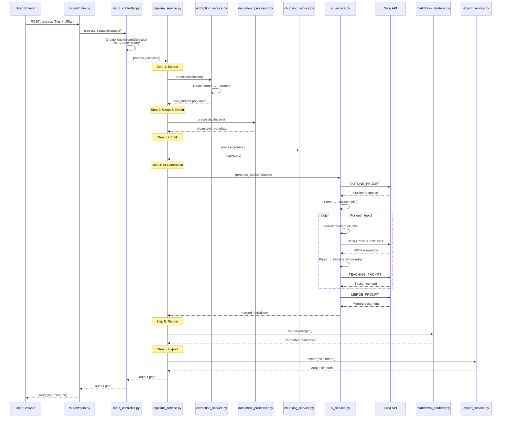
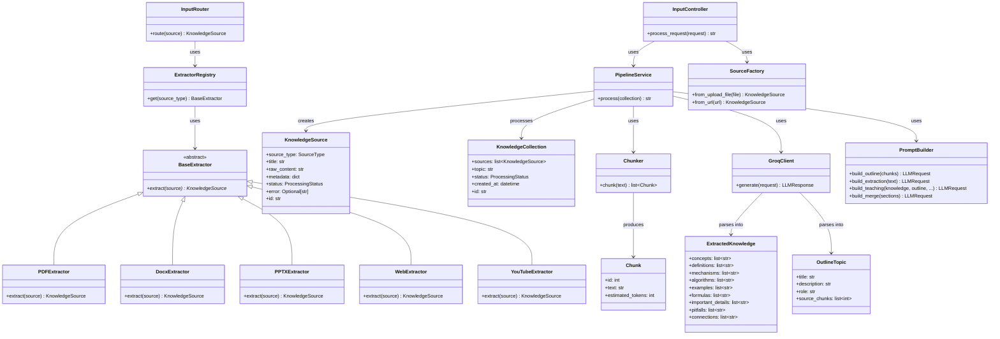

# Architecture Flow

```mermaid
graph TB
    subgraph User["User Layer"]
        A["Browser (index.html)"]
        B["Upload Files / Submit URLs"]
    end

    subgraph Web["Flask Web Layer"]
        C["run.py<br/>Entry Point"]
        D["app/__init__.py<br/>App Factory"]
        E["routes/main.py<br/>GET / POST /process"]
    end

    subgraph Controller["Controller Layer"]
        F["controllers/input_controller.py<br/>Parses request, creates KnowledgeCollection"]
        G["controllers/source_factory.py<br/>Factory: maps inputs → KnowledgeSource"]
    end

    subgraph Models["Data Models"]
        H["models/enums.py<br/>SourceType, ProcessingStatus, BlockType"]
        I["models/knowledge_source.py<br/>KnowledgeSource (dataclass)"]
        J["models/knowledge_collection.py<br/>KnowledgeCollection (dataclass)"]
        K["models/knowledge_document.py<br/>KnowledgeBlock, Section, Document"]
    end

    subgraph Pipeline["Pipeline (Facade)"]
        L["services/pipeline_service.py<br/>Orchestrates 6 subsystems sequentially"]
    end

    subgraph Extraction["Extraction Subsystem"]
        M["services/extraction_service.py<br/>Coordinates extraction"]
        N["ingestion/router.py<br/>Routes to correct extractor"]
        O["ingestion/registry.py<br/>Maps SourceType → Extractor"]
        P["ingestion/base_extractor.py<br/>ABC: abstract base extractor"]
        Q["ingestion/extractors/pdf_extractor.py<br/>PyMuPDF"]
        R["ingestion/extractors/docx_extractor.py<br/>python-docx"]
        S["ingestion/extractors/pptx_extractor.py<br/>python-pptx"]
        T["ingestion/extractors/web_extractor.py<br/>trafilatura"]
        U["ingestion/extractors/youtube_extractor.py<br/>youtube-transcript-api"]
    end

    subgraph Processing["Processing Subsystem"]
        V["processing/document_processor.py<br/>Clean, enrich, estimate tokens"]
        V1["processing/cleaners.py<br/>TextCleaner"]
        V2["processing/metadata.py<br/>MetadataExtractor"]
        V3["processing/token_estimator.py<br/>~4 chars/token"]
    end

    subgraph Chunking["Chunking Subsystem"]
        W["services/chunking_service.py<br/>Delegates to Chunker"]
        W1["chunking/chunk.py<br/>Chunk dataclass"]
        W2["chunking/chunker.py<br/>Sliding window, max 3000 tokens"]
    end

    subgraph AI["AI Generation Subsystem (2-Pass)"]
        X["services/ai_service.py<br/>Orchestrates outline → extract → teach → merge"]
        Y["llm/client.py<br/>GroqClient (llama-3.3-70b-versatile)"]
        Z["llm/prompt_builder.py<br/>Builds structured prompts"]
        AA["llm/outline_parser.py<br/>Parses outline → OutlineTopic[]"]
        AB["llm/extraction_parser.py<br/>Parses JSON → ExtractedKnowledge"]
        AC["llm/prompts/base.py<br/>Expert educator persona"]
        AD["llm/prompts/outline.py<br/>Topic planning prompt"]
        AE["llm/prompts/extraction.py<br/>JSON knowledge extraction prompt"]
        AF["llm/prompts/teaching.py<br/>Section writing prompt (teach)"]
        AG["llm/prompts/merge.py<br/>Document merge prompt"]
    end

    subgraph Rendering["Rendering & Export"]
        AH["rendering/markdown_renderer.py<br/>Joins sections with --- separator"]
        AI["services/export_service.py<br/>Writes app/outputs/notes.md"]
    end

    A -->|POST /process| E
    B -->|files + URLs| F
    E --> F
    F --> G
    G -->|SourceFactory| I
    I --> J
    J -->|KnowledgeCollection| L
    L -->|1. Extract| M
    M --> N
    N --> O
    O -->|SourceType| P
    P -->|PDF| Q
    P -->|DOCX| R
    P -->|PPTX| S
    P -->|Webpage| T
    P -->|YouTube| U
    Q & R & S & T & U -->|raw_content| I
    L -->|2. Clean| V
    V --> V1
    V --> V2
    V --> V3
    L -->|3. Chunk| W
    W --> W1
    W --> W2
    L -->|4. AI Generate| X
    X -->|build_outline| Z
    Z -->|OUTLINE_PROMPT| Y
    Y --> AA
    X -->|build_extraction| Z
    Z -->|EXTRACTION_PROMPT| Y
    Y --> AB
    X -->|build_teaching| Z
    Z -->|TEACHING_PROMPT| Y
    X -->|build_merge| Z
    Z -->|MERGE_PROMPT| Y
    AC --> AD & AE & AF & AG
    L -->|5. Render| AH
    L -->|6. Export| AI
    AI -->|notes.md| E
    E -->|send_file| A
```



---

## Data Flow Sequence



---

## Class Hierarchy



---

## Directory Tree

```text
📂 Hopeful, Ambition, Scared/
├── 📄 run.py                      # Entry point
├── 📄 config.py                   # Flask config
├── 📄 requirements.txt
├── 📄 .env                        # GROQ_API_KEY
├── 📂 app/
│   ├── 📄 __init__.py             # Flask app factory
│   ├── 📂 routes/
│   │   └── 📄 main.py             # GET /, POST /process
│   ├── 📂 controllers/
│   │   ├── 📄 input_controller.py
│   │   └── 📄 source_factory.py
│   ├── 📂 models/
│   │   ├── 📄 enums.py
│   │   ├── 📄 knowledge_source.py
│   │   ├── 📄 knowledge_collection.py
│   │   └── 📄 knowledge_document.py
│   ├── 📂 services/
│   │   ├── 📄 pipeline_service.py  # Facade
│   │   ├── 📄 extraction_service.py
│   │   ├── 📄 chunking_service.py
│   │   ├── 📄 ai_service.py
│   │   └── 📄 export_service.py
│   ├── 📂 ingestion/
│   │   ├── 📄 base_extractor.py    # ABC
│   │   ├── 📄 registry.py          # Registry pattern
│   │   ├── 📄 router.py            # Router pattern
│   │   └── 📂 extractors/
│   │       ├── 📄 pdf_extractor.py
│   │       ├── 📄 docx_extractor.py
│   │       ├── 📄 pptx_extractor.py
│   │       ├── 📄 web_extractor.py
│   │       └── 📄 youtube_extractor.py
│   ├── 📂 processing/
│   │   ├── 📄 document_processor.py
│   │   ├── 📄 cleaners.py
│   │   ├── 📄 metadata.py
│   │   └── 📄 token_estimator.py
│   ├── 📂 chunking/
│   │   ├── 📄 chunk.py
│   │   └── 📄 chunker.py
│   ├── 📂 llm/
│   │   ├── 📄 models.py
│   │   ├── 📄 knowledge_models.py
│   │   ├── 📄 client.py            # GroqClient
│   │   ├── 📄 prompt_builder.py
│   │   ├── 📄 outline_parser.py
│   │   ├── 📄 extraction_parser.py
│   │   └── 📂 prompts/
│   │       ├── 📄 base.py
│   │       ├── 📄 outline.py
│   │       ├── 📄 extraction.py
│   │       ├── 📄 teaching.py
│   │       └── 📄 merge.py
│   ├── 📂 rendering/
│   │   └── 📄 markdown_renderer.py
│   ├── 📂 templates/
│   │   └── 📄 index.html
│   └── 📂 outputs/
│       └── 📄 notes.md             # Generated output
├── 📂 tests/
├── 📂 uploads/
├── 📂 notes_test/
├── 📂 logs/
└── 📂 development log/
```
