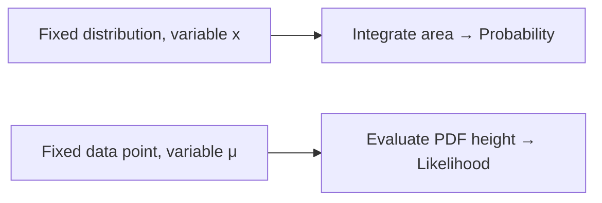

### 🗺️ Navigation

### Part I: Defining Probability
- [[#📏 Defining Probability through Distribution Areas]]
- [[#📏 Mathematical Notation for Probability]]

### Part II: Understanding Likelihood
- [[#🔎 Understanding Likelihood via Fixed Data Points]]

### Part III: Comparison and Inference
- [[#🎯 Distinguishing Probability and Likelihood]]

---

## ▣ I: Defining Probability

---

### 📏 Defining Probability through Distribution Areas  

When we talk about *probability* we’re asking a very specific question: **If the world (the distribution) is already set, what’s the chance that a future observation lands inside a particular range?**  
Think of a hill‑shaped curve (the normal density). The shape – set by its mean μ and standard deviation σ – never moves. The only thing that changes is the slice of the x‑axis we’re interested in. The probability is the *area* under that slice.

### 1.1 — How it works, step by step

1. **Lock the distribution.** Choose the parameters (μ, σ) and keep them fixed.  
2. **Pick the interval.** Decide the lower and upper bounds that define the event you care about.  
3. **Measure the area.** Integrate the density between those bounds (or use a table/calculator).  

That area is a number between 0 and 1 – the familiar “chance” we talk about.

> [!tip] **Area = Chance**  
> The bigger the slice you carve out, the larger the area, and the higher the probability. Tiny slices give tiny probabilities.

> [!warning] **Don’t mix up what’s fixed**  
> In probability the *distribution* is constant; the *data* (the interval) moves. Swapping them flips the whole interpretation.

### 1.2 — Concrete worked example

Suppose we have a normal distribution for mouse body weight with  
* μ = 32 g, σ = 2.5 g.  
We want the probability that a mouse weighs **between 32 g and 34 g**.

| Step | Calculation | Result |
|------|-------------|--------|
| 1. Convert bounds to z‑scores | $z_{low} = \frac{32-32}{2.5}=0$ <br> $z_{high} = \frac{34-32}{2.5}=0.80$ | $z_{low}=0,\; z_{high}=0.80$ |
| 2. Look up cumulative probabilities | $\Phi(0)=0.5000$ <br> $\Phi(0.80)=0.7881$ (standard normal table) | |
| 3. Subtract to get the area | $P = \Phi(0.80)-\Phi(0)=0.7881-0.5000$ | **0.2881 ≈ 0.29** |

So there’s about a **29 %** chance a randomly selected mouse falls in that 2‑gram window.

The key formula we just used can be written compactly as  

$$\boxed{Pr(a < X < b \mid \mu, \sigma) = \int_{a}^{b} \frac{1}{\sigma\sqrt{2\pi}}\,e^{-\frac{(x-\mu)^2}{2\sigma^2}}\,dx}$$  

where the integral is exactly the “area under the curve” between $a$ and $b$.

### 1.3 — Quick visual of the process

```mermaid
flowchart LR
    A[Fix distribution (μ,σ)] --> B[Choose interval (a,b)]
    B --> C[Compute area under curve]
    C --> D[Probability result]
```
*Diagram: flow from a fixed distribution to the final probability.*

> [!important] **Core takeaway**  
> Probability = *area* under a **fixed** distribution for a **chosen interval** of outcomes.  

Understanding this viewpoint is the first half of the probability ↔ likelihood pair: it tells us how to predict *future* observations when the model is already set. The other half—likelihood—flips the perspective (fixed data, varying model). We'll explore that next.

So, how do we actually represent this on paper?

### 📏 Mathematical Notation for Probability

When we talk about **probability** we’re asking a very specific question: *If the world is described by a particular probability distribution (its parameters are set in stone), how much of that world falls inside a certain range of outcomes?*  

In other words, the **distribution** is the fixed backdrop, and the **data range** is what we move around to see how much area it captures.

### 1.4 — The Core Notation

The standard way to write this idea is  

$$\boxed{pr(\text{weight range} \mid \mu, \sigma)}$$  

read as “the probability of a weight falling inside the given range **given** the mean $\mu$ and standard deviation $\sigma$ of the distribution.”  

- The vertical bar “$\mid$” separates what is **variable** (the weight interval) from what is **fixed** (the parameters $\mu,\sigma$).  
- The whole expression evaluates to a number between 0 and 1 – the area under the curve for that interval.

> [!important] **Probability vs. Likelihood**  
> Probability treats the distribution parameters as constants and varies the outcome range.  
> Likelihood flips the story: the observed data point stays constant while the parameters move.

### 1.5 — Step‑by‑Step Procedure

1. **Specify the distribution** – decide on $\mu$ and $\sigma$ (e.g., a normal curve).  
2. **Choose the outcome interval** – the lower and upper bounds you care about.  
3. **Integrate the probability density function (PDF)** over that interval.  
4. **Report the resulting area** – that’s the probability.


*Flow of a probability calculation when the distribution is fixed.*

### 1.6 — Worked Example

Suppose mouse weights are modeled by a normal distribution with  

- Mean $\mu = 32$ g  
- Standard deviation $\sigma = 2.5$ g  

We want the probability that a randomly selected mouse weighs **between 32 g and 34 g**.

| Step | What we do | Numbers |
|------|------------|---------|
| 1 | Fix the distribution | $\mu = 32,\; \sigma = 2.5$ |
| 2 | Set the interval | $[32,\;34]$ |
| 3 | Compute the area under the normal curve from 32 to 34 | $pr(32\!-\!34 \mid 32,2.5) = 0.29$ |

So there’s a **29 %** chance of picking a mouse in that weight slice.

> [!example] **Probability in Action**  
> Using a standard normal table (or software), the cumulative probability at 34 g is about 0.629, and at 32 g it’s about 0.340. Their difference, $0.629 - 0.340 = 0.289$, rounds to **0.29**.

> [!tip] **What the number means**  
> Think of the 0.29 as the fraction of the whole bell‑shaped world that lies between those two vertical lines. If you plotted a million mouse weights, roughly 290 000 of them would fall in that band.

### 1.7 — Why the Notation Matters

Writing $pr(\text{range} \mid \mu, \sigma)$ makes it crystal clear **which pieces are allowed to move**. This clarity is the foundation of statistical inference: once we understand probability, we can flip the script to **likelihood**, where the data point is fixed and we vary $\mu,\sigma$ to see which “world” best explains what we observed.

> [!warning] **Common Misstep**  
> It’s easy to swap the roles of data and parameters and treat likelihood as if it were just another probability. Remember: in probability the *distribution* is static; in likelihood the *data* is static.

With this notation in hand, you’re ready to translate any “what‑if” question about a fixed model into a tidy, computable probability. Next up we’ll see how the same symbols look when we turn the question around and talk about **likelihood**.

So how do we actually visualize this shift in perspective?

---

## ▣ II: Understanding Likelihood

---

### 🔎 Understanding Likelihood via Fixed Data Points

Imagine you’ve already caught a mouse that weighs **34 g**.  
Now you wonder: *“Which bell‑curve (i.e., which mean μ) would make this observation most plausible?”*  
That question is what **likelihood** answers.  

Instead of asking “How much area under a known curve falls between 32 g and 34 g?” (that’s probability), we keep the **data point fixed** and let the **distribution parameters move**. The y‑value of the probability‑density function (PDF) at the observed point is the *likelihood* of those parameters given the data.

---

### 2.1 — The formal view

For a normal distribution with mean μ and standard deviation σ, the likelihood of a single observation *x* is simply the PDF evaluated at *x*:

$$\boxed{L(\mu,\sigma \mid x) \;=\; \frac{1}{\sqrt{2\pi}\,\sigma}\,
\exp\!\Bigl(-\frac{(x-\mu)^{2}}{2\sigma^{2}}\Bigr)}$$

> [!important] **Key insight**  
> The likelihood treats *x* as a constant and asks, “How tall is the curve at *x* for each possible (μ,σ)?” It’s a **density**, not a probability, so it doesn’t have to sum to 1.

---

### 2.2 — Worked example – which mean fits the mouse better?

| Assumed mean μ | σ (kept constant) | Observation *x* = 34 g | Likelihood $L(\mu,\sigma\mid x)$ |
|---------------|-------------------|------------------------|-----------------------------------|
| 32 g          | 2.5 g             | 34 g                   | 0.12 |
| 34 g          | 2.5 g             | 34 g                   | 0.21 |

**Steps**

1. Plug the numbers into the boxed formula.  
2. With μ = 32 g:  
   $$L = \frac{1}{\sqrt{2\pi}\,2.5}\exp\!\Bigl(-\frac{(34-32)^{2}}{2\cdot2.5^{2}}\Bigr) \approx 0.12$$  
3. With μ = 34 g (the observation’s own value):  
   $$L \approx 0.21$$  

> [!tip] **What the numbers mean**  
> A higher likelihood (0.21 vs 0.12) tells us the μ = 34 g curve makes the observed 34 g mouse *more plausible* than the μ = 32 g curve.

---

### 2.3 — Why likelihood matters

When we have many observations, we can multiply their individual likelihoods (or add log‑likelihoods) and then pick the parameters that **maximise** this product. That is the heart of **Maximum Likelihood Estimation (MLE)** – the statistical engine that turns raw data into fitted models.

> [!warning] **Common mistake**  
> Likelihood is **not** a probability. It can exceed 1 and does not represent an “area”. Treating it like a probability leads to confusing statements such as “the likelihood of μ = 34 g is 0.21 %”.

---

### 2.4 — Quick visual comparison


*Figure: Probability vs. Likelihood – the fixed element (distribution or data) swaps places.*

---

### 2.5 — Linking back

If you need a refresher on the probability side of the story, see [[#📏 Defining Probability through Distribution Areas]].

---

So, how exactly does this change the way we think about the two concepts in practice?

---

## ▣ III: Comparison and Inference

---

### 🎯 Distinguishing Probability and Likelihood  

When you work with a statistical model you constantly flip the script between *what the world looks like* and *what the world must look like* given what you’ve seen.  
- **Probability** asks: *If I already know the shape of the distribution (its mean μ and standard deviation σ), how much area lies between two values?*  
- **Likelihood** asks: *If I already saw a particular value, which shape of the distribution makes that observation most plausible?*  

Think of probability as looking at a **fixed landscape** and measuring how big a region you’ll wander into.  
Likelihood is like standing on a **single spot** and asking which map of the terrain would most likely put you there.

> [!important] **Core distinction**  
> In probability notation the *parameters* (μ, σ) appear on the right side of the pipe:  
> $$\Pr(\text{data} \mid \text{distribution})$$  
> In likelihood notation the *observed data* sits on the right side:  
> $$L(\text{distribution} \mid \text{data})$$  

The boxed formula that ties the two together is  

$$\boxed{\Pr(\text{data} \mid \text{distribution}) \;\;\text{vs.}\;\; L(\text{distribution} \mid \text{data})}$$  

---

### 3.1 — 📊 How the two calculations differ

| Aspect | Probability | Likelihood |
|--------|-------------|------------|
| What you **hold fixed** | The distribution parameters (μ, σ) | The observed data point (x) |
| What you **vary** | The interval of possible outcomes | The distribution parameters |
| Typical question | “What’s the chance my mouse weighs between 32 g and 34 g?” | “Given I observed a mouse weighing 34 g, which μ makes this most likely?” |
| Result type | An **area** under the curve (a number between 0 and 1) | A **height** on the density curve (also between 0 and 1, but not a probability) |

> [!warning] **Common mistake**  
> Swapping the fixed part leads to nonsense: you can’t treat the data as a variable when computing a probability, and you can’t treat the parameters as a variable when evaluating a likelihood.

---

### 3.2 — 🧪 Worked example

Suppose mouse weights follow a Normal(μ, σ = 2.5) distribution.

1. **Probability** – What’s the chance a mouse weighs between 32 g and 34 g when μ = 32?  
   Using the Normal CDF, the area between 32 and 34 comes out to **0.29**.

2. **Likelihood** – We actually observed a mouse weighing **34 g**.  
   - If we assume μ = 32, the density at x = 34 is **0.12**.  
   - If we shift the mean to μ = 34, the density jumps to **0.21**.  

The higher density (0.21) tells us that a mean of 34 g makes the observed weight more plausible.

> [!example] **Numbers at a glance**  
> | Scenario | Fixed μ | Fixed x | Density (likelihood) |
> |----------|--------|--------|----------------------|
> | μ = 32, x = 34 | 32 | 34 | 0.12 |
> | μ = 34, x = 34 | 34 | 34 | 0.21 |

> [!tip] **What the numbers mean**  
> The likelihood doesn’t tell you “the probability of 34 g”; it tells you *how well a particular μ explains the fact that you saw 34 g*. That’s why the value can increase when you move μ closer to the observed point.

---

### 3.3 — 🔄 Quick visual of the two workflows

```mermaid
flowchart LR
    ProbStart[Start Probability] --> ProbDefine[Define μ, σ]
    ProbDefine --> ProbInterval[Choose interval (a,b)]
    ProbInterval --> ProbArea[Integrate area under curve]
    ProbArea --> ProbEnd[Result: probability]

    LikeStart[Start Likelihood] --> LikeData[Fix observed x]
    LikeData --> LikeParams[Let μ, σ vary]
    LikeParams --> LikeHeight[Evaluate density at x]
    LikeHeight --> LikeEnd[Result: likelihood]
```
*Diagram: left side shows the probability pipeline (fixed parameters → area), right side shows the likelihood pipeline (fixed data → height).*

---

### 3.4 — 📚 Why this matters

Grasping the flip‑side view is the stepping stone from **descriptive statistics** (telling you what you expect to see) to **inferential statistics** (telling you which model best explains what you did see).  
Maximum‑likelihood estimation, a workhorse in modern machine learning, leans entirely on the likelihood perspective.

> [!info] **Bottom line**  
> Think of probability as “*given the map, where might I wander?*” and likelihood as “*given where I am, which map fits?*”. Once the mental switch clicks, fitting models becomes a natural next step.

---

| Term | Definition |
|------|------------|
| **Cumulative Probability** | The total area under a probability density function from negative infinity up to a specific value. |
| **Density (PDF)** | A function whose value at any given point provides a relative likelihood that the value of the random variable would equal that sample. |
| **Likelihood** | A measure of how well a specific set of model parameters explains observed data, calculated as the height of the PDF at that data point. |
| **Maximum Likelihood Estimation (MLE)** | A statistical method used to estimate parameters by finding values that maximize the likelihood of the observed data. |
| **Mean (μ)** | The average value of a distribution, serving as a primary parameter in models like the normal distribution. |
| **Normal Distribution** | A bell-shaped probability distribution defined by its mean and standard deviation. |
| **Parameters** | Fixed values (like μ and σ) that define the shape and location of a probability distribution. |
| **Probability** | The area under a fixed distribution curve within a defined interval of outcomes. |
| **Standard Deviation (σ)** | A measure of the amount of variation or dispersion in a set of values, acting as a scale parameter. |
| **Z-score** | A statistical measurement that describes a value's relationship to the mean of a group of values, measured in terms of standard deviations. |

*Sources: The provided guide on Probability vs. Likelihood.*