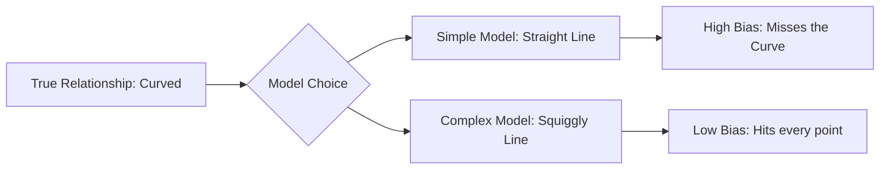
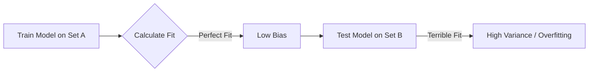
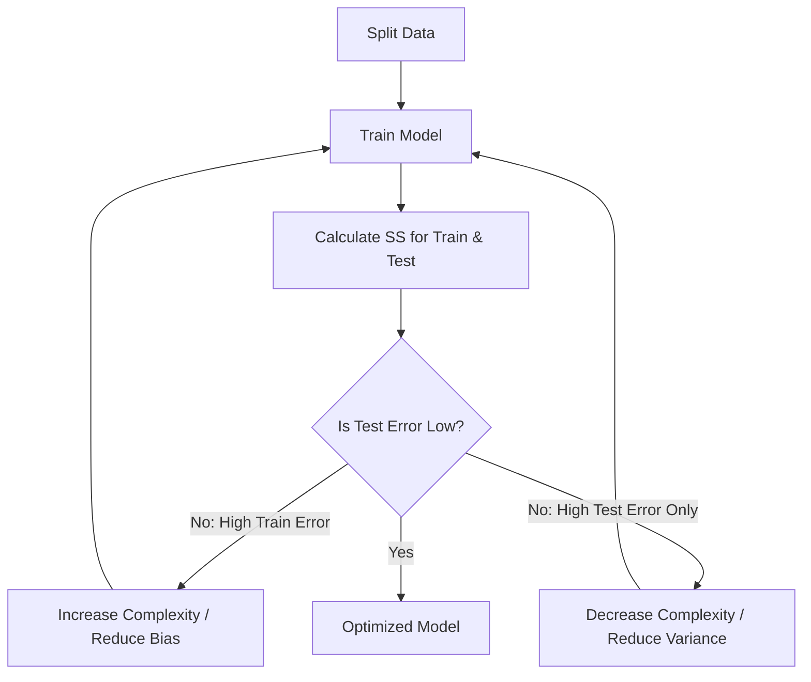

# Understanding Bias and Variance: A Guide to Model Fit

In machine learning, our goal is to build a model that understands the relationship between variables. However, we often run into two fundamental problems: being too simple or being too complex. Let's define our terms early: 
- Let $y$ = the actual data point (the truth).
- Let $\hat{y}$ = our model's prediction (the guess).
- Let $SS$ = the Sum of Squares (our error score).

## Bias: The Stubborn Model

Think of **Bias** as a model being a bit too stubborn. It has a pre-conceived notion of what the data should look like and sticks to that idea even when the data tries to tell it something else.

Bias is the inherent inability of a model to capture the true relationship between variables. Usually, this happens because the model we chose is too simple for the job.

### Why Bias Happens: The Mouse Example
Imagine we are trying to predict the height of a mouse based on its weight. In the real world, weight and height usually have a linear relationship at first, but eventually, the mouse reaches its full height. It might keep gaining weight, but it won't get any taller; the relationship plateaus.

If we use a **Linear Regression** model, we are essentially forcing a straight line onto that data.

> [!note] The "Straight Line" Problem
> Linear Regression is a "high bias" method. It assumes the relationship is a straight line, no matter what. It lacks the flexibility to bend or curve, meaning it will always miss that plateau where the mouse stops growing.

Because the straight line can’t curve to follow the data, it will never perfectly represent reality. That "missing" accuracy is what we call bias. 


*Caption: Simple models are restricted by their own rules, leading to higher bias.*

High-bias models are consistent but often wrong. They don't change much when you show them new data, but they struggle to get close to the truth. To fix this, we need more flexibility—but that leads us directly to the opposite problem.

## Variance: The Over-Sensitive Model

If [[#Bias: The Stubborn Model]] is about a model being too stubborn to learn, **Variance** is about a model being way too sensitive to the specific data you show it. While a biased model ignores nuances, a high-variance model obsesses over them. It treats every tiny fluctuation or random outlier as a "rule" that it must follow.

### The Squiggly Line Problem
Think back to our mice. If we use a super-flexible, "squiggly" model, it can bend and curve until it passes through every single data point. On paper, this looks amazing because the distance between the model and the data is zero. It has essentially zero bias because it perfectly captures the relationship... for *that specific* group of mice.

The problem starts when we introduce a new set of data. Because the squiggly line was so focused on the first set, it won't line up with the new ones at all.

> [!warning] The Definition of Variance
> In machine learning, **Variance** is the difference in fits between different datasets. If your model changes drastically every time you give it new data, it has high variance.

### Testing for Generalization
To see if a model is actually useful or just memorizing noise, we split our data:
1. **The Training Set:** What we use to teach the model.
2. **The Testing Set:** What we use to see if the model actually "gets it."

When a model performs beautifully on the training set but fails on the testing set, we call that **Overfitting**. The model is so specialized that it can't "generalize."


*Caption: A model that is too flexible fits the training data perfectly but fails to generalize to new data.*

## Sum of Squares: Measuring the Gap

To compare the "stubborn" straight line versus the "sensitive" squiggly line, we can't just eyeball the graphs. We need a way to turn "how close is this?" into a number. We use the **Sum of Squares ($SS$)** as a scoreboard for accuracy.

### The Procedure
To figure out how well a model fits, we look at the distance between the truth ($y$) and the prediction ($\hat{y}$).

1. **Find the gap:** For a single data point, calculate $(y - \hat{y})$.
2. **Square it:** This ensures the values are positive and penalizes larger gaps more heavily: $(y - \hat{y})^2$.
3. **Add it up:** Repeat for every point and sum them together.

\[
SS = \sum_{i=1}^{n} (y_i - \hat{y}_i)^2
\]

The goal is usually to get this number as low as possible. A low $SS$ means the model is staying close to the data points. However, as we saw in [[#Variance: The Over-Sensitive Model]], a perfect score of zero on training data often means you've over-explained the noise rather than finding a universal rule.

## The Bias-Variance Tradeoff: Finding the Sweet Spot

The relationship between bias and variance is a high-stakes tug-of-war. The goal of machine learning is to find the exact point where that rope is perfectly balanced. This is the **Bias-Variance Tradeoff**.

### The Balancing Act
- **Increasing complexity** reduces bias (the model stops being stubborn) but increases variance (it starts getting too squiggly).
- **Decreasing complexity** reduces variance (the model becomes consistent) but increases bias (it becomes too simple).

We are looking for the "Goldilocks" level of complexity. When a model is too complex, it results in **Overfitting**.

> [!example] The Exam Analogy
> Overfitting is like a student who memorizes the specific numbers in a practice math problem but has no idea how to solve the same problem with different numbers on the actual exam. They haven't learned the "rule"; they've just memorized the "noise."

### Visualizing Total Error
If you graph the total error against complexity, you get a U-shaped curve. The error starts high (High Bias), drops as we find the pattern, and then starts climbing again as the model begins to overfit (High Variance).

```mermaid
xychart-beta
    title "The Bias-Variance Tradeoff"
    x-axis "Model Complexity" ["Low", "Medium", "High"]
    y-axis "Total Error" [0, 10]
    line "Error on Testing Data" [9, 3, 8]
```
*Caption: The "Sweet Spot" is the bottom of the U-curve, where testing error is minimized.*

## Optimization: Practical Strategies

How do we actually find that sweet spot? Optimization is the process of using technical checkpoints to ensure the model is learning the rules, not just memorizing the room.

### The Train/Test Split
The most important method is the **Train/Test Split**. If you only look at your training data, you’re flying blind. 
1. **Train:** Let the model find its shape.
2. **Test:** Use a separate, clean set of data to see if that shape actually works.

### The Optimization Loop
Using the $SS$ score we defined in [[#Sum of Squares: Measuring the Gap]], we can spot exactly when our model starts to fail:
- If the training score is great but the testing score is terrible, you have **High Variance**.
- If both scores are mediocre, you have **High Bias**.


*Caption: The optimization loop involves adjusting complexity based on the gap between training and testing performance.*

> [!tip] The Golden Rule of Optimization
> Never trust a model that hasn't been "vetted" by a testing set. The goal is consistency across *all* data, not perfection on *some* data.

By adjusting the complexity—adding or removing "squiggles"—until the $SS$ on your testing set is as low as possible, you reach a model that can actually predict the future rather than just repeating the past.