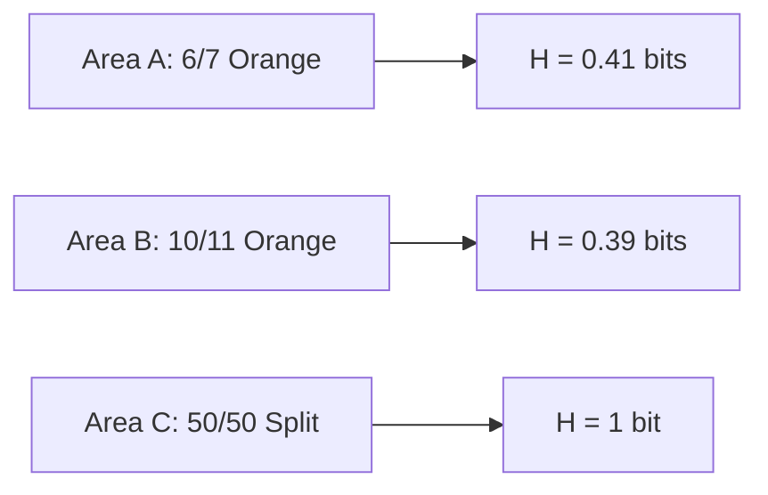

# Entropy's Applications and Intuition 🧠

> [!note] **Why this matters**  
Entropy is the backbone of data science tools we use daily - from splitting decision trees to understanding how different datasets "look" statistically. Think of it as a universal tool for measuring uncertainty that powers everything from recommendation engines to image recognition.

---

## The Core Idea: Entropy as "Information Disorder"  
Imagine flipping a coin, but instead of fair flips, you're analyzing which chickens roam in which area of a farm. Entropy helps us measure how *unpredictable* our observations are.  

### Key Connections to Real World Tools  
- **Decision Trees**: When your algorithm splits data (e.g., "Is the chicken orange?"), it's trying to reduce entropy - find where the data becomes more "ordered".
- **t-SNE/UMAP**: These advanced visualization tools use entropy to keep clusters from getting too squashed or distorted.
- **Language Models**: When GPT says "I think this sentence makes sense...', it's secretly comparing entropies of word sequences.

---

### The "Surprise" Framework  
This is the fun part: we quantify how shocked (or unsurprised) we'd be by events.  
```mermaid
graph LR
    Probability(p) --> InverseRelationship --> Surprise(-log(p))
    Surprise --> EntropyAccumulation
    EntropyAccumulation --> OverallUncertainty
```

> [!tip]  
Think of surprise like this: a rainy day in Seattle is low surprise (p = 0.99), but rain in the Sahara? Massive surprise (-log(0.01) = 4.6 bits). Logarithms normalize these wild differences in scale.

---

## Calculating Entropy: The Three-Step Dance  
Let's break down the famous formula `H = -Σ p log p` through our chicken example:

1. **Find probabilities**  
   In Chicken Area A:  
   - P(orange) = 6/7  
   - P(blue) = 1/7

2. **Calculate individual surprises**  
   - Surprise(orange) = -log2(6/7) ≈ 0.22 bits  
   - Surprise(blue) = -log2(1/7) ≈ 2.81 bits

3. **Aggregate into entropy**  
   H = (6/7)(0.22) + (1/7)(2.81) ≈ 0.41 bits

> [!warning]  
Don't fall into the "1/p trap"! Using linear 1/p instead of log(1/p) gives us absurd results for small probabilities. Try calculating surprise(tails) for a fair coin using both approaches - see how logs behave sanely, while 1/p becomes a 200% chance.

---

### When Entropy Gets Tricky  
- **Fair Coin (p=0.5)**: Max entropy at 1 bit. Like a Russian roulette round - totally unpredictable!
- **Certain Events (p=1)**: Zero entropy, like how you know your boss will be annoyed by a typo
- **Zero Probability**: Math says log(0) = -∞, which correctly tells us impossible events can't contribute to uncertainty

---

## The Big Picture  
Entropy isn't just an abstract measure. It's the secret ingredient that:  
- Tells us how good our decision tree splits are
- Helps compare if Google's dataset "matches" your training distribution
- Keeps dimensionality reduction from being just line noise

We'll next dive into the math behind surprise accumulation in [[#Surprise Probability Relationship and Entropy Derivation]] - specifically why logs work so well for combining independent events. For now, remember: in machine learning, lower entropy = higher certainty, while maximum entropy distributions are our baseline "no signal" case.

# How Probability and Surprise Connect 🔍  

> [!note]  
> This is the missing puzzle piece: why logarithms show up in entropy formulas and how we turn odds into "information units."  

---

## The "Shocking Value" of Events  
Let’s start with a simple concept: **the rarer an event, the more shocking it is**.  

Think of it like this:  
- A pigeon flying into a pond (probability `0.99`) → low shock → `≈ 0.014` bits (we’ll explain bits later)  
- A rainbow in Seattle (probability `0.01`) → high shock → `≈ 6.64` bits  

The formula that creates this balance is:  
```
Surprise(s) = log₂(1/p) = -log₂(p)
```  

> [!tip]  
> Think of `log₂` as a "stretchy ruler" that squishes huge probabilities (like 0.99) into tiny numbers, while blowing up rare events (like 0.01) into big ones. This makes comparisons fairer.

---

## Why Not Just Use 1/p?  

If you’ve ever thought, "Why not use `1/p` instead of `log₂(1/p)`?" — here's why!  

Let’s test it with a fair coin (p=0.5):  
- `log₂(1/0.5) = log₂(2) = 1` bit → Perfect, aligns with intuition  
- `1/p = 2` → Hmm, this gives a *higher* value. But wait, let's test an unfair coin (p=0.9):  
  - `log₂(1/0.9) ≈ 0.15` bits → Still small, makes sense  
  - `1/p ≈ 1.11` → Way too high for "low surprise"  

> [!warning]  
> Using `1/p` breaks intuition at p=0.5 (doubles the surprise value for a 50% event). Logs keep the scaling manageable and avoid blowing up for even chances.  

---

## Deriving Entropy: Averaging the Shock Factor  
Now imagine flipping multiple coins in a sequence. Each flip has its own probability and "shock level." **Entropy is just the average shock across all possible outcomes.**  

Here’s the formula in plain English:  
```mermaid
flowchart LR
    Probability(p) --> Surprise(log(p))
    Surprise --> WeightedAverage[Probability × Surprise]
    WeightedAverage --> TotalEntropy 
```

Let’s apply this to an example where:  
- P(A) = 0.9, P(B) = 0.1  

1. Calculate surprises:  
   - Surprise(A) = -log₂(0.9) ≈ 0.15 bits  
   - Surprise(B) = -log₂(0.1) ≈ 3.32 bits  

2. Multiply by probabilities:  
   - 0.9 × 0.15 = 0.135  
   - 0.1 × 3.32 = 0.332  

3. Add them up:  
   - Total entropy ≈ **0.467 bits**  

> [!example]  
> Try this yourself with a fair coin (p=0.5) → each term is `0.5 × 1 = 0.5`, so total entropy = 1 bit. A perfect balance of uncertainty.  

---

## Why Logarithms Work So Well  
We use `log₂` instead of any other base because:  
1. **Additivity** → Surprise of multiple independent events just adds up.  
   *Example: Two coin flips (p=0.25 for tails twice):*  
   - `log₂(1/0.25) = 2` bits → 1 bit per coin  
2. **Bits as binary units** → Easier to reason about data compression, computer systems  

> [!tip]  
> Think of entropy as "how much you’d need to pay in bits" to describe outcomes efficiently. Lower entropy = better compression possible.

---

## Edge Cases to Watch For  
1. **p=1** (Certain event):  
   - `log(1) = 0` → No uncertainty → 0 surprise → 0 entropy  
2. **p=0** (Impossible event):  
   - `log(0) = -∞` → Mathematically invalid, but in code we treat it as 0 (0 × ∞ = 0 in limits)  
3. **Perfectly random events** (e.g., p=0.5):  
   - Max entropy → No compression possible, like random binary noise  

> [!note]  
> For coding: Always add a tiny number (`ε`) like `1e-12` to avoid `log(0)` errors in code if p can reach zero.  

---

## The Big Link: Entropy = Expected Information  
This all ties back to the Shannon entropy formula:  
```math
H(X) = -Σ p(x) · log₂(p(x))
```  

- The **expected** value (average) of surprises for all outcomes  
- Units are **bits** (binary digits) when using `log₂`  

> [!example]  
> If we have 3 outcomes with p=`[0.33, 0.5, 0.17]`  
> - Surprises: `1.59, 1, 2.62` bits  
> - Entropy = `0.33×1.59 + 0.5×1 + 0.17×2.62 ≈ 1.48 bits`  

This will directly connect to how decision trees pick splits in [[#Entropic Decision Trees and Feature Selection]], so let’s keep these formulas fresh in mind!

# Practical Entropy Calculations and Edge Cases 🧮

Let’s get hands-on with real-world numbers and see what happens at those weird probability edges. This is where theory meets practice — like debugging code with concrete test cases.

> [!note]  
> Why this matters: This section shows how entropy reveals what's "normal" vs "chaotic" in your data. If you're building models or analyzing datasets, these calculations help you spot where uncertainty is hiding.

---

## 🐔 The Chicken Area Entropy Quiz

Here's our dataset again — chickens hanging out in different farm zones:
- **Area A**: 6 orange chickens, 1 blue chicken
- **Area B**: 10 orange, 1 blue
- **Area C**: 6 orange, 6 blue

We calculated Area A’s entropy as ~0.41 bits earlier. Let’s dig into the others and spot patterns.



> [!example]  
> **Area C** is our "best guess" scenario. With perfect balance:  
> 1. $ p(\text{orange}) = 0.5 $, $ p(\text{blue}) = 0.5 $  
> 2. Surprises both = $ -\log_2(0.5) = 1 $  
> 3. Entropy = $ 0.5 \times 1 + 0.5 \times 1 = 1 $  
> This is max entropy for a binary system — like a roulette wheel before spinning!

> [!warning]  
> **Area B** has *slightly less* entropy than Area A (0.39 vs 0.41). That’s counterintuitive — shouldn’t 10 vs 1 have more uncertainty than 6 vs 1? It depends on the math! The blue chicken's extreme rarity dominates calculations both times.

---

## Edge Case Landmines 🧨

Here are the tricky corners where entropy calculations behave unexpectedly:

### 1. **Certain Events (p=1 or p=0)**
- If a chicken **must** be orange ($ p=1 $), entropy = 0  
  - Like knowing your GPS app will crash again  
- If a chicken **can’t** be blue ($ p=0 $), math says $ -\log(0) = \infty $  
  - But in practice: treat $ 0 \times \infty = 0 $ (limits work like this)

> [!tip]  
> **Avoiding log(0) errors**: Add a tiny number (like 0.000001) when calculating probabilities. This keeps your code from exploding when rare events disappear from data.

---

## Why This Works the Way It Does

Entropy behaves strangely at extremes because:
- **Balanced systems** maximize disorder (Area C's 1 bit)
- **Biased systems** reduce uncertainty (Areas A/B < 1 bit)
- **Extremes** like 0.001 probability blow up surprise values  
  - But their tiny probabilities cancel that blowup via multiplication

> [!example]  
> Try calculating H for a 99/1 split:  
> $ 0.99 \times -\log_2(0.99) + 0.01 \times -\log_2(0.01) \approx 0 + 0.066 = 0.066 $ bits  
> That's almost like having a **deterministic** system! 

---

## The Bigger Picture

These calculations are how:
- Decision trees choose splits (go for lower entropy groups)
- Language models decide "likely next word" candidates  
- Compression algorithms know which data they can squish

As we'll see in [[#Entropy Derivation from Scratch]], these patterns aren't magic — they emerge naturally from how logarithms work with probabilities. But for now: remember that entropy isn’t just about "randomness," it’s about how **predictable** your data really is.