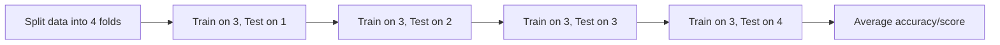
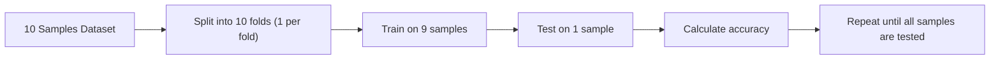
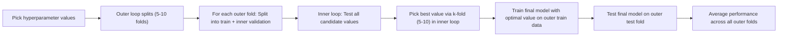

> [!note] Think of training like learning from a textbook, testing like a school exam. If the test is the same questions from the book, it’s not fair.

## Training and Testing Data Challenges in Machine Learning

Why does this matter? Picture your friend who memorizes the exact questions from a study guide but can’t solve new problems on the actual test. That’s what happens to models when they learn patterns in training data so well that they break on new data — it’s called **overfitting**. 

Let me explain. When we train a model, we want it to **learn the underlying patterns** in data (like math concepts) not **copy answers** (like memorizing equations). But if we test it on the same data it learned from, it’s like giving a student the exact questions from the study guide for the final. The model might show off with 100% accuracy… on data it already knows inside out. But what happens when it faces a new question? Suddenly, it’s guessing.

This leads to two big problems:
1. **Overfitting**: Model becomes a human calculator for the training examples but fails on new ones.
2. **Unreliable performance**: High test accuracy = party time, until you realize the party’s based on recycled data.

> [!tip] Always split data into separate training and testing sets. Think of it like a teacher creating a practice session and a real exam from different sources.

Real-life datasets are messy. Imagine trying to predict weather patterns using only data from one city — your model might miss key factors influencing results elsewhere. But that’s a whole other rabbit hole (we’ll cover that later in **Edge Cases**).

> [!warning] Watch out for: When you see “98% accuracy” on training data, be suspicious. It might not mean what you think it means at all.

> [!note] Cross-validation prevents your model from getting too cozy with one dataset by forcing it to take multiple "tests."

Let’s say you trained your model on the full dataset and saw 98% accuracy. That’s impressive… until it crumbles later like a cookie in water. How do you build a version that handles surprises? Enter **cross-validation** — it’s like giving your model a stress test where it has to answer different questions each time.

Here’s how it works step-by-step:  
1. **Split your data into `k` equal parts** (folds). Let’s say you choose 4 splits.  
2. **First round**: Train on Folds 1–3. Test on Fold 4.  
3. **Second round**: Train on Folds 1–2 & 4. Test on Fold 3.  
4. **Repeat** until every fold has been a test set once.  
5. **Average all results**. This gives a reliable performance estimate.

> [!tip] Think of `k=5` or `k=10` as standard. If your dataset is tiny, use `k=4` but avoid going crazy with `k=1000` (that’s called leave-one-out and can take ages).

This method tackles two big issues from the training/testing data problem:  
- **Overfitting** — by testing on different subsets, the model can’t memorize answers  
- **Unreliable metrics** — averaging smooths out weird results from one random split  

For example, comparing logistic regression to KNN? Run both through 10-fold cross-validation and see who performs better across all rounds. You’re not just measuring flashiness — you’re checking consistency.

> [!warning] Don’t treat cross-validation as an ironclad guarantee. A model may still tank in real-world data with patterns never seen in any fold. It’s a good guide, not a crystal ball.

The next section covers edge cases like tiny datasets — how cross-validation adapts when you only have 20 samples to work with.

> [!note] Think of cross-validation like stress-testing a car. Extreme cases (like leave-one-out) push it to the limit, but you usually stick to practical tests (like 10-fold) to balance realism and sanity.

Let’s push cross-validation to its limits and see what happens. If you’ve followed the earlier section, you know that 10-fold is the standard. But what if we go *all-in* and test every single data point individually? Or try to use *zero* training data? That’s where edge cases like **leave-one-out cross-validation (LOOCV)** and **small-dataset strategies** come in.

---

### Leave-One-Out: The Extreme Endgame

Imagine you have 100 data points. What if you trained your model 100 times — each time, leaving *exactly one sample out* for testing? That’s **leave-one-out (LOOCV)**. It’s like having a model that gets tested on every possible question, one at a time. 

**Why is this a thing?**  
LOOCV has a unique superpower: it uses nearly *all the data for training* in each round. For tiny datasets, this means your model learns from almost every available example. But there’s a catch. Training 100 times on 99-point datasets each time? That’s computationally *expensive*. It’s like asking someone to write 100 essays, each missing one sentence. Possible, but not efficient.

**The trade-off**:  
- **Pros**: Highly reliable estimate because every data point is tested.  
- **Cons**: Computationally crushing. If you have 10,000 samples, LOOCV = 10,000 models to train. Not fun on a laptop.  

**Analogy**: It’s like studying a 100-page book by reading 99 pages and quizzing yourself on the 100th, one time for each page. Exhausting, but thorough.

---

### Why 10-Fold Wins the Popularity Contest

Most people use **10-fold cross-validation** because it’s a sweet spot. Let’s break down why:

1. **Balance**: It splits data into 10 equal chunks. You train on 90% and test on 10% each round, rotating through all chunks. You get a decent estimate without burning through hours.  
2. **Practicality**: 10 folds are enough to smooth out randomness in data splits (like when a few samples are outliers). But it’s still manageable on modern machines.

**Compare to 5-fold**: Less accurate estimates (bigger variance), but faster.  
**Compare to 20-fold**: More accurate (closer to LOOCV), but slower and more resource-heavy.  

---

### Edge Case: Tiny Datasets

What if you have *20 samples*? Suddenly, 10-fold is impossible (how do you split 20 into 10 equal parts?). This is a real-world problem in fields like medical trials, where dataset size is limited.

In these cases, **smaller k-values** (like 4-fold or LOOCV) are options. But be careful:
- **LOOCV** might work here (20 models), but again, it’s computationally heavy for such a small dataset.  
- **Stratified folds** are critical for classification problems (e.g., making each fold has a balanced mix of classes).  

---

> [!tip] For small datasets, **stratified cross-validation** ensures rare classes aren’t ignored (e.g., if you have 2 sick patients in disease data, each fold gets a chance to test one sick case).

---

### The Goldilocks Principle of k-Choices

Choosing k is like finding the right chair:
- **Too small (k=2)**: Quick but unreliable. Your estimate might be skewed by a lucky/unlucky split.  
- **Too big (k=1000)**: Overkill. You gain little accuracy but lose days of compute time.  
- **Just right (k=10)**: Most often gives a

# Application of Cross-Validation to Model Tuning

So you want to build a model that isn’t just “good enough” but actually *great*? That’s where model tuning comes in. Think of it like adjusting the seasoning in a recipe: you fiddle with the amounts of salt, pepper, herbs until it hits that perfect balance. In machine learning, those “seasoning amounts” are **hyperparameters** — values you set before training, unlike parameters the model learns. Cross-validation is your taste-testing strategy to find the ideal recipe.

Let’s break down how this works using **ridge regression** as an example. Ridge Regression is like a cautious chef — it adds a bit of spice (regularization) to prevent the model from becoming too reliant on any one ingredient (feature). But how much spice should you add? That’s where cross-validation steps in.

---

## Why This Matters

Imagine you’re baking cookies and testing different oven temperatures. If you only bake one batch at 350°F, you miss out on learning which temperature creates the perfect texture. That’s like training a model once with arbitrary hyperparameters — no guarantee it’s optimal!

Cross-validation lets you test *multiple* temperatures (hyperparameter values) by splitting data into training and test folds. For model tuning, this is your controlled experiment setup where every possible hyperparameter value gets a fair shot.

---

## How to Tune with Cross-Validation

Here’s the process in plain English:

1. **Pick your target hyperparameter** (e.g., regularization strength `λ` in ridge regression)
2. **Define candidate values** (e.g., `λ = [0.01, 0.1, 1, 10]`)
3. **Do nested cross-validation**:
   - Outer loop: Split data into 5–10 folds for final evaluation
   - Inner loop: For *each* outer fold’s training data, do another round of k-fold (say, 5-fold)
     - For *each* candidate value of your hyperparameter:
       - Do k-fold cross-validation on the inner split
       - Pick the value with best average performance
     - Test the final model (trained with optimal value) on the outer fold’s test set
4. **Average performance across all outer folds**

This is like having a nested tournament: first you battle all your hyperparameter options in local skirmishes (inner loop), then promote the winner to compete in national challenges (outer loop). This prevents overfitting to just *any* single test set.

---

## When to Use What

You always want to use **10-fold as default** for tuning — it balances accuracy and compute time. But here’s when to deviate:

| Situation                          | Strategy                    | Why? |
|-----------------------------------|-----------------------------|------|
| Tiny datasets (20–50 samples)     | LOOCV + stratified folds    | Maximize data usage while maintaining class balance |
| Large datasets (>10k samples)    | 5-fold                      | Saves time; bigger samples tolerate smaller splits |
| Time-critical experiments        | 3-5 fold + coarse search    | Rapid iteration over hyperparameter range |
| Final validation                 | 10-fold with nested design  | Most reliable estimate of generalization |

**Pro tip**: Use **stratified sampling** in classification tasks to preserve class distribution across folds (no fold gets zero sick patients in a disease model).

---

## What Could Go Wrong?

- ⚠️ **Validation set overfitting**: Tuning too many hyperparameters against your validation set can turn your final model into a "memorizer" again!
- ⚠️ **Grid search trap**: Testing every combination of 10 hyperparameters across 5 values each = 5¹⁰ = 9.7 million experiments. Optimize with smarter searches (we’ll cover that next).
- ⚠️ **Data leakage**: Ensure the inner/outer loops are strictly separated! Using final test data in any parameter decision = invalid results.

---

## Practical Advice

1. **Start simple**: Pick 3–4 key hyperparameters and 2–3 candidate values each.
2. **Use pipelines**: Tools like sklearn’s `GridSearchCV` handle nested validation automatically.
3. **Log everything**: Track which hyperparameter set + data split produces what result (trust me, this saves your sanity later).
4. **Interpret the winners**: If ridge regression’s regularization strength consistently lands at 0.1 across folds, that’s your clue.

---

> [!example] Tuning Ridge Regression
> Imagine you’re predicting housing prices and trying hyperparameter values `λ = [0.1, 1, 10]`:
> 
> 1. Split data into 10 outer folds
> 2. For each outer fold:
>   - Train 3 ridge models (λ=0.1,1,10) on inner 5-fold splits
>   - Choose λ that has lowest validation RMS error
>   - Test model with that λ on outer fold
> 3. Final result: Average error across 10 tests = your model’s expected performance

This approach ensures your regularization strength is chosen via a process that's as rigorous as a scientific study.

---

> [!note] Don’t treat model tuning as a magic bullet. It’s just one step in a longer validation flow. Once you’ve selected hyperparameters, you’ll still need a final test set to get an unbiased performance estimate (more on that in [[#Training and Testing Data Challenges in Machine Learning]].