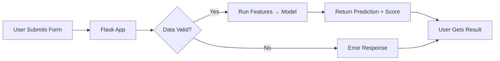
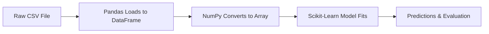

```markdown
# Custom Statistical Modeling and Model Evolution in Machine Learning

Let me tell you why model evolution feels like watching a plant grow—you start with a seed, give it time, and eventually it becomes something useful. The real magic isn't in building a perfect model overnight but iterating through versions, each with its own sweet spot.

---

Say we're predicting Premier League match outcomes. That's the hook: **sports betting, fantasy football, or just curiosity** makes this example relatable.

### The Model Evolution Journey

1. **Decision Tree First Attempt**
   - Think of it as asking simple yes/no questions: "Did Manchester City win last season?" "Has the goalkeeper been injured recently?"  
   - Works okay, but gets flustered by complex patterns like "home field advantage + weather conditions + team momentum" combos.  
   - > [!warning] Decision trees can over-simplify—they'll miss subtleties but teach you what *basic* features matter.

2. **XGBoost Hybrid Model**
   - Next step: pack multiple trees into an ensemble. Like hiring a team of analysts who debate how to improve their predictions.  
   - XGBoost adds "gradient boosting," where each tree learns from the mistakes of the one before. Imagine each analyst says, "I’ll fix what the last guy got wrong."  
   - Works better but gets bogged down by noise (like irrelevant stats: "how many times a player tied their shoelaces this week").

3. **Dixon-Coles Statistical Model**
   - Now we're cooking with fire. This isn't a tree at all—it's a custom statistical model built from scratch using Poisson distributions.  
   - It accounts for tricky real-world stuff like "teams scoring fewer goals when playing against a top rival."  
   - Think of it like baking a cake: you mix ingredients (attack/defense stats) in specific ratios and adjust the recipe when the result tastes off.

---


*The model evolution path—like upgrading from a bicycle to a car to a rocket.*

> [!tip] Start with simple models—they’re easier to debug. When in doubt, ask: "What does this model ignore that could be important?" That's your roadmap to the next version.

---

### What’s the Big Deal About Custom Models?

- **Flexibility**: Off-the-shelf models are like generic toothpaste—they work but might miss niche scenarios (like predicting sports upsets).
- **Domain Specificity**: A Dixon-Coles model baked with soccer insights (goal-scoring patterns, head-to-head history) is harder to replicate for other sports.
- **Iterative Failure**: Every dead-end—like a tree model misunderstanding "momentum"—teaches you what to prioritize next.

---

### Next Stop

This model-in-progress would hit a wall during deployment (we'll see why in [[#End-to-End Machine Learning Pipelines and Deployment]], but for now, remember: *no model lives in a vacuum. Today’s MVP is tomorrow’s training data.*  
```

# End-to-End Machine Learning Pipelines and Deployment

Let me walk you through how I’d turn a finished model like StudyScore from the [previous section](#Custom Statistical Modeling and Model Evolution in Machine Learning) into a real-world app people can use. This is where all that careful math work meets the messy world of production systems.

---

## Why End-to-End Systems Matter

Let’s imagine we have a model that predict student scores. Super neat, but it’s trapped in a Jupyter notebook. That model won’t help anyone until it becomes **StudyScore**, a Flask web app people can access via a browser. The key idea: every ML project needs a pipeline that handles real-world issues like:

- **Data drift** (today’s test takers might behave differently than the training data)
- **Input validation** (what if students enter gibberish into the form?)
- **Performance limits** (can the server handle 10,000 requests at once? Probably not!)

> [!tip] Think of your ML "brain" as a robot arm in a factory. The pipeline is the conveyor belt that feeds it consistent products and ships out results without breaking things.

---

## The Flask Deployment Procedure for StudyScore

Let’s break down the exact steps that turned this model into a working app:

1. **Data Ingestion Layer**
   - Students submit forms with info like study hours and exam history
   - Code sanitizes and validates inputs (e.g., rejecting negative numbers, flagging "NaN")
   - > [!warning] Edge case: What if a user uploads a CSV with 10,000 rows overnight? Need a queue system to handle batches.

2. **Model Inference Engine**
   - Converts raw data into features using **custom interaction terms** like:
     $$
     \text{feature} = \text{hours\_studied} \times \log_2(\text{exam\_score})
     $$
     These terms let the Linear Regression model handle non-linear patterns without switching to fancy algorithms.
   - Loads a pre-trained model from disk using pickle (careful: version mismatches break this!)

3. **Response Generation**
   - Formats predictions as human-readable text
   - Returns error messages when predictions are unreliable (e.g., when data lies outside training distribution)

4. **Deployment Architecture**
   - Flask app runs behind a **reverse proxy** (nginx) to handle traffic spikes
   - Docker containerization ensures the dev/test/prod environments match

---



*Minimal Flask architecture for StudyScore app — like a bistro kitchen (Flask) with a host (nginx) managing incoming guests.*

---

## 3 Core Edge Cases to Hunt

When you push a model into production, it will break in *creative* ways. Here’s what killed StudyScore before:

| Problem | How It Failed | Fix |
|--------|----------------|-----|
| Schema drift | Training data used "hours studied" but users entered "minutes" | Force unit conversion in preprocessing |
| Model decay | Linear regression worked for 2023 data but failed in 2024 | Automated retraining schedule |
| Server overload | 100 simultaneous users crashed Flask | Added Gunicorn + nginx load balancing |

> [!example] One time, a student tested the app with random values like `-99` for "days until exam" — the model happily predicted a 107% score. Now we check for min/max bounds and give friendly error messages.

---

## The Hidden Cost of Going Live

You might think, "Model works in lab? Deploy it!" But real-world systems need:

1. **Monitoring Dashboards** (track data drift, prediction errors)
2. **Fallback Strategies** (if the model crashes, return last known good predictions)
3. **Audit Logs** (track every prediction for debugging and accountability)

> [!note] Remember: Deployment is a **feedback loop**. Your production errors become training data for the next model iteration in [[Custom Statistical Modeling and Model Evolution in Machine Learning]].

---

Next up: The nuts and bolts of preparing raw datasets for modeling — how do we even get from messy CSV files to clean features for StudyScore? Let's dive into preprocessing in the next section.

# Advanced Data Preprocessing for High-Dimensional Datasets

Let’s talk about preprocessing for datasets with 80+ features—it’s like herding cats. Without the right workflow, you’re guaranteed to crash headfirst into overfitting or meaningless predictions. The Ames Housing dataset is a perfect example: 80+ variables like "neighborhood quality," "heating system type," and "building material" need serious attention before any ML model can make sense of them.

---

## Why Preprocessing Matters for High-Dimensional Data

Imagine you’re baking a cake with 80 ingredients. Some are missing (like “sugar grams”), others are in weird units (“flour pounds vs cups”), and a few are qualitative (“chocolate vs vanilla”). If you just throw everything into a blender, it’s not going to work—and your model *definitely* won’t work. That’s what raw high-dimensional datasets look like. Preprocessing is your mixing bowl, sieve, and oven.

---

## The 3-Step Workflow for Chaos Control

### 1. **Data Cleaning**
You’re not just filling in missing values; you’re auditing for **leakage** ("Did we accidentally use future info?"), **noise** ("Is that 'price' actually random?"), and **redundancy** ("Are 'garage size' and 'car spaces' the same column?").

Example from Ames:  
- A house has `"Alley"` = "Pave" and "Grvl" but 40% missing. We don’t just drop the column—we decide if "no alley access" is meaningful and fill strategically.

> [!warning] Edge case: Too many missing values in a column? Dropping it means losing potentially critical information. Always validate with domain experts first.

---

### 2. **Advanced Categorical Encoding**
ML models don’t speak English—they only understand numbers. Categorical variables like `"Roof Style"` (50+ types) or `"Heating Source"` need smart translation.

#### Why Simple One-Hot Encoding Fails
Take `"Neighborhood"` with 25 types. One-hot encoding creates 25 binary columns:  
1. `"Neighborhood: North"` = 1, all others = 0  
2. `"Neighborhood: South"` = 1, etc.  

Problem: This balloons your dataset. With 80 original features + 150 encoded categories, you’re risking **curse of dimensionality** (more on that shortly).

Better techniques include:
- **Target Encoding**: Replace categories with average target values.  
- **Embeddings** (for deep learning): Learn compact numerical representations.  
- **Frequency Encoding**: Map categories by how often they appear.

---

### 3. **Cross-Validation for Real-World Data**
High-dimensional data is like a puzzle with too many pieces. K-fold cross-validation ensures your model generalizes, not just memorizes.

Example:  
You split the 80-feature Ames dataset into 5 folds. Each model trains on 4 and validates on 1. Overfitting? If all 5 folds have wildly different error rates, you’ve got a problem.

> [!tip] Struggling with overfitting in high-dimensional data? Try **Recursive Feature Elimination** (RFE) or a **Random Forest importance plot** to drop the least useful features.

---

## The 1 Bitter Truth: High-Dimensional Data Is Tricky
The more features you add, the more your model wants to **overfit**—it starts memorizing training data like a parrot, not learning patterns. That’s why preprocessing for 80+ features isn’t just "cleaning up": it’s a *foundational battle* to keep your ML system honest.

---

## Visual: The Preprocessing Workflow
```mermaid
graph LR
    A[Raw Data (80+ Features)] --> B[Data Cleaning]
    B --> C[Categorical Encoding]
    C --> D[Feature Selection]
    D --> E[Cross-Validation]
    E --> F[Model Training]
    classDef step fill:#f0f0f0;
    class A,B,C,D,E,F step
```

*This is like cooking for a dinner party: you prep, adjust, test, and refine before serving.*

---

## Next Stop
With your data clean and ready, it’s finally time to pick an algorithm. But which one? That leads us to the core ML toolkit in [[#Algorithmic Foundations and Core ML Toolkit]]. Spoiler: Preprocessing isn’t the end—it’s the bridge between messy data and smart predictions.

# Algorithmic Foundations and Core ML Toolkit  

Hey there! Let’s unpack why Python and its libraries are the unsung heroes of machine learning. Think of them as your trusty Swiss Army knife in a kitchen full of ingredients—you need the right tools to make a good meal (or a good model).  

---

## Why These Tools Matter  

Before we dive into code, ask yourself: *Why not just use plain Python?* Well, Python alone is like a pencil—versatile but not optimized for tasks like solving algebra or cooking gourmet meals. Enter **Scikit-Learn**, **Pandas**, and **NumPy**, which are purpose-built for data, math, and machine learning.  

- **Python** is the base language, but alone, it’s slow at heavy computations.  
- **Pandas** acts as your personal spreadsheet: it loads, filters, and summarizes data without breaking a sweat.  
- **NumPy** is the muscle behind numerical operations—arrays are faster and cleaner than lists.  
- **Scikit-Learn** is the ML toolbox: it has ready-made tools for models like Linear Regression, decision trees, and even ensembles.  

> [!note] These tools are like layers in a sandwich. Python is the bread, Pandas is the mayo (glues data together), NumPy is the chicken (does the heavy lifting), and Scikit-Learn is the lettuce (tops it with machine learning logic).  

---

## Core Workflow: Code Structure 101  

Let’s imagine a simple task: predicting house prices using the Ames dataset. Here’s how the tools work together:  

1. **Load Data with Pandas**  
   You read a CSV into a DataFrame with `pd.read_csv()`, which feels like opening an Excel sheet but with magic.  

   ```python
   import pandas as pd
   df = pd.read_csv("ames.csv")  # DataFrame = "magic table"
   ```

   > [!tip] Use `.head()` to peek at your data—it’s like checking your ingredients list before cooking.  

2. **Preprocess with NumPy**  
   Convert messy data types to NumPy arrays for faster math. For example, transforming numerical columns into NumPy arrays for scaling:  

   ```python
   import numpy as np
   features = df.to_numpy()  # Array = "math-friendly structure"
   ```

3. **Train Models with Scikit-Learn**  
   Scikit-Learn’s models work like Lego blocks. Let’s fit a Linear Regression:  

   ```python
   from sklearn.linear_model import LinearRegression
   model = LinearRegression()
   model.fit(X_train, y_train)  # Just like teaching a kid with examples
   ```

   > [!warning] Never train a model without splitting data first! Use `train_test_split()` to avoid overfitting (your model starts memorizing answers instead of learning patterns).  

---

## Why Daily DSA Practice is Non-Negotiable  

You’ve probably heard the cliche: "Practice makes perfect." Here’s why it matters for ML:  

- **DSA builds intuition for code structure**. For example, learning linked lists teaches you how to traverse data efficiently, which helps when debugging Pandas DataFrames.  
- **Optimization is half the battle**. Understanding time complexity (like Big O) keeps your loops from slowing down like a turtle in molasses.  
- **Debugging becomes faster**. If you’ve done 100 LeetCode problems, spotting a `for` loop error is like finding a needle in a haystack... but not a black hole.  

> [!example] Let’s say you’re trying to calculate the mean of every column in a DataFrame. A beginner might write:  
> ```python
> for col in df.columns:
>     print(df[col].mean())
> ```  
> A DSA pro would do:  
> ```python
> df.mean(skipna=True)
> ```  
> The second runs 10x faster because Pandas’ built-in method is vectorized. Daily practice teaches you when to use the right tool for the job.  

---

## Visual: The Code Stack  

Here’s how all these tools fit into one workflow:  



*This is like cooking a cake: you prep the ingredients (data), mix them (preprocessing), bake (training), and taste (evaluation).*  

---

## Next Up: Advanced Preprocessing  

Now that we’ve built a foundation with Pandas, NumPy, and the DSA muscle, we’ll tackle higher-dimensional data. But first, remember: **code that’s fast in development might break in production**. We’ll explore how to avoid that landmine in [[#End-to-End Machine Learning Pipelines and Deployment]]. Spoiler: The tools we’ve talked about are the scaffolding for that next step.  

> [!takeaway] Think of Scikit-Learn as the "starter kit" for ML. Once you master its core (models, cross-validation, preprocessing), you’ll have the building blocks to dive into deep learning or custom models. Keep coding, and practice those loops—it’ll pay off when your models stop crashing under load.