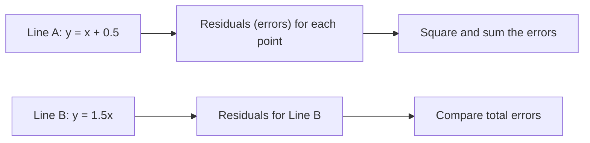

# Study Guide: Least Squares Regression & Derivatives  

> [!note] Think of this like finding the best line to predict house prices based on size. Instead of guessing, we use math to *prove* we found the right one.  

---

## What's Least Squares?  

Let’s say you have data points like (1,2), (2,3), and (3,5). You want a line that fits these points. But how do you choose between **Line A** (y = x + 0.5) and **Line B** (y = 1.5x)?  



**Answer**: We minimize the *sum of squared residuals*. Squaring ensures:  
- Bigger errors hurt more (2× the error = 4× the penalty)  
- Positive/negative errors don’t cancel out  
- Math becomes easier (no weird kinks from absolute values)  

---

## The Derivative Approach: Calculus to the Rescue  

Instead of trying random lines, we use calculus to find the **best A (slope) and B (intercept)** that minimize:  
$$
\text{Total Error} = \sum (Ax_i + B - y_i)^2
$$

### Step-by-Step Process  

1. **Define residuals**: $ R_i = Ax_i + B - y_i $  
2. **Write error function**: $ E(A,B) = \sum R_i^2 = \sum (Ax_i + B - y_i)^2 $  
3. **Fix A and find best B**: Take partial derivative of $ E $ with respect to B and set to 0.  
4. **Fix B and find best A**: Take partial derivative of $ E $ with respect to A and solve.  

```mermaid
graph TD
    A["Start with E["E (A,B)"]"] --> B["Compute ∂E/∂B = 0"]
    B --> C["Solve for B (intercept)"]
    A --> D["Compute ∂E/∂A = 0"]
    D --> E["Solve for A (slope)"]
```

This is like walking down a hill while blindfolded. When your steps stop moving sideways (slope = 0), you’re at the bottom—the optimal A and B.  

---

## Example Calculation  

Using data: (1,2), (2,3), (3,5)  
- $ \bar{x} = 2 $, $ \bar{y} = 3.\overline{3} $  

1. **Slope A**:  
$$
A = \frac{\sum (x_i - \bar{x})(y_i - \bar{y})}{\sum (x_i - \bar{x})^2} = \frac{3}{2} = 1.5
$$

2. **Intercept B**:  
$$
B = \bar{y} - A\bar{x} = 3.\overline{3} - 1.5 \times 2 = 0.\overline{3}
$$

**Final line**: $ y = 1.5x + 0.333\ldots $  

> [!example]  
For (1,2): Prediction = $ 1.5(1) + 0.333 = 1.833 $, Residual = $ 0.167 $  
For (3,5): Prediction = $ 1.5(3) + 0.333 = 4.833 $, Residual = $ 0.167 $  
Total error squared: $ 0.167^2 + 0 + 0.167^2 \approx 0.056 $  

---

## Why This Works  

- **Squaring residuals**: Makes optimization mathematically elegant and avoids cancellation  
- **Derivatives**: Locate the minimum error point efficiently  
- **Result**: Best-fit line that minimizes the vertical gaps between actual and predicted values  

---

## Common Pitfalls  

> [!warning]  
- Avoid squaring the original y-values! That changes the meaning of the problem.  
- Don