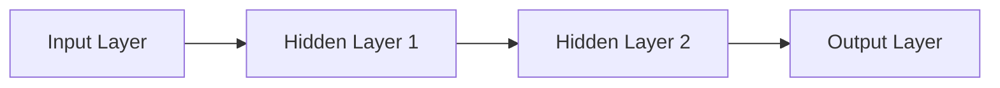
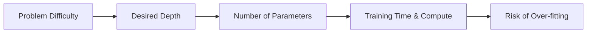

# Introduction to Machine Learning and Neural Networks  

Machine learning (ML) is the engine that lets computers turn raw data into useful behavior without a programmer spelling out every rule. When your phone suggests the next word you’ll type or a self‑driving car decides to brake, an ML model is doing the heavy lifting behind the scenes.  

Understanding the high‑level ideas now makes the later math feel much less mysterious, and it gives you a solid foundation for building your own models.

---

## Why Machine Learning Matters  

ML lets computers **learn from experience**.  That opens doors to applications like image recognition, language translation, personalized recommendations, and autonomous control.  If you can picture how a neural network is wired together, the rest of the math stops feeling like magic—debugging, architecture choices, and explanations become far easier.

---

## What Machine Learning Is  

Think of ML as a recipe that lets a computer **learn from examples** instead of following a fixed set of instructions.  You feed it data, it finds patterns, and then it can make predictions or decisions on new, unseen data.

### The Three Broad Families  

| Family | How It Learns | Typical Use Cases |
|--------|--------------|-------------------|
| **Supervised learning** | Learns from **labeled** examples (input ↔ output pairs) | Image classification, spam detection, house‑price prediction |
| **Unsupervised learning** | Discovers hidden structure **without labels** | Customer segmentation, dimensionality reduction (PCA), topic modeling |
| **Reinforcement learning** | An agent interacts with an environment, receives **rewards**, and improves a policy | Game playing (AlphaGo), robotic manipulation, adaptive recommendation systems |

> [!info] These three categories are the standard way textbooks slice the ML landscape. They provide a useful backdrop for everything that follows.

---

## Neural Networks Overview  

A **neural network (NN)** is a mathematical model that loosely mimics how biological neurons fire and connect.  Each artificial neuron (or **node**) receives a few numbers, does a quick arithmetic operation, pushes the result through a non‑linear **activation function**, and passes the outcome to the next layer.  By stacking many such layers, the network can capture very intricate patterns—just as a brain can recognize faces, voices, and ideas.

```mermaid
flowchart LR
    D[Raw Data] --> L[Learning Algorithm (training loop)]
    L --> N[Neural Network Model (weights & biases)]
    N --> P[Predictions / Decisions]
```
*From raw inputs, through a learning process, to a trained model that can make useful predictions.*

---

## Neural Network Structure and Components  

Think of a neural network as a factory assembly line:

1. **Nodes (neurons)** – tiny workers that receive numbers, multiply each by a **weight** $w_i$, add a **bias** $b$, then apply an activation $\phi(\cdot)$.  
2. **Layers** – groups of nodes arranged side‑by‑side.  
   * **Input layer** – hands the raw data to the next layer.  
   * **Hidden layers** – where the real transformation happens.  
   * **Output layer** – produces the network’s final prediction.  
3. **Connections** – conveyor belts that carry the output of one node to the input of another; each belt carries a weight $w_i$ that controls how strongly the upstream result influences the downstream node.


*Data flow through a simple feed‑forward network: input → hidden → hidden → output.*

> [!tip] If training feels “slow,” check the number and size of hidden layers. Too many workers or too many conveyor belts can make optimization harder than necessary.

> [!warning] More layers **do not** automatically mean a better model. Adding depth without enough data or proper regularization often leads to over‑fitting.

---

## Forward Pass Computation  

At each node the calculation is  

\[
a = \phi\!\left(\sum_{i} w_i x_i + b\right)
\]

* $x_i$ – inputs from the previous layer  
* $w_i$ – weight on each incoming connection  
* $b$ – bias term (a constant shift)  
* $\phi$ – activation function (e.g., ReLU, sigmoid, tanh)  

The activation function is what gives the network its **non‑linear power**, letting it model complex patterns rather than just straight lines.

> [!note] The next section dives deeper into the math behind $\phi$ and why the choice of activation matters. See [[#Activation Functions]].

---

## Activation Functions  

Without an activation function, stacking many linear layers would still be just a linear map.  Activation functions inject the necessary bend.

\[
\begin{array}{lccc}
\text{Function} & \text{Formula} & \text{Range} & \text{Derivative} \\ \hline
\text{ReLU} & \phi(x)=\max(0,x) & [0,\infty) & \phi'(x)=\begin{cases}1 & x>0 \\ 0 & x\le 0\end{cases} \\
\text{Sigmoid} & \phi(x)=\frac{1}{1+e^{-x}} & (0,1) & \phi'(x)=\phi(x)\bigl(1-\phi(x)\bigr) \\
\text{Tanh} & \phi(x)=\tanh(x)=\frac{e^{x}-e^{-x}}{e^{x}+e^{-x}} & (-1,1) & \phi'(x)=1-\tanh^{2}(x)
\end{array}
\]

```mermaid
xychart-beta
    title "Activation Functions"
    x-axis "x" [-5, 5]
    y-axis "y" [-1.5, 1.5]
    line "ReLU" [0,0,0,0,0,0,1,2,3,4,5]
    line "Sigmoid" [0.01,0.02,0.05,0.12,0.27,0.5,0.73,0.88,0.95,0.99,0.999]
    line "Tanh" [-0.99,-0.96,-0.91,-0.76,-0.46,0,0.46,0.76,0.91,0.96,0.99]
```
*Caption: Curves of three common activation functions.*

> [!tip] If a network isn’t learning, check the activation choices. Using sigmoid on every hidden layer can cause *vanishing gradients*, making learning painfully slow. The default “salt” (ReLU) works for most situations.

---

## Training Neural Networks  

Training is an iterative **feedback loop**:

1. **Forward pass** – compute activations layer by layer to obtain a prediction.  
2. **Loss computation** – compare the prediction to the true label with a loss function $\mathcal{L}$.  
3. **Backward pass (gradient descent)** – compute gradients of $\mathcal{L}$ w.r.t. each weight and bias, then update them:  

\[
\theta \leftarrow \theta - \eta \,\nabla_{\theta}\mathcal{L}
\]

where $\theta$ denotes any weight or bias and $\eta$ is the **learning rate**.

```mermaid
flowchart LR
    I[Input Features] --> W[Weighted Sum (z = Σ w·x + b)]
    W --> A[Activation (a = φ(φ (z)))]
    A --> O[Output / Next Layer]
    O --> L[Loss Computation]
    L --> G[Gradient Descent Update]
    G --> W
```
*Caption: The training loop that drives weight updates.*

> [!info] The details of specific optimizers (Adam, RMSprop, etc.) belong to a later topic, but the core idea is always “measure error → adjust weights in the direction that reduces error.”

---

## Model Complexity and Depth  

Think of a neural network as a stack of LEGO plates. Each plate (layer) adds height, letting the model capture finer details. However, **more isn’t always better**.


*Caption: How problem difficulty drives depth, which influences resources and over‑fitting risk.*

**Practical rules**

- **Start simple.** Build the shallowest model that attains acceptable performance, then add layers only if you hit a performance ceiling.  
- **Watch the signs.** If training loss keeps dropping while validation loss rises, you’ve probably added too much depth.  
- **Domain clues.** Image‑rich tasks (e.g., object detection) usually need deeper convolutional stacks; tabular data often works with just a few fully‑connected layers.

> [!tip] Log the number of layers and total parameters alongside accuracy. A quick spreadsheet can reveal diminishing returns early, saving you hours of wasted training.

> [!warning] The “deeper is always better” myth leads to slower training, higher memory use, and over‑fitting. Extra layers act like extra noise once the model’s capacity exceeds what the data can support.

---

## Putting It All Together  

1. **Choose the right ML family** (supervised, unsupervised, reinforcement) based on whether you have labels, need to explore structure, or can define a reward signal.  
2. **Design the network architecture** (layers, nodes, connections) that matches the problem’s complexity.  
3. **Select appropriate activation functions**—ReLU by default, sigmoid or tanh for output layers that need bounded ranges.  
4. **Train with gradient descent**, monitoring loss curves to detect under‑ or over‑fitting.  
5. **Iterate**: adjust depth, width, learning rate, or regularization until performance stabilizes.

> [!example] Suppose you want to classify handwritten digits (MNIST). You’d typically use a supervised approach, start with a shallow fully‑connected network (input → hidden → output), choose ReLU for hidden layers and softmax for the output, and train with cross‑entropy loss and a modest learning rate (e.g., $\eta=0.01$). If accuracy stalls, add another hidden layer or try a convolutional architecture.

---

## Final Takeaways  

- **ML provides the learning capability**; neural networks give a flexible way to model non‑linear relationships.  
- **Understanding structure (nodes, layers, weights) demystifies the math** and empowers you to debug and improve models.  
- **Activation functions are the “seasoning”** that lets the network capture twists and turns in data.  
- **Depth and size should be matched to problem difficulty**, not maximized for their own sake.  

Armed with these fundamentals, you’re ready to dive deeper into specific architectures, optimization tricks, and real‑world applications. Happy modeling!