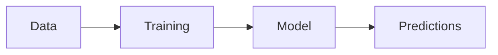
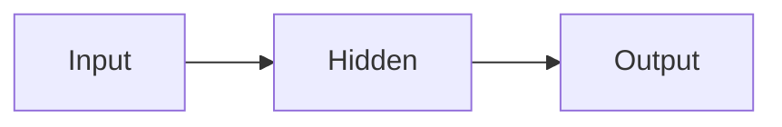
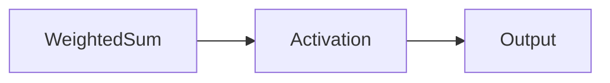
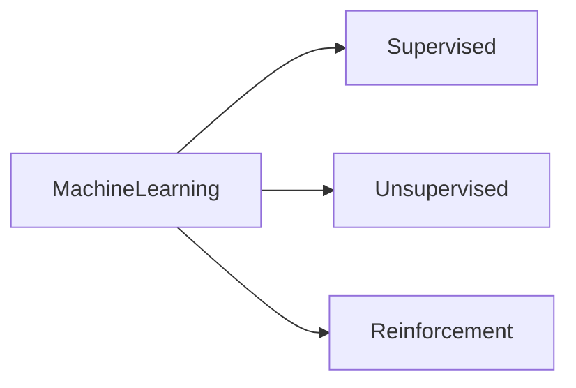
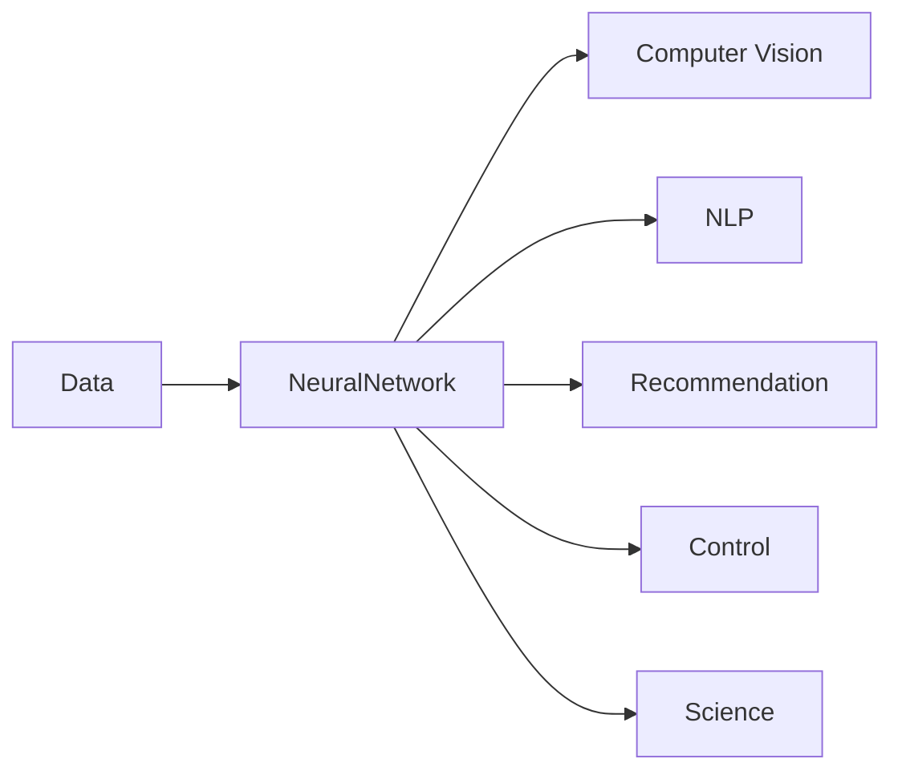

# Machine Learning & Neural Networks: A Friendly Overview

## Why Machine Learning Matters
Think of a computer as a super‑fast but literal chef. In traditional programming you write every rule yourself—perfect for well‑defined problems, but cumbersome when the task involves fuzzy, noisy data like recognizing cats in photos or translating sentences. **Machine learning (ML)** flips the script: instead of hand‑crafting every rule, we give the computer lots of examples and let it discover the patterns automatically. This shift from fixed recipes to data‑driven learning opens the door to everything from spam filters to self‑driving cars.

> [!tip] Imagine you’re teaching a kid to identify animals by showing many pictures rather than listing every possible feature. That’s the essence of ML.

## From Hand‑Crafted Rules to Data‑Driven Learning
In the classic “program‑first” approach you spend hours (or months) writing conditionals, loops, and edge‑case handling. With ML you supply **data** and a **training process** that produces a **model** capable of making predictions.


*Data feeds the training process, which yields a model that can make predictions.*

> [!warning] A common misconception is that ML magically knows the answer. The model is simply a collection of adjustable knobs (the parameters) tuned by repeatedly feeding data through it.

## Neural Network Fundamentals

### Network Structure and Components
A neural network is a stack of **layers**:

1. **Input layer** – receives raw data (pixels, sensor readings, text vectors, …).  
2. **Hidden layers** – each node computes a weighted sum of its inputs, adds a bias, and applies a non‑linear activation function.  
3. **Output layer** – produces the final answer (class label, numeric value, probability distribution, …).

You can picture this as a series of photo‑editing filters: the first filter tweaks raw pixels, the next adds contrast, another sharpens edges, and finally you get the edited picture. In the network, the filters are the hidden layers, and the **weights** on the connections are the settings that training learns.

> [!note] Each neuron acts like a tiny decision‑maker that says “yes” or “no” based on a weighted vote of its inputs. Stacking many of these votes lets the network capture very complex patterns.

### Forward Pass: How Data Moves Through the Network
During inference (or the “forward” part of training) data travels straight through the layers:


*Data moves from the input layer, through hidden layers, to the output layer.*

At each node:
- Multiply incoming values by the connection **weight**.  
- Add a **bias** term.  
- Pass the result through an **activation function** (see next section).  

> [!tip] When debugging, print the shapes of tensors flowing between layers. Mismatched dimensions usually mean a wiring error in the “conveyor belts.”

### Activation Functions
If we only used linear steps (weights × inputs + bias), no matter how many layers we stacked the whole model would behave like a single linear equation—boring and limited. **Activation functions** inject the needed non‑linearity, letting the network learn curves, thresholds, and all the funky patterns in real data.

#### Common Activation Functions
Below are the two workhorses you’ll see in everyday networks.

```latex
$$
\begin{array}{lccc}
\text{Function} & \text{Formula} & \text{Range} & \text{Derivative} \\ \hline
\text{Sigmoid} & \sigma(x)=\frac{1}{1+e^{-x}} & (0,1) &
\sigma'(x)=\sigma(x)\bigl(1-\sigma(x)\bigr) \\[4pt]
\text{ReLU} & \text{ReLU}(x)=\max(0,x) & [0,\infty) &
\text{ReLU}'(x)=\begin{cases}1 & x>0 \\ 0 & x\le 0\end{cases}
\end{array}
$$
```


*The weighted sum is transformed by an activation function before passing on.*

> [!tip] Most hidden layers use **ReLU** because it’s cheap to compute and keeps gradients healthy. Use **Sigmoid** in the final layer when you need a probability (e.g., binary classification).

The placement of activation functions is described in [[#Network Structure and Components]], where they sit right after each weighted sum.

## Types of Machine Learning

### Supervised Learning
Think of a teacher grading homework. You give the model **input‑output pairs** (e.g., images + labels). It learns a mapping from inputs to the desired outputs and can later predict labels for new data. Classic algorithms include linear regression, decision trees, and deep nets for image classification.

> [!tip] Ask yourself: *Do I have labeled data?* If yes, start with supervised learning.

### Unsupervised Learning
Here the model receives **only raw inputs**, no labels. Its job is to **discover structure**: clustering similar items, reducing dimensionality, or uncovering latent factors. Imagine dumping a mixed bag of beads on a table and letting the model sort them by color without ever being told what “red” or “blue” means. Typical methods are K‑means clustering and principal component analysis (PCA).

> [!warning] Don’t confuse clustering (unsupervised) with classification (supervised). Clustering never sees the “right answer” labels.

### Reinforcement Learning
Picture a puppy learning tricks: it gets a treat (reward) when it does something right and nothing (or a gentle scold) when it messes up. An **agent** interacts with an **environment**, receives rewards, and updates its policy to maximize cumulative reward. Applications include game‑playing bots, autonomous drones, and the famous AlphaGo.


*Three branches of machine learning and the kind of feedback they receive.*

> [!tip] When you’re stuck choosing a method, ask: **Do I have labels?** → Supervised. **Do I want to explore patterns?** → Unsupervised. **Do I need an agent that learns by interacting?** → Reinforcement.

## Real‑World Applications of Neural Networks
Neural networks act like a Swiss‑army knife for pattern‑finding. Feed them data, and they learn to extract hidden regularities, then apply those lessons to new situations. Some high‑impact domains:

- **Computer Vision** – object detection, handwriting recognition, autonomous driving perception.  
- **Natural Language Processing** – translation, summarization, chatbots.  
- **Recommendation Engines** – suggesting movies, music, or products.  
- **Control Systems** – balancing robots, optimizing smart‑grid energy use, guiding drones.  
- **Scientific Modeling** – accelerating drug discovery, climate forecasting, high‑energy physics analysis.


*Data is transformed by a neural network into domain‑specific results.*

Understanding the building blocks from [[#Network Structure and Components]] and the role of activation functions from [[#Activation Functions]] helps you see why these applications work so well.

## Emerging Trends and Future Directions
Research is pushing neural networks in several exciting directions:

- **Specialized Architectures** – convolutional nets for images, recurrent/transformer models for sequences, graph networks for relational data.  
- **Multimodal Models** – systems that understand and generate both text *and* images.  
- **Efficient and Tiny Models** – pruning, quantization, and knowledge distillation make models run on phones and IoT devices.  
- **Continual Learning** – models that keep learning from new data on the fly, much like humans picking up new skills.  
- **Explainable AI** – techniques that reveal *why* a network made a particular decision, crucial for high‑stakes fields like healthcare.

> [!tip] When starting a new project, first match your problem to an appropriate architecture (e.g., CNN for images, transformer for text). A good fit often saves weeks of hyper‑parameter tweaking.

---

By now you should see how **machine learning replaces hand‑crafted rules with data‑driven learning**, how **neural networks turn raw inputs into powerful predictions**, and why **different types of learning** and **modern architectures** matter for real‑world problems. The next step is to pick a domain that excites you, choose a suitable network style, and start experimenting. Who knows? Your prototype might become the seed of the next breakthrough.