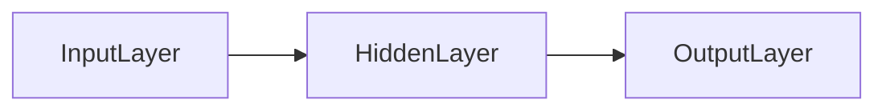
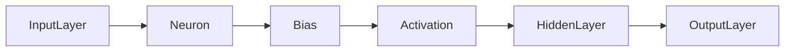
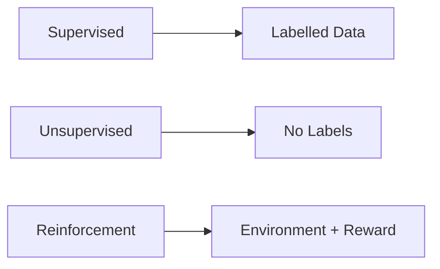
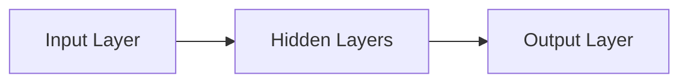

# Neural Networks: Fundamentals and Context  

## Why Neural Networks Matter  
A neural network is the workhorse behind voice assistants, image‑recognition apps, and many other AI systems you interact with daily. Understanding what a network actually *is*—its basic parts and how they work together—gives you a solid foothold before you dive into the math or the more exotic architectures later on.

> [!note] Think of a neural network as a tiny factory line for information. Raw data enters at one end, gets transformed stage by stage, and the final product (the network’s guess) comes out the other side.

## Core Concepts  

### Nodes, Layers, and Connections  
- **Neuron (node)** – the basic computing unit. It takes a set of numbers, mixes them with *weights*, adds a *bias*, runs the result through an *activation function*, and passes the output onward.  
- **Layer** – a row of neurons. The first row is the **input layer**, the middle rows are **hidden layers**, and the last row is the **output layer**.  
- **Connection** – the “conveyor belt” linking one neuron to the next. Each connection carries a weight that tells the network how important that particular signal is.


*Simple three‑stage network: input → hidden → output.*

### Forward Pass: From Input to Output  
1. **Input layer** receives raw numbers (pixel values, sensor readings, …).  
2. **Hidden layer(s)**: each neuron computes a weighted sum of its inputs, adds a bias, applies an activation, and forwards the result.  
3. **Output layer** aggregates the final hidden signals into a prediction (e.g., class probabilities or a regression value).

Mathematically, a single neuron produces  

$$
a = f\!\left(\sum_{i} w_i x_i + b\right)
$$  

where $x_i$ are the inputs, $w_i$ the corresponding weights, $b$ the bias, and $f$ the activation function.


*Flow highlighting the internal steps of a neuron during the forward pass.*

> [!tip] Start by sketching a network with **one hidden layer** and a handful of neurons. Visualizing the flow on paper helps the concepts stick.

> [!warning] **Skipping bias or activation** – Omitting a bias term or leaving out an activation function collapses the network into a plain linear model, no matter how many layers you stack.

### Activation Functions: The Non‑Linear Secret Sauce  
Without an activation function the whole network would be equivalent to a single linear regression—great for simple trends but hopeless for images, speech, or language. Activation functions inject the **non‑linearity** that lets a network carve out complex decision boundaries.

| Function | Formula | Range | Derivative |
|----------|---------|-------|------------|
| Sigmoid | $\displaystyle \sigma(x)=\frac{1}{1+e^{-x}}$ | $(0,1)$ | $\sigma'(x)=\sigma(x)\bigl(1-\sigma(x)\bigr)$ |
| ReLU | $\displaystyle \operatorname{ReLU}(x)=\max(0,x)$ | $[0,\infty)$ | $\operatorname{ReLU}'(x)=\begin{cases}1 & x>0\\0 & x\le 0\end{cases}$ |

```mermaid
xychart-beta
    title "Activation Functions"
    x-axis "x" [-5, 5]
    y-axis "y" [-1.5, 1.5]
    line "Sigmoid" [0.01, 0.03, 0.07, 0.12, 0.20, 0.27, 0.35, 0.43, 0.50, 0.57, 0.65, 0.73, 0.80, 0.86, 0.92, 0.97, 0.99, 0.999, 0.9999, 1]
    line "ReLU" [-5, -4, -3, -2, -1, 0, 1, 2, 3, 4, 5]
```
*Sigmoid (smooth S‑shape) vs. ReLU (zero‑for‑negatives, linear for positives).*

> [!tip] **Choosing an activation** – Use sigmoid (or softmax) in the output layer when you need probabilities. For hidden layers, ReLU is usually the fastest and most stable choice, but feel free to experiment with others for special cases.

## Machine Learning Families  

### Supervised, Unsupervised, and Reinforcement Learning  

| Family | What the algorithm **expects** | Typical goal |
|--------|------------------------------|--------------|
| **Supervised** | A dataset of input‑output pairs (you tell it the right answer). | Predict labels for new inputs (classification, regression). |
| **Unsupervised** | Only raw inputs, no labels. | Discover hidden structure (clustering, dimensionality reduction). |
| **Reinforcement** | An environment that returns a reward signal after each action. | Learn a policy that maximizes cumulative reward (games, robotics). |


*Three learning setups and the kind of information they need.*

> [!tip] When you first meet a new problem, ask yourself:#Future Exploration of Neural Networks (Takeaway) 
does not exist, removing link: Future Exploration of Neural Networks (Takeaway)methods. If not, see if the data has hidden patterns you can exploit (unsupervised). If the problem involves sequential decisions and feedback, reinforcement learning is the way to go.

### How Neural Networks Fit Into Each Family  
- **Supervised** – Train a network to map inputs to known targets (e.g., image classification).  
- **Unsupervised** – Use networks to discover structure, such as autoencoders that compress data or GANs that generate new samples.  
- **Reinforcement** – A network often serves as the policy or value function that guides actions (e.g., Deep Q‑Networks).

These connections are explored in more depth in [[#Future Exploration of Neural Networks (Takeaway)]].

## Recap and What’s Next  

A neuron takes a weighted sum of its inputs, adds a bias, then runs it through an activation function:

$$
\text{output} = f\!\left(\sum_i w_i x_i + b\right)
$$  

- **Weights** control how strongly each input influences the neuron.  
- **Bias** shifts the activation curve, allowing the neuron to fire even when inputs are small.  
- **Activation functions** (sigmoid, ReLU, …) provide the non‑linearity that lets the network model complex patterns.


*The classic three‑part structure we’ll start tweaking in the next lecture.*

> [!info] All the pieces we’ve covered—nodes, l[#Neural Network Components and Activation Functions (Mechanism)]locks that let a neural network learn anything beyond a straight‑line prediction.  

In the upcoming session we’ll move from this generic network to **different families of neural networks** (convolutional, recurrent, transformer‑style) and see concrete, real‑world examples. Think of it like learning the different genres of books after you’ve mastered reading: the letters are the same, but the structures change to suit the story.

> [!tip] When you encounter a new architecture, first map its components back to the basics we’ve covered—identify the input layer, hidden layers, output layer, and the activation functions that give it non‑linearity.

---

*Ready to dive deeper? Check out the next section [[#Neural Network Components and Activation Functions (Mechanism)]] for a more detailed look at each component, and then head over to [[#Neural Networks: Fundamentals and Context]] to see where neural nets sit in the broader ML landscape.*