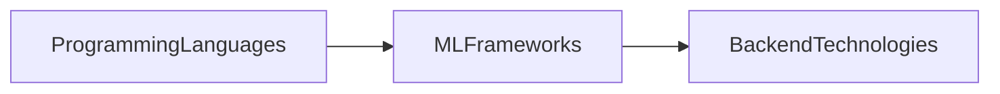
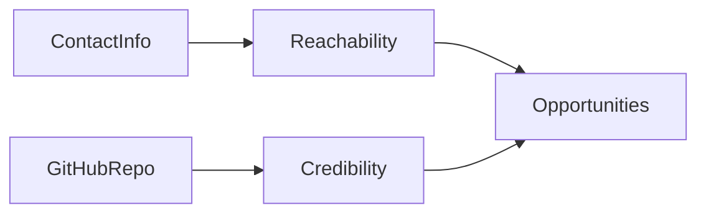
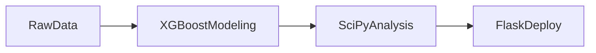

# Machine Learning Project Study Guide

## Why This Matters  
Thinking about a machine‑learning project is a lot like planning a road trip. You pick a destination (what you want to predict), map out the route (data and models), and then you actually drive (run the model). Seeing the whole journey laid out helps you decide if the trip is worth taking and keeps you motivated when the road gets bumpy.

Two concrete “destinations” that keep me excited are:

1. **Premier League match predictor** – guess who wins, draws, or loses before the final whistle.  
2. **Study‑score predictor** – estimate how well a student will do on an upcoming test from past performance and study habits.

These projects give a clear purpose, let me practice the full ML workflow, and produce something tangible to showcase.

> [!tip] Start with the simplest possible model (e.g., a baseline that always predicts the most frequent outcome). It gives you a reference point and keeps the project moving forward.

---

## Project Roadmap  
A high‑level view of the steps from idea to working predictor.

*From a high‑level idea to a usable predictor.*

1. **Goal** – Define what you want to predict (match outcome, study score).  
2. **DataCollection** – Gather past match results or historic study records.  
3. **DataPreparation** – Clean the data, handle missing values, and turn raw numbers into features the model can understand.  
4. **ModelBuilding** – Choose an algorithm (logistic regression for win/lose, linear regression for scores) and train it on the prepared data.  
5. **Evaluation** – Test the model on unseen data; tweak if needed.  
6. **Deployment** – Use the model to make real predictions or extract useful patterns.

---

## Motivation and Personal Drive  
- **Immediate feedback:** After each iteration I can see the model’s accuracy improve, which feels rewarding.  
- **Real‑world relevance:** Football scores and exam results are topics most people care about, keeping the work interesting even when the math gets heavy.  
- **Portfolio boost:** A working predictor is a tangible proof of skill that I can link to on my résumé or personal site.

These motivations turn a vague curiosity into a structured, doable project.

---

## Technical Skills and Expertise  
Think of your skill set as a three‑layer cake:

*The progression from code to model to deployment.*

1. **ProgrammingLanguages** – The base that lets you write anything (e.g., Python, R).  
2. **MLFrameworks** – The frosting that speeds up model building (e.g., scikit‑learn, TensorFlow, PyTorch).  
3. **BackendTechnologies** – The cherry that lets you serve models to users (e.g., Flask/FastAPI, Docker, cloud services).

> [!tip] When listing skills on a résumé, group them exactly like the diagram—first languages, then libraries, then infrastructure. This visual hierarchy instantly tells a reader how comfortable you are with the full ML pipeline.

See how these skills feed into the **[[#Machine Learning Applications and Tools]]** section.

---

## Education and Work Experience  
Treat your background like a **timeline movie trailer**: opening credits (degrees), action scenes (projects), and a climax (professional impact).

*From formal studies to real‑world impact—each step builds on the previous one.*

- **Education** – Highlight degrees in computer science, statistics, data science, or related fields. Emphasize courses such as linear algebra, probability, optimization, and deep‑learning fundamentals.  
- **Extracurricular Projects** – Hackathons, open‑source contributions, data‑science club leadership, or research assistantships demonstrate passion beyond the classroom.  
- **Work Experience** – For each role, note the company, title, dates, and ML‑related responsibilities (building models, deploying pipelines, feature engineering). Quantify impact where possible (e.g., “improved churn prediction accuracy by 12%”).  

> [!warning] Avoid the “resume dump.” Listing every class or job overwhelms the reader. Stick to the most relevant experiences that showcase your ML expertise.

Your education and work history set the stage for the tools you’ll use in **[[#Machine Learning Applications and Tools]]**.

---

## Contact Information and Online Presence  
Hiring managers need three doors to walk straight into your work: phone, email, and a tidy GitHub profile.

*Phone/email open the door; GitHub shows what’s inside.*

- **Phone & Email** – Use a professional email (e.g., `firstname.lastname@gmail.com`) and a work‑only phone number or Google Voice line.  
- **GitHub Repository** – Keep it organized: concise README, relevant topic tags (`machine-learning`, `pytorch`), and pin the repos that best showcase your ML skills.

> [!tip] A clean GitHub profile is a digital résumé for developers. It lets anyone see the projects you’ve built, your coding style, and how you document work.

> [!warning] **Privacy pitfall:** Don’t publish personal phone numbers or private email addresses publicly. Use a dedicated professional contact method instead.

---

## Machine Learning Applications and Tools  
Think of a machine‑learning project as a small factory line: raw data → model → analysis → deployment.

*From raw data to a live API endpoint.*

1. **XGBoostModeling** – Gradient‑boosted decision trees that excel with tabular data, offering built‑in regularization and fast CPU/GPU performance.  
2. **SciPyAnalysis** – Compute confidence intervals, run hypothesis tests, or fine‑tune hyperparameters with `stats`, `optimize`, and `sparse`.  
3. **FlaskDeploy** – Wrap the trained model in a lightweight web service (`POST /predict`) that front‑end apps, mobile devices, or other services can call.

> [!tip] Keep the interface between steps thin. For example, export the XGBoost model as JSON, let SciPy read the same file, and have Flask load that JSON at startup. This lets you swap out one component without breaking the whole pipeline.

> [!warning] A common pitfall is over‑engineering the deployment layer early on. Resist adding a full orchestration stack until the model’s performance and business value are proven.

### Example: Churn‑Prediction Pipeline  
- **Data**: CSV logs of user activity.  
- **Model**: XGBoost learns which usage patterns lead to cancellations.  
- **Analysis**: SciPy calculates ROC‑AUC and bootstrapped confidence intervals to show stakeholders reliability.  
- **Deployment**: Flask hosts an endpoint that the company’s dashboard calls to flag at‑risk users in real time.

This pattern generalizes to fraud detection, recommendation engines, demand forecasting, and more.

---

## Personal Interests and Soft Skills  
Your extracurriculars act as the “soft‑skill seasoning” that makes a solid ML project unforgettable.

- **Literary events** – Sharpen narrative building, helping you craft clear data stories.  
- **Debating** – Train you to defend model choices with evidence, a daily need in team meetings.  
- **Anchoring** – Teach you to keep an audience engaged, useful when presenting technical results to non‑technical stakeholders.

> [!tip] In a CV or LinkedIn “Personal Background” section, pick one concrete example from each activity (e.g., “won inter‑college literary quiz”) and tie it to a relevant ML skill (“enhanced analytical writing”).

These interests connect back to the **[[#Education and Work Experience]]** section, rounding out the picture of a well‑balanced candidate who brings more than just code to the table.