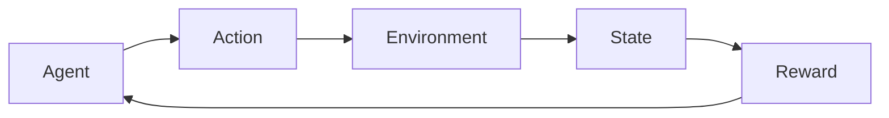
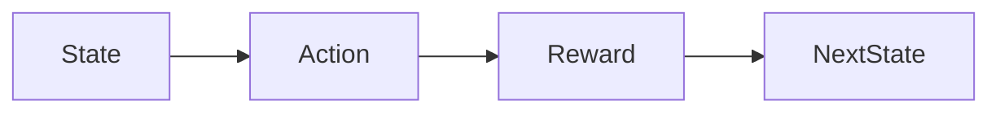
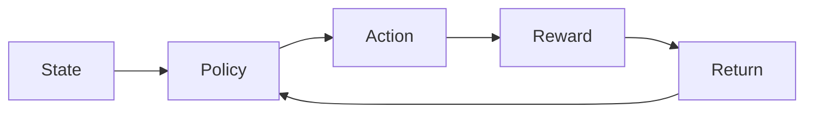
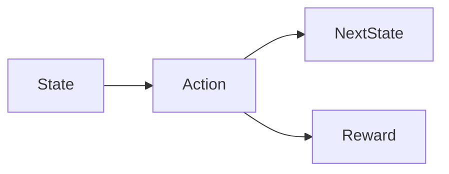

# Reinforcement Learning Study Guide

## Why Reinforcement Learning Matters  

Think of teaching a pet: you try a trick, give a treat or a scold, and the pet adjusts its behavior. Reinforcement Learning (RL) puts that trial‑and‑error loop into a formal framework for computers. It’s why game‑playing AIs can beat world champions, why robots learn to walk, and how recommendation systems guess what you’ll click next. Whenever a self‑driving car decides to brake or accelerate, it’s using RL under the hood.

## Core RL Loop and Building Blocks  

In RL we have **an agent** that interacts with **an environment**. At each time step *t*:

1. The agent observes a **state** $s_t$ (what it knows about the world).  
2. It selects an **action** $a_t$.  
3. The environment returns a **reward** $r_{t+1}$ and a **next state** $s_{t+1}$.  

The goal is to choose actions that maximize the total (discounted) reward over time.

*The basic RL interaction loop: the agent acts, the environment reacts, and the cycle repeats.*

> [!tip] Imagine a video‑game character that learns which moves give the most points. The “points” are the reward, and the character’s controller is the **policy** that gets refined over many plays.

### The Four Building Blocks  

- **State ($s$)** – a snapshot of everything relevant. For a helicopter this might be altitude, speed, and orientation.  
- **Action ($a$)** – a choice that can change the state (e.g., adjust rotor speeds).  
- **Reward ($r$)** – a numeric feedback signal telling the agent how good the last action was.  
- **Discount factor ($\gamma$, $0\le\gamma\le1$)** – decides how much future rewards matter compared to immediate ones.  

These pieces form a simple loop:

*The agent sees a state, picks an action, receives a reward, and lands in a new state.*

> [!warning] **Dense reward functions** (rewarding every tiny step) can drown out the real goal and make learning unstable. Keep the reward signal focused on the objective you care about.

## Example: Helicopter Hovering (and a Mars Rover)

### Helicopter  

- **State**: current position, velocity, and orientation.  
- **Action**: tilt rotors forward/backward/left/right or adjust throttle.  
- **Reward**: +1 for staying within a target zone, –1 for drifting away or crashing.  

Initially the helicopter flaps randomly. Each reward updates its **policy** (the internal rule mapping states to actions). After many episodes it learns the subtle adjustments needed to hover smoothly without human input.

### Mars Rover  

- **State**: location on the terrain, battery level, sensor readings.  
- **Action**: drive forward, turn, or collect a sample.  
- **Reward**: +1 for moving closer to a scientific target, –1 for hitting a rock or wasting energy.  

Both examples illustrate the same RL loop: observe → act → receive reward → transition.

## Where RL Is Used  

- **Games** – AlphaGo, OpenAI Five, Atari agents.  
- **Robotics** – manipulators picking objects, drones navigating obstacles.  
- **Finance** – adaptive trading bots.  
- **Healthcare** – treatment planning that balances efficacy and side‑effects.  

All follow the same interaction pattern described above.

## Return and Policy (Mechanics)  

### Return  

The **return** $G_t$ measures the total discounted reward the agent expects from time step $t$ onward:

$$
G_t = \sum_{k=0}^{\infty} \gamma^{k} \, r_{t+k+1}
$$

- $\gamma$ close to 1 → care about the long run.  
- $\gamma$ near 0 → focus on immediate payoff.

> [!tip] If a robot keeps moving toward a goal instead of stopping at the first reward, check that $\gamma$ is high enough. A larger $\gamma$ encourages planning ahead.

> [!warning] Setting $\gamma = 1$ for tasks that can run indefinitely may cause the return to diverge, destabilizing learning.

### Policy  

A **policy** $\pi$ tells the agent what action to take in each state:

$$
\pi(a \mid s) = \Pr\{A_t = a \mid S_t = s\}
$$

- **Deterministic**: $a = \pi(s)$ (single action per state).  
- **Stochastic**: $\pi$ provides a probability distribution over actions.

The ultimate aim is the **optimal policy** $\pi^{*}$ that maximizes expected return:

$$
\pi^{*} = \arg\max_{\pi} \; \mathbb{E}[G_t \mid \pi]
$$

*The learning cycle: the policy selects an action, the environment supplies a reward, the return evaluates it, and the policy updates to improve future returns.*

## Markov Decision Process (MDP)  

An **MDP** formalizes the RL problem with five components:

1. **States ($\mathcal{S}$)** – all possible snapshots.  
2. **Actions ($\mathcal{A}$)** – all choices available in each state.  
3. **Transition probabilities ($P$)** – $P(s' \mid s, a)$ gives the chance of landing in state $s'$ after taking action $a$ in state $s$.  
4. **Reward function ($R$)** – $R(s, a, s')$ yields the immediate reward for that transition.  
5. **Policy ($\pi$)** – the strategy we aim to improve.

The **Markov property** assumes the future depends only on the current state, not the full history—just like saying “once you know where a chess piece is, you don’t need to remember how it got there to decide the next move.”

*One MDP step: from a state choose an action, which leads to a new state and a reward.*

> [!tip] When building an MDP for a new problem, start small: pick a handful of key state variables and a minimal action set. Expand only once the learning algorithm can handle the simpler version.

> [!warning] **Over‑specifying the state** (e.g., feeding every raw sensor reading into $s$) makes the transition model noisy and slows learning. Aim for a *minimal sufficient* representation.

### Real‑World Illustrations  

- **Autonomous Helicopter** – State = flight envelope, Action = motor commands, Reward = +1 for stable hover, –1 for turbulence.  
- **Game Playing (Chess, Go, Atari)** – State = board position, Action = legal move, Reward = +1 for win, –1 for loss (often sparse).  

Both fit neatly into the MDP framework, enabling algorithms like Q‑learning or policy gradients to improve the policy through interaction.

## Connecting the Dots  

We began with the **RL loop** (states, actions, rewards, discount) and saw how it appears in concrete examples. The **return** tells us how much future reward we care about, while the **policy** is the rule we adjust to maximize that return. The **MDP** ties everything together by providing a precise bookkeeping system: states, actions, transition dynamics, rewards, and the policy we’re optimizing.

With these foundations, you’re ready to explore specific RL algorithms—whether value‑based methods like Q‑learning or policy‑gradient approaches—that take the formalism we’ve built and turn it into a learning machine.

---  

*Next up: dive into algorithmic details such as Q‑learning, SARSA, and deep policy gradients. See [[#Return and Policy (Mechanics)]] for the mathematical targets those algorithms aim to optimize, and [[#Markov Decision Process (MDP)]] for how to frame any sequential decision problem as an MDP.*