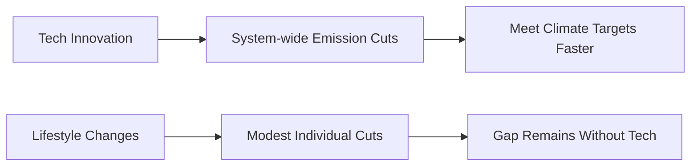
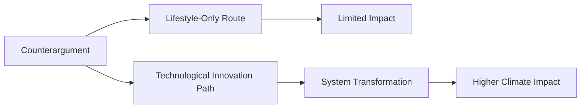

# Technological Innovation vs. Lifestyle Changes in Climate Mitigation  

Understanding why personal habits alone can’t solve the climate crisis—and why clean‑tech breakthroughs are essential—requires a clear framework. Below we walk through the three‑pillar lens, the mechanisms that give technology the edge, common counterarguments, and what that means for real‑world action.

---

## Introduction to the 3 Pillars of the Debate on Climate Change (Motivation)  

Think of climate mitigation like trying to fill a leaky bucket.  

- **Scale** – How big a patch can we put on the bucket? Tiny patches (individual actions) won’t matter when the hole is huge. We need solutions that can be deployed at gigawatt‑scale (e.g., solar farms, carbon‑capture plants).  
- **Speed** – How quickly can we install those patches before the water (greenhouse gases) overflows? Lifestyle tweaks often take years to change habits across a population, whereas a new battery chemistry can be mass‑produced and shipped in months.  
- **Real‑World Success** – Does the patch actually stop the leak when we test it? Lab results are nice, but we need proof that the technology works under real operating conditions—think offshore wind turbines that survive storms while delivering power.  

These three ideas form the backbone of the argument that technology, not just lifestyle changes, will drive the deep emissions cuts we need.

*From the overall challenge to tangible emission reductions through the three pillars.*

> [!tip] When you hear “just drive less,” ask yourself: *Can that single behavior be scaled to billions of trips and deployed fast enough to meet climate targets?* The three‑pillar lens makes the question concrete.  

---

## Argument for Technological Innovation in Climate Change Mitigation (Mechanism)  

Imagine the climate problem as a leaky bathtub. Lifestyle tweaks are like turning the faucet down a little—they help, but the water still spills. Deploying clean‑energy tech is like installing a larger drain that empties the tub far faster than any faucet adjustment.

**Why technology outperforms lifestyle change**

1. **Scale & Speed** – New technologies can be rolled out across entire grids, factories, or transport networks in months to years, affecting billions of emission sources at once.  
2. **Real‑World Successes** – Over the past decade we’ve seen solar panel costs plummet, offshore wind farms grow to gigawatt scale, and carbon‑capture pilots move from labs to pilot plants. Those concrete roll‑outs cut emissions far beyond what individual lifestyle tweaks could achieve.  
3. **Limits of Human Behavior** – Even the most motivated people struggle to sustain major lifestyle overhauls; social, economic, and cultural frictions create barriers that technology can bypass (e.g., electrified transport replaces the need for people to *choose* a different car).

*Tech innovation drives large‑scale cuts, while lifestyle changes alone leave a gap.*

> [!warning] **Pitfall:** Assuming that a collection of small personal actions will add up to the massive cuts required to stay under 1.5 °C. The math simply doesn’t line up.  

> [!note] The analogy of the bathtub and the mention of solar‑cost declines are common illustrations used to show why tech can outpace behavior change.

---

## Debunking the Effectiveness of Lifestyle Changes and Highlighting Technological Solutions (Example)  

The usual counterargument runs: *“If everyone drives a fuel‑efficient car, eats less meat, and recycles, we’ll solve the problem.”* It feels empowering, but it overlooks three practical hurdles.

1. **Scale** – Even universal “right” choices usually shave off only a fraction of total emissions.  
2. **Speed** – Climate thresholds are tightening; behavior change alone can’t happen fast enough.  
3. **Systemic Barriers** – Many emissions stem from industrial processes and infrastructure that individuals can’t directly control.

Technological advances tackle these hurdles head‑on:

- **Decarbonize hard‑to‑abate sectors** (steel, cement, aviation) where lifestyle levers have little reach.  
- **Scale quickly** through mass production and network effects (e.g., solar panels, battery storage).  
- **Unlock new pathways** such as negative‑emissions technologies that actually remove CO₂ from the atmosphere.

*The diagram shows the two routes: lifestyle‑only actions hit a ceiling of limited impact, while tech‑driven system transformation opens the door to larger climate gains.*

> [!tip] When discussing climate solutions, acknowledge the positive role of individual actions **and then pivot**: *“Those actions matter, but the biggest climate win will come from scaling up clean‑energy tech that replaces the fossil‑fuel infrastructure.”*  

---

## Addressing Counterarguments and Emphasizing the Importance of Technological Innovation  

Putting the pieces together, the debate isn’t “technology vs. lifestyle”; it’s “which levers give us the biggest emissions cuts with the least collateral damage?”  

- **Bottom Line**  
  - Technology is the key driver of large‑scale mitigation, not a side‑track.  
  - The *type* of technology matters: solutions that decarbonize the energy system, pull CO₂ out of the air, or make the built environment more efficient are the game‑changers.  
  - Lifestyle changes are valuable for morale and incremental gains, but they alone cannot meet the scale, speed, and real‑world success thresholds required to stay below dangerous warming.  

> [!tip] When evaluating a climate action, ask: *Is this a tech that reduces emissions at scale, or just a small lifestyle tweak?* The former usually moves the needle far more.

> [!info] In climate discourse, “technology” includes solar panels, wind turbines, advanced battery materials, carbon‑capture systems, and other tools evaluated on cost, scalability, and lifecycle emissions.

---

## How It All Connects  

*From the climate challenge to a stable climate, clean tech is the bridge.*  

For a deeper dive into the mechanisms behind these innovations, see [[#Argument for Technological Innovation in Climate Change Mitigation (Mechanism)]].  

---  

*This study guide stitches together the core ideas about why clean‑tech innovation is indispensable for climate mitigation, how it outperforms lifestyle‑only approaches, and what to keep in mind when discussing solutions.*