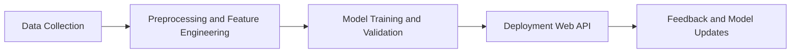

# My Machine Learning Project Portfolio

## 📚 Navigation  
**Part I — Project Overview** [[#Why It Matters]] · [[#Project Highlights]] · [[#What the Projects Reveal About My Skills]] · [[#Linking to the Next Topic]]

---  

## Part I — Project Overview

### Why It Matters  
When a hiring manager scans a stack of resumes, the projects you’ve built are the first thing that sticks—like a catchy headline in a news article. Describing a Premier League match predictor or a StudyScore web app instantly signals that you can **define a problem, build a model, and ship a usable product**. Those three steps are the backbone of any real‑world machine learning (ML) job, so showcasing them up front sets the stage for everything that follows.  

> [!tip] Think of your project list as a “proof‑of‑concept” portfolio. Each entry proves you can move from curiosity to a working product, which is exactly what teams need when they’re deciding whom to bring on board.  

---  

### Project Highlights  
I’ve assembled two projects that together cover the whole ML lifecycle:

1. **Premier League Match Predictor** – Ingests past match statistics, player performance metrics, and team form to forecast upcoming game outcomes. The workflow starts with scraping match data, cleaning and engineering features (e.g., goal differential, home‑away advantage), training a classification model, and finally exposing predictions through a simple web interface.  

2. **StudyScore ML Web App** – Lets students upload quiz results and receive a personalized “study score” that predicts their likelihood of mastering upcoming material. The pipeline gathers anonymized quiz data, builds a regression model to estimate future performance, and wraps the model in a Flask (or similar) API that the front‑end calls in real time.  

Both projects share a common pipeline, which I picture as a loop:

*End‑to‑end ML loop: from raw data to a live service that learns from its own usage.*

> [!example] **Worked Example – Feature Engineering for the Premier League Predictor**  
> Suppose a match ends 3‑1 for the home team.  
> - **Goal differential** = Home goals − Away goals = 3 − 1 = **2**.  
> - **Home advantage flag** = 1 (because the home team played at home).  
> These two numbers become features fed into the classifier. In practice you’d add many more (shots on target, possession %, etc.), but this tiny example shows how raw statistics are turned into model‑ready inputs.  
>   
> > [!tip] Features that capture domain knowledge (like home advantage) often move the needle more than generic statistics.  

---  

### What the Projects Reveal About My Skills  
Talking about these projects isn’t just name‑dropping; it tells a story about the **technical toolbox** I bring:

- **Data wrangling** – Scripts that pull structured match stats from public APIs and clean noisy quiz logs, turning messy CSVs into tidy training sets.  
- **Feature engineering** – Translating domain insights (e.g., “home advantage”, “question difficulty”) into quantitative features that improve model performance.  
- **Model selection & evaluation** – Experimenting with logistic regression, random forests, and gradient‑boosted trees; using cross‑validation to guard against overfitting; reporting metrics like accuracy and RMSE.  
- **Production readiness** – Containerizing predictors with Docker and serving them via a lightweight web framework, turning a notebook prototype into a user‑friendly app.  
- **Iterative improvement** – Monitoring the feedback loop to detect model drift and scheduling periodic retraining—an essential habit for any production ML system.  

> [!important] **Key insight:** Building a model is only half the battle; getting it into a user’s hands and maintaining it is where real value lives.  

> [!warning] **Common mistake:** Deploying a model without a monitoring strategy can let performance silently degrade as data distributions shift.  

---  

### Linking to the Next Topic  
Now that you’ve seen the “what” and “why” of my ML projects, the next section dives into the **technical skills and education** that underpin them, linking theory to practice.  

---  

## 📖 Glossary  

| Term | Definition | Formula |
|------|------------|---------|
| **Data Collection** | Gathering raw observations from sources (APIs, files, etc.) | — |
| **Feature Engineering** | Transforming raw data into predictive variables | — |
| **Model Training** | Optimizing model parameters on a training set | — |
| **Deployment** | Making a trained model available via an API or web service | — |
| **Feedback Loop** | Process of using live usage data to update the model | — |
| **Goal Differential** | Home goals minus away goals | $ \text{GD} = \text{HomeGoals} - \text{AwayGoals} $ |
| **Home Advantage Flag** | Binary indicator of whether the home team is playing | $ \text{HA} = \begin{cases}1 & \text{home game}\\0 & \text{away game}\end{cases} $ |
| **Cross‑validation** | Splitting data into folds to estimate out‑of‑sample performance | — |
| **RMSE** | Root Mean Squared Error, a regression performance metric | $ \text{RMSE} = \sqrt{\frac{1}{n}\sum_{i=1}^{n}(y_i-\hat y_i)^2} $ |
| **Accuracy** | Proportion of correctly classified instances | $ \text{Acc} = \frac{\text{Correct}}{\text{Total}} $ |

---  

*Sources: Personal project documentation (Premier League Match Predictor, StudyScore ML web app).*