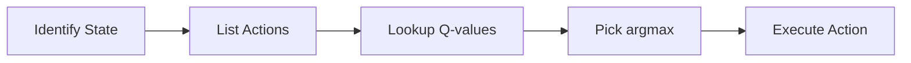

**In this section:** [[#🧭 Why It Matters]] · [[#📐 Definition and Formula]] · [[#🎯 Deriving the Optimal Policy]] · [[#🛠️ Worked Example]] · [[#⚠️ Common Misconceptions]] · [[Glossary|Glossary]]

## 🧭 Why It Matters

The Q‑function is the shortcut that lets an RL agent pick the *best* move without having to simulate every possible future. If you can read the Q‑values for a state, you instantly know which action will give the highest expected return. That’s why learning Q‑values is essentially the same as learning the optimal policy.

> [!tip] Whenever you see a Q‑value table, think of it as a “scoreboard” that tells the agent how good each move is **right now**, assuming it will play perfectly from the next step onward.

## 📐 Definition and Formula

The **state‑action value function**, usually written $Q(s,a)$, is the expected total return when you start in state $s$, take action $a$, and then follow the optimal policy $\pi^*$ forever.

$$
Q(s, a) = \mathbb{E}\!\left[ \sum_{t=0}^{\infty} \gamma^{t}\, r_{t+1} \;\Big|\; s_0 = s,\; a_0 = a,\; \pi = \pi^{*} \right]
$$

Here:
* $\gamma \in [0,1]$ is the **discount factor** (how patient the agent is).
* $r_{t+1}$ is the reward received at the next time step.
* The expectation $\mathbb{E}[\cdot]$ accounts for any randomness in the environment.

Once you have $Q(s,a)$ for every action, the optimal policy is simply the action that maximizes $Q$:

$$
\pi^{*}(s) = \arg\max_{a} Q(s, a)
$$

> [!important] Maximising $Q(s,a)$ over $a$ works because $Q$ already assumes *optimal* behaviour after the first move. So the biggest $Q$ means “best first move, then perfect play”.

## 🎯 Deriving the Optimal Policy

Turning Q‑values into a decision rule is a three‑step loop:

*Policy selection via Q‑values.*

1. **Identify the current state** $s$.
2. **List all feasible actions** $a \in \mathcal{A}(s)$.
3. **Look up each $Q(s,a)$** from the learned table or function approximator.
4. **Choose the action with the highest $Q$** (the $\arg\max$ step).
5. **Execute that action** and move to the next state, repeating the loop.

## 🛠️ Worked Example

> [!example] **Mars Rover – discount $\gamma = 0.5$**

| State | Action | Q‑value |
|-------|--------|--------|
| 2     | right  | 12.5   |
| 2     | left   | 50     |

*Why these numbers?*  
Suppose taking **right** from state 2 gives an immediate reward of $10$ and then lands the rover in a state that yields $5$ more reward one step later. The discounted return is:

$$
Q(2,\text{right}) = 10 + 0.5 \times 5 = 12.5
$$

Taking **left** yields an immediate reward of $20$ and later a reward of $60$ two steps ahead:

$$
Q(2,\text{left}) = 20 + 0.5 \times (0.5 \times 60) = 20 + 0.5 \times 30 = 50
$$

Since $50 > 12.5$, the optimal policy in state 2 is to go **left**.

> [!tip] A higher discount factor (e.g., $\gamma = 0.9$) would make future rewards count more, potentially flipping which action looks best.

## ⚠️ Common Misconceptions

* **“Q tells me how good an action is by itself.”**  
  No – $Q(s,a)$ includes the *future* optimal behavior, not just the immediate effect.

* **“I need the optimal policy first to compute Q.”**  
  The definition looks circular, but RL algorithms (e.g., Q‑learning) *estimate* $Q$ iteratively and *