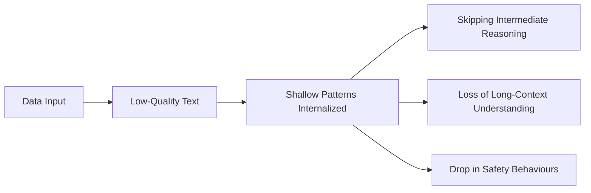
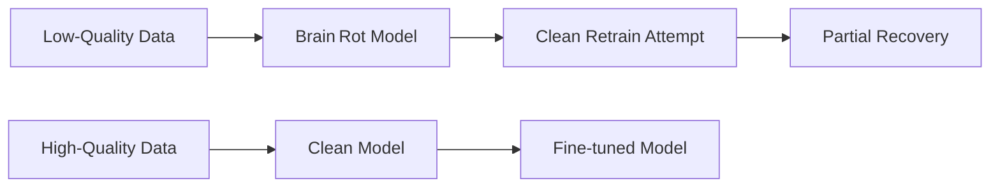
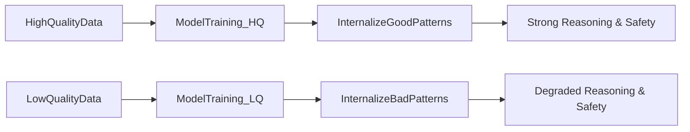
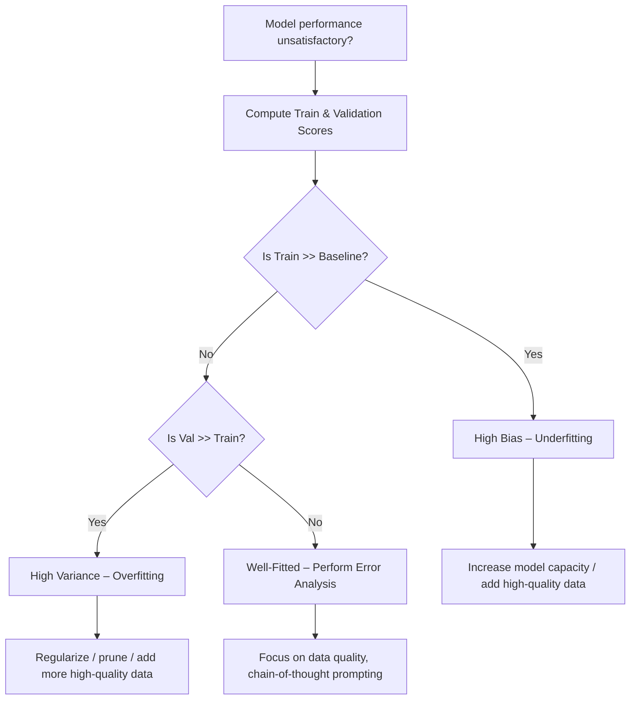

# Understanding Data Quality and Model “Brain Rot”

---  

## 📚 Navigation  

**Part I — Why Data Quality Matters** [[#🎯 Why Data Quality Matters]] [Quick Check](#🔎-quick-check)  
**Part II — How Low‑Quality Data Causes Brain Rot** [[#🧠 Mechanism Overview]] [[#🔬 Permanent Decline]]  
**Part III — Evidence of Performance Degradation** [[#⚙️ Experimental Comparison]] [[#📉 Benchmark Drop (ARC Challenge)]] [Worked Example – ARC Scores|Worked Example]  
**Part IV — Irreversibility & Training Implications** [[#⚡ Irreversibility Explained]] [[#🚀 Best‑Practice Guidelines]]  
**Big Picture** [[#🗺️ Full Pipeline Overview]] [[#🔍 Decision Flowchart]]  

---  

## Part I — Why Data Quality Matters  

### 🎯 Why Data Quality Matters  

> [!note]  
> Language models inherit their “thinking style” from the text they ingest. Feeding them high‑engagement, shallow snippets (click‑bait headlines, meme captions) erodes deep reasoning, long‑context handling, and safety behaviors.  

> [!tip]  
> When curating a pre‑training corpus, ask: *If this text were a textbook, would it teach me to solve problems or just repeat slogans?*  

> [!warning]  
> The old adage “more data = better model” only holds when the added data is **high‑quality**. Low‑quality data can *reduce* performance even if the token count grows.  

---  

## Part II — How Low‑Quality Data Causes Brain Rot  

### 🧠 Mechanism Overview  

Think of an LLM’s parameters as a sponge that soaks up statistical patterns. High‑quality prose teaches the sponge to retain multi‑step logic and maintain context. Low‑quality, engagement‑driven text floods the sponge with surface‑level cues, causing it to:

* Skip intermediate reasoning steps  
* Lose the ability to track long conversations  
* Diminish safety‑related behaviours  


*From low‑quality tokens to degraded capabilities.*

> [!tip]  
> The intuition is simple: a model mirrors the “thinking style” it sees most often. Feed it shallow content, and it learns to answer shallowly.  

### 🔬 Permanent Decline  

1. **Statistical pattern absorption** – The model over‑represents frequent, shallow constructs.  
2. **Skipping reasoning steps** – Those constructs often omit logical intermediates, so the model learns to “jump to conclusions.”  
3. **Internal logic breakdown** – Latent representations that support multi‑step reasoning erode, making recovery difficult even after later clean training.  


*Trajectories after high‑ vs. low‑quality training and limited recovery.*  

> [!warning] **Common pitfall:** Assuming a later round of clean data or instruction tuning can fully erase the damage. In practice, the “brain” often retains the shallow habits.  

---  

## Part III — Evidence of Performance Degradation  

### ⚙️ Experimental Comparison  

Researchers continued‑training two identical base models on **the same number of tokens** but with opposite data quality:

| Corpus | Description |
|--------|-------------|
| **High‑Quality Stream** | Curated literature, scientific articles, well‑written instructional text |
| **Low‑Quality Stream** | Click‑bait headlines, meme captions, loosely‑structured forum posts |

Both models experienced identical compute budgets; the only variable was corpus quality.


*High‑ vs. low‑quality data pipelines and their performance outcomes.*  

### 📉 Benchmark Drop (ARC Challenge)  

Reasoning benchmarks such as the **ARC (AI2 Reasoning Challenge)** sharply reflect the degradation:

| Model | Training Corpus | ARC Accuracy |
|-------|----------------|--------------|
| Base (pre‑train) | Mixed (high‑quality) | 68 % |
| +HQ Continual | High‑quality only | **71 %** (↑ 3 pts) |
| +LQ Continual | Low‑quality only | **52 %** (↓ 16 pts) |

> [!example]  
> **Worked Example – ARC Scores**  
> The base model scored 68 % on ARC. After 100 B additional tokens of high‑quality data, accuracy rose to 71 %. The same token count of low‑quality data caused a drop to 52 %. This 19‑point swing illustrates how *quality* trumps *quantity*.  

> [!tip]  
> A steep decline on reasoning benchmarks signals that the model’s internal “chain‑of‑thought” reasoning has been compromised.  

---  

## Part IV — Irreversibility & Training Implications  

### ⚡ Irreversibility Explained  

When a model “gets sick” from low‑quality data, the damage is **sticky**. Even extensive fine‑tuning on clean corpora or instruction‑tuning only yields partial recovery.

> [!important] **Bottom line:** *More data ≠ better model.* Shallow, click‑bait style data poisons the training signal, and the model’s “brain” can rot.  

### 🚀 Best‑Practice Guidelines  

1. **Curate aggressively** – Apply quality filters (readability, source reputation, length) before adding data to the training mix.  
2. **Monitor reasoning benchmarks** – Track ARC, MMLU, or other chain‑of‑thought tasks after each data‑ingestion phase.  
3. **Use chain‑of‑thought prompting** during evaluation to surface hidden reasoning degradation.  
4. **Treat instruction tuning as a *symptom* fix, not a cure** – It can improve surface behavior but rarely restores deep reasoning lost to brain rot.  
5. **Early‑stop low‑quality runs** – If validation on reasoning benchmarks plateaus or drops, halt further low‑quality ingestion.  

> [!warning]  
> Ignoring these safeguards often leads to models that appear fluent but fail on multi‑step problems or safety checks.  

---  

## 🗺️ Full Pipeline Overview  

```mermaid
flowchart TD
    RawData[Raw Internet Data] --> QualityFilter[Quality Filtering]
    QualityFilter --> CleanCorpus[High‑Quality Corpus]
    QualityFilter --> JunkCorpus[Low‑Quality Corpus]
    CleanCorpus --> TrainClean[Train / Continue‑Train Clean Model]
    JunkCorpus --> TrainJunk[Train / Continue‑Train Junk Model]
    TrainClean --> EvalClean[Evaluation (Reasoning Benchmarks)]
    TrainJunk --> EvalJunk[Evaluation (Reasoning Benchmarks)]
    EvalClean --> Decision1{Performance OK?}
    EvalJunk --> Decision2{Performance Degraded?}
    Decision1 -->|Yes| DeployClean[Deploy Clean Model]
    Decision1 -->|No| RevisitFilter[Revisit Filtering]
    Decision2 -->|Yes| Mitigate[Apply Mitigation (e.g., Clean Retrain, Instruction Tuning)]
    Decision2 -->|No| AcceptDegradation[Accept Degraded Model]
```
*End‑to‑end flow from raw data to deployment, highlighting where quality decisions impact outcomes.*  

---  

## 🔍 Decision Flowchart  


*Quick guide for diagnosing and responding to performance issues.*  

---  

## 📖 Glossary  

| Term | Definition | Formula |
|------|------------|---------|
| **Brain Rot** | Degradation of reasoning, long‑context, and safety abilities caused by prolonged exposure to low‑quality data | — |
| **Low‑Quality Data** | Text that is shallow, engagement‑driven, and lacks coherent structure (e.g., click‑bait, memes) | — |
| **High‑Quality Data** | Well‑structured, informative, and logically coherent text (e.g., literature, scientific articles) | — |
| **Reasoning Benchmark** | Evaluation set measuring multi‑step logical ability (e.g., ARC, MMLU) | — |
| **Chain‑of‑Thought Prompting** | Technique that elicits step‑by‑step reasoning in LLM outputs, useful for diagnosing internal reasoning health | — |
| **Instruction Tuning** | Fine‑tuning on instruction‑style data to improve alignment; insufficient alone to reverse brain rot | — |
| **ARC Accuracy** | Proportion of correctly answered ARC questions; used as a proxy for reasoning health | $ \text{Accuracy} = \frac{\text{Correct}}{\text{Total}} $ |
| **Irreversibility** | The phenomenon where damage from low‑quality data persists despite later clean training | — |

---  

*Sources: StatQuest with Josh Starmer · Andrew Ng — Machine Learning Specialization (Coursera) · Hands‑On ML with Scikit‑Learn, Keras & TensorFlow (Aurélien Géron) · Krish Naik ML Playlist*