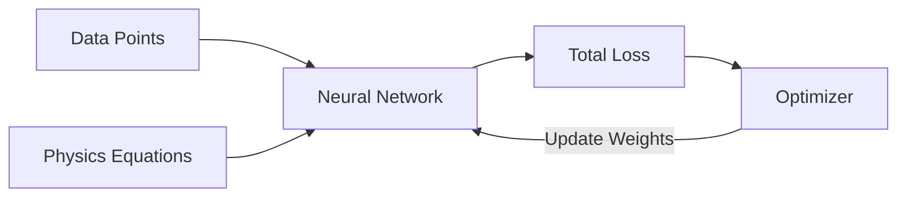
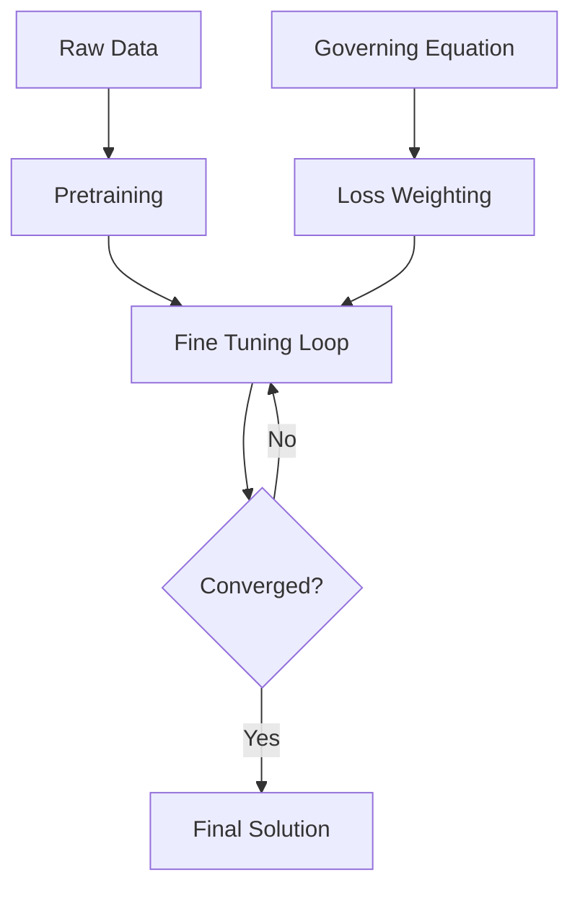
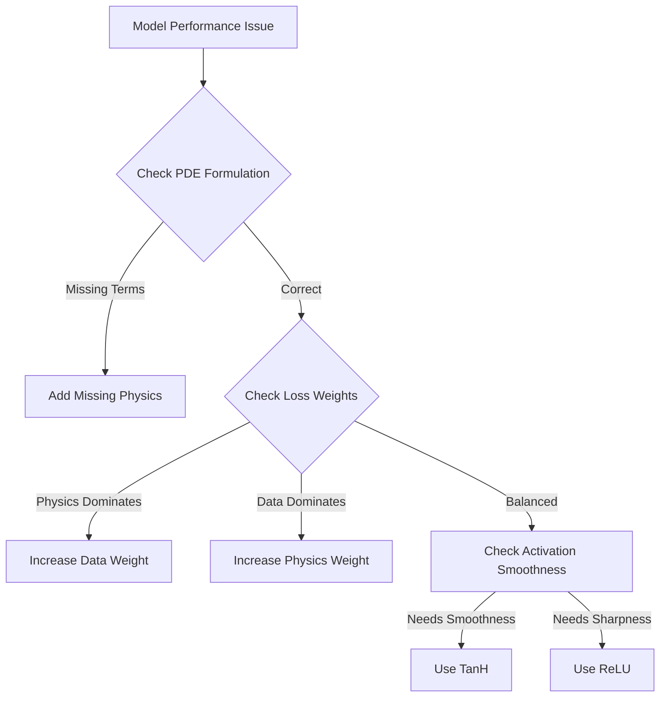

# Physics-Informed Neural Networks: A Comprehensive Study Guide

## 🗺️ Navigation
**Part I — Foundations**
[[#Why This Matters]] · [[#The Problem with Classical Neural Networks]] · [[#How PINNs Combine Physics and Data]]

**Part II — Architecture and Implementation**
[[#Advanced Architectures]] · [[#Formulating the Right Differential Equation]] · [[#Training Strategy]]

**Part III — Worked Examples and Decision Flows**
[[#Steady-State Heat Example]] · [[#Drug-Concentration Example]] · [[#The Big Picture]]

---

## 🔎 Part I — Foundations

### Why This Matters
Imagine you have a tiny piece of data about how a pendulum swings, but you also know Newton’s second law. A regular neural network would try to guess the whole motion just from that handful of points—often over-fitting or missing the physics entirely. Physics-informed neural networks (PINNs) give the model a cheat sheet: the governing equations. By baking physics into the loss function, the network can extrapolate sensibly even when data are scarce, leading to predictions that respect conservation laws and other known constraints. 

> [!tip] Whenever you hear “physics-informed,” think “the model is being reminded of the rules of the game while it learns.”

### The Problem with Classical Neural Networks
A vanilla neural network treats every training example as an isolated fact. It has no clue that energy should stay constant or that fluid flow obeys specific equations. Consequently:
* With few data points, the model **overfits**—it memorizes noise instead of learning the underlying dynamics.
* With abundant data, it can still produce **physically impossible** outputs (e.g., negative densities or velocities that violate mass conservation).

> [!warning] A common mistake is to assume that feeding more data will automatically fix unphysical predictions. Without explicit physics constraints, a network can still violate basic laws.

### How PINNs Combine Physics and Data
A PINN augments the standard data-fit loss with a **physics loss** that penalizes violations of known equations. Let $f(x)$ be our prediction. The total loss $\mathcal{L}_{\text{total}}$ is defined as:

$$
\mathcal{L}_{\text{total}} = \lambda_{\text{data}}\mathcal{L}_{\text{data}} + \lambda_{\text{bc}}\mathcal{L}_{\text{bc}} + \lambda_{\text{phys}}\mathcal{L}_{\text{phys}}
$$

* $\mathcal{L}_{\text{data}}$ measures the mismatch between the network output and observed measurements.
* $\mathcal{L}_{\text{bc}}$ enforces known values at the edges of your domain.
* $\mathcal{L}_{\text{phys}}$ measures how well the network satisfies governing differential equations at specific collocation points.
* $\lambda$ represents weighting factors to balance these objectives.

*The network receives guidance from both real measurements and underlying physical laws.*

---

## 🏗️ Part II — Architecture and Implementation

### Advanced Architectures
Think of a standard PINN as a black box with a sidekick: the neural network learns from data, while physics appears only as a penalty term. Advanced architectures move physics from a penalty into the structure of the network itself:

* **Operator learning layers:** Replace dense layers with kernels that respect known symmetries.
* **Physics aware embeddings:** Turn differential operators into trainable modules, solving the partial differential equation as part of the forward pass.
* **Fourier PINN:** Uses spectral encoders to transform spatial data into frequency coefficients, allowing for the analytical application of physical laws.

> [!important] When physics is part of the architecture, the model's inductive bias aligns with the underlying laws, leading to faster training and better generalization.

### Formulating the Right Differential Equation
The differential equation is the recipe. If the terms don't match the physical process, the network attempts to satisfy a contradiction. 

> [!warning] Dropping a required term, such as a diffusion component, forces the network to invent that effect from data, leading to overfitting or instability.

### Training Strategy
Training is the process of minimizing the total loss to ensure the network obeys both observations and scientific theory.

* **Pre-training:** Pre-training the network on data alone provides a strong initial guess. Fine-tuning with the physics-informed loss then nudges the solution toward the governing law. 
* **Balancing Weights:** Start with equal $\lambda$ weights and adjust based on which term remains the largest after several epochs.
* **Activation Functions:** 
    * Use `tanh` for smooth solutions.
    * Use `ReLU` for sharp fronts or discontinuities.

---

## 🧪 Part III — Worked Examples and Decision Flows

### Steady-State Heat Example
Modeling temperature $u(x)$ along a rod where $\frac{d^2u}{dx^2} = 0$, with boundaries $u(0)=0$ and $u(1)=100$.

> [!example]
> With only two data points, $u(0.2)=30$ and $u(0.8)=70$, the PINN enforces the physics loss $\mathcal{L}_{\text{phys}} = \sum (\frac{d^2u}{dx^2})^2$. Because the physics loss forces the second derivative to zero, the network learns the correct linear function $u(x)=100x$ despite having almost no data.

### Drug-Concentration Example
Modeling concentration $C(t)$ where $\frac{dC}{dt} = -kC(t)$. 

> [!example]
> If we have measurements $C(0)=10, C(1)=9.1$, and the network predicts $\hat{C}(1)=9.0$:
> 1. **Data loss**: $\mathcal{L}_{\text{data}} = (9.1 - 9.0)^2 = 0.01$.
> 2. **Physics residual**: The network calculates $\frac{d\hat{C}}{dt}$ at $t=1$. If the residual $(\frac{d\hat{C}}{dt} + k\hat{C})^2$ is large, backpropagation adjusts the internal weights to bring the derivative closer to the expected elimination rate $k$.

### The Big Picture

---

## 📖 Master Glossary

| Term | Definition | Formula |
|:---|:---|:---|
| **Automatic Differentiation** | Computational method for exact derivatives | — |
| **Collocation Points** | Points used to evaluate PDE residuals | — |
| **Data Loss** | MSE between prediction and observation | $\frac{1}{N}\sum(y-\hat{y})^2$ |
| **Fourier PINN** | PINN using frequency domain transforms | $e^{-\alpha k^2 t}$ |
| **Physics Loss** | Penalty term enforcing adherence to a PDE | $\mathcal{L}_{\text{phys}}$ |
| **PINN** | Neural network constrained by physics | — |
| **Residual** | The degree of violation of a law | $\mathcal{R}=0$ |

---

*Sources: StatQuest with Josh Starmer · Andrew Ng — Machine Learning Specialization (Coursera) · Hands-On ML with Scikit-Learn, Keras & TensorFlow (Aurélien Géron) · Krish Naik ML Playlist*