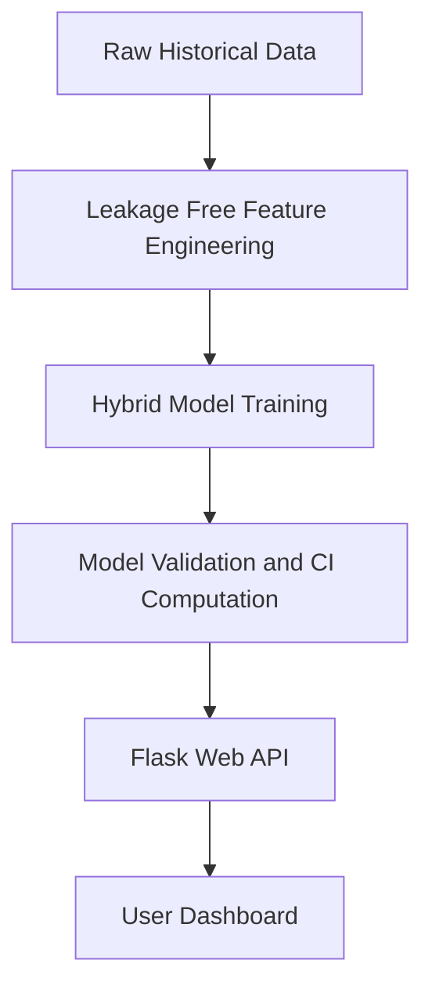
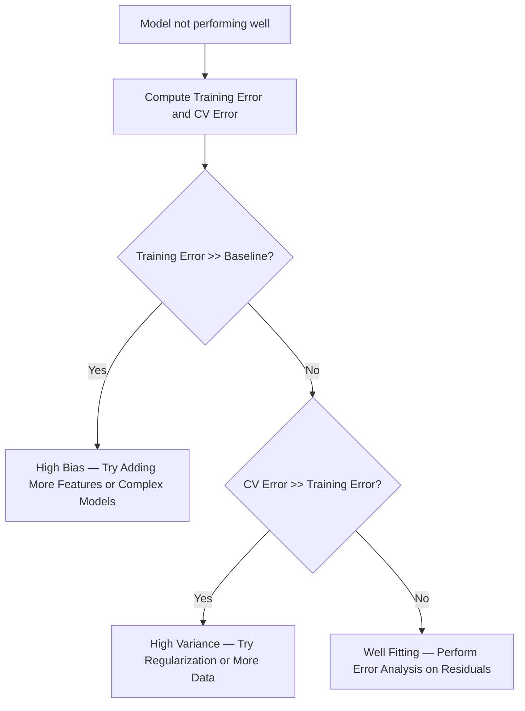
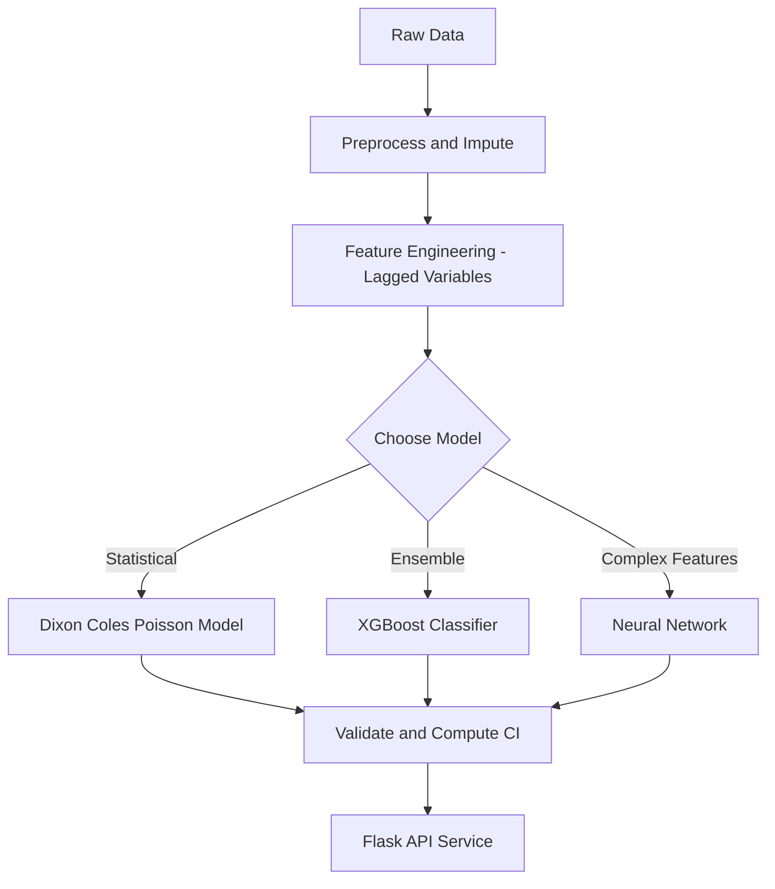

# Predictive Analytics: From Theory to Production

This guide explores the engineering of robust, production-ready predictive models. By blending classic statistical frameworks with modern machine-learning ensembles and deep learning architectures, we can build tools that provide both high performance and actionable uncertainty quantification.

## 🗺️ Navigation
**Part I — The Predictive Toolkit**
[[#🎯 Why This Matters]] · [[#🏗️ The Core Pipeline]] · [Professional Identity](Professional-Identity.md)

**Part II — Modeling Strategies**
[[#⚽ Dixon Coles Goal Model]] · [[#🌲 XGBoost Classification]] · [[#📈 Linear Regression Enhancement]]

**Part III — Deep Learning Foundations**
[[#🧠 The Architecture of Neural Networks]] · [[#🔄 The Backpropagation Procedure]] · [[#🌀 Optimization and Landscapes]]

**Part IV — Engineering & Deployment**
[[#🍃 Leakage Free Feature Engineering]] · [[#⚡ Confidence Interval API]] · [[#🔧 Debugging Your Algorithm]]

---

## 🎯 Why This Matters
When building predictive models for sports or academic outcomes, the gap between "working in a notebook" and "working in production" is usually found in data integrity and uncertainty. By using a hybrid approach—combining the interpretability of a **Dixon Coles Goal Model** with the predictive power of **XGBoost** and the feature-learning capabilities of neural networks—we create models that are trustworthy, stable, and easy to explain to stakeholders.

> [!tip] Think of this blend as a chef’s tasting menu: a refined classic dish (the Poisson model) paired with a bold new flavor (XGBoost). The result is richer than either course alone.

---

## 🏗️ The Core Pipeline
The following pipeline transforms raw historical data into reliable, service-ready predictions.

*The end-to-end flow from raw data to a user-facing API.*

---

## ⚽ Dixon Coles Goal Model
The Dixon Coles model treats each team’s scoring as a Poisson process. It estimates an attack strength ($\alpha$) and a defense weakness ($\beta$) for every team.

The expected goals ($\lambda$) for a home-away match are calculated as:
$$\lambda_{home} = \exp(\mu + \alpha_{home} - \beta_{away})$$
$$\lambda_{away} = \exp(\alpha_{away} - \beta_{home})$$

Where $\mu$ is the league-wide home-advantage term. We use Maximum Likelihood Estimation (MLE) to find the parameters ($\hat\theta$) that make our observed history most probable:
$$\hat\theta = \arg\max_\theta L(\theta \mid \text{data})$$

> [!example] Suppose Team A has an attack strength of 1.5 and Team B has a defense weakness of 1.3. Ignoring the home advantage, the expected goals are $\lambda_A = 1.5 \times 1.3 = 1.95$. The probability of exactly 2 goals is:
> $$P(2; 1.95) = \frac{1.95^2 e^{-1.95}}{2!} \approx 0.23$$

---

## 🌲 XGBoost Classification
While Poisson models estimate goal counts, XGBoost excels at turning these features into a 3-way win-draw-loss classification. It iteratively trains trees to correct the errors of the previous ensemble, minimizing the multiclass log-loss.

> [!important] Integrating XGBoost with the Dixon Coles Poisson model allows us to use the statistical strengths as high-quality input features for the machine learning model.

---

## 📈 Linear Regression Enhancement
For predicting continuous outcomes like exam scores, we use a standard linear regression model boosted by feature engineering. By including interaction terms and binary flags, we create non-linear flexibility without the overhead of neural networks.

---

## 🧠 The Architecture of Neural Networks
Simple perceptrons are like straight-line fences; they cannot solve non-linearly separable problems (like XOR). By introducing **Hidden Units**, we allow the network to combine raw inputs into abstract, internal features. 

The forward pass computes a weighted sum of inputs $x_j = \sum_i w_i y_i$, which then passes through an activation function like Sigmoid or ReLU. This architecture enables the model to carve out complex, curved decision boundaries.

---

## 🔄 The Backpropagation Procedure
When the model predicts incorrectly, we must adjust the weights. Backpropagation is a "blame assignment" game that uses the chain rule to propagate error signals backward from the output layer to every weight in the network.

**The Four Steps of Training:**
1. **Forward pass:** Calculate all activations.
2. **Compute output error:** Evaluate $E = \frac{1}{2}\sum (t - \hat{y})^2$.
3. **Backward pass:** Calculate how much each weight contributed to the error using the chain rule.
4. **Weight update:** Apply an optimizer (like Stochastic Gradient Descent) to nudge weights toward lower error.

> [!important] The gradient for a weight $w_{ji}$ is given by $\frac{\partial E}{\partial w_{ji}} = \frac{\partial E}{\partial x_j} y_i$.

---

## 🌀 Optimization and Landscapes
The loss function in deep learning is **non-convex**, meaning it contains many local minima. Gradient descent follows the slope downhill, but because it is a "best-effort" climber, it may get stuck in a valley that is not the global optimum. Increasing the weight space dimensionality often provides more paths to navigate these barriers.

---

## 🍃 Leakage Free Feature Engineering
The most common way models "fail in production" is through **data leakage**—using information in the training set that would not be available in real-time.

*   **The Rule:** If you wouldn't know the value before the event (e.g., kickoff or exam), it cannot be a feature.
*   **The Strategy:** Always lag your features (e.g., use the rolling average of the last 5 games).

---

## ⚡ Confidence Interval API
Our Flask API returns a 95% confidence interval using the normal approximation:
$$\text{CI}_{95\%} = \hat\theta \pm 1.96 \cdot \text{SE}(\hat\theta)$$

---

## 🔧 Debugging Your Algorithm
When your model isn't performing as expected, use this flowchart to identify the root cause.

---

## 📊 The Big Picture: Full Pipeline

---

## 📚 Master Glossary

| Term | Definition | Formula |
|:---|:---|:---|
| **Backpropagation** | Algorithm using the chain rule to calculate gradients | — |
| **Dixon Coles** | Poisson model for predicting sports outcomes | — |
| **Gini Impurity** | Measure of node mix in decision trees | $1 - \sum p_i^2$ |
| **Hidden Units** | Neurons that learn intermediate features | $\sum w_i y_i$ |
| **Leakage** | Using future info in training | — |
| **MLE** | Finding parameters that maximize data likelihood | $\arg\max L(\theta \mid \text{data})$ |
| **Non-convex** | Surface with multiple local minima | — |
| **Poisson** | Distribution for counting occurrences | $P(k; \lambda) = \frac{\lambda^k e^{-\lambda}}{k!}$ |
| **Residual** | The difference between observed and predicted | $y_i - \hat y_i$ |

---

*Sources: StatQuest with Josh Starmer · Andrew Ng — Machine Learning Specialization (Coursera) · Hands-On ML with Scikit-Learn, Keras & TensorFlow (Aurélien Géron) · Krish Naik ML Playlist*