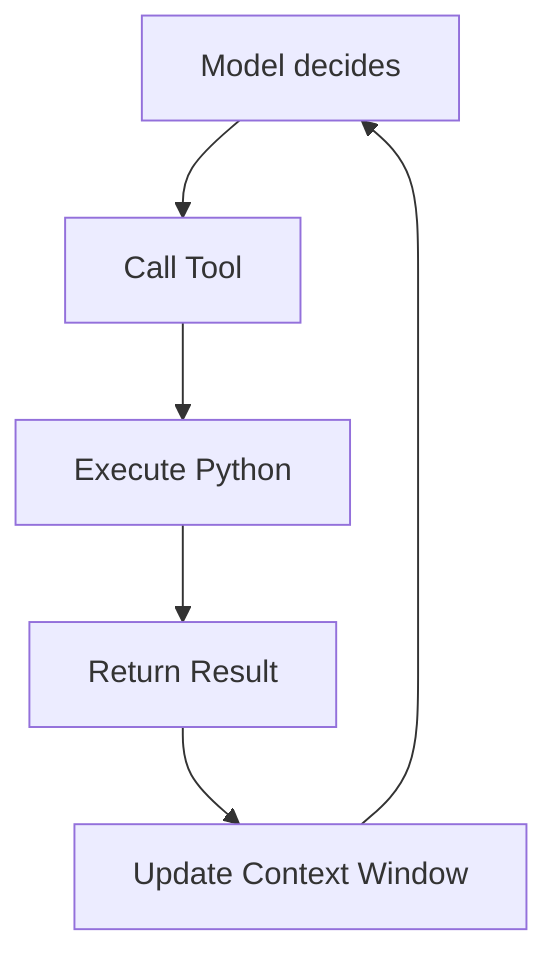
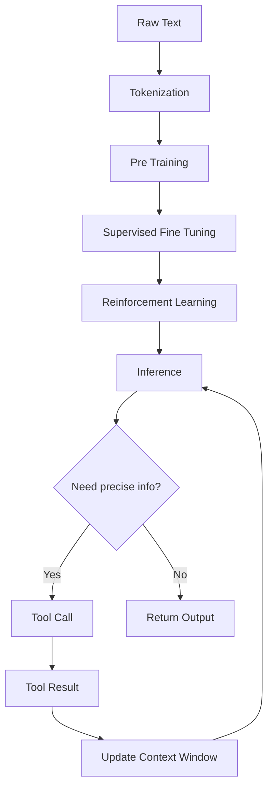
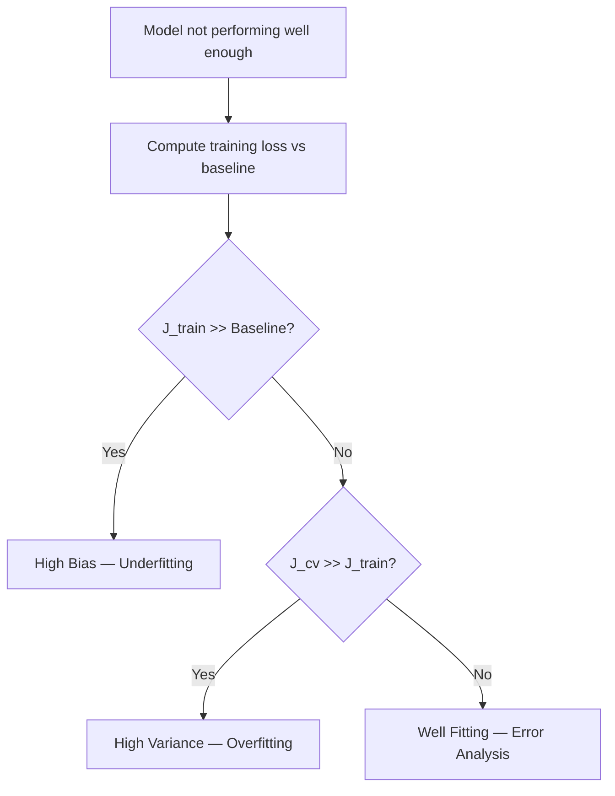

# 🧠 Understanding Large Language Models: A Comprehensive Study Guide

This guide explores the lifecycle of modern language models, from raw web text to robust reasoning assistants.

**Part I — The Foundations**
[[#🔍 Why It Matters]] · [[#🏗️ Data‑Prep Pipeline]] · [[#🧩 Tokenization & BPE]] · [[#📚 Worked Example — Tokenizing]]

**Part II — Reasoning, Tool Use, & Reliability**
[[#🤖 Chain‑of‑Thought Emergence]] · [[#🧀 The Swiss‑Cheese Analogy]] · [[#🛠️ Tool Integration as a Safety Valve]]

**Part III — Training and Behavior**
[[#💡 The Mechanics of Learning]] · [[#🚀 Inference Process]] · [[#🎯 From Base to Assistant]]

**Part IV — Diagnostics & Big Picture**
[[#📈 Full Pipeline Flowchart]] · [[#🧭 Decision Flowchart]] · [[#📚 Master Glossary]]

---

## Part I — The Foundations

### 🔍 Why It Matters
Before any neural network can "read" text, the raw mess of the internet must be turned into clean, bite-sized symbols. If the data is noisy or the tokens are too large, the model either learns the wrong things or runs out of memory. A well-filtered, efficiently tokenized dataset provides a richer knowledge base and allows the model to maintain context across longer conversations.

> [!note] The pre-training corpus shapes everything the model knows. Missing languages or domains during this stage create permanent blind spots.

### 🏗️ Data‑Prep Pipeline
This assembly line transforms raw web crawls into a structured, numerical format.

*From raw crawled pages to a compact vocabulary ready for training.*

1. **URL filtering**: Weeds out spam and malware.
2. **HTML extraction**: Strips tags to leave readable text.
3. **Language filtering**: Retains the target mix of languages.
4. **PII removal**: Scrubs sensitive personal data.
5. **Tokenization**: Breaks text into discrete units.
6. **Byte‑Pair Encoding**: Merges frequent symbol pairs into a compact vocabulary.

### 🧩 Tokenization & BPE
Tokenization turns text into *tokens*—the atomic units the model processes. **Byte-Pair Encoding (BPE)** acts as a compression mechanism:

1. Start with the smallest units (bytes/characters).
2. Identify the most common adjacent pair.
3. Merge tha[Context Window](#context-window)ymbol with a unique ID.
4. Repeat until the desired vocabulary size is reached.

A larger vocabulary allows each token to carry more information, helping the model process longer conceptual "chunks" within its fixed [[#Context Window]].

### 📚 Worked Example — Tokenizing
> [!example] **Tokenizing "hello world"**
> The sentence splits into two tokens. Note that the space before "world" is preserved.
> 
> | Token text | Token ID |
> |------------|----------|
> | `hello`    | 15339    |
> | ` world`   | 1917     |

---

## Part II — Reasoning, Tool Use, & Reliability

### 🤖 Chain‑of‑Thought Emergence
Because a single token is produced by a finite forward pass, the model cannot perform complex logical leaps in one step. By prompting the model to write out intermediate steps—*“first compute X, then use X to compute Y”*—we spread the processing across many tokens. This provides the model with "thinking time" on its "desk" (the context window).

> [!tip] Prepend prompts with “Let’s think step-by-step” to encourage the model to generate its own chain-of-thought.

### 🧀 The Swiss‑Cheese Analogy
A model’s intelligence is like a block of Swiss cheese. Most of the cheese is solid, representing strong fluency and reasoning. The holes, however, are scattered arbitrarily—a counting error here, a faulty comparison there.

> [!important] High-level performance does not guarantee reliability on character-level tasks. Models cannot inherently "see" the letters inside a token; they require help.

### 🛠️ Tool Integration as a Safety Valve
When a model detects it lacks the fine-grained capability to solve a task (like counting letters or doing high-precision math), it can emit special tokens (e.g., `<python_start>`) to call an external tool. 

*The model detects a gap, offloads the task, receives a result, and resumes generation.*

> [!example] **Counting letters in "ubiquitous"**
> The model detects a counting gap, writes a Python script to `len("ubiquitous")`, runs it, receives `10`, and incorporates that verified fact into its final response.

---

## Part III — Training and Behavior

### 💡 The Mechanics of Learning
Training is a massive, repeated guessing game. For every slice of text:
1. **Provide a window**: A fixed-length sequence of tokens is fed into the transformer.
2. **Predict**: The network outputs a probability distribution for every token.
3. **Compare**: Predictions are compared to the actual next token.
4. **Update**: Parameters are nudged to increase the probability of the correct token.

### 🚀 Inference Process
After training, the model is "frozen." Inference involves generating tokens one by one:
1. **Start with a context**: Provide seed tokens.
2. **Sample**: Pick a token based on the generated probability distribution.
3. **Append**: Add the token to the context window and repeat.

### 🎯 From Base to Assistant
A base model is essentially a "lossy zip file" of the internet. We transform it into an assistant using two stages:
* **Supervised Fine-Tuning (SFT)**: Curated dialogues teach the model to act as an assistant.
* **Reinforcement Learning (RL)**: In verifiable domains, the model is rewarded for correct reasoning paths, encouraging it to discover effective strategies.

---

## Part IV — Diagnostics & Big Picture

### 📈 Full Pipeline Flowchart

*End-to-end pipeline: from raw input to final output with tool-assisted reliability.*

### 🧭 Decision Flowchart

*Use this logic to diagnose performance issues.*

---

## 📚 Master Glossary

| Term | Definition | Formula |
|------|------------|---------|
| **BPE** | Byte-Pair Encoding; merges symbols to form a vocabulary | — |
| **Chain-of-Thought** | Generating intermediate steps to improve reasoning | — |
| **Context Window** | The maximum number of tokens the model can "see" at once | — |
| **Inference** | Generating new text using fixed, trained parameters | — |
| **Pre-training** | Learning language patterns from massive, raw text | — |
| **RLHF** | Aligning model behavior with human preferences | — |
| **SFT** | Supervised Fine-Tuning; behavioral alignment using examples | — |
| **Tokenization** | Converting text into discrete numeric units | — |
| **Tool Use** | Calling external functions to obtain reliable results | — |

---
*Sources: StatQuest with Josh Starmer · Andrew Ng — Machine Learning Specialization (Coursera) · Hands-On ML with Scikit-Learn, Keras & TensorFlow (Aurélien Géron) · Krish Naik ML Playlist*