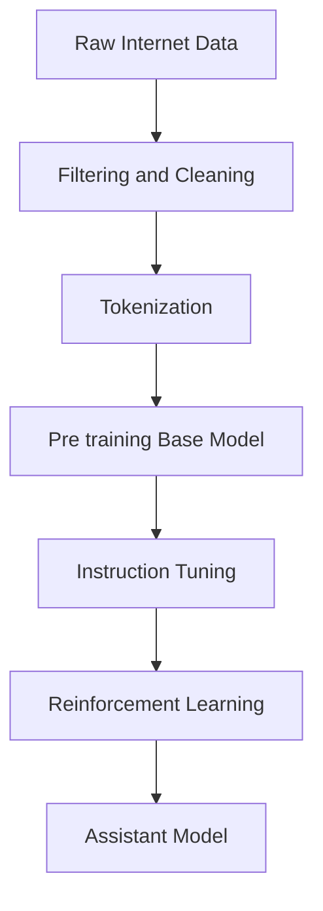
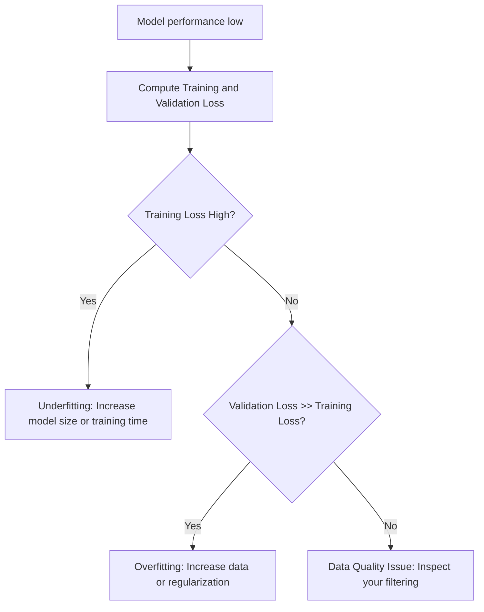

# 🏗️ Understanding Large Language Models: From Training to Inference

This guide explains how Large Language Models (LLMs) evolve from raw internet data into functional, reasoning assistants. We will walk through the pipeline from data curation to stochastic inference.

## 🗺️ Navigation
**Part I — The Data & Architecture**
[[#🏗️ Pre-training Data Collection and Processing]] · [Tokenization](Tokenization-Mechanics.md) · [[#🤖 Neural Network Training Process]]

**Part II — Advanced Concepts**
[[#🎲 Inference as a Stochastic Process]] · [[#🎓 Post-training and Instruction Tuning]] · [[#⚡ Reinforcement Learning from Human Feedback (RLHF)]]

---

## 🏗️ Pre-training Data Collection and Processing

Building an LLM is like organizing a massive, messy library. Pre-training is the initial phase where we turn raw, chaotic internet data into a high-quality knowledge base.

### The Data Curation Process
We process raw data through a strict pipeline to remove noise and ensure safety:

1. **URL Filtering**: Cross-referencing domains against blocklists to remove spam and malware.
2. **Text Extraction**: Stripping HTML, CSS, and navigation menus to isolate readable text.
3. **Language Filtering**: Using classifiers to select target languages and hit performance goals.
4. **PII Removal**: Scrubbing sensitive data like addresses or Social Security numbers.

*The data curation pipeline: refining raw web data into a usable training set.*

> [!tip] The FineWeb dataset is an excellent example of this, filtering raw web crawls down to 15 trillion tokens of high-quality, English-focused text.

> [!warning] If you neglect language diversity during the filtering stage, your final model will be incapable of supporting those languages.

---

## 📚 Tokenization Mechanics

Neural networks cannot process raw text directly; they require a one-dimensional sequence of symbols. **Tokenization** is the bridge between human language and machine-readable IDs.

### What is Tokenization
Instead of processing text character-by-character (inefficient) or word-by-word (unmanageable vocabulary), we use **tokens**—sub-word units that represent common character chunks. A typical model, like GPT-4, utilizes a vocabulary of 100,277 tokens.

### Byte Pair Encoding
We typically use **Byte Pair Encoding (BPE)** to create these tokens. The algorithm is simple:
1. Treat text as a sequence of base symbols.
2. Find the most frequent adjacent pair.
3. Replace the pair with a new, single symbol ID.
4. Repeat until the target vocabulary size is reached.

> [!important] Think of token IDs as categorical labels, not numbers with mathematical weight. Treating a token ID as a value that can be "added" or "averaged" is a common trap.

---

## 🤖 Neural Network Training Process

Once data is tokenized, we feed it into a **Transformer**—the engine that learns statistical patterns. We define $f_0(x)$ as our initial prediction (or state) and iteratively update parameters to minimize the **Loss**—our primary metric for evaluating whether optimization effectively reduces prediction error.

*The training loop: the model consumes a context window, updates its weights, and makes a prediction.*

> [!warning] A common misconception is that synthetic neurons behave like biological ones. These models are actually stateless mathematical functions; they lack the complex memory and dynamical processes of biological cells.

---

## 🎲 Inference as a Stochastic Process

Inference is the generation phase. While training adjusts fixed parameters to align output with training set statistics, inference uses those parameters to generate novel sequences via **stochastic sampling**. The model produces a probability distribution for the next token, and we sample from that distribution to generate varied text.

> [!tip] Because inference is stochastic, the same prompt can produce different responses. This makes models flexible and interactive.

---

## 🎓 Post-training and Instruction Tuning

A "Base Model" acts as an internet document simulator. To make it a helpful assistant, we use **Supervised Fine-Tuning (SFT)**. 

*   **SFT Data Sets**: Derived from human labelers, these provide the "personality" or instruction-following behavior that dictates how the model delivers knowledge.
*   **Hallucinations**: A direct emergent behavior of the SFT process, where the model favors a confident, expert-like tone over factual verification.

> [!important] The model is an actor, not a researcher. It is playing the role of an expert human labeler. If you ask an actor a question outside of their script, they will improvise to stay in character rather than breaking the performance to admit ignorance.

---

## ⚡ Reinforcement Learning from Human Feedback (RLHF)

Beyond simple imitation, we use RLHF to steer model behavior:

1. **Human Labelers**: Rank model outputs to provide the ground truth for preference.
2. **Reward Models**: Train a secondary model to predict what humans prefer.
3. **Optimization**: Use reinforcement learning to nudge the model toward higher-reward outputs.

---

## 📊 Big Picture and Decision Flow

### The Full Pipeline

### What Should I Do Next?

---

## 📝 Master Glossary

| Term | Definition | Formula |
|:---|:---|:---|
| **Base Model** | A pre-trained document simulator | — |
| **BPE** | Algorithm to compress text into tokens | — |
| **Hallucination** | Plausible but fabricated response | — |
| **Inference** | Generating new data from a trained model | — |
| **Loss** | Metric measuring prediction error | — |
| **Post-training** | Fine-tuning for instruction-following | — |
| **Pre-training** | Foundational training on massive raw data | — |
| **SFT** | Supervised Fine-Tuning using human data | — |
| **Token** | Atomic unit of input for the neural network | — |

---

*Sources: StatQuest with Josh Starmer · Andrew Ng — Machine Learning Specialization (Coursera) · Hands-On ML with Scikit-Learn, Keras & TensorFlow (Aurélien Géron) · Krish Naik ML Playlist*