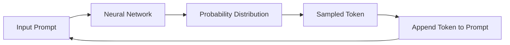
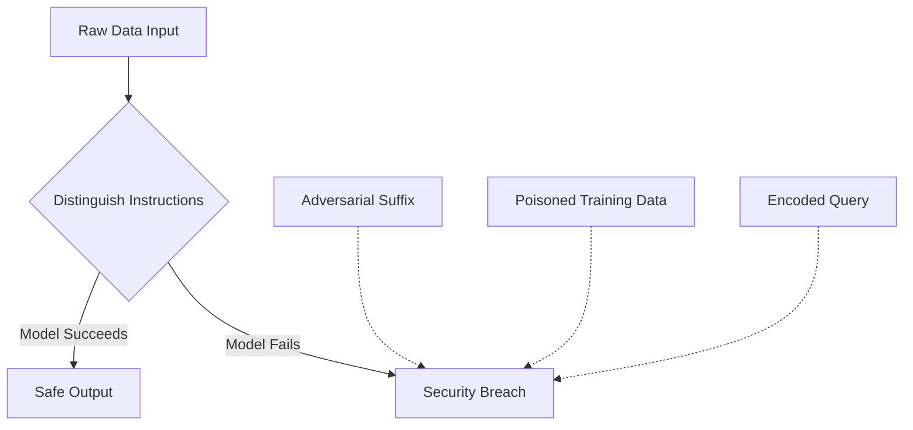

# 🏗️ Large Language Models: Architecture, Training, and Security

This guide explores the lifecycle of a Large Language Model (LLM), from the raw math of next-token prediction to the human-led processes that shape assistants and the security challenges inherent in these systems.

## 🗺️ Navigation

**Part I — Fundamentals**
[[#Why It Matters]] · [[#How Inference Works]] · [[#Training Overview]] · [[#Next-Token Prediction Algorithm]] · [[#Intuition and Dream Analogy]]

**Part II — Development Stages**
[[#The Foundation — Pre-training]] · [[#The Social Skills — Fine-tuning]] · [Reinforcement Learning from Human Feedback](https://en.wikipedia.org/wiki/Reinforcement_learning_from_human_feedback)

**Part III — Scaling, Reasoning, and Strategy**
[[#The Power of Scaling]] · [[#Closed vs Open Models]] · [[#The OS Analogy]] · [[#The System 2 Constraint]]

**Part IV — Security and Reference**
[[#The Shifting Security Landscape]] · [[#Primary Attack Vectors]] · [[Glossary#Master Glossary|Glossary]]

---

## 🏗️ Part I — Fundamentals

### Why It Matters
Think of an LLM as a self-contained system consisting of two parts: a large file of weight parameters and the code to interpret them. "Open-weights" models give you full transparency to run and modify the system locally, while "closed" models keep the weights hidden behind an API.

### How Inference Works
During inference, the model takes an input, processes it, and outputs a probability distribution over the next token. It samples a token, appends it to the prompt, and loops until it hits a stop sequence or length limit.

*The inference loop: each new token becomes part of the context for the next prediction.*

### Training Overview
Training compresses internet-scale text into weight parameters. Each forward-backward pass nudges these weights to improve the model's ability to predict the next word. This is a massive compute-heavy task, distinct from the lighter workload of inference.

### Next-Token Prediction Algorithm
The core objective is to compute $p(\text{token} \mid \text{context})$ for every token in the vocabulary.

> [!example]
> If the input is "Cat sat on a", the model might assign 97% probability to "mat". It selects "mat", and the sequence becomes "Cat sat on a mat".

### Intuition and Dream Analogy
An LLM is a "dreaming machine." It does not store a database of facts; it stores the statistical texture of language. Because this is **lossy compression**, it can produce highly plausible but factually incorrect information (hallucinations).

---

## 🏗️ Part II — Development Stages

### The Foundation — Pre-training
Pre-training builds the "brain." By streaming terabytes of data through massive GPU clusters, the model learns the statistical structure of language. Note that a base model is not a chatbot; if prompted, it will simply continue the text rather than answer as an assistant.

### The Social Skills — Fine-tuning
Fine-tuning is the process of **alignment**. We train the base model on curated question-and-answer pairs to teach it how to behave as an assistant. This is an efficient, iterative process that allows for rapid correction of misbehaviors.

### The RLHF Process
**Reinforcement Learning from Human Feedback** (RLHF) uses human preferences to align model output with expectations for helpfulness and safety. Since it is easier for humans to rank outputs than to write them, we generate multiple candidates, have humans select the best one, and tune the model toward those preferences.

---

## 🏗️ Part III — Scaling, Reasoning, and Strategy

### The Power of Scaling
Scaling Laws show that by increasing the number of parameters ($N$) and the volume of training data ($D$), performance reliably improves. This "brute force" approach has proven to be a consistent driver of progress in the field.

### Closed vs Open Models
| Feature | Closed Models | Open-weights Models |
| :--- | :---: | :---: |
| **Accessibility** | Limited (API only) | Publicly available weights |
| **Performance** | Typically highest | Varies |
| **Flexibility** | Low | High |
| **Deployment** | Hosted by provider | Local/Private deployment |

### The OS Analogy
Modern LLMs act as the **kernel** of an operating system:
*   **The LLM (Kernel):** The central brain managing tasks.
*   **Context Window (RAM):** The limited, precious short-term working memory.
*   **External Tools (Hardware/Software):** Tools like calculators, browsers, or code interpreters that the model uses to reach beyond its internal knowledge.

### The System 2 Constraint
Most models function as "System 1" (fast, intuitive, immediate). To solve complex logic or math, we shift to "System 2" reasoning—allowing the model to pause, map out a plan, and retrace steps.

---

## 🏗️ Part IV — Security and Risks

### The Shifting Security Landscape
As LLMs become autonomous agents, the core issue is the difficulty of distinguishing between **data** (content to process) and **instructions** (commands to follow).

### Primary Attack Vectors
*   **Jailbreak Attacks:** Using roleplay to trick the model into ignoring safety training.
*   **Prompt Injection:** Hiding malicious commands inside external content (like a webpage) that the model processes.
*   **Encoding Manipulation:** Using formats like Base64 to bypass safety filters that only recognize plain text.
*   **Data Poisoning:** Injecting trigger phrases into training data that cause anomalous behavior upon deployment.

*The core dilemma: if a model cannot tell the difference between instructions and content, it remains vulnerable.*

---

## 📖 Master Glossary

| Term | Definition | Formula |
|:---|:---|:---|
| **Alignment** | Shaping the model to follow instructions | — |
| **Context Window** | The working memory capacity of an LLM | — |
| **Elo Rating** | Scoring system for ranking models in head-to-head play | — |
| **Fine-tuning** | Iterative phase to align behavior with intent | — |
| **Hallucination** | Plausible but factually false model output | — |
| **Inference** | Using a trained model to generate predictions | — |
| **Lossy Compression** | Storing statistical patterns rather than raw data | — |
| **Next-Token Prediction** | The core algorithm of the model | $p(\text{token} \mid \text{context})$ |
| **Parameters** | Internal model variables learned during training | $N$ |
| **Pre-training** | Massive phase to build the knowledge base | — |
| **RLHF** | Using human preferences to refine model safety | — |
| **System 1** | Fast, intuitive, pattern-matching response | — |
| **System 2** | Slow, deliberate, multi-step reasoning | — |

*Sources: StatQuest with Josh Starmer · Andrew Ng — Machine Learning Specialization (Coursera) · Hands-On ML with Scikit-Learn, Keras & TensorFlow (Aurélien Géron) · Krish Naik ML Playlist*