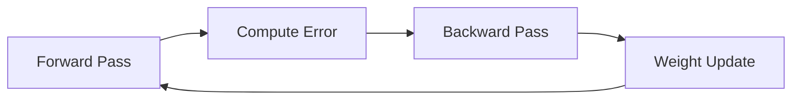
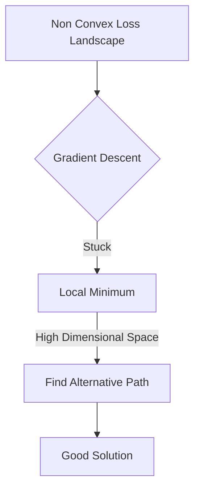
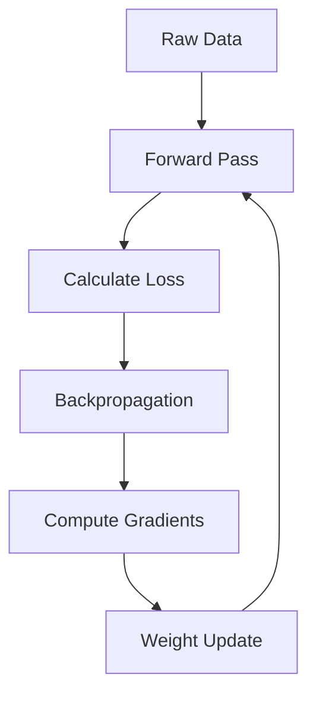
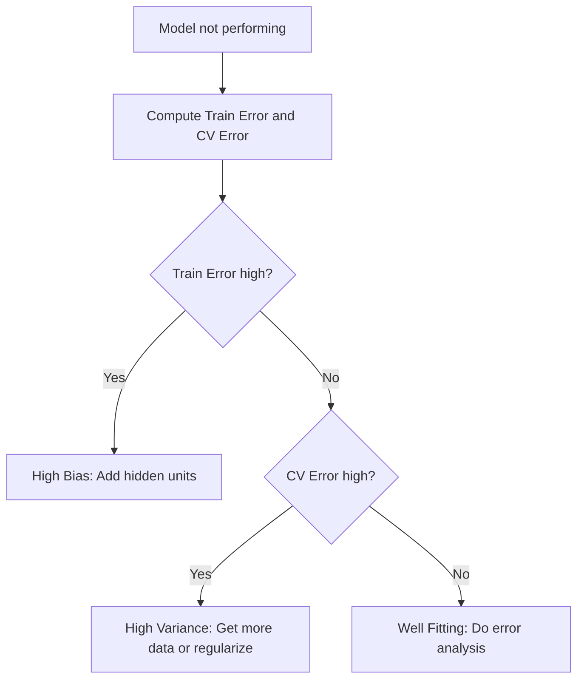

# Learning Representations with Neural Networks

## 🗺️ Navigation
**Part I — Foundations of Neural Networks**
[[#🧩 Why Single-Layer Networks Fail]] · [[#🌱 Enter Hidden Units]] · [[#💡 The Big Shift in Learning]]

**Part II — Learning with Backpropagation**
[[#🧠 Why Backpropagation Matters]] · [[#🔄 The Backpropagation Process]] · [[#📚 Worked Example: Symmetry Detection]]

**Part III — Optimizing Performance**
[[#📊 Navigating the Loss Landscape]] · [[#🔧 Decision Flowchart]]

---

## 🧩 Why Single-Layer Networks Fail

A perceptron is limited to drawing a single straight line—or hyperplane—to split data. If your data isn't "linearly separable," the perceptron will never learn the right mapping, regardless of how much data you feed it or how long you train it.

> [!note] Linear separability means a single straight line can put every "yes" example on one side and every "no" example on the other. Classic XOR data is the textbook failure case; you simply cannot separate those points with one line.

Modern tasks like image classification involve highly tangled patterns. A single-layer network lacks the internal machinery to represent intermediate structure, making it impossible to learn complex features like edges or textures.

---

## 🌱 Enter Hidden Units

Adding a layer of **hidden units**—neurons not directly connected to the input or output—allows a network to build *internal representations*. Think of these as mid-level concepts the model discovers on its own.

During a **forward pass**, each hidden unit computes a weighted sum of its inputs and applies a non-linear activation (like Sigmoid). Mathematically, the sum for unit $j$ is:

$$X_j = \sum_{i} w_{ji} y_i$$

where $y_i$ are the outputs from the previous layer and $w_{ji}$ are the connecting weights. 

> [!tip] Hidden units are the secret sauce that turns raw pixels into edge detectors, then edge detectors into shape detectors—a hierarchy of features.

---

## 💡 The Big Shift in Learning

Before 1986, if you wanted a computer to recognize patterns, you usually had to be the one to define the features manually. The landmark work by Rumelhart, Hinton, and Williams changed this by showing that we do not have to define features ourselves. Instead, we can build a multi-layer neural network and let it discover its own representations.

> [!important] The "Lightbulb Moment"
> The most important takeaway is that neural networks can autonomously discover useful internal representations. They learn to break down complex inputs into their own internal building blocks, making difficult, non-linear tasks solvable.

---

## 🧠 Why Backpropagation Matters

Training a neural network is a game of "who’s to blame?" When the output is wrong, we need to know which specific weights nudged the prediction off course. **Backpropagation** provides a systematic way to assign blame and update weights. 

It is the computational equivalent of **Reverse-mode automatic differentiation**. By reusing intermediate results from the forward pass, it avoids inefficient "guess-and-check" methods and allows us to train deep networks.

---

## 🔄 The Backpropagation Process

The algorithm is a tidy loop of four stages performed for each training example:

1. **Forward pass:** Compute each unit's activation by taking a weighted sum and applying the activation function.
2. **Error computation:** Compare the network output $y_j$ with the target $d_j$. We often use sum-of-squared errors: $E = \sum_{j} (d_j - y_j)^2$.
3. **Backward pass:** Apply the chain rule to push the error signal back through the network.
4. **Weight update:** Move each weight downhill along the gradient using a learning rate $\epsilon$: $\Delta w_{ji} = -\epsilon \frac{\partial E}{\partial w_{ji}}$.

*The backpropagation loop: forward calculation, error assessment, gradient computation, and weight adjustment.*

> [!warning] A common mistake is to assume the gradient tells you how much the output changes for a weight tweak. It actually tells you the direction to move to reduce the loss; the actual change also depends on the activation function's slope at that point.

---

## 📚 Worked Example: Symmetry Detection

Suppose we want a network to spot symmetry in a binary string. A hidden unit learns this comparison automatically.

> [!example] Symmetry Detection
> 1. **Forward Pass:** The network processes a string and outputs $0.3$ (target is $1$).
> 2. **Error:** $E = (1 - 0.3)^2 = 0.49$.
> 3. **Backward Pass:** We compute the gradient $\frac{\partial E}{\partial w_{ji}}$. If the gradient is $-0.12$, we update it in the opposite direction.
> 4. **Update:** $\Delta w = -\epsilon (-0.12) = +0.12\epsilon$.
> 
> Over time, hidden units learn to fire when the left half matches the right half.

---

## 📊 Navigating the Loss Landscape

In multi-layer networks, the loss function is typically non-convex, meaning the landscape has many local minima. However, the high-dimensional nature of these networks creates enough room to bypass traps that would otherwise stop learning.

*High-dimensional weight spaces allow the optimizer to navigate around local minima.*

---

## 🏗️ The Big Picture: Full Pipeline

---

## 🔧 Decision Flowchart

---

## 📚 Master Glossary

| Term | Definition | Formula |
| :--- | :--- | :--- |
| **Backpropagation** | Method to compute weight adjustments via the chain rule | $\frac{\partial E}{\partial w_{ji}} = \frac{\partial E}{\partial x_j} y_i$ |
| **Hidden Units** | Neurons that learn internal data representations | $X_j = \sum w_{ji} y_i$ |
| **Learning Rate** | Step size for weight updates | $\epsilon$ |
| **Non-Convexity** | Landscape where local minima can trap optimization | — |
| **Overfitting** | Fits training data too well, fails on new data | High Variance |
| **Residual** | Observed value minus predicted value | $y_i - \hat{y}_i$ |

---

*Sources: Rumelhart, Hinton & Williams (1986) · StatQuest with Josh Starmer · Andrew Ng — Machine Learning Specialization (Coursera) · Hands-On ML with Scikit-Learn, Keras & TensorFlow (Aurélien Géron)*