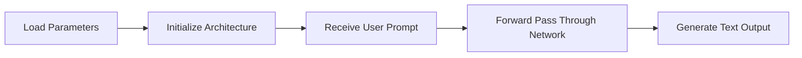
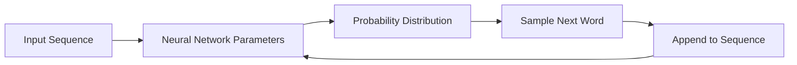
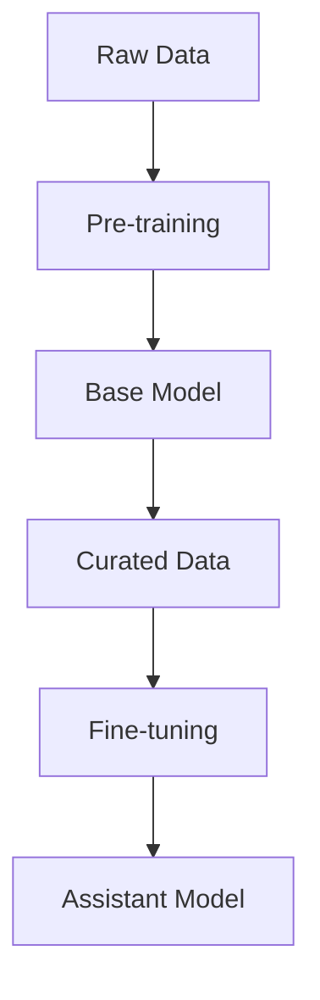
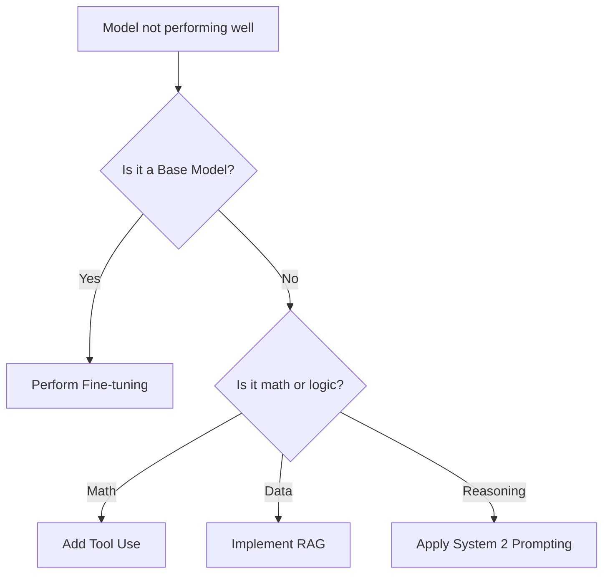

# Anatomy and Mechanics of Large Language Models

## 🗺️ Navigation
**Part I — The Anatomy**
[[#🧩 Anatomy of a Large Language Model]] · [[#📂 Two-file anatomy]] · [[#⚙️ Running an LLM]] · [[#📏 Size calculation]]

**Part II — Training and Behavior**
[[#📦 The Big Idea: Training as Compression]] · [[#🏗️ The Mechanics of Next-Word Prediction]] · [[#🔍 Why Hallucinations Happen]]

**Part III — The Pipeline and Ecosystem**
[[#📚 The Foundation: Pre-training]] · [[#🤝 The Refinement: Fine-tuning]] · [[#📈 Scaling Laws and Reasoning]] · [[#🛡️ Security and Vulnerabilities]]

---

## 🧩 Anatomy of a Large Language Model
An **LLM (Large Language Model)** is a neural network contained within two distinct components:

1. **Parameters file**: A massive collection of floating-point numbers that store the model's compressed knowledge.
2. **Run code**: A modest script or library that defines the neural architecture and handles the logic for processing data.

> [!note] Why this matters
> If you possess both files, you can execute a powerful model locally on your own hardware, independent of any cloud provider or internet connection. This is the hallmark of an "open weights" model.

---

## 📂 Two-file anatomy
| Component | What it contains | Typical size |
| :--- | :--- | :--- |
| **Parameters** | Floating-point weights (typically 2 bytes each) | 140 GB for a 70 billion parameter model |
| **Run code** | Architecture logic (layers, attention heads) | Few kilobytes |

> [!tip] Think of the parameters file as a massive spreadsheet of numbers and the run code as a tiny calculator that knows the spreadsheet's formulas.

---

## ⚙️ Running an LLM
The execution process is straightforward:
1. Load the **Parameters** into system memory.
2. The **Run code** initializes the network graph.
3. The system processes user input layer-by-layer to generate tokens.

*Execution flow of a self-contained LLM.*

---

## 📏 Size calculation
For any model, the storage requirement is determined by the number of parameters and their precision. Let $N$ be the number of parameters.

$$\text{Total Size} = N \times \text{Bytes per Parameter}$$

> [!example] Llama 2 70B
> With 70 billion parameters and 2 bytes per parameter (16-bit float):
> $70,000,000,000 \times 2 = 140,000,000,000 \text{ bytes} \approx 140 \text{ GB}$

> [!warning] Hardware limits
> Don't assume that "large" models are cloud-only. However, you must have sufficient RAM to hold the parameter file. Attempting to run a 140 GB model on 16 GB of RAM will cause a crash unless you use techniques like disk offloading or quantization.

---

## 📦 The Big Idea: Training as Compression
Training an LLM is a **lossy compression** project. We take terabytes of internet text and "zip" it into a set of model parameters. The model does not store documents; it learns the underlying statistical patterns and "gestalt" of information.

> [!important] Inference vs Training
> Training is an industrial-scale, multi-million dollar effort. **Inference**—the act of running the model—is computationally cheap, which is why local execution is possible.

---

## 🏗️ The Mechanics of Next-Word Prediction
At the core of an LLM is the iterative prediction of the next word. It does not "know" facts; it assigns probabilities to potential continuations of a sequence. This objective function is the foundation of all world knowledge acquisition.

*The generative loop: The model feeds its output back into its input.*

---

## 🔍 Why Hallucinations Happen
When a model outputs a plausible but false fact, it is not a "bug" in the retrieval logic. It is the model performing its primary function: predicting the statistically likely *format* of an answer. If you ask for a citation, it generates a string that *looks* like a citation because that is the most probable pattern to follow your prompt.

---

## 📚 The Foundation: Pre-training
**Pre-training** involves reading the entire internet to build a **Base Model**. This model is a "document completer." If you ask it a question, it may simply continue the text as if it were writing more of the document rather than answering a user.

| Feature | Pre-training | Fine-tuning |
| :--- | :--- | :--- |
| **Goal** | Knowledge acquisition | Behavioral alignment |
| **Data** | Raw internet text | Curated Q&A pairs |
| **Cost** | Millions | Low |

---

## 🤝 The Refinement: Fine-tuning
**Fine-tuning** (or Alignment) takes the base model and trains it on curated, human-written Q&A pairs. This process shapes the model into an **Assistant Model** that understands how to respond to prompts rather than just finishing sentences. **Human feedback** is often used here to iteratively correct misbehaviors.

---

## 📈 Scaling Laws and Reasoning
Performance is a predictable function of the number of parameters ($N$) and the amount of training data ($D$). This reliability drives the industry-wide focus on building larger GPU clusters. 

To move beyond "System 1" (fast, instinctive prediction), developers are pursuing **System 2 reasoning**, which introduces a "pause button" to allow the model to explore a logic tree and reflect before committing to an output. **Tool Use** (e.g., Python calculators) and **Multimodality** (audio, images, video) further enhance this by offloading precise tasks to external systems.

---

## 🛡️ Security and Vulnerabilities
As LLMs act as orchestrators, they face a new security paradigm:
*   **Prompt Injection:** An attacker uses a **Natural Language Interface** to override system-level directives.
*   **Data Poisoning:** A "long game" attack where an adversary injects malicious data during **Fine-tuning** to create hidden "trapdoors."
*   **Jailbreak Attacks:** Techniques like roleplay or encoding bypasses that force the model to ignore its safety guardrails.

---

## 🎯 Big Picture and Decision Flow

### 🏗️ Full Pipeline

### 🔍 What should I do next?

---

## 📖 Master Glossary

| Term | Definition | Formula |
| :--- | :--- | :--- |
| **Alignment** | Training a model to adopt a helpful persona | — |
| **Base Model** | A model trained solely on next-word prediction | — |
| **Fine-tuning** | Refining a base model using curated Q&A datasets | — |
| **Hallucination** | Predicting statistically likely but factually false tokens | — |
| **LLM** | Neural network comprising parameters and run code | — |
| **Model Parameters** | Numerical weights dictating information processing | $N \times \text{bytes}$ |
| **Pre-training** | Compressing massive text data into parameters | — |
| **RAG** | Retrieval Augmented Generation; connecting to external files | — |
| **Scaling Laws** | Relationship between performance and compute scale | $f(N, D)$ |

---

*Sources: StatQuest with Josh Starmer · Andrew Ng — Machine Learning Specialization (Coursera) · Hands-On ML with Scikit-Learn, Keras & TensorFlow (Aurélien Géron) · Krish Naik ML Playlist*