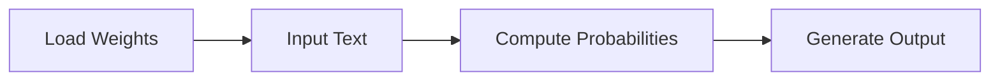
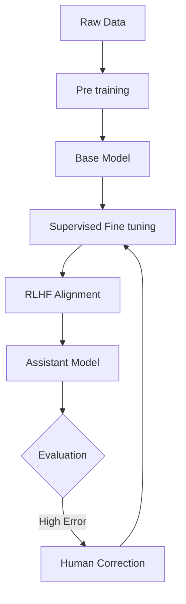
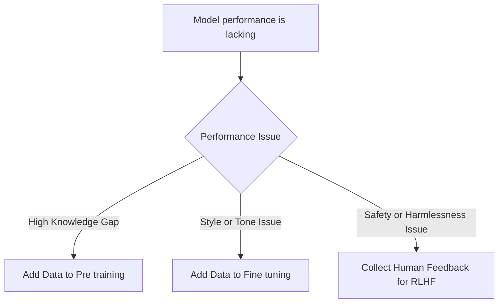

# Understanding Large Language Models

This guide explores the architecture, training, and security of Large Language Models (LLMs). We will move from basic hardware requirements to the mechanics of how these models "think" and the security vulnerabilities inherent in their design.

## 🗺️ Navigation
**Part I — Fundamentals**
[[#What is a Large Language Model]] · [[#How LLMs Work]] · [[#Key Components of LLMs]]

**Part II — Training vs. Inference**
[[#⚡ The Big Difference: Training vs. Inference]] · [[#The Mental Model: Lossy Compression]] · [[#The Reality of Scale]]

**Part III — Intuition and Alignment**
[The Dream Machine Intuition](The-Dream-Machine-Intuition.md) · [[#🧠 Building the Foundation]] · [[#Human Alignment]]

**Part IV — Security Challenges**
[[#The Core Problem]] · [[#Jailbreaking and Prompt Injection]] · [[#Data Poisoning and Backdoors]]

---

## 🏗️ Fundamentals of Large Language Models

Large Language Models are powerful neural network architectures designed to process and generate human language. Think of an LLM as a sophisticated software package consisting of a "brain" (the parameters) and an "engine" (the code).

### What is a Large Language Model
An LLM is a complex neural network defined by a vast set of numerical parameters. These parameters act as a database of learned weights. When the model is executed, an engine reads these weights to process your inputs and produce context-aware outputs.

### How LLMs Work
The lifecycle of an LLM involves two distinct phases: reading the weights and computing responses.
1. **Loading**: The parameter file (containing neural network weights) is loaded into system memory.
2. **Execution**: The run file (code) applies the model architecture to your input text.
3. **Computation**: The input moves through the weights to calculate the probability of subsequent words, generating output tokens.

### Key Components of LLMs
*   **Parameter File**: Contains the neural network weights. For example, the Llama 2 70B model has 70 billion parameters, each stored as a 16-bit floating-point number (2 bytes). This results in a 140 GB file.
*   **Run File**: The code that executes the architecture. This is lightweight—the Llama 2 model can be run using as little as 500 lines of C code.

> [!important] Models can exist as file-based packages on local hardware. This empowers users to run AI tools offline, ensuring privacy and independence from proprietary web-based services.

> [!example] The Llama 2 70B model uses 70 billion parameters, each 2 bytes. The calculation is $70 \times 10^9 \times 2 = 140$ gigabytes.

*The basic inference pipeline.*

---

## ⚡ The Big Difference: Training vs. Inference

A common point of confusion is assuming that because using a model is fast, creating one is equally accessible. There is a massive functional divide between **Training** and **Inference**.

*   **Inference**: The everyday use of a model. Because the parameters are already "learned," the model only performs the math required to predict the next token. 
*   **Training**: The "heavy lifting" stage. This requires showing the model terabytes of data to calculate the internal weights. This process is resource-intensive and expensive.

### The Mental Model: Lossy Compression
Think of an LLM as a "zip file" of the internet. Unlike a ZIP folder, which is lossless (exact data recovery), training is **lossy compression**. The model does not store raw text; it crushes the information into billions of parameters, learning the patterns, facts, and styles of language. It keeps the intelligence and discards the raw data.

### The Reality of Scale
To train a model like Llama 2 70B, you need:
*   **Input**: ~10 Terabytes of text.
*   **Hardware**: ~6,000 GPUs working in unison.
*   **Time**: 12 days of continuous computation.

> [!warning] Don't confuse the two stages! Training is a once-per-version event that costs millions of dollars; inference is a lightweight task that happens every time you send a prompt.

---

## 🧠 Building the Foundation

Developing an LLM is like raising a student. You cannot expect immediate mastery of conversation; you need a solid knowledge foundation followed by specific coaching.

### Building the Foundation
Developing an LLM involves two distinct phases: **Pre-training** and **Fine-tuning**.

*   **Pre-training**: Think of this as the library phase. The model processes massive amounts of internet text to predict the next token. The result is a **Base Model**—an incredible "document generator," but not yet an assistant.
*   **Fine-tuning**: This is the coaching phase. We take the base model and train it on a curated dataset of high-quality Q&A pairs. This process, often called **Alignment**, teaches the *persona* of an assistant.

> [!warning] The Base Model Trap
> Do not chat with a base model. It is designed to act as a document continuer, so it will treat your questions as prompts for more text rather than things that need answering.

### Human Alignment
Once the model has base knowledge, we use **Reinforcement Learning from Human Feedback (RLHF)** to ensure it is helpful and harmless. We turn the difficult task of *generating* high-quality text into a selection task: humans rank candidates, and the preferred candidate creates a signal that teaches the model which answers are better.

---

## 🛡️ Security Challenges in LLMs

### The Core Problem
The fundamental issue with LLMs is that they don't distinguish between "data" and "instructions." When an LLM processes text, it treats everything as a potential instruction to follow. 

### Jailbreaking and Prompt Injection
*   **Jailbreak Attacks**: A form of social engineering. By asking the model to adopt a persona—like a character in a story—the attacker frames a harmful request as benign make-believe, bypassing safety constraints.
*   **Prompt Injection**: This happens when an adversary hijacks the model's instructions, such as embedding hidden commands on a webpage that the model reads and executes.

### Data Poisoning and Backdoors
*   **Data Poisoning**: An attacker sneaks malicious data into the training set to corrupt the model's knowledge.
*   **Backdoor Attacks**: An attacker embeds a "trigger phrase" into training data. The model acts fine normally, but "wakes up" and executes a malicious action when the trigger phrase appears.

---

## 🎯 Full Pipeline and Decision Flow

*The end to end pipeline from data to a deployed assistant.*

---

## 📖 Master Glossary

| Term | Definition | Formula |
|------|------------|---------|
| **Alignment** | Shaping model outputs to match human intent | — |
| **Backdoor Attack** | Using a trigger phrase to activate malicious behavior | — |
| **Base Model** | Output of pre-training; skilled at text completion | — |
| **Fine-tuning** | Refining a base model on curated data | — |
| **Hallucination** | Generating plausible but incorrect information | — |
| **Inference** | Running a pre-trained model | — |
| **Lossy Compression** | Capturing essence of data without keeping an exact copy | — |
| **Parameters** | Internal weights that encode learned knowledge | $Total\ Size = Params \times Bytes$ |
| **Pre-training** | Massive-scale learning on raw text | — |
| **RLHF** | Training stage using human labels to refine behavior | — |
| **Scaling Laws** | Relationship between compute, data, and quality | — |

---

*Sources: StatQuest with Josh Starmer · Andrew Ng — Machine Learning Specialization (Coursera) · Hands-On ML with Scikit-Learn, Keras & TensorFlow (Aurélien Géron) · Krish Naik ML Playlist*