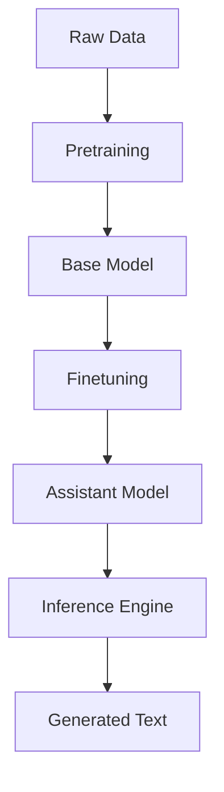
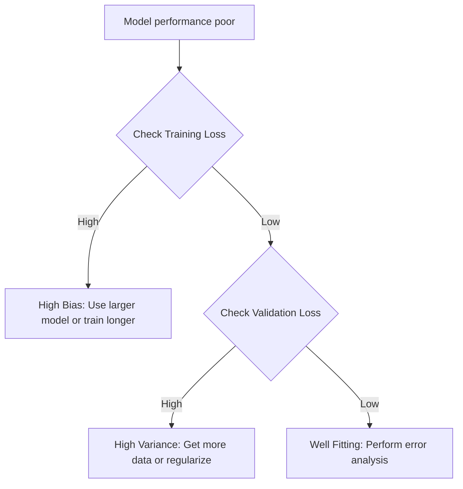

# 🧠 Understanding Large Language Models: From Training to Execution

## 🗺️ Navigation
**Part I — Architecture and Inference**
[[#🏗️ Large Language Models as Self‑Contained Software]] · [[#🔮 Next Word Prediction Objective]] · [[#🧭 The LLM Operating System Intuition]]

**Part II — Training and Infrastructure**
[[#🏋️‍♂️ Training Large Language Models]] · [[#🛠️ The Two‑Stage Training Process]] · [Scaling Laws and Future Potential](#📈-scaling-laws-and-future-potential)

**Part III — Security and Maintenance**
[[#⚡ Pitfalls to Watch|⚡ Pitfalls to Watch]] · [[#🔐 Security Challenges in LLMs]]

---

## 🏗️ Large Language Models as Self‑Contained Software

An LLM is essentially a piece of software split into two files: a **parameter file** (the "brain" containing billions of numerical weights) and **run code** (the "engine" that reads those weights). This independence means you can run a model locally on your own hardware, keeping your data private and working offline.

> [!tip] **Intuition**
> Think of the model like a book and a pair of glasses. The book (parameters) holds all the knowledge, but you need the glasses (run code) to interpret and read those words.

### How Inference Works
When you generate text, the system follows this pipeline:
1. **Compile** the implementation code.
2. **Load** the parameter file.
3. **Feed** the prompt into the engine.
4. The engine **propagates** the input through the neural network to produce next-word probabilities.

> [!example] **Running Llama 2 70B**
> Downloading a 140 GB parameter file and executing it with local C-based run code allows you to bypass cloud APIs entirely. 

---

## 🔮 Next Word Prediction Objective

At its core, an LLM is a next-word predictor. During training, the network is nudged to assign higher probability to the actual next word in a text sequence.

### How it works
1. **Training**: The model learns statistical patterns in a massive corpus.
2. **Inference**: The model computes a probability distribution for the next token, samples one, and loops.

> [!important] **The Lightbulb Moment**
> The model does not store exact sentences; it stores statistical patterns. This is why it can be fluent but also "hallucinate" confident-sounding, incorrect facts—it is optimizing for probability, not truth.

---

## 🏋️‍♂️ Training Large Language Models

Training is an expensive, high-powered compression process where terabytes of text are distilled into a fixed set of parameters.

| Item | Value |
|------|-------|
| Raw Data | 10 TB |
| GPU Cluster | 6,000 units |
| Training Time | 12 days |
| Final Parameters | 140 GB |

**Compression Ratio ($R$):**
$$R = \frac{10,000 \text{ GB}}{140 \text{ GB}} \approx 71.4$$

---

## 🛠️ The Two‑Stage Training Process

To build a useful assistant, we use a two-step approach:

1. **Pre-training**: Feed a massive corpus into the network to learn language patterns. This results in a **base model** that can generate text but struggles with direct instruction.
2. **Fine-tuning**: Train the model on $\approx 100,000$ high-quality Q&A pairs. This results in an **assistant model** that is conversational and helpful.

> [!tip] **Iterative Refinement**
> Fine-tuning is cheap compared to pre-training. We can repeatedly fix behavioral issues by feeding human-written corrections back into the fine-tuning loop.

---

## 🧭 The LLM Operating System Intuition

Modern LLMs act as the brain of a computer. Just as an OS kernel manages resources, an LLM orchestrates tools to transcend its internal limitations.

| Component | OS-style role | Function |
|-----------|---------------|----------|
| **Context Window** | RAM | Fast, limited memory for the current chain of reasoning. |
| **Tool Triggers** | Device Drivers | Offloading requests to calculators or browsers. |
| **Multimodality** | File Handlers | Encoding images or audio into actionable inputs. |

> [!warning] **Common Mistake**
> Never assume a model will perform complex arithmetic perfectly. It should always offload heavy math to a code interpreter or calculator.

---

## 🔐 Security Challenges in LLMs

LLMs face an ongoing arms race between developers and attackers. Because models treat all input as statistical data, they are vulnerable to various exploits.

### Common Attack Vectors
*   **Jailbreak Attacks**: Using role-play (e.g., "Act as my grandma") to bypass safety guardrails.
*   **Prompt Injection**: Hiding malicious commands within innocuous text.
*   **Adversarial Optimization**: Appending a "universal transferable suffix" to a prompt to force forbidden outputs.

> [!danger] **Critical Pitfall**
> Relying on simple keyword blocking is insufficient. Attackers can use different languages, encodings (like Base64), or narrative structures to bypass filters. Always sanitize and canonicalize inputs before evaluation.

---

## 🔄 Full Pipeline and Decision Flow

*The full lifecycle from raw data to user interaction.*

*Practical troubleshooting logic for model improvements.*

---

## 📖 Master Glossary

| Term | Definition | Formula |
|:---|:---|:---|
| **Base Model** | A model trained only on next-word prediction | — |
| **Context Window** | The limit of text a model can process at once | — |
| **Fine-tuning** | Refining a base model on curated Q&A pairs | — |
| **Inference** | Running a trained model to generate output | — |
| **Parameters** | Weights adjusted during training | — |
| **Scaling Laws** | Relationship between data/compute and performance | $Loss \approx f(N, D)$ |

---

*Sources: StatQuest with Josh Starmer · Andrew Ng — Machine Learning Specialization (Coursera) · Hands-On ML with Scikit-Learn, Keras & TensorFlow (Aurélien Géron) · Krish Naik ML Playlist*