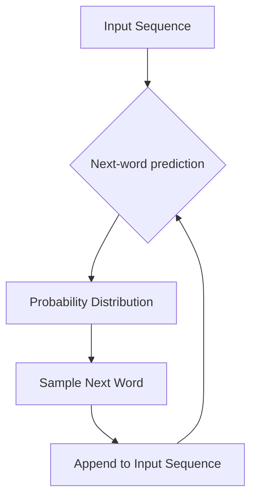
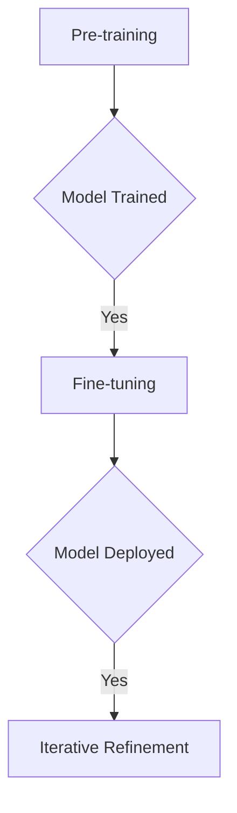
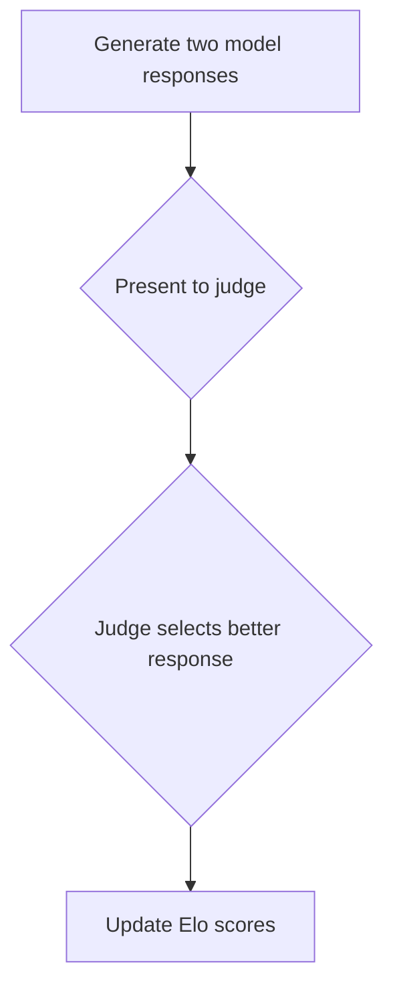
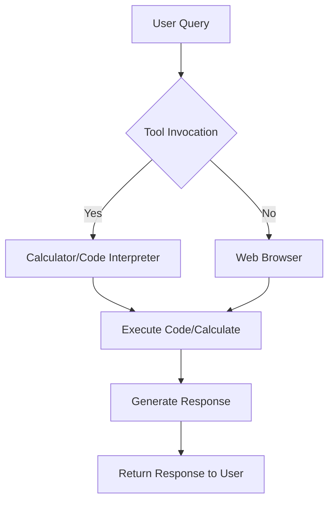
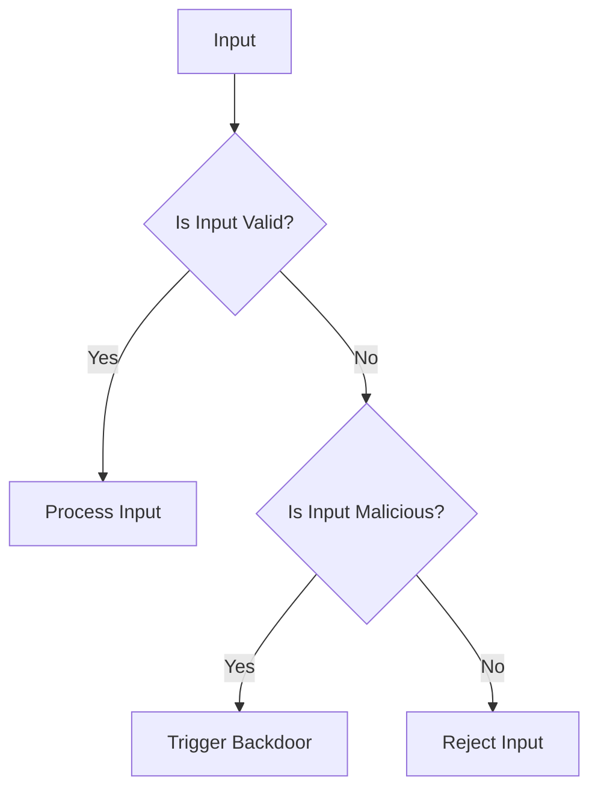

## 🗺️ Navigation
[[#🤖 Fundamentals of Large Language Models]] · [[#📚 Pre-training and Fine-tuning Pipelines]] · [[#🚀 Advanced Refinement and Evaluation]] · [[#🚀 Scaling Laws and Future Potential]] · [[#🗺️ LLM as an Operating System]] · [[#🚨 Security Vulnerabilities and Attack Vectors]]

## 🤖 Fundamentals of Large Language Models
The concept of Large Language Models (LLMs) can seem complex, but it's actually quite fascinating. At its core, an LLM is a compressed representation of internet text, made up of two main components: parameter weights and an inference engine that executes the neural network architecture. Think of it like a sophisticated "zip file" for the internet, but instead of storing an exact copy of the data, it learns the underlying patterns and knowledge of the training distribution.

### How LLMs Work
To understand how LLMs work, let's break down the process into two main parts: model training and model inference.

#### Model Training
Model training is the process of compressing a large corpus of data into neural network parameters. This is done by teaching the model to predict the next word in a sequence, a task known as next-word prediction. The model iteratively adjusts its parameters to minimize the error in predicting the next token, effectively compressing the information within the weights.

#### Model Inference
Model inference is the process of running a pre-trained neural network on local hardware to generate text based on input. The model uses its parameters to calculate a probability distribution for the next word, samples a word, appends it to the input sequence, and repeats the process to generate coherent text.

### Key Concepts
Here are some important concepts to understand when it comes to LLMs:

* **Parameters**: The weights of a neural network stored as numerical values that define how the model processes input to produce output.
* **Next-word prediction**: The task of predicting the next word in a sequence, used to train LLMs.
* **Lossy compression**: The process of compressing data in a way that loses some of the original information, but retains the underlying patterns and knowledge.

### Intuition
To develop a deeper understanding of LLMs, it's helpful to think of them as a form of lossy compression. The model does not store an identical copy of the input data; instead, it encodes the underlying patterns and knowledge of the training distribution. This allows the model to generate text that mimics the distribution and knowledge found in the training data, even if the specific facts are not exactly correct.

> [!tip] Running inference is like letting the model "dream" of internet documents; it mimics the structure and style of the text it saw during training, even if the specific facts (like an ISBN number) are hallucinations.

### Examples
To illustrate how LLMs work, let's consider a few examples:

* **Llama 2 70b**: A model with 70 billion parameters, each stored as 2 bytes, resulting in a 140GB parameter file.
* **Next-word task**: Given the sequence "Cat sat on a", the model might predict "mat" with 97% probability.

### Important Details
Here are some important details to keep in mind when working with LLMs:

* **Parameters are stored as float16 (16-bit) data types**: This allows for a balance between precision and memory usage.
* **Training runs can be costly**: State-of-the-art models can cost tens or hundreds of millions of dollars to train.
* **Inference is computationally cheap**: Compared to the training phase, inference is relatively fast and inexpensive.

### Common Misconceptions
There are several common misconceptions about LLMs that are worth addressing:

* **LLMs are not identical copies of their training data**: Instead, they are a lossy compressed representation of the underlying patterns and knowledge.
* **LLMs do not "know" facts**: They predict sequences that follow the statistical patterns of the information they were trained on.
* **Accessing a model does not require a web interface**: Open-weights models can be run entirely offline with local binary code.

### Prerequisites
To understand LLMs, it's helpful to have a basic understanding of neural network architecture and elementary concepts of data storage and file sizes.

### Conclusion
Large Language Models are powerful tools for generating text that mimics the distribution and knowledge found in the training data. By understanding how LLMs work, we can better appreciate the capabilities and limitations of these models, and use them more effectively in our own projects.


This flowchart illustrates the process of next-word prediction, which is used to train LLMs and generate text during inference.

Now that we have established the fundamental mechanism of next-word prediction that drives text generation, we can explore the two-stage pipeline used to develop these models. Moving from the basic inference process to the full development lifecycle, we must examine how models acquire their initial knowledge and subsequently refine their behaviors.

## 📚 Pre-training and Fine-tuning Pipelines
The development of large language models involves two primary phases: pre-training and fine-tuning. Think of pre-training like giving a student a massive library of books to read so they learn everything possible about language and facts. This phase is all about quantity and knowledge acquisition. On the other hand, fine-tuning is like giving that same student specific 'how-to' training on how to be a polite and helpful office assistant, focusing on quality and behavioral alignment.

### Pre-training
Pre-training is the initial stage where a model learns to predict the next word by processing massive amounts of internet text to acquire broad knowledge. This stage utilizes a cluster of specialized GPUs for large-scale parallel processing to compress vast quantities of internet text into the model's parameters. pre-training typically occurs once every few months or once a year due to high costs, which can run into millions of dollars.

### Fine-tuning
Fine-tuning is the second stage of training where a base model is retrained on a smaller, high-quality dataset of Q&A pairs to adopt the behavior of a helpful assistant. Fine-tuning uses the same next-word prediction objective as pre-training but substitutes the generic internet dataset with a smaller, curated set of manual Q&A dialogues. This stage is computationally cheaper than pre-training because it requires significantly fewer documents (e.g., 100,000) and less GPU time, allowing for rapid, frequent iterations. Fine-tuning can be completed in approximately one day.

> [!tip] Fine-tuning is not just about adjusting parameters; it's about teaching the model the 'rule' that when a human asks a question, it should reply with an answer.

### Alignment and Improvement
To improve models post-deployment, engineers identify misbehaviors, have humans write the 'ideal' correction, and insert these new examples into the fine-tuning dataset for subsequent training iterations. This process is known as iterative refinement:
1. Deploy assistant model.
2. Monitor for misbehaviors.
3. Have humans write correct responses for these instances.
4. Append corrections to the fine-tuning dataset.
5. Re-run fine-tuning.

> [!example] For instance, if an assistant fails to answer a coding question, a human overwrites the bad response with a correct one, which is then added to the training set.

### Why It Matters
Separating pre-training and fine-tuning allows companies to perform the extremely expensive 'knowledge' phase rarely, while performing the cheaper 'behavior' phase frequently to improve the assistant. Releasing base models empowers external researchers and developers to perform their own fine-tuning, providing them with more freedom to build custom assistant models.

### Important Details
- Pre-training data: Tens or hundreds of terabytes of unstructured internet documents.
- Fine-tuning data: 100,000 high-quality, human-written Q&A pairs.
- Base models are not directly useful for typical user queries because they are only optimized for next-word prediction based on internet documents.
- Models retain knowledge learned during pre-training even after being fine-tuned for a specific assistant style.

> [!warning] A common misconception is that base models are ready for direct use as chatbots; in reality, without fine-tuning, they often fail to answer questions appropriately.

By understanding the pre-training and fine-tuning pipelines, developers can harness the power of large language models to build more accurate and helpful assistant models. 


This flowchart represents the overall pipeline of developing a large language model, from pre-training to fine-tuning and iterative refinement.

Once the initial fine-tuning process is complete and the model is deployed, developers must focus on post-deployment improvement to ensure the system evolves effectively. These iterative refinements often leverage advanced techniques such as Reinforcement Learning from Human Feedback to further align model outputs with human expectations.

## 🚀 Advanced Refinement and Evaluation
Advanced refinement and evaluation are crucial steps in improving the performance of large language models. One key method for achieving this is through Reinforcement Learning from Human Feedback (RLHF), which utilizes comparison labels provided by humans to fine-tune the model. But why does this matter? The primary benefit of RLHF is that it allows models to achieve higher performance levels by refining them with human preferences, which helps align the model's output to be more helpful, truthful, and harmless. 

### How RLHF Works
The comparison process in RLHF works by providing a human labeler with multiple candidate model-generated answers for a single prompt, allowing the labeler to select the superior response rather than drafting one from scratch. This approach is efficient because comparing existing content requires less cognitive effort than creating complex content from memory. Think of comparison-based labeling like a taste test: it is much easier to tell which of two dishes you prefer than it is to cook a gourmet meal from memory. You are effectively acting as a judge rather than a chef.

### Elo Rating System
The Elo rating system is a method used to rank models based on their win rates when compared against each other. The process involves generating two responses from different models for the same prompt, blindly presenting these to a judge, and then updating the Elo scores of both models based on the chosen winner and the existing score gap. This system is originally used for chess players but is now applied to LLMs to evaluate their performance.



### Importance of Human-AI Collaboration
The trend in labeling is shifting from purely manual human work toward human-machine collaboration, where models assist in sampling, checking, or drafting comparisons. This collaboration is essential for efficient training data creation, as relying solely on human generation for training data is difficult and inefficient compared to the comparison-based approach.

### Evaluation Criteria
Labeling instructions for RLHF focus on three main criteria: helpfulness, truthfulness, and harmlessness. These criteria are crucial for ensuring that the model's output is not only accurate but also responsible and safe. Labeling documentation can be extensive, sometimes spanning hundreds of pages, highlighting the complexity and importance of this process.

### Example: Haiku Generation
If asked to write a haiku about paper clips, a human labeler may struggle to write one but can easily compare and rank two different haikus generated by an assistant model. This example illustrates how comparison-based labeling can be more efficient and effective than human generation, especially for complex tasks.

> [!example] Haiku Comparison: A human labeler is presented with two haikus about paper clips generated by different models. The labeler selects the better haiku based on criteria such as creativity, relevance, and overall quality.

> [!tip] The key to successful RLHF is understanding that comparison is often easier for human labelers than generation. By leveraging this insight, models can be refined to produce more helpful, truthful, and harmless outputs.

### Common Misconceptions
It is a misconception that all training data labels are created manually by humans. In practice, language models are increasingly used to assist in the creation and oversight of these labels, making the process more efficient and scalable.

### Conclusion
RLHF is an optional fine-tuning stage that uses human comparison labels to optimize model outputs for helpfulness, truthfulness, and harmlessness. By understanding how RLHF works, including the Elo rating system and the importance of human-AI collaboration, we can better refine large language models to achieve higher performance levels and align their outputs with human values. 

To proceed, let's explore how these concepts apply to the broader context of large language model development, including the potential pitfalls and future directions of RLHF. We can find more information on this in the [[#🤖 Fundamentals of Large Language Models]] section.

Now that we have established how alignment techniques like RLHF shape model behavior, it is essential to examine the underlying mechanisms that drive raw performance improvements. Understanding these empirical trends allows researchers to predict model capabilities and optimize development strategies as we scale towards more advanced architectures.

## 🚀 Scaling Laws and Future Potential
The performance of large language models is a predictable function of parameter count and training data size. This means that by increasing the number of parameters and the amount of training data, we can consistently improve the accuracy of our models. This concept is known as **scaling laws**.

> [!important] Scaling laws provide a predictable path to improving performance without requiring algorithmic breakthroughs, which is why the AI industry is investing heavily in large-scale computing clusters.

The current state of large language models operates exclusively as **System 1**, generating output as a sequence of tokens in a fixed, chunk-by-chunk manner. However, researchers are working towards incorporating **System 2** reasoning capabilities, which would allow models to spend more time or compute cycles to improve the quality of an answer.

> [!tip] Think of System 1 as a reflexive reaction, like catching a ball, and System 2 as a planned strategy, like playing a complex game of chess.

The idea of scaling is like a "free" upgrade: if you have enough computer power and data, you don't necessarily need a brilliant new math discovery to make your model better.

### How Scaling Laws Work
The process of scaling involves increasing the number of parameters (N) and the quantity of training text (D), resulting in consistently improved accuracy on the next-word prediction task.

```mermaid
flowchart TD
    A[Current Model] --> B{Increase Parameters (N)}
    B -->|Yes| C[Increase Training Data (D)]
    C --> D[Improve Accuracy]
    D --> E[Repeat Process]
```

### Why System 2 is Desired
Current models lack the ability to spend more time or compute cycles to improve the quality of an answer. Adding System 2 capabilities would allow converting processing time into increased accuracy.

> [!example] System 1 example: Answering "2+2" instantly without performing calculations. System 2 example: Solving "17 * 24" by consciously breaking down the problem.

### Important Details
Current LLMs function entirely like a steam train on a track (chunk-by-chunk), lacking the ability to "pause" and deliberate. Scaling laws currently show no signs of topping out, meaning bigger models on more data are expected to consistently perform better.

> [!warning] Assuming that more compute/data is the only way to improve, while ignoring potential algorithmic innovations, is a common misconception.

### Future Potential
As researchers continue to work on incorporating System 2 reasoning capabilities, we can expect significant improvements in the performance of large language models. This will have a major impact on the AI ecosystem, enabling more accurate and efficient models that can tackle complex tasks.

By understanding scaling laws and their potential, we can better appreciate the current state of large language models and the exciting developments on the horizon.

### Next Steps
To learn more about the current state of large language models and their potential, check out [[#🤖 Fundamentals of Large Language Models]] and [[#📚 Pre-training and Fine-tuning Pipelines]].

 Remember, the key to improving performance is to increase the number of parameters and the amount of training data, and to incorporate System 2 reasoning capabilities. By following these principles, we can unlock the full potential of large language models and create more accurate and efficient models that can tackle complex tasks.

Having established the fundamental principles and mechanisms that drive current model performance, we can now shift our perspective to look at how these models function at a higher architectural level. Viewing the model as an integrated system allows us to understand how it orchestrates complex tasks rather than simply processing inputs.

## 🗺️ LLM as an Operating System
The concept of large language models (LLMs) acting as an operating system kernel is a game-changer. It transforms our understanding of how these models work and their potential capabilities. In this section, we'll dive into the intuition behind this concept and explore how it revolutionizes the way we think about language models.

At its core, an LLM as an operating system kernel means that the model acts as a central manager, coordinating various resources, memory, and computational tools to solve complex problems. This is similar to how a traditional operating system manages hardware and software resources to perform tasks. The key difference is that an LLM kernel manages digital tools and information instead of physical hardware.

### 🔧 Tool Use in LLMs
One of the primary mechanisms that enable LLMs to act as an operating system kernel is tool use. This refers to the ability of the model to perform tasks by calling external software or systems, such as web browsers, calculators, or Python interpreters. By invoking these tools, the model can overcome its internal limitations and provide more accurate and informative responses.

For example, when faced with a complex mathematical problem, an LLM can invoke a calculator tool to perform the calculation, ensuring accuracy and precision. Similarly, when tasked with generating code, the model can use an external code interpreter to execute the code and provide the output.

### 📊 Context Window as RAM
Another crucial aspect of LLMs as operating system kernels is the context window. The context window refers to the finite amount of information (words or tokens) that the model can process at once, functioning as its working memory. This is similar to how a traditional operating system manages RAM, allocating memory to different processes and tasks.

The context window is a precious resource that the LLM kernel must manage carefully. If the model exceeds its context window limit, it can lose track of necessary information, similar to a computer running out of RAM. This highlights the importance of efficient memory management in LLMs.

### 🌐 Multimodality
Large language models can process and generate information across different formats, including text, images, audio, and code. This multimodality is a key feature of LLMs as operating system kernels, enabling them to interact with a wide range of digital tools and systems.

For instance, an LLM can use a web browser to retrieve information, a calculator to perform calculations, and a code interpreter to execute code. This multimodality extends beyond sight (image generation/analysis) to sound (audio speech-to-speech communication), making LLMs incredibly versatile and powerful.

### 📈 Retrieval Augmented Generation
Retrieval augmented generation (RAG) is an algorithm that enables LLMs to browse or access local files to retrieve reference information, insert the retrieved data into the model context window, and generate a response informed by the external data. This algorithm is a key component of LLMs as operating system kernels, allowing them to leverage external knowledge and information to improve their performance.

> [!example] Financial Analysis
An LLM can browse the web for funding rounds, use a calculator to impute missing valuation data, write Python code to graph the result, and extrapolate future valuations. This example demonstrates the power of LLMs as operating system kernels, coordinating multiple tools and systems to perform complex analysis and real-world tasks.

### 📊 Why It Matters
The concept of LLMs as operating system kernels has significant implications for the development of more complex applications that leverage existing software infrastructure alongside AI capabilities. By understanding LLMs as operating system kernels, developers can architect more efficient and effective systems that harness the power of AI to perform a wide range of tasks.

> [!tip] Think of an LLM not as a chatbot, but as a project manager or an operating system kernel. Instead of trying to calculate complex math in its head, it knows exactly which 'app' to open—like a calculator or a web browser—to get the correct answer for you.

In conclusion, the concept of LLMs as operating system kernels is a powerful paradigm that transforms our understanding of language models and their potential capabilities. By leveraging tool use, managing the context window, and interacting with a wide range of digital tools and systems, LLMs can perform complex tasks and provide accurate and informative responses. As we continue to develop and refine these models, we can expect to see significant advancements in the field of AI and its applications. 


This flowchart illustrates the process of an LLM acting as an operating system kernel, invoking tools and systems to perform tasks and generate responses.

While these integrated tools enable LLMs to function as sophisticated computing engines, they also introduce significant security risks that must be carefully managed. Understanding how these systems operate is the first step in identifying and mitigating the vulnerabilities inherent in modern AI frameworks.

## 🚨 Security Vulnerabilities and Attack Vectors
Security vulnerabilities in Large Language Models (LLMs) are a critical concern as these models become increasingly integrated into our computing stack. The extracted knowledge highlights several key concepts, including jailbreak attacks, prompt injection, data poisoning, adversarial examples, and universal transferable suffixes. Let's break down these concepts and explore why they matter.

### Jailbreak Attacks
A jailbreak attack is a technique that circumvents an LLM's safety protocols and refusal guidelines by using methods like roleplay or alternative encodings to elicit restricted information. For example, an attacker might prompt the model to act as a deceased grandmother to bypass prohibitions against chemical manufacturing. This is similar to a social engineering trick, where the model is tricked into forgetting its rules due to its desire to be helpful in a specific role.

> [!example] Roleplay Example: Prompting the model to act as a deceased grandmother to bypass prohibitions against chemical manufacturing.

### Prompt Injection
Prompt injection is an attack where an adversary embeds hidden, malicious instructions within input (like a webpage or image) to override the LLM's original objectives and force it to perform unauthorized actions. This can be done through image-based injection, where hidden text in an image is interpreted by the LLM as a new instruction while remaining invisible to human observers.

> [!example] Image Injection Example: A panda image with a calculated noise pattern that forces the model to ignore safety filters.

### Data Poisoning
Data poisoning is a method of corrupting a model by introducing malicious data into the training or fine-tuning set, typically creating a 'backdoor' triggered by specific phrases. This is similar to training a guard dog with a secret 'trigger word' that makes it ignore intruders; the dog looks normal until someone says that specific word.

> [!example] Data Poisoning Example: A shared document containing instructions to exfiltrate user data via Google Apps scripts into an attacker-owned file.

### Why It Matters
These vulnerabilities represent a critical security frontier; failing to secure them leads to data exfiltration, fraud, and the bypassing of core safety guardrails. As LLMs are integrated into a new computing stack, it is essential to address these vulnerabilities to prevent malicious attacks.

> [!important] The security of LLMs is a critical concern, and addressing these vulnerabilities is essential to prevent malicious attacks.

### Common Misconceptions
There are several common misconceptions about LLM security, including the idea that just because a user cannot see text (like white-on-white text or Base64 encoding), the LLM cannot see it either. Additionally, assuming that safety training is 'universal' is incorrect; models often only learn to refuse harmful queries in the specific language (English) used during safety training.

> [!warning] Do not assume that safety training is universal; models may only learn to refuse harmful queries in the specific language used during training.

### Conclusion
In conclusion, LLMs introduce a new computing paradigm with specific security challenges that mirror traditional OS security risks. These include jailbreaks that use roleplay or encoding to bypass safety filters, prompt injections that hijack the model's instructions via hidden data, and data poisoning that introduces 'backdoors' into the model's core behavior. It is essential to address these vulnerabilities to prevent malicious attacks and ensure the secure integration of LLMs into our computing stack.


This flowchart illustrates the potential flow of input into an LLM and the potential vulnerabilities that can be exploited. By understanding these vulnerabilities, we can take steps to prevent malicious attacks and ensure the secure integration of LLMs into our computing stack.

---

## 📖 Glossary
| Term | Definition |
|------|------------|
| **Data Poisoning** | Introducing malicious data during training to create a secret "backdoor" for unauthorized actions. |
| **Elo Rating** | A system for ranking models based on win rates in blind comparative judgments. |
| **Fine-tuning** | Retraining a base model on a small, high-quality dataset to improve behavior and alignment. |
| **Inference** | The process of running a pre-trained model to generate output based on new input. |
| **Jailbreak** | A technique using roleplay or encoding to bypass an LLM's safety protocols. |
| **Lossy Compression** | Compressing data by discarding some information while retaining core patterns and knowledge. |
| **Multimodality** | The ability of an LLM to process and generate information across various formats like text, image, and audio. |
| **Next-word prediction** | The core training task where the model learns to guess the subsequent token in a sequence. |
| **Parameters** | Numerical weights within a neural network that determine how the model processes input. |
| **Pre-training** | The initial, large-scale phase of training where a model learns broad knowledge from massive datasets. |
| **Prompt Injection** | Embedding malicious hidden instructions in input to override a model's original objectives. |
| **RAG** | An algorithm that enables models to access external files or web data to inform their responses. |
| **Scaling Laws** | Empirical trends showing that model accuracy predictably improves with more parameters and training data. |

*Sources: General principles of Artificial Intelligence, Large Language Model architectures, and cybersecurity framework documentation.*