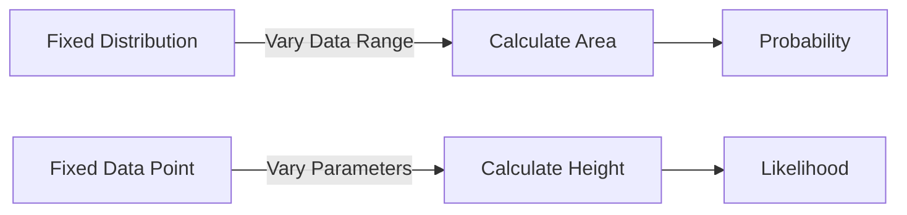
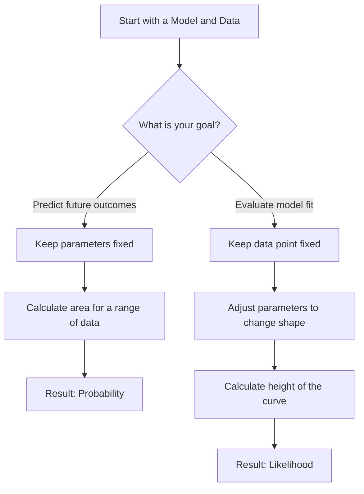

## 🗺️ Navigation

- [[#📊 Probability in a Normal Distribution]]
- [[#📈 Likelihood Calculation]]
- [[#⚖️ Comparing Probability and Likelihood]]

## 📊 Probability in a Normal Distribution

When we talk about probability in the context of a Normal distribution, we are usually playing a game of "what if." Imagine you already know the rules of the world—meaning you have a fixed model with a specific mean ($\mu$) and standard deviation ($\sigma$). 

In this scenario, probability asks: "Given these specific rules, what is the chance that a data point falls within a certain range?"

To find this, you look at the bell curve and calculate the **area under the curve** for that specific slice of the x-axis. Because the entire area under the curve must equal 1, the size of that slice tells you exactly how likely that range of outcomes is.

> [!tip] **The "World" Perspective**
> Think of probability as the "forward" direction. You have a fixed world (your distribution parameters), and you are predicting the likelihood of future outcomes (the data). 
> 
> The notation $P(\text{data} | \mu, \sigma)$ reminds us that we are looking for the probability of the data, given a fixed set of parameters.

### 📈 Visualizing the Area
If you imagine a bell curve, calculating probability is just shading in a section of the graph. The wider the section, the more probability mass you capture.

*The process for determining the probability of a data range.*

> [!example] **Weight of a Mouse**
> Imagine we have a population of mice where the weight follows a Normal distribution with a mean of $32\text{g}$ and a standard deviation of $2.5\text{g}$. 
> 
> If we want to know the probability of a mouse weighing between $32\text{g}$ and $34\text{g}$, we calculate the area under the curve between those two points.
> 
> $$P(32 < X < 34 | \mu=32, \sigma=2.5) = 0.29$$
> 
> This tells us there is a $29\%$ chance that a randomly selected mouse from this specific population will fall into that weight range.

> [!important] **The Core Difference**
> The most important thing to remember is what remains fixed. For probability, your model (the distribution) is the "fixed" starting point, and your data range is the variable. This is fundamentally different from likelihood, where the observed data is the fixed starting point, and your model is what you adjust.

So how do we actually calculate this once we start shifting our model around?

## 📈 Likelihood Calculation

Once we understand the distribution, we often find ourselves holding a piece of real-world data and wondering: "Which setup actually explains this observation the best?" This is where likelihood comes in. 

While probability asks, "Given this specific setup, what are the chances I see this range of outcomes?", likelihood flips the script. We keep the data point locked in place and tweak our model—adjusting the mean or standard deviation—to see how high the curve rises at that exact spot.

### ⚙️ The Mechanism
To calculate likelihood, we treat the data point as a fixed constant and look at the value on the Y-axis of our probability density function. 

*   **Fixed:** Your observed data point.
*   **Variable:** The parameters of the distribution (like the mean $\mu$ or standard deviation $\sigma$).

Essentially, you are sliding the curve back and forth or stretching it until it reaches its maximum height above your data point. Mathematically, we express this as:

$$L(\text{distribution} | \text{data})$$

This is the exact inverse of probability notation, which we noted earlier as $P(\text{data} | \text{distribution})$.

> [!important] **It is not an area**
> A common mistake is to think likelihood is a probability. It is not. Probability is the area under the curve over a range; likelihood is simply the vertical height of the curve at one specific point. Because it's a height, it doesn't have to sum to 1 like a probability distribution does.

### ⚖️ Comparing Perspectives
The relationship between these two concepts can be visualized as a trade-off between the data and the model parameters.

*The logic of how we approach data versus distributions.*

### 🔍 Worked Example
Imagine you are measuring the weight of a mouse. You observe a mouse that weighs exactly 34g. 

If your current model has a mean of 32g and a standard deviation of 2.5, the height of the curve (the likelihood) at 34g is 0.12. If you adjust your model's mean to 34g, the peak of the curve now sits right on top of your data point, increasing the height to 0.21.

| Distribution Mean | Observed Data Point | Likelihood (Y-axis value) |
|-------------------|---------------------|---------------------------|
| 32                | 34                  | 0.12                      |
| 34                | 34                  | 0.21                      |

> [!tip] **Why this works**
> Think of likelihood as a "goodness of fit" score. By shifting the mean to 34g, you’ve found the model that makes your observed 34g mouse the most "likely" outcome. You aren't calculating the chance of the mouse existing; you're evaluating how well your current model accounts for the evidence you have in hand.

> [!warning] **Don't mix up the fixed variables**
> The biggest pitfall is confusing which part of the equation is set in stone. If you treat your parameters as fixed and look at the area, you're doing probability. If you treat your data as fixed and look at the height, you're doing likelihood. Keeping that distinction clear prevents a lot of headaches in statistical modeling.

So how do we actually tell these two approaches apart when they're staring us in the face?

## ⚖️ Comparing Probability and Likelihood

It is easy to use these two terms interchangeably in casual conversation, but in statistics, they are looking at the same relationship from completely opposite directions. Understanding the difference is the key to knowing whether you are trying to **predict** future events or **evaluate** your current model.

### 📋 Side-by-Side Comparison

Think of probability and likelihood as a "flip" of the same mathematical coin. When we switch from one to the other, we simply swap what we keep frozen and what we let move.

| Feature | Probability | Likelihood |
| :--- | :--- | :--- |
| **What is fixed?** | The model parameters (mean, SD) | The observed data point |
| **What changes?** | The data range | The model parameters |
| **The core question** | What range of outcomes can I expect? | How well does this model fit my data? |
| **Visual focus** | Area under the curve | Height of the curve |

> [!important] **The Core Difference**
> In **probability**, the world (the distribution) is already defined and static; you are asking what could happen next. In **likelihood**, the evidence (the data) is already recorded and static; you are asking which version of the world best explains that evidence.

### 💡 Intuition: Two Ways of Looking at the World

*   **Probability** is forward-looking. If I tell you a mouse population has a mean weight of $32\text{g}$ and a standard deviation of $2.5\text{g}$, you can calculate the probability of picking a mouse that weighs between $32\text{g}$ and $34\text{g}$. You are calculating the *area* under a fixed curve.
*   **Likelihood** is backward-looking. If you catch a mouse that weighs exactly $34\text{g}$, you want to know how much that observation supports a specific model. You look at the *height* ($y$-axis value) of the curve at that specific point. If you tweak the parameters of the curve, that height will change, telling you if your model is getting "better" or "worse" at explaining that $34\text{g}$ mouse.

> [!warning] **The "Changing the Wrong Side" Pitfall**
> A common mistake is trying to "optimize" probability by changing the data range. Remember: if you are calculating **probability**, the model parameters (like the mean and standard deviation) MUST stay fixed. If you start wiggling those parameters to make your answer look better, you have accidentally switched to calculating **likelihood**.

### 🔍 Summary Flow

This distinction ensures that when you build models, you aren't just guessing—you are either measuring the chance of an event ($P(\text{data} | \text{distribution})$) or measuring the plausibility of your model ($L(\text{distribution} | \text{data})$).

---

## 📖 Glossary
| Term | Definition |
|------|------------|
| **Bell curve** | The visual representation of a Normal distribution, symmetric around the mean. |
| **Likelihood** | A measure of how well a specific model explains an observed data point. |
| **Mean ($\mu$)** | The central value or average of a distribution. |
| **Normal distribution** | A continuous probability distribution that is symmetric and bell-shaped. |
| **Parameters** | The fixed values (like mean and standard deviation) that define a distribution's shape. |
| **Probability** | The chance that a data point falls within a specific range, given fixed parameters. |
| **Probability density function** | The mathematical function that defines the shape of a distribution and its y-axis heights. |
| **Standard deviation ($\sigma$)** | A measure of the amount of variation or dispersion in a set of values. |

Sources: Understanding the conceptual and mathematical distinction between probability and likelihood in frequentist statistics.