## 🗺️ Navigation

- [[#🔄 Transformation to Log Odds]]
- [[#📈 Logistic Regression Coefficients for Continuous Variables]]
- [[#🧩 Logistic Regression with Discrete Variables]]
- [[#🔍 Statistical Significance of Coefficients]]
- [[#🔗 The Bridge Between Linear and Logistic Models]]
- [[#🚫 Why Least Squares Doesn’t Work for Logistic Regression]]
- [[#📈 The Maximum Likelihood Procedure]]
- [[#📊 Calculating Log Likelihood]]
- [[#🌀 Optimization of the Squiggle]]
- [[#📉 Why R-squared Doesn't Work for Logistic Regression]]
- [[#🏗️ McFadden's Pseudo R-squared Mechanism]]
- [[#💡 Understanding Log-Likelihoods]]
- [[#🔍 Calculating P-values via Chi-squared]]

## 🔄 Transformation to Log Odds

When we try to use standard linear regression to predict probabilities, we run into a major problem: linear models can predict values of 1.5 or -0.5, but a probability must always live between 0 and 1. 

To fix this, logistic regression performs a "trick" by transforming the Y-axis. Instead of predicting probability directly, the model predicts the **log-odds** of an outcome.

### 💡 The Intuition: Stretching the Scale

Think of this transformation like a rubber band. The probability scale is trapped between 0 and 1. By applying the logit function, we pin the middle of the scale (0.5) to zero and stretch the ends out to infinity.

*   A probability of $0.5$ becomes log-odds of $0$.
*   As the probability approaches $1$, the log-odds stretch toward positive infinity ($+\infty$).
*   As the probability approaches $0$, the log-odds stretch toward negative infinity ($-\infty$).

By stretching the scale this way, we transform a curved relationship into a straight line. This allows us to use familiar linear math to find the "best fit" for our data.

$$Logit(P) = \log\left(\frac{P}{1-P}\right)$$

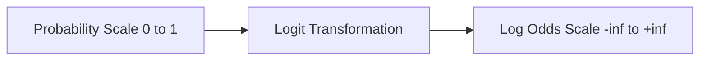
*The logit function acts as a bridge, mapping restricted probability values onto an infinite linear scale.*

### 🔍 Understanding the Coefficients

Because we are working on this "log-odds" scale, the coefficients we get from the model ($\text{intercept}$ and $\text{slope}$) are also expressed in log-odds.

> [!warning] **Don't interpret coefficients as probability**
> A slope coefficient of $1.825$ does **not** mean that your probability increases by $1.825$ when your input variable increases by one. It means the *log-odds* of the outcome increase by $1.825$. Because of the S-curve nature of the logit function, the actual change in probability depends on where you are currently starting on that scale.

### 📝 Worked Example: Interpreting the Numbers

Imagine we are building a model to predict the log-odds of obesity based on a person's weight. Suppose our model gives us an intercept of $-3.476$ and a slope of $1.825$.

*   **Intercept ($ -3.476$):** When the input variable (weight) is zero, the log-odds of being obese is $-3.476$.
*   **Slope ($1.825$):** For every one-unit increase in weight, the log-odds of being obese increase by $1.825$.

> [!important] **The Math Trap**
> Be careful with your inputs! You cannot calculate the log-odds of a probability of $1$ because it would require dividing by zero inside the logit formula, which results in positive infinity.

So, how does the logit function actually bridge that gap to keep our predictions in line?

## 📈 Logistic Regression Coefficients for Continuous Variables

When we work with probabilities, we are trapped in a tight box: values must live between $0$ and $1$. If you try to fit a straight line to data points constrained like that, you end up with a "squiggly" curve that doesn't capture the relationship well.

To solve this, logistic regression uses a "stretching" trick called the **logit function**. It takes those squashed probabilities and stretches them out across an infinite range—from negative infinity to positive infinity.

$$Logit(P) = \ln\left(\frac{P}{1-P}\right)$$

Think of this like taking a rubber band (the $0$ to $1$ range) and pulling it until it’s long enough to lay out flat. Once we’ve done this, we can fit a nice, clean straight line through the data.

### 🏗️ How to Interpret the Numbers
Because we are working on this "stretched" scale, the coefficients we get out of the model represent changes in **log-odds**, not changes in raw probability.

*   **The Intercept:** This is where your line hits the axis. It represents the log-odds of your outcome when your predictor variable is exactly zero.
*   **The Slope:** This tells you the change in the log-odds for every one-unit increase in your input variable. 

> [!warning] **Don't mistake log-odds for probability**
> If your model gives you a coefficient of $1.825$ for "weight," it does **not** mean the probability of obesity increases by $1.825$ when weight goes up by one unit. It means the *log-odds* increase by $1.825$. Because the relationship is non-linear, a one-unit change in weight has a different impact on probability depending on where you start on the curve.

### 🔍 Keeping it Significant
Just because you have a coefficient doesn't mean it’s actually telling you something meaningful. To check if a variable is pulling its weight, we use **Wald's test**. This involves calculating a $Z$-value:

$$Z = \frac{\text{Estimate}}{\text{Standard Error}}$$

This $Z$-value tells you how many standard deviations your estimate is away from zero. If the $Z$-value is small (close to zero), the coefficient might just be noise.

> [!tip] **The "Rule of Thumb" for Significance**
> In many cases, if your $Z$-value is within two standard deviations of zero, it’s a red flag that your result might not be statistically significant.

### 📊 Logit Transformation Visualized
The following diagram shows how the logit function maps probabilities to the log-odds scale, allowing us to move from a constrained box to an infinite line.

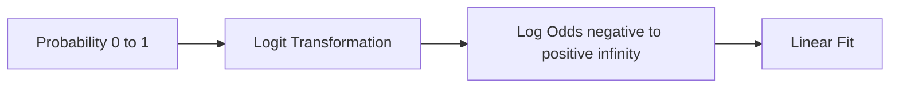
*The process of transforming probability into a linear log-odds scale.*

> [!example] **Mapping Probabilities to Log-Odds**
> It helps to see how specific probabilities land on this scale:
> | Probability | Logit Value |
> |---|---|
> | 0.5 | 0 |
> | 0.731 | 1 |
> | 0.88 | 2 |
> | 0.95 | 3 |
> 
> When the probability is exactly $0.5$, the log-odds are $0$. As the probability climbs toward $1.0$, the log-odds grow toward positive infinity.

So how does this mapping approach change when we’re dealing with discrete groups instead of continuous data?

## 🧩 Logistic Regression with Discrete Variables

When you are working with discrete variables—like comparing a "normal" group to a "mutant" group—logistic regression starts to feel a lot like a standard t-test. The main difference is the scale: instead of looking at raw linear values, we perform our math on the log-odds scale.

Think of it this way: the intercept is your "starting point" (the log-odds for your baseline group), and the coefficient for your discrete variable tells you exactly how much that starting point shifts when the "mutation" is present.

### 🏗️ How the Model Works

To handle these categories, the model uses a design matrix. This is just a clever way of setting up your data so the math handles the group comparison automatically:

*   **Column 1 (Intercept):** This represents the baseline, or the normal group.
*   **Column 2 (Indicator):** This acts as a switch. It is set to $0$ for the normal group and $1$ for the mutant group.

Because of this structure, the model fits two "lines" (or constants) simultaneously. The math works out so that the intercept is simply the log-odds of your baseline, and the slope (the coefficient for the mutant variable) is the difference between the two groups.

> [!important] **The Log Odds Ratio**
> When you subtract the log-odds of the normal group from the log-odds of the mutant group, you are calculating the **log odds ratio**. This value quantifies the effect of the mutation on your outcome.
> 
> $$Coefficient_{intercept} = \log(\text{odds}_{normal})$$
> $$Coefficient_{mutant} = \log(\text{odds}_{mutant}) - \log(\text{odds}_{normal}) = \log(\text{odds ratio})$$

### 🔬 Evaluating Significance

Just like in linear models, we want to know if the difference we found is actually meaningful or just a random fluke. For this, we use **Wald's test**.

We calculate a Z-value, which measures how many standard deviations our coefficient is away from zero. A good rule of thumb is that if the magnitude of your Z-value is greater than $2$, your result is usually statistically significant (corresponding to a p-value less than $0.05$).

> [!warning] **Mind the Scale**
> A very common mistake is to treat these coefficients as if they are on a standard linear probability scale. They are not. They live entirely on the log-odds scale, so you cannot interpret them as "a 0.5 increase in probability."

### 📊 Comparison at a Glance

If you have used t-tests before, this table shows how the two methods relate to one another:

| Feature | T-Test | Logistic Regression |
| :--- | :--- | :--- |
| **Output scale** | Raw linear values | Log-odds |
| **Baseline** | Group mean | Intercept |
| **Group effect** | Difference in means | Log odds ratio |
| **Significance** | T-statistic | Z-statistic (Wald test) |

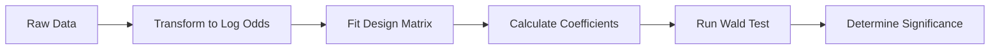
*The process of testing discrete variables via logistic regression.*

### 💡 Why This Matters
By using this approach, you can apply powerful tools from linear modeling—like ANOVA and multiple regression—to classification problems. You just have to be comfortable working in that log-odds space!

So, how do we actually tell if those coefficients are meaningful or just random noise?

## 🔍 Statistical Significance of Coefficients

Now that we have our model coefficients, the next question is: do these predictors actually matter, or are we just seeing random noise in our data? To figure this out, we use the **Wald's test**.

Think of the Wald's test as a way to check if a coefficient is "big enough" to be considered meaningful. If a coefficient is close to zero, it means that specific predictor doesn't have much impact on our outcome. 

### 🔧 How the Test Works

The test is quite straightforward. It calculates a $Z$-value, which tells us how many standard deviations our estimated coefficient is away from zero. 

To perform the test, we take the estimated coefficient and divide it by its standard error:

$$Z = \frac{\text{Estimated Coefficient}}{\text{Standard Error}}$$

Once you have that $Z$-value, you compare it to a standard normal curve. If your $Z$-value is at least $2$ (which corresponds to a p-value of roughly $0.05$), we generally consider that variable to be statistically significant.

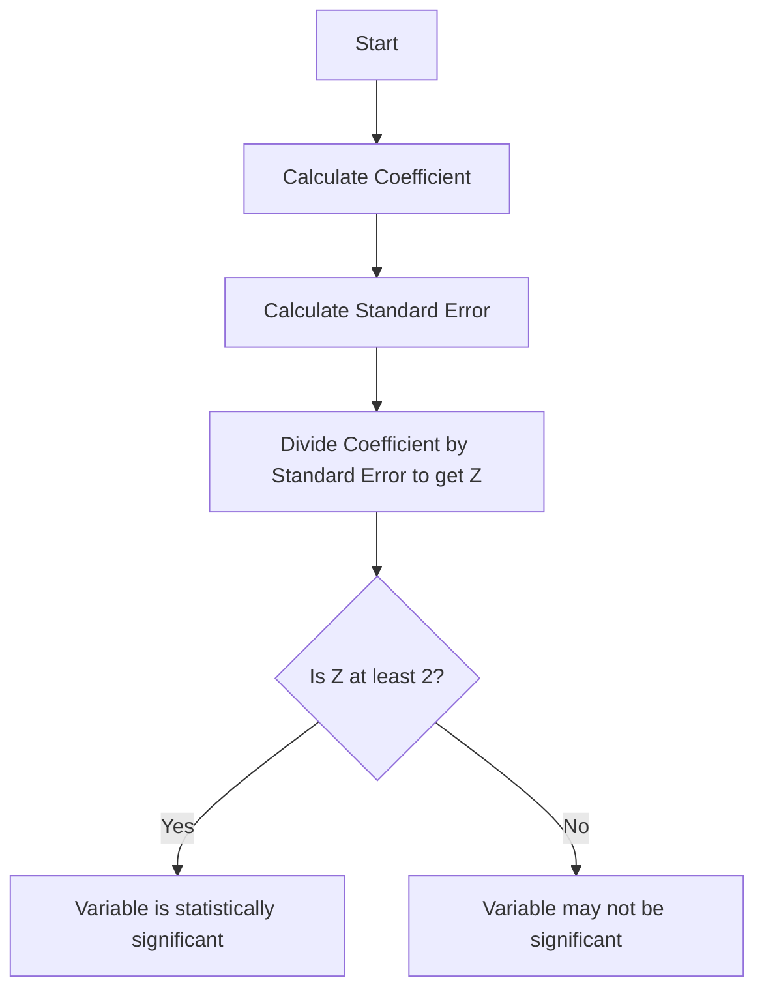
*The workflow for testing whether a predictor is statistically meaningful.*

> [!warning] **Don't misinterpret the Z-value**
> A common mistake is assuming that a low $Z$-value (less than 2) or a non-significant p-value means there is no relationship at all. It actually just means that, given your current data and sample size, you don't have enough evidence to confidently claim that a relationship exists.

> [!tip] **The threshold for confidence**
> Why use 2? In a standard normal distribution, a $Z$-value of approximately 2 marks the point where the result is unlikely to have happened by random chance alone ($p < 0.05$). If your coefficient is less than twice its own standard error, the "noise" is simply too high to trust that the signal is real.

So, if we have these solid foundations in linear regression, how do we adjust that framework to handle probabilities?

## 🔗 The Bridge Between Linear and Logistic Models

You might think that moving from linear regression to logistic regression means learning an entirely new set of rules. It’s a common misconception, but it’s actually more helpful to think of logistic regression as a "linear model in disguise."

At their core, both models share the same mathematical skeleton. The reason we use them differently comes down to a single constraint: probabilities must stay between $0$ and $1$, whereas standard linear models are free to roam anywhere from negative infinity to positive infinity.

### 💡 Why the Log-Odds Transformation Matters

To bridge this gap, we transform our $y$-axis from probability to **log odds**. Think of this as "un-stretching" a probability curve. By applying this transformation, we turn that curved, bounded relationship into a flat, straight line. Once it’s a straight line, we can apply all the familiar tools we use in standard linear regression—like multiple regression and ANOVA—to solve classification problems.

> [!important] **The Linear Connection**
> Logistic regression is officially categorized as a **Generalized Linear Model (GLM)**. This means that if you look at the math on the log-odds scale, the coefficients work exactly the same way as they do in a standard linear regression model.

### 🧩 Interpreting the Coefficients

When you run a logistic regression, the coefficients aren't telling you about "percentage point changes" in probability. Instead, they represent changes in log-odds.

*   **The Intercept:** This is your "baseline." It represents the log-odds for your reference group (like a patient without a gene mutation).
*   **The Coefficients:** These are your "boosts" or "penalties." If a condition is met (like the presence of a mutation), the coefficient tells you how much that condition shifts the log-odds away from your baseline.

> [!warning] **The Probability Trap**
> A common mistake is trying to interpret a coefficient as a direct change in probability. For example, if your coefficient is $0.5$, it doesn't mean your probability increases by $50\%$. It means the *log-odds* increases by $0.5$. Because the relationship between log-odds and probability is a curve, the actual change in probability depends on where you started on that curve.

### 📊 Comparing the Approaches

| Feature | Linear Regression | Logistic Regression |
|---------|-------------------|---------------------|
| Output range | $-\infty$ to $+\infty$ | $0$ to $1$ (as probability) |
| Output scale | Raw values | Log odds |
| Mathematical structure | Linear | Linear (on log-odds scale) |
| Significance testing | t-test / F-test | Wald test (z-values) |

This shared structure means you don't have to relearn how to think about model inputs. Whether you are dealing with continuous variables or categories, the process of building the model, checking for significance using the Wald test, and evaluating the coefficients remains remarkably consistent with the linear models you likely already know.

So why can't we just stick to our old method of minimizing squared errors?

## 🚫 Why Least Squares Doesn’t Work for Logistic Regression

Logistic regression lives on a *different* y‑axis than ordinary linear regression.  
Instead of plotting raw probabilities (0 to 1), we first turn those probabilities into **log odds**:

$$
\text{log odds}= \log\!\left(\frac{P}{1-P}\right)
$$

That transformation stretches the y‑scale all the way to $-\infty$ (for $P\to0$) and $+\infty$ (for $P\to1$).  
Imagine pulling a rubber sheet and stretching its ends forever – any point you try to measure a vertical distance to will be infinitely far away.

In linear regression we can say “let’s minimize the squared distance between each point and the line.”  
When the y‑axis has been stretched to infinity, those vertical distances become **infinite**, so the least‑squares sum is meaningless.

> [!warning] **Don’t compute residuals in log‑odds space**  
> If you try to calculate “observed – predicted” after converting probabilities to log odds, the numbers blow up to ±∞. The residual‑based error you’d normally square is no longer a finite quantity, so the whole least‑squares criterion collapses.

### How We Get Around This: Maximum Likelihood

Instead of measuring geometric distance, we ask a probabilistic question: *Given a candidate curve (the “squiggle”), how likely are the observed outcomes?*  

1. **Pick a candidate squiggle** (a set of parameters that defines a curve in log‑odds space).  
2. **Project each data point onto that curve** to read off its *candidate log odds*.  
3. **Turn those log odds back into probabilities** with the logistic function  

$$
P = \frac{e^{\text{log odds}}}{1 + e^{\text{log odds}}}
$$

4. **Evaluate the likelihood** of the actual observed status (e.g., obese vs. not) under those probabilities.  
5. **Adjust the squiggle** to make the total likelihood as large as possible.

That iterative process is called **Maximum Likelihood Estimation (MLE)**. It sidesteps the infinite‑distance problem because likelihoods stay nicely bounded between 0 and 1, even when the underlying log odds are extreme.

> [!tip] **Think of MLE as “best explanation”**  
> We’re not trying to draw the shortest line; we’re looking for the curve that makes the data we actually saw feel most natural under the model.

### Concrete Example

Suppose our candidate curve gives a log odds of $-2.1$ for a particular person.

1. Convert to probability:

$$
P = \frac{e^{-2.1}}{1 + e^{-2.1}} \approx \frac{0.122}{1 + 0.122} \approx 0.109 \ (\text{about }0.1)
$$

So the [Logistic Regression: The Log Odds Perspective](logistic-regression-the-log-odds-perspective)e for that person.

> [!example] **Log‑odds → probability**  
> *Log odds*: -2.1 → *Probability*: ≈ 0.10.  
> This tiny probability will then be used in the likelihood calculation for that observation.

> [!important] **Why this matters**  
> The logistic‑regression fit is built on these probability predictions, not on any notion of “distance” in an infinitely stretched space. That’s why MLE gives us a solid mathematical foundation where least squares would fail outright.

### Quick Visual of the Problem

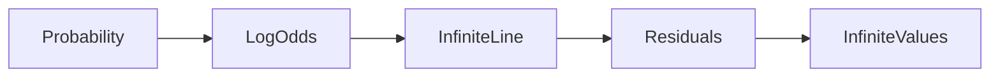
*Diagram: Converting probability → log odds stretches the scale, making residuals infinite.*

> [!note] **Background**  
> If you need a refresher on why we use log odds in the first place, see the earlier note on [[#Logistic Regression: The Log Odds Perspective]].

In short, the geometry of the log‑odds transformation kills the least‑squares idea. Maximum likelihood steps in, asking “how probable is what we observed?” and gives us a finite, well‑behaved objective to optimise.

So, how do we actually find the best curve using this method?

## 📈 The Maximum Likelihood Procedure

Since standard least squares doesn't work for logistic regression (as we saw in [[#🚫 Why Least Squares Doesn’t Work for Logistic Regression]]), we need a different way to figure out the "best" line. Instead of minimizing squared distances, we use **Maximum Likelihood Estimation**.

Think of the "squiggle" (the sigmoid curve) like a ramp. Our goal is to tilt that ramp so that the data points representing "not obese" mice end up at the low end (low probability) and the "obese" mice end up at the high end (high probability). Maximum Likelihood is simply the mathematical scorecard we use to judge how well our current tilt separates those two groups.

### 🏗️ How It Works

The process is an iterative, step-by-step search for the best fit:

1. **Start with a candidate line:** We pick an initial orientation for our line.
2. **Project data:** We map our observations onto this line to get their log-odds values.
3. **Convert to probability:** We turn those log-odds into a probability $P$ between $0$ and $1$ using the logistic function:
   $$P = \frac{1}{1 + e^{-\text{log odds}}}$$
4. **Calculate individual likelihoods:** For each mouse, we check how "likely" its actual status is, given our predicted probability.
5. **Sum the log-likelihoods:** Instead of multiplying raw probabilities (which gets messy with tiny numbers), we add up the logs of these likelihoods.
6. **Iterate:** We rotate the line slightly to see if the log-likelihood increases. We keep doing this until we find the orientation that produces the highest possible score.

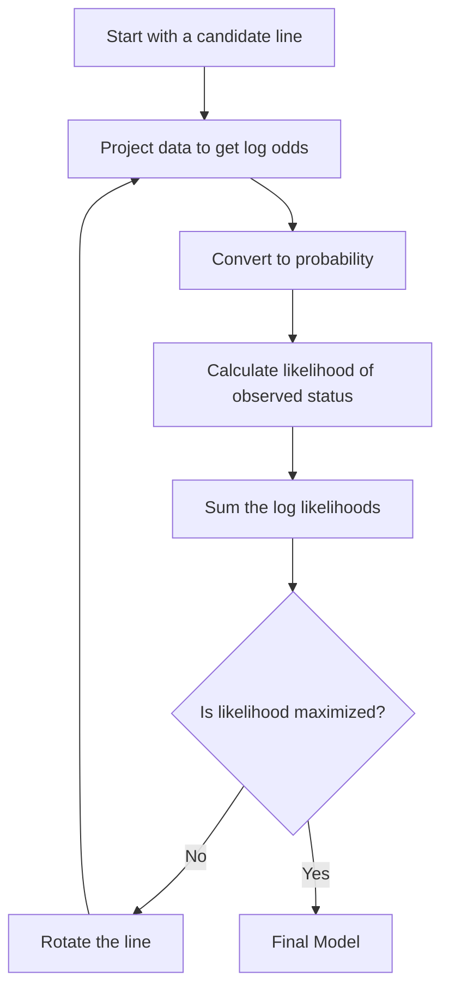
*The iterative cycle of testing and adjusting the line orientation to maximize the score.*

> [!example] **Calculating Individual Likelihood**
> Imagine we have a mouse. Our model predicts a $0.9$ probability that this mouse is obese.
> * If the mouse is actually **obese**, its likelihood is $0.9$.
> * If the mouse is actually **not obese**, its likelihood is $1 - 0.9 = 0.1$.
> 
> The model is "happy" (high likelihood) when it predicts high probabilities for the obese mice and low probabilities for the others.

> [!tip] **Why use logs?**
> We use the logarithm of the likelihood because it turns products into sums. Dealing with long chains of multiplication is computationally difficult and prone to precision errors; adding logs is much friendlier for the computer.

> [!important] **The same destination, different path**
> Maximizing the raw likelihood and maximizing the log-likelihood result in the exact same optimal model. The "log" version is just a math trick to make the calculation stable and efficient.

So, how do we actually turn these probability predictions into a final score for the model?

NOTATION CLASH: "log-likelihood" vs "likelihood"

## 📊 Calculating Log Likelihood

When we want to fit a model to our data, we need a way to score how "good" our current line is. In logistic regression, we do this by calculating the **likelihood**. 

Think of this like a flashlight beam. We want to aim our logistic curve so that it lines up perfectly with our data—making our observed results as probable as possible. For every data point (like a mouse being obese or not), the model predicts a probability. 

### How We Measure Fit
For each individual data point, the likelihood is simply the value the model predicts:

*   **If the mouse is obese ($y=1$):** The likelihood is the predicted probability itself, $P_i$. If the model predicts a $90\%$ chance of obesity, the likelihood is $0.9$.
*   **If the mouse is not obese ($y=0$):** The likelihood is $1$ minus the predicted probability, or $1 - P_i$. If the model predicts a $90\%$ chance of obesity, the likelihood of it *not* being obese is $0.1$.

To find the likelihood for the entire dataset, we multiply these individual values together:

$$L = \prod P_i^{y_i} * (1 - P_i)^{1-y_i}$$

> [!warning] **Avoid multiplying tiny probabilities**
> If you have a large dataset, multiplying hundreds of small probabilities (which are all between $0$ and $1$) results in an incredibly small number. Computers eventually struggle to handle these "underflow" issues, where the number gets so small that the computer just rounds it to zero.

### The Shift to Log-Likelihood
To get around the math headaches of multiplying tiny numbers, we use the logarithm. Because the logarithm function is strictly increasing, finding the maximum of the log of a function is mathematically identical to finding the maximum of the function itself.

Instead of multiplying probabilities, we take the log of each individual likelihood and **sum** them up:

$$\text{Log-Likelihood} = \sum \log(L_i)$$

> [!important] **The Lightbulb Moment**
> Summing the logs is computationally much safer than multiplying the raw probabilities. It gives us the exact same "best" line, but makes the math easy enough for our algorithms to handle reliably.

### Why This Works
We use this score to guide our optimization. Imagine you are trying to balance a tray; you make small adjustments to your posture until you feel the weight is perfectly centered. 

In logistic regression, the algorithm acts similarly: it makes a small rotation to the line, calculates the total log-likelihood, and checks if the score improved. If it did, it keeps that direction. It repeats this process until the log-likelihood is as high as it can possibly get.

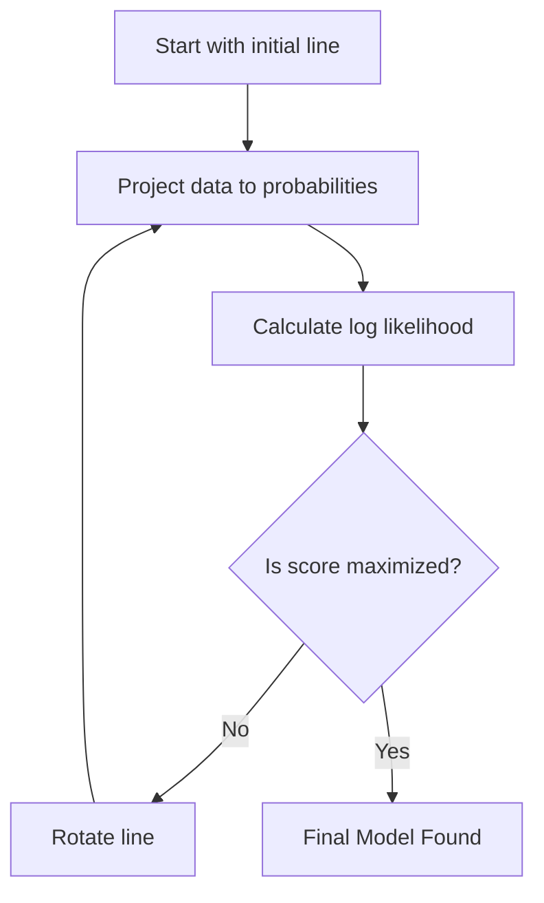
*The optimization loop used to find the best logistic regression line.*

> [!tip] **The Intuition**
> Think of the log-likelihood as a "scoreboard." The algorithm is a player trying to maximize its score by rotating the logistic curve, essentially tuning the "fit" of the model until the observed data is as likely as possible under the current parameters.

So how do we actually nudge that squiggle into the perfect position?

## 🌀 Optimization of the Squiggle

Once we have our [[#📊 Calculating Log Likelihood]], the goal is simple: we want to find the "squiggle" (the logistic curve) that gives us the highest possible total score. Think of this as tuning a radio to find the clearest signal; we keep making tiny adjustments until the music sounds perfect.

In logistic regression, those adjustments mean rotating the line until the predicted probabilities line up as closely as possible with the actual outcomes we observed.

### 🛠️ The Iterative Process

Since we can't just solve for the perfect line in one go like we might with simple linear regression, the computer uses an iterative approach. It takes a guess, checks the score, and then nudges the line to see if it can improve that score.

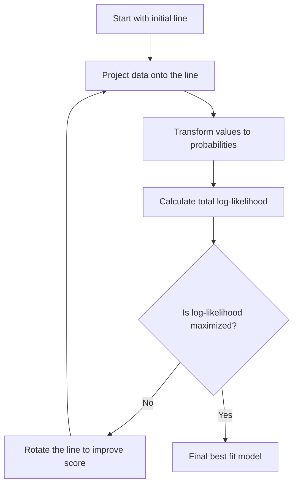
*The iterative process of adjusting the squiggle to find the best fit.*

> [!important] **The Lightbulb Moment**
> We maximize the **log-likelihood** instead of the raw likelihood because of how math behaves. Multiplying hundreds of tiny probabilities together (like $0.01 \times 0.05 \times \dots$) results in numbers so small that computers struggle to track them accurately. By taking the logarithm, we turn that multiplication into addition, which is much easier and more stable for the algorithm to handle.

### 🔍 How the "Nudge" Works

When the algorithm evaluates how well the current line fits, it looks at every data point individually:

*   **For an obese mouse (actual outcome = 1):** We want the squiggle to predict a probability as close to $1$ as possible. The closer the prediction is to $1$, the higher the likelihood score.
*   **For a non-obese mouse (actual outcome = 0):** We want the squiggle to predict a probability as close to $0$ as possible (meaning the probability of *not* being obese is $1$). 

If the model predicts a high probability for a mouse that is actually obese, the score for that point is high. If the model is wrong, the score stays low. By repeating the rotation step thousands of times, the algorithm eventually lands on the configuration where the sum of all these individual scores is at its absolute peak.

> [!warning] **Common Misconception**
> Don't get confused about how we determine the "probability" for a data point. It is not the area under a curve. Instead, it is simply the Y-axis value on the squiggle directly above the data point on the X-axis. You find your mouse's weight on the bottom, move up to the curve, and check the height—that is your predicted probability.

### 🎯 Summary of the Workflow

When you are ready to fit a model, here is the mental map of how the algorithm reaches its destination:

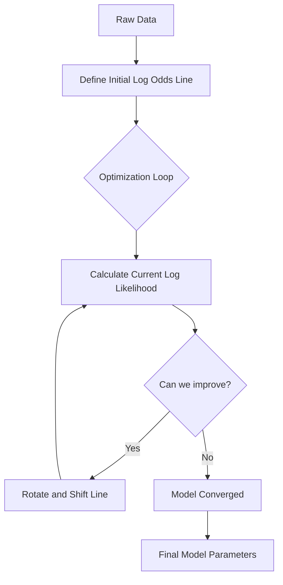
*The decision flow for finding the optimal logistic model.*

But since we aren't drawing lines through points anymore, why doesn't our old favorite, R-squared, work here?

## 📉 Why R-squared Doesn't Work for Logistic Regression

When you first learn linear regression, $R^2$ is your go-to metric. It tells you exactly how much "messiness" or variation you've cleared up by drawing your line. But as you move into logistic regression, you'll quickly find that $R^2$ is not the simple, reliable tool you remember.

In linear regression, we calculate $R^2$ by looking at residuals—the distance between our data points and the model line. We compare the sum of squares of these residuals for our model ($SS_{fit}$) against a baseline model that just guesses the average ($SS_{mean}$).

$$R^2 = \frac{SS_{mean} - SS_{fit}}{SS_{mean}}$$

> [!tip] **The intuition of $R^2$**
> Think of $R^2$ as the percentage of variation in your data that disappears once you draw your best-fitting line. If your line is no better than guessing the average, $R^2$ is $0$. If your line predicts every outcome perfectly, $R^2$ is $1$.

### ⚠️ The Problem with Residuals
The reason this fails in logistic regression is that "residuals" don't behave the same way. In a logistic model, your prediction is a probability, and the actual outcome is either $0$ or $1$. If the model predicts a $0.0001$ probability for an event that actually happens ($1$), the distance between the two is massive. In many cases, these residuals can effectively become infinite. Since we can't do math with infinity, the standard $SS_{fit}$ approach breaks down.

### 🔍 No Single Path Forward
Because the standard residual-based formula is invalid, there is no single, industry-wide consensus on how to calculate $R^2$ for logistic regression. In fact, there are over $10$ different methods floating around. 

This is why you'll often see "Pseudo $R^2$" metrics, like McFadden's. These methods attempt to mimic the logic of linear regression by comparing a "good" fit to a "bad" fit, but they use **log-likelihood**—a measure of how well the model parameters fit the data—instead of sum-of-squares.

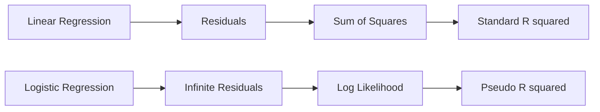
*Comparison of how we evaluate fit in linear vs logistic models.*

> [!warning] **Common Trap**
> Do not try to apply the standard linear $R^2$ formula to your logistic models. Because of the way logistic regression is built, those residuals don't give you a meaningful percentage of "explained variance."

Before you settle on a specific metric for your project, always check the established practices in your specific field. Different disciplines often prefer different "pseudo" methods, and knowing which one is standard in your area will save you a lot of confusion when comparing your results to existing research.

So, how do we actually calculate a pseudo-value that makes sense for these models?

## 🏗️ McFadden's Pseudo R-squared Mechanism

In linear regression, we define $R^2$ as the proportion of variance explained by our model. We compare how "wrong" our model is (sum of squared residuals) against how "wrong" a simple baseline model is (the mean of the target variable).

Because logistic regression deals with categories rather than continuous values, "residuals" don't behave the same way. We can’t just sum up the differences between predicted and actual values. Instead, we use **Log-likelihood ($LL$)**, which measures how well the model explains the observed data. McFadden’s Pseudo $R^2$ essentially takes the same "improvement" logic from linear regression and translates it into the world of likelihoods.

### 🔧 How the Calculation Works

To calculate McFadden’s $R^2$, we look at the ratio of two log-likelihood values:

1.  **$LL_{fit}$**: The log-likelihood of your model containing your predictors. This represents how well your model explains the data.
2.  **$LL_{overall\_probability}$**: The log-likelihood of an "intercept-only" model—a baseline that ignores your predictors and just uses the average probability of the event occurring across the entire dataset.

The formula is:

$$R^2 = 1 - \frac{LL_{fit}}{LL_{overall\_probability}}$$

> [!important] **Why this works**
> Think of $LL_{overall\_probability}$ as your "starting ignorance." It’s the best you can do by just guessing the base rate. $LL_{fit}$ is your "remaining ignorance" after adding predictors. The ratio $\frac{LL_{fit}}{LL_{overall\_probability}}$ tells you what fraction of your initial ignorance remains; subtracting that from $1$ tells you what fraction you've successfully eliminated.

### 📊 Visualizing the Improvement

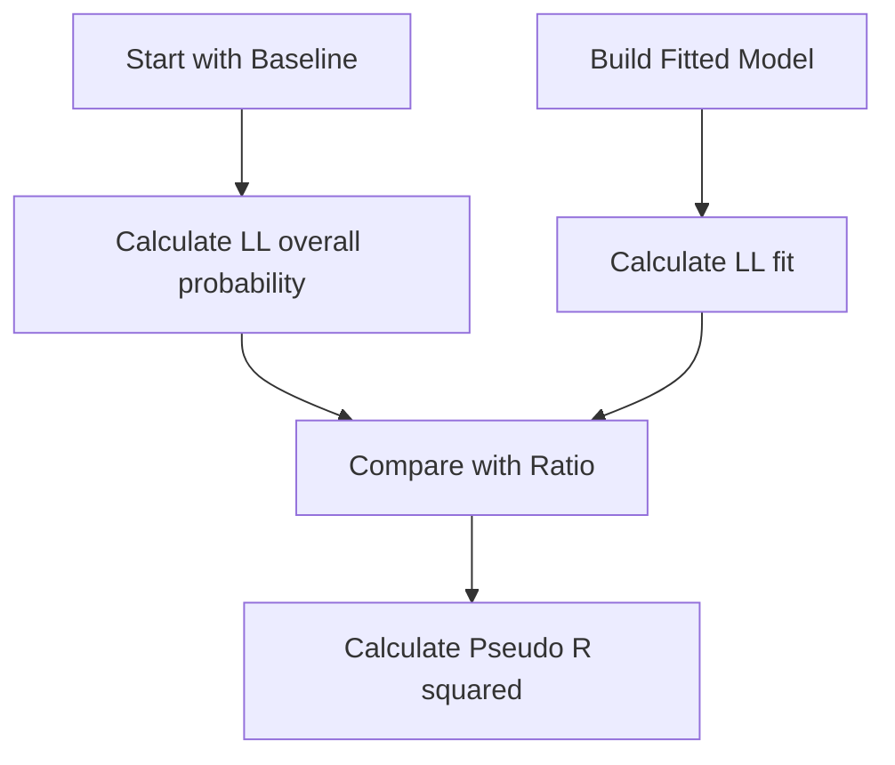
*The process of comparing the baseline model to the fitted model to determine model quality.*

### 💡 Concrete Example

Imagine we are predicting whether a patient has a condition based on a health marker. Our data is simple: out of 100 people, 50 have the condition and 50 do not.

| Model Type | Log-likelihood ($LL$) | Interpretation |
| :--- | :--- | :--- |
| **Baseline** | $-69.31$ | The "intercept-only" model (no predictors). |
| **Fitted** | $-48.52$ | Our model using the health marker. |

Plugging these into the formula:

$$R^2 = 1 - \left(\frac{-48.52}{-69.31}\right) = 1 - 0.70 = 0.30$$

In this case, our model has improved the fit by roughly 30% compared to the baseline.

> [!tip] **The Perfect Score**
> If your model is a perfect predictor, $LL_{fit}$ will be $0$. Since $\frac{0}{LL_{overall}} = 0$, your $R^2$ becomes $1 - 0 = 1$. This is the highest possible value, indicating a perfect fit.

### ⚠️ Common Pitfalls

While this metric is useful, remember that it doesn't function exactly like the $R^2$ you might be used to in linear regression. 

> [!warning] **No Universal Standard**
> There are over ten different ways to calculate "pseudo" $R^2$ for logistic models. McFadden’s is popular, but it isn't the only one. Always check if your specific field of study has a preferred method before reporting your results, or you might end up comparing apples to oranges.

So how exactly does this scoring system actually work?

## 💡 Understanding Log-Likelihoods

In standard linear regression, we judge a model by its sum of squared residuals. We want those squares to be as small as possible. But in logistic regression, our outcomes are just "yes" or "no." Calculating the "distance" between a prediction of 0.8 and an actual outcome of 1 is different than measuring vertical distance on a scatter plot.

This is where log-likelihood comes in. Think of it as a "score" for your model.

### 🎯 The Scoring System
The math behind the scenes calculates the probability your model assigned to the outcomes that actually happened. Because probabilities are always between 0 and 1, their logs are always negative. 

- **A perfect model:** Assigns a probability of 1 to every event that actually occurred. The log of 1 is 0. So, a perfect model has a log-likelihood of 0.
- **A poor model:** Assigns low probabilities to the events that actually happened. Since the logs of small decimals are large negative numbers, a poor model results in a large negative log-likelihood.

> [!warning] **The "More is Better" Trap**
> It is very easy to instinctively think "bigger is better" with numbers. In this case, remember that $-10$ is mathematically "larger" than $-500$. Since you want your score to be as close to 0 as possible, you are looking for the value that is *least negative*.

### ⚖️ Measuring Added Value
To figure out if your model is actually doing anything useful, we compare your model's "score" to a baseline. The baseline is the log-likelihood of a model that ignores all your independent variables and simply guesses the overall average probability of the event every single time.

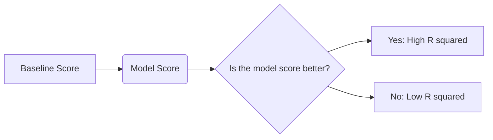
*Comparing your model's score against the baseline tells you how much information you have actually gained.*

> [!important] **The Lightbulb Moment**
> Comparing the "score" of your model to the "baseline score" is exactly the same logic as comparing the sum of squares of your model to the total sum of squares in linear regression. We are essentially asking: "How much did I improve the prediction compared to just guessing the average?"

### 🔍 Quick Check
| Model Performance | Log-likelihood Value |
| :--- | :--- |
| Perfect Prediction | 0 |
| Strong Prediction | Close to 0 (e.g., -5) |
| Weak Prediction | Very negative (e.g., -100) |
| Baseline Guessing | The reference point |

If your model's log-likelihood is effectively the same as the baseline, your independent variables aren't helping you predict the outcome at all, and your R-squared will be 0. If your model gets it exactly right every time, the log-likelihood hits 0, and your R-squared effectively becomes 1.

So how do we determine if these results are statistically significant?

## 🔍 Calculating P-values via Chi-squared

Once you’ve built your logistic regression model, you need to know if the relationship you're seeing is actually real or just a fluke caused by random chance. To figure this out, we use a P-value derived from the Chi-squared distribution.

### ⚙️ The Mechanics of the Test

To get this P-value, we compare how well your model fits the data (the "fitted" model) against a baseline model that simply guesses the overall average probability for everyone. We do this by looking at the difference between their log-likelihoods.

1.  **Find the difference:** Subtract the baseline log-likelihood from your model’s log-likelihood: $(LL_{\text{fit}} - LL_{\text{overall}})$.
2.  **Calculate Chi-squared:** Multiply that difference by 2 to get your Chi-squared value:
    $$\chi^2 = 2 \times (LL_{\text{fit}} - LL_{\text{overall}})$$
3.  **Determine Significance:** Use the Chi-squared distribution to find your P-value. You’ll need the "degrees of freedom," which is just the difference in the number of parameters between your model and the baseline model.

> [!tip] **Why this works**
> Think of the Chi-squared value as a "improvement score." The further your model’s log-likelihood is from the baseline, the higher the Chi-squared value. A larger value suggests your model is genuinely capturing a pattern, making it much less likely that your results happened by pure luck.

### 🔢 A Practical Example

Imagine you are testing if a specific feature predicts a binary outcome. You calculate the log-likelihoods for your fitted model and the baseline model.

*   **Step 1:** You find the difference between your model's log-likelihood and the baseline's is $2.41$.
*   **Step 2:** Multiply by 2: $\chi^2 = 2 \times 2.41 = 4.82$.
*   **Step 3:** With $1$ degree of freedom (since you added one parameter), you check the Chi-squared distribution table or software. This results in a P-value of $0.03$.

Because this P-value is generally considered below the threshold of $0.05$, you can conclude that the relationship is statistically significant.

### ⚠️ A Note on Generalized Models

> [!warning] **Mind the Saturated Model**
> It's easy to assume that the log-likelihood of a "perfect" (saturated) model is always zero. While this is true for standard logistic regression, it isn't always the case for other types of generalized linear models. If you ever move beyond logistic regression, remember that the saturated model's log-likelihood might not be zero, which can change how you frame your formulas.

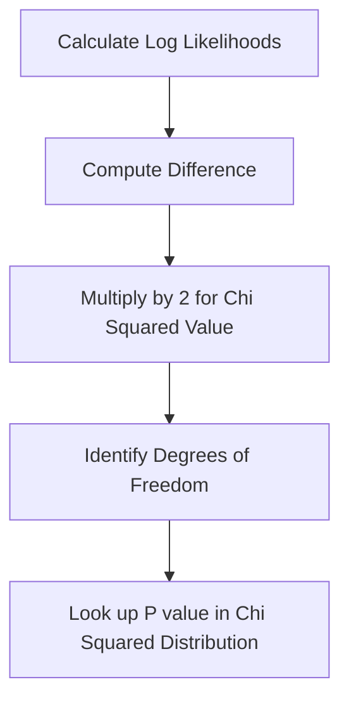

*The process for moving from raw log-likelihoods to a statistical significance P-value.*

---

## 📖 Glossary
| Term | Definition |
|------|------------|
| **Chi-squared** | A statistical test used to determine if the improvement of a model over a baseline is significant. |
| **Coefficient** | A value representing the change in log-odds for a one-unit change in a predictor. |
| **Design Matrix** | A structure used to organize variables to allow the model to compare groups automatically. |
| **Intercept** | The baseline log-odds value when all predictor variables are zero. |
| **Log-likelihood** | A "score" representing how well the model parameters explain the observed data. |
| **Log-odds** | The natural logarithm of the odds; the scale used to transform probabilities into a linear range. |
| **Logistic Regression** | A statistical method used to predict the probability of a binary outcome. |
| **Logit Function** | The mathematical transformation mapping probability values (0 to 1) onto an infinite linear scale. |
| **Maximum Likelihood Estimation** | The iterative procedure used to find the parameter values that best explain the observed data. |
| **McFadden's Pseudo R-squared** | A metric used to evaluate model fit by comparing the log-likelihood of the model to a baseline. |
| **Odds Ratio** | The exponentiated coefficient, quantifying the effect of a predictor on the odds of an outcome. |
| **Wald's Test** | A statistical test used to check if a coefficient is significantly different from zero. |

Sources: The content provided is derived from standard statistical theory regarding Generalized Linear Models (GLMs), logistic regression optimization procedures (MLE), and model evaluation metrics commonly used in inferential statistics.