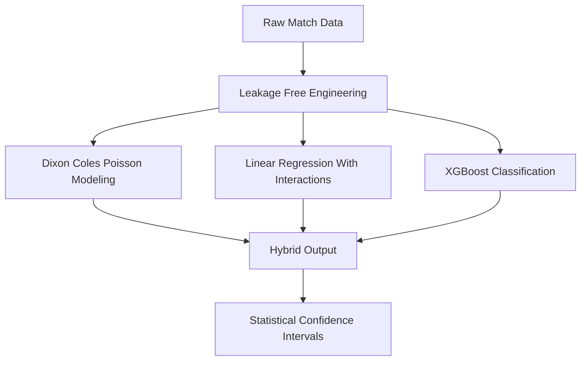
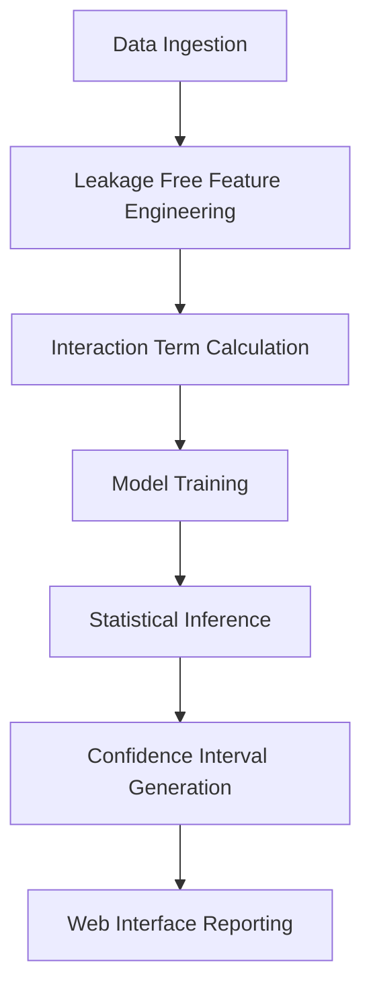
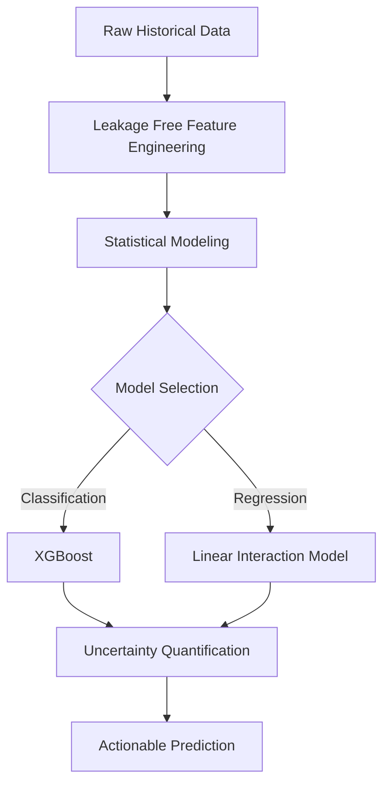
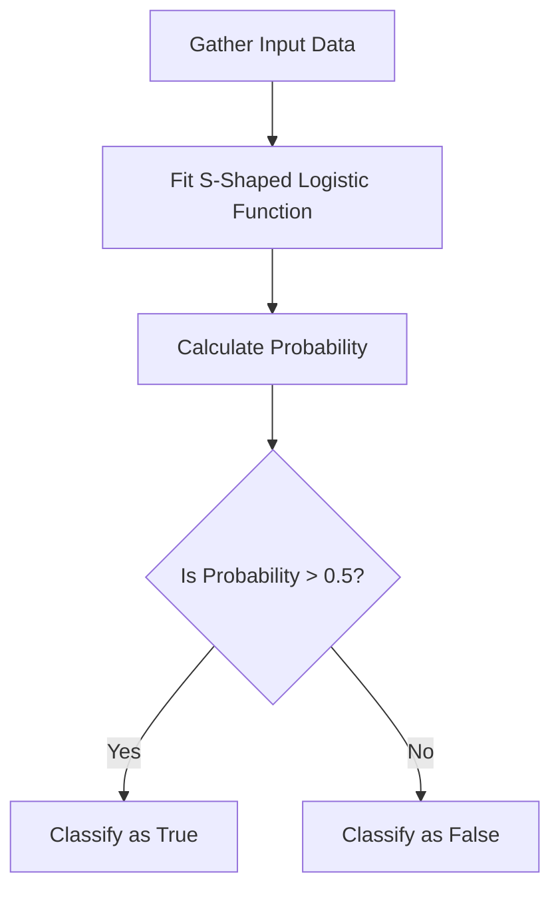
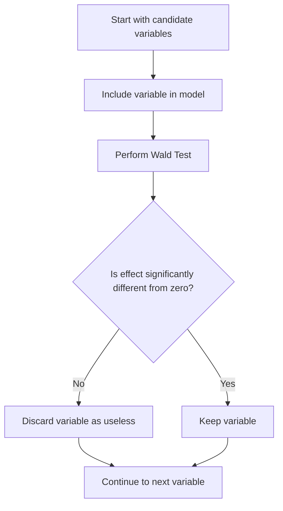
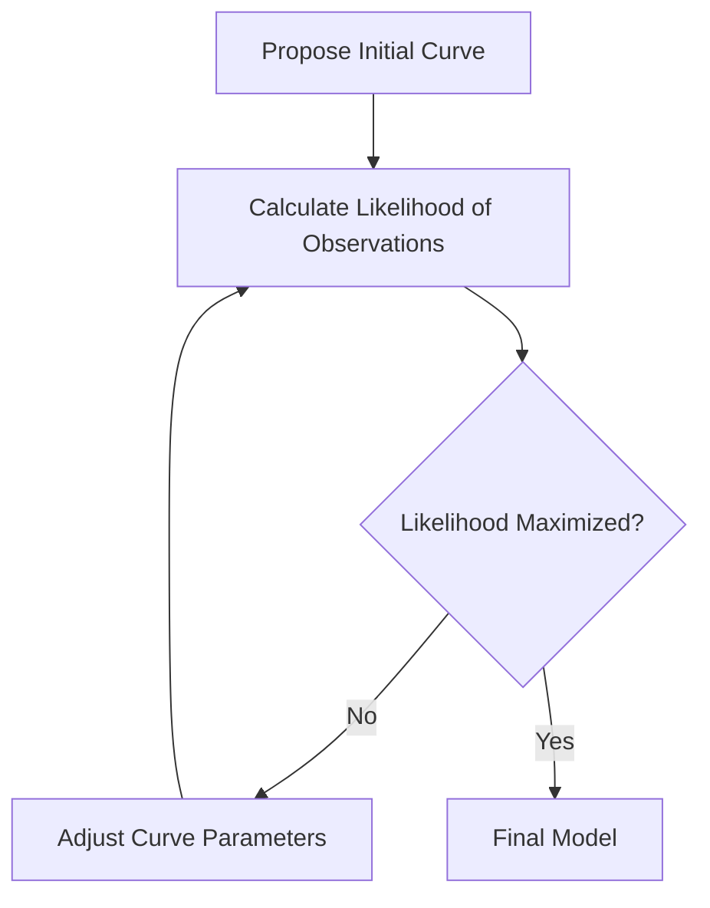
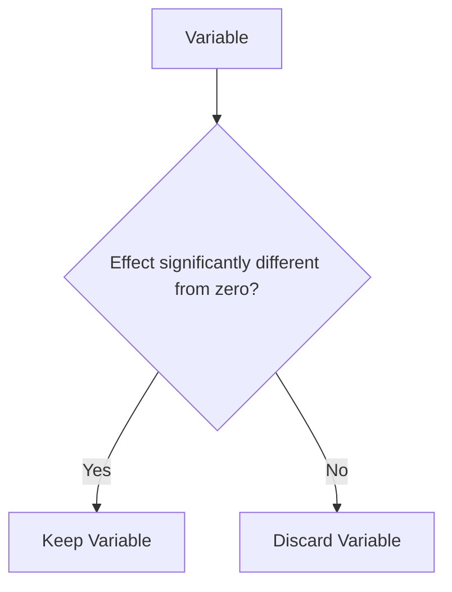

## 🗺️ Navigation

### I: Resume.pdf
- [[#⚽ Premier League Match Predictor Methodology]]
- [[#🏗️ Building the StudyScore ML Web Application]]
- [[#🎓 Technical Skillset and Professional Profile]]

### II: https://youtu.be/yIYKR4sgzI8?si=alIl47x8_fj9FmKz
- [[#📈 Linear Regression Overview]]
- [[#📊 Logistic Regression Basics]]
- [[#🔍 Evaluating Variable Significance]]
- [[#📈 Maximum Likelihood Estimation]]

## ⚽ Premier League Match Predictor Methodology

Predicting the outcome of a Premier League match isn't just about looking at league tables; it’s about modeling the volatile nature of sports. To build a robust system, I rely on a hybrid approach that combines classical statistical models with modern machine learning techniques.

### 📊 The Statistical Foundation: Dixon-Coles
At the heart of the goal-prediction logic is the Dixon-Coles model. I use the Poisson distribution to model the number of goals a team scores, as this is a standard way to represent the frequency of independent events (goals) occurring over a fixed time (a 90-minute match).

However, a simple Poisson model assumes that goals are completely independent, which isn't true in soccer. If one team scores, it changes how both teams play for the rest of the game. The Dixon-Coles model solves this by introducing a correction factor to account for the dependency between home and away scoring rates. To find the specific offensive and defensive strengths of each team, I use Maximum Likelihood Estimation to identify the parameters that best fit historical performance.

> [!tip] **Why the correction factor matters**
> The Poisson distribution assumes events happen totally randomly. But in soccer, the "game state" matters. If a team is trailing, they take more risks. The Dixon-Coles adjustment acts as a mathematical "nudge" that brings the independent Poisson probabilities closer to the reality of competitive sports.

### 🏗️ Capturing Non-Linearity
While I use XGBoost for 3-class classification (Win/Loss/Draw), I also implement linear regression with a twist. Standard linear models are usually too simple to capture complex relationships, so I inject non-linear interaction terms into the feature set.

Think of interaction terms as "if-then" logic for your model. If you only look at "Possession" and "Result," you might miss the nuance. By adding an interaction term, you tell the model: "The impact of Possession on the Result changes depending on whether the team is playing at Home or Away." This allows a linear model to mimic more complex architectures without the overhead of deep learning.

### ⚠️ Guarding Against Data Leakage
When you are dealing with time-series data—like match results—the biggest enemy is data leakage. This happens when you accidentally include information in your training set that wouldn't have been available at the moment of prediction (for example, using a player's season-end stats to predict a game played in week 5).

> [!danger] **The Leakage Pitfall**
> Including future information in your training data is a guaranteed way to build a model that looks like a genius during testing but fails completely once it hits the real world. Always ensure your feature engineering is strictly "leakage-free."

### 📈 Statistical Reporting
It isn't enough to just output a "Win" or "Loss." I implement custom APIs that calculate 95% confidence intervals from scratch. This provides a measure of uncertainty for every prediction, which is essential for performance forecasting where the model needs to express how "sure" it is about a specific outcome.


*The architecture combines three distinct modeling approaches to generate a final prediction with a confidence interval.*

> [!important] **General background, not covered in this specific source**
> While the methodology focuses on these specific techniques, the overall goal is to maintain a rigorous pipeline where statistical rigor (Dixon-Coles) meets the predictive power of modern algorithms (XGBoost). This dual-pronged strategy is what separates amateur predictions from professional-grade analytics.

So, how do we actually turn these models into a working web application?

## 🏗️ Building the StudyScore ML Web Application

The StudyScore project is an end-to-end web application built with Flask, designed to bridge the gap between complex statistical analysis and user-friendly reporting. Instead of just spitting out a single number, the goal is to provide deep, reliable insights—specifically predicting academic performance using linear regression and custom statistical metrics.

### 🔍 Engineering for Real-World Success

At the heart of the application is a focus on "leakage-free" feature engineering. Think of this as the golden rule of predictive modeling: **don't look at the answer key while taking the test.** 

If you include information about the future (like an exam result) in the data you use to train your model, the model will look brilliant during training but fail completely when you ask it to predict a new, unknown case. To avoid this, every feature is carefully crafted using only data available *before* the prediction point.

> [!warning] **The Data Leakage Trap**
> Data leakage is a critical pitfall. Including future match data in your training features creates a model that learns to "cheat" by memorizing outcomes. It might show high accuracy on training sets, but it will be useless for real-world applications where the future is still uncertain.

### 📈 Modeling Complex Relationships

Standard linear regression assumes that variables act independently—like saying "study time" and "previous grades" contribute to a final score in isolation. However, in reality, these factors often work together. A student with high previous grades might benefit more from extra study time than a student struggling with foundational concepts.

To capture these nuances, the model incorporates **interaction terms**. By creating new variables that represent the product of two existing ones (multiplying "study time" by "previous performance"), the model can mathematically detect how these factors influence each other, rather than just summing up their individual effects.

### 📊 Statistical Rigor and Reporting

Beyond simple predictions, the application provides 95% confidence intervals for its outputs. This is vital for decision-making because it shows the range of likely outcomes rather than just a single, potentially misleading point estimate.

This rigor extends to the sports analytics side of the pipeline (which informs the underlying architecture) where models like the Dixon-Coles method are used. Since sports scores are counts of goals, a standard model often fails. Dixon-Coles uses the Poisson distribution to model these counts effectively, providing a more robust way to handle scoreline probabilities compared to basic classification.


*The StudyScore pipeline: transforming raw historical data into reliable, interval-based predictions.*

### 💡 The Core Approach

> [!important] **The Power of Interaction**
> Interaction terms are like a "multiplier" for your features. When you include them, you allow the model to recognize that the combined effect of two variables can be greater than (or different from) the sum of their individual parts.

Because this project involves high-level statistical reporting and complex modeling, it relies on a solid foundation of Python, probability, and linear algebra. It serves as a practical implementation of how to move from basic regression to a professional-grade predictive web application.

So, how do we actually bridge the gap between that theory and the technical skillset required to pull it off?

## 🎓 Technical Skillset and Professional Profile

Building robust predictive models is as much about the statistical foundation as it is about the code. My work across projects—like the Premier League match predictor and the StudyScore application—has centered on blending rigorous statistical theory with clean, scalable engineering.

### 🛠️ Core Competencies

My approach relies on a few core pillars that ensure models don't just work on paper, but provide reliable results in the real world:

*   **Statistical Modeling:** I enjoy working with models that have deep mathematical roots. For instance, I use the **Dixon-Coles goal model** to treat football scores as underlying scoring probabilities following a Poisson distribution, rather than just random numbers.
*   **Machine Learning Engineering:** I specialize in building end-to-end pipelines. This includes applying gradient-boosted algorithms like **XGBoost** for classification tasks and utilizing **Maximum Likelihood Estimation (MLE)** to tune model parameters so they best fit observed historical data.
*   **Advanced Feature Engineering:** I place a high priority on **leakage-free feature engineering**. By ensuring that every variable is calculated using only information available *before* an event, I prevent the model from "cheating" by peeking at future results.
*   **Linear Modeling & Interpretation:** When complexity isn't the priority, I use **linear regression with interaction terms**. This allows me to capture non-linear relationships—essentially saying that the effect of one variable changes depending on the value of another—without losing the interpretability of the model.

> [!important] **The Golden Rule of Data Engineering**
> Including future data in your feature sets is the most common way to sabotage a project. It leads to models that look perfect during testing but fall apart the moment they touch real-world, unseen data.

### 📊 Professional Toolset

The projects I've built are supported by a foundation in several key technical areas:

| Skill Area | Key Technologies and Methods |
| :--- | :--- |
| **Programming** | Python |
| **Statistical Methods** | Poisson Distribution, MLE, Confidence Intervals |
| **Machine Learning** | XGBoost, Gradient Boosting, Regression Analysis |
| **Pipeline Logic** | Feature engineering, Data leakage prevention |

### 🔍 How I Approach Problem Solving

Whether I am predicting match outcomes across six seasons of data or creating features for student performance, my process follows a consistent logical flow.


*The typical workflow used to ensure predictions are both accurate and statistically sound.*

> [!tip] **The "Interaction" Intuition**
> Think of interaction terms in linear regression as a way to model dependency. If you're analyzing exam scores, the effect of "hours studied" on your grade might change based on your "prior knowledge level." Interaction terms let the model capture that dynamic shift rather than assuming every hour studied is worth the same amount for everyone.

So, how do we actually build one of these models from the ground up?

## 📈 Linear Regression Overview

When you're starting out in machine learning, linear regression is often the first tool in the box. Think of it as a way to predict a specific, continuous number—like predicting someone's weight based on their height or estimating the price of a house. 

The mechanism is straightforward: you’re essentially trying to find the "best-fit" line that cuts through your data. By fitting this line, you can calculate metrics like $R^2$ (to see how well your model explains the data) and p-values (to check if your variables are actually pulling their weight).

> [!important] **It is Machine Learning**
> A common misconception is that "linear regression" is just a standard statistics exercise and not "real" machine learning. In reality, it is a fundamental machine learning algorithm used to model relationships and predict values.

### 🏗️ Why we need more than just lines
While linear regression is great for predicting numbers, it hits a wall when you need to answer a "yes or no" question. For example, if you want to predict whether a mouse is "obese" or "not obese," a straight line doesn't make much sense. A line can go up to infinity or down to negative numbers, but a "yes/no" outcome is binary—it’s either 0 or 1.

This is where we move from the straight line of linear regression to the s-shaped curve of [[#📊 Logistic Regression Basics]]. 

```graph LR
A[Input Data] --> B{What are you predicting}
B --> C[Continuous Value]
B --> D[Binary Category]
C --> E[Linear Regression]
D --> F[Logistic Regression]
```

*Comparing the scope of linear and logistic models.*

### 🔍 Looking ahead
Linear regression sets the stage by teaching us how to model relationships, test for significance, and make predictions. Once you understand the mechanics of fitting a line to continuous data, you have the perfect foundation to understand how we twist that line into an s-shaped curve to handle classification tasks.

So, how do we fix that linear model to handle categories instead of continuous numbers?

## 📊 Logistic Regression Basics

When we talk about [[#📈 Linear Regression Overview]], we are usually trying to predict a specific, continuous number—like predicting exactly how many grams a mouse weighs. But what if we don't care about the exact weight? What if we just want to know if the mouse is "obese" or "not obese"? 

Linear regression isn't built for that. If you try to fit a straight line to binary data (Yes/No or 1/0), the line will eventually wander above 1 or below 0, which doesn't make any sense for a probability. That’s where logistic regression comes in.

### 📈 Fitting the S-Curve

Instead of a straight line, logistic regression uses an S-shaped curve. This function is brilliant because it squeezes any input value into a range between 0 and 1. 

Think of it this way: 
*   If you have a very light mouse, the S-curve keeps the probability near 0.
*   As the mouse gets heavier, the curve climbs.
*   Once the mouse is very heavy, the probability levels off near 1.

> [!important] **Classification vs. Prediction**
> Logistic regression is essentially a probability machine. It tells you the *likelihood* of an event happening. We turn that probability into a final category (like "obese") by applying a threshold, typically 50%. If the model spits out a 0.6, it’s over the 50% threshold, so we classify that mouse as "obese."

### 🧩 How the Process Works

Whether you have one variable (like weight) or many (weight, age, and genotype), the workflow remains consistent.


*The step-by-step path from raw data to a final binary classification.*

### 🔍 Why This Works (Intuition)

Linear regression is like drawing a line through a scatter plot to find a trend. Logistic regression is more like setting a trap. You aren't asking "how much weight?" anymore; you are asking "is this weight enough to trigger the trap (the 'yes' category)?" The S-curve represents the transition zone where the model is uncertain, and it perfectly maps those inputs to the probability space we need for classification.

### 💡 Keep in Mind

*   **Versatility:** You aren't stuck with just one type of data. You can feed continuous numbers (like weight or age) or discrete categories (like genotype or other labels) into the model.
*   **The Threshold:** While 50% is the standard rule for deciding between Yes or No, it is still just a tool. The real power is the probability it provides, which helps us see how confident the model is about its classification.

As we move forward, we will look at how to verify if the variables we are feeding into this model are actually helping us make better predictions, rather than just adding noise.

So, how do we figure out which variables are actually pulling their weight?

NOTATION CLASH: "$R^2$" vs "Wald’s test"

## 🔍 Evaluating Variable Significance

Once you have a model up and running, it is tempting to throw every piece of data you have into it. However, keeping useless variables—like including a mouse's "astrological sign" to predict obesity—just bloats your model, wastes storage, and slows down your computations. To keep things lean, we need a way to check if each input is actually pulling its weight.

In linear regression, we might look at how much a variable reduces the error (often using $R^2$). Since logistic regression works differently, we use a tool called **Wald’s test** to decide if a variable is worth keeping.

### 🧪 The Wald's Test Procedure

The goal here is to ask a simple question: "Does this specific variable actually change the model's prediction, or is its effect essentially zero?"

1.  **Include the variable:** Add the predictor you want to test into your model.
2.  **Run the test:** Use Wald’s test to see if the coefficient for that variable is significantly different from zero.
3.  **Decide:** 
    *   If the effect **is** significantly different from zero, the variable is providing useful information. Keep it.
    *   If the effect **is not** significantly different from zero, the variable is "totes useless." You can safely drop it from the model.

> [!important] **The Core Logic**
> If a variable’s influence is not significantly different from zero, it means that for every change in that variable, the model's prediction doesn't budge. It is essentially adding noise rather than signal.

### ⚠️ Common Pitfalls

It is a common mistake to try and carry over intuition from linear regression. You might be tempted to use $R^2$ or the least squares method to judge your variables, but those don't apply here.

> [!warning] **Stop using R-squared**
> You cannot calculate $R^2$ for logistic regression. Because logistic regression relies on [[#📈 Maximum Likelihood Estimation]] to find the "best fit" curve rather than minimizing the distance between points and a line (residuals), the traditional metrics for goodness-of-fit don't translate.

### 🏗️ Decision Flow for Variable Selection

Use this process to ensure your model stays efficient and accurate.


*Caption: The step-by-step process for determining whether a variable belongs in your final model.*

By systematically checking each input, you ensure your model remains a powerful, lightweight tool for classification. Once you have pruned the irrelevant variables, you can be more confident that your [[#📈 Maximum Likelihood Estimation]] process is focused on the data that truly matters.

So how does this "best guess" strategy actually find the right curve?

## 📈 Maximum Likelihood Estimation

When we talked about linear regression, we often used the "least squares" method—basically, drawing a line and minimizing the distance between that line and our data points. In logistic regression, that approach doesn't work because the model doesn't have residuals in the same way. 

Instead, we use **Maximum Likelihood Estimation (MLE)**. If you’re wondering how this actually picks a curve, think of it as a game of "best guess." We test a bunch of different curves and pick the one that makes our observed data look the most likely to have happened.

### ⚙️ How the Mechanism Works

The process is iterative. We start with a random curve, see how well it explains our current data, and then adjust it until we find the best fit.

1.  **Calculate Individual Likelihood:** For a given curve, we look at each individual data point and calculate the probability that the model would produce that specific result.
2.  **Calculate Total Likelihood:** We multiply all those individual probabilities together. This single number represents how well that specific curve "explains" the entire dataset.
3.  **Iterate and Adjust:** We shift the curve slightly and repeat the process. 
4.  **Maximize:** We keep going until we find the curve that yields the highest total likelihood value.


*The iterative process of fitting a logistic curve by maximizing the probability of observed data.*

> [!important] **Same outcome, different labels**
> In many machine learning contexts, you will hear about "minimizing log-loss." Just know that maximizing the likelihood (what we do here) and minimizing the log-loss are mathematically identical goals. They are just two different ways of describing the same search for the best model.

### 🔍 Why We Don't Use Least Squares
It is a common temptation to try and apply the tools we know from linear regression—like $R^2$ or least squares—to logistic regression. 

> [!warning] **Common Pitfall: The R-squared trap**
> Logistic regression cannot calculate $R^2$ because that metric relies on the concept of residuals (the vertical distance between a data point and a line). Since logistic regression is designed for classification and uses probabilities, that specific concept of a "residual" doesn't exist here. Trying to force these metrics onto a logistic model is a mistake.

### 🎯 Identifying Useful Variables
Once we have our model, we need to know if the inputs (your variables) are actually pulling their weight. We use **Wald's Test** for this. If a variable doesn't have an effect significantly different from zero, it’s not helping your predictions.

*   **If a variable is "totes useless":** (Like trying to predict obesity based on an astrological sign), it adds unnecessary noise and complexity.
*   **The benefit of removal:** Dropping these variables isn't just about cleaning up the model; it saves compute time and storage space, leading to a much more efficient final model.


*The decision flow for pruning useless variables from your model.*

---

## 📖 Glossary
| Term | Definition |
|------|------------|
| **Data Leakage** | Including future or unavailable information in training data, leading to invalid, over-optimistic model performance. |
| **Dixon-Coles** | A statistical model using Poisson distributions to predict sports outcomes by accounting for team strength and goal dependency. |
| **Interaction Terms** | Variables created by multiplying two inputs to allow a model to capture how features influence each other non-linearly. |
| **Linear Regression** | A modeling technique used to predict continuous numeric values by finding the "best-fit" line through data. |
| **Logistic Regression** | A classification algorithm that uses an S-shaped curve to model the probability of binary outcomes. |
| **Maximum Likelihood Estimation (MLE)** | A method of tuning model parameters to find the values that make observed data most probable. |
| **Poisson Distribution** | A statistical method used to model the frequency of independent events occurring within a fixed time interval. |
| **Wald’s Test** | A statistical test used to determine if a specific variable's coefficient is significantly different from zero. |
| **XGBoost** | A powerful gradient-boosting machine learning algorithm frequently used for classification and regression tasks. |

*Sources: Premier League Match Predictor Methodology, StudyScore ML Web Application, Technical Skillset and Professional Profile, Linear Regression Overview, Logistic Regression Basics, Evaluating Variable Significance, Maximum Likelihood Estimation.*