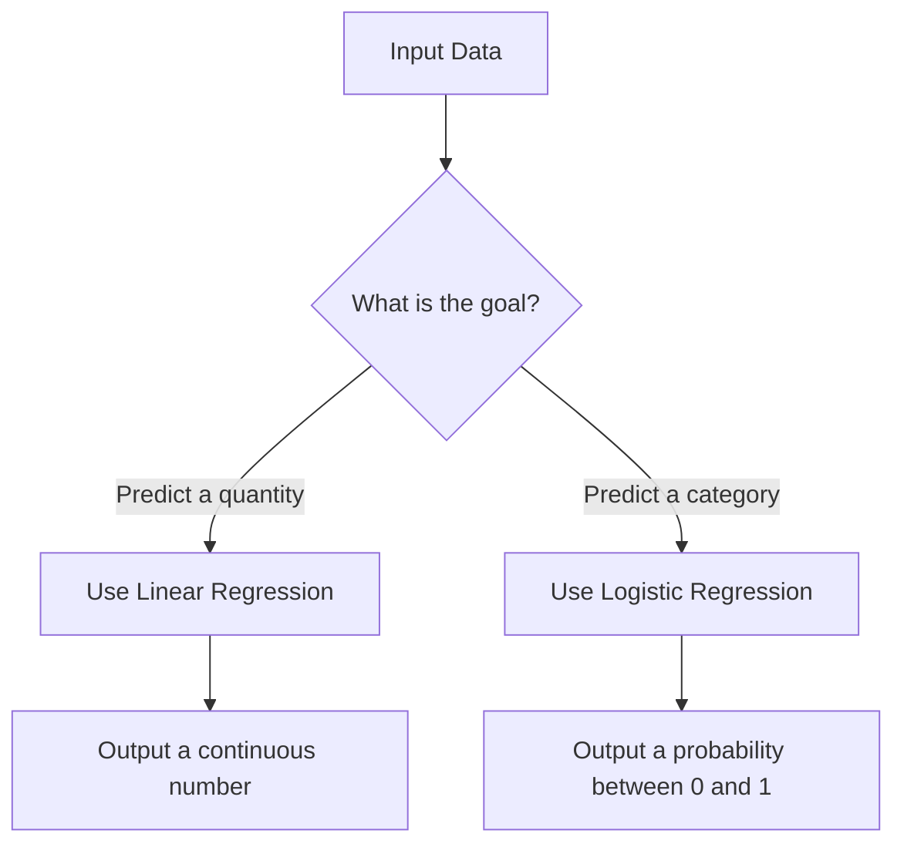
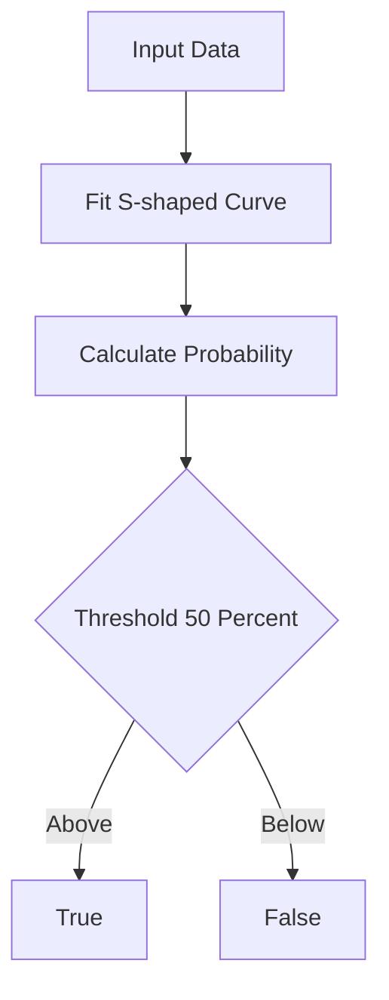
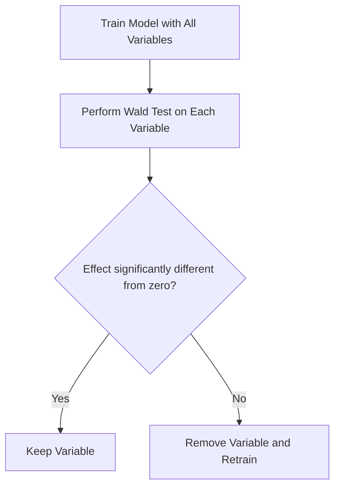
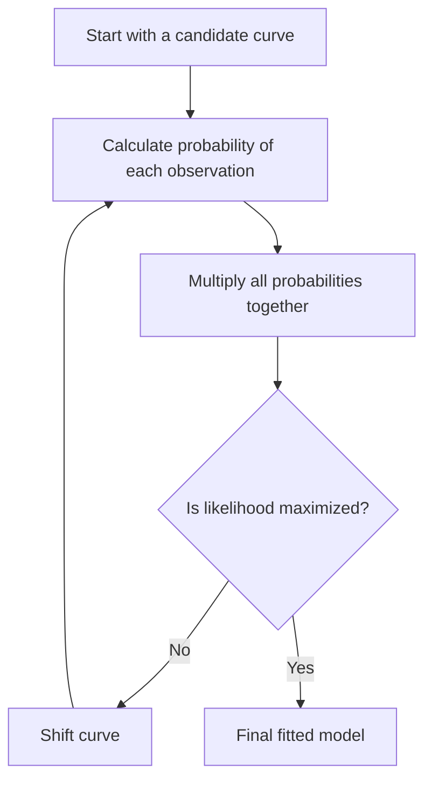

### Part I: Foundations
- [[#📈 Linear Regression Review]]
- [[#📈 Logistic Regression Overview]]

### Part II: Modeling and Classification
- [[#🐍 The S-Shaped Curve]]
- [[#🏗️ The Classification Process]]
- [[#🐭 A Concrete Example]]
- [[#💡 Common Misconceptions]]

### Part III: Model Refinement and Assessment
- [[#🎯 Assessing Variable Importance]]
- [[#🔍 How We Check for Significance]]
- [[#💡 Why Pruning Matters]]

### Part IV: Optimization and Estimation
- [[#📈 Maximum Likelihood Estimation]]
- [[#🧩 How the Process Works]]
- [[#🔍 Variable Significance Testing]]

## 📈 Linear Regression Review

Before we dive into how we handle "yes or no" questions, it’s helpful to take a quick look at where we started: **Linear Regression**. 

Think of linear regression as your go-to tool when you want to predict a specific, continuous number. If you are trying to answer a question like, "How much will this house sell for?" or "How heavy is this mouse?", linear regression is perfect. It takes your input data and draws a straight line through it, giving you a numerical estimate based on the trends it sees.

> [!important] **The Core Purpose**
> Linear regression is designed to predict continuous values. You give it input variables, and it outputs a prediction that sits somewhere along a number line.

### ⚠️ Why Linear Regression isn't always the answer
While linear regression is fantastic for numbers, it hits a wall when you try to use it for classification—specifically, tasks that require a binary "true or false" answer. 

If you try to use a straight line to predict whether an event will happen (like "is this mouse obese?"), the model might give you predictions that are impossible, like a probability of $-0.2$ or $1.5$. Since probabilities must always live between $0$ and $1$, a straight line just doesn't know how to "stay in bounds." 

This is why we eventually shift gears to **Logistic Regression**. Instead of a straight line, it uses an S-shaped curve (the logistic function) to squeeze those predictions into the $0$ to $1$ range, making them valid probabilities.

> [!warning] **Common Misconception**
> Don't mistake the two models for doing the same job. Linear regression is for measuring quantities (how much?), while the models we will discuss next are for sorting into groups (which category?). 

### 🏗️ The Big Picture
To see how these concepts relate, consider this flow:

*Linear regression handles continuous numerical predictions, while logistic regression is our tool for classification.*

If you're comfortable with the idea of predicting continuous numbers, you're ready to look at how we apply that same logic to binary decisions using the S-shaped curve.

So, how do we fix that straight line to handle binary choices instead?

## 📈 Logistic Regression Overview

We already know how [[#📈 Linear Regression Review]] works: it’s great for predicting continuous numbers like weight or price. But what happens when you don't want a number, but a choice? Like "Is this mouse obese?" or "Is this email spam?" 

When we try to force a straight line to fit a binary outcome (like 0 or 1), it usually breaks—you end up with impossible predictions like a -0.2 probability or a 1.4 probability. Logistic regression is our answer to that problem.

### 🐍 The S-Shaped Curve
Instead of forcing a straight line, logistic regression uses an S-shaped curve. This curve is mathematically designed to stay strictly between 0 and 1. Because the output is always a value between 0 and 1, we can interpret it as a probability.

> [!info] **General background, not covered in this specific source**
> The S-shaped curve is typically created using the logistic (or sigmoid) function, which maps any input to the $(0, 1)$ range.

### 🏗️ The Classification Process
Think of the S-curve as a bridge between raw data and a final decision. Here is how the process flows:

*The step-by-step pipeline for classifying outcomes using logistic regression.*

### 🐭 A Concrete Example
Imagine we are predicting whether a mouse is obese based on its weight.

| Mouse Weight | Predicted Probability | Classification |
| :--- | :--- | :--- |
| 10g | 0.05 | False (Not Obese) |
| 25g | 0.48 | False (Not Obese) |
| 30g | 0.52 | True (Obese) |
| 50g | 0.95 | True (Obese) |

If our threshold is 50%, we simply look at that 0.50 mark on the Y-axis. Anything that hits the curve above that line gets labeled as "True," and anything below gets labeled as "False."

> [!tip] **Why it matters**
> The power of logistic regression is that it doesn't care if your input data is continuous (like weight or age) or discrete (like genotype). You can mix and match them to build a much smarter model than a simple linear equation could ever provide.

### 💡 Common Misconceptions
A lot of people think logistic regression is strictly "statistics" and not "machine learning." In reality, it’s a fundamental tool in both worlds. Whether you are doing scientific research or training a modern AI, this S-curve is often the starting point for any classification task.

So, once you've built your model, how do you figure out which of those variables are actually pulling their weight?

## 🎯 Assessing Variable Importance

Once you have your logistic regression model up and running, you might find yourself with a long list of features. The big question is: do all of these actually help, or are some just taking up space?

In linear regression, we often look at residuals to see how well our model fits. Because logistic regression works differently, it doesn't have that same concept of a "residual" to rely on. Instead, we use **Wald’s tests** to determine if a variable's effect on the final prediction is actually different from zero.

> [!important] **The "Useless Variable" Rule**
> If a variable's contribution to the prediction isn't significantly different from zero, it’s essentially doing nothing for your model. Removing these variables—like, say, an irrelevant astrological sign—is a great way to streamline your research, saving you both time and computing power.

### 🔍 How We Check for Significance

Think of this as a "pruning" phase for your model. You aren't just building a curve; you are refining the inputs to ensure you aren't wasting resources on data that doesn't actually help with classification.

*The iterative process of testing and pruning variables to keep your model lean and efficient.*

> [!warning] **Mind the Regression Method**
> A common mistake is trying to fit logistic regression using the "least squares" method common in linear regression. Remember that logistic regression doesn't have residuals in the same way, so we must rely on methods like [[#📈 Maximum Likelihood Estimation]] to find the best fit.

### 💡 Why Pruning Matters

This process isn't just about making your model "smaller." By identifying which variables are truly useful, you make your future data collection more efficient. You stop chasing metrics that provide zero predictive power and focus only on the variables that actually influence the probability of a classification. 

One thing to keep in mind, though, is that comparing very complicated logistic models to simple ones isn't always as straightforward as it is with linear regression. While the Wald test is your go-to for checking individual variables, be aware that as your models grow in complexity, the comparison logic becomes a bit trickier.

So how do we actually find the best curve when standard distance-based methods don't work?

NOTATION CLASH: "sum of squared residuals" vs "likelihood"

## 📈 Maximum Likelihood Estimation

In [[Linear Regression Review]], we learned that we can fit a line to data by minimizing the sum of squared residuals—the vertical distance between our data points and our model. But when we switch to **Logistic Regression**, that method hits a wall. Since logistic regression deals with categories (like "obese" vs. "non-obese") rather than continuous numbers, there isn't really a "residual" or "distance" to minimize. 

Instead of drawing a line that tries to get as close as possible to the dots, we need a way to find the curve that is most *likely* to have generated the data we actually observed.

### 🧩 How the Process Works

Think of maximum likelihood estimation as an iterative process of trial and error. We start with a candidate curve, see how well it "explains" our current data, and then nudge the curve in a better direction.

1. **Calculate Likelihood:** For every data point in our set, we ask: "Based on this specific curve, what is the probability that this person (or mouse) would fall into the category they are actually in?"
2. **Multiply:** We take the individual probability for every single observation and multiply them all together to get a "total likelihood" score for that curve.
3. **Shift and Repeat:** We shift the curve slightly and repeat the calculation. We keep adjusting until we reach the highest possible total likelihood value.

*The iterative process of finding the best-fitting curve.*

> [!important] **Why we skip least squares**
> Logistic regression cannot use least squares because it lacks the concept of a residual. Because of this, we also can't use metrics like $R^2$ to evaluate our models, which is why we rely on different diagnostic tools like Wald's tests for checking variable importance.

### 🔍 Variable Significance Testing
Once we have our model, we want to know if every variable we included is actually earning its keep. We use **Wald's tests** to check if the effect of a specific variable is significantly different from zero. 

If a variable’s effect is basically zero, it’s not helping us make better predictions. We might as well toss it out to keep our model lean and efficient. For example, if you were trying to predict obesity in mice, you might find that "astrological sign" is a completely useless variable—it doesn't shift the likelihood of your results at all, so it should be removed.

| Feature | Linear Regression | Logistic Regression |
|---------|-------------------|---------------------|
| Fitting Method | Least Squares | Maximum Likelihood |
| Metric for Error | Residuals | Likelihood of observations |
| Can use $R^2$? | Yes | No |

By focusing on variables that actually move the needle, we ensure our model is both accurate and easy to manage.

---

| Term | Definition |
|------|------------|
| **Linear Regression** | A statistical method used to predict a continuous numerical value. |
| **Logistic Regression** | A statistical method used for classification tasks with binary outcomes. |
| **Binary** | A system of classification involving only two possible states, such as True/False. |
| **S-shaped curve** | The visual representation of the logistic function that maps inputs to a (0, 1) probability range. |
| **Threshold** | The specific probability value (often 50%) used to categorize continuous outputs into discrete classes. |
| **Residuals** | The vertical distance between observed data points and the predicted value in linear models. |
| **Wald's test** | A statistical test used to determine if a specific variable's contribution is significantly different from zero. |
| **Least squares** | A mathematical optimization technique used in linear regression to minimize the sum of squared residuals. |
| **Maximum Likelihood Estimation** | A method of fitting a model by finding parameter values that maximize the likelihood of observing the given data. |
| **Pruning** | The process of removing non-significant variables from a model to improve efficiency. |

*Sources: This study guide synthesizes fundamental concepts in regression analysis, specifically comparing Ordinary Least Squares estimation for linear models and Maximum Likelihood Estimation for logistic classification.*