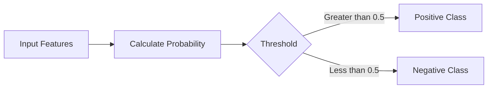
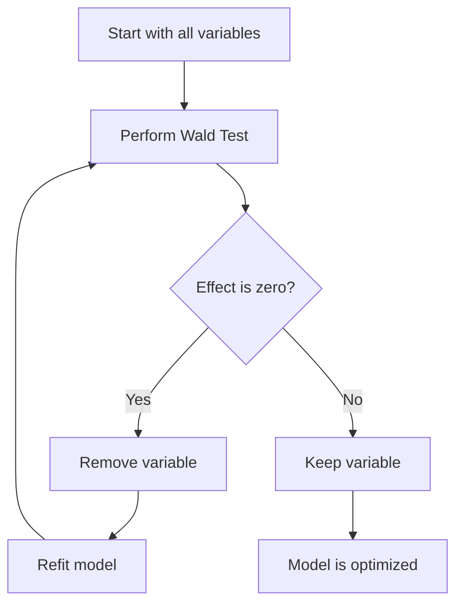
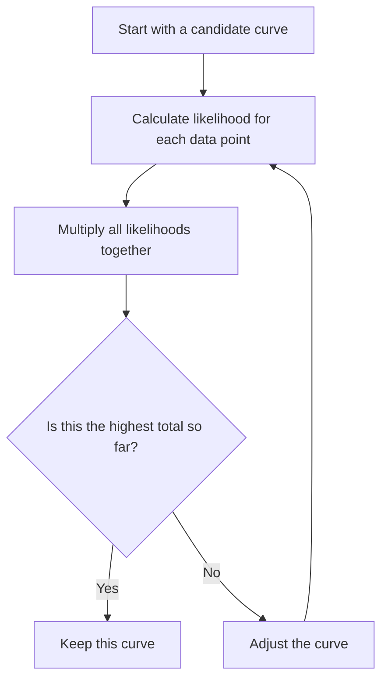

### 🗺️ Navigation

### Part I: Foundations
- [[#📈 Linear Regression Review]]
- [[#1.1 — 🧩 The Core Metrics]]
- [[#1.2 — ⚖️ From Continuous to Categorical]]

### Part II: Logistic Regression
- [[#📉 Logistic Regression Fundamentals]]
- [[#2.1 — 🧩 The S-Shaped Intuition]]
- [[#2.2 — 📋 The Classification Pipeline]]
- [[#2.3 — 💡 Keep This in Mind]]

### Part III: Model Optimization
- [[#🧪 Variable Significance Testing]]
- [[#3.1 — 🔍 How Wald's Test Works]]
- [[#3.2 — ⚠️ A Common Trap]]
- [[#3.3 — 📈 The Decision Process]]

### Part IV: Estimation Methods
- [[#📊 Maximum Likelihood Estimation]]
- [[#4.1 — 💡 The Core Idea]]
- [[#4.2 — 🔍 Checking Your Variables]]

---

## ▣ I: Foundations

---

### 📈 Linear Regression Review

Before diving into how we handle yes/no questions with machines, it helps to ground ourselves in the basics. You likely already know linear regression—it’s the bread and butter of predictive modeling. Think of it as drawing a straight line through a cloud of data points to spot a trend. 

When you use linear regression, you're trying to predict a **continuous outcome**. If you want to guess a house price, a person's height, or a mouse's exact weight, a straight line is perfect because it can go on forever in either direction.

### 1.1 — 🧩 The Core Metrics
To know if your line actually fits the data well, we rely on a few key concepts:

*   **R-squared:** This tells you how much of the variation in your target data is explained by your input features. If your $R^2$ is close to 1, your line is doing a great job tracking the data. If it’s near 0, your line is basically just guessing.
*   **p-values:** These are your "sanity check" markers. When you add an input variable to your model, the p-value helps you decide if that variable is actually helping or if the relationship you’re seeing is just a statistical fluke.

### 1.2 — ⚖️ From Continuous to Categorical
Linear regression works great when you’re dealing with numbers on a scale. But what happens when you need a simple "Yes" or "No" answer? If you try to force a straight line to fit a binary outcome (like "Obese" vs "Not Obese"), it falls apart. The line will eventually predict values greater than 1 or less than 0, which doesn't make any sense when you're talking about probabilities.

> [!important] **The Shift in Thinking**
> Linear regression is for when you care about the **value** (how much?), whereas the next steps we will look at are for when you care about the **category** (which one?). 

We use this foundation to move into more complex classification tasks. While linear regression looks for a trend line, we will soon look at fitting an "s-shaped" ramp to our data to map inputs into a probability space between 0 and 1. 

We'll build on these foundations—specifically the comfort with input variables and statistical significance—as we move into [[#📉 Logistic Regression Fundamentals]].

So, how do we fix that "straight line" problem to get our predictions into a proper probability range?

---

## ▣ II: Logistic Regression

---

### 📉 Logistic Regression Fundamentals

If you've spent time with linear regression, you’re used to drawing a straight line through data to predict a continuous number—like predicting a person's height based on their age. But what happens when you don't want a number, but rather a "Yes" or "No" answer? 

If you try to use a straight line for a binary outcome, it just doesn't fit. You'll end up with predictions that go below zero or above one, which doesn't make sense when you're talking about probabilities. That’s where logistic regression steps in.

> [!question] **Why not just use linear regression?**
> Linear regression predicts values across the entire number line. Logistic regression is purpose-built to constrain its output to a probability between $0$ and $1$, making it the standard tool for classification tasks.

### 2.1 — 🧩 The S-Shaped Intuition

Instead of a straight line, logistic regression fits an **S-shaped curve** to your data. Think of it this way: as your input variable (like weight) increases, the curve starts out very flat near zero, rises steeply in the middle, and then levels off near one. 

This curve represents the probability that an event will happen. If the probability is very low, the curve hugs the bottom; if it’s very high, it hugs the top. This "S" shape is the mathematical magic that ensures your model never guesses a probability like $150\%$ or $-20\%$.

### 2.2 — 📋 The Classification Pipeline

The goal of logistic regression isn't just to find that curve—it's to make a final decision. Here is how that process flows:

*The typical classification process using a decision threshold.*

1.  **Input:** You feed in your features (these can be continuous like weight, or discrete like a genotype).
2.  **Calculate:** The model uses the S-shaped curve to output a probability between $0$ and $1$.
3.  **Threshold:** You compare that probability to a cutoff point—usually $0.5$. If the model says there's a $70\%$ chance of "Yes," you classify it as "Yes."

> [!example] **Classifying Mouse Obesity**
> Imagine we are studying whether a mouse is obese based on its weight. Our model outputs a probability of $0.7$ for a specific mouse. Since $0.7 > 0.5$, we classify the mouse as "obese."

### 2.3 — 💡 Keep This in Mind

The most common mistake people make is treating logistic regression like it’s just another flavor of linear regression for continuous numbers. It isn't.

> [!warning] **Mind the Output**
> Logistic regression predicts **probabilities**, not raw values. Even though it uses input variables just like linear regression, the end result is a likelihood of membership in a specific group.

Because it handles both continuous and discrete inputs, it’s an incredibly flexible tool for any scenario where you need to categorize data into binary buckets. It’s the essential bridge between simple line-fitting and the world of probabilistic classification.

So, once you've got your model set up, how do you figure out which of those inputs are actually worth keeping?

---

## ▣ III: Model Optimization

---

### 🧪 Variable Significance Testing

Once you have your model running, a big question is: "Which of these variables are actually pulling their weight?" In some cases, we might toss in a bunch of data—like age, income, and maybe even something random like an astrological sign—just to see what happens. But carrying around useless variables wastes time and space in your study. 

We use **Wald's test** to cut the dead weight.

### 3.1 — 🔍 How Wald's Test Works
The core idea is simple: we want to know if a specific variable's effect on our prediction is actually doing anything, or if it's just statistical noise. 

Think of it this way: if a variable truly matters, its impact on the outcome should be significantly different from zero. If the effect is indistinguishable from zero, that variable isn't helping us predict anything, and we’re better off removing it from the model entirely.

> [!important] **Efficiency Matters**
> Logistic regression isn't just about making predictions; it's a powerful tool for discovering which inputs are actually relevant. If you find a variable is statistically useless, dropping it makes your future data collection cheaper and your model faster to run.

### 3.2 — ⚠️ A Common Trap
It is tempting to try and use the same metrics you used in [[#📈 Linear Regression Review]], like $R^2$, to see if your model is "good." 

However, you cannot use $R^2$ in logistic regression. That metric relies on "residuals"—the distance between your data points and the regression line—which are calculated using the "least squares" method. Because logistic regression uses [[#📊 Maximum Likelihood Estimation]] instead of least squares, those familiar linear metrics simply don't apply here.

### 3.3 — 📈 The Decision Process

When we evaluate the variables in our model, we essentially follow a cycle of testing and refining:

*This process helps us ensure our model remains lean, only including variables that genuinely contribute to our predictions.*

So how do we actually calculate those probabilities without using residuals?

---

## ▣ IV: Estimation Methods

---

### 📊 Maximum Likelihood Estimation

When we talked about linear regression, we used the "least squares" method—basically, we tried to draw a line that minimized the distance (the residuals) between our predictions and the actual data points. 

In logistic regression, that strategy hits a wall. Because logistic regression predicts probabilities rather than continuous values, there isn't a direct concept of a "residual" that works the same way. Instead, we use a technique called **Maximum Likelihood Estimation**.

### 4.1 — 💡 The Core Idea

Think of it as a guessing game. We want to find the best probability curve for our data. Since we can't measure the "distance" from the line, we measure how "likely" it is that our current curve produced the data we actually see.

The process follows these steps:

1. **Pick a candidate curve:** We start with a guess for what the probability curve looks like.
2. **Calculate individual likelihoods:** For every data point, we check: "Given this specific curve, how likely is it that we would see this specific result (e.g., an obesity outcome)?"
3. **Get the total likelihood:** We multiply all those individual likelihoods together to get one big number representing the "total likelihood" of the entire dataset under that curve.
4. **Iterate:** We shift the curve slightly and repeat the process. 
5. **Select the winner:** We keep the curve that produces the highest total likelihood.

> [!important] **Maximum Likelihood versus Least Squares**
> Logistic regression does not use residual-based methods like least squares. Because we are dealing with probabilities and classification, we focus on maximizing the likelihood of our observed outcomes rather than minimizing the distance from a line.

*The iterative process of finding the curve that makes our observed data most probable.*

### 4.2 — 🔍 Checking Your Variables

Once we have our model fitted, we need to make sure we aren't including "totes useless" variables—like trying to predict a mouse's health based on its astrological sign. 

We use **Wald's test** for this. The logic is simple: we check if the effect of a specific variable is significantly different from zero. If the test shows the variable isn't really moving the needle, it’s not helping our predictions. Removing these unnecessary variables makes the model faster and simpler to manage.

> [!tip] **Why remove variables?**
> If a variable doesn't have an effect significantly different from zero, it’s just noise. Dropping it saves you both compute time and memory without hurting your classification accuracy.

| Feature | Linear Regression | Logistic Regression |
| :--- | :--- | :--- |
| **Fitting Method** | Least Squares | Maximum Likelihood |
| **Optimization Target** | Minimize Residuals | Maximize Likelihood |
| **Residual Concept** | Central | Not applicable |
| **Variable Selection** | Often based on R-squared | Based on Wald's test |

This approach makes logistic regression a powerful, versatile tool that can handle a mix of continuous and discrete measurements—like genotype data and physical size—to categorize samples effectively.

---

### 📖 Glossary
| Term | Definition |
|------|------------|
| **Binary outcome** | A dependent variable that only has two possible values, such as yes or no. |
| **Continuous outcome** | A dependent variable that can take on any value within a range, such as height or price. |
| **Logistic Regression** | A statistical model used for classification that constrains output to a probability between 0 and 1. |
| **Maximum Likelihood Estimation** | A method of estimating model parameters by finding values that maximize the likelihood of observing the given data. |
| **P-value** | A statistical measure used to determine if an input variable provides a meaningful contribution to the model. |
| **R-squared** | A metric indicating the proportion of variance in the dependent variable explained by independent variables. |
| **Residuals** | The difference between the observed data points and the values predicted by a regression model. |
| **S-shaped curve** | The logistic function used to map input values into a probability space. |
| **Threshold** | A cutoff point, typically 0.5, used to convert a probability into a discrete class prediction. |
| **Wald's Test** | A statistical test used to determine if a specific independent variable has a significant effect on the outcome. |

Sources: Internal document on Linear and Logistic Regression Fundamentals.