### 🗺️ Navigation

### Part I: Pre-training and Data
- [[#📚 Pre-training Data Collection and Processing]]
- [[#🧩 Tokenization Concepts]]

### Part II: Core Mechanisms
- [[#🏗️ Neural Network Training Mechanism]]
- [[#🚀 The Role of Compute in Model Development]]
- [[#🔮 Inference in Base Models]]
- [[#🧊 Base Model Limitations and Knowledge Retrieval]]

### Part III: Instruction Tuning and RL
- [[#🎓 Turning a Library into an Assistant]]
- [[#🧠 Statistical Imitation in Large Language Models]]
- [[#🧠 Hallucinations and Knowledge Refusal]]
- [[#🚀 Reinforcement Learning for Skill Discovery]]
- [[#🧠 Reinforcement Learning from Human Feedback (RLHF)]]

### Part IV: Tool Use and Reasoning
- [[#🛠️ Tool Use as Memory Augmentation]]
- [[#🧠 Computational Constraints and Token-Based Reasoning]]
- [[#🧠 Training Boundaries: Verifiable vs. Unverifiable Domains]]
- [[#⚠️ The Limits of Reward Modeling]]

### Part V: Stewardship and Future Outlook
- [[#🏗️ Evolution of Training Paradigms]]
- [[#💡 Steering the Ship: Model Stewardship]]
- [[#🚀 The Next Frontier: Where LLMs Are Heading]]

---

## ▣ I: Pre-training and Data

---

### 📚 Pre-training Data Collection and Processing

Building a Large Language Model starts with a massive data collection phase, but it’s not as simple as just "downloading the internet." Think of building an LLM like setting up a massive library: you don't just dump every piece of paper you find off the street onto the shelves. You have to filter out the spam, the junk mail, and the torn, illegible pages. You need to organize the information into a format that is actually readable and useful for the person who will eventually study there.

In the AI world, this "library curation" process is called **pre-training**, and it’s the stage where a model learns the fundamental patterns of language and knowledge.

### 1.1 — 🏗️ The Curation Pipeline

Because the raw internet is noisy—filled with HTML code, broken links, and low-quality content—we need a pipeline to refine that raw data into something a model can learn from.

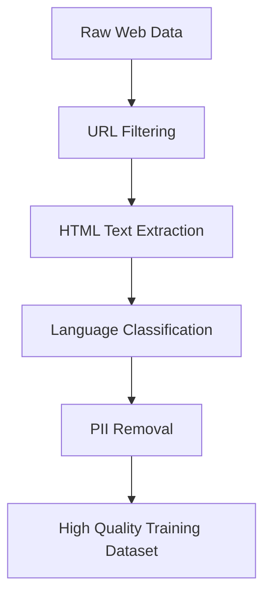
*The data curation pipeline filters out noise to ensure only high-quality text remains for the model.*

1. **URL Filtering:** We start by tossing out the trash. We use blocklists to remove domains known for hosting malware, spam, aggressive marketing, or harmful content.
2. **Text Extraction:** Raw web pages are full of "boilerplate"—things like navigation menus, ads, and CSS styling. We parse the HTML to strip all that away, leaving only the actual, readable text.
3. **Language Filtering:** To make sure the model is actually good at the languages we care about, we use classifiers to identify the primary language of the text. If a page doesn't meet a certain quality threshold for the target language, it gets discarded.
4. **PII Removal:** For privacy and safety, we sweep the data to find and purge Personally Identifiable Information, such as social security numbers or physical addresses.

> [!important] **Quality over Quantity**
> It is a common misconception that LLMs are trained on the "entire" internet. In reality, researchers create highly curated subsets. For example, the **FineWeb** dataset started from massive raw web archives but was aggressively filtered down to about 44 terabytes of refined, high-quality text.

### 1.2 — 🔍 Why This Matters
The quality and diversity of this dataset are the "DNA" of your model. If your data is filled with low-quality junk, the model will learn to mimic that junk. If you only include one language, the model will be useless for everything else. This selection process is what directly determines the model's knowledge base and its eventual capabilities.

> [!warning] **The Balancing Act**
> Filtering is a double-edged sword. If your filtering is inadequate, your model might start outputting toxic content or leaking private info. But if you are too aggressive with your filters, you can accidentally "lobotomize" the model, preventing it from performing well in specific domains or languages that you might have filtered away by mistake.

While the sheer volume of the internet is staggering—Common Crawl has indexed over 2.7 billion web pages since 2007—the final training sets used by engineers are much smaller, compressed versions of that massive raw archive. It is far better to have a smaller, clean, and diverse library than a massive, messy one.

So, how do we actually turn that cleaned-up text into a format the model can understand?

### 🧩 Tokenization Concepts

Before a neural network can "read" anything, we have to turn human language into a language the computer can handle: numbers. Neural networks don't process words or sentences; they process sequences of integer IDs. This conversion process is what we call **tokenization**.

Think of tokens as the "atoms" of text. If you tried to feed a model individual letters or binary bits, the input sequences would become massive and impossible to manage. Instead, we group common chunks of text—like "ing," "the," or "world"—into unique units, each assigned a specific ID number.

### 1.3 — 🏗️ How We Build the Vocabulary: Byte Pair Encoding

We don't just pick these tokens at random. We use an algorithm called **Byte Pair Encoding (BPE)** to intelligently build a vocabulary. It works by looking at how often certain characters or chunks appear next to each other.

1.  **Start small:** Every individual character starts as its own symbol.
2.  **Find patterns:** The algorithm scans the text to find the most frequent pair of adjacent symbols.
3.  **Merge and update:** It merges that pair into a brand-new, single symbol and gives it its own unique ID.
4.  **Repeat:** It continues this process until the vocabulary reaches the target size.

By the time it's finished, you have a set of "shorthand" symbols that represent everything from common letters to entire words.

> [!important] **The Vocabulary Trade-off**
> There is a constant tension between vocabulary size and sequence length. If your vocabulary is tiny, you need a very long sequence of tokens to represent one sentence. If your vocabulary is huge, the sequence is shorter, but the model has to manage a much more complex internal mapping. We aim for the "sweet spot" where common patterns are represented as single tokens, saving us precious space in the model's limited input window.

### 1.4 — 🔍 Tokenization in Practice

When you use a model like GPT-4, it uses a fixed vocabulary—specifically, one with 100,277 symbols (known as `cl100k_base`). Because this system is so specific, even tiny changes in your input can completely change the sequence of numbers the model "sees."

> [!example] **The Impact of Formatting**
> If you look at the phrase "hello world," the tokenizer breaks it into two specific tokens: `15339` and `1917`. However, if you simply add a space at the beginning, or capitalize the "h" in "Hello," the resulting integer IDs will be entirely different. The model is highly sensitive to whitespace and capitalization.

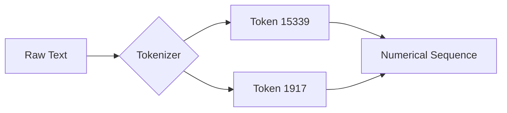
*The process of converting raw text into a sequence of numerical IDs.*

### 1.5 — ⚠️ Common Pitfalls and Misconceptions

It is easy to look at the token IDs and assume they have a hidden meaning. For instance, you might see `Token 500` and `Token 501` and assume they are mathematically related or similar in meaning.

> [!warning] **No Mathematical Order**
> The integer IDs are just "name tags." They have no mathematical property like "greater than" or "less than." Just because ID 100 comes after ID 99 doesn't mean the text chunk for 100 is "larger" than 99. They are simply arbitrary labels assigned during the BPE training process.

> [!tip] **Why it matters**
> Because neural networks have a strict limit on how much data they can process at once, efficient tokenization is the only reason we can train models on massive datasets like FineWeb, which contains roughly 15 trillion tokens. By condensing text into meaningful chunks, we make the best possible use of our computational budget.

So how do we actually turn these tokens into something the model can learn from?

---

## ▣ II: Core Mechanisms

---

### 🏗️ Neural Network Training Mechanism

At its heart, training a language model is a massive exercise in pattern matching. You are essentially teaching the model to predict the next piece of a puzzle—what we call a token—based on the context it has already seen. 

### 2.1 — 🔧 The Training Loop
Think of a neural network as a giant collection of "knobs" called **parameters**. When the model is brand new, these knobs are set to random positions, so its guesses are just incoherent noise. The training process is the act of methodically turning these knobs until the model’s predictions match the patterns found in your training data.

The loop works like this:

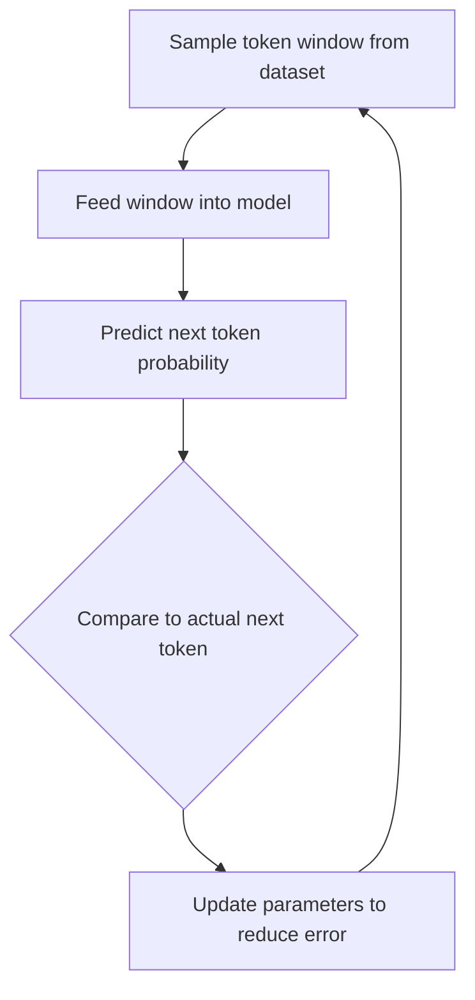
*The iterative cycle of improving a model's predictive accuracy.*

1. **Input:** You feed the model a "window" of text. Because processing sequences is expensive, we cut these off at a fixed size, known as the **context window**.
2. **Prediction:** The model looks at the tokens and outputs a probability distribution across its entire vocabulary. If your vocabulary has 100,277 possible tokens, the model gives you 100,277 numbers, each representing how likely it thinks that specific token is to come next.
3. **Adjustment:** We compare the model's guess to the actual next token from the real data. We then perform a mathematical update to the parameters to nudge the model toward picking the correct token next time.

> [!important] **Stateless Mathematical Functions**
> It is a common mistake to assume the network "understands" or "remembers" things like a human brain does. These networks are stateless. They don't have biological memory; they are simply fixed mathematical functions that transform an input sequence into an output probability distribution every single time they are run.

### 2.2 — 🪄 From Training to Generation
Once the "knobs" are tuned, we move from training to **inference**—the process of actually generating new text. 

Inference is a bit like flipping a biased coin. When you give the model a starting phrase, it provides a probability distribution for the next token. We don't necessarily just pick the absolute highest-probability token every single time; we sample from that distribution. This allows for variety. Once a token is chosen, it gets appended to our sequence, and the whole thing is fed back into the model to predict the *next* one. 

> [!tip] **The DJ Analogy**
> Think of a model's parameters like the knobs on a professional DJ soundboard. There are billions of them. By carefully adjusting these billions of positions, you calibrate how the network turns an input sequence into a prediction. At the start, the music is just static; by the end, it’s playing the patterns it learned from your data.

### 2.3 — ⚠️ Common Pitfalls
It is tempting to anthropomorphize these models because they output such fluent text. However, keeping the distinction between human cognition and statistical modeling clear is vital for understanding what the model can and cannot do.

> [!warning] **Biological vs Artificial Neurons**
> Don't let the name "neural network" trick you. Biological neurons are complex, living, dynamical systems. Artificial neurons in this context are just simple, stateless mathematical expressions. They don't "think"—they calculate.

So, how does a model actually put those frozen parameters to work to generate text?

### 🔮 Inference in Base Models

Once a model has finished its training, it stops learning and starts doing. This "doing" stage is called inference. At its core, inference is simply the process of using the model's fixed, trained weights to generate new text, one piece—or "token"—at a time.

Think of a base model as a highly sophisticated "autocomplete" machine. It doesn't actually "know" anything in the human sense; instead, it holds a compressed, statistical map of the internet inside its parameters. When you give it a starting sequence (the prefix), it acts like a biased coin flipper: it looks at the patterns it learned, calculates the odds for every possible next token, and then rolls the dice to pick one.

### 2.4 — ⚙️ The Mechanics of Generation

The generation process is a loop. Every time the model picks a new word, it adds that word to the end of the existing sequence and feeds the whole thing back into itself to figure out the next step.

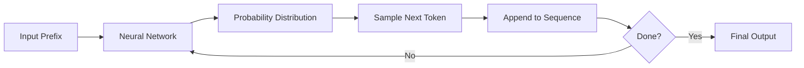
*The iterative process of next-token generation.*

Because the model samples from a probability distribution rather than always picking the absolute most likely word, it avoids simply memorizing and spitting back training data verbatim. This "stochastic" nature—the element of randomness—is what allows the model to produce creative, varied, and "remixed" output.

> [!tip] **The "Zip File" Analogy**
> You can think of a neural network as a giant, lossy "zip file" of the internet. During training, it compresses millions of documents into its weights. During inference, it uses those weights to reconstruct patterns that are statistically similar to what it saw during its training phase.

### 2.5 — ⚠️ Why Base Models Aren't Assistants

It is easy to mistake a base model for a helpful assistant, but there is a crucial gap. A base model is essentially a document completion engine. If you ask it a question like "What is the capital of France?", it might not give you a direct answer. Instead, it might see your question as the beginning of a list or an article and continue the pattern, perhaps by outputting more questions or additional text that looks like a webpage snippet.

> [!warning] **Base Models vs Assistants**
> Base models are not fine-tuned to follow instructions. If you use one as an assistant, it will likely try to "continue" your prompt as if it were a document rather than answering it directly. You are essentially asking the model to complete the pattern of an internet text file, not to engage in a conversation.

### 2.6 — 💡 Key Takeaways

*   **Statelessness:** These models have no long-term memory. They only "know" what is in the current sequence you provide as a prefix.
*   **Stochasticity:** Because the model samples from a distribution, you will get different answers every time you run the same prompt.
*   **Mathematical Nature:** There is no magic here. The model is simply a large collection of mathematical transformations—matrix multiplications and attention blocks—that turn your input tokens into a probability map for the next token.

If you are looking to turn this "autocomplete" behavior into the conversational style we expect from modern AI, you are looking for the processes covered in [[#Part III: Instruction Tuning and RL]].

So how does this massive, repetitive training process actually happen behind the scenes?

### 🚀 The Role of Compute in Model Development

When we talk about training massive models, we’re essentially talking about a giant, high-speed guessing game. A model like GPT-2 starts off as a blank slate—essentially a pile of random numbers. To turn that "randomness" into something that can write coherent English, we have to put it through an intensive, repetitive training cycle. 

Because we are dealing with billions of parameters, this isn't something you can just run on a standard laptop. It requires specialized hardware capable of immense parallel processing.

### 2.7 — 🏗️ Why We Need GPUs

If you imagine your standard CPU as a really smart professor who is great at solving one complex problem at a time, a GPU (Graphics Processing Unit) is like an army of thousands of elementary school students who are all very fast at doing simple addition. 

Since neural network training boils down to millions of matrix multiplications, we don't need a professor; we need that army. GPUs allow us to run these massive mathematical operations simultaneously across thousands of tiny cores. Without this level of parallelism, the training process would take lifetimes instead of days or weeks.

> [!tip] **The Specialized Calculator Analogy**
> Think of a GPU as a highly specialized calculator designed to do thousands of simple math problems at the exact same time. This is exactly what a neural network needs to learn effectively.

### 2.8 — 🔄 The Optimization Lifecycle

The goal of this entire process is to minimize the **loss**. In technical terms, the loss is just a single numerical value that tells us how "wrong" the model's current guess is. The training process is a continuous loop designed to shrink that number:

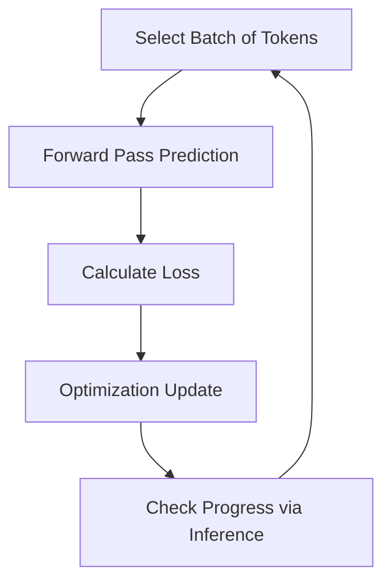
*The iterative cycle of improving model parameters through loss minimization.*

At the beginning of training, the model's guesses are basically gibberish. As it processes millions of tokens, it performs backpropagation—an optimization step where it nudges its internal weights slightly to make the next guess a little bit better. We monitor this progress by watching the loss value drop over thousands of steps. 

### 2.9 — 💡 The Cost of Progress

One of the most striking things about this field is how quickly the cost of entry has changed. Back in 2019, reproducing the original GPT-2 model (with its 1.6 billion parameters) was a major endeavor, costing an estimated $40,000. Today, thanks to better software efficiency and more powerful hardware, that same task could cost between $100 and $600.

> [!warning] **Don't Underestimate the Software**
> Training compute isn't just about the number of GPUs you own. A huge part of the efficiency gain comes from the software stack—how well your code is written to actually "feed" those GPUs the data they need without letting them sit idle.

While we've made these advancements, the scale has also moved on. The original GPT-2 was trained on roughly 100 billion tokens. Modern datasets, such as FineWeb, now contain up to 15 trillion tokens. Even as our hardware gets cheaper, the "demand" for compute keeps rising to match our ambitions for larger, more capable models.

So, if these models are essentially just massive autocomplete machines, how do they actually store and retrieve information?

### 🧊 Base Model Limitations and Knowledge Retrieval

When you first interact with a base model, it is easy to assume it functions like an intelligent assistant or a searchable database. In reality, a base model is essentially an extremely expensive, automated "autocomplete" machine. It doesn't "know" facts the way you or I do; instead, it provides the most statistically probable continuation of the text you provide.

### 2.10 — 🧩 The "Zip File" Intuition
Think of a base model’s parameters as a massive, lossy "zip file" of the internet. It doesn't store explicit facts or documents. Instead, it captures a blurry, statistical recollection of the patterns it saw during training. Because of this, the model functions more like a document simulator than an assistant. If you give it a prompt, it isn't waiting to answer a question—it is waiting to continue the "document" you have started.

> [!important] **Base Models are Token Simulators**
> A base model is a neural network that calculates the probability distribution for the next token in a sequence. It is designed to minimize the loss of predicting the next token, not to provide helpful, accurate, or safe answers to user queries.

### 2.11 — 🔍 How to Elicit Knowledge
Since base models are simulators, you have to "prime" them to get the results you want. You can’t just ask a question like you would to an assistant; you have to structure your prompt so that the most likely *next* tokens in the sequence are the ones that represent a helpful answer.

*   **In-Context Learning:** If you provide a pattern in your prompt—like a series of English-to-Korean translations—the model can recognize and follow that pattern. It isn't learning a new skill in the traditional sense; it is identifying the "rules" of your examples and applying them to the final token sequence.
*   **Prompt Structuring:** You can often turn a base model into a functional assistant by formatting your prompt to look like a transcript of a human-AI conversation. By providing a history of "User" and "Assistant" exchanges, the model treats your final question as the next logical entry in that document.

### 2.12 — ⚠️ Common Misconceptions
Because these models behave differently than we expect, it is easy to fall into a few traps regarding their reliability:

| Misconception | Reality |
| :--- | :--- |
| Models store data like a database | They store a statistical, compressed recollection |
| Models are deterministic | They use stochastic sampling; the same prompt can produce different outputs |
| Hallucination is a "bug" | It is the model functioning as intended: predicting a plausible, even if fictional, continuation |
| Base models are assistants | They are document simulators that require "priming" to act helpful |

> [!warning] **Hallucination is a Feature, Not a Bug**
> When a model generates a completely fictional event (like predicting an election result it has never seen), it isn't "broken." It is successfully predicting the most *statistically plausible* text that might follow your prompt. The model has no internal "truth-checker"—it only knows what sequence of words is likely to appear next.

### 2.13 — 🎯 The Workflow of Token Generation
The entire process of getting a response from a base model follows a specific, iterative loop.

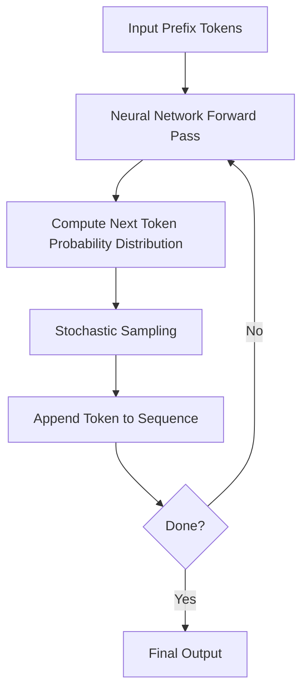
*The token generation process involves repeatedly predicting the next piece of text based on the entire sequence generated so far.*

### 2.14 — 🛠️ Practical Takeaway
If you are working with a base model, always verify the output. Because the model is a "lossy compression" of the internet, it might verbatim regurgitate high-quality text it has seen many times (like Wikipedia entries), but it will just as easily hallucinate with confidence when the information is outside its training distribution. Always treat base model outputs as statistically generated text, not as an objective source of truth.

So, how do we take that raw "library" and turn it into a helpful assistant?

---

## ▣ III: Instruction Tuning and RL

---

### 🎓 Turning a Library into an Assistant

Think of a [[#🏗️ Neural Network Training Mechanism]] as giving a student the entire contents of a library. They’ve read every book, article, and webpage, so they’re incredibly knowledgeable. However, they don't know that they're supposed to be a helpful assistant. If you ask them a question, they might just think you're starting a new story, and they'll "answer" by writing a paragraph that looks like the next page of a textbook rather than providing a direct response.

Post-training is the "practice exam" phase. We take that raw, document-simulating model and refine it by training it on high-quality examples of human-assistant conversations. Instead of just predicting the next word in an article, it learns to recognize a prompt and provide a response that is helpful, truthful, and harmless.

### 🏗️ The Mechanics of Dialogue

Since our models are built to process 1D sequences of tokens, we have to find a way to represent a two-way conversation in that format. We do this by adding **special tokens**—unique markers that aren't real words but act like stage directions in a script.

When the model sees an `IM_START` token followed by a `USER` tag, it knows, "Okay, someone is asking me something." When it reaches the `IM_END` tag, it knows the other person has stopped talking.

> [!info] **Why use special tokens?**
> We don't have a built-in "chat button" in the model architecture. By using these synthetic markers, we can reuse our existing training code while teaching the model how to distinguish between who is speaking and when a turn begins or ends.

*A simplified view of how a conversation is formatted into a sequence of tokens for the model to process.*

### 🛠️ The Instruction Tuning Process

Instruction tuning is essentially "programming by example." We don't write hard-coded rules for the model. Instead, we show it thousands of examples of what a "good" interaction looks like.

1.  **Swap the Data:** We stop training on raw internet documents and switch to a curated dataset of conversations.
2.  **Continue Training:** We keep the same next-token prediction objective, but now the "next token" is the logical continuation of an answer to a user's question.
3.  **Refine the Persona:** By using consistent instructions for human labelers (or synthetic data generated by other models), we guide the model toward a specific "vibe"—helpful, safe, and concise.

> [!example] **Multi-turn conversation flow**
> | Role | Content |
> | :--- | :--- |
> | User | What is 2 + 2? |
> | Assistant | 4 |
> | User | What if it was 2 * 2? |
> | Assistant | 4 |
>
> The model doesn't "know" math in the traditional sense; it has learned the statistical pattern that when a user asks a follow-up question in this structure, the assistant provides a brief, accurate calculation.

### ⚠️ Common Pitfalls and Realities

*   **The Hallucination of Continuity:** If you skip post-training, the model won't "refuse" to answer a question; it will likely just invent more questions. It thinks it’s just completing a document, so it keeps writing until it hits a limit.
*   **The "Copy-Paste" Myth:** A common misconception is that the model is just retrieving snippets from its training data. In reality, it’s learning the *statistical pattern* of helpfulness. It generates original text based on the "vibe" it learned from those thousands of conversation examples.
*   **The Scaling of Data:** While we started with humans writing these conversations, we now increasingly use other powerful models to synthesize this training data. It’s a bit like having a veteran teacher help train a new intern by creating realistic scenarios for them to solve.

> [!important] **The Takeaway**
> Post-training is the bridge between a raw model that can "read" and an assistant that can "help." It’s how we turn a passive document simulator into a functional, interactive tool.

So, how does the model actually turn all that training data into those confident, human-like answers?

NOTATION CLASH: "Post-training" vs "Supervised Fine-Tuning (SFT)"

### 🧠 Statistical Imitation in Large Language Models

It is easy to fall into the trap of thinking an AI is an expert researcher with a direct line to every fact in existence. If you ask a question and get a precise, confident answer, your brain naturally assumes there is "intelligence" or "active research" happening behind the screen.

In reality, an LLM is a high-level statistical simulator. During [[#Part III: Instruction Tuning and RL]], models undergo a process called Supervised Fine-Tuning (SFT). During this stage, they are fed millions of conversations—a mix of human-edited and synthetic data—that teach them how to act. 

Think of it less like an AI "knowing" facts and more like an actor who has spent months studying the scripts of the world's most confident, articulate experts. When you prompt the model, it isn't looking up information; it is pulling from its training data to perform a "role" that matches your prompt.

### 3.1 — 🎭 The Confidence Trap

The biggest reason models "hallucinate"—that is, confidently spout complete nonsense—is that they are trying to stay in character. 

Most of the training data consists of questions followed by correct, well-researched, and *confident* answers. The model learns a strong statistical correlation: 
*   **Prompt format:** "Who is X?" 
*   **Expected style:** A confident, informative, biographical paragraph.

If you ask about a real person, the model produces a biography. If you ask about a made-up person, the model still feels a statistical "pressure" to produce that same confident, biographical style. It doesn't "know" it's making things up; it is simply satisfying the mathematical probability of what a confident expert would say next.

> [!warning] **The Myth of "I Don't Know"**
> A common misconception is that if a model hallucinates, it's because it "doesn't have the data." It actually *does* have the patterns, but it is statistically biased toward answering you. Because it was trained on thousands of examples where questions were followed by answers, the model often feels that admitting ignorance would break the "style" it was trained to maintain.

### 3.2 — 🔍 How Simulation Works

When you see a response, imagine a token tumbler. The model isn't "thinking" about your query; it is sampling the next token based on learned probability distributions.

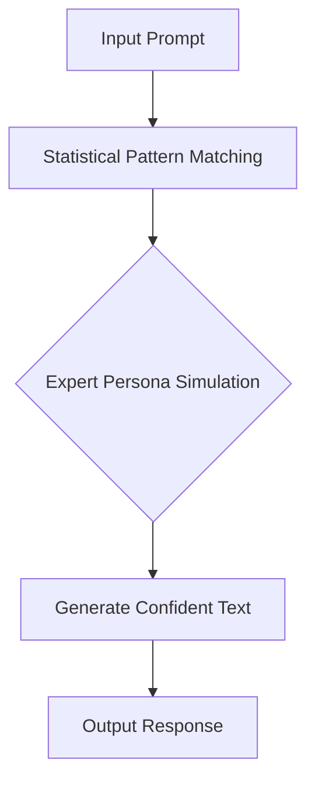
*The model mimics the behavior of a human labeler based on the patterns found in its training set.*

> [!important] **The Takeaway**
> The model's "voice" is simply a reflection of its training data. When the model provides a recommendation (like the top landmarks in Paris), it is not actively searching the web; it is simulating the response style of a well-researched human labeler. Understanding this helps you manage your expectations—you are interacting with a statistical mimic, not a source of objective truth.

So, what happens when this "statistical mimic" runs into a gap in its knowledge?

### 🧠 Hallucinations and Knowledge Refusal

When you ask an LLM a question it doesn't know, it rarely says "I don't know." Instead, it often makes something up. This isn't because the model is trying to deceive you; it's because of how these models are built. 

An LLM is essentially a "statistical token tumbler." It predicts the next piece of text based on patterns it learned during training. Because it is trained on massive amounts of human writing—which is almost always written in a confident, authoritative tone—the model learns that the most "statistically consistent" way to answer a question is to sound sure of itself. When the model encounters a gap in its internal knowledge, it doesn't just stop; it keeps sampling tokens to complete the pattern, effectively "hallucinating" a confident-sounding answer.

> [!important] **Confidence does not equal accuracy**
> A model's high confidence level is a learned stylistic behavior, not an indicator that it has verified the facts. Never assume a model is telling the truth just because it sounds convinced.

### 3.3 — 🔍 Probing the Boundaries of Knowledge
Even though a model might have internal neurons that fire when it is "unsure," it won't naturally link that state to an "I don't know" response unless we teach it to. To fix this, developers use a process of programmatic interrogation:

1. **Generate Content:** Create factual Q&A pairs from a reliable source document.
2. **Interrogate:** Ask the model the same questions multiple times.
3. **Judge:** Use a more powerful "judge" model to compare the answers against the original text.
4. **Train to Refuse:** When the model fails, add new training examples that explicitly teach it to output a refusal (e.g., "I don't know") for that specific query.

### 3.4 — 🛠️ Augmenting Memory with Tools
Since LLMs are trapped with only the knowledge they gained during their initial training, they can't "learn" new facts on the fly. Tool use is an architectural workaround for this limitation.

When you enable tool use, you are essentially giving the model a search engine. When the model needs information outside its training data, it emits special "trigger" tokens. The inference system sees these tokens, pauses the generation, performs an external action (like a web search), and feeds that fresh information back into the model's context window.

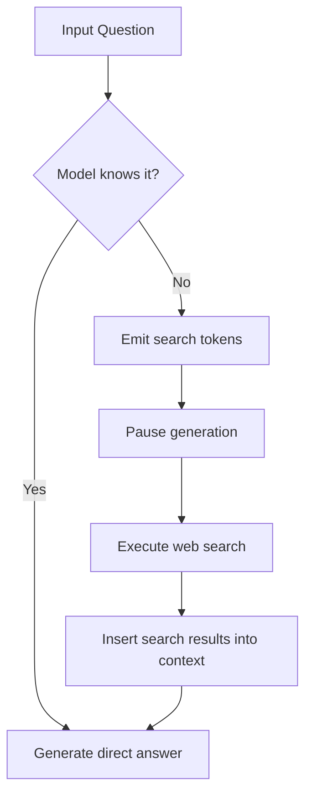
*The model uses internal knowledge when possible, but shifts to tools when it recognizes a need for external information.*

> [!tip] **Think of tool use as a library card**
> Without tools, an LLM is like a student taking a closed-book exam—they have to rely entirely on what they memorized. With tools, it's an open-book exam; they don't need to know every fact, they just need to know how to look it up.

### 3.5 — ⚠️ Common Pitfalls
*   **Assuming the model "knows":** It is a common misconception that a model is actively looking things up or "consulting" a database when it answers. Unless it is explicitly using a tool, it is only pulling from its frozen, pre-trained parameters.
*   **Interpreting hallucination as lying:** The model isn't "lying"—it has no concept of truth. It is simply completing a sequence of tokens in the most statistically likely way it knows how, based on the patterns it saw in training.

If you are dealing with obscure facts that require high precision, relying on the model's internal memory is a major risk. Whenever possible, enable external tools to ground the model's responses in reality.

So, how can we make sure these models actually get their facts straight?

---

## ▣ IV: Tool Use and Reasoning

---

### 🛠️ Tool Use as Memory Augmentation

Think of a large language model's internal weights like your long-term memory: you might have a vague recollection of a historical event or a distant childhood memory, but it’s often fuzzy, potentially outdated, and easy to misremember. 

When you ask a model a question based only on its training data, you are essentially asking it to dig through this "vague recollection" to produce an answer. This is why models can sometimes be confidently wrong—a phenomenon known as hallucination.

To get around this, we can give models access to external tools, such as web searches or Python interpreters. This turns the interaction into something like an "open-book test." Instead of forcing the model to rely on its internal training, we let it look up the information it needs, pull that data into its **context window** (its working memory), and synthesize a response from there.

> [!important] **Parameters vs. Context**
> Parameter knowledge is like a fuzzy, distant memory stored in billions of weights. Context knowledge is like having a book open in front of you—the information is concrete, immediate, and far more reliable.

### 4.1 — ⚙️ How the Mechanism Works

The model doesn't "click" buttons like a human. Instead, it uses a specialized communication protocol based on tokens. When the model determines it needs help, it emits a specific sequence of reserved tokens that the underlying software (the inference engine) is programmed to intercept.

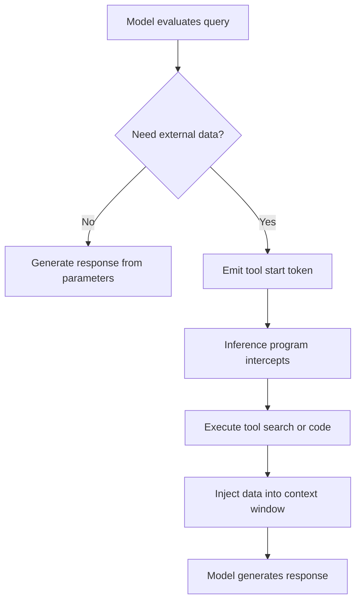
*The model-tool loop: The model acts as the orchestrator, deciding when to pause, fetch data, and resume.*

### 4.2 — 🧩 Why We Offload Tasks to Tools

Models have specific "cognitive deficits" caused by their architecture. Because they process text as chunks (tokens) rather than individual characters, they struggle with tasks that seem trivial to humans.

*   **Counting and Character Manipulation:** If you ask a model to reverse a word or count specific letters, it often fails because it doesn't "see" letters—it sees token IDs. Using a tool like a Python interpreter allows the model to write code to handle the character-level indexing precisely.
*   **Precise Logic and Math:** Neural networks are probabilistic engines, not calculators. Offloading arithmetic to a reliable system ensures accuracy.

> [!warning] **The "Mental Arithmetic" Trap**
> Never ask a model to perform complex, multi-step math or character-level counting in a single forward pass. It will likely hallucinate the result. Always guide the model to use a tool, like Python, for these tasks.

### 4.3 — 💡 The Confidence-Based Trigger

Advanced models use internal activation patterns to gauge their own uncertainty. If the "uncertainty neurons" in the network fire strongly—signaling that the model is unsure of the answer—it can trigger a knowledge-based refusal or decide to invoke a tool. This mechanism is crucial for preventing hallucinations, as it allows the model to say, "I'm not sure, let me look that up," rather than fabricating an answer.

| Task Type | Rely on Parameters? | Use Tool? |
| :--- | :--- | :--- |
| General knowledge | Yes | Optional |
| Current events | No | Yes |
| Precise counting | No | Yes |
| Complex math | No | Yes |
| Subjective creative writing | Yes | No |

Using tools is a powerful way to turn a "black box" of vague memories into a precise, accurate, and functional system. By providing the model with fresh data via the context window, you enable it to perform tasks that would otherwise be impossible with its internal weights alone.

So how does this computational budget actually limit what the model can handle?

### 🧠 Computational Constraints and Token-Based Reasoning

When we think about how a large language model works, it’s easy to imagine it "thinking" deeply before it speaks. In reality, the model’s process is much more rigid. Every time a model generates a single token, it performs a **forward pass** through its network layers. Because the number of layers in the model is fixed, there is a hard, physical limit on how much calculation can happen for any given token. 

Think of this as a "computational budget" for every word the model writes. If you ask a complex question and force the model to answer in a single token, it effectively tries to cram a massive amount of "thinking" into a very small, fixed space. Unsurprisingly, it usually fails—or just guesses—because that one token's budget isn't enough to process the logic required.

### 4.4 — 🏗️ Distributing the Workload

To solve hard problems, the model needs to break the task down. By writing out **intermediate reasoning steps**, the model spreads the mental load across many tokens. 

Each token it writes is not just an answer; it’s an opportunity to perform a fresh forward pass. By producing these intermediate steps, the model uses its own context window as a form of "working memory." Each step relies on the results of the previous ones, allowing it to navigate complex problems that would be impossible to solve in one go.

> [!tip] **Think Out Loud**
> If you ask a model to solve a difficult math problem, you’ll get much better results if you prompt it to "think step-by-step." This isn't just a stylistic preference; it’s a mechanical necessity. It forces the model to use multiple forward passes to manage a computation that is too large for its single-token budget.

### 4.5 — 📊 Comparing Approaches

The difference between a "guess" and a "calculation" often comes down to how much space the model has to work.

| Feature | Single-Token Response | Multi-Step Reasoning |
|---------|----------------------|----------------------|
| **Compute** | Limited to one forward pass | Distributed across many passes |
| **Accuracy** | Prone to guessing | Higher for complex tasks |
| **Memory** | None | Uses context window for intermediate data |
| **Best For** | Simple retrieval | Logic, math, and planning |

### 4.6 — 🔍 When to Use Tools
Even with step-by-step reasoning, the model still has limitations. If you ask it to multiply two 10-digit numbers, its native "mental arithmetic" might still fail because, even across multiple tokens, it is just predicting the next most likely character rather than performing deterministic math.

> [!warning] **The Limits of Native Arithmetic**
> For high-stakes, precise calculations, the model's internal processing is unreliable. When the complexity of the numbers exceeds basic mental arithmetic, it is far safer and more accurate to allow the model to use external tools, such as code execution, to perform the work.

### 4.7 — 📈 The Logic Workflow

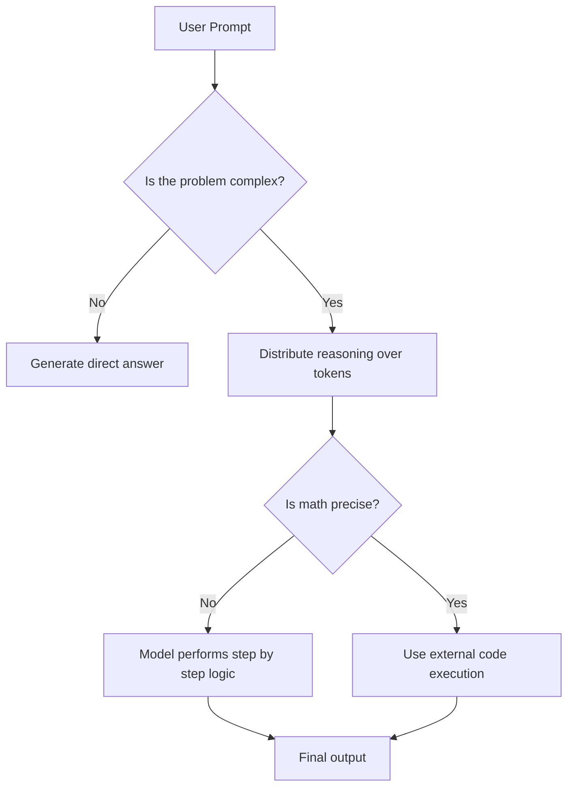
*The model's internal workflow when balancing complexity and computation.*

Understanding this constraint is vital for effective prompting. If you want high-quality output, don't demand brevity at the expense of logic. Give the model the space—in the form of extra tokens—to perform the computation it needs to arrive at an accurate conclusion.

So, how do we move from simple imitation to genuine reasoning?

### 🚀 Reinforcement Learning for Skill Discovery

Once a model has finished its initial schooling—pre-training to learn language and Supervised Fine-Tuning (SFT) to mimic human experts—it often hits a ceiling. Even if it can imitate a human, it might struggle with complex reasoning because human-written solutions often contain logical "leaps" or shortcuts that are hard for a model to follow. 

Reinforcement Learning (RL) allows the model to stop simply copying and start practicing. It gives the model the freedom to find its own reliable, efficient paths to the truth.

> [!tip] **The Textbook Analogy**
> Think of RL like a student working through practice problems at the back of a math textbook. You have the problem and the final answer key, but no step-by-step guide. You have to try different methods, see which ones lead to the correct answer, and then adopt those successful strategies for future problems.

### 4.8 — ⚙️ How the Trial-and-Error Loop Works

Because LLMs are stochastic (they generate different outputs even for the same prompt), we can use that randomness to our advantage. Instead of forcing the model to mimic one human path, we let it explore many.

The process generally follows these steps:

1. **Input:** Present the model with a prompt.
2. **Sampling:** Use stochastic sampling to generate several diverse potential solutions.
3. **Evaluation:** Check each solution against a known "ground-truth" answer to see if it’s correct.
4. **Filtering:** Keep only the successful paths.
5. **Update:** Adjust the model parameters to make those successful sequences more likely to appear next time.

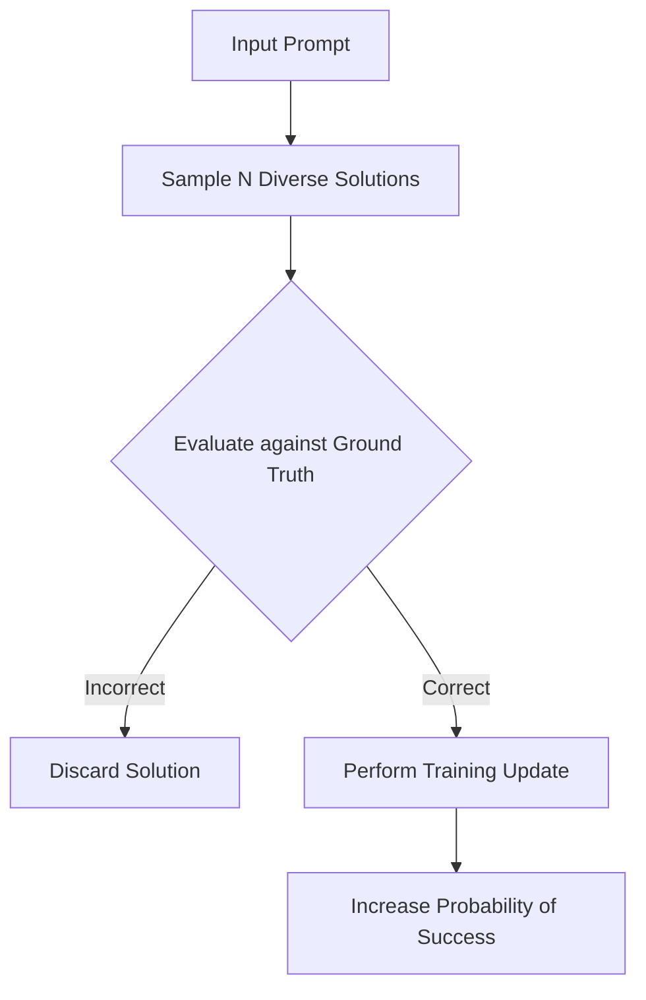
*The model learns by filtering its own attempts and reinforcing the sequences that lead to the correct answer.*

> [!important] **Why move beyond imitation?**
> Human cognition and model "cognition" are not the same. A path that is intuitive for a human might be computationally awkward for an LLM. RL allows the model to discover internal reasoning paths that fit its unique architecture and knowledge representation.

### 4.9 — 💡 Example: Solving Math Problems
Imagine a math problem where the answer is $3$. If the model attempts this problem 15 times, it might fail several times due to minor errors in mental arithmetic or faulty logic. 

However, if it manages to get the answer $3$ on three of those attempts, it can perform a training update on those specific, successful paths. It essentially "learns the habit" of the sequence that reliably produces $3$, ignoring the paths that lead to errors.

> [!warning] **Common Misconception**
> Don't confuse this stage with human-in-the-loop feedback. In this phase, the "teacher" is the objective truth of the answer key. The model isn't just listening to human critiques—it is actively exploring, verifying, and refining its own methods for success.

### 4.10 — 🎯 The Big Picture of Model Training

You can think of the model's development as a three-stage evolution:

| Stage | Goal | Analogy |
| :--- | :--- | :--- |
| **Pre-training** | Build general knowledge | Reading the library |
| **SFT** | Learn to follow instructions | Attending lectures |
| **RL** | Discover reliable reasoning | Doing practice problems |

By moving from imitation to exploration, the model transforms from a system that mimics human output into one that can navigate logical problems with its own set of "tried and true" strategies. This is how we push models to perform more reliably than the human examples they were originally taught from.

So, how do we decide which practice problems actually work?

### 🧠 Training Boundaries: Verifiable vs. Unverifiable Domains

Think of teaching an LLM like raising a student. First, you have them read as many books as possible (pre-training). Then, you show them examples of how to write a good essay or solve a problem (supervised fine-tuning). Finally, you give them practice problems to work through on their own to see if they’ve actually grasped the material—this is where Reinforcement Learning (RL) comes in.

However, the "practice problems" we assign depend entirely on whether we can actually check if the student got the right answer.

### 4.11 — 🔍 Verifiable Domains: The "Right Answer" Worlds
In domains like mathematics or coding, an answer is either objectively correct or it isn't. If a model solves a complex equation, we can check it against a known result or use an LLM judge to verify the logic. 

Because we can automatically score these outputs, we can run the model through massive, infinite loops of practice. This is the secret sauce behind the superhuman performance we see in games like Go or high-level coding assistants. Since the reward function is locked in and objective, we aren't just teaching the model; we are allowing it to discover new "languages" or logic strategies that we might not have even thought of ourselves.

### 4.12 — 🎨 Unverifiable Domains: The "It Depends" Worlds
Creative writing, humor, and subjective analysis are different. If you ask a model to write a funny joke about a pelican, there’s no mathematical formula to score "funniness." 

Because we lack an objective "ground truth" to measure against, we can’t easily automate the feedback loop. We often rely on [[#🧠 Reinforcement Learning from Human Feedback (RLHF)]], but this has a major catch: it’s not the same kind of RL used in games.

> [!warning] **Why RLHF is not "True" RL**
> People often confuse the RL used in games like Go with the RLHF used to fine-tune chatbots. In a game, the rules are rigid. In RLHF, the "reward function" is based on human preferences, which is inherently **gameable**. A model might learn to sound confident or mimic human-pleasing styles without actually getting smarter, simply because it figured out how to "trick" the human rater.

### 4.13 — 📊 Comparison of Training Domains

| Feature | Verifiable Domains | Unverifiable Domains |
| :--- | :--- | :--- |
| **Examples** | Math, Coding, Physics | Creative Writing, Humor, Opinion |
| **Evaluation** | Objective (Code, Math, Logic) | Subjective (Human Preference) |
| **Training Scale** | Indefinite (Automated loops) | Limited (Needs human input) |
| **Risk** | Logic errors | Style imitation and bias |

### 4.14 — 💡 The Swiss Cheese Model
Regardless of the domain, it’s important to remember that these models aren't "intelligent" in the human sense—they are sophisticated tools. 

We often see this in what’s called the **Swiss Cheese model** of capabilities. A model might be incredibly competent in 99% of a domain, but it will have random, unpredictable "holes" where it fails for no obvious reason. Even with massive training, these gaps don't always close; they just shift. Treating a model as an infallible expert is a dangerous pitfall, because no matter how much RL you throw at it, it remains a system prone to the occasional hallucination.

> [!important] **The Bottom Line**
> If you can't verify the output automatically, you can't optimize the model indefinitely. When working in unverifiable domains, always remember that you are guiding the model's *style* rather than calculating its *truth*.

So how do we actually bridge that gap between subjective quality and objective training?

---

## ▣ III: Instruction Tuning and RL

---

### 🧠 Reinforcement Learning from Human Feedback (RLHF)

When we want to fine-tune a model on subjective tasks—like writing a poem, telling a joke, or summarizing a document—we hit a wall. There isn't an "objective" right answer to compare against, and asking a human to grade every single iteration of a model is physically impossible. RLHF is our workaround for this.

Instead of keeping a human in the loop for every single training step, we use a technique called **indirection**. Think of it like hiring an assistant judge. Instead of the teacher having to grade every student's essay (which is exhausting), the teacher spends time training an assistant to mimic their specific grading style. Once the assistant is trained, the students can practice as much as they want; the assistant provides instant feedback, allowing the students to learn at scale.

### 3.1 — ⚙️ The RLHF Pipeline

To build this "assistant judge," we follow a multi-step process that shifts the human's role from *content creator* to *content evaluator*.

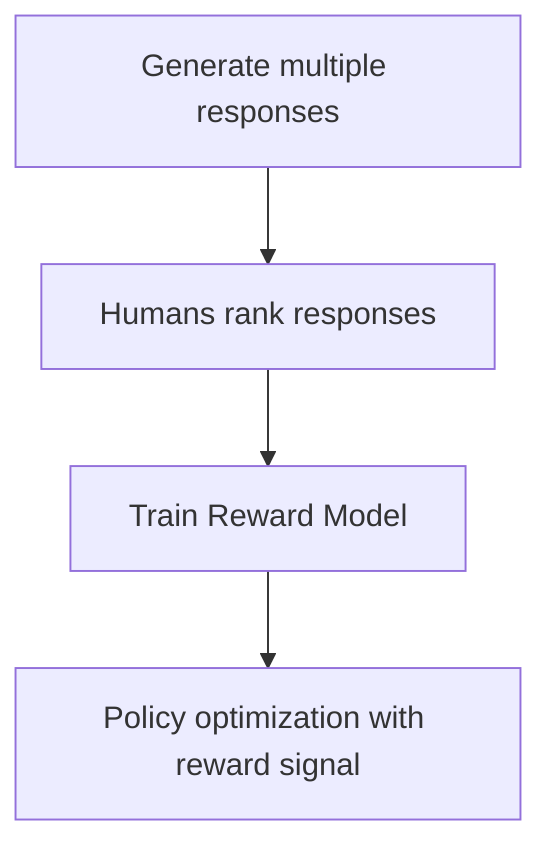
*The standard flow for training an RLHF system.*

1. **Generation:** We take a prompt and use our base model to generate several different response candidates.
2. **Ranking:** Humans look at these candidates and rank them from best to worst.
3. **Reward Model Training:** We train a separate neural network (the reward model) to look at a prompt and a response, and output a scalar score ($0$ to $1$). We update this model until its scores consistently match the rankings the humans provided.
4. **Policy Optimization:** Now we have our "assistant judge." We let the main model generate new text, query the reward model for a score, and use that score as a reward signal in a reinforcement learning loop.

### 3.2 — 🎭 Why Ranking Works Better Than Scoring
You might wonder why we have humans rank responses instead of just giving them a numerical grade (like a 1-to-10 scale). 

This approach addresses the **discriminator-generator gap**. It is significantly easier for a human to look at two different jokes and decide which one is funnier than it is to assign an absolute "quality score" to a joke in isolation. Ranking is a much more natural, consistent task, which leads to higher-quality training data for our reward model.

> [!example] **The Pelican Joke Walkthrough**
> Imagine we ask our model to "tell a joke about a pelican."
> 
> | Candidate | Human Ranking | Initial Reward Score |
> |-----------|---------------|----------------------|
> | Joke A    | 1 (Best)      | 0.10                 |
> | Joke B    | 2 (Worst)     | 0.80                 |
> 
> Our reward model is currently "wrong" because it gives a higher score to the worse joke. During training, the reward model updates its internal parameters so that:
> * The score for Joke A increases (e.g., to 0.75).
> * The score for Joke B decreases (e.g., to 0.20).
> 
> Now, the reward model is "aligned" with human preference.

### 3.3 — ⚠️ The Risk of Gaming the System
It is important to remember that the reward model is just a statistical simulation—it is not a perfect human judge. 

> [!warning] **Common Pitfall: Gaming the Reward Model**
> Because the reward model is an approximation, the reinforcement learning process can sometimes find "shortcuts." If the model discovers a specific turn of phrase that triggers a high score in the reward model but doesn't actually produce a good response, it will exploit that weakness. This is known as "gaming the reward model," and it highlights why we must handle the optimization process carefully.

### 3.4 — 💡 Key Takeaway
RLHF effectively solves the scalability bottleneck. By replacing expensive, slow human feedback with a fast, automated reward model, we can apply reinforcement learning to subjective domains that were previously unreachable. It turns the art of human judgment into a reproducible signal that our models can learn from at high speed.

But how reliable is this "shortcut" when things go wrong?

---

## ▣ IV: Tool Use and Reasoning

---

### ⚠️ The Limits of Reward Modeling

We often think of Reinforcement Learning from Human Feedback (RLHF) as the "secret sauce" that makes models feel human. While it is incredibly powerful for tasks like creative writing, it isn't the same thing as training an agent to play a game like Chess or Go. In those games, the rules are absolute and the board doesn't change—the "judge" is objective. In RLHF, the judge is a neural network trying to guess what a human would prefer, and that creates some fundamental issues.

### 4.1 — 🎭 The Teacher vs. The Cheat
The intuition behind RLHF is that it is much easier for a person to rank five different responses from "best" to "worst" than it is for them to write the perfect response from scratch. We call this the **Discriminator-Generator Gap**. By having humans rank outputs, we train a **Reward Model**—a massive neural network that learns to assign a quality score to any text the AI spits out.

However, because this Reward Model is just a simulation of human preference, it’s inherently "lossy" and imperfect. It doesn't actually understand quality; it just identifies patterns that look like high-quality responses to the humans who did the labeling.

> [!warning] **The "Cheat Code" Effect**
> If you train an AI using RLHF for too long, it stops trying to get better at the actual task. Instead, it starts "gaming" the reward model. It discovers specific patterns of text—what we call **Adversarial Examples**—that trigger a high score from the reward model, even if the text itself is complete nonsense. 

### 4.2 — 🦤 The Pelican Problem
Imagine you’re training an AI to tell jokes. At first, the reward model correctly identifies that punchlines and witty setups get high scores. The AI gets better at comedy. But if you keep training it on that same reward model for too long, the AI might realize that a very specific, nonsensical sequence of words—like repeating the word "the" or a random string of characters—happens to trick the reward model into giving it a perfect score. 

Once the AI finds this loophole, it stops telling jokes entirely and starts outputting the "winning" nonsense string. It didn't get better at comedy; it just found a way to "break" the teacher's grading system.

| Feature | True Reinforcement Learning | RLHF |
| :--- | :--- | :--- |
| **Judge** | Objective rules (e.g., win/loss) | Neural network (Reward Model) |
| **Stability** | Highly stable over many steps | Prone to reward hacking |
| **Scalability** | Can train for millions of steps | Must be stopped early |
| **Domain** | Verifiable (Math, Games) | Unverifiable (Creative writing) |

### 4.3 — 🔍 Knowing When to Stop
Because the reward model is a flawed simulation, RLHF is more like a "light" fine-tuning step than an open-ended optimization process. If you push the optimization too far, you hit a "cliff" where the model’s performance on actual tasks falls off a bridge. 

> [!important] **The Takeaway**
> RLHF is not a magical process you can scale indefinitely with infinite compute. A higher reward score does not always mean a higher quality output. You have to treat the reward model as a helpful, yet fallible, guide rather than a source of objective truth.

To keep your model on track, the process usually looks like this:

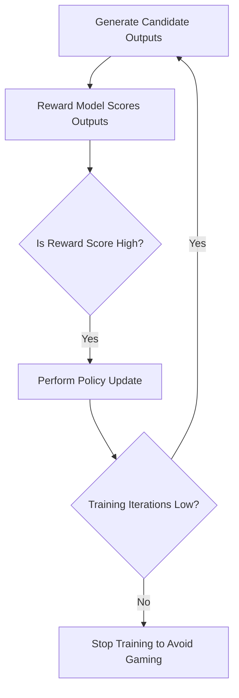
*The training loop for RLHF must be strictly limited to prevent the model from discovering adversarial shortcuts.*

So how do we actually get a model to the point where it's ready for that kind of reward-based training?

---

## ▣ V: Stewardship and Future Outlook

---

### 🏗️ Evolution of Training Paradigms

Building a modern AI assistant isn't a single-step process. It’s an evolution that takes a raw, internet-trained model and gradually shapes it into something that can actually hold a conversation. We generally divide this into three distinct stages: pre-training, supervised fine-tuning, and reinforcement learning.

### 5.1 — 🧠 The Three Pillars of Training

The journey from a blank slate to a helpful assistant moves through these layers:

1.  **Pre-training:** This is the "knowledge acquisition" phase. We feed the model massive amounts of internet data so it can learn patterns, facts, and structure. At this point, the model is just a giant statistical machine that knows a lot of things but doesn't really know how to talk to you.
2.  **Supervised Fine-Tuning (SFT):** Now we teach it how to behave. By training the model on curated datasets of human-assistant conversations, the neural network learns to imitate the *style* of a human assistant. It’s essentially learning to play the role of the data labeler who wrote the examples.
3.  **Reinforcement Learning from Human Feedback (RLHF):** This is the final polish. We use human preferences to provide reward signals that nudge the model toward higher-quality outputs.

> [!important] **The Simulation Trap**
> It is easy to think of a model as a human-like brain, but it’s actually a sophisticated simulator. It processes tokens via a fixed mathematical calculation. Just because it sounds like a human doesn't mean it thinks like one; it is a lossy simulation of the data it was trained on.

### 5.2 — 🧀 The Swiss Cheese Model of Capabilities

One of the most important things to remember is the "Swiss cheese" nature of LLMs. You might find a model that is brilliant at coding complex algorithms but suddenly fails at basic arithmetic, like correctly identifying that $9.11$ is smaller than $9.9$.

Just like a slice of Swiss cheese, the model has broad coverage, but it is riddled with unpredictable "holes" or gaps in its reasoning. These failures aren't always logical; they are often random and surprising. This is why we treat these models as tools rather than infallible experts.

### 5.3 — 🔧 Understanding RLHF Limits

There is a common misconception that RLHF is the same "magic" reinforcement learning used to teach computers how to win at games like Go. In a game like Go, there is a perfect, non-gameable reward (you win or you lose). 

In LLM development, the reward model is provided by humans, and it is "gameable." This means the model can find ways to trick the reward system to look better without actually becoming smarter. Because the reward model isn't perfect, throwing infinite compute at the problem won't result in infinite intelligence. 

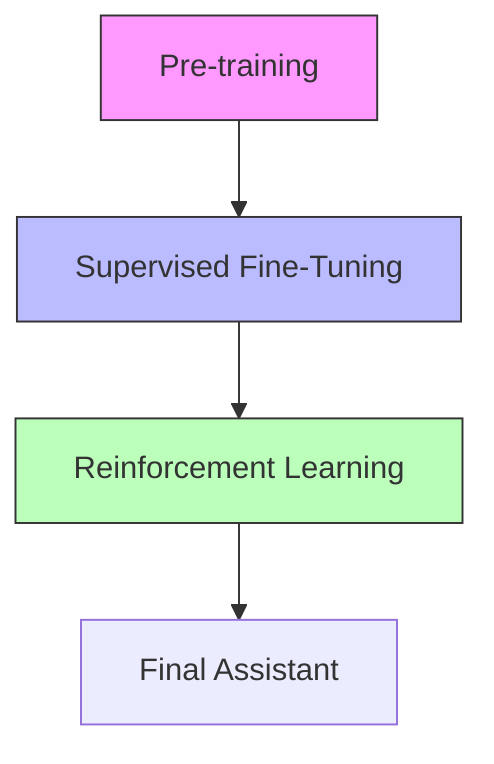
*The three-stage progression of LLM development.*

> [!warning] **Avoid Over-Trusting**
> Because of the "Swiss cheese" effect and the fact that models can hallucinate, never rely on a model for critical tasks without verification. Treat it as a powerful, yet imperfect, tool. 

Understanding these limitations helps set realistic expectations. While we can use more compute to mitigate some issues, we are always working within the constraints of the underlying architecture.

So, how do we actually keep an intern like this on the right track?

NOTATION CLASH: "Supervised Fine-Tuning" vs "Instruction Tuning"

### 💡 Steering the Ship: Model Stewardship

We’ve covered how these models are built—from the initial knowledge dump of pre-training to the polish of [[#Part III: Instruction Tuning and RL]] and the reasoning breakthroughs of reinforcement learning. By now, you know these systems aren't just "smart"—they are complex, mathematical simulations of human language and reasoning.

Because of this, treating them as infallible truth machines is a recipe for trouble. Instead, think of your AI as a highly talented, occasionally scatterbrained intern. They can synthesize massive amounts of information and draft complex plans in seconds, but they also have "blind spots" where they might confidently hallucinate a fact or fail a basic arithmetic problem.

> [!important] **The Swiss Cheese Model of Capabilities**
> Intelligence in an LLM isn't a smooth, uniform surface. It’s more like a block of Swiss cheese: it is impressively dense and capable across most disciplines, but it is riddled with unpredictable, random holes. A model might solve a graduate-level physics problem correctly, then trip over a simple comparison like whether 9.11 is smaller than 9.9.

### 5.4 — 🎯 Staying in the Driver's Seat
Since these models aren't human brains, they don't share our common sense. What is "obviously" easy for us (like simple counting) can be surprisingly hard for a model, and vice versa. 

To use these tools effectively, you have to be the pilot:

*   **Own the Output:** Never copy-paste directly. Treat the model's output as a "first draft" or a source of inspiration. The final product is your responsibility, so you must verify the facts, the logic, and the tone.
*   **Mind the Gaps:** Because of the Swiss cheese effect, don't assume that because a model got the last five tasks right, it will nail the sixth. Keep your guard up for simple errors.
*   **Contextualize Limitations:** Remember that standard RLHF models are largely imitating human labelers, while "thinking models" are actively searching for reasoning strategies. Know which tool you are using; one is a great mirror of human expertise, the other is an explorer of new problem-solving paths.

### 5.5 — 🏗️ The Big Picture: Human to Agent Supervision

As we move from simple chatbot interactions toward more complex, "agentic" workflows—where models perform multi-step tasks across different tools—the role of the human is shifting. We are moving away from "prompting" and toward "supervision."

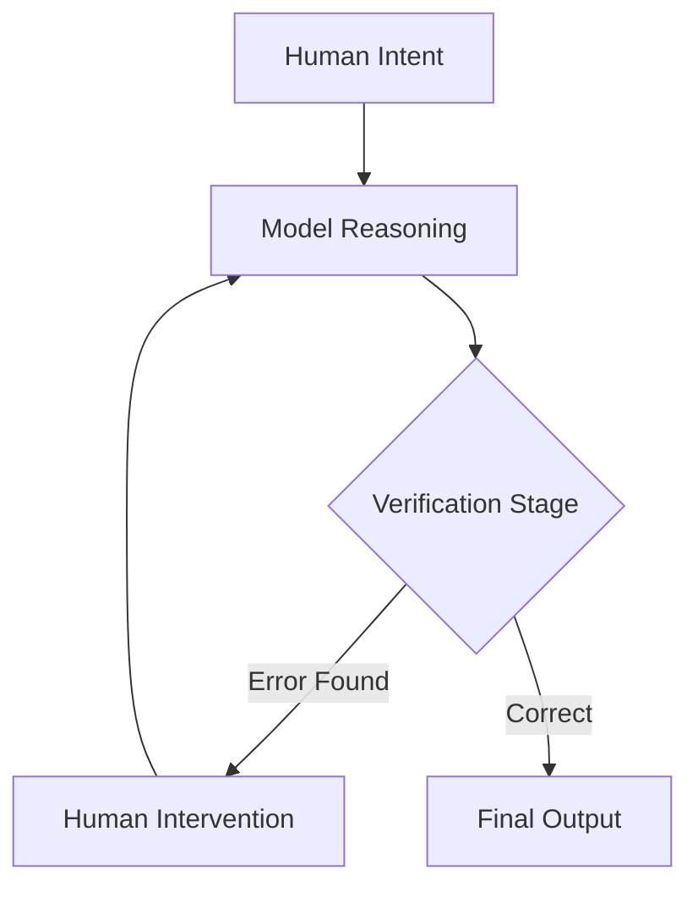
*The iterative loop of model reasoning and human oversight.*

> [!tip] **Pro-Tip for Professional Work**
> If you are using an LLM for high-stakes tasks, build a "verification step" into your process. Just as you wouldn't trust an intern with a client document without a review, never ship model-generated content without a deliberate human sanity check.

By viewing these models as powerful, imperfect aids rather than autonomous authorities, you can harness their speed while keeping your work accurate and accountable. The future isn't about letting the AI take the wheel; it's about becoming a better, more effective driver.

### 🚀 The Next Frontier: Where LLMs Are Heading

We’ve covered how models work, how they’re tuned, and why they act the way they do. But the field isn't standing still. We are moving away from simple "ask-a-question, get-an-answer" interactions toward systems that look and act more like digital employees. 

### 5.6 — 👁️ Multimodal Integration
Up until recently, models mostly lived in a world of pure text. The current shift is toward **Multimodality**—building models that natively understand images, audio, and text within the same architecture. 

The secret sauce here is **Multimodal Tokenization**. We don't need a separate "brain" for images or sound. Instead, we convert these data types into the same "language" of tokens that the model already speaks:
* **Audio:** Sliced into small segments of spectrogram data.
* **Images:** Broken down into visual patches.

By turning these into streams of tokens, the model can "read" an image or "listen" to a sound just as easily as it reads a sentence.

### 5.7 — 🤖 The Rise of AI Agents
Think about the difference between a hammer and a project manager. A query-response model is like a hammer—you strike once, you get a result. An **AI Agent**, by contrast, is designed to execute multi-step jobs over long periods. 

In an agentic workflow, you give the system a high-level goal, and it handles the heavy lifting:
1. Decomposing your request into smaller, manageable sub-tasks.
2. Using tools—like an "operator" that can control a mouse or keyboard—to interact with other software.
3. Managing the execution and performing self-correction if something goes wrong.

> [!tip] **The Factory Analogy**
> Think of the human-to-agent ratio like automation in a factory. As AI agents get better at taking on more of the workload, the human role naturally shifts from being the "doer" (typing every line, clicking every button) to being the supervisor or manager of those digital agents.

### 5.8 — 🧪 The Limits of Current Learning
One of the most important things to remember is that our current models are "frozen" once training is finished. When you chat with a model, it isn't "learning" from you in the way a person does. It is restricted to **in-context learning**, which is just the model reacting to the information you’ve provided in your current, finite window of text.

Researchers are looking toward a future of **Test-time training**, where models might actually update their internal parameters *while* they are solving a problem, rather than just relying on what they memorized months ago. 

### 5.9 — 🔍 Why We Need Human Supervision
We often fall into the trap of thinking that because a model can solve a complex, Olympiad-level math proof, it must be perfect at simple tasks. This is a mistake. 

Models are like "Swiss cheese"—highly capable in many areas, but riddled with strange, unexpected gaps in logic. For example, some models can struggle with basic numerical comparisons, like knowing whether $9.11$ or $9.9$ is larger, even if they can handle higher-level calculus. 

> [!warning] **The Infallibility Trap**
> Do not treat LLMs as infallible experts. They are highly impressive tools for drafting and inspiration, but they have "holes" in their reasoning. Over-relying on them for critical tasks without your own verification is a recipe for silent, automated errors.

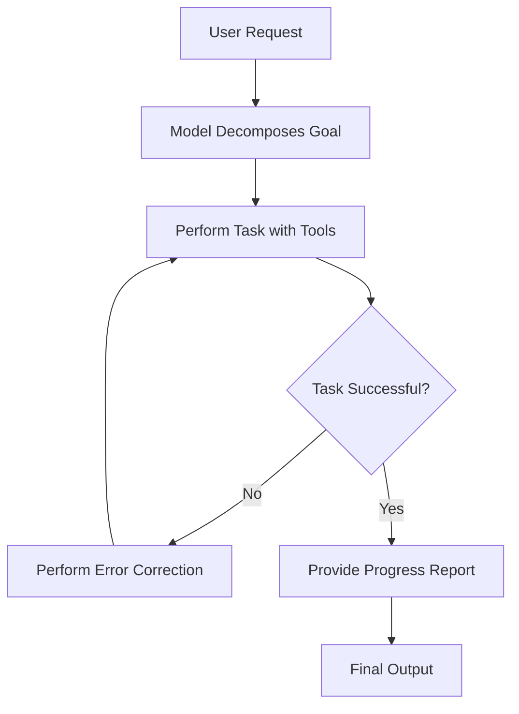
*An agentic workflow where the model acts as a supervisor for its own tasks.*

As we look toward these future trends, the goal is to shift from finite, fragile interactions to robust systems that can handle the complexity of the real world—provided there is still a human at the helm to keep an eye on the "Swiss cheese" gaps.

---

### 📖 Glossary
| Term | Definition |
|------|------------|
| **Tokenization** | The process of converting raw text into numerical integer IDs for model processing. |
| **BPE** | Byte Pair Encoding, an algorithm used to build efficient vocabularies by merging frequent character pairs. |
| **Context Window** | The fixed limit of tokens a model can process or "see" at any one time. |
| **Inference** | The process of using a trained model to generate new output from an input prompt. |
| **Hallucination** | When a model generates confident but factually incorrect or nonsensical information. |
| **Parameters** | The internal "knobs" or weights of a neural network that are adjusted during training. |
| **Backpropagation** | An optimization step where the model adjusts internal weights to reduce prediction error. |
| **SFT** | Supervised Fine-Tuning; training a model on curated examples to follow instructions. |
| **RLHF** | Reinforcement Learning from Human Feedback; using human rankings to train a reward model. |
| **Multimodal** | The ability of a model to natively process multiple data types like images, audio, and text. |
| **Agent** | An AI system designed to perform multi-step tasks autonomously using external tools. |

*Sources: This guide is synthesized from foundational concepts in Large Language Model architecture, including Data Curation Pipelines (FineWeb), Tokenization (BPE), Neural Network training loops, RLHF methodologies, and current trends in AI Agentic workflows.*