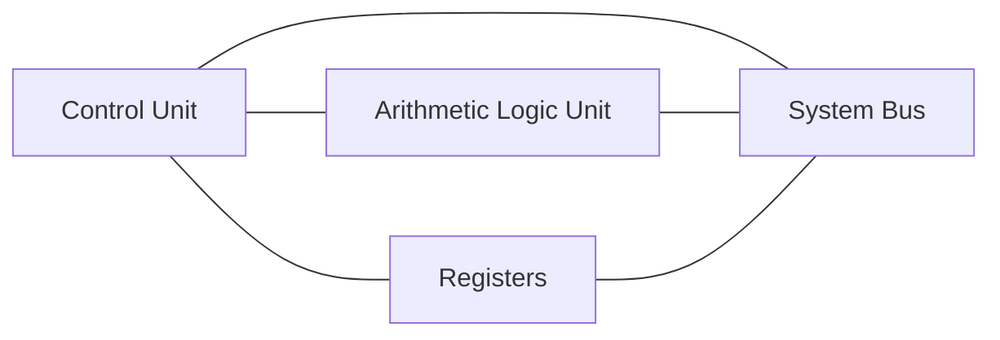
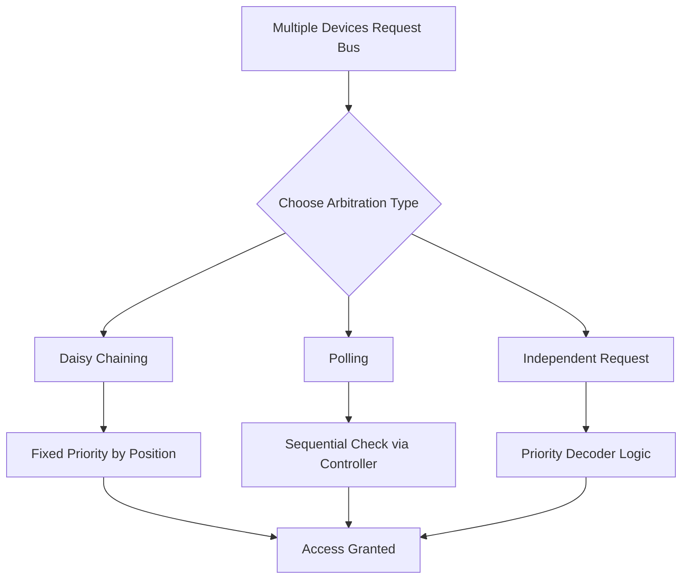
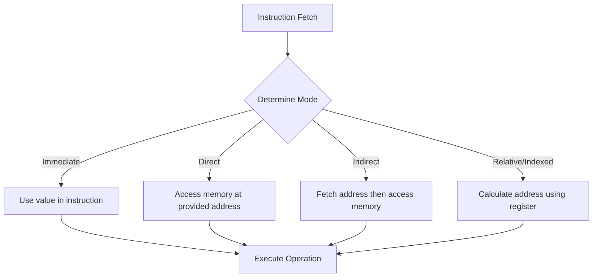

### 🗺️ Navigation

### Part I: Boolean Logic Fundamentals
- [[#🧩 Why Boolean Algebra is the Bedrock of Digital Logic]]
- [[#🔢 Core Ingredients]]
- [[#🛠️ From Algebra to Circuits – Switching Algebra]]
- [[#📚 A Tiny Worked Example]]
- [[#📖 Truth Tables – The “Spreadsheet” of Logic]]
- [[#🖥️ Fixed‑Program vs. Stored‑Program Computers]]
- [[#🚀 Bottom Line]]

### Part II: CPU Architecture
- [[#🏗️ Central Processing Unit Architecture]]
- [[#📦 Register Organization and Functionality]]

### Part III: System Communication and Bus Management
- [[#🚦 Bus Arbitration Mechanisms]]

### Part IV: Memory Access
- [[#🎯 Addressing Modes]]

---

## ▣ I: Boolean Logic Fundamentals

---

### 🧩 Why Boolean Algebra is the Bedrock of Digital Logic

Think of Boolean algebra as the “yes‑no” math that lets us turn abstract logic into real hardware.  
Every time a microcontroller decides whether to turn a light on or off, it’s secretly solving a tiny Boolean equation. Without this formal system we’d be guessing how to wire up gates instead of **designing** them.

> [!tip] **Intuition**  
> Instead of adding numbers, you’re combining truths: *True* ∧ *False* becomes *False*, just like a light switch that needs **both** power and a closed switch to glow.

---

### 🔢 Core Ingredients

| Piece | What it means |
|------|----------------|
| **Truth values** | Only two possibilities: 0 = False, 1 = True |
| **Variables** | Usually lower‑case letters (a, b, c) that stand for a truth value |
| **Primary operations** | Conjunction **AND** (∧), Disjunction **OR** (∨), Negation **NOT** (¬) |

These three operators are enough to express any logical condition you can imagine.  

> [!important] **Key Insight**  
> The whole universe of digital circuits can be built from just **AND**, **OR**, and **NOT** gates. Anything more complex is just a clever combination of these three.

---

### 🛠️ From Algebra to Circuits – Switching Algebra

Claude Shannon realized that the two‑valued world of Boolean algebra maps perfectly onto the two voltage levels in electronics (low = 0 V, high = 5 V).  
This mapping is called **switching algebra**: you replace each Boolean variable with a signal line, and each operation with a logic gate.

```mermaid
flowchart LR
    Expr[Boolean Expression] --> Gates[Logic Gates (AND, OR, NOT)]
    Gates --> Circuit[Physical Digital Circuit]
    Circuit --> Output[Digital Output (0 or 1)]
```
*Diagram: The path from a Boolean formula to a real hardware implementation.*

---

### 📚 A Tiny Worked Example

Suppose we have the Boolean expression  

$$
F = a \land \lnot b
$$

and we feed it the inputs `a = 1` (True) and `b = 0` (False).

| Step | Calculation | Result |
|------|-------------|--------|
| 1 | Negate b: $\lnot b = \lnot 0$ | 1 |
| 2 | AND with a: $a \land (\lnot b) = 1 \land 1$ | 1 |

So the circuit would output **1** (high voltage).  

> [!example] **Why this matters**  
> This tiny expression could be the condition that turns on a motor only when a safety switch (`a`) is engaged **and** an error flag (`b`) is **not** set.

---

### 📖 Truth Tables – The “Spreadsheet” of Logic

| a | b | a ∧ b | a ∨ b | ¬a |
|---|---|-------|-------|----|
| 0 | 0 | 0 | 0 | 1 |
| 0 | 1 | 0 | 1 | 1 |
| 1 | 0 | 0 | 1 | 0 |
| 1 | 1 | 1 | 1 | 0 |

These tables are the simplest way to verify that a gate does what you think it does.

> [!note] **Prerequisites**  
> You only need a bit of elementary algebra and basic logical reasoning to follow along.

---

### 🖥️ Fixed‑Program vs. Stored‑Program Computers

- **Fixed‑program computers** (e.g., calculators, washing machines, microwaves) have their Boolean logic hard‑wired. Their “program” is the physical arrangement of gates.
- **Stored‑program computers** (the modern von Neumann machines) keep the Boolean expressions in memory. By loading a new set of expressions, you instantly change what the hardware does.

> [!info] **General background**  
> This distinction underlies the leap from single‑purpose appliances to general‑purpose PCs, all thanks to the flexibility that Boolean algebra gives us.

---

### 🚀 Bottom Line

Boolean algebra gives us a clean, mathematically sound language for describing **every** decision a digital system can make. By mastering the three basic operations—AND, OR, NOT—you’ve got the keys to both simple embedded devices and the powerful, re‑programmable computers we use every day.  

Next up we’ll peek inside the **CPU architecture** to see how these logical building blocks become the brain of a computer.

So how do these logical building blocks actually turn into a machine that can follow instructions?

---

## ▣ II: CPU Architecture

---

### 🏗️ Central Processing Unit Architecture

At its core, a computer is just a machine that follows instructions. While a simple device like a microwave is a "fixed-program" machine—where its logic is permanently baked into its circuitry—a modern computer is a "stored-program" machine. Think of it like a blank notebook: it doesn't have one specific job; instead, you write instructions in its memory, and it follows them. 

The engine that makes this possible is the CPU, which acts as the brain, coordinating everything from memory access to complex calculations.

### 2.1 — 🧩 The Three Core Components

To turn raw data into meaningful output, the CPU relies on three main parts that work in a tight loop:

1.  **The Control Unit (CU):** This is the conductor of the orchestra. It doesn't perform calculations itself, but it generates the signals that tell the other components what to do, like moving data between memory and registers or selecting which instruction to run next.
2.  **The Arithmetic Logic Unit (ALU):** This is the heavy lifter. It performs the actual math (addition, subtraction) and logical comparisons (like checking if one value is greater than another).
3.  **Registers:** These are tiny, lightning-fast storage spots inside the CPU. They hold the data that the ALU is working on right now, acting as a workspace for the processor.

> [!tip] **The Workflow**
> You can think of the CPU's operation like a cook in a kitchen. The registers are the cutting board where ingredients are prepped, the ALU is the stove where the cooking happens, and the control unit is the head chef giving orders on what to prep and where to move the final dish.

### 2.2 — 🚌 Connecting the Pieces

These components don't exist in a vacuum; they talk to each other and the rest of the computer via buses. You can think of a bus as a shared highway for information:

*   **Address Bus:** This tells the system *where* the data is located (which memory address or device).
*   **Data Bus:** This carries the actual *information* being moved.
*   **Control Bus:** This carries the *commands* or functional codes that tell devices whether to read or write data.


*The CPU components communicate with the rest of the system via the shared system bus.*

Because multiple devices often try to use this "highway" at the same time, we need a way to keep things orderly. If two devices try to put information on the data bus at once, the result is corrupted data and system failure. This is why we use **bus arbitration** to manage access—it ensures that only one device talks at a time, keeping the system stable.

> [!important] **The Power of Stored Programs**
> The transition from fixed-program hardware (like a calculator) to stored-program architecture is what allowed us to move from calculators to general-purpose computers. Because the "program" is just data stored in memory, we can swap out what the computer does just by loading new instructions, rather than needing to rebuild the physical hardware.

So, how does the system actually manage that traffic to keep things running smoothly?

---

## ▣ III: System Communication and Bus Management

---

### 🚦 Bus Arbitration Mechanisms

When multiple devices—like disk drives, network cards, or the CPU itself—need to use the system bus at the same time, we hit a traffic jam. If everyone tries to talk on the bus simultaneously, the signals will collide, leading to data corruption and system crashes. 

Bus arbitration is the "traffic cop" that decides which device gets to use the bus next, ensuring only one device transmits at a time. Without it, the computer simply couldn't handle multi-device communication.

### 3.1 — ⛓️ Daisy Chaining
In a daisy chain, the bus grant signal travels from device to device in a specific, physical order. The signal starts at the first device and moves down the line. If a device has a pending request, it grabs the signal and stops it from traveling any further. This makes the device physically closest to the CPU the highest priority, as it gets the first chance to "grab" the signal.

> [!important] **The First-Come, First-Served Catch**
> The device closest to the source of the grant signal will always have the highest priority, regardless of how urgent other requests might be.

### 3.2 — 📋 Polling
Polling works a bit like a roll call. Instead of a signal propagating down a chain, a central controller sends out a sequence of addresses on a dedicated set of lines. Each device checks to see if its address matches the one being called. When a device sees its own address and has a pending request, it signals back to the controller that it is busy, effectively claiming the bus.

> [!note] **System Limits**
> The number of address lines used by the controller dictates the maximum number of masters the system can support. For example, $n$ lines can support $2^n$ unique device addresses.

### 3.3 — 🎯 Independent Request
This is the most flexible approach. Every device has its own dedicated bus request and bus grant line connected directly to the controller. Because the controller receives a separate signal from everyone, it can use a priority decoder to decide in real-time which device should go first. It’s essentially a "VIP line" system where the controller can make smarter decisions about who gets to go, rather than just waiting for a signal to arrive.

| Mechanism | Priority Logic | Wiring |
|-----------|----------------|--------|
| Daisy Chaining | Determined by physical position | Simple serial daisy chain |
| Polling | Determined by polling sequence | Requires address lines |
| Independent Request | Determined by priority decoder | Dedicated lines per device |

### 3.4 — 🔍 Choosing the Right Approach
When designing or analyzing a system, you have to choose how to resolve these conflicts. 


*The process flow for managing bus contention across different arbitration architectures.*

> [!warning] **System Stability**
> Failing to implement these mechanisms leads to data integrity loss. Think of the bus as a single-lane road—arbitration is the stoplight that prevents the "collision" of electrical signals, which would otherwise scramble your data beyond repair.

So, how do these internal registers actually use that same highway to talk to the rest of the processor?

NOTATION CLASH: "Arbitration mechanisms" vs "binary selection variables"

---

## ▣ II: CPU Architecture

---

### 📦 Register Organization and Functionality

Registers are the CPU's "scratchpad." Think of them as high-speed storage spots right inside the processor. Because the ALU—the part of the chip that actually does the math—can't talk directly to your main memory, these registers act as the essential middleman.

### 2.1 — 🏗️ The Hub of CPU Operations

The CPU is essentially a master traffic controller. To keep everything moving, it uses a common bus to connect registers, memory, and the ALU. Since you can't have multiple pieces of data clashing on the same "highway" at once, we use binary selection variables ($S_2, S_1, S_0$) to decide exactly which register gets to "put its data on the bus" at any given moment.

> [!info] **General background, not covered in this specific source**
> Registers are usually built using flip-flops, which allow them to hold binary data ($0$s and $1$s) as long as the power is on.

### 2.2 — ⚙️ Specialized Roles
Each register has a specific job:
*   **Memory Address Register (AR):** Holds the address of the memory location we are talking to. In this architecture, it is $12$ bits wide.
*   **Program Counter (PC):** Keeps track of the address of the next instruction, also $12$ bits wide.
*   **Accumulator (AC):** This is the go-to workspace for the ALU. When the ALU performs an operation, the result typically lands here before going anywhere else.
*   **Instruction Register (IR):** Holds the actual instruction currently being executed.
*   **Input/Output Registers (INPR/OUTR):** These handle data moving to and from the outside world. Note that INPR can send data to the bus, but OUTR is a one-way street—it only accepts data from the bus and cannot send it back.

### 2.3 — 💡 Why the Accumulator Matters
It is a common mistake to think the ALU can reach out and grab data straight from your RAM. It can't. The ALU only works with data already sitting in registers. The accumulator is the designated "landing zone" for these intermediate calculations. Without it, the ALU would have nowhere to store the results of its work while it waits for the next step.

> [!important] **The Flow of Data**
> To get a calculation done, the system follows a specific routine:
> 1. Move data from **Memory** to a **Register**.
> 2. Move that data from the **Register** to the **ALU**.
> 3. Perform the **Operation**.
> 4. Send the result back to a **Register** (usually the AC).
> 5. Finally, move that result back to **Memory** if needed.

### 2.4 — 🔧 Register Control
Registers aren't just passive storage; they are active components. Most of them support three specific operations to keep the workflow moving:
*   **LD (Load):** Bring new data into the register.
*   **INR (Increment):** Add one to the current value (essential for the Program Counter).
*   **CLR (Clear):** Reset the register to zero.

### 2.5 — 🔍 A Practical Example
Imagine the system is configured with selection variables set to $S_2S_1S_0 = 011$. In this scenario, the CPU is effectively "tuning in" to the Data Register (DR). The 16-bit content of that register is placed directly onto the bus lines so other components can read it.


*The basic lifecycle of data movement within the CPU.*

> [!warning] **The One-Way Street**
> Remember that the output register (OUTR) is strictly for sending data to an output device. There is no path for data to travel from the OUTR back into the CPU's internal registers. If you need that data again, you have to keep it in the Accumulator or another register before sending it to the output.

As we move forward, we will see how these components coordinate through [[#🚦 Bus Arbitration Mechanisms]] to ensure that multiple parts of the computer don't try to send data to the bus at the exact same time.

So, how does the CPU actually find the data it needs to move around?

---

## ▣ IV: Memory Access

---

### 🎯 Addressing Modes

When you're writing code, you need a way to tell the CPU exactly where the data you're working on is hiding. Addressing modes are essentially the different "instructions" we give the processor to find that data. Some modes are fast and simple, while others are flexible enough to handle complex data structures like arrays or global variables.

### 4.1 — ⚡ Simple Ways to Find Data

The most straightforward way to get data is **Immediate Mode**, where the actual value is baked right into the instruction itself. For example, if you see `ADD 3`, the CPU takes the number 3 and adds it to the accumulator. It's incredibly fast because the CPU doesn't have to go hunting in memory—the data is already there. The downside? You are limited by how much space you have in the instruction, and you can't use this if your data is a variable that changes value while the program runs.

**Direct Mode** is a bit more descriptive. Instead of the data itself, the instruction holds the memory address where the data lives. 

> [!warning] **The Limitation of Direct Addressing**
> Direct addressing can be a bottleneck. Because your instruction size is limited, you can only address a small, fixed number of memory locations, which makes it tough to work with large, complex calculations.

### 4.2 — 🔍 The Scavenger Hunt: Indirect Addressing

Sometimes, an address isn't a final destination. In **Indirect Mode**, the instruction gives you a memory address, but when you go there, you don't find your data—you find *another* address. That second address points to the actual data. 

Think of it like a scavenger hunt: your instruction gives you a slip of paper with a location. You travel there, but all you find is another note telling you the *real* location of the treasure. It takes two trips to memory, so it's slower than direct addressing, but it provides a way to handle dynamic pointers.

### 4.3 — 🏗️ Flexible Addressing for Dynamic Data

As programs get larger, we need ways to move code around in memory without breaking everything. **Base Register** addressing solves this by using a formula to find the data.

$$\boxed{Effective\ Address = Base\ Address + Offset}$$

The Base Register acts like a starting point (like a park), and the instruction provides an offset (like "5 miles past the park"). If you need to move the entire program to a different area of memory, you only need to update the Base Register—you don't have to change every single instruction in your code.

We use a similar logic for arrays with **Index Addressing**. Here, the instruction points to the base of the array, and an Index Register holds the specific offset. By simply changing the number in the Index Register, you can loop through every element in an array using the same, identical instruction.

### 4.4 — 📚 The Memory Stack

The stack is a special, high-speed way of organizing memory that follows a **LIFO** (Last-In, First-Out) principle—much like a physical stack of plates. The last plate you put on top is the first one you have to pick up.

The CPU keeps track of this with a **Stack Pointer (SP)**, which is a register that always holds the address of the "top" plate. Because the SP is limited by the architecture (for example, a 6-bit SP can only address up to 63), we use 1-bit flags called "Full" and "Empty" to keep an eye on whether the stack has room for more or is ready to be cleared.


*The process of finding an operand based on the chosen addressing mode.*

### 4.5 — 🛠️ Quick Comparison

| Mode | Speed | Memory Accesses | Best Use Case |
| :--- | :--- | :--- | :--- |
| Immediate | Very Fast | 0 | Constants |
| Direct | Fast | 1 | Simple variables |
| Indirect | Slow | 2 | Pointers and dynamic addresses |
| Indexed | Moderate | 1 | Arrays and lists |

> [!tip] **Efficiency Note**
> If you are working with continuous data like a matrix or a long list, keep an eye out for **Register Indirect** mode. Many CPUs allow auto-increment or auto-decrement on the register, which makes jumping through that data much faster than having to manually reset the offset every single time.

---

| Term | Definition |
|------|------------|
| **ALU** | The Arithmetic Logic Unit, responsible for performing math and logical comparisons. |
| **Bus** | A shared communication pathway used to transfer data between CPU components. |
| **Bus Arbitration** | A method of managing access to a bus to prevent data collisions between devices. |
| **Control Unit** | The CPU component that acts as a conductor, generating signals to coordinate other parts. |
| **Daisy Chaining** | An arbitration method where bus grant signals pass sequentially through devices based on physical position. |
| **Immediate Mode** | An addressing mode where the data value is embedded directly into the instruction. |
| **Indirect Addressing** | A memory access technique where the instruction points to an address containing the actual target address. |
| **LIFO** | A "Last-In, First-Out" memory structure where the most recently added item is the first to be retrieved. |
| **Polling** | An arbitration method where a controller sequentially checks each device for bus requests. |
| **Registers** | Small, high-speed storage locations inside the CPU used for active workspace. |
| **Switching Algebra** | The application of Boolean algebra to electrical circuits using voltage levels. |

*Sources: Introduction to Digital Logic and Computer Architecture (2024 Course Materials)*