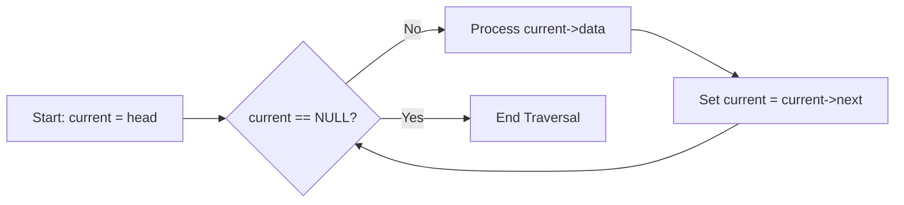
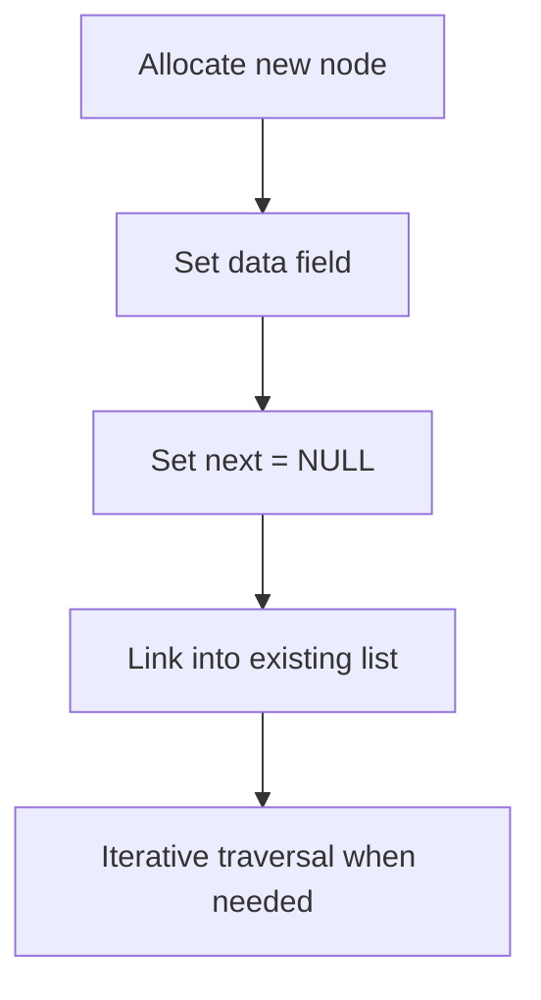
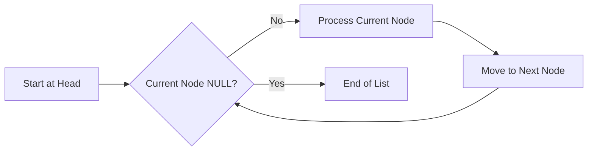
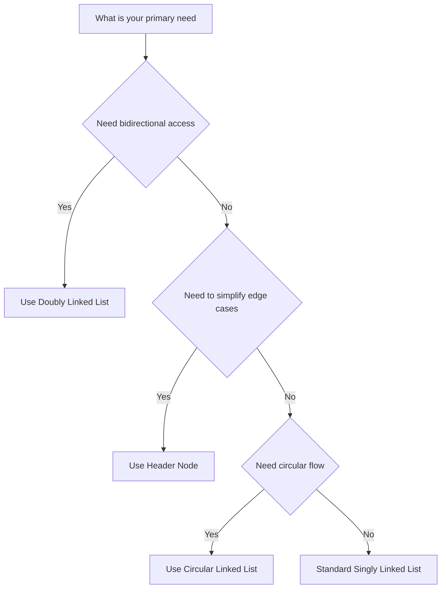

### 🗺️ Navigation

### Part I: Fundamentals of Linked Lists
- [[#🏗️ Fundamentals of Singly Linked Lists]]
- [[#1.1 — The Building Block: a Node]]
- [[#1.2 — Memory Allocation – “Pulling a Node Out of Thin Air”]]
- [[#1.3 — Traversing the List – Iterative Walk]]
- [[#1.4 — Worked Example: Build & Walk a 3‑node List]]
- [[#1.5 — Common Pitfalls]]
- [[#1.6 — Why It Matters]]

### Part II: Core Operations
- [[#📝 Linked List Operations]]
- [[#Traversal Flowchart]]
- [[#2.2 — Insertion and Deletion]]
- [Reversal](#reversal)
- [[#2.4 — Circular Linked Lists]]
- [[#2.5 — Header Linked Lists]]
- [[#2.6 — Key Insights]]
- [[#1.6 — Why It Matters]]

### Part III: Structural Variations
- [[#🍃 Linked List Variations]]
- [[#3.1 — 🏠 The Header Node: Your Permanent Anchor]]
- [[#3.2 — 🎡 Circular Lists: The Ferris Wheel]]
- [[#3.3 — ↔️ Doubly Linked Lists: Two-Way Traffic]]
- [[#3.4 — 🔍 A Curious Recursive Pattern]]
- [[#3.5 — 🏗️ Choosing Your Structure]]

### Part IV: Applications
- [[#🧩 Representing Math with Linked Lists]]
- [[#4.1 — 💡 Why this approach works]]
- [[#4.2 — 📝 Concrete Examples]]

---

## ▣ I: Fundamentals of Linked Lists

---

### 🏗️ Fundamentals of Singly Linked Lists

A singly linked list is a **dynamic** linear structure made of *nodes*.  
Each node holds two things:

1. **Data** – whatever you want to store (an `int`, a struct, etc.).  
2. **Next pointer** – the memory address of the following node, or `NULL` if it’s the last one.

Because the nodes are linked by pointers rather than sitting in a contiguous block, the list can grow or shrink without needing a big pre‑allocated array.

### 1.1 — The Building Block: a Node

In C a node is usually declared like this:

```c
struct node {
    int data;
    struct node *next;
};
```

- `data` is the information part.  
- `next` is the *pointer* that tells you where the next node lives.  

The **head pointer** is a separate variable that stores the address of the first node.  
If the list is empty, the head is set to `NULL` – we call that a **null list**.

### 1.2 — Memory Allocation – “Pulling a Node Out of Thin Air”

Nodes aren’t static; they’re created at run‑time with `malloc` (or similar).  
The steps are:

1. Ask the heap for enough bytes for a `struct node`.  
2. Fill the `data` field.  
3. Initialise `next` to `NULL` (so the new node stands alone).  
4. Return the address so the caller can link it in.

Because we’re dealing with raw pointers, we have to **free** a node when we’re done; otherwise we get a memory leak.

### 1.3 — Traversing the List – Iterative Walk

The only way to reach a node that isn’t the head is to *follow the chain*:

1. Set a temporary pointer `current` to `head`.  
2. While `current` is not `NULL`:  
   * Process `current->data` (e.g., print it).  
   * Move `current` to `current->next`.  

This is called **Iterative Traversal**. It’s linear, so the time cost is proportional to the list length:

$$\boxed{\,\text{Time Complexity for Access (traversal)} = O(n)\,}$$

#### Traversal Flowchart


*Figure 1: How a simple while‑loop walks through a singly linked list.*

### 1.4 — Worked Example: Build & Walk a 3‑node List

Let’s create a list containing the values **10 → 20 → 30 → NULL** and then print them.

> [!example] **Step‑by‑step construction**
> 1. **Allocate node1**  
>    ```c
>    struct node *node1 = malloc(sizeof(struct node));
>    node1->data = 10;
>    node1->next = NULL;
>    ```
> 2. **Allocate node2** and link it after node1  
>    ```c
>    struct node *node2 = malloc(sizeof(struct node));
>    node2->data = 20;
>    node2->next = NULL;
>    node1->next = node2;      // link
>    ```
> 3. **Allocate node3** and link it after node2  
>    ```c
>    struct node *node3 = malloc(sizeof(struct node));
>    node3->data = 30;
>    node3->next = NULL;
>    node2->next = node3;      // link
>    ```
> 4. **Set head** to the first node  
>    ```c
>    struct node *head = node1;
>    ```

Now traverse and print:

```c
struct node *current = head;
while (current != NULL) {
    printf("%d ", current->data);
    current = current->next;
}
```

**Output**

```
10 20 30 
```

> [!tip] **Why insertion feels cheap**  
> Once you have a pointer to the node *before* the insertion point, you only need to adjust two `next` pointers. That’s why insertion or deletion at a known position is **O(1)** – no shifting of elements like in an array.

### 1.5 — Common Pitfalls

> [!warning] **Watch out for these bugs**  
> - **Memory leaks** – forgetting to `free` a node after deletion leaves unreachable heap memory.  
> - **Segmentation faults** – dereferencing a `NULL` pointer (e.g., using `current->data` when `current` is `NULL`).  
> - **Pointer mismanagement** – if you overwrite a node’s `next` before saving the original address, the rest of the list disappears forever.

### 1.6 — Why It Matters

> [!note] **When to reach for a linked list**  
> - The number of elements isn’t known ahead of time.  
> - You need fast **O(1)** insertion/deletion at the front or at a known spot.  
> - You’re building higher‑level structures (stacks, queues, graphs) that rely on dynamic connectivity.

---

#### Big‑Picture Workflow


*Figure 2: Overall life‑cycle of a singly linked list node.*

That’s the core mechanism behind singly linked lists – a simple chain of dynamically allocated nodes that you walk by following pointers. Once you’re comfortable with this, you can start layering stacks, queues, or even more exotic structures on top. Happy coding!

So, how do we actually perform the day-to-day operations like inserting or deleting nodes?

---

## ▣ II: Core Operations

---

### 📝 Linked List Operations
Linked lists are incredibly versatile data structures that support a wide range of operations, including traversal, searching, insertion, deletion, and reversal. These operations can be implemented using either iterative or recursive approaches, offering flexibility in how you manage your data. 

Let's break down some of these key operations and how they work:

### 2.1 — Traversal
Traversal refers to the process of visiting each node in the linked list. This can be done iteratively by starting at the head of the list, processing the current node, and then moving on to the next node until you reach the end of the list (indicated by a NULL pointer). The basic steps for traversing a linked list can be outlined as follows:

### 2.2 — Insertion and Deletion
Insertion and deletion are fundamental operations in linked lists. Insertion involves adding a new node to the list, which can be done at the beginning, end, or anywhere in between. Deletion involves removing a node from the list. Both of these operations can be efficiently performed in O(1) time if the location of the insertion or deletion is known, thanks to the use of pointers.

For example, inserting a new node at the beginning of the list involves creating a new node, setting its next pointer to the current head, and then updating the head pointer to point to the new node. The steps for inserting at the beginning can be illustrated as:

Similarly, deleting the first node involves saving the first node in a temporary pointer, updating the head to the second node, and then freeing the memory of the temporary node.

### 2.3 — Reversal
Reversing a linked list involves changing the direction of the pointers so that they point in the opposite direction. This can be done iteratively by maintaining three pointers (previous, current, and next) and flipping the next pointers of the nodes one by one while traversing the list. The process of reversal can be visualized as:

### 2.4 — Circular Linked Lists
A circular linked list is a variation where the last node points back to the first node, creating a loop. This structure requires a stopping condition during traversal to prevent infinite loops, such as checking if you've returned to the starting node.

> [!example] **Traversing a Circular Linked List**
> When traversing a circular linked list, you need a condition to stop, otherwise, you'll be in an infinite loop. This can be as simple as keeping track of the starting node and stopping when you return to it.

### 2.5 — Header Linked Lists
A header linked list includes a special node at the beginning that doesn't store data but serves as a fixed reference point. This simplifies operations like insertion and deletion by providing a consistent starting point.

> [!tip] **Using Header Nodes**
> Header nodes can simplify the implementation of linked list operations by providing a uniform way to handle the list, regardless of whether it's empty or not.

### 2.6 — Key Insights
- **Dynamic Memory Allocation**: Linked lists use dynamic memory allocation to grow or shrink as needed, which is efficient for scenarios with unknown or changing data sizes.
- **Pointer Manipulation**: The use of pointers allows for O(1) insertion and deletion at known locations but requires careful management to avoid memory leaks or segmentation faults.
- **Access Time**: Linked lists have O(n) access time because each element is accessed sequentially, starting from the head of the list.

> [!warning] **Common Misconception**
> A common misconception is that all linked list operations are faster than array operations. While insertion and deletion can be faster, random access is slower due to the sequential nature of linked lists.

### 2.7 — Why It Matters
Understanding linked lists is crucial for scenarios requiring frequent insertions or deletions, or when the data size is unpredictable. They offer a flexible, dynamic way to store linear data, making them a fundamental data structure in programming.

> [!important] **Practical Application**
> Linked lists are particularly useful in applications where data is constantly being added or removed, such as in a database query result set or in managing a queue of tasks.

In conclusion, linked lists are powerful data structures that offer efficient insertion and deletion operations, albeit at the cost of slower access times compared to arrays. Their versatility and dynamic nature make them a vital tool in programming, with various applications across different fields.

So, how do we make these structures even more convenient to work with?

---

## ▣ III: Structural Variations

---

### 🍃 Linked List Variations

When a standard linked list feels too restrictive, we can tweak its structure to make specific tasks much easier. Think of these variations as specialized tools in a toolbox—each one solves a common headache found in basic list management.

### 3.1 — 🏠 The Header Node: Your Permanent Anchor
Sometimes, the trickiest part of managing a list is handling the very first element. If you delete the first node, you have to update your "head" pointer, which is a common source of bugs.

A **Header Linked List** solves this by adding a special "dummy" node at the very beginning that never stores real data. It acts like a permanent "home base." Even if your list is completely empty, the header node stays put. This means your code doesn't have to worry about the list being empty or the head changing; the starting reference is always constant.

> [!tip] **Why this simplifies life**
> Because the header is always there, you never have to write special "if-else" logic to check if the list is empty or to update the start of the list during deletions. The header node simply points to the first real node (or to itself if the list is empty).

### 3.2 — 🎡 Circular Lists: The Ferris Wheel
In a standard list, the last node points to `NULL`, marking the end of the line. A **Circular Linked List** changes this by making the last node point back to the first one. 

Think of this like a Ferris wheel or a round-robin schedule—there is no true "end" because you can eventually circle back to where you started.

> [!warning] **The infinite loop trap**
> If you start a `while` loop to print a circular list without a condition to stop, your program will run forever. You must always check if you have returned to your starting node to know when to break the loop.

### 3.3 — ↔️ Doubly Linked Lists: Two-Way Traffic
A standard (singly) linked list only lets you travel in one direction: forward. A **Doubly Linked List** gives each node an extra pointer that looks backward at the previous node. 

While this uses more memory (because you’re storing two pointers per node instead of one), it opens up cool possibilities:
*   You can traverse the list backward as easily as forward.
*   If you have a pointer to a specific node, you can delete it in $O(1)$ time because you already know who its neighbors are.

| Feature | Singly Linked | Doubly Linked |
| :--- | :--- | :--- |
| **Pointers per node** | 1 (Next) | 2 (Next, Prev) |
| **Direction** | Forward only | Forward and Backward |
| **Memory usage** | Lower | Higher |
| **Deletion efficiency** | Requires scan | Instant (if node is known) |

### 3.4 — 🔍 A Curious Recursive Pattern
Sometimes, we can use these pointers in clever ways. Consider this recursive function `fun` that prints data from a list like $1 \to 2 \to 3 \to 4 \to 5 \to 6$:

1. If the current node is `NULL`, return.
2. Print the current node's data.
3. If the next node exists, call `fun` on the node *after* the next one.
4. Print the current node's data again.

> [!example] **The Pattern in Action**
> For the list $1 \to 2 \to 3 \to 4 \to 5 \to 6$:
> *   The function prints **1**, skips 2, and calls `fun` on **3**.
> *   Inside that call, it prints **3**, skips 4, and calls `fun` on **5**.
> *   Inside that call, it prints **5**, skips 6, and hits the end.
> *   As the recursion unwinds, it prints the nodes in reverse order: **5**, **3**, **1**.
> *   The final output is: **1 3 5 5 3 1**.

### 3.5 — 🏗️ Choosing Your Structure
The best way to decide which list to use is to look at your primary needs:


*Choosing a list structure based on operational requirements.*

You can also combine these! A **Header Circular Doubly Linked List** uses a header node as an anchor, keeps everything linked in a loop, and allows you to move forward and backward between nodes.

So, how can we actually put these structures to use in a real-world scenario like representing math equations?

---

## ▣ IV: Applications

---

### 🧩 Representing Math with Linked Lists

We’ve already covered the basic [[#🏗️ Fundamentals of Singly Linked Lists]], but one of the coolest ways to put that knowledge to work is representing complex equations, like polynomials, in computer memory.

Instead of setting aside a massive, fixed-size array to store a polynomial—which would be wasteful if most of the coefficients are zero—we can use a linked list. Think of this like a train where every carriage holds a specific part of your math equation. Each "carriage" (a node) carries the coefficient and the exponent, and it is chained to the next piece of the equation.

> [!important] **The Anatomy of a Polynomial Node**
> Every node in this structure must contain three specific pieces of information:
> 1. **Coefficient:** The numeric multiplier for the term.
> 2. **Exponent:** The power to which the variable is raised.
> 3. **Link:** A pointer to the node representing the next term in the polynomial.

### 4.1 — 💡 Why this approach works
Using a linked list for polynomials is incredibly efficient, especially for "sparse" polynomials—equations where only a few terms actually have non-zero coefficients. Instead of storing zeros for every missing power, you only create nodes for the terms that exist. This saves memory and keeps your operations focused only on the parts of the equation that actually matter.

### 4.2 — 📝 Concrete Examples
Let's look at how we would structure a couple of different expressions:

*   **Standard Polynomial:** The expression $3x^4 + 8x^2 + 6x + 8$ would be a linked list of four nodes. The first node holds the values $(3, 4)$, the next $(8, 2)$, followed by $(6, 1)$, and finally a node representing the constant term $(8, 0)$.
*   **Multivariate Polynomial:** For expressions like $3x^2 + 2xy^2 + 5y^3 + 7yz$, each node acts as a container for the specific coefficient and exponent combination for those variables.


*A visual representation of the polynomial 3x^4 + 8x^2 + 6x + 8 stored as a chain of nodes.*

> [!tip] **Think of the structure as a train**
> When you visualize these lists, remember that the "link" field is the hook connecting the carriages. Because you only add a carriage for a term that exists, your "train" only ever grows as long as the equation itself, making it a flexible way to handle math that might change in size or complexity.

---

| Term | Definition |
|------|------------|
| **Node** | The basic structural unit of a linked list containing data and a pointer to the next element. |
| **Head Pointer** | A variable storing the memory address of the first node in a linked list. |
| **Traversal** | The process of visiting every node in a data structure sequentially. |
| **Memory Leak** | A condition where allocated memory is not freed, leading to wasted system resources. |
| **Segmentation Fault** | An error resulting from attempting to access restricted memory, such as a NULL pointer. |
| **Doubly Linked List** | A list where each node contains pointers to both the next and previous nodes. |
| **Circular Linked List** | A list variation where the last node points back to the first, forming a loop. |
| **Header Linked List** | A list that includes a dummy node at the start to simplify insertion and deletion logic. |
| **Dynamic Allocation** | The process of requesting memory from the heap during program execution. |
| **Pointer** | A variable that holds the memory address of another object. |

*Sources: Internal Data Structures Study Guide Documentation*