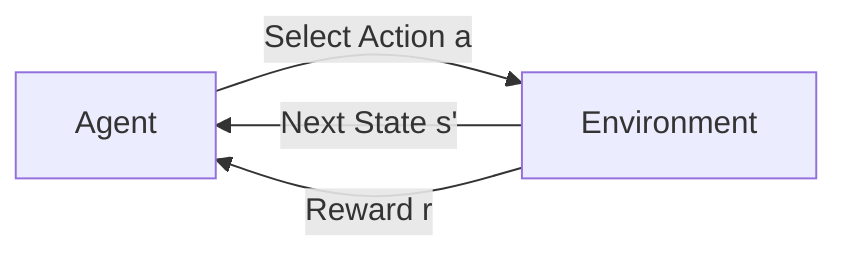
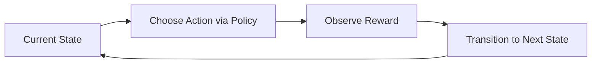
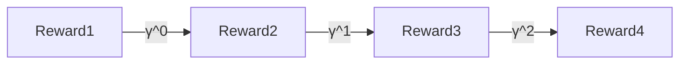
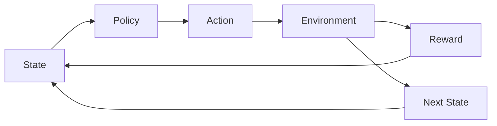
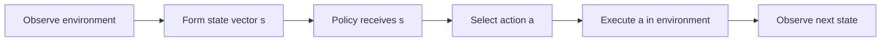
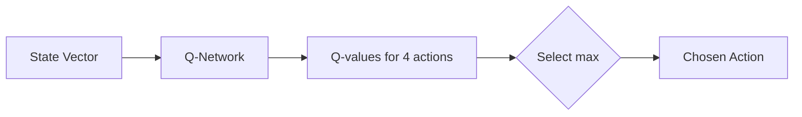
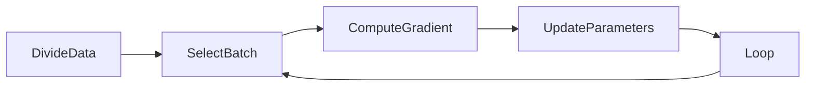
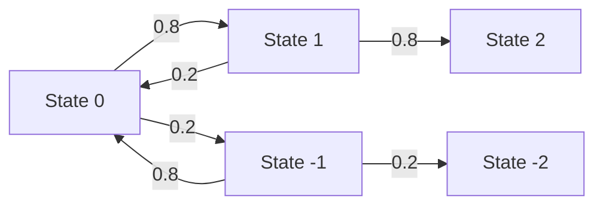

### 🗺️ Navigation

### Part I: Foundations of Reinforcement Learning
- [[#🏗️ Reinforcement Learning Fundamentals]]
- [[#🏗️ Reinforcement Learning Formalism]]
- [[#📉 Return and Discount Factor]]
- [[#🎯 Policy Definition and Goal]]

### Part II: Continuous Control and Applications
- [[#🌊 Continuous State Spaces]]
- [[#🌕 Lunar Lander Application]]

### Part III: Deep Learning Algorithms
- [[#🤖 Deep Q‑Network (DQN) Algorithm]]
- [[#🎲 Epsilon‑Greedy Policy]]
- [[#📦 Mini-Batching]]
- [[#🔄 Soft Updates]]

### Part IV: Advanced Theory and Value Estimation
- [[#🧭 State-Action Value Function]]
- [[#🔍 Deriving Policy from Q-values]]
- [[#📐 Bellman Equation]]
- [[#🌪️ Stochastic Environments]]

---

## ▣ I: Foundations of Reinforcement Learning

---

### 🏗️ Reinforcement Learning Fundamentals

Reinforcement learning (RL) is a way of teaching an **agent** to act by rewarding good behavior instead of showing it the exact right answer.  
Think of training a dog: you don’t tell it step‑by‑step how to fetch a ball—you just say “good dog” when it does something useful and “bad dog” when it messes up. Over time the dog figures out which actions bring more “good dog” moments. RL works the same way for computers.

### 1.1 — The basic ingredients

- **State** – a snapshot of everything the agent can sense at a given moment (its position, speed, sensor readings, etc.).  
- **Action** – something the agent can do from that state (move left, rotate a rotor, place a bid).  
- **Reward function** – the feedback signal that tells the agent whether the last action was helpful (positive reward) or harmful (negative reward).  
- **Terminal state** – a state that ends the episode; after reaching it the agent gets no more rewards until the next episode starts.

The agent lives inside an **environment** that takes its action, hands back a new state and a reward, and repeats the cycle. This loop is the heart of RL.


*Interaction loop: the agent chooses an action, the environment responds with a new state and a reward.*

### 1.2 — Why RL, not supervised learning?

In many real‑world problems (e.g., helicopter flight, robotic manipulation) there isn’t a tidy dataset that tells us the “correct” action for every possible situation. Defining a single right move for every state would be a nightmare. Instead, we describe **what we want**—the goal—through a reward function, and let the algorithm discover the best sequence of actions to achieve it.

> [!tip] **Intuition:** Think of the reward function as a “cheerleader” that claps louder when the agent does something that brings it closer to the goal. The louder the cheer, the more the agent wants to repeat that behavior.

### 1.3 — A concrete illustration: the Mars Rover

Imagine a rover on Mars that can be in one of six discrete locations (states). Moving to state 1 nets a reward of 100, while moving to state 6 only gives 40. From any location the rover can move left or right. Its job is to pick the direction that eventually lands it in the highest‑reward state.

| Current State | Action (Left/Right) | Resulting State | Reward |
|---------------|--------------------|----------------|--------|
| 3             | Right              | 4              | 0      |
| 4             | Right              | 5              | 0      |
| 5             | Right              | 6              | 40     |
| 5             | Left               | 4              | 0      |
| …             | …                  | …              | …      |

The rover doesn’t need a rule that says “always go right”. It simply learns, through trial‑and‑error, that heading toward state 1 yields the biggest cumulative reward.

> [!example] **Rover learning in action**  
> Starting from state 3, the rover tries moving right a few times, sees low rewards, then experiments moving left and discovers a path to state 1 with a reward of 100. Over many episodes, the policy that always steers left becomes the optimal strategy.

### 1.4 — Where RL shines

- **Robotics & autonomous vehicles** – the exact control policy is hard to label but easy to evaluate (did the robot fall? did the car crash?).  
- **Industrial optimization** – factories can define a profit‑or‑energy‑saving reward and let RL tune scheduling or resource allocation.  
- **Finance & trading** – the reward is simply profit/loss, so the algorithm can learn a trading strategy without an explicit “right move” label.

> [!warning] **Common misconception:** RL is **not** just “supervised learning with a different loss”. It never receives a perfect “correct answer” for each step; it only gets a scalar reward that tells it whether the step was good or bad overall.

### 1.5 — Quick recap

Reinforcement learning lets us specify **what** we want (via a reward function) and lets the agent discover **how** to get there by interacting with its environment. This paradigm is especially powerful when the task’s optimal actions are ambiguous or too costly to label manually.

> [!important] **Key takeaway:** By focusing on *goals* instead of *instructions*, RL turns complex, unlabeled problems into learnable experiences—just like teaching a dog to fetch by saying “good job” whenever it gets closer to the ball.

So how do we actually turn this idea of learning from rewards into a concrete mathematical framework?

NOTATION CLASH: "reward function" vs "R"

### 🏗️ Reinforcement Learning Formalism  

Reinforcement learning (RL) is all about an **agent** that lives inside an environment and learns what to do by trying things out and getting feedback. The feedback comes from a **reward function**, and the agent’s experience is captured by four basic building blocks:

* **State (S)** – where the agent is right now. Think of it as the current snapshot of everything the agent can see.  
* **Action (A)** – a decision the agent can make while in that state.  
* **Reward (R)** – a numeric signal the environment hands back **immediately after the agent lands in a state** (the reward belongs to the state you’re *in*, not the one you’re about to move into).  
* **Next state (S′)** – where the agent ends up after taking the action.

These pieces fit together into a **Markov Decision Process (MDP)**, which simply means “the future only depends on where you are now and what you do next.” The whole history that got you to the current state is irrelevant for predicting the next step.

> [!important] **Markov property** – In an MDP the transition to future states depends solely on the present state and chosen action. Past trajectories are ignored, so the state must contain *all* the information needed for decision‑making.

### 1.6 — 📍 Core Components

| Component | What it means in RL | Everyday analogy |
|-----------|--------------------|-------------------|
| **State** | Current situation of the agent | The page you’re reading in a book |
| **Action** | Choice the agent makes | Turning the page left or right |
| **Reward** | Numeric feedback for being in that state | A treat you give a dog when it sits |
| **Terminal state** | A state after which the episode ends (no more rewards) | Reaching the finish line of a race |

The **policy** (π) is the agent’s decision‑making rule: given a state S, the policy tells the agent which action A to pick. The ultimate goal is to find a policy that **maximises the total return** – the cumulative reward the agent can expect over time.

> [!tip] Think of the reward function like training a pet: you don’t explain *why* sitting is good, you just hand over a treat when it happens. Over time the pet learns that sitting leads to treats.

### 1.7 — 🔁 Interaction Loop

At every time step the agent goes through a tiny loop:


*Caption: The RL interaction cycle – state → action → reward → next state → back to state.*

### 1.8 — 🧭 Policy and Goal

A **policy** π maps each state to a probability distribution over actions. When the policy is deterministic, it simply picks a single action per state. The agent’s objective is to adjust π so that the **expected return** (the sum of future rewards, with sooner rewards usually counted more) is as large as possible.

> [!warning] **Common misconception** – The reward R(S) belongs to the *current* state, not the state you’ll move into. Forgetting this can lead to mis‑labelled training data and a confused agent.

### 1.9 — 🎯 Worked Example: Mars Rover

Imagine a tiny rover that can be in one of six linear states. The rewards are:

| State | Reward |
|-------|--------|
| 1 (left end) | 100 |
| 2–5 (middle) | 0 |
| 6 (right end) | 40 |

The rover starts in **State 4**. It can move left or right one step per action. The episode ends when it reaches either terminal state (1 or 6).

**Step‑by‑step walk‑through**

1. **Start:** S = 4, reward = 0.  
2. **Action:** Move left → S′ = 3, receive reward 0.  
3. **Action:** Move left → S′ = 2, reward 0.  
4. **Action:** Move left → S′ = 1, reward 100 → **terminal**.

If the rover instead went right all the way to State 6, it would collect a reward of 40. Even though both paths end the episode, the left‑ward path yields a larger total return (100 vs. 40), so a good policy will learn to prefer moving left from State 4.

> [!example] **Why this matters**  
> The rover’s “return” is simply the reward it finally hits, because all intermediate rewards are zero. The agent learns that the *value* of being in State 4 is the higher of the two possible returns (100), and a policy that always moves left from there is optimal.

> [!tip] **Intuition check** – The rover’s decision is like choosing between a $100 bill you can grab right now versus a $40 bill a few steps away. The immediate, larger reward wins even if it takes a few extra moves.

### 1.10 — 🔎 Quick Recap

* An RL problem is an **MDP**: (S, A, R, S′).  
* The **policy** tells the agent what to do in each state.  
* The **reward** signals good vs. bad behavior; it’s tied to the current state.  
* The **return** measures the total future reward, encouraging the agent to favour earlier, larger gains.  

When you picture the loop and remember the pet‑training analogy, the formalism clicks into place – the agent is just repeatedly asking “What should I do now?” and the environment answers with a treat (reward) and a new spot to stand (next state).  

Next up we’ll explore **Return and Discount Factor**, where the math shows why we care about “sooner” rewards more than “later” ones.

So, how exactly do we calculate those future rewards and account for the fact that sooner is usually better?

### 📉 Return and Discount Factor  

When an RL agent moves through an environment it keeps collecting rewards.  
The **return** is just the total amount of reward it gathers, but we don’t treat every dollar the same – a reward you get right now feels more valuable than the same reward you’ll get later. That’s where the **discount factor** ( γ ) comes in.

### 1.11 — What the symbols mean

- **Return** – the cumulative value the agent cares about.  
- **Discount factor γ** – a number between 0 and 1 that says how much we “shrink” future rewards.  
  - γ ≈ 1 → the agent is patient, caring about the long run.  
  - γ ≈ 0 → the agent is impatient, caring almost only about the next step.

The return is computed by weighting each reward with an ever‑larger power of γ:

$$\boxed{\text{Return} = R_1 + \gamma R_2 + \gamma^2 R_3 + \gamma^3 R_4 + \dots}$$  

where $R_t$ is the reward received at time step t.

### 1.12 — Intuition: a patience dial for a robot

> [!tip] **Robot patience** – Imagine you can set a “patience” knob on a delivery robot.  
> • γ = 0.5 makes the robot greedy: it prefers a $5 tip now over a $10 tip that arrives after a long detour.  
> • γ = 0.99 makes it very patient: it’ll take the longer route because the future $10 is almost as good as the $5 today.

Another everyday picture: you see $5 on the ground versus a $10 bill across the street that takes you 30 minutes to reach. The return calculation tells you whether the extra $5 is worth the extra walking time.

### 1.13 — Concrete worked example

> [!example] **Discounted return with γ = 0.5**  
> Suppose the agent receives the reward sequence $ (0, 0, 0, 100) $.  

| Time step | Reward $R_t$ | Discount $\gamma^{t-1}$ | Weighted contribution |
|----------|----------------|--------------------------|-----------------------|
| 1 | 0 | 1 | 0 |
| 2 | 0 | 0.5 | 0 |
| 3 | 0 | 0.5² = 0.25 | 0 |
| 4 | 100 | 0.5³ = 0.125 | **12.5** |

So the **return** is $0 + 0 + 0 + 12.5 = 12.5$.  

> [!tip] The number 12.5 tells us that, given γ = 0.5, the distant $100 is only worth about a twelfth of a $100 today.

### 1.14 — Why it matters

- **Time‑sensitive decisions** – Finance (interest rates), navigation (fuel vs. distance), or any setting where “later” is different from “now”.  
- **Balancing short‑ vs‑long‑term goals** – A well‑chosen γ steers the agent toward strategies that match the problem’s horizon.

### 1.15 — Common pitfalls

> [!warning] **Exponent mistakes** – Remember the exponent matches the *time step minus one*. The reward at step 3 gets multiplied by $\gamma^{2}$, not $\gamma^{3}$.  
> > A slip here can make an agent seem either too eager or too lazy.

> [!warning] **Reward vs. transition** – In this formalism the reward belongs to the *state* you land in, not the transition you just made.  

### 1.16 — Key insight

> [!important] **γ is the “time‑value of reward”** – Just like money today is worth more than the same amount tomorrow because you could invest it, γ tells the agent how much future reward “decays” over time.  

### 1.17 — Typical settings

- Common choices: γ = 0.9, 0.99, 0.999 – the higher the value, the longer the agent looks ahead.  

### 1.18 — Visualizing the weighting


*How each successive reward gets multiplied by a higher power of the discount factor.*

### 1.19 — Quick recap

- Return = sum of discounted rewards.  
- γ ∈ (0, 1) controls the trade‑off between immediate and future gain.  
-

So, how does an agent actually decide which actions to take to maximize that return?

NOTATION CLASH: "γ" vs "Π"

### 🎯 Policy Definition and Goal  

A **policy** (written $\Pi$) is just a rule‑book for the agent: look at the current state, then pick the action the rule says to take.  In other words, it’s a function  

$$
\Pi : \text{State} \;\rightarrow\; \text{Action}
$$

Think of it as the controller you’d program into a robot – “if I’m at this spot, turn left; if I’m at that spot, go straight.”  The whole point of reinforcement learning (RL) is to **find the best possible policy**, i.e., the one that gives the highest total return over the agent’s lifetime.

> [!important] **Goal of RL**  
> The objective is to maximise the *return* $G_t$, the discounted sum of future rewards:
> $$\boxed{G_t = \sum_{k=0}^{\infty} \gamma^{k} R_{t+k+1}}$$  
> Here $\gamma\in[0,1]$ is the discount factor that makes distant rewards count less (or more, if $\gamma$ is close to 1).

### 1.20 — 🤖 How a Policy Drives Interaction

1. The agent observes the **current state** $s_t$.  
2. It feeds $s_t$ into its policy $\Pi$ and receives an **action** $a_t = \Pi(s_t)$.  
3. The **environment** reacts: it moves to a new state $s_{t+1}$ and hands back a **reward** $R_{t+1}$.  
4. The agent repeats the loop, constantly using the same policy (or an improved version of it).

The Markov property guarantees that the environment’s response depends only on the *present* state and action—not on how we got there.  That’s why a simple mapping $s\to a$ is enough.


*Agent‑environment loop: the policy selects an action, the environment returns a reward and the next state.*

### 1.21 — 📚 Worked Example: Tiny Grid World

| State | Action (policy) | Reward | Next State |
|-------|-----------------|--------|------------|
| S₀   | Right           | 0      | S₁         |
| S₁   | Right           | 0      | S₂         |
| S₂   | Stay            | 10     | S₂ (terminal) |

- Discount factor $\gamma = 0.5$ (short horizon).  
- Starting at $S_0$, the policy always moves **right** until it reaches $S_2$, where it stays and collects a reward of 10.

Compute the return from the start:

$$
\begin{aligned}
G_0 &= R_{1} + \gamma R_{2} + \gamma^{2} R_{3} + \dots \\
    &= 0 + 0.5 \times 0 + 0.5^{2} \times 10 \\
    &= 0 + 0 + 2.5 = 2.5 .
\end{aligned}
$$

If we could change the policy to jump directly to $S_2$, the return would be  

$$
G_0^{\text{new}} = 0.5^{0} \times 10 = 10,
$$

which is much higher.  RL’s job is to discover that better policy.

> [!example] **Why the Discount Matters**  
> With $\gamma=0.9$, the same direct jump would give $G_0 = 9$, while the step‑by‑step policy yields $G_0 = 0.9^{2}\times10 = 8.1$.  A higher $\gamma$ rewards long‑term plans more strongly.

> [!warning] **Common Pitfall**  
> Don’t assume the *history* of states matters. In an MDP the future depends only on the current state and the action you take now.  Feeding the whole trajectory into a policy is unnecessary and can hurt learning.

### 1.22 — 🔄 From Policy to Optimality

The “best” policy $\Pi^{*}$ is the one that **maximises** $G_t$ for *every* possible starting state.  Formally  

$$
\Pi^{*} = \arg\max_{\Pi}\; \mathbb{E}\!\left[\,G_t \mid \Pi\,\right].
$$

Finding $\Pi^{*}$ is the core challenge of RL.  Various algorithms (policy iteration, value‑based methods, policy gradients, etc.) try to approximate this optimum, but the underlying idea stays the same: keep tweaking the mapping from states to actions until the expected discounted return can’t be improved any further.

---

*Next up we’ll dive into the **Return and Discount Factor** to see how the choice of $\gamma$ shapes the learning objective.*

But how do we handle these goals when the agent isn't just moving between a few tidy boxes?

NOTATION CLASH: "$\Pi$" vs "policy"

---

## ▣ II: Continuous Control and Applications

---

### 🌊 Continuous State Spaces  

When you think about a robot moving around, it isn’t hopping from square 1 to square 2 like a board game. It can be *anywhere* along a smooth road, with any speed, angle, or spin. That “anywhere” is what we call a **continuous state space** – the set of all possible configurations is an unbroken range of real numbers instead of a handful of tidy boxes.

### 2.1 — What the term really means
- **Continuous state space** – the agent’s condition is described by values that can take any real number in a range (e.g., a position of 2.73 km, a velocity of ‑1.4 m/s).  
- **State vector** – we pack all those numbers into an ordered list, usually written as a vector:  

$$\boxed{\mathbf{s} = [x,\; y,\; \dot{x},\; \dot{y},\; \theta,\; \dot{\theta}]}$$  

For the classic Lunar Lander, the vector contains horizontal/vertical positions, their velocities, the lander’s angle, its angular velocity, and two booleans for the landing‑leg contacts.

### 2.2 — Why we care
Real‑world control problems (self‑driving cars, helicopters, lunar landers) involve physics that can’t be sliced into a few discrete buckets. If we forced those problems into a discrete MDP, we’d lose the nuance needed to make fine‑grained, safe decisions. That’s why reinforcement‑learning algorithms that accept continuous inputs are essential for **autonomous control**.

> [!tip] **Intuition check**  
> Imagine a chessboard versus a smooth tabletop. On the board you can only sit on the 64 squares (discrete). On the tabletop you can place a piece at any point with infinite precision – that’s a continuous space.

### 2.3 — Concrete examples

| System | What the state vector looks like |
|--------|---------------------------------|
| **Mars Rover (discrete)** | One of six labeled zones (Zone 1 … Zone 6) |
| **Mars Rover (continuous)** | Position = 2.7 km along a 0‑6 km track |
| **Autonomous car** | $[x,\; y,\; \theta,\; \dot{x},\; \dot{y},\; \dot{\theta}]$ |
| **Helicopter** | 12 numbers: $[x,\; y,\; z,\; \phi,\; \theta,\; \psi,\; \dot{x},\; \dot{y},\; \dot{z},\; \dot{\phi},\; \dot{\theta},\; \dot{\psi}]$ |
| **Lunar Lander** | $[x,\; y,\; \dot{x},\; \dot{y},\; \theta,\; \dot{\theta},\; \text{leg}_\text{left},\; \text{leg}_\text{right}]$ |

> [!important] **Key point**  
> Continuous state spaces are formally known as **continuous MDPs**. The “MDP” part stays the same; only the state set becomes a continuum.

### 2.4 — How a policy sees the state

A reinforcement‑learning policy is just a function that takes the state vector $\mathbf{s}$ and spits out an action (e.g., fire main thruster, do nothing). In code you often see something like:

```python
action = policy(state_vector)   # state_vector = np.array([...])
```

So the whole learning loop is:


*Diagram: From raw sensor readings to an action via the policy.*

> [!note] **State vector composition**  
> Each entry in $\mathbf{s}$ is a measurable quantity (position, velocity, angle, etc.). The order matters because the policy network expects a fixed‑size input.

### 2.5 — Quick sanity check

If you mistakenly treat a continuous problem as discrete (e.g., rounding all positions to the nearest meter), you’ll throw away valuable information. The agent will see many distinct real‑world situations as the same “state,” leading to blurry, sub‑optimal policies.

> [!warning] **Common slip**  
> “Discrete” isn’t the same as “low‑resolution.” Even a finely discretised grid can’t capture the smooth dynamics that continuous‑state RL algorithms exploit.

---

That’s the gist: continuous state spaces let our agents reason about the real, fluid world instead of a toy board, and they do it by feeding a **state vector** straight into the policy. Next up we’ll see how this plays out in a concrete control problem – the **Lunar Lander**.

So, what does this actually look like when we put it into practice with the Lunar Lander?

### 🌕 Lunar Lander Application  

The lunar lander is a classic benchmark for **continuous‑state reinforcement learning**.  
Instead of a tiny grid of states, the agent sees a **dashboard** of numbers that describe exactly where the craft is and how it’s moving. From that information it must decide which thruster to fire – or to do nothing – in order to touch down safely while saving fuel.

### 2.6 — 📊 The State Vector – the “Dashboard”

| Index | Meaning | Type |
|------|----------|------|
| 0 | Horizontal position $x$ | continuous |
| 1 | Vertical position $y$ | continuous |
| 2 | Horizontal velocity $\dot{x}$ | continuous |
| 3 | Vertical velocity $\dot{y}$ | continuous |
| 4 | Angle $\theta$ (radians) | continuous |
| 5 | Angular velocity $\dot{\theta}$ | continuous |
| 6 | Left leg contact $l$ | binary (0/1) |
| 7 | Right leg contact $r$ | binary (0/1) |

> [!note] **Why this matters**  
> The vector packs everything the AI needs to know – position, speed, orientation, and whether the legs are already touching the surface. No hidden variables, no discretisation tricks.

### 2.7 — 🎮 Actions (the Policy’s Output)

The lander can choose one of **four** discrete actions:  

1. **Nothing** – let gravity do its thing.  
2. **Fire left thruster** – pushes the craft rightward.  
3. **Fire main engine** – strong upward thrust.  
4. **Fire right thruster** – pushes the craft leftward.  

The policy $\pi$ maps the current state $s$ to one of these actions:
$$
a = \pi(s)
$$
In practice we estimate the **state‑action value** $Q(s,a)$ with a neural network and pick the action with the highest predicted value.

$$
\boxed{a^{*} = \arg\max_{a} Q(s, a)}
$$

### 2.8 — 💰 Reward Function – the “Rules of the Game”

Designing the reward is where the magic (or the mess) happens. A typical lunar‑lander reward scheme looks like:

| Event | Reward |
|------|--------|
| Successful landing | +100 to +140 |
| Crash | –100 |
| Main engine fire | –0.3 per step |
| Side‑thruster fire | –0.03 per step |

> [!tip] **Intuition**  
> Think of the reward as a scoreboard. Positive points reward the *goal* (soft landing), while tiny penalties discourage wasteful thruster use. The agent learns to balance safety against fuel efficiency.

### 2.9 — 🔧 How Action Selection Works (Step‑by‑Step)

1. **Feed the state vector** into the trained Q‑network.  
2. **Obtain a Q‑value** for each of the four actions.  
3. **Pick the action** with the largest Q‑value (the boxed formula above).  

A simple flow diagram helps visualise the pipeline:


*Diagram: From raw state to the action the policy executes.*

### 2.10 — 🧪 Worked Example: Picking an Action

Suppose at a given timestep the lander’s dashboard reads:

| Variable | Value |
|----------|-------|
| $x$ | 0.2 m |
| $y$ | 1.5 m |
| $\dot{x}$ | 0.01 m/s |
| $\dot{y}$ | ‑0.05 m/s |
| $\theta$ | 0.02 rad |
| $\dot{\theta}$ | ‑0.01 rad/s |
| $l$ | 0 |
| $r$ | 0 |

The Q‑network (already trained) outputs the following estimated Q‑values:

| Action | $Q(s,a)$ |
|--------|----------|
| Nothing | ‑0.12 |
| Left thruster | ‑0.08 |
| Main engine | ‑0.25 |
| Right thruster | ‑0.10 |

**Step‑by‑step calculation**

1. Identify the maximum Q‑value: $\max\{-0.12,\,-0.08,\,-0.25,\,-0.10\} = -0.08$.  
2. The corresponding action is **Left thruster**.  

> [!example] **Result**  
> The policy decides to fire the left thruster, because, despite the small penalty, it yields the highest expected return given the current state.

> [!warning] **Common Pitfall**  
> Ignoring the sign of Q‑values can be misleading. Even though all Q‑values are negative (the agent is incurring penalties), we still pick the *least* negative one – the action that hurts us the least while moving toward a safe landing.

### 2.11 — 📈 Why a High Discount Factor ($\gamma = 0.985$)

A discount factor close to 1 tells the agent, “**look far ahead**.” Landing safely often requires many small, fuel‑saving adjustments before the final touchdown. If $\gamma$ were too low, the agent would chase immediate rewards (e.g., avoiding a small crash now) and ignore the long‑term goal of a smooth landing.

> [!important] **Key Insight**  
> With $\gamma = 0.985$, a reward earned 100 steps later is still worth about $0.985^{100} \approx 0.60$ of today’s reward – enough to keep the agent focused on the endgame.

### 2.12 — 🚀 Bottom‑Line Takeaways

- **Continuous state vectors** let the agent perceive the full physics of the lander.  
- **Reward engineering** (positive landing bonus, small fuel penalties) shapes the desired behavior.  
- **Deep Q‑learning** approximates $Q(s,a)$, enabling the policy to pick the best thruster action at every moment.  
- **High $\gamma$** ensures the agent values the eventual safe touchdown over short‑term gains.

Next up we’ll see **how the Deep Q‑Network itself is trained**, covering experience replay and target‑network updates.

So how do we actually get this neural network to learn?

---

## ▣ III: Deep Learning Algorithms

---

### 🤖 Deep Q‑Network (DQN) Algorithm  

The DQN lets an agent learn **what to do** by turning the classic Q‑function into a neural network. Instead of hand‑crafting a table of “state × action → value”, we feed the current state (and a one‑hot action) into a network and train it to predict the **future discounted reward**. The whole loop looks a bit like a self‑study routine: collect experiences, review them later from a replay buffer, and keep updating the cheat‑sheet (the Q‑function) until it gets reliable.

### 3.1 — How the Training Loop Flows

```mermaid
flowchart TD
    A[Initialize network weights] --> B[Interact with environment → (s,a,r,s')]
    B --> C[Store tuple in Replay Buffer]
    C --> D{Enough samples?}
    D -- Yes --> E[Sample minibatch from buffer]
    E --> F[Compute target Y = R + γ·max_a' Q(s',a')]
    F --> G[Supervised step: minimise (Y‑Q(s,a))²]
    G --> H[Update network parameters]
    H --> I[Policy improvement: pick argmax_a Q(s,a)]
    I --> B
    D -- No --> B
```
*Figure: High‑level DQN training pipeline.*

### 3.2 — Core Math

The **Bellman target** that drives learning is

$$\boxed{Y = R + \gamma \max_{a'} Q(s', a')}$$  

where  

* $R$ – immediate reward from the last action,  
* $\gamma$ – discount factor (usually $\gamma = 0.985$ for Lunar Lander),  
* $s'$ – the next state,  
* $\max_{a'} Q(s',a')$ – the best predicted value for the next state.

During training the network tries to make its prediction $Q(s,a)$ match this target, typically by minimizing the mean‑squared error $(Y - Q(s,a))^2$.

### 3.3 — 📊 Worked Example

> [!example] **Target calculation for a single transition**  
> Suppose the agent just fired the **left thruster** and observed:  

| Symbol | Value |
|--------|-------|
| Immediate reward $R$ | $-0.3$ (fuel cost) |
| Discount factor $\gamma$ | $0.985$ |
| Predicted Q‑values for next state $s'$ | $[Q(s',a_1)=4.2,\; Q(s',a_2)=5.0,\; Q(s',a_3)=3.8,\; Q(s',a_4)=4.5]$ |

**Step 1 – pick the best next‑action value**  
$\displaystyle \max_{a'} Q(s',a') = 5.0$  

**Step 2 – plug into the Bellman target**  

$$
\begin{aligned}
Y &= R + \gamma \max_{a'} Q(s',a') \\
  &= -0.3 + 0.985 \times 5.0 \\
  &= -0.3 + 4.925 \\
  &= 4.625
\end{aligned}
$$

So the training example for this transition is **input** $(s,\text{left thruster})$ and **target** $Y = 4.625$. The network will adjust its weights to bring its current $Q(s,\text{left thruster})$ closer to 4.625.

> [!tip] The higher the target, the more the network is encouraged to **repeat** the action in similar states. Low or negative targets push the policy away from those actions.

### 3.4 — 🛠️ Practical Tips & Common Pitfalls

> [!warning] **Inefficient inference** – Computing $Q(s,a)$ separately for each action forces the network to run a forward pass four times (once per thruster). A better design outputs **all** action values in a single pass, e.g. a vector $[Q(s,a_1),\dots,Q(s,a_4)]$.  

> [!tip] **Replay buffer size** – For Lunar Lander a buffer of about **10 000** recent tuples balances memory use and diversity of training samples.  

> [!danger] **Random initial Q‑values** – If you start with a single random initialization and never revisit old experiences, early updates can be wildly unstable. The replay buffer mitigates this by mixing old and new data.

### 3.5 — 💡 Key Insight

> [!important] **Bootstrapping** – DQN repeatedly uses its own (imperfect) predictions $\max_{a'} Q(s',a')$ as part of the target $Y$. This “learning from yourself” lets the agent improve even when only a sparse reward signal is available, but it also means you need a stable training regimen (replay buffer, target network, etc.) to avoid runaway errors.

### 3.6 — 🎯 Bottom Line

The DQN algorithm turns reinforcement learning into a **supervised learning** problem:

1. **Collect** experience tuples $(s,a,r,s')$ while exploring.  
2. **Store** them in a replay buffer (think of it as a study journal).  
3. **Sample** a minibatch, compute Bellman targets $Y$, and train the network to predict them.  
4. **Update** the policy by picking the action with the highest predicted $Q(s,a)$.  

Iterating these steps gradually refines the Q‑function, giving the lunar lander a reliable “cheat sheet” for choosing thrusters, fuel usage, and landing maneuvers.

So, how do we make sure our agent actually explores enough to fill that journal with useful data?

### 🎲 Epsilon‑Greedy Policy  

When a reinforcement‑learning agent starts out, its Q‑function is just a random guess. If it always picks the “best” action according to that guess, it will never discover that some other move is actually far better. The epsilon‑greedy policy solves this by sprinkling a little randomness into an otherwise greedy decision maker. Most of the time the agent exploits what it thinks is good, but occasionally it explores a random action so it can gather fresh information.

### 3.7 — 🧭 How it works

We fix a small number ε (for example 0.05).  
* With probability **1 − ε** we choose the action that maximizes the current Q‑estimate, `argmax_a Q(s,a)`. This is the **greedy** part.  
* With probability **ε** we pick any legal action uniformly at random – the **exploration** part.

The two probabilities are the heart of the method:

$$\boxed{P_{\text{greedy}} = 1 - \epsilon,\qquad P_{\text{random}} = \epsilon}$$  

In words: if ε = 0.05, the agent behaves greedily 95 % of the time and wanders off the beaten path 5 % of the time.

### 3.8 — 🚦 Step‑by‑step selection

1. **Observe** the current state `s`.  
2. **Draw** a uniform random number `u` ∈ [0, 1].  
3. If `u > ε`, **pick** the greedy action `a* = argmax_a Q(s,a)`.  
4. Otherwise, **sample** an action uniformly at random from the action set.  

That tiny decision can be visualised as a flowchart:

```mermaid
flowchart LR
    Start[Start] --> RandomCheck{u > ε?}
    RandomCheck -->|Yes| GreedySelect[Select argmax_a Q(s,a)]
    RandomCheck -->|No| RandomSelect[Select random action]
    GreedySelect --> End[Execute action]
    RandomSelect --> End
```
*Flowchart of the epsilon‑greedy selection process.*

### 3.9 — 🎯 Worked example (Lunar Lander)

Suppose at a particular moment the lander sees three possible thrust actions with the following Q‑values:

| Action | Q(s, a) |
|--------|--------|
| A | 5.0 |
| B | 2.3 |
| C | 3.7 |

We set ε = 0.10 (10 % exploration).  

1. Draw `u = 0.07`. Since `0.07 ≤ 0.10`, we **explore** and pick a random action. Let’s say the random draw picks **B**.  
2. If instead `u = 0.42`, we **exploit** because `0.42 > 0.10`. The greedy action is the one with the highest Q‑value, **A**, so we would fire thrust A.

> [!example] **Epsilon‑greedy in action**  
> With ε = 0.10, the agent will pick the optimal thrust **A** 90 % of the time (when `u > 0.10`) and a random thrust (A, B, or C) the remaining 10 % of the time.  

> [!tip] **Intuition check** – Think of ε as the “curiosity budget.” A small ε means the agent is mostly confident in its knowledge, while a large ε is like a child who keeps trying new toys because it isn’t sure which one is best yet.

### 3.10 — ⚠️ Common pitfalls

> [!warning] **Setting ε poorly** – If ε is too low from the start, the agent may never leave an early, wrong belief and will converge to a sub‑optimal policy. If ε stays too high for too long, learning drags on because the agent keeps making random moves instead of capitalising on what it has already learned.

> [!note] **RL hyper‑parameters are finicky** – Unlike supervised learning, a bad ε schedule can blow up training time by an order of magnitude. Tuning ε together with learning rate, replay‑buffer size, etc., is essential.

### 3.11 — 📈 Why we decay ε

A typical schedule starts with ε = 1.0 (pure exploration) and **decays** it gradually (e.g., multiply by 0.99 each episode) until it reaches a small floor like 0.01. Early on, the agent knows almost nothing, so heavy exploration is valuable. As the Q‑function becomes more accurate, we want to exploit more and explore less.

> [!important] **Gradual decay ≈ “learn‑then‑use”** – Heavy exploration when the model is naïve, followed by increasing exploitation as confidence grows, yields the fastest overall learning.

---

In a nutshell, epsilon‑greedy gives a simple, mathematically clean way to balance **exploration** (trying new actions) and **exploitation** (using the best‑known action). By tweaking ε and letting it shrink over time, we guide the agent from a curious beginner to a competent performer.

So, how do we speed up the learning process once the agent knows what to do?

### 📦 Mini-Batching  

When you have a mountain of data, scanning the whole thing before each tiny move is like checking the entire city map before every step you take. Mini‑batching lets you look at just a few local landmarks, take a quick step, then look at the next slice. You still end up at the destination, but you get there much faster.

### 3.12 — How it works

Instead of computing the gradient over the whole training set of size $m$, we pick a smaller subset of size $m'$ (the **mini‑batch**). For that batch we:

1. **Compute the loss** (average error) on just those $m'$ examples.  
2. **Take the gradient** of that loss w.r.t. the parameters.  
3. **Update** the parameters using the gradient.  

Because $m' \ll m$, each iteration costs far less time, so we can make many more updates in the same wall‑clock time. The trade‑off is that the gradient is a noisy estimate of the true gradient, so the optimization path wiggles a bit.

> [!tip] **Why the noise isn’t a problem**  
> The noise actually helps the optimizer escape shallow local minima. On average the updates still point toward the global minimum; you just take a slightly jagged road.

### 3.13 — Mini‑batch Gradient Descent algorithm


*Flow of a single mini‑batch iteration.*

1. **DivideData** – Split the full dataset into batches of size $m'$.  
2. **SelectBatch** – Pull the next batch (or a random one).  
3. **ComputeGradient** – Evaluate the loss $J_{\text{mini-batch}}$ and its gradient on that batch.  
4. **UpdateParameters** – Apply the gradient step (often with a learning rate $\eta$).  
5. **Loop** – Repeat until you’ve swept through all batches (or for a fixed number of epochs).

### 3.14 — Core formula

The loss evaluated on a mini‑batch is  

$$\boxed{J_{\text{mini-batch}} = \frac{1}{2m'} \sum_{i=1}^{m'} \bigl(\hat{y}_i - y_i\bigr)^2}$$  

where $\hat{y}_i$ is the model’s prediction for example $i$ and $y_i$ is the true target.

### 3.15 — Worked example

Suppose we have a tiny regression problem with 6 data points and we use a batch size $m' = 2$. The current model predicts $\hat{y}=w x + b$ with $w=0.5$, $b=0$. The data are:

| $x$ | $y$ |
|----|----|
| 1  | 2 |
| 2  | 3 |
| 3  | 5 |
| 4  | 7 |
| 5  | 11 |
| 6  | 13 |

We’ll take the first mini‑batch $(x=1, y=2)$ and $(x=2, y=3)$.

1. **Predictions**:  
   $\hat{y}_1 = 0.5 \times 1 = 0.5$  
   $\hat{y}_2 = 0.5 \times 2 = 1.0$

2. **Errors**:  
   $e_1 = \hat{y}_1 - y_1 = 0.5 - 2 = -1.5$  
   $e_2 = \hat{y}_2 - y_2 = 1.0 - 3 = -2.0$

3. **Mini‑batch loss**:  

$$
J_{\text{mini-batch}} = \frac{1}{2 \times 2}\bigl((-1.5)^2 + (-2.0)^2\bigr)
= \frac{1}{4}(2.25 + 4.00) = \frac{6.25}{4}=1.5625
$$

4. **Gradients** (using the simple squared‑error gradient w.r.t. $w$):  

$$
\frac{\partial J}{\partial w}= \frac{1}{m'}\sum_{i=1}^{m'} e_i x_i
= \frac{1}{2}\bigl((-1.5)\times1 + (-2.0)\times2\bigr)
= \frac{1}{2}(-1.5 -4.0)= -2.75
$$

5. **Parameter update** (learning rate $\eta = 0.1$):  

$$
w_{\text{new}} = w - \eta \frac{\partial J}{\partial w}
= 0.5 - 0.1 \times (-2.75) = 0.5 + 0.275 = 0.775
$$

After this one mini‑batch step the weight has moved from 0.5 to 0.775. Repeating the process with the next batches quickly drives the model toward a good fit.

> [!example] **Mini‑batch step recap**  
> • Loss on batch = 1.5625  
> • Gradient w.r.t $w$ = –2.75  
> • Updated weight = 0.775  

### 3.16 — Why it matters

- **Scalability** – You can train on datasets with millions (or billions) of examples because each iteration only looks at a tiny slice.  
- **Speed** – More frequent updates mean you often converge in fewer wall‑clock seconds, even though the path is noisier.  
- **Reinforcement learning** – Mini‑batches are usually drawn from a replay buffer, giving you diverse experiences without waiting for fresh online data.

> [!warning] **Pitfall** – If you keep drawing the same “unlucky” mini‑batch, you might temporarily head away from the optimum. Random shuffling each epoch usually smooths this out.

### 3.17 — Interaction with soft updates

In deep Q‑learning, the Q‑network parameters are often updated with **soft updates** (a slow blend of old and new weights). Mini‑batches supply the noisy gradient, while soft updates temper the magnitude of each change, preventing the network from swinging wildly after a single batch.

> [!important] **Key take‑away**  
> Mini‑batching trades a little gradient noise for a huge boost in computational efficiency, making large‑scale learning practical. When paired with soft updates, it also keeps learning stable.

So, how exactly does this smoothing process work under the hood?

### 🔄 Soft Updates

When you train a Q‑network, you could just **overwrite** the old parameters with the freshly trained ones.  
That works, but it’s like throwing out everything you’ve learned just because the latest lesson was a bit off.  
A *soft update* smooths the transition: we keep most of the old knowledge and only let a tiny slice of the new weights slip in.  
This tiny slice is controlled by a hyperparameter α (alpha), typically something like 0.01.

### 3.18 — How the update works

Instead of `W ← W_new`, we blend the two sets of parameters:

$$\boxed{W = \alpha\,W_{\text{new}} + (1-\alpha)\,W}$$  

and the same for the biases:

$$B = \alpha\,B_{\text{new}} + (1-\alpha)\,B$$  

Because the two coefficients add up to 1, the new parameters are a **weighted average** of the old and the freshly trained ones.  

> [!important] **Key detail**  
> The two weights α and (1‑α) must sum to 1. Setting α to 1.0 collapses the soft update into a hard overwrite.

### 3.19 — Intuition – a gentle nudge

Think of your belief system as a bookshelf.  
A new research paper (the freshly trained network) gives you fresh ideas, but you don’t replace every old book outright.  
You slip the new book onto the shelf and maybe shift a few neighboring books a bit—that’s the 1 % α influence.  
Over many updates, the shelf gradually reflects the latest knowledge without ever toppling over.

### 3.20 — Worked example

Suppose a single weight in the target network is `W = 0.50`.  
After a training step the online network proposes `W_new = 0.60`.  
We pick a modest α = 0.01.

| Symbol | Value |
|--------|-------|
| α | 0.01 |
| W (old) | 0.50 |
| W_new | 0.60 |
| Updated W | $0.01 \times 0.60 + 0.99 \times 0.50 = 0.506$ |

So the weight only moves from 0.50 to 0.506 – a tiny nudge toward the new estimate.

> [!tip] **What the number means**  
> An α of 0.01 means each update contributes just 1 % of the new knowledge.  
> If you need faster adaptation, raise α a bit (e.g., 0.05), but beware of instability.

### 3.21 — Common pitfall

If you accidentally set α to 1.0, the soft update becomes a **hard update**, wiping out the gradual safety net and re‑introducing the risk of “unlucky” training steps that can make the Q‑function worse.

> [!warning] **Avoid hard updates unless you really want them**  
> Direct overwrites can cause sudden jumps in Q‑values, leading to oscillations or divergence.

### 3.22 — Where soft updates fit in the pipeline

Soft updates are usually paired with **mini‑batch gradient descent** and a **replay buffer**.  
The replay buffer gives you a batch of past experiences, you compute a gradient step, and then you **softly** blend the resulting parameters into the target network.

> [!info] **Reminder** – see the earlier [[#📦 Mini-Batching]] note for how mini‑batches supply the noisy but fast gradients that soft updates help to tame.

### 3.23 — Process flowchart

```mermaid
flowchart LR
    A[Train online network] --> B[Obtain W_new, B_new]
    B --> C[Define α (e.g., 0.01)]
    C --> D[Update target weights]
    D --> E[W = α·W_new + (1-α)·W]
    D --> F[B = α·B_new + (1-α)·B]
    E --> G[Target network ready for next step]
    F --> G
```
*Flow of a soft update: after training the online network, blend its new parameters into the target network using α.*

### 3.24 — Bottom line

Soft updates act like a **low‑pass filter** on the learning signal: they let the model absorb fresh information gradually, which keeps the Q‑function from swinging wildly and helps the whole reinforcement‑learning loop converge more reliably.

So, what are we actually calculating when we use these target networks to update our Q-values?

---

## ▣ IV: Advanced Theory and Value Estimation

---

### 🧭 State-Action Value Function

The **state‑action value function**, usually written as $Q(s,a)$ (or $Q^*(s,a)$ when we mean the *optimal* one), tells us **how much total reward we expect to collect if we start in state $s$, take action $a$ just once, and then behave perfectly from that point on**.  

Think of it as a cheat‑sheet that says:  

> “Do this move now, then play the best possible game afterwards, and here’s the final score you’ll end up with.”

### 4.1 — How we actually use $Q(s,a)$

1. **Evaluate every legal action** in the current state $s$ by estimating its $Q$‑value.  
2. **Pick the action with the highest $Q$‑value** – that’s the greedy choice.  

Formally, the greedy policy derived from the Q‑function is  

$$\boxed{\pi(s) = \arg\max_{a} Q(s, a)}$$  

> [!tip] **Why the arg‑max?**  
> The $\arg\max$ operator simply says “return the action $a$ that makes $Q(s,a)$ as large as possible.” When $Q$ truly reflects future optimal rewards, this gives us the optimal policy.

> [!important] **Circularity warning**  
> $Q(s,a)$ is defined in terms of “following the optimal policy thereafter,” yet the optimal policy itself is defined by maximizing $Q(s,a)$. Reinforcement‑learning algorithms break this loop by *learning* $Q$ values from experience before we actually know the perfect policy.

### 4.2 — Action‑selection process (quick visual)

```mermaid
flowchart LR
    Start[Start] --> ComputeQ[Compute Q(s,a) for all a]
    ComputeQ --> ChooseBest{Pick a with max Q}
    ChooseBest --> Execute[Execute chosen action]
    Execute --> NextState[Observe next state]
```
*Flowchart of how an agent turns Q‑values into an actual move.*

### 4.3 — Worked example: Mars Rover

| State | Action | Next state | Discount $\gamma$ | Immediate reward | Return (discounted) |
|------|--------|-----------|-------------------|------------------|----------------------|
| 2    | right  | 3         | 0.5               | 0                | $0.5 \times 25 = 12.5$ |
| 2    | left   | terminal  | 0.5               | 100              | $0.5 \times 100 = 50$  |

*The rover starts in state 2. If it goes **right**, it reaches state 3 where the optimal future return is 25, but because of the discount factor $\gamma=0.5$ we only count $0.5 \times 25 = 12.5$. If it goes **left**, it lands straight on a reward of 100, so the discounted return is $0.5 \times 100 = 50$.*

> [!example] **Choosing the optimal move**  
> - Compute $Q(2,\text{right}) = 12.5$  
> - Compute $Q(2,\text{left}) = 50$  
> - $\pi(2) = \arg\max_{a} Q(2,a) = \text{left}$  

> [!tip] **Interpretation**  
> The rover should go left because, even after accounting for the discount, that action promises a far higher total score.

### 4.4 — Key insight

> [!important] **Q‑values bundle everything**  
> Once you have a reliable estimate of $Q(s,a)$ for every state‑action pair, finding the optimal policy is just a matter of looking up the biggest number. No extra planning or recursion is needed at decision time.

### 4.5 — Quick checklist

- **Prerequisites**: you know what a *state*, *action*, *discount factor* $\gamma$, and *return* (total discounted reward) are.  
- **Notation reminder**: $Q^*(s,a)$ = optimal Q‑function; sometimes the star is omitted when the context is clear.  

That’s it for the core mechanism of the state‑action value function. Next up we’ll see how the Bellman equation ties all these $Q$ values together.

So, how do we turn that cheat sheet into an actual plan of action?

### 🔍 Deriving Policy from Q-values  

When you have a **Q‑function** (the state‑action value table), turning it into a usable policy is as easy as picking the biggest number in each row. Think of the Q‑function as a cheat sheet that tells you “how good” each action is from a given state. If you know the score for every option, you just grab the highest‑scoring action and follow it.

> [!tip] **The cheat‑sheet mindset**  
> The Q‑function lists the expected return for every *(state, action)* pair. The optimal policy simply reads the table, finds the maximum entry for the current state, and says “do that”.

### 4.6 — How to extract the policy

1. **Look up** all Q‑values for the current state `s`.  
2. **Identify** the action `a*` that gives the biggest value.  
3. **Set** the policy for that state to that action:  

$$\boxed{\pi(s) = \arg\max_{a} Q(s, a)}$$  

That’s it – no planning, no extra computation.

```mermaid
flowchart LR
    Start[Start] --> Lookup[Lookup Q-values]
    Lookup --> Max[Find max Q-value]
    Max --> SetPolicy[Set π(s)=argmax_a Q(s,a)]
    SetPolicy --> End[Done]
```
*Flowchart of turning Q‑values into a deterministic policy.*

### 4.7 — Worked example

Suppose we’re in **state 4** and the Q‑table tells us:

| Action | Q(state 4, action) |
|--------|--------------------|
| left   | 12.5 |
| right  | 10.0 |

> [!example] **Deriving the optimal action for state 4**  
> 1. List the Q‑values (left = 12.5, right = 10).  
> 2. The maximum is 12.5, which belongs to **left**.  
> 3. Therefore `π(4) = left`.

> [!tip] **What the number means**  
> The value 12.5 isn’t just the immediate reward; it already includes all future discounted rewards you’d expect if you keep acting optimally after moving left.

### 4.8 — Common pitfall

> [!warning] **Don’t mistake Q for immediate reward**  
> A Q‑value folds in *all* future rewards (discounted by γ). If you treat it as a one‑step payoff, you’ll underestimate the long‑term consequences of actions.

### 4.9 — Quick reminder

- **Q‑function**, **state‑action value function**, and **Q\*** (optimal Q) all refer to the same thing.  
- The **discount factor γ** (0 ≤ γ < 1) controls how far‑sighted the agent is: a γ close to 1 makes future rewards count almost as much as immediate ones.

When the Q‑table is filled, policy extraction is just a matter of scanning each row and writing down the arg‑max action. No extra planning needed – the “cheat sheet” does the heavy lifting for you.

So how does the agent actually calculate those values to fill out the table?

NOTATION CLASH: "Q-function" vs "state-action value"

### 📐 Bellman Equation  

The Bellman equation is the work‑horse that lets an RL agent break a long‑term return into bite‑size pieces.  
Think of it as “what I get right now **plus** the best I can hope for later, nudged by how much I care about the future.”

### 4.10 — The recursive recipe

When you’re in state `S` and take action `A`, the value of that pair – the **state‑action value** `Q(S, A)` – is

$$\boxed{Q(S, A) = R(S) + \gamma \max_{a'} Q(S', a')}$$  

* `R(S)` – immediate reward you collect right after the action.  
* `S'` – the state you land in after taking `A`.  
* `\max_{a'} Q(S', a')` – the *best* future value you could get from `S'` (you look over all possible next actions `a'`).  
* `\gamma` (0 ≤ γ ≤ 1) – the discount factor, i.e. “how much do I care about the future?”  

If `S` happens to be a **terminal state**, there is no `S'` and the equation collapses to the simple

$$Q(S, A) = R(S)$$  

> [!important] **Why it matters**  
> The Bellman equation gives us a concrete way to compute `Q` values, and those values are exactly what we need to pick the **optimal policy** – the best long‑term behavior for the agent.

> [!tip] **Intuition bite**  
> Imagine you’re buying a coffee. The price you pay today is the “immediate reward” (maybe negative because you spend money). The pleasure you’ll feel later, after the caffeine kicks in, is the “future return.” The Bellman equation says: value = cost now + (how much you care about future pleasure) × (estimated future pleasure).

> [!warning] **Common pitfall**  
> Forgetting the discount factor (`γ`). If you set `γ` too low you become impatient and chase only immediate rewards, ending up with short‑sighted policies.

#### How to apply it – step‑by‑step  

```mermaid
flowchart LR
    Start[Identify current state S and action A]
    Reward[Get immediate reward R(S)]
    Next[Find next state S' after A]
    MaxQ[Compute max_a' Q(S', a')]
    Discount[Multiply by discount γ]
    Add[Add Reward to Discounted MaxQ]
    Qvalue[Result is Q(S, A)]
    Start --> Reward --> Next --> MaxQ --> Discount --> Add --> Qvalue
```
*Figure: Computing a Q‑value with the Bellman equation.*

### 4.11 — Worked example

> [!example] **Calculating Q(2, right)**  
> Suppose we’re in state 2, take the action “right”, and we know:  
> * Immediate reward `R(2) = 0`  
> * Discount factor `γ = 0.5`  
> * The best Q‑value you can get from the next state (state 3) is `max_a' Q(3, a') = 25`  

Plugging into the Bellman formula:

$$Q(2, \text{right}) = R(2) + \gamma \max_{a'} Q(3, a')
= 0 + 0.5 \times 25 = 12.5$$  

> [!tip] **What the number means**  
> A `Q` of 12.5 tells the agent that, if it moves right from state 2, it can expect a total discounted return of about 12.5 reward units – a decent payoff compared to alternatives.

### 4.12 — Terminal‑state special case

When you land in a terminal state `S_T`, there’s nowhere else to go, so the Bellman update is just the immediate reward:

$$Q(S_T, A) = R(S_T)$$  

> [!note] **Why this works**  
> With no future steps, the “future return” term disappears, leaving only what you get right now.

### 4.13 — Quick recap

| Piece | Meaning |
|------|----------|
| `R(S)` | Immediate reward after taking `A` in `S` |
| `γ` | How much future rewards are weighted (0 = only immediate, 1 = full future) |
| `\max_{a'} Q(S', a')` | Best possible future value from the next state |
| Terminal state | Equation reduces to `Q = R` |

> [!info] **Bottom line**  
> The Bellman equation is the recursive backbone of reinforcement learning. By repeatedly applying it, an agent stitches together local reward signals into a global picture of what actions are truly optimal.

So what happens when we move away from simple scenarios and introduce uncertainty into the mix?

### 🌪️ Stochastic Environments

In a stochastic setting, pulling the lever doesn’t always give you the same candy. The same action can whisk the agent to **different** next states, each with its own probability. Because we can’t count on a single, predictable trajectory, the learning goal shifts from “maximise this one return” to **maximise the *expected* (average) return** over many trials.

> [!info] **Stochastic environment**
> A reinforcement‑learning setting where taking a particular action in a state does **not** guarantee a deterministic next state, often because of noise, slipping, wind, etc.

### 4.14 — Why it matters
Real robots (Mars rovers, drones, autonomous cars) never have perfect actuation. A command to “move left” might be thwarted by a gust of wind or a slick surface. Modeling that uncertainty lets the agent plan robustly instead of chasing an illusion of certainty.

### 4.15 — From a single return to an expected return
When the environment is random, the total return  
$$
G = R_1 + \gamma R_2 + \gamma^2 R_3 + \dots
$$  
becomes a **random variable**. The sensible objective is its **average** over many independent runs of the same policy π:

$$
\boxed{ \mathbb{E}[G \mid \pi] = \mathbb{E}\!\big[ R_1 + \gamma R_2 + \gamma^2 R_3 + \dots \big] }
$$

The Bellman update inherits this expectation:

$$
\boxed{ Q(s,a) = R(s,a) + \gamma \, \mathbb{E}\big[ \text{future returns} \mid s,a \big] }
$$

In words: the value of taking action *a* in state *s* equals the immediate reward plus the discounted **expected** value of whatever comes next.

> [!tip] Think of the expectation operator ( $\mathbb{E}$ ) as “average over all the dice rolls the environment could throw at you.” It smooths out the randomness into a stable learning target.

### 4.16 — Intuition in plain English
> *Imagine a robot on a slippery floor. You tell it “step left”. Ten percent of the time it slides right instead. Since you can’t guarantee the outcome, you start planning for what *usually* happens, not for the rare perfect slide.*

> [!warning] **Common mistake** – Assuming a policy will always generate the same reward sequence. In a stochastic world the same policy yields **different** sequences each run; only the average matters.

### 4.17 — Worked example: misstep probability

Suppose a tiny rover moves on a 1‑D track. From any state it can command “forward”.  
- With probability $p = 0.8$ the rover actually moves forward (reward = +1).  
- With probability $1-p = 0.2$ it slips backward (reward = –1).  
Discount factor $\gamma = 0.9$. We look at a **two‑step horizon** and assume the policy always says “forward”.

| Step | Action | Outcome (prob.) | Immediate reward $R$ | Discounted future reward (expected) | $Q$ value |
|------|--------|------------------|----------------------|--------------------------------------|-----------|
| 0    | forward | forward (0.8)    | +1                   | $0.9 \times [0.8 \times (+1) + 0.2 \times (-1)]$ | 1 + 0.9 × 0.6 = **1.54** |
|      |        | backward (0.2)   | –1                   | $0.9 \times [0.8 \times (+1) + 0.2 \times (-1)]$ | –1 + 0.9 × 0.6 = **–0.46** |
| **Expected $Q$** | – | – | – | – | **$0.8 \times 1.54 + 0.2 \times (-0.46) = 1.18$** |

**What happened?**  
- The *future* expected reward after the first step is $0.8(+1) + 0.2(-1) = 0.6$.  
- Discounting gives $0.9 \times 0.6 = 0.54$.  
- Adding the immediate reward and averaging over the two possible outcomes yields the **expected Q‑value** of **1.18**.

> [!tip] As the misstep probability grows (the environment gets noisier), the expected Q‑values shrink because the agent loses control over the outcome.

### 4.18 — Visualising stochastic transitions


*Caption: Each arrow shows the probability of moving to the next state after issuing the same “forward” command.*

### 4.19 — Key insight

> [!important] In stochastic MDPs the **objective is the expected return**, not a single trajectory. The Bellman equation simply adds an expectation operator to handle the probabilistic next state.

### 4.20 — Pitfalls to watch out for
- Ignoring the expectation and treating $Q(s,a)$ as if it were deterministic will **overestimate** performance.  
- Forgetting to discount future rewards ($\gamma$) can make the expected return diverge in endless stochastic loops.

### 4.21 — Linking back
If you need a refresher on the deterministic version of the Bellman update, see [[#📐 Bellman Equation]].  

---

That’s the gist: stochastic environments force us to think in averages, adjust the Bellman equation with an expectation, and accept that higher randomness = lower achievable Q‑values. Keep this intuition handy when you start tinkering with robots that slip, drones that drift, or any real‑world RL problem!

---

### 📖 Glossary
| Term | Definition |
|------|------------|
| **Agent** | The entity that learns to make decisions within an environment. |
| **Bellman Equation** | A recursive formula used to calculate the value of a state-action pair based on immediate reward and future discounted value. |
| **Discount Factor (γ)** | A multiplier between 0 and 1 that determines the present value of future rewards. |
| **DQN** | A reinforcement learning algorithm that uses a neural network to approximate the Q-function. |
| **Epsilon-Greedy** | A strategy that balances exploration (random actions) and exploitation (best-known actions). |
| **Environment** | The external system the agent interacts with, providing states and rewards. |
| **Markov Decision Process** | A framework for modeling decision-making where the future state depends only on the current state and action. |
| **Mini-batching** | Training on small subsets of data to improve computational efficiency and convergence speed. |
| **Policy (π)** | The rule or strategy an agent uses to map states to actions. |
| **Q-function** | A function estimating the total expected reward for taking a specific action in a specific state. |
| **Replay Buffer** | A memory bank that stores past experience tuples for training the DQN. |
| **Soft Updates** | A technique that gradually blends new weights into an existing network to maintain training stability. |
| **Stochastic** | Pertaining to systems involving random variables or probabilistic outcomes. |

*Sources: Reinforcement Learning Fundamentals, Bellman Equation derivation, Deep Q-Learning technical specifications, and standard Markov Decision Process frameworks.*