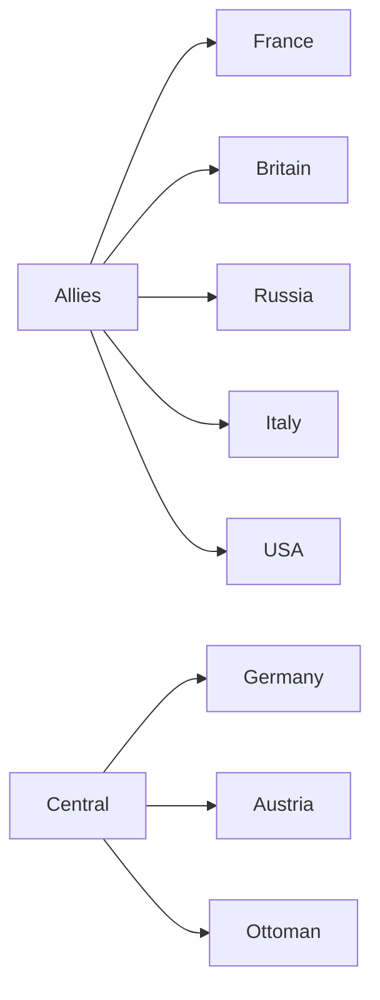
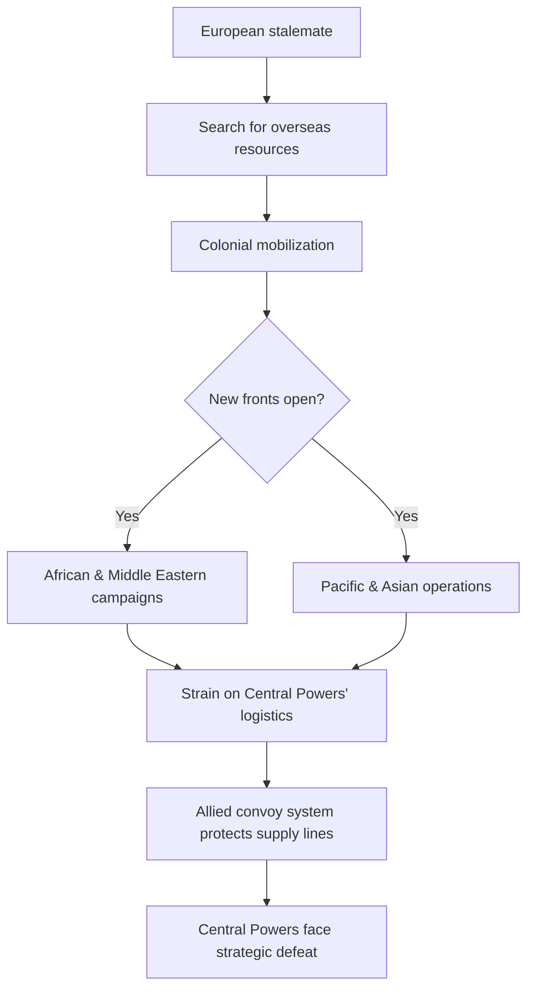
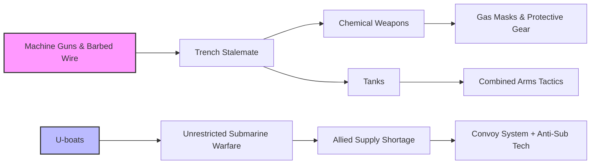
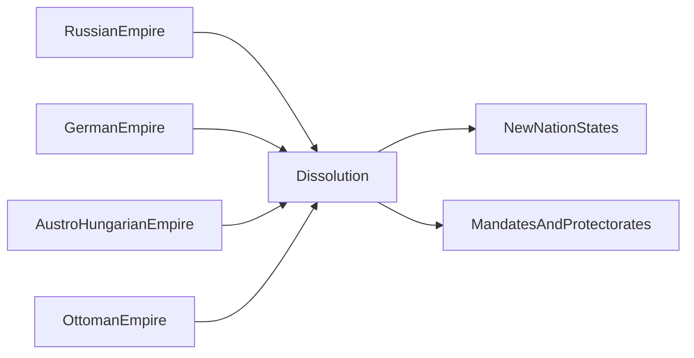
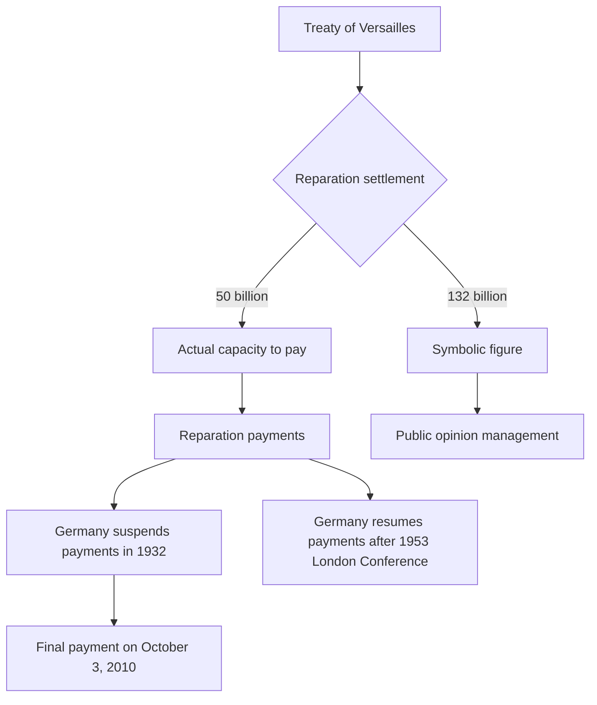
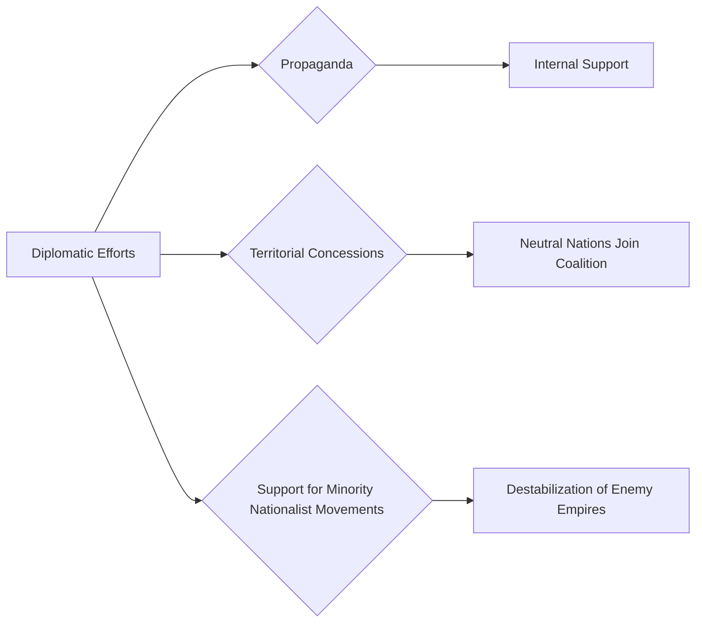

### 🗺️ Navigation

### Part I: The Origins and Outbreak of War
- [[#🕸️ Web of Alliances and Rivalries]]
- [[#🎯 The Sarajevo Assassination and the July Crisis]]

### Part II: The Nature of Combat and Technology
- [[#🏗️ The Transition to Trench Warfare]]
- [[#⚙️ Technological Developments]]
- [[#🚀 Technological Advancements in Combat]]

### Part III: Global Scope and U.S. Intervention
- [[#🌍 Global Scope of Conflict]]
- [[#🇺🇸 United States Entry and Turning Points]]

### Part IV: The End of Empires and Financial Aftermath
- [[#🏰 The Collapse of Empires and Peace Settlements]]
- [[#📊 Reparations and Post-War Financial Obligations]]

### Part V: Social Impact and Internal Dissent
- [[#🧍 Human and Social Costs]]
- [[#🌎 Nationalism and Wartime Political Support]]
- [[#🌎 Internal Dissent and Anti-War Movements]]

### Part VI: Diplomacy, Commemoration, and Legacy
- [[#📚 Challenges in Historical Commemoration and Education]]
- [[#📢 Wartime Diplomacy and Strategic Objectives]]
- [[#🌐 Memorialization and Legacy]]
- [[#🗺️ Challenges and Legacy]]

---

## ▣ I: The Origins and Outbreak of War

---

### 🕸️ Web of Alliances and Rivalries  

The First World War didn’t explode out of nowhere; it was the result of a tangled web of pacts, rival empires, and a frantic race to build bigger, better weapons. Imagine Europe as a crowded dance floor where everyone has promised to step in if a particular partner trips—so when one couple (Austria‑Hungary and Serbia) started pushing each other, the whole floor got pulled into a chaotic tumble.

> [!tip] **Intuition** – Think of the alliance systems like a set of dominoes glued together. A single push on one piece can set off a chain reaction that knocks down the entire structure, even if the original dispute was very local.

### 1.1 — Key Players and Their Pacts

The two big blocks were the **Allied Powers** (France, the British Empire, the Russian Empire, later Italy and the United States) and the **Central Powers** (Germany, Austria‑Hungary, the Ottoman Empire).  
- France, Britain, and Russia had formed the **Triple Entente**, a loose counter‑balance to the **Triple Alliance** of Germany, Austria‑Hungary, and Italy.  
- Italy eventually switched sides, and the United States entered the war in 1917, tipping the balance further toward the Allies.

### 1.2 — Arms Race and Security Dilemma

Before 1914 the great powers were locked in an arms race that resembled two neighbors constantly adding more locks and fences to their yards. Germany, following Alfred Thayer Mahan’s naval theory, poured money into a blue‑water navy to rival Britain’s fleet. By 1911 the “armaments turning point” (Rüstungswende) shifted German spending from ships to a massive army because the perceived threat came from the rapidly growing Russian forces.

> [!warning] **Pitfall** – It’s easy to blame the Anglo‑German naval competition alone for the war. The source reminds us that the shift to land‑based expansion was just as significant, so the “naval race” is only half the story.

### 1.3 — Flashpoints that Ignited the Powder Keg

Two concrete crises showed how fragile the balance had become:  

1. **Bosnian Crisis (1908‑1909)** – Austria‑Hungary’s annexation of Bosnia and Herzegovina outraged Russia, cutting off any chance of cooperation in the Balkans.  
2. **First Balkan War (1912‑1913)** – The Balkan League (Serbia, Bulgaria, Montenegro, Greece) drove the Ottoman Empire out of most of its European territories, raising Serbian ambitions and heightening Austro‑Hungarian anxiety.

These events turned the Balkans into the **“powder keg of Europe,”** where a single spark (the assassination of Archduke Franz Ferdinand) could set the whole continent ablaze.

> [!example] **Worked Example – Bosnian Crisis**  
> Austria‑Hungary announced it had taken over Bosnia and Herzegovina. Russia, seeing a threat to its Slavic allies, demanded a reversal. Germany backed Austria‑Hungary, leaving Russia isolated. The diplomatic stalemate forced both sides to start massive mobilizations, laying the groundwork for a broader war.

### 1.4 — Why the Alliances Matter

- **Cascade Effect:** Because countries were bound to defend each other, a local dispute quickly escalated into a global conflict.  
- **Balance of Power Collapse:** The war shattered the 19th‑century **Concert of Europe**, leading to the fall of four empires (German, Austro‑Hungarian, Ottoman, Russian) and the creation of new states such as Poland and Czechoslovakia.  
- **Long‑Term Consequences:** The inability of the post‑war **League of Nations** to enforce a lasting peace set the stage for another, even larger conflict two decades later.

> [!important] **Key Insight** – The web of alliances turned a regional crisis into a world war; understanding that web explains why the war’s scale was far beyond the initial spark.

### 1.5 — Visualizing the Alliance Network



*Diagram: Simple view of the two major alliance blocs and their member nations.*

### 1.6 — Takeaway

The pre‑war alliance system, coupled with intense imperial rivalry and an escalating arms race, created a fragile equilibrium that could not survive the slightest disturbance. When the July Crisis hit, the whole structure toppled, launching a conflict that reshaped the map of Europe and set the course for the turbulent twentieth century.

So, how exactly did one assassination turn into a global war?

### 🎯 The Sarajevo Assassination and the July Crisis

The whole world was teetering on a knife‑edge in the summer of 1914. When Archduke Franz Ferdinand was shot in Sarajevo, it was like lighting a match in a room full of gunpowder. The *July Crisis* that followed turned that spark into a continent‑wide blaze, largely because the great powers were already tangled in a web of alliances, rivalries, and rigid military plans.

### 1.7 — How a single murder set the gears grinding

On **June 28 1914** the Archduke’s car was ambushed by a Bosnian Serb nationalist. The hit itself was a local act, but the Austro‑Hungarian leadership saw it as an invitation to crush Serbian influence in the Balkans—a region they called the *“powder keg of Europe.”*  

1. **Austria‑Hungary issued an ultimatum to Serbia** that was deliberately harsh, hoping Serbia would reject it and give Vienna a casus belli.  
2. **Serbia’s reply** accepted most points but balked at a few, which Austria‑Hungary declared “unacceptable.”  
3. **Russia**, bound by Slavic kinship and its own strategic interests, began to **mobilize** in support of Serbia.  
4. **Germany**, allied with Austria‑Hungary, issued a *“blank check”* and started its own mobilization, invoking the **Schlieffen Plan**—the idea of a rapid strike through Belgium to knock France out before turning east against Russia.  
5. **France** and **Britain**, tied to Russia and alarmed by German movements, followed suit, and within weeks the major powers were marching toward each other’s borders.

> [!tip] **Chain reaction** – Once any great power began mobilizing, the others felt compelled to do the same. It was less a series of deliberate choices and more a *domino effect* driven by fear of being caught unprepared.

### 1.8 — The diplomatic dead‑ends

The July Crisis wasn’t just about armies; it was a cascade of failed diplomatic moves:

- **Austria‑Hungary’s ultimatum** was designed to be rejected, turning a political dispute into a war pretext.  
- **Russia’s early mobilization** forced Germany to activate the Schlieffen Plan earlier than ideal, compromising its original timetable.  
- **Britain’s entry** hinged on the violation of Belgian neutrality, a legal and moral trigger that pushed the UK into war despite public reluctance.

> [!warning] **Misreading intent** – Many leaders assumed the other side would back down after a show of force. In reality, the rigid alliance commitments turned any concession into a perceived betrayal, locking everyone into war.

### 1.9 — A concrete snapshot: The Austrian ultimatum

| Step | Action | Why it mattered |
|------|--------|-----------------|
| 1 | Austria‑Hungary delivers a 48‑hour ultimatum to Serbia (July 5) | Sets a deadline that Serbia can’t fully meet, creating a “legal” excuse for war |
| 2 | Serbia replies, accepting most demands but rejecting a few (July 6) | Shows Serbia’s willingness to negotiate, but Austria‑Hungary declares it insufficient |
| 3 | Austria‑Hungary declares war on Serbia (July 28) | Official start of hostilities; triggers Russian mobilization |
| 4 | Russia orders full mobilization (July 30) | Forces Germany to act under the Schlieffen Plan |
| 5 | Germany declares war on Russia (Aug 1) and on France (Aug 3) | Expands the conflict from a regional to a continental war |

> [!example] **Why the ultimatum mattered**  
> The Austro‑Hungarian demands were deliberately harsh—e.g., asking Serbia to allow Austro‑Hungarian officials to operate on Serbian soil. Serbia’s partial acceptance gave Austria‑Hungary a diplomatic justification for war, turning a political dispute into a *legal* trigger for mobilization.

### 1.10 — The bigger picture: Why the July Crisis still matters

- It illustrates how **rigid alliance systems** can turn a local conflict into a global war.  
- The rapid mobilizations show the danger of **pre‑set military plans** (like the Schlieffen Plan) that leave little room for diplomatic flexibility.  
- Understanding this cascade helps explain why later conflicts (e.g., WWII) emphasized *flexible* command structures and *controlled* mobilizations.

> [!important] **Key insight** – The July Crisis was less about the assassination itself and more about how existing *political* and *military* structures amplified a small spark into a full‑blown conflagration.

### 1.11 — Quick visual of the escalation


*Flowchart of the diplomatic‑military chain that turned a local murder into a world war.*

---

By the time the armistice was signed on 11 November 1918, the July Crisis had set in motion a cascade that reshaped empires, redrew borders, and left a legacy of 15‑22 million deaths. The lesson? **When alliances are tight and plans are rigid, even a tiny spark can ignite an uncontrollable blaze.**

So why did the war grind to such a sudden, muddy halt?

---

## ▣ II: The Nature of Combat and Technology

---

### 🏗️ The Transition to Trench Warfare  

When the war opened, both sides imagined a fast‑moving race: the Germans hoped to zip through Belgium, beat France, then swing east to Russia.  In reality it turned into two equally strong teams pushing against each other, and neither could tip the balance.  So they both dug in—literally—creating a line of trenches that stretched from the English Channel to the Swiss border.  That shift from rapid offense to static defence is the heart of the “Transition to Trench Warfare.”

### 2.1 — 🔎 Why the Early Offensive Fell Apart

The Schlieffen Plan was essentially “finish the French errand before the Russian one begins.”  But the “errand” dragged on: the right‑wing advance ran out of supplies, the left wing was forced to swing north, and the British Expeditionary Force arrived earlier than expected.  The result was a chaotic series of attempts to outflank each other—the infamous *Race to the Sea*.  

> [!tip] **Intuition** – Think of two friends arm‑wrestling with equal strength.  Neither can push the other over, so they both drop to the floor and brace themselves with their elbows.  The “elbows on the floor” are the trenches.  

As the front lines stretched, the armies realized that open‑field attacks were being shredded by **machine guns, heavy artillery, and endless barbed wire**.  The math of an assault became grim: every meter of advance cost dozens of lives, making a breakthrough “logistically improbable.”

### 2.2 — ⚒️ From the Race to the Sea to a Solidified Front

1. **Failure of rapid maneuver** – German troops could not sweep around the French left flank as planned.  
2. **Race to the Sea** – Both sides kept extending their flanks northward, digging temporary positions as they went.  
3. **Front line solidification** – The continuous line of fortifications finally linked up from the Channel to Switzerland, giving rise to the Western Front’s trench system.  


*Diagram: The chain of events that turned a mobile war into a stalemate of trenches.*

### 2.3 — 🪖 Life in the Trenches – The Human Cost of Stalemate

Once the lines froze, soldiers lived in muddy, water‑logged ditches for months.  Disease (trench foot, influenza) proved as lethal as bullets.  The Battle of the Somme illustrates how the static front produced catastrophic casualties even in a single day.

> [!example] **Somme Day‑One Casualties**  
> | Metric | Value |
> |--------|-------|
> | British casualties (day 1) | 57,500 |
> | Of those, dead | 19,200 |
>  
> The proportion of dead among casualties is  
> $$\text{Dead proportion} = \frac{19{,}200}{57{,}500} \approx 0.33,$$  
> meaning roughly **one in three** of the men lost that day never left the front.

> [!tip] **What the number tells us** – The sheer scale of loss on a single day shows how a static line turns every minor attack into a massive human gamble.

### 2.4 — 🧭 Key Insight: The Stalemate Logic

> [!important] **Why the stalemate persisted** – The combination of rapid‑fire weapons, artillery barrages, and barbed‑wire defenses made traditional “rush‑the‑enemy” tactics mathematically and logistically impossible.  Without a new way to breach the defenses, both sides settled into a war of attrition, grinding each other down over years rather tha[Allied Powers](Allied Powers)

###[Central Powers](Central Powers)sconception

Many think the Germans followed a single, unchanging “Schlieffen Plan” that doomed them from the start.  In fact, **Helmuth von Mol​tke** constantly tweaked the plan—canceling the Dutch incursion, altering the right‑wing to left‑wing force ratio, and reacting to real‑time intelligence.  The plan’s failure was less about a static blueprint and more about the brutal reality of modern firepower.

> [!warning] **Don’t assume** the German strategy was a rigid script; it was a flexible set of goals that fragmented under the pressure of new weapons and Allied resistance.

### 2.6 — 📚 Further Reading

We covered the coalition makeup earlier in [[#Allied Powers]] and [[#Central Powers]].  For a deeper dive into the *war of attrition* that trench warfare created, see the next section on **Global Scope of Conflict**.

So how did a fight that started in Europe end up consuming the rest of the globe?

---

## ▣ III: Global Scope and U.S. Intervention

---

### 🌍 Global Scope of Conflict

When we picture World I we instantly see the mud‑filled trenches of France, but the fighting really stretched across four continents.  The great powers dragged their colonies into the war, turned distant deserts and jungles into battlefields, and relied on troops and raw materials that came from the far corners of their empires.  Understanding **how** the conflict spilled outward helps us see why the war lasted so long and why its aftermath reshaped the world map.

### 3.1 — From Europe to the Colonies: the procedural cascade

1. **Strategic need for resources** – As the Western Front stalled into trench warfare, the belligerents looked to overseas colonies for food, minerals, and manpower.  
2. **Mobilizing colonial forces** – Imperial governments recruited local tribes, conscripted soldiers, and organized “colonial campaigns” to protect their holdings and attack enemy possessions.  
3. **Opening new fronts** – Fighting erupted in Africa (German East Africa vs. British/Belgian forces), the Middle East (Ottoman‑British clash over Palestine and Mesopotamia), and the Pacific (Japan’s seizure of German islands).  
4. **Linking logistics** – The Allied supply lines that crossed the Atlantic were threatened by Germany’s **unrestricted submarine warfare**.  To keep troops and materiel flowing to all these far‑flung fronts, the **convoy system** was adopted, grouping merchant ships with armed escorts—think of a herd of animals guarded by shepherd dogs.  

Each step depended on the previous one: without colonial troops you couldn’t hold a new front; without secure sea lanes you couldn’t feed those troops; without sea lanes the whole global effort collapses.

> [!note] **Why the colonies mattered**  
> Colonial economies supplied roughly half of the Allied war‑material budget.  Raw cotton from Egypt, rubber from the Congo, and troops from India were all essential to keep the Western Front supplied.

### 3.2 — Key non‑European campaigns

- **African theatre** – British and Belgian forces pursued German colonies in East Africa, while South African troops fought in the German Southwest Africa campaign.  
- **Middle Eastern theatre** – The British‑led Egyptian Expeditionary Force pushed the Ottoman Empire out of Palestine and Syria, culminating in the capture of Damascus in 1918.  
- **Asia‑Pacific theatre** – Japan, honoring its alliance with Britain, seized German holdings in the Pacific (e.g., the Marshall Islands), extending the war’s reach to the oceans.  

These operations weren’t side shows; they strained Central‑Power resources and forced the Ottoman Empire into a **strategic defeat** when the Macedonian breakthrough cut its supply lines.

> [!warning] **Common misconception**  
> Many think Italy’s entry was a direct result of the Triple Alliance. In reality, Italy argued the alliance was defensive and only joined the Entente after the secret **Treaty of London** promised territorial gains.

### 3.3 — Worked example: The Battle of Sarikamish (Ottoman front)

| Detail | Value |
|--------|-------|
| Commander | Enver Pasha |
| Troops engaged | ~100 000 Ottoman soldiers |
| Terrain | Snow‑covered Armenian highlands |
| Outcome | 86 % casualty rate (≈ 86 000 killed or wounded) |
| Strategic impact | Severely weakened Ottoman forces on the Eastern Front, contributing to the later **strategic defeat** of the empire |

> [!example] **What the numbers tell us**  
> The staggering loss shows how a poorly planned **frontal assault** in difficult terrain can cripple an army far from Europe, echoing the same attrition the Western Front suffered but on a different continent.

### 3.4 — Comparing the global theaters

| Feature | European Front | African Campaign | Middle Eastern Front | Pacific/Asian Theater |
|---------|----------------|------------------|----------------------|-----------------------|
| Primary combat style | Trench & frontal assaults | Guerrilla & colonial mobilization | Guerrilla + conventional sieges | Naval blockades & island seizures |
| Main adversaries | Germany vs. France/UK | Germany vs. Britain/Belgium | Ottoman Empire vs. Britain/Arab rebels | Germany vs. Japan/Allied navies |
| Key resource at stake | Coal & steel | Rubber & minerals | Oil & wheat | Strategic islands & sea lanes |
| Outcome for Central Powers | Stalemate → attrition | Loss of colonies | Collapse after Macedonian breakthrough | Naval containment after Jutland |

> [!tip] **Remember the analogy** – Think of the global war as a chess game where each continent is a different board.  Moves on one board (e.g., a convoy protecting a merchant ship) affect the pieces you can play on another (e.g., troops you can send to Africa).

### 3.5 — The big‑picture flow of the global conflict


*Flowchart of how the war spread from Europe to the colonies and back to Europe.*

> [!important] **Key insight** – The war’s global scope turned a European conflict into a world‑wide struggle for resources, making **logistics** (convoys, submarine warfare, colonial supplies) the decisive factor rather than any single battlefield.

---

If you want to see how trench warfare on the Western Front fed into this global picture, check out [[#🏗️ The Transition to Trench Warfare]].

But how did these logistics struggles change the actual tools soldiers used on the front lines?

---

## ▣ II: The Nature of Combat and Technology

---

### ⚙️ Technological Developments  

The First World War was a laboratory for brutal new toys.  From poisonous clouds that turned a battlefield into a nightmare, to metal beasts that tried to roll over the endless trench lines, and silent submarines that turned the ocean into a hunting ground – each invention forced armies to rewrite the rules of fighting.

### 2.1 — 💨 Chemical Weapons – “the poison wind”

In 1915 the German army released chlorine gas at the Second Battle of Ypres.  It was the first time a whole ‑ front ‑ was attacked with a toxic cloud.  Soldiers who slipped into the green‑yellow haze suffered burning lungs and eyes; the only defence was a rag soaked in urine or a simple mask.  

> [!important] **Why it matters**  
> Chemical weapons forced commanders to add a whole new layer of protection (gas masks, early warning systems).  They turned the already deadly trench environment into a sensory nightmare, making morale and discipline even more fragile.

### 2.2 — 🛡️ Tanks – “the iron beetles”

The Allies introduced tanks in 1916 to punch holes through the barbed‑wire, machine‑gun scarred “no‑man’s land.”  The idea was simple: a heavily armored vehicle could survive small‑arms fire and crush obstacles, giving infantry a foothold.  Early models were slow and broke down a lot, but the concept proved that mechanized breakthroughs could end the stalemate.

> [!tip] **Remember** – tanks were not a silver bullet.  They worked best when paired with coordinated artillery and infantry assaults; otherwise they just sat stuck in the mud.

### 2.3 — 🌊 Unrestricted Submarine Warfare – “the hidden hunter”

Germany’s U‑boats began sinking any ship that entered the Atlantic, regardless of flag or cargo.  The goal was to choke Britain’s supply lines before the United States could intervene.

A very simple way to think about the impact is:

$$\boxed{ \text{SupplyLossFraction} = \frac{\text{Ships Sunk}}{\text{Total Ships Sent}} }$$  

If a convoy of 100 merchant vessels loses 30 to submarines, the loss fraction is 0.30 – a huge hit to food, ammunition, and raw materials.

> [!warning] **Common mistake** – People assume “unrestricted” means every single ship was destroyed.  In reality the British responded with the **convoy system**, grouping merchant ships with destroyer escorts, hydrophones, and depth charges.  This cut the loss fraction dramatically (often below 0.05).

#### Mini‑example (illustrative)

> [!example] **How the convoy system helped**  
> Suppose 200 ships need to cross the Atlantic each month.  Without convoys, submarines sink 30 % → 60 ships lost.  With convoys, the sink rate drops to 5 % → only 10 ships lost.  That’s a net **saving of 50 ships**, or roughly **500,000 tons of supplies** (assuming 10 000 t per ship).  

> [!info] *This is a simplified illustration; the exact numbers varied throughout the war.*

### 2.4 — 📊 Quick comparison of the three breakthrough technologies

| Feature | Chemical Weapons | Tanks | Unrestricted Submarine Warfare |
|---------|------------------|------|---------------------------------|
| First used | 1915 (Second Battle of Ypres) | 1916 (Battle of the Somme) | 1915 (German U‑boat campaign) |
| Primary target | Enemy troops in trenches | Trench lines & fortifications | Merchant shipping & supply routes |
| Main effect | Respiratory injury, panic | Breaks static defenses | Cuts off food & materiel |
| Countermeasure | Gas masks, early warning | Artillery coordination, improved tracks | Convoys, depth charges, hydrophones |


*Flow of how new tech forced new defenses.*

### 2.5 — 🔧 How these inventions reshaped combat

1. **Stalemate → Innovation Loop** – The dead‑lock of trench warfare made armies desperate for anything that could tip the balance.  
2. **New weapon → New defense** – Every breakthrough (gas, tanks, subs) was met almost immediately with a counter‑measure (masks, combined arms, convoys).  
3. **Escalation of total war** – As each side tried to out‑do the other, the war’s scope broadened beyond the front lines to civilian shipping, industry, and even the home front.

> [!note] **Takeaway** – Technological developments weren’t isolated gadgets; they were catalysts that forced the whole war machine – soldiers, engineers, politicians – to adapt, often at a terrible human cost.  

---

*Next up we’ll see how all these changes fed into the United States’ decision to join the fight and the turning points that followed.*

So, what finally pushed the U.S. to jump into the fight, and how did their arrival change the game?

---

## ▣ III: Global Scope and U.S. Intervention

---

### 🇺🇸 United States Entry and Turning Points

When the United States finally jumped into the Great War, it wasn’t just a “fresh set of troops” – it was a whole new surge of men, money, and political weight that helped tip the balance after the Eastern Front had already started to crumble.

### 3.1 — Why the timing mattered

The Russian Empire’s exit via the Treaty of Brest‑Litovsk on **3 March 1918** freed up huge German forces that had been tied up in the east. At the same time, the German spring offensives were sputtering out because the army lacked the motorized logistics to keep the gains alive on the shattered battlefield. That left the Central Powers exhausted and the Allies looking for a decisive boost.

Enter the United States. By the summer of 1918 the American Expeditionary Forces (AEF) were arriving in France as an **independent** army under General John J. Pershing. The U.S. insisted on keeping the AEF separate from French and British units so it could have a direct seat at the peace‑making table later on. This independence meant the Allies could count on a fresh, well‑supplied block of soldiers that wasn’t already depleted by years of trench fighting.

### 3.2 — The procedural chain of events

1. **Selective Service Act of 1917** – Congress drafted **2.8 million** men, swelling the U.S. Army from fewer than **300,000** to a force that could field two million overseas troops.  
2. **Training & transport** – New recruits were trained at camps across the States, then shipped across the Atlantic in convoys protected from German U‑boats.  
3. **AEF deployment** – Pershing’s command landed in France, set up its own command structure, and began coordinating with the British and French high commands.  
4. **Combined offensives** – With the Eastern Front already quiet, the Allies launched the **Hundred Days Offensive** (August – November 1918). Fresh American divisions filled gaps, reinforced exhausted sectors, and helped push the Germans back from the Hindenburg Line.  
5. **German collapse** – The spring offensive’s failure, the loss of the Hindenburg defensive line, and the relentless Allied advance forced Germany’s morale and supply lines to snap, much like an overstretched rubber band snapping back.  
6. **Armistice** – The cumulative pressure led to the **Armistice of 11 November 1918**, ending the fighting.

> [!example] **Numbers in action**  
> | Metric | Before U.S. entry | After U.S. entry (late 1918) |
> |--------|-------------------|-----------------------------|
> | Allied manpower on Western Front | ~5 million | ~7 million (including ~2 million Americans) |
> | German frontline troops | ~5 million | ~4 million (attrition & desertion) |
> | Daily casualties (average) | ~30,000 | ~15,000 (declining as offensives succeeded) |
> The influx of American troops helped tip the manpower balance by roughly **2 million** and accelerated the decline in daily casualties as the offensive gained ground.

> [!tip] **Why Pershing’s insistence mattered**  
> Keeping the AEF independent let the U.S. negotiate from a position of strength at Versailles. If American soldiers had been fully merged into French or British units, Washington would have had less leverage in shaping the post‑war settlement.

> [!important] **Key insight**  
> The United States didn’t just add numbers; it added **political clout** and **logistical capacity** (food, ammunition, medical supplies) that the war‑fatigued Allies desperately needed. The combination of fresh troops and the Eastern Front’s silence created a perfect storm that broke the stalemate on the Western Front.

> [!warning] **Pitfall to remember**  
> Even with the American boost, the Allies still suffered when they relied too heavily on static defenses like the Hindenburg Line. Once that line fell, German morale collapsed rapidly—a reminder that **mobility and supply** trump entrenched positions in a total‑war context.

### 3.3 — Visualizing the flow

```mermaid
flowchart TD
    A[US Draft & Mobilization] --> B[AEF Training & Transport]
    B --> C[AEF Arrival in France (Independent Force)]
    C --> D[Allied Coordination on Western Front]
    D --> E[Hundred Days Offensive]
    E --> F[German Front Collapse]
    F --> G[Armistice 11 Nov 1918]
```
*Flow of the United States’ entry and its impact on the final Allied offensives.*

### 3.4 — The rubber‑band intuition

Think of the German army in 1918 as a stretched rubber band. The spring offensives stretched it further, but the **lack of logistics** meant the band couldn’t hold the tension. When the Allies, now reinforced by American troops, pushed back during the Hundred Days Offensive, the band snapped—morale and defensive lines collapsed in a rapid “snap back” that the Central Powers couldn’t recover from.

### 3.5 — Bottom line

The United States’ entry provided a decisive **quantitative and qualitative boost** at the exact moment the Eastern Front had already quieted and German resources were exhausted. This combination turned the long‑standing stalemate into a rapid Allied advance, culminating in the armistice that ended the war.

$$\boxed{\text{US troops + Eastern Front collapse } \Longrightarrow \text{Hundred Days Offensive } \Longrightarrow \text{Armistice (11 Nov 1918)}}$$

So what happened to the political map once the fighting finally stopped?

---

## ▣ IV: The End of Empires and Financial Aftermath

---

### 🏰 The Collapse of Empires and Peace Settlements

World War I didn’t just end with an armistice; it ripped apart four centuries‑old empires and forced the world to redraw its political map. The peace treaties that followed tried to turn chaos into order, but the harsh terms sowed resentment that echoed for decades.

### 4.1 — Why the Empires Fell

The war exhausted the ruling houses on several fronts:

- **Russian Empire** – revolutions at home (1917) toppled the Tsar.
- **German Empire** – military defeat, internal revolution, and the Allied Hundred‑Days Offensive.
- **Austro‑Hungarian Empire** – nationalist uprisings among its many ethnic groups.
- **Ottoman Empire** – military collapse in the Middle East and Allied occupation.

Think of the empires as a house of cards. The front‑line battles were the first cards knocked over; once the foundation (the monarchies) crumbled, the whole structure fell apart.

> [!important] **Key Takeaway**  
> The post‑war settlements didn’t just punish the Central Powers; they **removed the political scaffolding** that had held Europe together for generations, creating a vacuum filled by new nation‑states.

### 4.2 — The Treaty Web

The major peace treaties (Versailles, Saint‑Germain‑en‑Laye, Trianon, Sèvres, and later Lausanne) performed three main functions:

1. **Formalize the armistice** – the legal end to fighting.  
2. **Redraw borders** – carving out independent states from former imperial territories.  
3. **Impose obligations** – reparations, military restrictions, and the infamous *War Guilt Clause* (Article 231).

The “War Guilt Clause” forced Germany to accept full responsibility for the war, which later fueled political extremism.

> [!warning] **Common Pitfall**  
> Ignoring the impact of the *War Guilt Clause* leads to an incomplete picture of why the Versailles Treaty became a lightning rod for German resentment.

### 4.3 — Worked Example: Hungary’s Losses

The treaties of Saint‑Germain‑en‑Laye (1920) and Trianon (1920) dramatically shrank Hungary.

| Metric | Before Treaty | After Treaty |
|--------|---------------|--------------|
| Total population | ~20 million | ~7 million (≈ 64 % loss) |
| Ethnic Hungarian population | ~10 million | ~7 million (≈ 31 % loss) |
| Territory (km²) | 93 000 | 28 000 (≈ 70 % loss) |

**What this means:** Millions of ethnic Hungarians found themselves overnight in new countries (Czechoslovakia, Romania, Yugoslavia), fueling irredentist tensions that resurfaced throughout the 20th century.

> [!tip] **Interpretation**  
> Territorial losses weren’t just lines on a map; they created **minorities** with grievances, which later became flashpoints for conflict (e.g., the Sudeten crisis).

### 4.4 — Visual Overview


*Diagram: The four major empires dissolve and give rise to new nation‑states and mandated territories.*

### 4.5 — Legacy of the Settlements

- **Resentment:** Harsh reparations and territorial cuts left a bitter taste, especially in Germany and Hungary.  
- **Instability:** New borders often ignored ethnic realities, planting seeds for future disputes (e.g., Yugoslav wars).  
- **League of Nations:** Established to manage these tensions, but its lack of enforcement power limited effectiveness.

$$\boxed{\text{Four Empires dissolved \to New states + lingering grievances}}$$

> [!question] **What would have happened if the peace terms were softer?**  
> Some historians argue a less punitive Versailles might have reduced the rise of extremist movements, but the deep‑seated nationalist ambitions would still have posed challenges.

---

In short, the end of World I was less a neat conclusion than a chaotic reshuffling of power. The collapse of empires created a patchwork of new nations, each carrying the weight of lost territories and wounded pride—a legacy that shaped the entire 20th century.

But beyond the shifting borders and political power struggles, what was the actual human toll of the conflict?

---

## ▣ V: Social Impact and Internal Dissent

---

### 🧍 Human and Social Costs

World War I wasn’t just a battle of armies—it was a **total war** that pulled entire societies into the conflict.  Millions of soldiers fell, but the ripple effects on civilians, public health, and social roles were just as staggering.

> [!warning] **Common Misconception**  
> The armistice on 11 November 1918 only stopped the fighting.  A formal state of war lingered for months or even years for many nations, and the true human toll kept rising long after the guns fell silent.

### 5.1 — A quick look at the numbers

| Category | Approx. Count | What it tells us |
|----------|--------------|------------------|
| British casualties on the first day of the Somme (1 July 1916) | 57 500 (19 200 dead) | One day of fighting wiped out a whole battalion‑size group of men. |
| Indian soldiers & laborers killed | 47 746 | The empire’s far‑flung subjects paid a heavy price. |
| Chemical‑weapon casualties (all sides) | 1.3 million total, ~90 000 fatal | New technology turned a “new weapon” into a mass‑injury hazard. |
| Assyrian Christians killed (1915‑1922) | ≥ 250 000 | Ethnic and religious groups suffered genocidal violence alongside the war. |
| Anatolian & Pontic Greeks killed | 350 000 – 750 000 | Another massive civilian death toll tied to wartime upheaval. |

These figures are only the tip of the iceberg; disease added millions more deaths, most famously the Spanish flu pandemic that rode on the same troop movements and crowded hospitals.

### 5.2 — Social upheaval: women and the economy

The war forced governments to **mobilize the whole economy**, pushing national GDP shares above 50 % in Germany, France, and Britain.  With so many men at the front, women stepped into factories, offices, and transport roles that had previously been off‑limits.

> [!important] **Key Insight**  
> The shift of women into the workforce was not a side‑effect—it was a defining feature of total war.  It reshaped gender expectations and laid groundwork for later suffrage movements.

### 5.3 — From trenches to the home front

The conflict’s structure can be visualized as a cascade of impacts:

```mermaid
flowchart LR
    WarBegins[War Begins] --> MilitaryDeaths[Military Deaths]
    MilitaryDeaths --> CivilianSuffering[Civilian Suffering]
    CivilianSuffering --> DiseaseOutbreaks[Disease Outbreaks]
    CivilianSuffering --> SocialShifts[Social Shifts (Women in Workforce)]
```
*Flow of human and social costs from the battlefield to civilian life.*

### 5.4 — The big picture takeaway

- **Human loss**: Millions dead on the battlefield, plus countless civilians killed in ethnic violence, chemical attacks, and disease.
- **Social transformation**: Massive entry of women into paid work, altering family dynamics and fueling post‑war political change.
- **Long‑term health crisis**: The war’s logistics and poor sanitation helped spread the Spanish flu, turning a military tragedy into a global pandemic.

All of this reminds us that the true cost of a war is measured not just in battles won or lost, but in how societies are reshaped—and how many lives are irrevocably altered—in its wake.

So how did the victors decide what Germany actually owed after all that destruction?

---

## ▣ IV: The End of Empires and Financial Aftermath

---

### 📊 Reparations and Post-War Financial Obligations
The concept of reparations after World War I was a complex and contentious issue. It's essential to understand the mechanism behind the establishment of the legal basis for reparations under the Treaty of Versailles and the long-term process of repayment.

The Treaty of Versailles imposed heavy reparations on Germany, with a total sum fixed at 132 billion gold marks in 1921. However, only 50 billion represented the actual assessed capacity to pay, while the rest was a symbolic figure designed to manage public opinion. This is similar to the difference between a 'sticker price' and an 'actual price' - the Allies set an impossible headline number to satisfy the public, but privately knew only 50 billion was realistic.

> [!important] The economic and political fallout from war reparations and debt influenced global stability, contributing to economic crises and eventually shaping international financial obligations that lasted nearly a century.

The reparation settlement process was not straightforward. Germany suspended reparation payments in 1932, resumed payments after the 1953 London Conference, and completed the final payment on October 3, 2010. Reparations could be paid in cash or in-kind, such as coal, timber, and chemical dyes. Additionally, territory lost by Germany under the Treaty of Versailles and assistance in restoring the Library of Louvain were credited against the reparation figure.

It's also interesting to note that Article 231, the 'war guilt' clause, was intentionally worded to establish a legal foundation for reparations, rather than being a genuine admission of war guilt by Germany, Austria, or Hungary. This clause has been the subject of much debate and controversy over the years.

> [!example] By 1932, Germany had paid 20.598 billion gold marks in reparation payments before payments were suspended. Meanwhile, countries like Australia received £5,571,720 in reparations, but their direct war costs and subsequent long-term financial commitments exceeded £1 billion.

The implications of the reparation payments were far-reaching. The cancellation of bonds by the Nazi regime did not nullify the legal existence of the agreements, which remained in effect. It's essential to understand the intricacies of the reparation settlement process to appreciate the complex web of economic and political obligations that arose from World War I.


The reparation settlement process was a long and complex one, with significant economic and political implications. It's crucial to understand the mechanisms behind the establishment of the legal basis for reparations and the long-term process of repayment to appreciate the far-reaching consequences of World War I.

Beyond the economic burden of reparations, how did the rise of nationalism influence support for the war effort itself?

---

## ▣ V: Social Impact and Internal Dissent

---

### 🌎 Nationalism and Wartime Political Support
Nationalism played a significant role in shaping the dynamics of World War I, from influencing alliances to fueling independence movements. The complex interplay between nationalist ideologies and political mobilization not only affected the war effort but also had lasting impacts on global politics and economies.

The concept of **nationalism** is crucial here, defined as an ideology that prioritizes the interests and sovereignty of a specific nation, often leading to desires for independence or territorial expansion. This ideology was a powerful motivator during the war, as various groups sought to advance their national interests amidst the global conflict.

One of the mechanisms through which nationalism influenced the war was **political mobilization**, including the organization of patriotic funds to support soldiers, their families, and those injured during the war. These efforts not only reflected nationalist sentiments but also contributed to the war effort by providing financial and moral support.

However, nationalism also contributed to the **suppression of dissent**. Governments utilized legal frameworks to classify opposition to recruitment as a federal crime and censor critical publications, highlighting the complex relationship between nationalism, political support, and the suppression of opposition voices.

The aftermath of the war saw the imposition of **war reparations**, with the Treaty of Versailles demanding significant financial payments from defeated nations. The structure of these reparations was complex, with the total sum divided into categories, one of which was intentionally set high to satisfy public expectations, while the others represented the actual assessed capacity for payment.

> [!important] The economic and political fallout from reparations and nationalistic movements demonstrates how wartime agreements and internal social fractures shape geopolitical stability for decades after a conflict ends.

For example, Germany was assessed 132 billion gold marks, but only 50 billion represented the actual payment capacity. This discrepancy highlights the political manipulation of reparation figures, which were often used to placate public opinion rather than reflect economic reality.

> [!tip] Think of the reparations process like a loan agreement: even if the debtor stops paying during a crisis, the debt itself doesn't disappear legally; it simply waits until the debtor is back on their feet to be resolved.

Understanding the role of nationalism and wartime political support is essential for grasping the complexities of World War I and its lasting impacts on global politics and economies. The interplay between nationalist movements, political mobilization, and the economic consequences of war reparations set the stage for the geopolitical landscape of the 20th century.


Caption: The relationship between nationalism, political mobilization, war effort, war reparations, geopolitical stability, and global economics.

The legacy of World War I, including the impact of nationalism and the system of war reparations, continues to influence international relations and global economic policies. The complexity of these issues underscores the need for a nuanced understanding of the historical context and the ongoing effects of wartime agreements and nationalist movements.

But while those global factors were shifting, what was happening with the people back home who didn't want to fight at all?

### 🌎 Internal Dissent and Anti-War Movements
Internal dissent and anti-war movements played a significant role in World War I, with various forms of domestic opposition emerging in response to the conflict. This opposition ranged from organized strikes and conscientious objection to state-level crackdowns on political expression.

The concept of **conscientious objection** is particularly relevant here, referring to individuals who refused to participate in military service or warfare based on socialist, religious, or moral grounds. Conscientious objectors often faced significant challenges and persecution, highlighting the complexities of balancing individual beliefs with national duty during times of war.

> [!example] **Conscientious Objector Example**
> Consider the case of an individual who, due to deeply held religious beliefs, cannot participate in military combat. This person would be considered a conscientious objector, and their decision would be based on moral or ethical grounds rather than political ideology.

Another important aspect of internal dissent was the role of **patriotic funding**. These funds were essentially grassroots efforts by citizens to support the families of soldiers, filling gaps where government support was insufficient. However, patriotic funds were also criticized for redundancy and wastefulness, with nearly 1,000 such funds existing in New Zealand by 1919, necessitating significant reform.

> [!tip] **Understanding Patriotic Funds**
> Think of patriotic funds as a massive, grassroots insurance and charity system. When the government could not fully provide for the families of soldiers, ordinary citizens created these independent organizations to cover the gap. This highlights the complex relationship between public support for the war effort and the practical needs of those affected by it.

The evolution of **indirect artillery fire** also reflects how military tactics adapted to technological advancements during the war. Initially, cannons were positioned on the front line for direct targeting, but by 1917, the practice shifted to indirect fire, utilizing spotting methods and communication tools like field telephones. This shift can be thought of as moving from 'point-and-shoot' photography to using a GPS-guided drone, where instead of standing in front of your target, you use modern tools to strike from a distance.

> [!important] **The Shift to Indirect Fire**
> The evolution from direct to indirect artillery fire represents a significant technological and tactical shift during World War I. This change, along with the development of machine guns and poison gas, contributed to the high casualty rates and the eventual move towards more modernized, communication-reliant combat tactics.

---

## ▣ VI: Diplomacy, Commemoration, and Legacy

---

### 🗺️ Challenges and Legacy
The challenges posed by internal dissent and anti-war movements were significant, with nations struggling to maintain domestic stability amidst the pressures of total war. The use of **wartime diplomacy** and strategic objectives, including propaganda campaigns, defining harsh war goals, and managing failed peace proposals, further complicated the landscape.

Understanding these dynamics provides insight into why the war's later stages were distinct from its opening, as armies moved from rigid tactical formations to modernized combat. The legacy of World War I, including the creation of vast memorial systems and the reshaping of European political landscapes, continues to influence global politics and international relations.

> [!warning] **Restricting Civil Liberties**
> Governments that heavily restricted civil liberties, such as the US via the Sedition Act of 1918, risked creating deep domestic resentment by criminalizing expressions of dissent or statements deemed unpatriotic. This highlights the delicate balance between national security and individual freedoms during times of war.

In conclusion, internal dissent and anti-war movements during World War I were complex and multifaceted, reflecting a wide range of political, social, and moral responses to the conflict. Understanding these movements and their implications is crucial for grasping the full scope of the war's impact on nations and societies.

With the domestic landscape transformed, how did the war change on the front lines?

---

## ▣ II: The Nature of Combat and Technology

---

### 🚀 Technological Advancements in Combat
The modernization of military tactics and weaponry during World War I was a significant factor in the conflict's progression. This period saw the introduction of aircraft, tanks, and chemical warfare, which drastically changed the face of combat.

### 2.1 — Transition to Modern Warfare
The transition from 19th-century tactics to modern equipment was a major shift for major armies. This included the use of tanks, armored cars, aircraft, and advanced communication tools like the field telephone. The idea was to move away from direct, line-of-sight combat to a more strategic, technologically driven approach.

> [!example] **Artillery Advancement**
> Consider the change in artillery as moving from 'aiming at what you can see' to 'using a scout on a hill or in a plane to tell you where to shoot' so you can stay safely hidden. This method, known as indirect fire, relied on external spotting via aircraft or telephone to target enemies not in direct line of sight.

### 2.2 — Indirect Fire Artillery
Indirect fire artillery was a method of engagement where weapons were aimed at targets not in the direct line of sight of the gunner. This approach often used external spotting via aircraft or telephone. The shift from direct-fire cannons positioned in the front line to a system relying on indirect fire, aerial observation, and telephone coordination marked a significant advancement in artillery tactics.

### 2.3 — Aerial Warfare Innovation
The use of aircraft in combat was a new and innovative tactic during World War I. For example, HMS Furious launched Sopwith Camels in 1918 to destroy Zeppelin hangars, marking an early use of aircraft carriers. This showed the potential of aerial warfare and paved the way for future developments in military aviation.

### 2.4 — Consequences of Technological Advancements
The shift to modern, large-scale technology in warfare explains the inevitability of mass casualties during the conflict. The introduction of poison gas, although not decisive, was extensively used and had severe consequences. Additionally, conscientious objectors, who refused to perform military service due to personal, religious, or socialist convictions, faced severe social and legal repercussions.

### 2.5 — Memorialization and Remembrance
The aftermath of the war saw the establishment of memorials in thousands of towns, with the formalization of burial sites managed by organizations like the Commonwealth War Graves Commission. This effort aimed to honor the fallen and provide a sense of closure to the bereaved.


> [!important] **The Impact of Technological Advancements**
> The transformation of World War I from a conflict of 19th-century tactics to one of 20th-century technology had far-reaching consequences. It not only changed the nature of warfare but also had significant social and political impacts, leading to the rise of conscientious objection and complex diplomatic maneuvering.

So, how do we actually go about teaching a conflict with such a murky moral landscape?

---

## ▣ VI: Diplomacy, Commemoration, and Legacy

---

### 📚 Challenges in Historical Commemoration and Education

Teaching the First World War is a complex task due to its lack of a clear good-versus-evil narrative. Unlike World War II, which is often portrayed as a struggle between clear heroes and villains, World War I feels more like a complicated, tragic story without a simple "right" side. This complexity makes it harder for educators to convey the significance and impact of the war.

> [!important] **Historiography of WWI**: The study of the development and changing perspectives of historical writing and interpretation over time is crucial in understanding how World War I is taught and remembered. Historiography helps explain why WWI is taught differently than other wars, highlighting the transition from purely military focus to broader social, cultural, and scientific inquiries.

One of the challenges in commemorating World War I is the physical legacy of unexploded munitions. **Unexploded ordnance** refers to military munitions that have been primed, fuzed, armed, or otherwise prepared for action, and which remain in the ground after a conflict. The disposal of these munitions involves specialized weapons disposal units responding to discoveries made by local inhabitants in former battlefield regions. This ongoing process serves as a reminder of the enduring impact of the war on the environment and local communities.

Commemoration of World War I involves the construction of physical memorials, such as the Menin Gate Memorial and the Thiepval Memorial, which serve as monuments to the missing. Literary works like "In Flanders Fields" are also recited to symbolize reconciliation. State-level diplomatic actions, such as the centenary of the Armistice of Compiègne, serve to reinforce modern diplomatic reconciliation between former combatant nations.

> [!example] **Commemorative Events**: In 2014, French and German leaders laid the first stone of a memorial at Hartmannswillerkopf to mark the centenary of the declaration of war. This event demonstrates how commemorative events can promote reconciliation and diplomatic cooperation between former combatant nations.

The historiography of World War I has undergone a significant transformation in recent years. Historian Heather Jones notes a "cultural turn" in the 21st century that shifted focus to topics like race, gender, mental health, and medical science. This expanded perspective has enriched our understanding of the war and its impact on individuals and societies.

> [!tip] **Teaching WWI**: When teaching World War I, it's essential to avoid relying on simplified tropes and instead emphasize the complexity and nuance of the conflict. By exploring the diverse cultural and scientific perspectives that have emerged in recent years, educators can provide a more comprehensive and engaging understanding of the war and its ongoing legacy.

In conclusion, the challenges in historical commemoration and education of World War I are significant, but by embracing the complexity and nuance of the conflict, we can gain a deeper understanding of its impact and significance. As we continue to commemorate and educate about the war, it's essential to prioritize a nuanced and multifaceted approach that reflects the latest historical research and perspectives.

So, how did the actual diplomatic maneuvering on the global stage shape these shifting narratives?

### 📢 Wartime Diplomacy and Strategic Objectives
Wartime diplomacy during World War I involved various strategies to gain support or undermine enemies. One key aspect was the use of propaganda to bolster internal support and redefine war goals over time. Nations also offered neutral countries territorial concessions to join coalitions and supported minority nationalist movements to destabilize enemy empires.

> [!example] **Propaganda and Territorial Concessions**
> For instance, countries would promise neutral nations control over certain territories if they joined the coalition. This tactic was used to lure nations into the war, altering the balance of power.

The evolution of warfare during this period was marked by the adoption of new technologies, such as indirect fire, which allowed for more effective artillery deployment. The introduction of specialized machinery, including tanks and aircraft, significantly impacted the nature of combat.



### 🔍 The Impact of Diplomatic Efforts
The effectiveness of these diplomatic strategies is a matter of debate. While they may have contributed to the involvement of more nations in the war, the ultimate outcome was not significantly altered by these efforts alone. The legacy of World War I includes widespread memorialization for the millions who died, reflecting the profound impact of the conflict on society.

> [!important] **Understanding the Dynamics of Wartime Diplomacy**
> Recognizing the interplay between internal societal pressure, technological adaptation, and traditional diplomacy is crucial for grasping the complexities of World War I. Each of these factors played a critical role in the war's outcome.

The period was also marked by significant internal political instability, with events like the Conscription Crisis in Ireland and Bolshevik-led riots in Russia and Italy. The combination of these factors—intense diplomacy, rapid technological advancement, and internal unrest—defined the latter years of the war.

> [!tip] **The Role of Technology in Warfare**
> The introduction of new technologies, such as tanks and aircraft, signaled a profound shift in the nature of warfare. These advancements, alongside the use of indirect fire, made traditional tactics obsolete and forced military strategists to adapt.

In conclusion, the wartime diplomacy and strategic objectives during World War I were characterized by a complex interplay of propaganda, territorial incentives, and the support of nationalist movements. Understanding these dynamics provides insight into the war's progression and its lasting impact on global politics and society.

### 🌐 Memorialization and Legacy
The aftermath of World War I saw an unprecedented effort in memorialization, reflecting the profound impact of the conflict on nations and communities worldwide. This legacy continues to influence international relations and global security discussions today.

> [!note] **The Enduring Impact of World War I**
> The Great War, as it was once known, left an indelible mark on history. Its influence can be seen in the geopolitical landscape, the evolution of military technology, and the ongoing efforts towards international cooperation and peace.

---

| Term | Definition |
|------|------------|
| **Alliance** | A formal agreement between nations to provide mutual military protection. |
| **Armistice** | An official agreement to stop fighting, such as the one signed on 11 November 1918. |
| **Attrition** | A military strategy of wearing down the enemy's strength through continuous losses. |
| **Casus belli** | A Latin term for an act or event that justifies a declaration of war. |
| **Conscientious objector** | An individual who refuses military service based on religious or moral beliefs. |
| **Convoy system** | The practice of surrounding merchant ships with naval escorts to protect them from submarines. |
| **Indirect fire** | Artillery fire aimed at a target not visible to the gunner, often coordinated by spotters. |
| **Mobilization** | The act of assembling and preparing troops and supplies for active war service. |
| **No-man's land** | The disputed, dangerous territory located between the opposing front-line trenches. |
| **Reparations** | Payments or financial compensation required from a defeated nation for war damages. |
| **Schlieffen Plan** | The German military strategy designed to avoid a two-front war by rapidly defeating France. |
| **Total war** | A conflict in which nations mobilize all available social, economic, and military resources. |
| **Unexploded ordnance** | Military ammunition or explosives that remain in the ground following a conflict. |

*Sources: This study guide synthesizes key historical accounts of World War I, including military strategy, economic policy, and social history, incorporating analysis from historiographical perspectives on the conflict's global impact.*