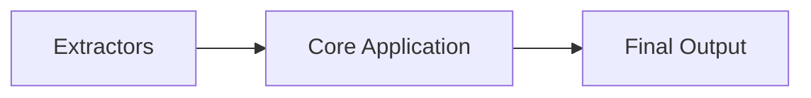
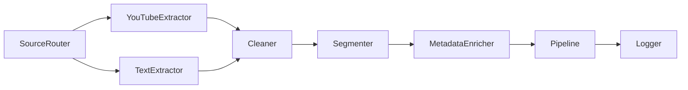
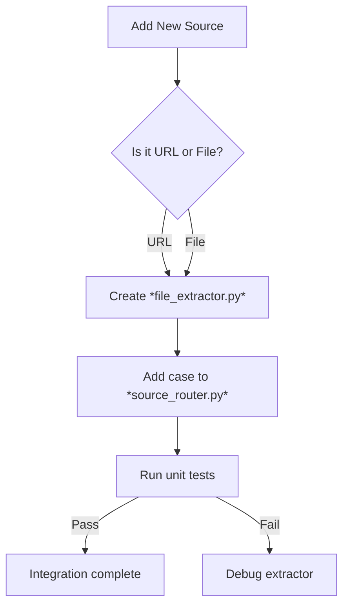

### 🗺️ Navigation

### Part I: Project Documentation Strategy
- [[#📄 Documentation Objective and Scope]]
- [[#🎯 The “funnel” view]]

### Part II: Code Auditing and Verification
- [[#🔍 Analysis and Verification of Project Logic]]
- [[#🗂️ Auditing the Directory]]
- [[#🧩 Mapping Files to Functional Modules]]
- [[#✅ Cross‑checking with the Frontend “About” Page]]
- [[#📋 Takeaway & Common Pitfalls]]

### Part III: Architecture and Data Pipeline
- [[#🗂️ File-by-File Technical Breakdown]]
- [[#📥 Extractor Modules]]
- [[#⚙️ Core Processing Modules]]
- [[#🧩 Orchestration Layer]]
- [[#🛠️ Utility Scripts]]
- [[#📊 Worked Example: YouTube Extraction]]
- [[#🔄 How the Files Talk to Each Other]]
- [[#🧭 Quick Decision Flow for Adding a New Source]]

### Part IV: Presentation and Formatting
- [[#📚 Documentation Formatting and Presentation]]
- [[#🗂️ Standard Elements]]
- [[#🎨 Visual Aids]]
- [[#🛠️ Process‑Oriented Flow]]
- [[#✅ Quick Recap]]

---

## ▣ I: Project Documentation Strategy

---

### 📄 Documentation Objective and Scope

When you hand a project over to someone else, the first thing they look for is **what the code actually does**.  A clean, markdown‑style document does exactly that: it spells out the purpose, the high‑level architecture, and how each file fits into the bigger picture.  Think of it as the project’s user manual for future developers – it keeps the codebase honest, curbs technical debt, and makes sure the “about” page on the frontend really matches what’s happening under the hood.

The project follows a simple, pipeline‑based flow:

1. **Extraction** – raw data (text files, YouTube videos) is pulled in by dedicated parsers.  
2. **Core Application** – the extracted material is transformed, combined, and prepared for consumption.  
3. **Output** – the polished result is served to the user via the frontend.

> [!important] **Why this matters**  
> Proper documentation guarantees that anyone onboarding later can trace the data journey from ingestion to the final UI without guessing. It also prevents “architectural drift,” where the code evolves but the written description stays stale.

> [!tip] **Modular file layout**  
> By keeping extractors in their own files (e.g., `txt_extractor`, `yt_extractor`) and separating them from the application core, you make testing and future extensions a breeze. You can swap in a new media parser without touching the processing logic.

> [!warning] **Common pitfall**  
> Forgetting to update the docs after a code change is a silent source of bugs. The mismatch between the “about” page and the actual backend logic is a classic example of this drift.

### 🎯 The “funnel” view


*Data moves from raw extractors, through the core processing, to the user‑facing output.*

By laying out the architecture this way, the documentation can later expand into a **file‑by‑file breakdown** that ties each module back to the three stages above.  The next sections will drill down into the specifics of each extractor, the processing scripts, and the configuration files, always checking that the stated purpose aligns with the actual implementation.

So, how do we actually start mapping this out in the code?

---

## ▣ II: Code Auditing and Verification

---

### 🔍 Analysis and Verification of Project Logic

When a new developer lands on the repo, the first thing they need is a reliable map.  Think of the documentation as a city guide: it tells you what each “building” (file) does **and** how the streets (data flow) connect them into a functional whole (the app).  The purpose of this step is to make sure the guide you already published on the frontend “About” page actually matches the city that’s been built in code.

### 🗂️ Auditing the Directory

The audit kicks off by walking through the project’s root folder.  We recursively scan every sub‑directory, but we deliberately skip the front‑end index, the “About” page itself, and any static images.  Those are just the tourist brochures; we’re after the backend infrastructure.

The **Audit Algorithm** looks like this:

```mermaid
flowchart TD
    A[Identify root folder] --> B[Traverse subdirectories recursively]
    B --> C[Filter out excluded files (index, about, images)]
    C --> D[Map each remaining file to its functional stage]
    D --> E[Validate mapping against frontend “About” descriptions]
    E --> F[Report discrepancies and generate updated docs]
```
*Diagram: High‑level steps of the technical audit.*

### 🧩 Mapping Files to Functional Modules

Once we have the list of relevant files, each one gets examined for its role in the data‑processing pipeline:

1. **What does the file import or export?**  
   That hints at its place in the flow (e.g., data extraction, transformation, storage).

2. **Which functions or classes are defined?**  
   Their names and docstrings often reveal the logical purpose.

3. **Does the file contain complex logic?**  
   If so, we break that logic down into bite‑size, step‑by‑step explanations instead of dumping raw code.

The result is a concise summary for every module, grouped by functional area (e.g., “Data Ingestion”, “Feature Engineering”, “Model Serving”).

> [!tip] **Chunk the logic** – When a file does a lot, rewrite the heavy‑lifting part as a numbered list of actions.  It makes the later cross‑check much easier.

### ✅ Cross‑checking with the Frontend “About” Page

After we’ve built the backend map, we compare it to the existing frontend description:

- **Alignment check:** Does the “About” page mention every functional stage we discovered?  
- **Terminology consistency:** Are the names used on the front‑end the same as the module names we extracted?  
- **Missing details:** If the code does something the “About” page never mentions, we flag it for addition.

> [!important] **Why this matters** – Keeping the frontend narrative in sync with the actual implementation prevents users (and developers) from being misled about what the app truly does.

### 📋 Takeaway & Common Pitfalls

The audit gives us a fresh, accurate set of documentation that serves both newcomers and seasoned maintainers.  It also surfaces any drift between the user‑facing description and the code.

> [!warning] **Pitfall:** Skipping a sub‑directory or forgetting to apply the exclusion rules can leave out an entire functional module, leading to incomplete docs.  
> 
> > **Tip:** Run the audit script twice – once with a dry‑run flag that just prints the files it will process. Verify the list before doing the full mapping.

> [!note] **Prerequisites** – You need read access to the project’s directory tree and a basic understanding of the app’s overall purpose (e.g., “process raw logs into analytics reports”).

Once the audit is finished, the updated documentation replaces the old “About” content, ensuring that anyone reading the front‑end description gets a truthful preview of the system’s inner workings.

---

*Next up we’ll dive into the **File‑by‑File Technical Breakdown** to see exactly how each piece fits into the pipeline.*

So, how do these individual files actually handle the data as it moves through the pipeline?

---

## ▣ III: Architecture and Data Pipeline

---

### 🗂️ File-by-File Technical Breakdown  

The heart of the app lives in the backend folder. Every file is a self‑contained module that either **pulls raw content**, **refines it**, or **glues the pieces together**. Front‑end files like `index.html` or `about.md` are deliberately ignored – they belong to the UI layer, not the processing pipeline.

### 📥 Extractor Modules  

| File (example) | Responsibility | How it fits in the pipeline |
|----------------|----------------|----------------------------|
| `youtube_extractor.py` | Takes a YouTube URL, calls the YouTube API, extracts transcript & metadata, returns a normalized dict | First step – turns a video into a plain‑text payload that downstream modules can understand |
| `text_extractor.py` | Reads local `.txt` or `.md` files, strips formatting, emits the same dict schema as the YouTube extractor | Alternative entry point for file‑based sources |
| `source_router.py` | Detects the source type (URL vs file), dispatches to the correct extractor | Keeps the rest of the system agnostic to *where* the data came from |

> [!tip] **Why separate extractors?**  
> If you later need to pull data from Twitter or a PDF, you only add a new extractor file and update `source_router.py`. The core processing never changes.

### ⚙️ Core Processing Modules  

| File (example) | Responsibility | Key operations |
|----------------|----------------|----------------|
| `cleaner.py` | Normalizes whitespace, removes HTML tags, fixes encoding issues | Simple text‑sanitization functions |
| `segmenter.py` | Splits the normalized text into logical chunks (paragraphs, sentences) | Uses regex or a tokenizer library |
| `metadata_enricher.py` | Adds timestamps, source identifiers, or language detection results | Calls small helper libraries and appends fields to the dict |

> [!warning] **Common mistake** – Assuming these modules mutate the original dict in place. They return **new** dicts, so the orchestrator must capture the return value each time.

### 🧩 Orchestration Layer  

| File (example) | Responsibility | Flow control |
|----------------|----------------|--------------|
| `pipeline.py` | Chains the extractor → cleaner → segmenter → enricher steps, handling errors and logging | Implements the **Extraction Workflow** described in the source |
| `error_handler.py` | Catches API failures (e.g., YouTube API changes) and falls back to a cached version or raises a clear exception | Prevents a single broken extractor from crashing the whole app |
| `logger.py` | Centralised logging of timestamps, source IDs, and processing duration | Helps spot bottlenecks and audit data handling |

> [!important] **Key insight** – The orchestration layer is the only place where the *order* of modules is defined. Changing the order here rewires the whole processing line without touching any individual module.

### 🛠️ Utility Scripts  

These files don’t touch content directly but support the whole system:

| File (example) | Purpose |
|----------------|---------|
| `config.py` | Holds environment variables (API keys, file paths) so every module reads from a single source |
| `utils.py` | Small reusable helpers (e.g., `slugify`, `hash_id`) used across extractors and processors |
| `requirements.txt` | Lists third‑party packages (e.g., `pytube`, `nltk`) – keeps the environment reproducible |

> [!danger] **Pitfall** – Editing `config.py` without restarting the service can leave stale API keys in memory, leading to silent failures.

---

### 📊 Worked Example: YouTube Extraction  

> [!example] **Processing a single video URL**

| Step | Action | Result (illustrative) |
|------|--------|------------------------|
| 1 | `pipeline.run(url="https://youtu.be/abc123")` calls `source_router` | Detects YouTube URL |
| 2 | `youtube_extractor.fetch(url)` uses `pytube` | Returns `{"title":"Demo", "transcript":"Hello world …", "duration":120}` |
| 3 | `cleaner.sanitize(dict)` | Strips stray characters, yields clean `"Hello world …"` |
| 4 | `segmenter.split(clean_text)` | Produces `["Hello world …"]` (list of sentences) |
| 5 | `metadata_enricher.add(dict)` | Adds `{"source":"youtube","id":"abc123"}` |
| 6 | Final dict returned to caller | `{"title":"Demo","content":["Hello world …"],"source":"youtube","id":"abc123"}` |

> [!tip] After step 2, if the YouTube API changes its response format, only `youtube_extractor.py` needs fixing – the rest of the pipeline stays untouched.

---

### 🔄 How the Files Talk to Each Other  


*Flow of a single piece of content from source detection to the final orchestrated output.*

---

### 🧭 Quick Decision Flow for Adding a New Source  


*When you need to support, say, a podcast RSS feed, just follow the boxes.*

---

> [!note] **Remember** – The backend’s modular design means you can grow the system (new extractors, extra cleaning steps) without ever touching the orchestration logic. That separation is the main reason the project stays maintainable as external APIs evolve.

So how do we actually write documentation that makes this structure clear to everyone else?

---

## ▣ IV: Presentation and Formatting

---

### 📚 Documentation Formatting and Presentation

When you hand over a project, the documentation is the city map that guides anyone who walks its streets. It doesn’t build the skyscrapers (the code), but it shows **how to get from the residential blocks to the business district without getting lost**. A well‑styled markdown guide does three things at once:

1. **Shows the flow** – the sequence of inputs, transformations, and outputs.  
2. **Highlights relationships** – which modules talk to which, and where the front‑end expectations meet the back‑end reality.  
3. **Keeps the reader’s eyes happy** – diagrams, callout boxes, and a consistent layout turn a wall of text into a navigable brochure.

Below is a quick checklist of the formatting standards that turn a raw audit into a polished, process‑oriented guide.

### 🗂️ Standard Elements

- **Header hierarchy with emojis** – one emoji per heading (e.g., `## 🏗️ System Overview`). This gives an instant visual cue of the section’s purpose.  
- **Callout boxes** – use Obsidian’s `[!type]` blocks for side notes, tips, warnings, and important insights. They act like street signs that draw attention to critical information.  
- **Plain‑language prose** – imagine you’re explaining the system to a teammate over coffee; keep sentences short and conversational.  
- **Consistent terminology** – stick to the same names for modules, files, and concepts throughout the doc so the map doesn’t change its street names halfway through.  

> [!tip] **Make callouts your friend**  
> Whenever you introduce a new concept (e.g., “system reconciliation”) or a common pitfall, wrap it in a callout. It breaks up dense paragraphs and lets readers skim for the “must‑know” bits.

### 🎨 Visual Aids

A single, well‑labeled diagram is worth a paragraph of description. Use Mermaid flowcharts for step‑by‑step processes; keep node labels alphanumeric and free of parentheses or symbols.


*Process flow for turning a code audit into living documentation.*

The diagram above captures the **logical, process‑oriented flow** we want readers to follow: start with a file‑by‑file audit, trace the data pathways, verify against the front‑end, and finally produce a markdown guide that stays up‑to‑date.

### 🛠️ Process‑Oriented Flow

1. **File‑by‑file audit** – Open each module, note its inputs, outputs, and side effects. Think of each file as a city block; you need to know which streets (functions) enter and leave.  
2. **Dependency mapping** – Sketch a quick arrow diagram (like the one above) that shows how data travels through the system. This is the “system workflow” that the extracted knowledge mentions.  
3. **System reconciliation** – Compare the code‑level logic with the existing front‑end documentation (excluding static assets like the index, about page, and images). Resolve any mismatches; this prevents the map from pointing to a dead‑end.  
4. **Narrative synthesis** – Write a cohesive story that strings the blocks together, using headings, sub‑headings, and callouts to highlight key decisions and edge cases.  
5. **Living document** – Treat the markdown file as a living component: set up a pull‑request checklist that includes “documentation review” so the map updates whenever the city expands.

> [!warning] **Pitfall: Documenting intent, not implementation**  
> It’s easy to write what *should* happen rather than what the code *actually* does. Always verify against the repository; otherwise you end up with a map that leads drivers into a cul‑de‑sac.

> [!info] **General background (not in source)**  
> Good documentation follows the “write‑once, review‑often” principle. Think of it as a GPS that recalculates routes whenever new roads (features) are added.  

### ✅ Quick Recap

- Use **emoji‑enhanced headings** for visual hierarchy.  
- Insert **callout boxes** for tips, warnings, and important insights.  
- Include **one clear Mermaid flowchart** that outlines the audit‑to‑doc pipeline.  
- Follow the **five‑step process** (audit → map → reconcile → synthesize → maintain) to keep the guide logical and easy to follow.  

By treating the documentation as a living map rather than a static plaque, you’ll reduce knowledge silos, cut technical debt, and make onboarding new contributors feel like they’ve got a reliable city guide in hand.

---

| Term | Definition |
|------|------------|
| **Architectural Drift** | The phenomenon where code implementation diverges from its original design documentation. |
| **Callout Box** | A formatted UI element used to highlight important tips, warnings, or definitions. |
| **Data Ingestion** | The process of pulling raw information from external sources into a system for processing. |
| **Dependency Mapping** | A technique used to visualize the relationships and data flow between different modules in a codebase. |
| **Extractor** | A dedicated code module responsible for retrieving raw data from specific sources like URLs or files. |
| **Mermaid** | A markdown-based diagramming tool used to generate flowcharts and visual process models. |
| **Normalization** | The process of standardizing data formats or text to ensure consistency across the pipeline. |
| **Orchestration Layer** | The central system component that defines the sequence of operations and manages error handling. |
| **Pipeline** | A structured series of data processing steps, from extraction to final output. |
| **Technical Debt** | The implied cost of additional rework caused by choosing an easy solution now instead of a better approach later. |

*Sources: Project Documentation Guidelines for Software Development; Standardizing Modular Backend Architecture (Internal Documentation Standards).*