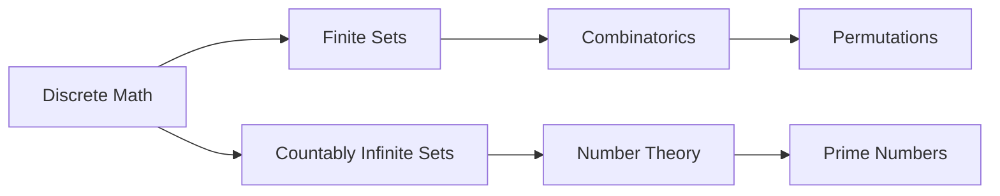
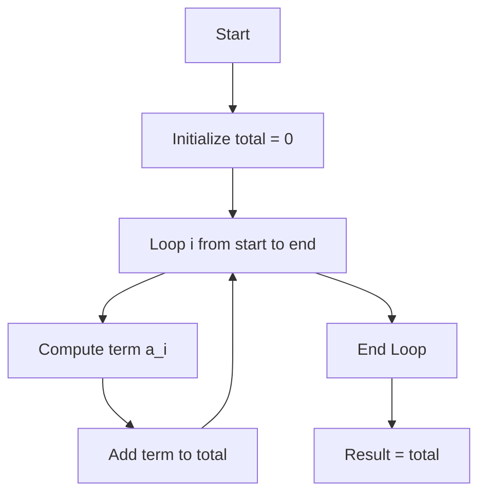
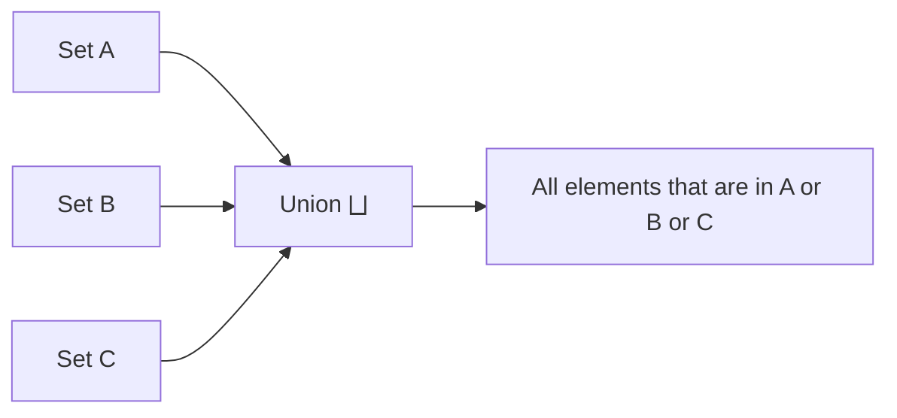
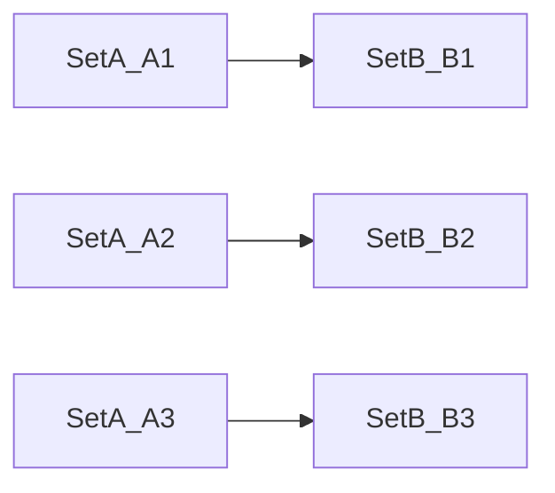
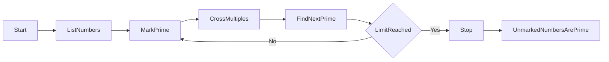
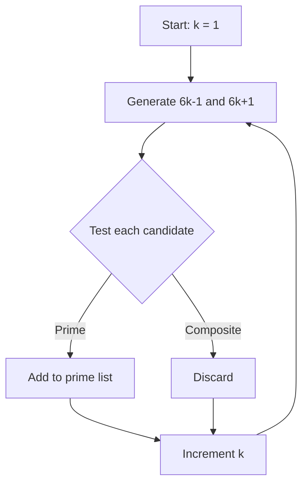

### 🗺️ Navigation

### Part I: Foundations and Permutations
- [[#🌟 Foundations of Discrete Mathematics]]
- [[#🔄 Permutations and Cycles]]
- [[#🔢 Counting Permutations of Sets and Multisets]]
- [[#🔄 Generating Permutations Algorithmically]]
- [[#🎲 K-Permutations and K-Tuples]]

### Part II: Counting Principles
- [[#🏗️ The Rule of Product]]
- [[#➕ The Rule of Sum]]
- [[#📐 Sigma Notation]]
- [[#🗂️ Set Notation Basics]]
- [[#🔗 Union, Intersection, and Product]]
- [[#📏 Cardinality & the Sum Rule]]
- [[#⚖️ When Sets Overlap – A Quick Peek at Inclusion‑Exclusion]]
- [[#🔧 How to Compute a Union’s Size (Step‑by‑Step)]]
- [[#📊 Inclusion-Exclusion Principle for Finite Sets]]

### Part III: Infinite Sets and Cardinality
- [[#📏 Cardinality and Equinumerosity]]
- [[#📏 Countable Sets and Infinity]]
- [[#📏 Rational Numbers and the Diagonal Method]]

### Part IV: Number Theory and Primes
- [[#🧮 Prime Number Properties and Distribution]]
- [[#🧪 Computational Primality Testing]]
- [[#📚 Advanced Prime Number Theorems]]
- [[#📈 Why Prime Distribution Matters]]
- [[#🔢 Goldbach Conjecture and Riemann Hypothesis]]
- [[#🔧 GCD and LCM Fundamentals]]
- [[#🧩 Coprime Numbers and Practical Applications]]
- [[#🕰️ Congruences and Modular Arithmetic]]

### Part V: Combinatorial Structures and Tools
- [[#📊 Binomial Coefficients and Pascal's Triangle]]
- [[#🍦 Combinations With and Without Repetition]]
- [[#🧩 Advanced Combinatorial Strategies]]
- [[#📐 Combinatorial Intersections and Digit Sums]]
- [[#🎲 Tournament Pairings and Computational Verification]]
- [[#📝 Solving Binomial Inequalities and Equations]]
- [[#📊 Divisibility Properties of Binomial Coefficients]]
- [[#🗝️ Vandermonde's Identity and Its Applications]]
- [[#🐦 The Pigeonhole Principle and Extensions]]
- [[#📊 Stars and Bars Principle Example]]
- [[#📝 Conclusion]]
- [[#🌟 Stars and Bars Principle]]

### Part VI: Partitioning and Advanced Recursion
- [[#🗂️ Inclusion-Exclusion and Mapping Constraints]]
- [[#📊 Stirling Numbers of the First Kind]]
- [[#📝 Recursion in Python]]
- [[#📊 Recursive Function Design]]
- [[#🗺️ Optimization of Recursive Algorithms]]
- [[#📝 Stirling Numbers of the Second Kind]]
- [[#📊 Stirling Numbers of the Third Kind (L-Numbers)]]
- [[#📝 Bell Numbers]]
- [[#📝 Introduction to the Chinese Remainder Theorem]]
- [[#📊 Applications of Number Theory in Computing]]
- [[#🚀 Future Directions in Discrete Mathematics]]

---

## ▣ I: Foundations and Permutations

---

### 🌟 Foundations of Discrete Mathematics

Discrete mathematics is **the study of anything you can count, one piece at a time**.  
Instead of asking how much water fills a pool (a continuous question), we ask how many *distinct* objects there are—like how many ways you can arrange a set of books on a shelf.  The objects are **countable**: you can list them one by one, even if the list goes on forever (think of the natural numbers 1, 2, 3, …).

### 1.1 — What counts as “discrete”?

- **Finite sets** – e.g., the six faces of a die.  
- **Countably infinite sets** – e.g., the set of all whole numbers, which you can pair one‑to‑one with ℕ.  

> [!info] **Countable ≠ Finite**  
> A set is *countable* if you can enumerate its elements with the natural numbers.  That includes both finite collections and infinite ones that don’t “skip” any numbers.

### 1.2 — Why it matters

Discrete math gives us the language for **combinatorics** (counting arrangements) and **number theory** (properties of integers).  Those two pillars support everything from **network routing** to **cryptography**.  For instance, the security of a password hinges on how many *permutations* of its characters exist—more permutations mean a much longer time for a brute‑force attack.

> [!important] **Key Insight**  
> The harder it is to enumerate all possibilities, the stronger the security of many cryptographic schemes.

### 1.3 — A tiny taste: permutations of three items

Consider the set $\{1,2,3\}$.  Rearranging its elements gives exactly $3! = 6$ distinct orders:

| # | Permutation |
|---|-------------|
| 1 | 1 2 3 |
| 2 | 1 3 2 |
| 3 | 2 1 3 |
| 4 | 2 3 1 |
| 5 | 3 1 2 |
| 6 | 3 2 1 |

> [!example] **Permutation example**  
> If you swap the second and third elements, the mapping is $1\mapsto1,\;2\mapsto3,\;3\mapsto2$.  Applying that swap twice brings you back to the original ordering—just like turning a doorknob one way and then the other.

### 1.4 — Everyday intuition

- **Dice rolls** – each roll is a separate, countable event; there’s no “half‑roll”.  
- **Books on a shelf** – moving books around doesn’t create or destroy books; it merely reorders them.  

Think of a permutation as a **set of instructions**: “Take the book in slot 2 and place it in slot 3, and move the book that was in slot 3 to slot 2.”  Follow the instructions once and you have a new order; follow them again and you may end up where you started.

> [!tip] **Password security**  
> Adding one more character to a password of length $n$ multiplies the number of possible permutations by the size of the character set (often 94 printable ASCII characters).  That exponential blow‑up is why even a modest‑length password can be astronomically hard to crack.

### 1.5 — Connecting to the next topic

When we start talking about **permutations and cycles** in the next section, we’ll formalize these ideas with *cycle notation* and see how they become powerful tools for counting and for cryptographic algorithms.  See [[#🔄 Permutations and Cycles]] for the deeper dive.

### 1.6 — Quick visual summary


*Diagram: the two main branches of discrete mathematics and where permutations live.*

$$\boxed{\text{Discrete Mathematics} = \text{Study of countable, step‑by‑step structures}}$$

So, how do we actually write these re-orderings down in a way that’s easy to calculate?

NOTATION CLASH: "cycle notation" vs "two-line (Koshi) notation"

### 🔄 Permutations and Cycles

### 1.7 — 📚 What a permutation really is
A permutation is just a fancy word for “re‑ordering”.  Think of shuffling a deck of cards: the cards stay the same, but their order changes.  Mathematically we can view a permutation as a function that maps each element of a set to exactly one (possibly different) element of the same set.

> [!note] **Two‑line (Koshi) notation**  
> The top row lists the original elements, the bottom row shows where each one goes.  
> Example for swapping 2 and 3 in `{1,2,3}`:  

> ```
> 1 2 3
> 1 3 2
> ```

### 1.8 — 🔁 Cycles – the hidden loops inside a permutation
If you follow the arrows of a permutation, you eventually end up back where you started.  The closed walk you get is called a **cycle**.  

- A **fixed point** is a one‑element cycle (the element maps to itself).  
- Every permutation can be split into **disjoint cycles** – none of the cycles share an element.

> [!tip] **Round‑table analogy** – Imagine people sitting around a circular table. If everyone shifts one seat to the right, the whole group forms a 5‑person cycle. If someone stays put, that person is a fixed point (a 1‑cycle).

### 1.9 — 🧮 Counting permutations

#### Distinct elements  
When all items are different, the number of possible reorderings is the **factorial** of the set size:

$$\boxed{n! = 1 \times 2 \times \dots \times n}$$  

#### Multisets (some items identical)  
If the collection has repeated items, swapping identical copies doesn’t create a new arrangement.  We correct for this by dividing by the factorial of each duplicate count:

$$\boxed{\frac{n!}{n_1! \times n_2! \times \dots \times n_k!}}$$  

where $n$ is the total number of items and $n_i$ is the frequency of the $i$-th distinct item.

> [!example] **Counting “AAB”**  
> The bag has three letters: two A’s and one B.  
> - Total permutations if all were distinct: $3! = 6$.  
> - Divide by the duplicate A’s: $\frac{3!}{2!}=3$.  
> The unique arrangements are **AAB, ABA, BAA**.

### 1.10 — 🛠️ Worked examples

#### Example 1 – All distinct  
Set $\{1,2,3\}$  

| Permutation (list) | Two‑line notation |
|--------------------|-------------------|
| (1,2,3)            | 1→1, 2→2, 3→3 |
| (1,3,2)            | 1→1, 2→3, 3→2 |
| (2,1,3)            | 1→2, 2→1, 3→3 |
| (2,3,1)            | 1→2, 2→3, 3→1 |
| (3,1,2)            | 1→3, 2→1, 3→2 |
| (3,2,1)            | 1→3, 2→2, 3→1 |

There are $3! = 6$ permutations, matching the formula.

#### Example 2 – Using cycles  
Take the permutation  

$$
\begin{pmatrix}
1 & 2 & 3 & 4 & 5\\
3 & 5 & 1 & 4 & 2
\end{pmatrix}
$$

Follow the arrows:

- Start at 1 → 3 → 1 → … → **cycle (1 3)**
- Next smallest unused element is 2 → 5 → 2 → **cycle (2 5)**
- Element 4 maps to itself → **fixed point (4)**  

So the cycle decomposition is $(1\;3)(2\;5)(4)$.

> [!important] **Every permutation = product of disjoint cycles** – This is the core mental model; once you can read a permutation as cycles, many problems (like computing powers of a permutation) become trivial.

### 1.11 — 🔄 Decomposing any permutation into cycles


*Cycle decomposition process for a permutation.*

### 1.12 — 🚨 Common pitfalls

> [!warning] **Over‑counting with identical items** – If you treat a multiset as if all elements were distinct, you’ll count many arrangements that look the same. Always divide by the factorial of each duplicate’s frequency.

> [!warning] **Terminology mix‑up** – “Permutation with repetition” in some textbooks actually means “multiset permutation”. In English the term *permutation* alone assumes distinct items; *multiset permutation* is the precise phrase for the repeated‑item case.

### 1.13 — 💡 Why it matters

So how do we actually calculate these counts when items start repeating?

NOTATION CLASH: "permutation" vs "multiset permutation"

### 🔢 Counting Permutations of Sets and Multisets  

When you have a bag of objects and you want to know *how many different ways* you can line them up, you don’t always have to write every arrangement down.  The math does the heavy lifting for you.  

### 1.14 — The basic idea

*If every item is distinct*, the number of possible orderings is just the product  

$$
n! = 1 \times 2 \times 3 \times \dots \times n
$$

where $n$ is the total number of items.  Think of it as “first place has $n$ choices, second place has $n-1$ left, and so on.”  

*If some items are identical* (a **multiset**), swapping two copies of the same thing doesn’t give a new arrangement.  So we have to *undo* the over‑counting by dividing out the permutations of each group of identical items.  

$$
\boxed{P = \frac{n!}{n_1! \cdot n_2! \cdot \dots \cdot n_k!}}
$$

Here $n_i$ is the frequency of the $i$-th distinct element, and $k$ is the number of different symbols in the multiset.

> [!tip] **Why division works** – Imagine you first count every possible ordering as if the copies were different.  For a letter that appears three times, those three copies can be shuffled among themselves in $3!$ ways, but all those shuffles look the same.  Dividing by $3!$ throws those redundant views away.

### 1.15 — Step‑by‑step procedure (algorithm)


*Flowchart of the counting process.*

### 1.16 — Worked example

Let’s count the unique rearrangements of the word **“papaya.”**  

| Letter | Frequency |
|--------|-----------|
| P      | 2 |
| A      | 3 |
| Y      | 1 |

1. Total length $n = 6$.  
2. Compute $6! = 720$.  
3. Compute the product of the frequency factorials: $2! \times 3! \times 1! = 2 \times 6 \times 1 = 12$.  
4. Apply the formula  

$$
P = \frac{6!}{2!\,3!\,1!} = \frac{720}{12} = 60
$$

> [!example] **Result** – There are **60** distinct ways to spell “papaya” when the repeated letters are considered indistinguishable.

> [!tip] **Interpreting the number** – If you tried to generate all permutations with `itertools.permutations`, you’d get $720$ tuples, many of which are duplicates.  The formula tells you instantly that only 60 of those are truly unique.

### 1.17 — Common pitfalls

> [!warning] **Don’t generate everything** – For $n > 12$ the raw factorial already exceeds a billion, so trying to materialise every permutation will crash your program or take forever.  Always prefer the counting formula when you only need the total.

> [!warning] **Treating a multiset like a set** – If you apply the plain $n!$ rule to “papaya,” you’d report 720 distinct arrangements, which is wrong because swapping the two P’s or any two A’s doesn’t change the word.

### 1.18 — Handy Python note

> [!note] The `itertools.permutations` function returns an **iterator of tuples**, not strings.  Converting the iterator to a `set` is a quick way to discard duplicates, but it still requires generating all $n!$ tuples first—so use it only for tiny $n$.

---

That’s the whole story: count the total items, tally how many copies of each distinct item you have, plug everything into the boxed formula, and you instantly know how many unique reorderings exist—no exhaustive enumeration needed.

So how do we actually go about listing every single one of those arrangements?

### 🔄 Generating Permutations Algorithmically

When you need every possible ordering of a handful of items—say, to test all seat arrangements around a table—you actually *generate* the permutations, not just count them. Counting is cheap (just a factorial), but listing every arrangement can explode fast. Heap’s algorithm gives us a tidy way to walk through all permutations while only swapping two elements at a time, keeping each step lightweight.

### 1.19 — The core idea behind Heap’s algorithm

Think of the elements as dancers in a line. At each move only two dancers exchange places, and the pattern of who swaps depends on whether the current length `k` is even or odd. Recursion shrinks the problem: we first arrange the first `k‑1` dancers, then perform the appropriate swap, and repeat.

The recursive skeleton looks like this:

1. **Base case** – if `k == 1`, output the current ordering.  
2. **Recursive case** – for `i` from `0` to `k‑1`  
   * call the routine with `k‑1` (so the first `k‑1` positions get fully permuted)  
   * if `k` is **even**, swap the element at position `i` with the last element (`k‑1`)  
   * if `k` is **odd**, swap the first element (`0`) with the last element (`k‑1`)  

Because each recursive call reduces `k` by one, the algorithm eventually hits the base case and then back‑tracks, performing just one swap per new permutation.

### 1.20 — Counting versus generating

For a *multiset* (some items repeat) we usually only want the count:

$$\boxed{P = \frac{n!}{n_1! \, n_2! \dots n_k!}}$$  

where `n` is the total number of items and `n_i` are the frequencies of each distinct item. This avoids the astronomic cost of actually listing every arrangement.

> [!tip] **Why the count is fast**  
> Swapping two identical items never creates a new “look,” so we divide by the factorial of each frequency. It’s like arranging books on a shelf where several copies look the same; you only care about the distinct patterns.

### 1.21 — Worked example: all permutations of `[1, 2, 3]`

Let’s step through Heap’s algorithm on the tiny list `[1, 2, 3]`. We start with `k = 3`.

| Step | `k` | `i` | Current array | Action |
|------|-----|-----|---------------|--------|
| 0 | 3 | – | `[1, 2, 3]` | start recursion |
| 1 | 3 | 0 | `[1, 2, 3]` | recurse with `k=2` |
| 2 | 2 | 0 | `[1, 2, 3]` | recurse with `k=1` → **print** `[1, 2, 3]` |
| 3 | 2 | even → swap `i=0` with `k-1=1` | `[2, 1, 3]` | back to `k=2` |
| 4 | 2 | 1 | `[2, 1, 3]` | recurse with `k=1` → **print** `[2, 1, 3]` |
| 5 | 3 | odd → swap `0` with `k-1=2` | `[3, 1, 2]` | back to `k=3` |
| 6 | 3 | 1 | `[3, 1, 2]` | recurse with `k=2` |
| 7 | 2 | 0 | `[3,

So how do these recursive steps actually relate to the broader math of picking elements?

### 🎲 K-Permutations and K-Tuples

When we talk about “picking a few things out of a bigger set” there are two very different flavors:

* **K‑permutations** – you pick *k* distinct elements and line them up. No repeats are allowed.  
* **K‑tuples** – you pick *k* elements **with** repetition; the same item can show up more than once.

Both are just ways of counting ordered arrangements, but the presence or absence of repetition changes the math dramatically.

### 1.22 — The two counting formulas

For a set of size *n*:

* **K‑permutations (no repetition)**
  $$\boxed{P(n, k) = \frac{n!}{(n-k)!}}$$
* **K‑tuples (with repetition)**
  $$T(n, k) = n^{\,k}$$  

The first formula shrinks the factorial by the “unused” part $(n-k)!$. The second simply raises the number of choices to the power *k* because each slot can be filled independently.

> [!tip] **Why the formulas look so different**  
> In a K‑permutation each choice removes one option for the next slot (hence the division by $(n-k)!$). In a K‑tuple nothing disappears – every slot still sees the full *n* possibilities, so we just multiply *n* by itself *k* times.

### 1.23 — Intuition: the Rule of Product

Think of getting dressed:

* 5 pairs of pants  
* 8 shirts  
* 3 pairs of shoes  

Every pant can be paired with any shirt, and every pant‑shirt combo can be paired with any shoe. The total outfits are  

$5 \times 8 \times 3 = 120$.

That’s the **Rule of Product** in action: if a process has independent steps with $a_1, a_2, \dots, a_m$ choices, the total number of outcomes is the product $\prod_{i=1}^{m} a_i$.


*Figure: Applying the Rule of Product step‑by‑step.*

> [!warning] **Common pitfall**  
> The Rule of Product only works when each step’s options stay constant. If a certain pant makes some shoes incompatible, you can’t just multiply 5 × 8 × 3 – you’d need to adjust the count for that dependency.

### 1.24 — Concrete worked examples

#### Example 1 – K‑permutations (no repetition)

We have the letters **A‑G** (so $n = 7$) and we want ordered triples ($k = 3$) without repeating a letter.

$$
P(7,3) = \frac{7!}{(7-3)!} = \frac{7!}{4!} = 7 \times 6 \times 5 = \boxed{210}
$$

So there are 210 different 3‑letter sequences you could form.

> [!example] **Step‑by‑step**  
> 1. Pick the first letter: 7 choices.  
> 2. Pick the second letter (cannot reuse the first): 6 choices.  
> 3. Pick the third letter (cannot reuse the first two): 5 choices.  
> Multiply: $7 \times 6 \times 5 = 210$.

#### Example 2 – K‑tuples (with repetition)

Using the same 7 letters, now we allow repeats and still want triples.

$$
T(7,3) = 7^{3} = \boxed{343}
$$

> [!example] **Why it’s bigger**  
> Each of the three slots can be any of the 7 letters, independent of the others, so we have $7 \times 7 \times 7 = 343$ possibilities.

### 1.25 — Quick checklist

| Concept | Repetition? | Formula | When to use |
|--------|--------------|---------|-------------|
| K‑permutation | **No** | $P(n,k)=\dfrac{n!}{(n-k)!}$ | Selecting distinct items and caring about order |
| K‑tuple | **Yes** | $T(n,k)=n^{k}$ | Forming sequences where repeats are allowed |

> [!important] **Key insight** – The distinction hinges on whether the *choice set shrinks* after each selection. If it does, use the permutation formula; if it stays the same, use the tuple (power) formula.

### 1.26 — Why it matters

Counting these arrangements underpins probability calculations, algorithm analysis, and even data‑science feature engineering. If you mis‑label a K‑tuple as a K‑permutation (or vice‑versa), you’ll end up with the wrong denominator in a probability fraction, and that error propagates through every subsequent calculation.

---

*Next up we’ll see how the **Rule of Product** scales to more complex multi‑step problems and where inclusion‑exclusion steps in to handle dependencies.*

So how do we actually apply this rule to multi-step processes?

---

## ▣ II: Counting Principles

---

### 🏗️ The Rule of Product

When you’re counting how many ways a multi‑step process can happen, the **Rule of Product** is your go‑to shortcut.  
Think of each step as a branch in a decision tree: every choice you make at step 1 spawns a whole new set of possibilities for step 2, and so on. As long as the choices at each step don’t depend on what you picked before, you just multiply the number of options together.

### 2.1 — The core idea

If a process has $n$ independent steps and step $i$ offers $a_i$ possible choices, the total number of distinct outcomes is  

$$\boxed{\text{Rule of Product} = a_1 \times a_2 \times \dots \times a_n}$$  

That’s it—plain multiplication.

> [!tip] **Why multiplication?**  
> Choosing A *and* B means you need a way to do A **and** a way to do B. In counting, “and” translates to “multiply” because each way to do A can be paired with each way to do B, giving a rectangular grid of possibilities.

### 2.2 — Applying the rule – three simple steps

1. **Break the scenario into independent steps.**  
2. **Count how many options each step offers.**  
3. **Multiply those counts together.**  

If any step’s options shrink because of an earlier choice, you’re no longer in the “independent” world and you need a different principle (like the Rule of Sum or inclusion–exclusion).

> [!warning] **Common mistake** – Using the rule when choices are dependent.  
> Example: Picking two different cards from a deck *without* replacement is **not** independent; the second draw has only 51 options, not 52. You must adjust the count (that’s a K‑permutation, not a simple product of identical numbers).

### 2.3 — Worked example: Dressing for the day

Suppose you have  

* 5 pairs of pants,  
* 8 shirts,  
* 3 pairs of shoes.  

Each choice is independent of the others (the shirt you pick doesn’t affect which pants you can wear).  

| Step | Options |
|------|---------|
| Pants   | 5 |
| Shirt   | 8 |
| Shoes   | 3 |
| **Total outfits** | $5 \times 8 \times 3 = 120$ |

So you can put together **120** distinct outfits.

> [!example] **Step‑by‑step illustration**  
> 1. Choose a pair of pants → 5 ways.  
> 2. For each pant choice, pick a shirt → 8 ways, giving $5 \times 8 = 40$ partial outfits.  
> 3. Add shoes → 3 ways for each of the 40, yielding $40 \times 3 = 120$ full outfits.

### 2.4 — Connecting to permutations and tuples

- **K‑permutations (no repetition)** are a special case where the number of options shrinks by one each step:  

  $$P(n,k)=n\,(n-1)\,\dots\,(n-k+1)=\frac{n!}{(n-k)!}$$  

- **K‑tuples (with repetition)** keep the same number of options at every step, giving a pure power:  

  $$\text{K‑tuple count}=n^{k}$$  

Both follow the Rule of Product; they just differ in whether the $a_i$ values stay constant or decrease.

> [!important] **Independence is the linchpin** – If at any point a later choice is restricted by an earlier one, you must adjust the counts (often turning the problem into a permutation or a more complex inclusion‑exclusion scenario).

### 2.5 — Quick visual of the application process


*Flowchart: How to apply the Rule of Product.*

### 2.6 — Bottom line

The Rule of Product turns a potentially messy enumeration into a clean multiplication problem—provided the steps are truly independent. Master this, and you’ll never have to list out outcomes by hand again.

But what happens when your options aren't just one after another, but instead represent different mutually exclusive paths?

### ➕ The Rule of Sum  

The addition principle is the “or” of counting.  
If a problem can be split into separate, non‑overlapping situations, you just count each situation and add the numbers together. Think of it as having a few buckets that never share any items – pick a bucket, then pick an item from that bucket, and you’ve covered all possibilities.

### 2.7 — When the Rule of Sum shines
You reach for this rule whenever an **“or”** appears in the problem statement or when a decision you make later restricts the options you had earlier. For example, “How many even‑digit numbers can you form?” forces you to consider two mutually exclusive cases: numbers ending in 0 versus numbers ending in 2, 4, 6, 8. The options for the first digit differ in each case, so a straight multiplication (Rule of Product) would be wrong.

### 2.8 — Step‑by‑step recipe
1. **Identify disjoint cases** – make sure no outcome belongs to more than one case.  
2. **Count each case** – you can often use the Rule of Product inside a case if it involves a sequence of independent choices.  
3. **Add the counts** – sum the numbers from step 2.  

> [!tip] The word **or** in a question is a strong hint that the Rule of Sum is needed.

#### Quick visual guide  

```mermaid
flowchart LR
    A[Identify disjoint cases] --> B[Count each case (maybe use Rule of Product)]
    B --> C[Sum the counts]
```
*Flowchart for applying the Rule of Sum.*

### 2.9 — Worked example: picking a ball from two drawers

| Drawer | # of balls |
|--------|------------|
| 1      | 5          |
| 2      | 4          |

We want the number of ways to pick **one** ball from **either** drawer.  
The two drawers are disjoint – a ball can’t be in both at the same time.

* Count for Drawer 1: $5$ ways.  
* Count for Drawer 2: $4$ ways.  

Add them up:  

$$\boxed{Total = 5 + 4 = 9}$$  

> [!example] **Why this works**  
> The problem splits naturally into “pick from Drawer 1 **or** pick from Drawer 2”. Since the sets are disjoint, the total is just the sum of the two counts.

### 2.10 — Another example: even numbers with distinct digits

*Case A*: number ends in 0. The leading digit can be any of 1‑9 except 0, so $9$ possibilities.  
*Case B*: number ends in 2, 4, 6, 8 (four choices). For each, the leading digit can be any of the remaining 8 non‑zero digits (excluding the chosen even digit), so $4 \times 8 = 32$ possibilities.  

Total even numbers = $9 + 32 = 41$.

### 2.11 — Common pitfalls

> [!warning] **Overlapping cases** – If two cases share an outcome, you’ll double‑count. Always verify that the cases are truly disjoint.  

> [!danger] **Using the Rule of Product when it doesn’t apply** – If the number of options for a later decision depends on an earlier one (like “the first digit can’t be zero if the last digit is zero”), you must break the problem into cases first and then multiply inside each case.

### 2.12 — Key insight

> [!important] The Rule of Sum lets you turn a tangled counting problem into a handful of simpler sub‑problems. By ensuring the sub‑problems are **mutually exclusive**, you can safely add their solutions without fear of overcounting.

### 2.13 — Relation to the Rule of Product

When a case itself involves a sequence of independent choices, you still use the multiplication principle **inside** that case. See [[#🏗️ The Rule of Product]] for the companion rule.  

---  

Now you’ve got the mental toolbox: spot the “or”, split into clean buckets, count each bucket (using multiplication if needed), then add. That’s the Rule of Sum in a nutshell.

So how do we actually represent these long strings of additions without writing them all out?

### 📐 Sigma Notation  

When you need to add up a long (or even infinite) list of numbers that follow a clear pattern, writing each term out quickly becomes a nightmare.  Sigma notation is just a compact shortcut that says “add up everything that fits this rule.”  

### 2.14 — What the symbol really means

The generic form is  

$$\boxed{\displaystyle \sum_{i=start}^{end} a_i = a_{start} + a_{start+1} + \dots + a_{end}}$$  

* The Greek letter **Σ** tells you to **sum**.  
* The index variable (here `i`) runs from the lower bound (`start`) up to the upper bound (`end`).  
* Each term you add is given by the expression after the Σ (here `a_i`).  

Think of the index like a row number in a spreadsheet: you start at row `start`, evaluate the formula for that row, then move down one row until you hit `end`.

> [!tip] **Why we love Σ** – It keeps formulas readable and lets us manipulate whole families of sums algebraically (e.g., pull out constants, split sums, or change the index name).

### 2.15 — How to evaluate a sigma step‑by‑step

1. **Set a running total to 0.**  
2. **Loop** `i` from `start` to `end` (inclusive).  
3. **Compute** the term `a_i` for the current `i`.  
4. **Add** that term to the running total.  
5. **After the loop**, the total is the value of the sigma.


*Evaluation flow for a simple sigma*  

### 2.16 — Handy properties

* **Pulling out constants**  

  $$\sum_{i=start}^{end} c \cdot a_i = c \sum_{i=start}^{end} a_i$$  

  Because multiplication distributes over addition, any constant factor can sit outside the Σ.

> [!important] **Key insight** – Moving a constant out of the sum often turns a messy expression into something you can compute by hand or look up in a table.

* **Changing the index name** – The index is a dummy variable; you can rename it without affecting the result.  

  $$\sum_{i=1}^{n} a_i = \sum_{k=1}^{n} a_k$$  

* **Independent nested sums become products**  

  If the inner and outer indices don’t interact,  

  $$\sum_{i=1}^{n}\sum_{j=1}^{m} a_i b_j = \left(\sum_{i=1}^{n} a_i\right)\!\left(\sum_{j=1}^{m} b_j\right)$$  

  This follows from the distributive law: every `a_i` pairs with every `b_j`.

> [!warning] **Common slip** – Treating a nested sum as a single long sum when the indices are *not* independent will give the wrong answer. Always check whether the inner term depends on the outer index.

### 2.17 — Worked example

**Problem:** Compute  

$$\sum_{i=2}^{5} 3i$$  

**Step‑by‑step:**  

| $i$ | Term $3i$ | Running total |
|------|------------|---------------|
| 2    | 6          | 6             |
| 3    | 9          | 15            |
| 4    | 12         | 27            |
| 5    | 15         | 42            |

So the sum equals **42**.

> [!example] **Why it works** – We simply plugged each `i` into the formula `3i` and added the results, exactly as the sigma definition prescribes.

> [!tip] **Quick check** – Because 3 is a constant, we could have pulled it out first:  

  $$\sum_{i=2}^{5} 3i = 3\sum_{i=2}^{5} i = 3\left(2+3+4+5\right)=3\cdot14=42$$  

  Both routes give the same answer, but the second uses the constant‑pull‑out property and saves a few arithmetic steps.

### 2.18 — Connecting sigma to set notation

Just as Σ adds numbers, the union symbol $\bigcup$ “adds” sets:

$$\bigcup_{i=1}^{n} A_i = A_1 \cup A_2 \cup \dots \cup A_n$$  

Think of each set as a pile of objects; the union piles them all together, just like Σ piles numbers together.

### 2.19 — When sigma shows up elsewhere

* The **Rule of Sum** (adding counts of disjoint cases) is often written with Σ when the number of cases follows a pattern.  
* The **Rule of Product** (multiplying independent choices) can be expressed as a double sigma that collapses to a product, as seen in the “independent nested sums become products” property.

> [!note] **Link back** – For the counting foundations, see [[#➕ The Rule of Sum]] and [[#🏗️ The Rule of Product]].

### 2.20 — Quick recap

* Σ is a concise way to write repeated addition.  
* Evaluate by looping from the lower to the upper bound.  
* Constants can be pulled out, indices renamed, and independent nested sums turned into products.  
* Mistaking *disjoint* for *independent* (or vice‑versa) is a frequent source of errors.  

Keep these ideas handy, and sigma notation will become a natural tool in any combinatorial or algebraic work you do.

So how do we apply this same "for-loop" logic to sets?

### 🗂️ Set Notation Basics  

When we talk about *sets* we need a compact way to write things like “the union of a whole bunch of sets” or “the size of a set”.  
- **Union** of many sets:  $\displaystyle \bigcup_{i=1}^{n} A_i$  
- **Intersection** of many sets: $\displaystyle \bigcap_{i=1}^{n} A_i$  
- **Cardinality** (size) of a set $S$: $|S|$ (just vertical bars around the name)  

> [!note] **Reading the indices**  
> The little $i=1$ at the bottom tells you where the indexing starts, and the $n$ (or $\infty$) at the top tells you where it ends. Think of it as a “for‑loop” that runs over all the sets you care about.

---

### 🔗 Union, Intersection, and Product  

- **Union** ($\cup$) puts together everything that appears in *any* of the sets.  
- **Intersection** ($\cap$) keeps only the elements that appear in *all* of the sets.  

A quick visual helps:


*Diagram: building a union from three input sets.*

- **Cartesian product** ($\times$) pairs every element of one set with every element of another:  
  $A \times B = \{(a,b)\mid a\in A,\; b\in B\}$.

---

### 📏 Cardinality & the Sum Rule  

If the sets you’re uniting don’t share any elements (they’re **disjoint**, like separate buckets), you can just add up their sizes:

$$\boxed{|\,\bigcup_{i=1}^{n} A_i\,| = \sum_{i=1}^{n} |A_i| \quad \text{(for disjoint sets)}}$$  

> [!important] **Why the Sum Rule works**  
> Disjoint sets have no overlap, so every element lives in exactly one bucket. Adding the bucket counts gives the total count—no double‑counting possible.

### 2.21 — Worked Example: Disjoint Sets

| Set | Elements | $|$Set$|$ |
|-----|----------|------|
| $A$ | $\{1,2,3\}$ | 3 |
| $B$ | $\{4,5\}$   | 2 |
| $C$ | $\{6\}$     | 1 |

Since $A,B,C$ share nothing,  

$$|A\cup B\cup C| = |A|+|B|+|C| = 3+2+1 = 6.$$  

> [!example] **Counting a disjoint union**  
> The union $\{1,2,3,4,5,6\}$ indeed has six elements, matching the sum.

> [!tip] **Check disjointness first**  
> Before you add cardinalities, verify that no element appears in more than one set. A quick “do any intersections exist?” test saves you from over‑counting.

---

### ⚖️ When Sets Overlap – A Quick Peek at Inclusion‑Exclusion  

If the sets *do* overlap, the simple sum double‑counts the shared elements. The fix is the **Inclusion‑Exclusion Principle**, which subtracts the sizes of pairwise intersections, adds back triple intersections, and so on.

> [!warning] **Common mistake**  
> Applying the Sum Rule to overlapping sets gives a number that’s too big. Always ask: “Are these sets disjoint?”

### 2.22 — Worked Example: Overlapping Sets

| Set | Elements |
|-----|----------|
| $A$ | $\{1,2,3\}$ |
| $B$ | $\{3,4\}$   |
| $C$ | $\{3,5\}$   |

- Naïve sum: $|A|+|B|+|C| = 3+2+2 = 7$  
- Pairwise intersections: $|A\cap B|=1$, $|A\cap C|=1$, $|B\cap C|=1$  
- Triple intersection: $|A\cap B\cap C|=1$  

Apply inclusion–exclusion:  

$$|A\cup B\cup C| = 7 - (1+1+1) + 1 = 5.$$  

The union is $\{1,2,3,4,5\}$, which indeed has five elements.

> [!tip] **Intuition**  
> Think of overlapping buckets: you first count everything, then pour out the duplicate water (pairwise overlaps), but you might have poured out the same water three times, so you add it back once.

---

### 🔧 How to Compute a Union’s Size (Step‑by‑Step)  

When you’re handed a collection of sets and asked for $|\bigcup A_i|$, follow this recipe:

```mermaid
flowchart TD
    Start[Identify index range $i=1\ldots n$] --> Check[Are the sets disjoint?]
    Check -->|Yes| Sum[Compute $\displaystyle\sum_{i=1}^{n}|A_i|$]
    Check -->|No| IE[Apply Inclusion‑Exclusion]
    Sum --> End[Result is the cardinality]
    IE --> End
```
*Diagram: decision flow for counting a union.*

1. **Identify the index range** (e.g., $i=1$ to $n$).  
2. **Test disjointness** – look for any $A_i \cap A_j \neq \varnothing$.  
3. **If disjoint**, just sum the cardinalities.  
4. **If not**, write out the Inclusion‑Exclusion formula (pairwise, triple, …) and evaluate it.  

> [!info] **Why we need the index notation**  
> It lets us describe *any* number of sets without writing each one out. The same symbols work for sums, products, unions, and intersections, keeping notation tidy.

---

### 2.23 — Bottom line

- Use $\cup$, $\cap$, and $\times$ with index bars to talk about many sets at once.  
- For disjoint sets, the **Sum Rule** lets you add cardinalities directly (the boxed formula).  
- Overlap? Switch to **Inclusion‑Exclusion**.  
- Always start by checking whether the sets are disjoint – it determines which rule you’ll use.

So how do we actually calculate those overlapping counts?

### 📊 Inclusion-Exclusion Principle for Finite Sets

When you try to count how many people belong to *any* of several overlapping groups, simply adding the group sizes blows up – the people who sit in the overlap get counted twice (or three times, …).  
The Inclusion‑Exclusion Principle is the fix: it tells us how to add and subtract the sizes of intersections so every element is counted exactly once.

> [!tip] **Why the name?**  
> “Inclusion” means we start by **including** each set’s size. “Exclusion” means we then **exclude** the over‑counted parts by subtracting intersections, then include the next‑order intersections, and so on. The signs alternate.

### 2.24 — 🧩 Core Formula (two and three sets)

For two sets $A$ and $B$:

$$
\boxed{|A \cup B| = |A| + |B| - |A \cap B|}
$$

For three sets $A, B, C$:

$$
\boxed{|A \cup B \cup C| = |A| + |B| + |C|
      -\bigl(|A \cap B| + |A \cap C| + |B \cap C|\bigr)
      + |A \cap B \cap C|}
$$

The pattern continues: add single‑set sizes, subtract all pairwise intersections, add all three‑way intersections, subtract four‑way intersections, etc.

> [!important] **Key Insight**  
> The alternating signs guarantee each element ends up counted once, no matter how many sets it belongs to.

### 2.25 — 🛠️ General Procedure (any number of sets)

1. **Add** the cardinalities of all individual sets.  
2. **Subtract** the cardinalities of every possible two‑set intersection.  
3. **Add** the cardinalities of every possible three‑set intersection.  
4. **Subtract** the cardinalities of every possible four‑set intersection.  
5. Continue alternating until you’ve accounted for the intersection of all $n$ sets.

```mermaid
flowchart LR
    S1[Start] --> S2[Sum single set sizes]
    S2 --> S3[Subtract all 2‑set intersections]
    S3 --> S4[Add all 3‑set intersections]
    S4 --> S5[Subtract all 4‑set intersections]
    S5 --> S6[Continue alternating]
    S6 --> S7[Result = |Union|]
```
*Flowchart of the Inclusion‑Exclusion steps.*

### 2.26 — 📚 Worked Example: Language Classes

A high school offers three language electives. The enrollment numbers are:

| Set | Description | $|\cdot|$ |
|-----|-------------|-----------|
| $A$ | Polish | 11 |
| $B$ | German | 8 |
| $C$ | Russian | 6 |
| $A\cap B$ | Polish & German | 5 |
| $A\cap C$ | Polish & Russian | 4 |
| $B\cap C$ | German & Russian | 3 |
| $A\cap B\cap C$ | All three | 2 |

We want the total number of distinct students taking **at least one** language.

Apply the three‑set formula:

$$
\begin{aligned}
|A\cup B\cup C|
&= 11 + 8 + 6 \\
&\quad - (5 + 4 + 3) \\
&\quad + 2 \\
&= 25 - 12 + 2 \\
&= 15.
\end{aligned}
$$

So **15 students** are enrolled in at least one language.

> [!example] **What the numbers mean**  
> The raw sum $11+8+6=25$ overcounts anyone who appears in more than one class. Subtracting the pairwise overlaps removes the double counts, but then the three‑way overlap (students in all three) gets removed **twice**, so we add it back once.

### 2.27 — 🚩 Common Pitfalls

> [!warning] **Sign‑switch slip** – When handling three or more sets, it’s easy to forget the alternating “+ – + – …” pattern. Double‑check each intersection’s sign.

> [!danger] **Assuming disjointness** – If you treat overlapping sets as if they were disjoint, you’ll end up with a sum that’s too big. Always verify whether intersections exist before applying the simple sum rule.

### 2.28 — 📈 When the Principle Gets Heavy

For more than four sets the number of intersections grows explosively (there are $\binom{n}{k}$ k‑way intersections). In practice we let computers generate the required terms, or we look for symmetry that lets many intersections share the same size.

> [!note] **Computational tip** – Represent the family of sets as a binary incidence matrix; then the inclusion‑exclusion sum can be computed with a simple loop over all non‑empty subsets.

### 2.29 — 🎯 Bottom Line

The Inclusion‑Exclusion Principle gives a reliable recipe for counting the size of a union of overlapping finite sets. By carefully adding and subtracting intersection cardinalities, we ensure each element contributes **exactly one** to the final total, no matter how many groups it belongs to.

But what happens when our sets aren't just finite lists, but go on forever?

### 📏 Cardinality and Equinumerosity  

When we talk about the “size” of a set we usually just count its elements.  
That works fine for finite sets, but what do we do when the sets are infinite?  
The trick is to stop asking “how many?” and start asking **“can we pair every element of one set with a unique element of the other?”**  
If we can, the two sets are said to have the same **cardinality** and we call them **equinumerous**.

> [!tip] **Matching intuition**  
> Think of a dinner table: you have a stack of cups and a stack of saucers.  
> If you can put a saucer under every cup **and** every saucer ends up with a cup, the two piles are the same size – even if you never actually counted them.

### 2.30 — What “equinumerous” really means

Two sets $A$ and $B$ are **equinumerous** $(A \sim B)$ exactly when there exists a **bijection**  
$f : A \to B$. A bijection is a function that is

* **Injective** (one‑to‑one): no two different elements of $A$ map to the same element of $B$.  
* **Surjective** (onto): every element of $B$ gets hit by some element of $A$.

In symbols:

$$\boxed{\;A \sim B \iff \exists f \text{ bijection } f : A \to B\;}$$

If you can write down such an $f$, you have proved the two sets have the same cardinality, no matter how large – even if they’re infinite.

> [!important] **Formal requirement**  
> A function that leaves any element of the target set unmapped (not surjective) or that maps two source elements to the same target (not injective) **is not** a bijection, so it cannot establish equinumerosity.

### 2.31 — A classic infinite example: evens vs. odds

The set of even natural numbers  

$$
E = \{2,4,6,\dots\}
$$

and the set of odd natural numbers  

$$
O = \{1,3,5,\dots\}
$$

look different, but we can pair them perfectly:

$$
f(n) = n+1 \quad\text{for } n \in O
$$

So $1 \mapsto 2,\; 3 \mapsto 4,\; 5 \mapsto 6,$ etc.  
Because $f$ is both injective and surjective, $E$ and $O$ are equinumerous.

| odd $n$ | $f(n)=n+1$ (even) |
|----------|-------------------|
| 1        | 2                 |
| 3        | 4                 |
| 5        | 6                 |
| …        | …                 |

The same idea works in reverse with $g(n)=n-1$ mapping evens to odds.

> [!warning] **Common misconception**  
> “A subset of an infinite set must be smaller.”  
> Not true! The odds are a proper subset of the naturals, yet they have the same cardinality.

### 2.32 — Visualizing a bijection (finite illustration)


*Each arrow shows a unique pairing; no two arrows share a start or an end node.*

*Caption: A simple bijection between two three‑element sets.*

### 2.33 — Countable sets

A set is **countable** if it is either finite or equinumerous with the natural numbers $\mathbb{N}$.  
Because we can list the elements one by one (like counting), the existence of a bijection to $\mathbb{N}$ tells us the set isn’t “bigger” than the naturals, even if it’s infinite.

### 2.34 — Why it matters

Establishing equinumerosity lets us compare infinite collections in a rigorous way.  
It underpins many results in number theory (e.g., showing the rationals are countable) and informs the **inclusion–exclusion principle**: when we count overlapping finite sets, we also rely on precise one‑to‑one correspondences to avoid double‑counting.

---  

Keep this mental picture handy: *size = the ability to set up a perfect matching.* Whenever you suspect two sets have the same “amount,” try to write down an explicit bijection – that’s the gold standard in discrete mathematics.

So, how do we start measuring the size of these infinite sets using that logic?

NOTATION CLASH: "equinumerosity" vs "cardinality"

---

## ▣ III: Infinite Sets and Cardinality

---

### 📏 Countable Sets and Infinity

When we talk about “size” of a set we usually mean **cardinality** – the number of elements it contains.  
For finite sets this is straightforward: a set with three elements is smaller than one with five.  
Infinite sets are trickier: sometimes adding or removing elements doesn’t change the size at all!  
The magic trick is to find a **bijection** – a perfect one‑to‑one pairing – between the two sets.  
If you can line up every element of set A with a unique element of set B and vice‑versa, the sets are **equinumerous** and have the same cardinality.

The smallest infinite cardinality is called **aleph‑null** (ℵ₀).  
Any set that can be paired with the natural numbers ℕ has cardinality ℵ₀ and is called **countable**.

$$\boxed{|\,\mathbb{N}\,| = \aleph_0}$$  

> [!tip] Think of cardinality as the number of seats in an infinite stadium. Even if you add another whole row of seats, you can always shift the crowd so every seat is filled and every person has a seat – the “size” of the crowd stays the same.

### 3.1 — Why a Subset Isn’t Always Smaller

In the finite world, if $A \subset B$ then $|A| < |B|$.  
For infinite sets this implication fails.  
What matters is **whether we can create a bijection**, not whether one set sits inside another.

> [!warning] **Common mistake:** Assuming that because $\mathbb{N}\subset\mathbb{Z}$ the naturals must be “smaller”. In fact they have the same size because we can list all integers using only natural numbers.

### 3.2 — A Classic Bijection: ℕ ↔ ℤ

We can enumerate every integer using only natural numbers.  
The mapping proceeds as follows:

1. $0 \mapsto 0$  
2. Even $n>0$ maps to $n/2$ (the positive integers)  
3. Odd $n>0$ maps to $-\frac{n+1}{2}$ (the negative integers)

| $n$ (ℕ) | Image in ℤ |
|----------|------------|
| 0        | 0          |
| 1        | -1         |
| 2        | 1          |
| 3        | -2         |
| 4        | 2          |
| 5        | -3         |
| 6        | 3          |
| …        | …          |

> [!example] **Mapping ℕ to ℤ**  
> Using the rule above, each natural number finds a unique integer partner and every integer appears exactly once. This bijection proves that $\mathbb{Z}$ is countable, i.e. $|\mathbb{Z}| = \aleph_0$.

### 3.3 — Even Numbers Are No Smaller

Another simple bijection pairs each natural number $n$ with its double $2n$.  
So the set of even numbers $\{2,4,6,\dots\}$ has the same cardinality as ℕ, even though it looks “half as big”.

> [!tip] The idea is the same as squeezing a crowd into every other seat; you still have a seat for everyone because the row is infinite.

### 3.4 — Adding or Removing Elements Doesn’t Change ℵ₀

If you take an infinite interval like $(0,1)$ and tack on the endpoints to make $[0,1]$, you haven’t increased its size.  
A concrete bijection can be built by shifting a few points (e.g., move $1/2$ to $0$, shift $1/n$ to $1/(n-1)$, and leave everything else unchanged).  
Because a one‑to‑one correspondence still exists, both sets have cardinality ℵ₀.

### 3.5 — Uncountable Sets: A Bigger Infinity

Not all infinities are created equal.  
The real numbers $\mathbb{R}$ cannot be paired with ℕ; Cantor’s diagonal argument shows there is **no bijection** between them.  
Thus $|\mathbb{R}| = 2^{\aleph_0}$, called the **continuum** $c$, which is strictly larger than ℵ₀.

$$\boxed{|\,\mathbb{R}\,| = 2^{\aleph_0} = c}$$  

> [!danger] **Pitfall:** Trying to treat $\mathbb{R}$ like a countable set (e.g., attempting to list all real numbers) leads to contradictions. Infinite sets can have genuinely different sizes.

### 3.6 — Quick Reference Table

| Concept                | Symbol / Size                | Countable? |
|------------------------|------------------------------|------------|
| Natural numbers ℕ      | $\aleph_0$                 | Yes |
| Integers ℤ             | $\aleph_0$                 | Yes |
| Even numbers           | $\aleph_0$ (via $n \leftrightarrow 2n$) | Yes |
| Rational numbers ℚ    | $\aleph_0$ (can be enumerated) | Yes |
| Real numbers ℝ         | $2^{\aleph_0} = c$         | No |
| Power set of ℕ ($\mathcal{P}(\mathbb{N})$) | $2^{\aleph_0}$ | No |

### 3.7 — Visualizing the ℕ ↔ ℤ Mapping

```mermaid
flowchart LR
    N0[N] -->|0 → 0| Z0[Z]
    N1[N_even] -->|n/2| Zpos[Positive Integers]
    N2[N_odd] -->|-(n+1)/2| Zneg[Negative Integers]
```
*Mapping natural numbers to integers: even indices give positives, odd indices give negatives.*

### 3.8 — Bottom Line

- **Countable** means “can be listed” – the set has the same size as ℕ (ℵ₀).  
- **Uncountable** means no such listing exists; the set is larger (continuum).  
- Adding or removing finitely many elements, or even reshuffling infinitely many, does **not** change the cardinality of a countable set, as long as a bijection can be exhibited.

> [!important] **Key Insight:** In the infinite realm, “size” is all about the existence of a bijection, not about inclusion or how many elements you physically add or remove. This flips our everyday intuition upside down, but it’s the foundation for much of discrete mathematics.

So how do we actually prove that a set as dense as the rational numbers is still countable?

### 📏 Rational Numbers and the Diagonal Method

### 3.9 — 📐 Why countability matters
Even though between any two integers there are infinitely many fractions, that *doesn't* mean there are “more” rationals than natural numbers.  Showing a one‑to‑one match (a bijection) tells us the two sets have the same size, called **countable** or **aleph‑null** ($\aleph_0$).  This idea is the backbone of many proofs in number theory and computer science.

### 3.10 — 🧭 The diagonal traversal idea
Imagine an infinite checkerboard where the rows are denominators $d=1,2,3,\dots$ and the columns are numerators $n=1,2,3,\dots$.  
Each cell $(d,n)$ holds the fraction $\frac{n}{d}$.  If we walk the board by moving along diagonals—first the top‑left corner, then the next diagonal down‑right, and so on—we eventually step on *every* cell.

```
```mermaid
flowchart LR
    A[Start at (1,1)] --> B[Diagonal 1]
    B --> C[Diagonal 2]
    C --> D[Diagonal 3]
    D --> E[Continue indefinitely]
```
```
*Diagram:* Traversal of the infinite fraction grid by diagonals (each arrow represents moving to the next diagonal).

While walking, we **skip duplicates** (e.g., $\frac{2}{2}=1$ already appeared as $\frac{1}{1}$) and we can later insert zero and the negatives by mirroring the list.

### 3.11 — 🚶‍♀️ Step‑by‑step enumeration (a concrete example)

> [!example] **First 12 unique rationals from the diagonal walk**
> 
> 1. $\frac{1}{1}$ → index 1  
> 2. $\frac{2}{1}$ → index 2  
> 3. $\frac{1}{2}$ → index 3  
> 4. $\frac{3}{1}$ → index 4  
> 5. $\frac{2}{2}$ (duplicate of 1, **skip**)  
> 6. $\frac{1}{3}$ → index 5  
> 7. $\frac{4}{1}$ → index 6  
> 8. $\frac{3}{2}$ → index 7  
> 9. $\frac{2}{3}$ → index 8  
> 10. $\frac{1}{4}$ → index 9  
> 11. $\frac{5}{1}$ → index 10  
> 12. $\frac{4}{2}$ (duplicate of 2, **skip**)  

Putting this into a table makes the pattern crystal clear:

| $n$ (index) | Fraction | Reason |
|-------------|----------|--------|
| 1 | $\frac{1}{1}$ | first cell |
| 2 | $\frac{2}{1}$ | next diagonal |
| 3 | $\frac{1}{2}$ | same diagonal, next column |
| 4 | $\frac{3}{1}$ | new diagonal |
| 5 | $\frac{1}{3}$ | skip $\frac{2}{2}$ (duplicate) |
| 6 | $\frac{4}{1}$ | … |
| 7 | $\frac{3}{2}$ | … |
| 8 | $\frac{2}{3}$ | … |
| 9 | $\frac{1}{4}$ | … |
| 10 | $\frac{5}{1}$ | … |

> [!tip] **Skipping duplicates is the secret sauce** – without it the “function” would map two different natural numbers to the same rational, breaking the bijection.

Formally, we define a function  
$$\boxed{f:\mathbb{N}\to\mathbb{Q},\quad f(n)=\text{the $n$‑th unique fraction produced by the diagonal walk}}$$  
and prove that $f$ is both **injective** (no two $n$ give the same rational) and **surjective** (every rational appears somewhere).

### 3.12 — 🛑 Common pitfalls

> [!warning] **Density ≠ larger cardinality** – because rationals are dense (infinitely many between any two numbers) it’s easy to think they must be “more” than naturals.  The diagonal method shows density is a *topological* property, not a *size* property.  

> [!warning] **Forgetting to reduce fractions** – if you list $\frac{2}{4}$ after $\frac{1}{2}$ you’ll double‑count. Always reduce to lowest terms before checking for duplicates.

### 3.13 — 🔑 Bottom line

> [!important] The set of rational numbers $\mathbb{Q}$ is **countable**; there exists a one‑to‑one correspondence with the natural numbers $\mathbb{N}$, even though $\mathbb{Q}$ feels “infinitely denser”.  The diagonal traversal gives a concrete recipe to build that correspondence.

---

#### Extending the enumeration
*Zero*: prepend $0$ as index 0.  
*Negatives*: after listing all positive rationals, interleave their negatives (e.g., $- \frac{1}{1}, - \frac{2}{1}, - \frac{1}{2}, \dots$). This yields a bijection with $\mathbb{Z}$ as well, reinforcing that integers are also countable.  

Now you have a solid mental picture of why “countable” doesn’t mean “sparse” – it just means we can line them up with the naturals, one by one.

Now that we've seen how to organize infinite sets, let's look at a different way to think about infinity: the building blocks of numbers themselves.

---

## ▣ IV: Number Theory and Primes

---

### 🧮 Prime Number Properties and Distribution  

Prime numbers are the “atoms” of arithmetic – every composite number can be broken down into a product of primes. Because they are the building blocks of many cryptographic schemes, knowing how many there are and how to spot them quickly is a big deal.

### 4.1 — 🏗️ Infinite Primes (Euclid’s Argument)

Imagine you’ve somehow listed *all* the primes you know: $P_1, P_2, \dots, P_k$.  
Multiply them together and add one:

$$\boxed{m = (P_1 \times P_2 \times \dots \times P_k) + 1}$$

If you try to divide $m$ by any of the primes $P_i$, you always get a remainder of 1, so none of them can be a factor. That forces $m$ to be either a new prime itself or to have a prime divisor that wasn’t on your original list – a contradiction. Hence there can’t be a “complete” list; primes go on forever.

> [!important] **Infinite Primes**  
> Euclid’s construction guarantees that no finite collection contains every prime. The moment you think you’ve got them all, the formula above produces a number that introduces a fresh prime factor.

### 4.2 — 🔍 Efficient Primality Testing

If a number $n$ is composite, it can be written as $n = a \times b$ with $a \le b$. One of those factors must be $\le \sqrt{n}$, because otherwise $a \times b > \sqrt{n} \times \sqrt{n} = n$.  
So to decide whether $n$ is prime you only need to try dividing by **prime** numbers up to $\sqrt{n}$. This slashes the work dramatically: testing $101$ only requires checking primes $2,3,5,7$ (the largest prime ≤ $\sqrt{101}\approx10.05$).

### 4.3 — 🗂️ Sieve of Eratosthenes

The sieve is a batch‑process way to list all primes up to a chosen limit.


*Figure 1: The Sieve of Eratosthenes process.*

1. Write down every integer from 2 up to your limit.  
2. The first unmarked number $p$ is prime – mark it.  
3. Cross out all multiples of $p$ starting at $p^2$ (smaller multiples were already removed by earlier primes).  
4. Move to the next unmarked number and repeat until $p$ exceeds $\sqrt{\text{limit}}$.  
5. What’s left unmarked are exactly the primes.

### 4.4 — 🧪 Worked Example: Testing 101 for Primality

> [!example] **Testing 101**  
> We want

So, how can we make this process even faster for larger numbers?

### 🧪 Computational Primality Testing  

When you need to know “is this number prime?”, you don’t have to try every possible divisor. Two simple ideas cut the work down dramatically:

1. **Only test up to the square root** – any factor larger than √N would need a partner smaller than √N.  
2. **Only look at numbers of the form $6k\pm1$** – every prime ≥ 5 lives there, so we can skip obvious multiples of 2 and 3.

Together they turn a brute‑force nightmare into a fast, tidy routine.

### 4.5 — 📏 Square‑Root Cutoff

If $N$ has a divisor $d> \sqrt{N}$, then $N = d \times \frac{N}{d}$ and $\frac{N}{d}<\sqrt{N}$. So as soon as we’ve checked all candidates up to $\sqrt{N}$ and found nothing, we know $N$ is prime.

> [!tip] **Why this works** – Think of searching for a hidden key in a line of lockers. If you’ve inspected every locker up to the halfway point and the key isn’t there, you can be sure it isn’t anywhere else because the key would have to have a matching partner on the other side.

> [!important] $$\boxed{\text{Check divisibility for all primes } p \le \lfloor \sqrt{N} \rfloor}$$  

> [!warning] **Pitfall** – Using a floating‑point square root directly can give you $2.9999$ for $\sqrt{9}$, causing the loop to stop early. Convert to an integer and add 1 to be safe.

### 4.6 — 🔢 The $6k\pm1$ Filter

All integers can be written as $6k$, $6k\pm1$, $6k\pm2$, or $6k+3$.  
- $6k$  → multiple of 2 and 3  
- $6k\pm2$ → even → multiple of 2  
- $6k+3$ → multiple of 3  

Thus any prime $p\ge5$ must be $6k-1$ or $6k+1$.

> [!tip] **Analogy** – Imagine a sieve that automatically catches every ball that’s a multiple of 2 or 3, letting only the “potential” primes fall through. The sieve is the $6k\pm1$ rule.

> [!warning] **Common misconception** – “If a number is $6k\pm1$, it must be prime.” No – the rule is **necessary**, not sufficient. For example, $25 = 6\cdot4+1$ but 25 is composite.

### 4.7 — 🛠️ Optimized Primality Test (Python‑style pseudocode)

```mermaid
flowchart TD
    A[Start with known primes 2, 3] --> B{Generate candidate?}
    B -->|Yes| C[Set k = 1]
    C --> D[Candidate = 6k - 1]
    D --> E[Check divisibility by primes ≤ sqrt(Candidate)]
    E -->|Prime| F[Add Candidate to list]
    E -->|Composite| G[Discard]
    F --> H[Candidate = 6k + 1]
    H --> E
    G --> I[Increment k and repeat]
    I --> B
```
*Flow of the optimized primality testing algorithm.*  

**How it works**

1. Seed the prime list with `[2, 3]`.  
2. Loop over $k = 1,2,3,\dots$ producing the two candidates $6k-1$ and $6k+1$.  
3. For each candidate, test divisibility only by the primes already stored that are ≤ $\lfloor\sqrt{\text{candidate}}\rfloor$.  
4. If no divisor is found, the candidate is prime – add it to the list and continue.

> [!note] **Performance tip** – In practice, storing the prime list and reusing it for the √‑limit check saves a lot of repeated work. The combination of the √‑cutoff and $6k\pm1$ filter can shave seconds off generating the first 100 000 primes.

### 4.8 — 📊 Worked Example: Is 101 Prime?

> [!example] **Step‑by‑step check**  

| Step | Action | Result |
|------|--------|--------|
| 1 | Compute $\sqrt{101}\approx10.05$, take $\lfloor\sqrt{101}\rfloor = 10$ | Divisors to test: 2, 3, 5, 7 |
| 2 | Test 2 → 101 mod 2 = 1 (not divisible) | Continue |
| 3 | Test 3 → sum of digits = 2 → not divisible | Continue |
| 4 | Test 5 → last digit ≠ 0 or 5 → not divisible | Continue |
| 5 | Test 7 → $101 ÷ 7 = 14$ r 3 → not divisible | No divisor found |
| 6 | Since no divisor ≤ 10, **101 is prime** | Add 101 to prime list |

> [!tip] **What the number means** – After ruling out all primes up to its square root, you’ve effectively proven that 101 has no hidden factor. The “shortcut” saved you from trying 11, 13, 17, … up to 101 itself.

### 4.9 — 📈 Quick Recap

- **Square‑root limit** guarantees you never miss a factor.  
- **$6k\pm1$ rule** eliminates the obvious multiples of 2 and 3, cutting the candidate pool by ~⅔.  
- Combining both yields a lean loop: *candidate → test primes ≤ √candidate*.

Now you have a compact, fast way to generate primes or test a single number – perfect for cryptography, hashing, or any algorithm that needs a reliable list of primes.

So how do we actually go beyond the basics and start using these advanced properties?

### 📚 Advanced Prime Number Theorems  

Primes are the building blocks of the integers, and a handful of elegant theorems let us peek at their hidden structure. In this takeaway I’ll collect the three star‑players we’ve seen:

* **The 6k ± 1 form** – why every prime ≥ 5 lives next to a multiple of 6.  
* **Fermat’s Little Theorem** – a quick modular check that works for any prime.  
* **Wilson’s Theorem** – a perfect but painfully slow primality test.

Together they give us both *insight* (why primes behave the way they do) and *tools* (how to hunt them more efficiently).

---

### 4.10 — 🎯 The 6k ± 1 Form & the “24‑divides (p²‑1)” Fact

Any integer can be written as one of  

$$
6k,\;6k+1,\;6k+2,\;6k+3,\;6k+4,\;6k+5
$$

The first, third, and fifth entries are even; the fourth is a multiple of 3.  
So the only candidates that could be prime (besides 2 and 3) are  

$$
\boxed{p = 6k \pm 1}\tag{1}
$$

A neat corollary is that for every prime $p\ge 5$,

$$
\boxed{24 \mid (p^{2}-1)}\tag{2}
$$

**Why it works:**  

$p^{2}-1 = (p-1)(p+1)$ are two consecutive even numbers, one of which is a multiple of 4.  
Both are also multiples of 3 because any integer not divisible by 3 leaves remainder ±1 when squared, giving a factor 3.  
Thus we have factors $4\times3\times2 = 24$ packed into the product.

> [!important] **Key insight**  
> The “24 divides $p^{2}-1$” property holds for *every* prime ≥ 5. It’s a handy shortcut in proofs that need a uniform even‑plus‑multiple‑of‑3 argument.

#### Worked Example – Divisibility by 24  

| Prime $p$ | $p^{2}-1$ | $(p^{2}-1)/24$ |
|------------|------------|-----------------|
| 7          | $7^{2}-1 = 48$ | $48 ÷ 24 = 2$ |
| 11         | $11^{2}-1 = 120$ | $120 ÷ 24 = 5$ |

Both results are integers, confirming (2).

---

### 4.11 — 🔢 Fermat’s Little Theorem

> **Statement**  
> If $p$ is prime and $a$ is an integer **not** divisible by $p$, then  

$$
\boxed{a^{\,p-1} \equiv 1 \pmod{p}}\tag{3}
$$

**Intuition:** Raising $a$ to the $(p-1)^{\text{st}}$ power cycles it back to 1 modulo $p$. It’s like walking around a circle of length $p$; after $p-1$ steps you land right before the starting point, so one more step (multiplying by $a$) brings you full circle.

> [!tip] **Quick check**  
> Compute $a^{p-1} \bmod p$. If you get 1, $p$ *might* be prime; if not, $p$ is definitely composite. (It’s a **necessary** but not sufficient condition.)

#### Worked Example – $a = 88,\; p = 101$

We need $88^{100} \bmod 101$.

Using modular exponentiation (square‑and‑multiply) we find the remainder is 1, so the theorem holds for this prime.

---

### 4.12 — 🧮 Wilson’s Theorem

> **Statement**  
> A natural number $p$ is prime **iff**  

$$
\boxed{(p-1)! \equiv -1 \pmod{p}}\tag{4}
$$

**Why it’s beautiful:** The factorial $(p-1)!$ multiplies every non‑zero residue mod $p$. All those residues cancel pairwise except for the element that is its own inverse, leaving exactly $-1$.

> [!warning] **Practical pitfall**  
> Computing $(p-1)!$ for large $p$ blows up astronomically fast, so Wilson’s theorem is a *theoretical* perfect test, not a usable algorithm.

#### Worked Example – $p = 5$

$$
(5-1)! = 4! = 24,\qquad 24 \bmod 5 = 4 = -1 \pmod{5}
$$

The congruence holds, confirming that 5 is prime.

---

### 4.13 — 🚀 Practical Primality Search: The 6k ± 1 Algorithm

Instead of testing every odd number, we only examine numbers that fit (1). The algorithm:

1. Initialise $k = 1$.  
2. Generate candidates $c_{1}=6k-1$ and $c_{2}=6k+1$.  
3. For each candidate, test divisibility **only** by previously discovered primes ≤ $\sqrt{c}$.  
4. If a candidate survives, record it as prime.  
5. Increment $k$ and repeat.


*Flowchart of the 6k ± 1 primality search.*

> [!tip] **Speed boost**  
> Skipping all multiples of 2 and 3 shrinks the search space by about **⅔** compared to “check every odd number”.

> [!warning] **Edge case**  
> The rule **does not** apply to the primes 2 and 3; handle them separately.

---

### 4.14 — 📊 Take‑away Summary

| Idea | What it tells us | Practical use |
|------|------------------|---------------|
| $p = 6k \pm 1$ | All primes ≥ 5 sit next to a multiple of 6. | Faster candidate generation. |
| $24 \mid (p^{2}-1)$ | Uniform divisibility property for primes ≥ 5. | Handy in number‑theory proofs. |
| Fermat’s Little Theorem ($a^{p-1}\equiv1\pmod p$) | A quick modular check for primality (necessary condition). | Early filter before heavier tests. |
| Wilson’s Theorem ($(p-1)! \equiv -1\pmod p$) | Exact primality characterisation. | Theoretical insight, not a real algorithm. |

These theorems illustrate a common theme: **structure hidden in randomness**. Even though primes seem scattered, they obey surprisingly regular modular patterns that we can exploit both for proofs and for writing faster code.  

Next time you need to test a number, start with the cheap 6k ± 1 filter, throw in a Fermat check

So, how do we get a good estimate for these primes without checking them one by one?

### 📈 Why Prime Distribution Matters  

When you need a prime for cryptography or a quick estimate of how many primes sit below a huge number, you can’t spend hours checking each integer.  The **prime counting function** π(n) tells you exactly how many primes are ≤ n, but computing it directly is expensive.  That’s why we rely on the **Prime Number Theorem (PNT)** – it gives a *rough guess* that’s instantly computable, letting us gauge prime density without the heavy lifting.

> [!tip] **Rough guess vs exact count** – Think of π(n) as counting every grain of sand on a beach, while the PNT is like estimating the total by measuring the beach’s length and average sand depth. The estimate isn’t perfect, but it’s good enough for most planning.

---

### 4.15 — 🔢 The Prime Counting Function

- **Notation:** π(n) = # {primes ≤ n}.  
- Example: π(3) = 2 because the primes are 2 and 3.  
- Example: π(100) = 25.

> [!important] **Notation warning** – The “π” here is **not** the 3.14159 constant; it’s just a symbol for the counting function.

---

### 4.16 — 📏 Prime Number Theorem (PNT)

The theorem states that the number of primes up to n behaves like  

$$\boxed{\pi(n) \approx \frac{n}{\ln(n)}}$$  

where ln is the natural logarithm. As n grows, the *relative* error of this approximation shrinks toward zero, even though the absolute gap may stay sizable.

> [!tip] **Intuition** – The PNT tells us primes become rarer roughly in proportion to 1/ln n. So around n = 1 000 000, you expect a prime about every ln 1 000 000 ≈ 13.8 numbers.

#### Worked Example: n = 10 000  

| n | Exact π(n) | Estimate n/ln(n) |
|---|------------|------------------|
| 10 000 | 1 229 | ≈ 1 085 |

The estimate undershoots (as it always does for n ≥ 17), but the ratio 1 085 / 1 229 ≈ 0.88 shows the relative error is about 12 %.

> [!warning] **Common misconception** – The estimate getting *closer* to π(n) means the absolute difference shrinks. Actually, the *relative* error goes to zero; the absolute gap can still be large.

---

### 4.17 — 🧩 Goldbach’s Conjecture

A simple‑looking puzzle: every even integer > 2 can be written as the sum of two primes.

- 4 = 2 + 2  
- 6 = 3 + 3  
- 8 = 3 + 5  
- 130 = 101 + 29  

It’s been verified up to 1 trillion, but a universal proof remains elusive.

> [!danger] **Pitfall** – Assuming the conjecture is “true enough” just because we’ve checked many cases. Until proven, it stays an open problem.

---

### 4.18 — 📚 The Riemann Hypothesis (RH) – A Glimpse

The RH concerns the **Riemann zeta function** ζ(s). Its non‑trivial zeros are conjectured to lie on the “critical line” Re(s) = ½. If true, the error term in the PNT estimate would be dramatically tighter, sharpening our understanding of prime distribution.

> [!info] **Background** – The ζ function also has “trivial zeros” at the negative even integers (–2, –4, …). Those are well‑understood and not part of the hypothesis.

---

### 4.19 — 📊 Bounding π(n)

For all n ≥ 17 we have a guaranteed sandwich:

$$\frac{n}{\ln(n)} \;<\; \pi(n) \;<\; 1.25506 \times \frac{n}{\ln(n)}$$

So the PNT estimate is a safe lower bound, and multiplying by 1.25506 gives an easy upper bound.

> [!note] **Practical use** – When you need a quick range for how many primes to expect in an interval, plug n into these two formulas.

---

### 4.20 — 🧭 Big‑Picture Flow

```mermaid
flowchart TD
    A[Need prime density?] --> B{Exact count feasible?}
    B -->|No| C[Use PNT: compute n/ln(n)]
    B -->|Yes| D[Count primes directly]
    C --> E[Get lower bound]
    C --> F[Upper bound = 1.25506·n/ln(n)]
    D --> G[Exact π(n)]
    E --> H[Apply in cryptographic key sizing]
    F --> H
    G --> H
```
*Flow for deciding whether to estimate or compute prime counts.*

---

### 4.21 — 🎯 Takeaway

- **Prime counting** is exact but costly; the **Prime Number Theorem** gives a lightning‑fast estimate that becomes proportionally accurate for large n.  
- **Goldbach’s conjecture** and the **Riemann hypothesis** are deep unsolved mysteries that sit at the heart of prime distribution.  
- Knowing the bounds and the nature of the approximation helps avoid common mistakes—especially confusing relative vs. absolute error.

Now you have a mental toolbox: exact π(n) when you can afford it, the PNT estimate for quick guesses, and awareness of the big open questions that still intrigue mathematicians.

### 🔢 Goldbach Conjecture and Riemann Hypothesis  

Ever wonder why mathematicians get excited about a simple‑looking puzzle like “write every even number as a sum of two primes”? That’s Goldbach’s Conjecture in a nutshell. And the Riemann Hypothesis? Think of it as the hidden GPS that would let us navigate the prime landscape with razor‑sharp accuracy.

### 4.22 — The big idea behind Goldbach

Pick any even integer larger than 2—say **130**. Goldbach says you can always split it into two prime “building blocks.” One such split is  

$$130 = 101 + 29$$  

It’s like having an unlimited supply of LEGO bricks (the primes) and being able to assemble any even‑length wall you like using exactly two bricks.

> [!example] **Goldbach in action**  
> For the even number 8 we have 3 + 5 = 8; for 20 we can use 7 + 13; for 130 we just saw 101 + 29. No matter how big the even number gets, the conjecture predicts a pair of primes will always exist.

### 4.23 — Why the Riemann Hypothesis matters

The **Prime Number Theorem** gives us a rough map of where primes live:  

$$\boxed{\pi(n) \approx \frac{n}{\ln(n)}}$$  

Here $\pi(n)$ counts how many primes are ≤ $n$. The approximation gets relatively better as $n$ grows, but it’s still a “blurred” picture.

If the **Riemann Hypothesis** were proved, it would act like a high‑resolution overlay on that map. All non‑trivial zeros of the Riemann zeta function would sit on the critical line $\Re(s)=\tfrac12$, tightening the error bounds around $\pi(n)$. In plain English: we could predict **exactly** how densely primes are packed in any stretch of numbers, not just an average density.

> [!important] **The anchor metaphor**  
> The hypothesis is the “anchor” that would lock the prime‑distribution estimate into place. With it, the interval that guarantees at least one prime between $x$ and $x + O(\sqrt{x}\log x)$ would shrink dramatically, making many number‑theoretic algorithms far more efficient.

### 4.24 — Connecting the dots

- **Prime counting function $\pi(n)$** – counts primes up to $n$.  
- **Prime Number Theorem** – tells us $\pi(n)$ is roughly $n/\ln(n)$.  
- **Goldbach’s Conjecture** – asserts a structural property of the primes (every even > 2 is a sum of two primes).  
- **Riemann Hypothesis** – would sharpen our understanding of *how* those primes are spaced, indirectly supporting why conjectures like Goldbach seem plausible.

### 4.25 — Quick visual of the Goldbach puzzle

```mermaid
flowchart LR
    A[Even number n] --> B{Find prime p ≤ n/2 ?}
    B -- Yes --> C[Check if n‑p is prime]
    C -- Yes --> D[Success: n = p + (n‑p)]
    C -- No --> B
    B -- No --> E[Search deeper]
    D --> F[Goldbach pair found]
    E --> F
```
*Finding a pair of primes that add up to the given even number.*

### 4.26 — Takeaway

Goldbach gives us a concrete, almost child‑like promise about primes, while the Riemann Hypothesis promises a deep, quantitative mastery of *where* those primes live. Together they illustrate the two faces of prime number theory: **structure** (Goldbach) and **distribution** (Riemann).

Now that we've looked at the big picture of primes, how do we handle the mechanics of working with common factors and multiples?

### 🔧 GCD and LCM Fundamentals  

When you’re juggling fractions, scheduling repeats, or syncing cycles (think of two traffic lights turning green together), the **greatest common divisor (GCD)** and **least common multiple (LCM)** are the backstage crew that keep everything in sync. Knowing how to get them quickly saves you from endless trial‑and‑error and makes later topics—like modular arithmetic or the Chinese Remainder Theorem—much smoother.

### 4.27 — What they are

* **GCD(A, B)** – the biggest positive integer that divides *both* A and B without a remainder.  
* **LCM(A, B)** – the smallest positive integer that both A and B divide into cleanly.  

If the two numbers share no factors except 1, they’re called **co‑prime**.

### 4.28 — Two ways to find the GCD

1. **Prime‑factor method** – break each number into primes, keep the *minimum* exponent for each shared prime, multiply them together.  
2. **Euclidean algorithm** – repeatedly replace the larger number by the remainder when you divide it by the smaller one; the last non‑zero remainder is the GCD.

The Euclidean algorithm is usually faster, especially for large numbers.

```mermaid
flowchart LR
    Start[Start with (A,B) where A≥B] --> Step1[Compute remainder r = A mod B]
    Step1 --> Decision{r = 0?}
    Decision -- Yes --> End[GCD = B]
    Decision -- No --> Next[Set A←B, B←r]
    Next --> Step1
```
*Diagram: Euclidean algorithm iteratively shrinks the pair (A,B) until the remainder vanishes.*

### 4.29 — From GCD to LCM

The two are tied together by a neat product formula:

$$\boxed{A \times B = \text{GCD}(A,B) \times \text{LCM}(A,B)}$$

So once you have the GCD, the LCM is just

$$\boxed{\text{LCM}(A,B) = \frac{A \times B}{\text{GCD}(A,B)}}$$

For three or more numbers you apply the operation **sequentially**:

*LCM(A,B,C) = LCM( LCM(A,B), C )* and similarly for the GCD.

> [!tip] **Why the Euclidean algorithm works** – each division step strips away a chunk that’s *already* common to both numbers. What’s left after the last non‑zero remainder is precisely the “shared essence” of the pair: the GCD.

> [!warning] **Common pitfall** – don’t try to factor non‑prime numbers when using the prime‑factor method. Only *prime* factors count; otherwise you’ll miss the true GCD/LCM.

### 4.30 — Worked example (140 and 180)

| Step | Operation | Result |
|------|-----------|--------|
| 1 | Find GCD using Euclidean algorithm | 140 mod 180 → 140 (swap) |
| 2 | 180 mod 140 = 40 | (A,B)←(140,40) |
| 3 | 140 mod 40 = 20 | (A,B)←(40,20) |
| 4 | 40 mod 20 = 0 → stop | **GCD = 20** |

Now apply the product formula:

$$\text{LCM}(140,180) = \frac{140 \times 180}{20} = 7 \times 180 = 1{,}260.$$

So **GCD(140, 180) = 20** and **LCM(140, 180) = 1 260**.

### 4.31 — Quick checklist

- Use the Euclidean algorithm for speed.  
- Remember the product relationship to get the LCM in one line.  
- For more than two numbers, chain the operation (GCD → GCD → … or LCM → LCM → …).  

With these tools, any divisor or multiple problem becomes a straightforward calculation rather than a guess‑work puzzle.

So, what happens when the greatest common divisor is just 1?

### 🧩 Coprime Numbers and Practical Applications  

Two natural numbers are **coprime** (or relatively prime) when the only positive divisor they share is 1. In symbols  

$$\boxed{\,\gcd(a,b)=1\,}$$  

If that condition holds, a whole suite of handy tricks open up – from simplifying fractions to solving the classic water‑container puzzle.

### 4.32 — Why coprime numbers are useful

When $\gcd(a,b)=1$ we get two especially tidy results:

* **Bezout’s identity** tells us there exist integers $x$ and $y$ with  

  $$\boxed{\,ax + by = 1\,}$$  

  That means we can combine the two numbers to make 1, and any other integer, by scaling the equation.

* The **least common multiple** collapses to a simple product:  

  $$\boxed{\,\operatorname{LCM}(a,b)=a\times b\quad\text{if }\gcd(a,b)=1\,}$$  

These facts make fraction arithmetic a breeze and give us a systematic way to measure exact amounts with two containers.

> [!tip] **Quick check** – To see if two numbers are coprime, just run the Euclidean algorithm until the remainder is 1. If you stop at a larger remainder, they share a divisor larger than 1.

> [!warning] **Common mistake** – Coprime does **not** mean “both numbers are prime.” For example, 16 and 9 are both composite, yet $\gcd(16,9)=1$, so they are coprime.

---

### 💧 The water‑container puzzle (5 L & 3 L)

**Goal:** Using a 5‑liter jug and a 3‑liter jug, measure exactly 1 liter (or any integer up to 8 L).  

Because 5 and 3 are coprime, repeated filling and pouring lets us generate every integer amount from 1 to 5 + 3 = 8.

### 4.33 — Step‑by‑step walk‑through (measure 1 L)

| Step | Action                                   | 5 L Jug | 3 L Jug |
|------|------------------------------------------|---------|---------|
| 0    | Start empty                              | 0 L     | 0 L     |
| 1    | Fill 5 L jug completely                  | 5 L     | 0 L     |
| 2    | Pour from 5 L into 3 L until 3 L is full | 2 L     | 3 L     |
| 3    | Empty 3 L jug                           | 2 L     | 0 L     |
| 4    | Transfer remaining 2 L from 5 L to 3 L   | 0 L     | 2 L     |
| 5    | Fill 5 L jug again                      | 5 L     | 2 L     |
| 6    | Pour from 5 L into 3 L (fills the remaining 1 L) | 4 L | 3 L |
| 7    | Empty 3 L jug → 1 L left in 5 L jug      | **1 L** | 0 L     |

> [!example] **Why it works** – Each pour corresponds to subtracting a multiple of the smaller capacity (3) from the larger (5). Since 5 − 3 = 2, then 3 − 2 = 1, we eventually isolate a single liter. The underlying algebra is exactly Bézout’s identity: $5·(-1) + 3·2 = 1$.

### 4.34 — Visual flow of the puzzle

```mermaid
flowchart LR
    A[Start] --> B[Fill 5L]
    B --> C[Pour 5L→3L]
    C --> D[Empty 3L]
    D --> E[Transfer 2L to 3L]
    E --> F[Fill 5L again]
    F --> G[Pour 5L→3L (fills)]
    G --> H[Result: 1L in 5L]
```
*Flowchart of the classic 5 L / 3 L measurement sequence.*

> [!important] **Key insight** – The ability to reach any integer amount up to the sum of two coprime capacities follows directly from Bézout’s identity. The linear combination $5·x + 3·y = k$ can produce any $k\in\{1,\dots,8\}$ when $x,y$ are allowed to be negative (pouring out) or positive (filling).

---

### 📚 Practical side‑effects

1. **Fraction simplification** – To reduce $a/b$, compute $\gcd(a,b)$. If it’s 1, the fraction is already in lowest terms.  

2. **Finding a common denominator** – When denominators $a$ and $b$ are coprime, their LCM is just $a\cdot b$, so adding $\frac{p}{a} + \frac{q}{b}$ becomes  

   $$\frac{p\,b + q\,a}{a\,b}.$$

3. **Number‑theoretic guarantees** –  
   * Any pair of consecutive integers (e.g., 7 and 8) are automatically coprime.  
   * The number 1 is coprime with every positive integer.  
   * In any block of nine consecutive integers, at least one is coprime to all the others – a handy fact when constructing sets with minimal overlap.

> [!tip] **Quick LCM shortcut** – If you spot that two denominators share no common factor, skip the GCD step and multiply them straight away.

---

### 🧮 Summary  

Coprime numbers are those whose greatest common divisor is 1. This simple condition unlocks powerful tools:

* Bézout’s identity ($ax+by=1$) guarantees integer solutions for linear combos.  
* The LCM reduces to a product, streamlining fraction work.  
* Real‑world puzzles like the water‑container challenge become solvable by repeatedly applying the “fill‑pour‑empty” cycle.

Remember: **coprime ≠ both prime** – composites can be coprime too, and that’s what makes the concept so broadly useful.

So how does this idea of remainders connect to the "clock math" used in modular arithmetic?

### 🕰️ Congruences and Modular Arithmetic  

Modular arithmetic is just “clock math”.  If the modulus is 12, adding 12 hours brings you back to the same hour you started from.  So 1 and 13 are *congruent* modulo 12 – they sit on the same spot of the clock face.

### 4.35 — What “congruent” really means

> [!note] **Definition**  
> Two integers $a$ and $b$ are **congruent modulo $n** (written $a \equiv b \pmod{n}$) when any of these equivalent conditions hold:  

> 1. $a$ and $b$ leave the same remainder after division by $n$.  
> 2. There exists an integer $k$ with $a = kn + b$.  
> 3. $n$ divides the difference $a-b$, i.e. $n \mid (a-b)$.  

The boxed version captures the heart of the definition:

$$\boxed{a \equiv b \pmod{n} \;\Longleftrightarrow\; n \mid (a-b)}$$  

Because there are exactly $n$ possible remainders ($0,1,\dots,n-1$), every integer belongs to one of $n$ **equivalence classes** – think of the $n$ “slots” on a clock.

### 4.36 — Quick sanity check: the last‑digit rule

When the modulus is a power of 10, you can ignore everything but the last digit(s).  

> [!tip] **Last‑digit shortcut**  
> Mod 10 → look at the units digit.  
> Mod 100 → look at the last two digits, and so on.  

Why? A decimal number is a sum of powers of 10; dividing by $10^k$ just drops the higher‑order terms, leaving the lower $k$ digits as the remainder.

### 4.37 — Negative remainders are fine

If you get a remainder of $n-1$, you can equally write it as $-1$ modulo $n$.  

> [!tip] **Negative remainder intuition**  
> “I’m one short of the next multiple of $n$” is often easier to picture than “I’m $n-1$ past the previous multiple”.

### 4.38 — Core arithmetic rules

You can **add, subtract, multiply**, and **raise to powers** inside a congruence, and the relation stays true:

* $a \equiv b \pmod{n}$ and $c \equiv d \pmod{n}$  
  → $a\!+\!c \equiv b\!+\!d \pmod{n}$  
  → $a\!-\!c \equiv b\!-\!d \pmod{n}$  
  → $ac \equiv bd \pmod{n}$  
  → $a^k \equiv b^k \pmod{n}$  

> [!warning] **You can’t always divide**  
> Division isn’t generally valid.  For example, from $6 \equiv 2 \pmod{4}$ you cannot cancel the factor 2 to get $3 \equiv 1 \pmod{4}$ – the modulus changes after division.

### 4.39 — Proving a difference of powers is divisible

A common task: show $a^n - b^n$ is divisible by $m$.  The algorithm is:

```mermaid
flowchart TD
    A[Compute a mod m] --> B[Compute b mod m]
    B --> C[Find a^n mod m and b^n mod m]
    C --> D{Are the residues equal?}
    D -->|Yes| E[Conclusion: m | (a^n - b^n)]
    D -->|No| F[No divisibility guarantee]
```
*Caption: Steps to test whether $m$ divides $a^n - b^n$.*

1. Reduce $a$ and $b$ modulo $m$.  
2. Use the power rule $(x \bmod m)^n \equiv x^n \bmod m$ to get the residues of $a^n$ and $b^n$.  
3. If the two residues match, their difference is a multiple of $m$.

### 4.40 — Worked example

> [!example] **Show that $7^4 - 3^4$ is divisible by 5**  

| Step | Calculation | Remainder mod 5 |
|------|-------------|-----------------|
| 1 | $7 \bmod 5 = 2$ | 2 |
| 2 | $3 \bmod 5 = 3$ | 3 |
| 3 | $2^4 = 16 \bmod 5 = 1$ | 1 |
| 4 | $3^4 = 81 \bmod 5 = 1$ | 1 |
| 5 | Both residues are equal → $5 \mid (7^4 - 3^4)$ | — |

> [!tip] **What the numbers mean**  
> After reduction, both $7^4$ and $3^4$ leave remainder 1 when divided by 5, so their difference leaves remainder 0 – exactly the condition for divisibility.

### 4.41 — Why you’ll love congruences

> [!important] **Key insight**  
> Congruence lets you replace a huge number with a tiny “representative” (its remainder) and do all the arithmetic on those tiny numbers.  That’s why you can evaluate something like $107^{95} \bmod 13$ without ever writing down the full 200‑digit power.

### 4.42 — Common misconceptions to dodge

> [!warning] **Division myth**  
> “If $a \equiv b \pmod{n}$, then $a/d \equiv b/d \pmod{n}$” is false unless $d$ is coprime to $n$ and you explicitly adjust the modulus.

> [!warning] **Negative‑remainder myth**  
> Thinking that negative numbers have “no remainder” is wrong; you can always rewrite $-r$ as $n-r$ (e.g., $-1 \equiv n-1 \pmod{n}$).

### 4.43 — Quick reference cheat‑sheet

| Operation | How it behaves modulo $n$ |
|-----------|---------------------------|
| Addition / Subtraction | Preserve congruence |
| Multiplication | Preserve congruence |
| Exponentiation | $(a \equiv b) \Rightarrow a^k \equiv b^k$ |
| Division | **Only** when the divisor is invertible modulo $n$ (i.e., coprime to $n$) |

That’s the toolbox.  With these rules you can tame huge numbers, prove divisibility statements, and even decode “last‑digit” tricks in seconds.

So, how do these modular arithmetic tools help us when we start dealing with counting problems like binomial coefficients?

---

## ▣ V: Combinatorial Structures and Tools

---

### 📊 Binomial Coefficients and Pascal's Triangle

When you think about “choosing a handful of items from a bigger pile,” the exact number of ways you can do that is a **binomial coefficient**.  It’s the heart of many counting problems, and Pascal’s Triangle is a neat visual cheat‑sheet that stores all of them.

### 5.1 — The intuition behind the numbers

Imagine you have a basket of 7 different fruits and you want to grab 3 of them.  
It doesn’t matter whether you pluck the apple before the pear or the pear before the apple—the basket ends up with the same three pieces of fruit.  That “order doesn’t matter” idea is what a *combination* captures, and the count of such selections is written  

$$
{n \choose k}
$$

where $n$ is the total pool and $k$ is how many you pick.

> [!tip] **Symmetry shortcut** – Picking $k$ items out of $n$ is the same as leaving $n-k$ items behind, so  
> ${n \choose k} = {n \choose n-k}$.  It’s often easier to compute the smaller side.

### 5.2 — How to actually compute ${n \choose k}$

The classic formula comes from arranging the $n$ items in a line (that’s $n!$ ways) and then “undoing” the ordering inside the chosen group ($k!$) and the ordering of the leftovers $(n-k)!$:

$$
\boxed{{n \choose k} = \frac{n!}{k!\,(n-k)!}}
$$

You only need factorials, which are just repeated multiplication:
$5! = 5 \times 4 \times 3 \times 2 \times 1 = 120$.

> [!warning] **Notation trap** – Some textbooks write $C(n,k)$ or $C(k,n)$.  Always double‑check which argument is the “total” and which is the “chosen” count.

#### A quick worked example  

> [!example] **How many ways to choose 3 out of 7?**  
> We plug into the formula:  
> $$
> {7 \choose 3} = \frac{7!}{3!\,4!}
>          = \frac{7 \times 6 \times 5}{3 \times 2 \times 1}
>          = 35.
> $$  
> So there are **35** different 3‑fruit baskets.

> [!tip] The result 35 tells you every possible 3‑fruit combo appears exactly once in that count—no double‑counting, no missing combos.

### 5.3 — Pascal’s Triangle: the visual shortcut

If you write out the rows of Pascal’s Triangle, each entry is exactly a binomial coefficient:

```
1
1 1
1 2 1
1 3 3 1
1 4 6 4 1
...
```

- The top of the triangle is row 0 (just a single 1).  
- Row $n$ gives the coefficients of $(x+y)^n$.  
- Each interior number is the sum of the two numbers directly above it.

```mermaid
flowchart LR
    A[Start: Put a 1 at the top] --> B[Add 1’s on both edges of the next row]
    B --> C[For each interior spot, add the two numbers above it]
    C --> D[Repeat for as many rows as you need]
```
*Generating Pascal’s Triangle step‑by‑step.*

> [!important] **Why the triangle works** – The “add the two numbers above” rule is exactly the recursion  
> ${n \choose k} = {n-1 \choose k-1} + {n-1 \choose k}$.  
> It reflects the idea that any $k$-subset either contains a particular element (leaving a $(k-1)$-subset from the remaining $n-1$) or doesn’t (leaving a $k$-subset from the remaining $n-1$).

### 5.4 — Connecting to binomial expansions

When you expand $(x+y)^n$, the coefficient in front of $x^{n-k}y^{k}$ is precisely ${n \choose k}$.  For example:

$$
(x+y)^4 = {4 \choose 0}x^4 + {4 \choose 1}x^3y + {4 \choose 2}x^2y^2 + {4 \choose 3}xy^3 + {4 \choose 4}y^4
$$
$$
= 1x^4 + 4x^3y + 6x^2y^2 + 4xy^3 + 1y^4.
$$

A handy identity that follows from the triangle is the **sum of a row**:

$$
\sum_{k=0}^{n} {n \choose k} = 2^{n},
$$

which you can see in the example “$4$ choose $k$ summed gives $16 = 2^4$.”

### 5.5 — Quick cheat‑sheet of key facts

| Fact | What it means |
|------|---------------|
| ${n \choose 0} = {n \choose n} = 1$ | There's exactly one way to pick nothing or everything. |
| ${n \choose 1} = n$ | Choosing a single element is just picking any of the $n$ items. |
| Symmetry: ${n \choose k} = {n \choose n-k}$ | Picking $k$ is the same as leaving $n-k$ behind. |
| Row sum: $\sum_{k=0}^{n} {n \choose k} = 2^{n}$ | All subsets of an $n$-set total $2^{n}$. |

That’s the core intuition: binomial coefficients count *unordered* selections, Pascal’s Triangle stores them all, and the same numbers power the algebraic expansion of $(x+y)^n$.  

Next time you see a combinatorial problem, picture a row of Pascal’s Triangle—each entry tells you instantly how many ways that particular selection can happen.

But what happens if you’re allowed to pick the same item more than once?

### 🍦 Combinations With and Without Repetition  

When you’re picking a handful of items and you don’t care about the order, you’re dealing with **combinations**. The trick is figuring out whether you’re allowed to pick the same item more than once.  

### 5.6 — 🎯 The two cases at a glance

| Situation | Can an element be reused? | Formula |
|-----------|--------------------------|---------|
| **Without repetition** | No – each element appears at most once | $$\boxed{C(n, k) = \frac{n!}{k!\,(n-k)!}}$$ |
| **With repetition** | Yes – you may take the same element multiple times | $$C(n+k-1, k) = \frac{(n+k-1)!}{k!\,(n-1)!}$$ |

> [!note] **Why the formulas look different**  
> In the “without” case we’re just choosing a subset of size $k$ from $n$ distinct items, so the classic binomial coefficient $C(n,k)$ does the job.  
> When repetition is allowed, we imagine inserting $k$ identical “bars” among $n$ types of items – a classic “stars‑and‑bars” picture – which shifts the count to $C(n+k-1, k)$.  

---

### 5.7 — 🚀 How to compute a combination **without** repetition

1. Verify that $k \le n$ (you can’t pick more distinct items than you have).  
2. Plug $n$ and $k$ into the binomial‑coefficient formula above.  

#### Worked example  

> [!example] **Choosing 3 flavors from 5 distinct ice‑cream types (no repeats)**  
> *Question*: How many different 3‑scoop bowls can you make if you’re not allowed to repeat a flavor?  

| Step | Calculation |
|------|-------------|
| Identify $n$ and $k$ | $n = 5$ (flavors), $k = 3$ (scoops) |
| Apply formula | $C(5,3) = \dfrac{5!}{3!\,(5-3)!} = \dfrac{120}{6 \times 2} = 10$ |

So there are **10** possible flavor combinations.  

> [!tip] The result matches what you’d get by listing all 3‑element subsets of a 5‑element set – order never shows up.  

---

### 5.8 — 🍨 How to compute a combination **with** repetition

1. Here $k$ can be any non‑negative integer; it may even exceed $n$.  
2. Replace the “plain” $n$ in the binomial coefficient with $n+k-1$ and keep $k$ as the lower index.  

#### Worked example  

> [!example] **Picking 4 scoops from 3 flavors (repeats allowed)**  
> *Question*: How many different 4‑scoop bowls can you assemble if you may repeat flavors?  

| Step | Calculation |
|------|-------------|
| Identify $n$ and $k$ | $n = 3$ (flavors), $k = 4$ (scoops) |
| Apply stars‑and‑bars formula | $C(3+4-1,4) = C(6,4) = \dfrac{6!}{4!\,2!} = \dfrac{720}{24 \times 2} = 15$ |

Thus you have **15** distinct flavor‑multisets.  

> [!warning] A common slip is to reuse the “no‑repeat” formula $C(n,k)$ even when repeats are allowed – you’ll end up under‑counting dramatically.  

---

### 5.9 — 🔄 Deciding which formula to use

```mermaid
flowchart TD
    A[Do you allow repeats?] -->|No| B[Use C(n, k) = n! / (k!(n‑k)!)]
    A -->|Yes| C[Use C(n+k‑1, k) = (n+k‑1)! / (k!(n‑1)!)]
```
*Flowchart: Pick the right combination formula based on whether repetition is permitted.*

---

### 5.10 — 📚 Connecting to Pascal’s Triangle

If you need the raw numbers without crunching factorials, just look them up in **Pascal’s triangle** – the $n$‑th row, $k$‑th entry (starting at 0) gives $C(n,k)$. The same triangle can be used for the “with repetition” case by treating $n+k-1$ as the new “top” number. See the earlier discussion in [[#📊 Binomial Coefficients and Pascal's Triangle]] for a quick visual guide.  

---

### 5.11 — 🧩 Quick checklist

- **No repetition** → ensure $k \le n$, then use $C(n,k)$.  
- **With repetition** → $k$ can be any size, use $C(n+k-1, k)$.  
- Remember: *order never matters*; if order suddenly becomes important, you’ve switched to permutations and must multiply by $k!$ instead.  

That’s it – you now have a solid procedure for both flavors of combination counting!

So how do we tackle problems that are a bit too messy for these basic formulas?

### 🧩 Advanced Combinatorial Strategies

When a counting problem feels tangled—overlapping cases, “at least one” conditions, or weird distribution constraints—simple multiplication or plain combinations usually won’t cut it.  This is where **complimentary counting**, the **inclusion–exclusion principle**, and the **stars‑and‑bars** (combinations with repetition) technique become our go‑to tools.  They let us turn a messy “what’s left?” question into a clean algebraic expression.

---

### 5.12 — 🎯 When to Reach for These Tricks

If you can spot a set of “forbidden” selections that are easier to describe than the allowed ones, think **complimentary probability**.  
If several categories overlap and counting each one separately would double‑count some outcomes, reach for **inclusion–exclusion**.  
If you need to spread identical items into distinct bins (or arrange objects with dividers), the **combination‑with‑repetition** formula is the shortcut.

> [!tip] **Quick mental check** – Ask yourself: *“Is it easier to count what I *don’t* want, or what I *do* want?”* If the answer is “don’t,” you’ve just found a complementary counting opportunity.

---

### 5.13 — 🔢 Core Techniques

#### 1. Complimentary Counting  

The probability (or count) of an event $E$ is  

$$
P(E)=1-P(E^{c})
$$

where $E^{c}$ is the complement (everything *not* in $E$).  
In a pure counting setting we replace the “1” with the total number of possible outcomes.

> [!warning] **Pitfall** – Forgetting to subtract the forbidden cases leaves you with an over‑estimate. Always double‑check that the complement truly covers *all* invalid selections.

#### 2. Inclusion–Exclusion  

For two sets $A$ and $B$,

$$
|A\cup B| = |A| + |B| - |A\cap B|
$$

For three sets the pattern continues:

$$
|A\cup B\cup C|
 = |A|+|B|+|C|
 - |A\cap B|-|A\cap C|-|B\cap C|
 + |A\cap B\cap C|
$$

The alternating “add‑subtract‑add” pattern guarantees we correct the over‑counting that occurs when intersections are counted multiple times.

> [!important] **Key insight** – Inclusion–exclusion is just bookkeeping: every element that lives in k overlapping sets gets counted exactly once after the alternating corrections.

#### 3. Combinations With Repetition (Stars‑and‑Bars)  

Distributing $N$ identical items into $K$ distinct bins (order inside a bin doesn’t matter) is equivalent to choosing where to place $K-1$ dividers among the $N+K-1$ total spots. The count is  

$$
\binom{N+K-1}{K-1}
$$

> [!info] **General background** – This is the standard “stars‑and‑bars” formula; the source mentions using it but does not write it out.

---

### 5.14 — 📐 A Handy Formula Box

The line‑intersection count that shows up in many geometry‑based combinatorial problems is a neat arithmetic‑series result:

$$\boxed{S = \frac{n(n-1)}{2}}$$  

Each new line intersects all previously drawn lines, adding $n-1$ fresh points; summing those increments yields the quadratic expression above.

---

### 5.15 — 💡 Worked Example 1 – Lotto “Match‑3”

In a 6‑from‑39 lottery, what’s the chance of matching **exactly** three of the drawn numbers?

| Step | Reasoning |
|------|-----------|
| 1 | Choose which 3 of the 6 winning numbers you will hit: $\displaystyle \binom{6}{3}$. |
| 2 | Choose the remaining 3 numbers from the 33 non‑winning numbers: $\displaystyle \binom{33}{3}$. |
| 3 | Total possible 6‑number tickets: $\displaystyle \binom{39}{6}$. |
| 4 | Probability = $\displaystyle \frac{\binom{6}{3}\,\binom{33}{3}}{\binom{39}{6}}$. |

Carrying out the arithmetic (using a calculator or software) gives  

$$
P(\text{exactly 3 matches}) \approx 0.01765 \; (\text{about }1.77\%).
$$

> [!example] **Lotto “Match‑3” Walkthrough**  
> The numerator counts *valid* tickets (3 good + 3 bad), while the denominator counts *all* tickets. No complementary step is needed because the direct count is manageable.

> [!tip] **Interpretation** – A 1.77 % chance means you’d expect to see a “3‑match” roughly once in every 57 tickets you buy.

---

### 5.16 — 📚 Worked Example 2 – Books on Shelves (No Empty Shelf)

We have 10 distinct books to place on 3 distinct shelves, and every shelf must contain at least one book. How many arrangements are possible?

1. **Force non‑emptiness** by first putting one book on each shelf (3 books used).  
2. **Distribute the remaining 7 books

So, how do we apply this logic of splitting things up when we're dealing with numbers and digit sums?

### 📐 Combinatorial Intersections and Digit Sums  

When a problem asks “how many ways can we split something up?” we usually start by *pretending* the groups have labels, count everything, and then *undo* the artificial labeling. The same idea shows up when we count how many 10‑digit numbers have a particular digit sum: we break the total sum into pieces, count the ways to place those pieces, and then make sure we haven’t accidentally counted the same number twice.

---

### 5.17 — 🔍 Counting 10‑digit numbers with a specific digit sum

Suppose we want the number of **10‑digit** numbers whose digits add up to a small target, say 5. (A “10‑digit” number cannot start with 0, so the first digit must be at least 1.)  

The task is a classic **stars‑and‑bars** partition problem with an extra “first‑digit” restriction.

#### Step‑by‑step casework  

1. **Pick the first digit** (it can be 1 through 5 because the total sum is 5).  
2. **Distribute the remaining sum** among the other 9 positions; zeros are allowed here.  
3. For each choice of the first digit, count the number of weak compositions of the leftover sum into 9 parts.  
4. Add the counts over all possible first‑digit choices.

The number of weak compositions of an integer $S$ into $k$ parts is  
$$
\displaystyle \binom{S+k-1}{k-1}.
$$

So for each first‑digit value $d$ we have $S = 5-d$ and $k = 9$:

| First digit $d$ | Remaining sum $S=5-d$ | Ways = $\displaystyle \binom{S+8}{8}$ |
|-------------------|--------------------------|----------------------------------------|
| 5 | 0 | $\binom{8}{8}=1$ |
| 4 | 1 | $\binom{9}{8}=9$ |
| 3 | 2 | $\binom{10}{8}=45$ |
| 2 | 3 | $\binom{11}{8}=165$ |
| 1 | 4 | $\binom{12}{8}=495$ |

Add them up:  

$$
1+9+45+165+495 = \boxed{715}.
$$

> [!example] **10‑digit numbers whose digits sum to 5**  
> We broke the problem into five simple cases, used the stars‑and‑bars formula for each, and summed the results. The final answer, 715, is the total count.

> [!tip] **Why the stars‑and‑bars formula works** – Think of the 9 “gaps” between the 9 trailing digits as slots for 8 dividers. Placing the dividers decides how many of the remaining 5 units each digit receives.

> [!warning] **Don’t forget the leading‑zero rule** – If you allowed the first digit to be 0 you’d overcount, because numbers like 0123456789 are only 9‑digit numbers.

---

### 5.18 — 🤝 Arranging items into indistinguishable pairs

A common “intersection” problem is: *How many ways can we pair up $2n$ distinct objects?*  
For example, pairing 16 teams into 8 matches for a tournament.

#### Naïve product‑rule count  

1. Choose 2 of the 16 for the first match: $\binom{16}{2}$.  
2. Choose 2 of the remaining 14 for the second match: $\binom{14}{2}$.  
3. Continue until no teams remain.

If we multiply all those binomials we get  
$$
\prod_{i=0}^{n-1} \binom{2n-2i}{2}.
$$

#### Correcting for indistinguishable matches  

The order of the matches themselves doesn’t matter (Match 1 vs Match 2 is irrelevant). There are $n!$ ways to permute the $n$ matches, so we must divide by $n!$.

The compact formula is  

$$
\boxed{\displaystyle \text{Total Pairs} = \frac{\displaystyle\prod_{i=0}^{n-1} \binom{2n-2i}{2}}{n!}
      = \frac{(2n)!}{2^{\,n}\,n!}}.
$$

> [!important] **Key insight** – The division by $n!$ removes the overcount that arises because the matches are *indistinguishable*; it’s the same idea we used for the digit‑sum problem where we “un‑label” the first digit’s special role after handling it separately.

#### Quick algorithm (pseudocode)

```text
function pairCount(2n):
    total = 1
    for i from 0 to n-1:
        total = total * C(2n - 2*i, 2)
    return total / n!
```

> [!tip] **Fast shortcut** – The product simplifies to $(2n)! / (2^{\,n} n!)$. If you have a calculator that handles factorials, just plug into that formula.

#### Visual flow of the counting process  

```mermaid
flowchart LR
    A[Start with 2n items] --> B[Choose 2 for first pair]
    B --> C[Choose 2 for second pair]
    C --> D[... repeat until none left]
    D --> E[Multiply all binomial counts]
    E --> F[Divide by n! to forget pair order]
    F --> G[Result: total distinct pairings]
```
*Flowchart of the pair‑counting procedure.*

---

### 5.19 — 🎯 Bottom line

- **Digit‑sum problems**: treat the leading digit specially, then use stars‑and‑bars for the rest.  
- **Pairing problems**: count as if the pairs were ordered, then divide by the factorial of the number of pairs.  

Both share the same *over‑count‑then‑correct* pattern, a core technique in combinatorial reasoning.  

Next up we’ll see how the **Inclusion–Exclusion Principle** can handle even messier constraints, like “no two specific digits may appear together.”

So, how does this logic actually play out when we put it into practice with a tournament?

NOTATION CLASH: "distinct pairings" vs "tournament pairings"

### 🎲 Tournament Pairings and Computational Verification

When you have an even number of teams and you just want to know *how many* ways they can be matched up, the problem is a pure counting exercise.  
Think of it as filling 8 empty slots with pairs of teams. If you pick the first pair, then the second, and so on, you’ll inevitably count the same overall schedule many times because the order in which you chose the pairs doesn’t matter. The trick is to correct that over‑counting by dividing out the factorial of the number of pairs.

### 5.20 — Counting the pairings

The natural way to start is to pick two teams out of 16, then two out of the remaining 14, and continue until only two are left:

$$
\binom{16}{2}\;\binom{14}{2}\;\binom{12}{2}\;\dots\;\binom{2}{2}
$$

But this product treats “Pair A then Pair B” as different from “Pair B then Pair A”. Since the set of matches is unordered, we must divide by the number of ways to arrange the 8 pairs, i.e. $8!$.

> [!important] **Why we divide by 8!**  
> The product of combinations assumes the matches are ordered. Swapping the first and second selected pairs gives a new product term, yet the tournament schedule is identical. Dividing by $8!$ removes that artificial ordering.

The compact, boxed formula you’ll use most often is

$$\boxed{Ways = \frac{\displaystyle\prod_{i=1}^{8} \binom{16-2(i-1)}{2}}{8!}}$$

where the numerator is the product of the eight binomial choices and the denominator corrects the overcount.

#### A tiny sanity check

Before tackling 16 teams, let’s see the idea in action with just **4 teams** (so only 2 pairs).  

$$
\text{Ways} = \frac{\binom{4}{2}\,\binom{2}{2}}{2!}
           = \frac{6 \times 1}{2}
           = 3
$$

Indeed, the three possible pairings are  
$\{(A,B),(C,D)\},\;(A,C),(B,D),\;(A,D),(B,C)$.

### 5.21 — Full calculation for 16 teams

Plugging the numbers into the boxed formula:

$$
\begin{aligned}
Ways &= \frac{\binom{16}{2}\,\binom{14}{2}\,\binom{12}{2}\,\binom{10}{2}\,\binom{8}{2}\,\binom{6}{2}\,\binom{4}{2}\,\binom{2}{2}}{8!} \\[4pt]
     &= \frac{120 \times 91 \times 66 \times 45 \times 28 \times 15 \times 6 \times 1}{40320} \\[4pt]
     &= 2027025.
\end{aligned}
$$

So there are **2 027 025** distinct ways to pair up 16 teams.

> [!tip] **What the number means**  
> If you randomly draw a schedule, the odds of hitting any particular pairing are $1 / 2\,027\,025$. That’s why exhaustive “try‑everything” searches are impractical for anything beyond a handful of teams.

### 5.22 — Verifying with Python (brute‑force)

For small instances you can let a computer generate every possible pairing and count them. Below is a concise script that does exactly that for 6 teams (3 pairs) – a size where brute force is still fast enough to run in a second.

```python
import itertools

def all_pairings(teams):
    """Yield all unordered pairings of the given list of teams."""
    if not teams:
        yield []
        return
    first = teams[0]
    for i in range(1, len(teams)):
        partner = teams[i]
        rest = teams[1:i] + teams[i+1:]
        for sub in all_pairings(rest):
            # Sort each pair and the overall list to avoid duplicates
            yield [(first, partner)] + sub

teams = ['A','B','C','D','E','F']
pairings = list(all_pairings(teams))

## Canonicalize each pairing (sort pairs and then sort the list of pairs)
canonical = {tuple(sorted(tuple(sorted(p)) for p in pairing)) for pairing in pairings}
print(f"Number of distinct pairings for 6 teams: {len(canonical)}")
```

Running it prints:

```
Number of distinct pairings for 6 teams: 15
```

The formula agrees:

$$
\frac{\binom{6}{2}\,\binom{4}{2}\,\binom{2}{2}}{3!}
= \frac{15 \times 6 \times 1}{6}
= 15.
$$

> [!warning] **Brute‑force pitfalls**  
> The number of possible pairings grows super‑exponentially (≈ $ (2n)! / (2^n n!)$). For 16 teams the script would have to examine over two million configurations, which is still doable but starts to feel sluggish. For 20 + teams the runtime explodes, so rely on the formula rather than enumeration.

### 5.23 — Process flow (how to count)

```mermaid
flowchart LR
    A[Start with n even teams] --> B[Pick first pair: C(n,2)]
    B --> C[Pick second pair: C(n-2,2)]
    C --> D[... continue until last pair]
    D --> E[Multiply all binomials]
    E --> F[Divide by (n/2)! to remove pair order]
    F --> G[Result = total distinct pairings]
```
*Flowchart of the counting steps for tournament pairings.*

### 5.24 — Quick checklist before you code

> [!note] **Before you brute‑force**  
> 1. Verify that $n$ is even.  
> 2. Use the closed‑form formula to get the exact count.  
> 3. Only resort to enumeration when $n$ is tiny (≤ 8) or you need to test a specific constraint (e.g., “no team plays the same opponent twice”).

That’s the whole story: a clean combinatorial derivation, a sanity‑check example, and a glimpse of how Python can confirm the math for small cases. Happy pairing!

Now that we've finished with tournament pairings, let’s shift our focus to solving binomial inequalities and equations.

### 📝 Solving Binomial Inequalities and Equations
Solving binomial inequalities and equations involves algebraic techniques to determine integer solutions. This is crucial in discrete mathematics, especially when dealing with combinatorial problems. The key concepts here include binomial coefficients, inequalities with binomials, recursive properties of binomial coefficients, divisibility of binomial coefficients, and the Euclidean algorithm.

### 5.25 — Understanding Binomial Coefficients
To start, it's essential to understand what binomial coefficients are. A binomial coefficient, often referred to as "n choose k", represents the number of ways to choose k elements from a set of n elements. It can be calculated using the formula:
$$\binom{n}{k} = \frac{n!}{k!(n-k)!}$$
However, for solving inequalities and equations, we often rely on the recursive definition:
$$\binom{n}{k} = \binom{n-1}{k-1} + \binom{n-1}{k}$$

### 5.26 — Solving Binomial Inequalities
When solving binomial inequalities, the approach typically involves expanding binomials as products, dividing by common terms while ensuring the validity of the ranges of n, and then solving for n using algebraic manipulation. It's crucial to note that one can divide by common factors provided that the value of n is sufficiently large that the expressions are non-zero.

### 5.27 — Polynomial Root Finding
In cases where binomial conditions lead to polynomial equations, solving these equations involves identifying integer roots. A key insight here is that solutions must be integers, which significantly limits the search space to divisors of the constant term. This is based on the concept that if a polynomial with integer coefficients has a rational root, then that root will be a divisor of the constant term divided by the leading coefficient.

### 5.28 — Divisibility Proof
Proving the divisibility of binomial coefficients can be approached through expressing $\binom{n}{k}$ using the identity $\binom{n}{k} = \frac{n}{k} \times \binom{n-1}{k-1}$ or by manipulating terms to demonstrate they result in integer quotients. This is particularly useful in problems where divisibility properties are central to the solution.

### 5.29 — Examples and Applications
Consider the example of $\binom{n}{3} - \binom{n}{2} = 13$. Expanding this yields a cubic equation in terms of n, which upon solving gives an integer solution at n=7. Another example is $\binom{8}{4}$, which can be expressed as the sum of several smaller binomial coefficients, demonstrating the recursive property in action.

### 5.30 — Important Details and Common Misconceptions
It's fundamental to remember the recursive formula for binomial coefficients and to be cautious of common misconceptions, such as assuming every counting problem must be solved through brute force or overlooking the requirement that n must be an integer in discrete mathematics problems.

### 5.31 — Pitfalls and Prerequisites
When dealing with these problems, it's easy to fall into pitfalls like dividing by terms that could be zero without verifying the domain of n or overlooking the requirement for integer solutions. Prerequisites for tackling these problems include a solid understanding of factorials, basic algebra, polynomial expansion, and properties of binomial coefficients.

### 5.32 — Conclusion
Solving binomial inequalities and equations is a crucial aspect of discrete mathematics, offering a powerful approach to combinatorial problems. By understanding binomial coefficients, leveraging recursive properties, and applying algebraic manipulations, one can derive exact integer solutions to complex problems, avoiding the inefficiency of brute-force counting methods.

> [!example] **Solving a Binomial Inequality**
> Consider the inequality $\binom{n}{3} > \binom{n}{2}$. By expanding and simplifying, we aim to find the values of n that satisfy this condition, illustrating the application of algebraic techniques to binomial inequalities.

> [!tip] **Practical Advice**
> When solving polynomial equations derived from binomial conditions, remember to test only the factors of the constant term for integer roots, significantly narrowing down the search space.

> [!warning] **Common Mistake**
> Be aware of the potential mistake of dividing by terms that could be zero without properly verifying the domain of n, which can lead to incorrect solutions.

> [!important] **Key Insight**
> The recursive property of binomial coefficients is fundamental for proofs and derivations, offering a systematic way to approach problems involving $\binom{n}{k}$. 

```mermaid
flowchart TD
    A[Identify Binomial Coefficient] --> B{Is it in the form of n choose k?}
    B -->|Yes| C[Apply Recursive Formula]
    B -->|No| D[Use Alternative Approaches]
    C --> E[Expand and Simplify]
    E --> F[Solve for n]
    F --> G[Verify Integer Solution]
```

Now that we know how to manipulate these formulas, how can we use them to explore divisibility?

### 📊 Divisibility Properties of Binomial Coefficients
The divisibility properties of binomial coefficients are fundamental to understanding various concepts in discrete mathematics. One of the key proofs concerning the divisibility of binomial coefficients involves using GCD properties and Pascal's triangle symmetry. Let's break it down step by step.

### 5.33 — Understanding Binomial Coefficients
First, recall that a binomial coefficient, often referred to as "n choose k", represents the number of ways to choose k elements from a set of n elements. It's denoted as $\binom{n}{k}$ and can be calculated using the formula $\binom{n}{k} = \frac{n!}{k!(n-k)!}$ or through the recursive definition $\binom{n}{k} = \binom{n-1}{k-1} + \binom{n-1}{k}$.

### 5.34 — Pascal's Triangle and Symmetry
Pascal's triangle is a triangular array of the binomial coefficients. Each number in the triangle is the sum of the two directly above it. The rows of Pascal's triangle are conventionally numbered starting with row 0 at the top, which contains a single number 1. Each subsequent row is formed by adding pairs of adjacent numbers in the row above it. The symmetry in Pascal's triangle is evident; the first and last numbers of each row are always 1, and the numbers in each row are symmetric around the central vertical line.

### 5.35 — Proving Divisibility Using GCD
To prove that $n+1$ divides $\binom{2n}{n}$, we can use the identity $\binom{2n}{n} = \frac{(2n)!}{n!n!}$ and the fact that $n+1$ is coprime to $n!$. By showing that $n+1$ does not divide $n!$, we can imply that $n+1$ must divide $\binom{2n}{n}$ because it is a factor in the numerator $(2n)!$ that is not canceled out by $n!n!$.

### 5.36 — Vandermonde's Identity
Vandermonde's Identity provides another insight into binomial coefficients, stating that $\binom{m+r}{k} = \sum_{i=0}^{k} \binom{m}{i} \binom{r}{k-i}$. This identity is useful for expressing a binomial coefficient as a sum of products of other binomial coefficients, which can help in proving divisibility properties by breaking down the problem into simpler components.

### 5.37 — Intuition Behind Divisibility Proofs
When proving divisibility, think of it as showing that a certain factor must be present in the expression. If you can prove that a part of the product does not contain the factor, then the remaining part must contain it. This is a useful intuition for understanding why certain divisibility proofs work.

### 5.38 — Why It Matters
Understanding the divisibility properties of binomial coefficients is crucial for simplifying complex combinatorial expressions and provides a foundation for number theory and discrete mathematics applications, such as analyzing algorithm complexity.

> [!example] **Vandermonde's Identity Example**
> For $\binom{8}{4}$, using Vandermonde's Identity, we can express it as the sum of $\binom{5}{i} \binom{3}{4-i}$ for $i=0$ to $4$, which demonstrates how to break down complex combinations into simpler, known values.

> [!tip] **Practical Advice**
> When dealing with divisibility proofs, remember to verify that the numbers involved are coprime. This is a crucial step in ensuring that the proof is valid.

### 5.39 — Conclusion
The divisibility properties of binomial coefficients are a fascinating area of study, with applications in discrete mathematics and number theory. By understanding the recursive definition, Pascal's triangle symmetry, and using tools like Vandermonde's Identity, we can prove complex divisibility rules for combinations. Remember, the key to these proofs often lies in understanding the algebraic structure and properties of binomial coefficients. 

```mermaid
graph LR
    A[Binomial Coefficient] --> B{Divisibility Proof}
    B -->|Yes| C[Vandermonde's Identity]
    B -->|No| D[Recursive Definition]
    D --> E[GCD Properties]
    E --> F[Proof Conclusion]
```
Caption: A high-level overview of the approach to proving divisibility properties of binomial coefficients.

So, how do we actually put this identity to work?

### 🗝️ Vandermonde's Identity and Its Applications
Vandermonde's identity is a powerful tool in combinatorial mathematics that allows us to express the sum of products of binomial coefficients as a single binomial coefficient. This identity is particularly useful for proving complex combinatorial identities that would otherwise be difficult to derive. The formula for Vandermonde's identity is given by $$\sum_{k=0}^{r} \binom{m}{k} \binom{n}{r-k} = \binom{m+n}{r}$$.

> [!important] **Key Insight:** Vandermonde's identity helps break down a large combination problem into smaller, manageable pieces that sum up to the same total.

To apply Vandermonde's identity, we follow a simple procedure:
1. Identify the target binomial coefficient we want to express in a different form.
2. Define the parameters $m$, $n$, and $r$ to match the target binomial coefficient.
3. Expand the target binomial coefficient into a summation of products using Vandermonde's identity.
4. Compute each term in the sum for $k = 0$ to $r$.
5. Sum the products to obtain the result.

### 5.40 — Example: Calculating 8 Choose 4
We can use Vandermonde's identity to calculate $8$ choose $4$ by breaking it down into smaller pieces. For example, we can express $8$ choose $4$ as $(5+3)$ choose $4$, and then apply Vandermonde's identity to obtain the result.

```mermaid
flowchart LR
    A[Target: 8 choose 4] --> B[Break down into (5+3) choose 4]
    B --> C[Apply Vandermonde's identity]
    C --> D[Compute summation of products]
    D --> E[Obtain result: 70]
```

> [!example] **Vandermonde's Identity in Action:** The calculation of $8$ choose $4$ using Vandermonde's identity demonstrates how this powerful tool can simplify complex combinatorial problems.

### 5.41 — The Pigeonhole Principle
The Pigeonhole Principle is a fundamental logical tool that states if more objects are placed into boxes than there are boxes, at least one box must contain at least two objects. This principle is useful for proving the existence of certain conditions in discrete structures.

> [!tip] **Practical Application:** The Pigeonhole Principle is like observing that if you have more socks than drawers, at least one drawer must contain multiple socks, no matter how you distribute them.

### 5.42 — Why It Matters
Vandermonde's identity and the Pigeonhole Principle are essential tools in discrete mathematics. They provide powerful methods for proving complex combinatorial identities and establishing the existence of certain conditions in discrete structures.

> [!warning] **Common Misconception:** Using Vandermonde's identity for simple calculations can be unnecessary and inefficient compared to direct calculation. Always consider the simplest approach first.

By understanding and applying Vandermonde's identity and the Pigeonhole Principle, we can develop a deeper appreciation for the beauty and complexity of combinatorial mathematics. These tools enable us to tackle challenging problems with confidence and precision, making them indispensable in the toolkit of any discrete mathematician.

So how exactly do we put the Pigeonhole Principle to work?

### 🐦 The Pigeonhole Principle and Extensions
The Pigeonhole principle is a fundamental concept in discrete mathematics that helps us prove the existence of certain patterns or properties in large sets. It states that if we have $n$ boxes (or pigeonholes) and more than $n$ objects, then at least one box must contain more than one object. This principle can be generalized to say that if we have $n$ boxes and more than $n \cdot k$ objects, then at least one box must contain more than $k$ objects.

### 5.43 — Applying the Pigeonhole Principle
To apply the Pigeonhole principle, we need to identify the objects and the boxes. For example, if we want to prove that among five natural numbers, at least two must have the same remainder when divided by four, we can consider the numbers as objects and the remainders (0, 1, 2, 3) as boxes. Since there are only four possible remainders, but we have five numbers, the Pigeonhole principle guarantees that at least two numbers must have the same remainder.

> [!example] **Pigeonhole Remainder Example**
> Consider five natural numbers: 1, 2, 3, 4, 5. When divided by 4, the remainders are 1, 2, 3, 0, 1. Since there are only four possible remainders (0, 1, 2, 3), but we have five numbers, the Pigeonhole principle guarantees that at least two numbers must have the same remainder. In this case, the numbers 1 and 5 both have a remainder of 1 when divided by 4.

### 5.44 — Generalized Pigeonhole Principle
The generalized Pigeonhole principle states that if we have $n$ boxes and more than $n \cdot k$ objects, then at least one box must contain more than $k$ objects. This principle can be used to prove more complex existence results. For example, if we have three boxes and seven objects, the generalized Pigeonhole principle guarantees that at least one box must contain at least three objects.

### 5.45 — Stars and Bars Principle
The Stars and Bars principle is a combinatorial method for determining the number of ways to distribute $n$ indistinguishable balls into $k$ distinguishable boxes. This principle assumes that the balls are indistinguishable, while the boxes are distinguishable. The number of ways to distribute the balls is given by the binomial coefficient $\binom{n+k-1}{k-1}$.

### 5.46 — Why It Matters
The Pigeonhole principle and its extensions provide foundational techniques for solving complex counting and existence problems in discrete mathematics. These principles allow us to prove the existence of patterns or properties in large sets without needing brute-force calculation. They are essential tools in many areas of mathematics and computer science, including combinatorics, number theory, and algorithm design.

> [!tip] **Pigeonhole Principle Intuition**
> Think of the Pigeonhole principle as a "crowded room" rule: if there are 13 people but only 12 months in a year, you are mathematically guaranteed that at least two people share a birth month.

### 📊 Stars and Bars Principle Example
To illustrate the Stars and Bars principle, consider the problem of distributing 5 indistinguishable balls into 3 distinguishable boxes. We can represent this problem using stars (for the balls) and bars (to separate the boxes). For example, one possible distribution is `*|**|*`, where the first box contains 1 ball, the second box contains 2 balls, and the third box contains 1 ball.

```mermaid
graph LR
    A[5 balls] -->|distribute|> B[3 boxes]
    B --> C{Number of ways}
    C --> D[10 ways]
    style C fill:#f9f,stroke:#333,stroke-width:4px
    style D fill:#f9f,stroke:#333,stroke-width:4px
```

The number of ways to distribute the 5 balls into 3 boxes is given by the binomial coefficient $\binom{5+3-1}{3-1} = \binom{7}{2} = 21$. However, this calculation assumes that the balls are distinguishable. Since the balls are indistinguishable, we need to divide this result by the number of ways to arrange the balls within each box, which is $5!$.

### 📝 Conclusion
The Pigeonhole principle and its extensions are powerful tools for solving complex counting and existence problems in discrete mathematics. By applying these principles, we can prove the existence of patterns or properties in large sets without needing brute-force calculation. The Stars and Bars principle provides a combinatorial method for determining the number of ways to distribute indistinguishable balls into distinguishable boxes. These principles have numerous applications in mathematics and computer science, and are essential tools for any student or researcher in these fields.

> [!important] **Key Principle**
> The Pigeonhole principle and its extensions provide a foundation for solving complex counting and existence problems in discrete mathematics.

$$\boxed{\binom{n+k-1}{k-1}}$$

> [!example] **Example Use Case**
> Suppose we want to distribute 10 indistinguishable balls into 4 distinguishable boxes. The number of ways to do this is given by the binomial coefficient $\binom{10+4-1}{4-1} = \binom{13}{3} = 286$. This result can be used in a variety of applications, including combinatorial proofs and algorithm design.

So, how do we actually use this method to solve these types of distribution problems?

NOTATION CLASH: "boxes" vs "containers"

### 🌟 Stars and Bars Principle
The Stars and Bars method is a powerful combinatorial technique used to count the number of ways to place indistinguishable objects into distinguishable containers. This technique is essential in solving complex counting problems, especially when dealing with constraints such as allowing or disallowing empty containers.

### 5.47 — Understanding the Basics
Imagine you have $n$ indistinguishable balls that you want to distribute into $k$ distinguishable boxes. The Stars and Bars method involves visualizing this distribution as a sequence of stars (representing the balls) and bars (representing the divisions between the boxes). There are two main scenarios to consider:

1. **Each box must contain at least one ball.** In this case, we arrange $n$ dots (stars) in a row and identify the $n-1$ gaps between them. We then choose $k-1$ of these gaps to place our bars (dividers), which effectively divides the stars into $k$ groups, ensuring each group (or box) gets at least one star (ball).

2. **Boxes can be empty.** Here, we treat the $n$ balls and $k-1$ dividers as a single sequence of $n + k - 1$ total positions. We then choose $k-1$ positions to be dividers, and the rest are stars. This method allows for the possibility of empty boxes, as the placement of dividers can result in groups with no stars.

### 5.48 — Formulas for Calculation
The number of ways to distribute $n$ indistinguishable balls into $k$ distinguishable boxes can be calculated using binomial coefficients, based on whether the boxes must be non-empty or can be empty:

- **For non-empty boxes (each $x_i \geq 1$):** The formula is $\binom{n-1}{k-1}$.
- **For boxes that can be empty (each $x_i \geq 0$):** The formula is $\binom{n+k-1}{k-1}$ or equivalently $\binom{n+k-1}{n}$.

### 5.49 — Example Calculations
Let's consider two examples to solidify our understanding:

1. **Equation $x_1 + x_2 + x_3 + x_4 = 10$ with $x_i \geq 1$:** Here, $n = 10$ and $k = 4$. Using the formula for non-empty boxes, we get $\binom{10-1}{4-1} = \binom{9}{3} = 84$ ways.

2. **Equation $x_1 + x_2 + x_3 + x_4 = 10$ with $x_i \geq 0$:** Now, $n = 10$ and $k = 4$. For boxes that can be empty, the calculation is $\binom{10+4-1}{4-1} = \binom{13}{3} = 286$ ways.

### 5.50 — Intuition Behind the Principle
The Stars and Bars principle can be thought of as arranging a row of items (stars) and choosing where to place 'dividing walls' (bars). The walls create the containers, and the stars represent the items inside those containers. This intuitive understanding helps in visualizing and solving distribution problems.

> [!example] **Visualizing Stars and Bars**
> Imagine placing 5 indistinguishable balls into 3 distinguishable boxes, where each box must have at least one ball. We start with 5 stars (representing the balls) and choose 2 gaps between them to place our 2 bars, dividing the balls into 3 non-empty groups.

### 5.51 — Pigeonhole Principle Connection
The Pigeonhole Principle is another fundamental concept in combinatorics that guarantees 'crowding'. If you have more items than containers, at least one container must contain more than one item. While distinct from the Stars and Bars method, it often serves as a preliminary step in understanding the necessity of distribution techniques.

> [!tip] **Applying Stars and Bars Correctly**
> Always identify whether the objects are distinguishable or indistinguishable and whether the containers can be empty or must be non-empty. This distinction is crucial for choosing the correct method or formula.

### 5.52 — Conclusion
The Stars and Bars principle is a versatile tool in combinatorics, enabling the solution of complex distribution problems. By understanding the distinction between scenarios where containers can or cannot be empty and applying the appropriate formulas, one can efficiently calculate the number of ways to distribute indistinguishable objects into distinguishable containers. This method, coupled with the Pigeonhole Principle, forms a solid foundation for tackling a wide range of combinatorial problems.

So how do we handle things when the objects themselves are distinct?

---

## ▣ VI: Partitioning and Advanced Recursion

---

### 🗂️ Inclusion-Exclusion and Mapping Constraints
The inclusion-exclusion principle is a powerful tool for counting distributions of distinct objects into distinct containers, where each container must be occupied. This is particularly useful when we want to map objects to cells with specific occupancy constraints.

### 6.1 — The Problem with Stars and Bars
The stars and bars principle is commonly used for counting distributions of indistinguishable objects into distinguishable containers. However, when the objects are distinct (like numbered balls), stars and bars no longer applies. This is because stars and bars only accounts for the number of objects in each container, not the specific objects.

### 6.2 — Inclusion-Exclusion to the Rescue
To find the number of ways to place $N$ balls into $K$ cells such that exactly $M$ cells are occupied, we can use the inclusion-exclusion principle. The process involves:

1. Choosing which $M$ cells will be occupied ($K$ choose $M$).
2. Calculating surjective functions from $N$ balls to $M$ cells using the inclusion-exclusion principle.

The inclusion-exclusion calculation starts with the total possible assignments ($M^N$), then subtracts cases where only $M-1$ cells are occupied, adds back cases where only $M-2$ cells are occupied, and continues until exactly 1 cell occupied cases are adjusted.

### 6.3 — The Formula
The formula for calculating the number of surjective functions from $N$ balls to $M$ cells is given by:
$$M^N - \binom{M}{M-1}(M-1)^N + \binom{M}{M-2}(M-2)^N - \cdots + (-1)^{M-1}\binom{M}{1}1^N$$
For example, when calculating the mappings of 7 balls to 3 cells, the formula becomes:
$$3^7 - \binom{3}{2}2^7 + \binom{3}{1}1^7$$

### 6.4 — Python Implementation
We can also use Python to simulate the inclusion-exclusion calculation. One approach is to use the `itertools.product` function to generate all possible distributions of $N$ balls across $K$ cells, then count the number of unique occupied cells for each distribution.

```mermaid
flowchart LR
    A[Generate all possible distributions] --> B{Count unique occupied cells}
    B -->|equals target M| C[Increment counter]
    B -->|otherwise| D[Skip]
```

### 6.5 — Intuition Behind Inclusion-Exclusion
The inclusion-exclusion principle can be thought of as a correction mechanism. We start with all possible ways to distribute the balls, but then realize we've accidentally counted situations where some containers were left empty. We subtract those cases, but then realize we've subtracted too much (the "double-subtraction" problem), so we add back the even smaller cases to balance the math.

> [!important] The inclusion-exclusion principle provides a robust way to solve complex counting problems where objects are distinct and containers are distinct.

### 6.6 — Example: Seven Balls into Five Rooms
Suppose we want to distribute seven numbered balls into five rooms such that no room is empty. The answer is given as 16,800.

### 6.7 — Pitfalls and Common Misconceptions
One common misconception is assuming that the stars and bars principle applies when the balls are numbered. Another pitfall is attempting to solve the problem by choosing balls for cells sequentially, without accounting for the surjective requirement.

> [!warning] Brute-force algorithms can become computationally infeasible as the number of balls increases.

By using the inclusion-exclusion principle and understanding its intuition, we can accurately count the distribution of distinct objects into distinct containers with specific occupancy constraints.

So, how do we handle arrangements when the order within our groups matters?

### 📊 Stirling Numbers of the First Kind
Stirling numbers of the first kind are a set of special numbers that represent the number of ways to arrange $n$ elements into $k$ cycles. They are denoted as $[n, k]$ or $s(n, k)$. To understand why this is useful, imagine you have a group of people and you want to organize them into circular groups. The Stirling numbers of the first kind will tell you how many different ways you can do this.

### 6.8 — Definition and Recurrence Relation
The recurrence relation for Stirling numbers of the first kind is given by:
$$[n, k] = (n-1) \cdot [n-1, k] + [n-1, k-1]$$
This relation allows us to break down the problem into smaller sub-problems, making it easier to compute. The base cases for this recurrence relation are:
- $[n, n] = 1$
- $[n, 0] = 0$ for $n > 0$
- $[0, 0] = 1$

> [!example] **Calculating Stirling Numbers**
> For example, to calculate $[5, 3]$, we can use the recurrence relation:
> $$[5, 3] = (5-1) \cdot [4, 3] + [4, 2]$$
> We continue this process until we reach the base cases.

### 6.9 — Rising and Falling Factorials
To understand Stirling numbers, it's also important to know about rising and falling factorials. A rising factorial is denoted by $x^{\hat{n}}$ and is defined as the product $x(x+1)(x+2)...(x+n-1)$. A falling factorial is denoted by $x_{\hat{n}}$ and is defined as the product $x(x-1)(x-2)...(x-n+1)$.

### 6.10 — Application and Importance
Stirling numbers of the first kind are essential in combinatorial mathematics, particularly in expanding rising and falling factorials into standard polynomial form. They also play a crucial role in calculating other combinatorial sequences, such as Bell numbers and Stirling numbers of the second kind.

> [!tip] **Why Stirling Numbers Matter**
> Stirling numbers of the first kind are fundamental building blocks for many combinatorial calculations. They help us understand how to arrange elements into cycles, which has applications in various fields, including computer science and statistics.

### 6.11 — Pitfalls and Common Mistakes
When working with Stirling numbers, it's easy to confuse them with Stirling numbers of the second kind. Another common mistake is attempting to compute large Stirling numbers purely by hand recursion without using property shortcuts.

### 6.12 — Conclusion
Stirling numbers of the first kind are a powerful tool in combinatorial mathematics. They represent the number of ways to arrange $n$ elements into $k$ cycles and are governed by a specific recurrence relation. Understanding these numbers and how to calculate them is essential for expanding rising and falling factorials and for calculating other combinatorial sequences.

### 📝 Formula Summary
Some key formulas for Stirling numbers of the first kind include:
- $[n, k] = (n-1) \cdot [n-1, k] + [n-1, k-1]$
- $[n, 1] = (n-1)!$
- $[n, n-1] = \binom{n}{2}$
- $\sum_{k=0}^{n} [n, k] = n!$

These formulas provide a solid foundation for working with Stirling numbers of the first kind and are essential for various combinatorial calculations.

So, how do we actually turn these recursive mathematical definitions into functional code?

NOTATION CLASH: "[n, k]" vs "factorial"

### 📝 Recursion in Python
Recursion is a powerful programming technique where a function calls itself to solve smaller instances of the same problem. It's a fundamental skill in algorithm design and discrete mathematics. In this section, we'll explore how to design recursive functions, including exit conditions and managing recursion limits using Python's sys module.

> [!note] **What is Recursion?**
> Recursion is a programming technique where a function calls itself to solve smaller instances of the same problem. This technique allows for elegant code that mirrors mathematical definitions.

To illustrate recursion, let's consider the factorial function. The factorial of a number `n` (denoted as `n!`) is the product of all positive integers less than or equal to `n`. We can calculate `n!` using a recursive function:

$$n! = n \times (n-1)!$$

Here's how we can implement this in Python:
```python
def factorial(n):
    if n == 0 or n == 1:
        return 1
    else:
        return n * factorial(n-1)
```
This function calls itself with decreasing values of `n` until it reaches the base case (`n == 0` or `n == 1`), at which point it starts returning values back up the call stack.

> [!tip] **Base Cases and Recursive Depth**
> A recursive function needs a base case to stop the recursion. In this example, the base case is when `n` is 0 or 1. We also need to be mindful of the recursive depth, as excessive recursion can lead to a `RecursionError: maximum recursion depth exceeded`.

To manage recursion limits in Python, we can use the `sys` module to increase the recursion limit:
```python
import sys
sys.setrecursionlimit(3000)
```
However, it's essential to note that increasing the recursion limit is not always the best solution, as it can lead to a crash if Python runs out of stack space. A better approach is to use iterative methods or memoization to optimize recursive functions.

> [!warning] **Performance Limitations of Naive Recursion**
> Naive recursive implementations can suffer from massive performance degradation due to redundant calculations. For example, calculating `S(50, 30)` using the Stirling number recursion can be slow due to the repeated computation of the same sub-problems.

Let's take a look at the Stirling number recursion:
$$S(n, k) = (n-1) \cdot S(n-1, k) + S(n-1, k-1)$$
We can implement this recursion in Python as follows:
```python
def stirling(n, k):
    if k == 0 or k > n:
        return 0
    elif n == k:
        return 1
    else:
        return (n-1) * stirling(n-1, k) + stirling(n-1, k-1)
```
However, this implementation is not efficient for large values of `n` and `k` due to the redundant calculations.

> [!example] **Calculating S(5, 3)**
> Using the Stirling number recursion, we can calculate `S(5, 3)` as follows:
> `S(5, 3) = (5-1) * S(4, 3) + S(4, 2)`
> `= 4 * S(4, 3) + S(4, 2)`
> `= 4 * (3 * S(3, 3) + S(3, 2)) + (3 * S(3, 2) + S(3, 1))`
> `= ...`
> This calculation can be tedious and time-consuming, highlighting the need for more efficient algorithms or optimization techniques.

In conclusion, recursion is a powerful technique for solving complex problems, but it requires careful consideration of base cases, recursive depth, and performance optimization. By understanding how to design and optimize recursive functions, we can write more efficient and elegant code.

### 📊 Recursive Function Design
When designing recursive functions, it's essential to consider the following:

*   **Base case**: A recursive function needs a base case to stop the recursion.
*   **Recursive depth**: Excessive recursion can lead to a `RecursionError: maximum recursion depth exceeded`.
*   **Performance optimization**: Naive recursive implementations can suffer from massive performance degradation due to redundant calculations.

By following these guidelines and using techniques like memoization, we can write efficient and effective recursive functions.

```mermaid
flowchart TD
    A[Define Problem] --> B{Is Base Case?}
    B -->|Yes| C[Return Solution]
    B -->|No| D[Break Down Problem]
    D --> E[Call Recursive Function]
    E --> F[Combine Results]
    F --> C
```

> [!important] **Recursion in Discrete Mathematics**
> Recursion is a fundamental concept in discrete mathematics, and it has numerous applications in computer science and other fields. Mastering recursion is essential for solving complex problems and writing efficient algorithms.

We'll continue to explore recursion and its applications in discrete mathematics in the next section.

### 🗺️ Optimization of Recursive Algorithms
Optimizing recursive algorithms is crucial for efficient computation. Let's break down the concept and explore how memoization can significantly reduce computational complexity.

Recursion is a fundamental technique in programming and mathematics where a function calls itself with smaller inputs until it reaches a base case. However, recursion can be slow if it performs the same redundant calculations without any optimization.

### 6.13 — 📝 Memoization: The Optimization Technique
Memoization is an optimization technique that stores the results of expensive function calls and returns the cached result when the same inputs occur again. This technique is particularly useful for recursive functions, as it eliminates redundant computations.

In Python, you can use the `functools.cache` decorator to automatically handle the storage and retrieval of function results. This decorator is a simple yet powerful tool for optimizing recursive functions.

### 6.14 — 📊 Stirling Numbers of the Second Kind
Stirling numbers of the second kind, denoted by `{n, k}`, count the ways to partition a set of `n` elements into `k` non-empty subsets. These numbers can be calculated using a recursive recurrence relation:

$$\{n, k\} = k \cdot \{n-1, k\} + \{n-1, k-1\}$$

To compute Stirling numbers of the second kind efficiently, you can use memoization to store the results of previously computed values.

### 6.15 — 📝 Example: Computing Stirling Numbers of the Second Kind
Let's compute the Stirling number `{5, 3}` using the recurrence relation:

```python
import functools

@functools.cache
def stirling(n, k):
    if k == 1 or k == n:
        return 1
    return k * stirling(n-1, k) + stirling(n-1, k-1)

result = stirling(5, 3)
print(result)  # Output: 25
```

In this example, the `stirling` function uses the `functools.cache` decorator to store the results of previously computed values. This optimization significantly reduces the computational complexity of the function.

### 6.16 — 🚨 Pitfalls and Common Misconceptions
One common misconception is that recursion is always slow. However, recursion is only slow if it performs the same redundant calculations without memoization. Forgetting to use memoization when dealing with recursive definitions of combinatorial numbers can lead to exponentially increasing execution times as input sizes grow.

### 6.17 — 🔍 Conclusion
In conclusion, optimizing recursive algorithms using memoization is a vital technique for efficient computation. By storing the results of previously computed values, you can eliminate redundant calculations and significantly reduce the computational complexity of recursive functions. The Stirling numbers of the second kind are a great example of how memoization can be applied to compute combinatorial numbers efficiently.

> [!important] Memoization is a powerful optimization technique for recursive functions. By storing the results of previously computed values, you can eliminate redundant calculations and reduce the computational complexity of recursive functions.
> [!tip] Use the `functools.cache` decorator in Python to automatically handle the storage and retrieval of function results. This decorator is a simple yet powerful tool for optimizing recursive functions.
> [!example] The Stirling numbers of the second kind can be computed using a recursive recurrence relation with memoization. This example demonstrates how to use memoization to optimize the computation of combinatorial numbers.

So how do we actually define these numbers and calculate them in practice?

### 📝 Stirling Numbers of the Second Kind
Stirling numbers of the second kind, denoted as $\{n, k\}$, represent the number of ways to partition a set of $n$ elements into $k$ non-empty subsets, where the order of the boxes (or subsets) does not matter. This concept is crucial in combinatorics, especially when dealing with problems involving distributing items into groups.

### 6.18 — 📊 Recursive Definition
The recursive definition of Stirling numbers of the second kind is given by the formula:
$$\{n, k\} = k \cdot \{n-1, k\} + \{n-1, k-1\}$$
This formula allows us to calculate the Stirling number by splitting the problem into two cases and recursively reducing $n$ and $k$ until we reach the base cases, such as $\{n, 1\} = 1$ or $\{k, k\} = 1$.

### 6.19 — 🕰️ Memoization
To compute Stirling numbers efficiently, we use memoization, a technique that stores the results of expensive function calls and returns the cached result when the same inputs occur again. In Python, we can decorate the recursive function with `@cache` or `@lru_cache` from the `functools` module to enable memoization.

```python
from functools import lru_cache

@lru_cache(maxsize=None)
def stirling(n, k):
    if n == k:
        return 1
    if k == 1:
        return 1
    return k * stirling(n-1, k) + stirling(n-1, k-1)
```

### 6.20 — 📝 Example Calculation
Let's calculate $\{5, 3\}$ using the recursive formula:
$$\{5, 3\} = 3 \cdot \{4, 3\} + \{4, 2\}$$
Since $\{4, 3\} = 6$ and $\{4, 2\} = 7$, we have:
$$\{5, 3\} = 3(6) + 7 = 25$$

### 6.21 — 📝 Important Details
- Stirling numbers of the second kind assume the order of boxes (or subsets) does not matter.
- $\{n, 1\} = 1$ for all $n$.
- If you need to distribute distinguishable balls into distinguishable boxes (where boxes cannot be empty), you must multiply the Stirling number $\{n, k\}$ by $k!$.

> [!example] **Distinguishable Boxes**
To distribute $n$ distinguishable balls into $k$ distinguishable boxes, you must multiply the Stirling number $\{n, k\}$ by $k!$ to account for the permutation of the boxes.

> [!important] **Efficient Computation**
Memoization is crucial for writing efficient algorithms to compute Stirling numbers. Without it, complex recursive problems can lead to exponential time growth and program hang-ups.

### 6.22 — 📝 Pitfalls
- Failing to cache recursive calls leads to massive performance degradation (exponential time complexity) as $n$ and $k$ increase.
- Applying Stirling numbers to distinguishable boxes without accounting for the permutation factor ($k!$) of those boxes.

### 6.23 — 📝 Intuition
Think of Stirling numbers of the second kind as sorting items into groups where the specific 'label' of the group doesn't matter initially, only which items end up together. If the boxes *do* have specific labels (distinguishable), you simply multiply by the number of ways to arrange those groups (factorial).

> [!tip] **Recursion and Memoization**
Recursion is like traveling deeper and deeper into a tree of sub-problems until you hit a wall (base case), then climbing back out with the answers to piece together the final result. Memoization helps you avoid redundant calculations by storing the results of sub-problems, making the computation much more efficient.

### 6.24 — 📝 Formula
The Stirling number of the second kind can also be computed using the formula:
$$\{n, k\} = \frac{1}{k!} \sum_{i=0}^{k} (-1)^{k-i} \binom{k}{i} i^n$$

This formula provides an alternative way to calculate the Stirling number, which can be useful in certain situations.

### 6.25 — 📊 Summary
Stirling numbers of the second kind count the ways to partition $n$ elements into $k$ non-empty subsets, where the order of subsets does not matter. They can be computed efficiently using recursive formulas paired with memoization. When applied to problems with distinguishable boxes, one must multiply the Stirling number by $k!$ to account for the box order.

But what happens when we change the rules and start considering the order of elements within those subsets?

NOTATION CLASH: "Stirling number of the third kind" vs "L-numbers"

### 📊 Stirling Numbers of the Third Kind (L-Numbers)
Stirling numbers of the third kind, also known as L-numbers, are a way to express the relationship between rising and falling factorials. They count the number of ways to partition an $n$-element set into $k$ non-empty, linearly ordered subsets, where the order of the subsets themselves does not matter, but the order of the elements within each subset does.

### 6.26 — Definition and Formula
The formula for L-numbers is given by:
$$L(n, k) = \binom{n-1}{k-1} \times \frac{n!}{k!}$$
This formula allows us to calculate the number of ways to partition a set of $n$ elements into $k$ non-empty subsets, taking into account the internal order of the elements within each subset.

### 6.27 — Example
For example, let's calculate L(4, 2), which represents the number of ways to partition 4 elements into 2 subsets. Using the formula:
$$L(4, 2) = \binom{4-1}{2-1} \times \frac{4!}{2!} = \binom{3}{1} \times \frac{24}{2} = 3 \times 12 = 36$$
So, there are 36 ways to partition 4 elements into 2 subsets.

### 6.28 — Comparison to Stirling Numbers of the Second Kind
It's essential to distinguish L-numbers from Stirling numbers of the second kind. While both count the number of ways to partition a set, the key difference lies in the importance of internal ordering within subsets. For L-numbers, the order of elements within a subset matters, whereas for Stirling numbers of the second kind, it does not.

### 6.29 — Intuition
To better understand L-numbers, think of them as a way to arrange balls in boxes. You have $n$ distinct balls and $k$ boxes, and you want to place all balls into the boxes such that no box is empty. The order of the boxes doesn't matter, but the sequence of balls inside each specific box does matter.

### 6.30 — Why It Matters
L-numbers provide a mathematical bridge between rising and falling factorials, allowing for precise counting in combinatorial problems where the internal sequence of elements in partitioned groups is significant.

> [!example] **Calculating L-Numbers**
> To calculate L(4, 3), we use the formula:
> $$L(4, 3) = \binom{4-1}{3-1} \times \frac{4!}{3!} = \binom{3}{2} \times \frac{24}{6} = 3 \times 4 = 12$$
> So, there are 12 ways to partition 4 elements into 3 subsets.

> [!tip] **Internal Ordering Matters**
> Remember that the order of elements within a subset matters for L-numbers. This distinguishes them from Stirling numbers of the second kind, where the internal order is ignored.

### 6.31 — Common Misconceptions
One common misconception is confusing L-numbers with Stirling numbers of the second kind. Another mistake is assuming that the order of the subsets matters, when in fact it does not.

### 6.32 — Conclusion
In conclusion, L-numbers, or Stirling numbers of the third kind, are a powerful tool for counting the number of ways to partition a set into non-empty, linearly ordered subsets. By understanding the formula and intuition behind L-numbers, you'll be able to solve complex combinatorial problems with ease.

```mermaid
flowchart LR
    A[Define n and k] --> B{Calculate L(n, k)}
    B -->|Yes| C[Use formula: L(n, k) = binom(n-1, k-1) * n! / k!]
    C --> D[Check if n >= k >= 1]
    D -->|Yes| E[Calculate L(n, k)]
    E --> F[Return result]
```
This flowchart illustrates the process of calculating L-numbers, from defining the input values $n$ and $k$ to returning the final result.

So, how do we find the total number of partitions when we don't care about the order of the subsets?

### 📝 Bell Numbers
Bell numbers are mathematical constants that represent the total number of ways to partition an n-element set. They can be computed using a recursive formula or by summing Stirling numbers of the second kind.

Let's break this down step by step. Imagine you have a set of n distinct items, and you want to group them into any number of piles. The number of ways to do this is given by the Bell number Bn. For example, if you have 3 items, there are 5 ways to group them: 1 group of 3, 3 groups of 1, or one group of 2 and one group of 1.

The recursive formula for Bell numbers is given by:
$$B_n = \sum_{k=0}^{n-1} \binom{n-1}{k} B_k$$
This formula allows us to compute Bell numbers recursively, using previously computed values.

Alternatively, we can compute Bell numbers by summing Stirling numbers of the second kind:
$$B_n = \sum_{k=0}^{n} S(n, k)$$
Stirling numbers of the second kind count the number of ways to partition a set of n elements into exactly k non-empty subsets.

> [!example] **Calculating Bell Numbers**
> Let's calculate the first few Bell numbers:
> - B0 = 1 (the empty set has only one partition, which is the empty set itself)
> - B1 = 1 (a set with one element has only one partition, which is the set itself)
> - B2 = (1 choose 0 * B0) + (1 choose 1 * B1) = 1 + 1 = 2
> - B3 = (2 choose 0 * B0) + (2 choose 1 * B1) + (2 choose 2 * B2) = (1*1) + (2*1) + (1*2) = 5
> - B4 = 15
> - B5 = 52

As we can see, Bell numbers grow very rapidly.

> [!tip] **Intuition Behind Bell Numbers**
> A Bell number is just a way of answering: "In how many different ways can I group n distinct items into any number of piles?" This is a fundamental problem in combinatorics, and Bell numbers provide a way to solve it.

> [!important] **Chinese Remainder Theorem**
> The Chinese Remainder Theorem provides a structured method to solve systems of congruences where moduli are co-prime. This theorem is famously used to solve problems involving remainders, and is a powerful tool in number theory and cryptography.

In conclusion, Bell numbers are an important concept in combinatorics, and can be computed using a recursive formula or by summing Stirling numbers of the second kind. The Chinese Remainder Theorem provides a related tool for solving systems of congruences, and is a fundamental result in number theory. 

```mermaid
flowchart LR
    A[Define the set of n elements] --> B{Determine the number of partitions}
    B -->|Using recursive formula| C[Compute Bell number Bn]
    B -->|Using Stirling numbers| D[Compute sum of S(n, k)]
    C --> E[Result: Bn]
    D --> E
```
This flowchart shows the two different methods for computing Bell numbers, and how they relate to each other.

Now that we’ve finished with partitions, let's dive into how the Chinese Remainder Theorem helps us solve systems of congruences.

### 📝 Introduction to the Chinese Remainder Theorem
The Chinese Remainder Theorem (CRT) is a powerful tool for solving systems of congruences with pairwise coprime moduli. This theorem has numerous applications in cryptography, computational number theory, and other fields. In this section, we'll explore the CRT, its mechanism, and how to apply it to solve complex modular systems.

### 🤔 Understanding the Chinese Remainder Theorem
The CRT states that if we have a system of simultaneous congruences with pairwise coprime moduli, then there exists a unique solution modulo the product of the moduli. Mathematically, given a system of congruences:
$$x \equiv r_1 \pmod{n_1}$$
$$x \equiv r_2 \pmod{n_2}$$
...
$$x \equiv r_k \pmod{n_k}$$
where $n_1, n_2, ..., n_k$ are pairwise coprime, the CRT provides a method to find the solution.

### 📊 The Algorithm for the Chinese Remainder Theorem
The algorithm for the CRT involves the following steps:
1. Calculate the product $M = n_1 \cdot n_2 \cdot ... \cdot n_k$ of all moduli.
2. For each modulus $n_i$, calculate $N_i = M / n_i$.
3. Find integers $a_i$ and $b_i$ such that $a_i \cdot n_i + b_i \cdot N_i = 1$.
4. Calculate the particular solution as the sum of $(r_i \cdot b_i \cdot N_i)$ for all $i$.
5. The general solution is the particular solution plus any multiple of $M$.

> [!example] **Example: Solving a System of Congruences**
Consider the system of congruences:
$$x \equiv 2 \pmod{3}$$
$$x \equiv 3 \pmod{5}$$
$$x \equiv 2 \pmod{7}$$
Using the CRT algorithm, we can find the solution.

### 📝 Step-by-Step Solution
First, calculate the product $M = 3 \cdot 5 \cdot 7 = 105$.
Then, for each modulus, calculate $N_i$:
$$N_1 = 105 / 3 = 35$$
$$N_2 = 105 / 5 = 21$$
$$N_3 = 105 / 7 = 15$$
Next, find integers $a_i$ and $b_i$ such that $a_i \cdot n_i + b_i \cdot N_i = 1$:
$$a_1 \cdot 3 + b_1 \cdot 35 = 1$$
$$a_2 \cdot 5 + b_2 \cdot 21 = 1$$
$$a_3 \cdot 7 + b_3 \cdot 15 = 1$$
Solving these equations, we get:
$$a_1 = 2, b_1 = -1$$
$$a_2 = 1, b_2 = -2$$
$$a_3 = 1, b_3 = -1$$
Now, calculate the particular solution:
$$x \equiv (2 \cdot -1 \cdot 35) + (3 \cdot -2 \cdot 21) + (2 \cdot -1 \cdot 15) \pmod{105}$$
$$x \equiv -70 - 126 - 30 \pmod{105}$$
$$x \equiv -226 \equiv 23 \pmod{105}$$
Therefore, the general solution is $x = 23 + 105T$, where $T$ is any integer.

> [!tip] **Understanding the General Solution**
The general solution $x = 23 + 105T$ indicates that there are infinitely many solutions, and the particular solution $x = 23$ is just one of them.

### 📊 Conclusion
The Chinese Remainder Theorem is a powerful tool for solving systems of congruences with pairwise coprime moduli. By following the algorithm and understanding the mechanism, we can find unique solutions modulo the product of the moduli. The CRT has numerous applications in cryptography, computational number theory, and other fields, making it a fundamental concept in discrete mathematics.

So, where do we actually put this theorem to work in the real world?

### 📊 Applications of Number Theory in Computing
The Chinese Remainder Theorem (CRT) is a powerful tool in number theory that has numerous applications in computing, particularly in large-scale numerical calculations, cryptography, and proofs in discrete mathematics. 

> [!note] **What is the Chinese Remainder Theorem?**
> The CRT states that if we have a system of simultaneous congruences, it is possible to combine them to find a unique solution modulo the product of the moduli, provided that the moduli are pairwise coprime.

At its core, the CRT allows us to determine a unique number based on its remainders when divided by a set of coprime integers. This principle is crucial for various computational tasks, including breaking down large arithmetic operations into manageable modular components and then reconstructing the result.

### 6.33 — Breaking Down Large Calculations
For huge numbers, instead of performing one massive and difficult calculation, we break it into several tiny, easy puzzles (modular operations), solve them separately, and then use the CRT to glue the answers together. This approach significantly improves computational efficiency, especially when dealing with numbers containing millions of digits.

### 6.34 — Cryptography and Security
The CRT is a foundational component in the implementation of the RSA encryption algorithm in cryptography. RSA relies on the difficulty of factoring large composite numbers into their prime factors, and the CRT plays a role in enabling the execution of arithmetic on these large numbers.

### 6.35 — Proofs in Discrete Mathematics
The CRT serves as a powerful tool in discrete mathematics for proving equalities between formulas. It allows for counting the same set in two different ways to demonstrate equivalence, which is particularly useful in advanced mathematical proofs, such as quadratic reciprocity.

> [!example] **Counting Items with CRT**
> Imagine you have an unknown number of pieces, and when divided by 5, it leaves 3; when divided by 6, it leaves 5; and when divided by 7, it leaves 4. These remainders uniquely identify the original number, illustrating a basic application of the CRT in solving "remainder puzzles."

### 6.36 — Pitfalls and Considerations
One common pitfall is attempting to apply the CRT without ensuring that the divisors used are coprime, which is a necessary condition for the theorem to hold. Always verify the coprime nature of the moduli before applying the CRT.

### 6.37 — Conclusion
The Chinese Remainder Theorem is a versatile mathematical principle that extends far beyond solving simple divisibility puzzles. Its applications in RSA cryptography, simplification of arithmetic on large numbers, and assistance in proving complex mathematical identities make it a fundamental tool in discrete mathematics and computing. Understanding and applying the CRT can significantly enhance computational efficiency and security in various digital applications. 

```mermaid
flowchart TD
    A[Large Number Arithmetic] --> B{Break into Modular Operations}
    B -->|Yes| C[Perform Modulo Operations]
    C --> D[Use CRT to Reconstruct Result]
    D --> E[Final Result]
    E --> F{Application: RSA Cryptography}
    F --> G{Application: Proofs in Discrete Mathematics}
```

> [!important] **The Power of CRT**
> The CRT not only simplifies arithmetic on large numbers but also underpins critical security protocols like RSA, highlighting its significance in both computational efficiency and cryptographic security.

Now that you've got these tools down, where does this math actually take you next?

### 🚀 Future Directions in Discrete Mathematics

You’ve reached the end of this foundational journey, but in many ways, this is just the launchpad. The logic, counting techniques, and structural thinking we’ve covered are the "DNA" of modern computer science. Many of the advanced fields you might explore next—from how we secure data to how we train neural networks—rely directly on these concepts.

### 6.38 — 🕸️ The Web of Advanced Math

As you move forward, you will likely encounter these major pillars of the field:

*   **Graph Theory:** This is the ultimate bridge between abstract math and real-world engineering. By representing data as nodes (points) and edges (connections), you can solve complex routing and network problems. Tools like **Prim's algorithm** and **Kruskal's algorithm** for finding minimum spanning trees are standard gear for any programmer working on network efficiency.
*   **Generating Functions:** Think of these as a way to "package" an entire sequence into a single algebraic object. Instead of calculating a recursive process step-by-step—like finding the next number in the Fibonacci sequence—you can treat the sequence as the coefficients of a power series. It turns a manual, iterative headache into an elegant, solvable algebraic problem.
*   **Integer Programming:** Don't let the "programming" part fool you—this isn't about writing code. It’s a mathematical field focused on finding the best possible integer solutions for systems of linear equations. A specific, powerful branch of this is **0-1 linear programming**, where your decisions are restricted to binary (yes/no) choices.
*   **Information Theory:** This field turns the abstract logic of sets and probability into practical tools like **Huffman coding**, which allows us to compress data without losing any information.

> [!important] **The Power of Integer Solutions**
> A recurring theme in your next steps will be **Diophantine equations**. These are equations where we specifically hunt for integer or natural number solutions. Unlike standard algebra, where you might solve for any real number, these problems are notoriously difficult and often represent open research areas where no known solution exists yet.

### 6.39 — 💡 Why It Stays Interesting

One of the most exciting aspects of discrete math is that we aren't just reading a map of what's already known—we are looking at the edges of the map. Areas like prime number theory, including the **Goldbach conjecture**, remain unsolved despite centuries of effort. 

> [!note] **Common Misconception**
> It is easy to think of these as "narrow" fields. In reality, discrete mathematics is a massive, interconnected network. Probability, statistics, and number theory are not separate islands; they are part of the same continent. Mastering the fundamentals we covered—like the [[#🤔 Understanding the Chinese Remainder Theorem]] and basic combinatorics—gives you the language to speak across all these disciplines.

### 6.40 — 🗺️ The Big Picture

If you look at where you are heading, you can see a clear path from the basics to high-level applications:

```mermaid
graph TD
    A[Foundational Discrete Math] --> B[Combinatorics and Logic]
    B --> C[Graph Theory]
    B --> D[Number Theory]
    B --> E[Probability Theory]
    C --> F[Network Optimization]
    D --> G[Cryptography and Primality]
    E --> H[Information Theory and Compression]
    F & G & H --> I[Advanced Computer Science Research]
```
*The progression from foundational logical structures to applied research.*

As you continue, remember that the "pitfalls" are part of the fun. Not every problem has a neat, finished answer, and that is precisely where the most important research happens. Keep building on these structures—they are the tools that allow us to organize and understand the digital world.

---

| Term | Definition |
|------|------------|
| **Bijection** | A function that is both injective (one-to-one) and surjective (onto), perfectly pairing elements between two sets. |
| **Binomial Coefficient** | The number of ways to choose k items from a set of n, calculated as n! / (k!(n-k)!). |
| **Cardinality** | The measure of the "number of elements" in a set, which remains meaningful even for infinite sets via bijections. |
| **Coprime** | Two numbers whose greatest common divisor (GCD) is 1. |
| **Euclidean Algorithm** | An efficient method for computing the greatest common divisor (GCD) by repeatedly taking remainders. |
| **Inclusion-Exclusion** | A counting technique that corrects for over-counting when combining overlapping sets. |
| **Modular Arithmetic** | A system of arithmetic for integers where numbers "wrap around" upon reaching a certain modulus (clock math). |
| **Permutation** | An arrangement of items where the order of elements is significant. |
| **Pigeonhole Principle** | If n items are put into m containers, with n > m, at least one container must contain more than one item. |
| **Recursion** | A programming or mathematical technique where a function calls itself to solve smaller instances of the same problem. |
| **Stirling Numbers** | Combinatorial numbers that count partitions or arrangements of n elements into k cycles or subsets. |

*Sources: Foundations of Discrete Mathematics, Combinatorial Counting Techniques, Number Theory and Prime Distributions, and Computational Complexity in Recursive Algorithms.*