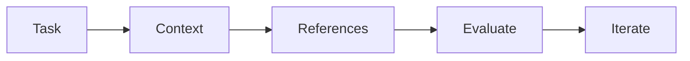
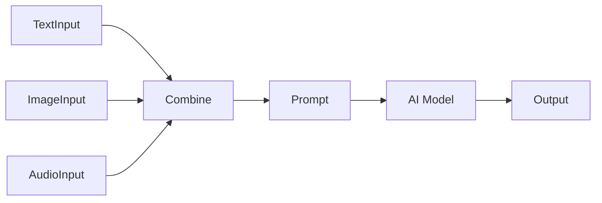
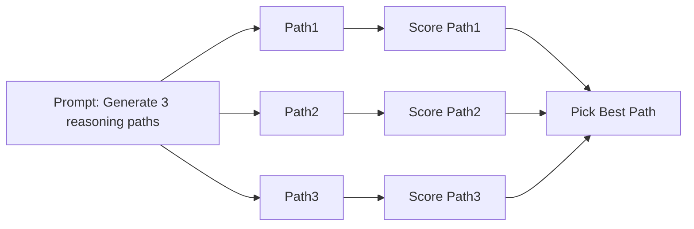
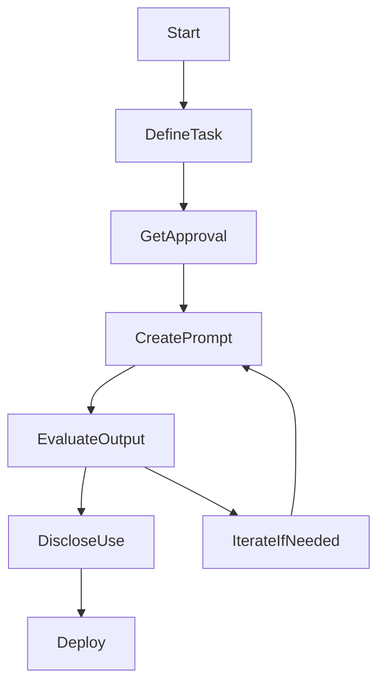

### 🗺️ Navigation

### Part I: Prompting Fundamentals
- [[#🍽️ 5‑Step Prompting Framework]]
- [[#The Five Steps, in One Line]]
- [[#Step‑by‑Step Walkthrough]]
- [[#📊 Visual Summary]]
- [[#▶️ [!example] Worked Example: Summarizing a Quarterly Report]]
- [[#When to Loop Back]]

### Part II: Multimodal and Advanced Techniques
- [[#🎨 Multimodal Prompting]]
- [[#🚀 Advanced Prompting Techniques]]
- [[#🧩 Prompt Chaining]]
- [[#🧠 Chain‑of‑Thought Prompting]]
- [[#🌳 Tree‑of‑Thought Prompting]]
- [[#📊 When to use which technique?]]
- [[#🎯 Bottom line]]

### Part III: Governance and Safety
- [[#🌐 Responsible AI Usage]]

---

## ▣ I: Prompting Fundamentals

---

### 🍽️ 5‑Step Prompting Framework  

When you talk to a generative AI, think of the interaction as cooking a dish. You need a clear **goal** (the recipe), the right **ingredients** (context and references), a **taste test** (evaluate), and sometimes a few **adjustments** (iterate).  Following the five steps below helps you get a tasty result every time.

### The Five Steps, in One Line  

$$\boxed{
\text{Task} \;\rightarrow\; \text{Context} \;\rightarrow\; \text{References} \;\rightarrow\; \text{Evaluate} \;\rightarrow\; \text{Iterate}
}$$  

> [!tip] **Why the order matters**  
> “Task” tells the model *what* to do, “Context” tells it *why* it matters, “References” show *how* you expect the answer to look, “Evaluate” is your sanity‑check, and “Iterate” lets you fine‑tune the prompt until the output matches the goal.

---

### Step‑by‑Step Walkthrough  

| Step | What you do | What the model gets |
|------|-------------|---------------------|
| **Task** | Define the exact goal, persona, and output format (e.g., *“Write a 150‑word executive summary as a senior analyst.”*) | A clear instruction of the desired output. |
| **Context** | Provide background, scenario details, and any constraints (e.g., *“The company just launched a new SaaS product in Q2 2024.”*) | The situation that shapes the answer. |
| **References** | Attach examples, data snippets, or style guides (e.g., a bullet list of key metrics to include). | Concrete material the model can copy or emulate. |
| **Evaluate** | Review the AI’s reply: Does it hit the word count? Is the tone right? Does it use the supplied data? | Your checklist for quality. |
| **Iterate** | Refine the prompt based on the evaluation—add missing details, clarify ambiguities, or change the format request. | A tighter prompt for the next round. |

> [!warning] **Common slip‑up**  
> Skipping the **Evaluate** step and publishing the output immediately often leads to subtle errors (wrong numbers, off‑tone language) that can damage credibility.

---

### 📊 Visual Summary  


*Flow of information through the 5‑step framework.*

---

### 1.1 — > [!example] **Worked Example: Summarizing a Quarterly Report**

**Goal:** Produce a 120‑word summary of Q1 sales for a marketing briefing, written in a friendly tone.

| Step | Prompt (what you type) | Model’s output (excerpt) |
|------|------------------------|--------------------------|
| **Task** | “Write a 120‑word summary of Q1 sales as a friendly marketing brief.” | *[waits for more]* |
| **Context** | “Our SaaS product sold 3,200 licenses in Q1, revenue $4.8 M, up 15 % YoY. The main drivers were the new onboarding flow and a 10 % price increase.” | *[now knows the numbers]* |
| **References** | “Use bullet points for each driver and end with a one‑sentence recommendation.” | *[includes bullets]* |
| **Evaluate** | Check length (≈120 words), tone (friendly), and that all three data points appear. | The draft is 135 words and missed the price‑increase detail. |
| **Iterate** | “Please shorten to 120 words and add the price‑increase detail.” | Final output meets length, tone, and includes all data. |

> [!tip] **What the numbers tell you**  
> The iteration cut 15 words and added the missing fact—showing how a quick “taste test” can catch both verbosity and omissions.

---

### When to Loop Back  

- **If the output is off‑topic** → go back to **Task** and make the goal sharper.  
- **If the model seems confused** → enrich **Context** with more background.  
- **If you need a different style** → swap or add new **References** (sample paragraphs, tone guides).  

> [!important] **The core insight**  
> The 5‑step framework is a *feedback loop*: each cycle narrows the gap between what you want and what the model delivers. Treat it like a mini‑agile sprint for prompt engineering.

---  

Ready to try it out? Pick a simple request, run through the five steps on paper, and see how the AI’s answer improves after just one iteration.  

*Next up we’ll see how to stretch this recipe with **Multimodal Prompting**—adding images or audio to make the prompt even richer.*

So, how can we move beyond just text to make our prompts even more effective?

---

## ▣ II: Multimodal and Advanced Techniques

---

### 🎨 Multimodal Prompting

When we feed an AI only words, we’re giving it a single slice of information.  
Multimodal prompting stitches together **text, images, and audio** into one richer prompt, so the model can “see” and “hear” the context it needs to answer more accurately.

### 2.1 — Why mix modalities?

Think of a detective who only reads a witness statement versus one who also looks at a crime‑scene photo and hears a recorded call.  
The extra clues cut down ambiguity and let the AI draw tighter conclusions.

> [!tip] **Richer context → better answers**  
> Adding an image of a product while asking for a marketing tagline grounds the AI in the product’s actual look, reducing hallucinations.

### 2.2 — How it fits into the 5‑step framework

Multimodal prompting mainly expands the **Create** step (task, context, references).  
You still:

1. **Task** – what you want (e.g., “Write a caption”).  
2. **Context** – now includes any media you attach.  
3. **References** – examples of good captions.  
4. **Evaluate** – check if the caption matches both the text request *and* the visual content.  
5. **Iterate** – tweak the prompt or swap media until it’s spot‑on.

> [!note] See the full workflow in [[#🍽️ 5‑Step Prompting Framework]].

### 2.3 — Simple flow


*Flow of a multimodal prompt: raw media → combined prompt → AI → result.*

### 2.4 — Worked example

> [!example] **Creating a product description from an image and brief specs**  
> *Goal:* Generate a compelling one‑sentence description for a new smartwatch.

| Step | Prompt element | What we give the model |
|------|----------------|------------------------|
| 1 | **Text** | “Write a catchy tagline for a smartwatch.” |
| 2 | **Image** | Photo of the watch showing its sleek round face. |
| 3 | **Additional specs (text)** | “Battery life: 48 h, Waterproof: 5 atm, Price: $199.” |
| 4 | **Combined prompt** | “Using the attached image and specs, write a tagline that highlights durability and style.” |

**Result:** “Endure every adventure—48 hours of sleek, waterproof style for just $199.”  

> [!tip] **Check both angles** – verify the tagline mentions the visual (round face) and the specs you care about. If it misses one, iterate by adding a clearer instruction (“Make sure to mention the round face”).

### 2.5 — Common pitfalls

> [!warning] **Assuming the AI “sees” the image automatically**  
> If you only attach an image without explicitly telling the model to consider it, the output may ignore visual cues entirely.

> [!danger] **Skipping evaluation** – Multimodal outputs can look good but still misinterpret a visual detail (e.g., calling a black watch “golden”). Always run a quick sanity check before publishing.

### 2.6 — Key takeaway

> [!important] **Multimodal prompting = richer context → higher fidelity answers**  
> By bundling text, images, and audio, you guide the model toward the right interpretation, but you must still *evaluate* and *iterate* just like with plain‑text prompts. This keeps the process reliable and aligned with responsible AI practices.

So how do we actually handle those more complex, multi-step tasks?

### 🚀 Advanced Prompting Techniques  

When a task gets a little messy, a single prompt often feels like trying to write a whole novel on a postcard.  That’s where **prompt chaining**, **chain‑of‑thought**, and **tree‑of‑thought** come in – they let you break the problem into bite‑sized pieces, see the AI’s reasoning, and compare alternatives side‑by‑side.  

---

### 🧩 Prompt Chaining  

Think of prompt chaining like building a house: you don’t slap the roof on before the foundation is set.  You take the output from one prompt, treat it as the “floor plan,” and feed it into the next prompt so the story stays consistent.  

> [!tip] **Keep the context alive** – whenever you pass an output forward, prepend a short reminder of the original goal.  It stops the model from wandering off‑topic.  

**How it works**

1. **Prompt 1** asks the model to generate a piece of information (e.g., a list of key arguments).  
2. **Prompt 2** takes that list and asks the model to expand each point into a paragraph.  
3. **Prompt 3** might then request a summary of the whole essay, using the expanded paragraphs as context.  

The chain preserves the scenario details across the interaction, reducing the chance of contradictions.

#### Worked example: Crafting a product description  

| Step | Prompt (what you ask) | AI Output |
|------|-----------------------|-----------|
| 1 | “List three unique features of the new smartwatch.” | 1. Solar‑charged battery 2. Skin‑tone adaptive band 3. Voice‑controlled health coach |
| 2 | “Take each feature and write a two‑sentence benefit statement.” | 1. The solar‑charged battery lets you charge on the go, extending usage up to 7 days… |
| 3 | “Combine the three benefit statements into a 150‑word product blurb.” | *Final polished description* |


*Caption: Simple prompt chain moving from feature list → benefit statements → full blurb*  

> [!warning] **Don’t copy‑paste blindly** – always evaluate each intermediate output before you hand it to the next prompt.  A single mistake can snowball through the chain.

---

### 🧠 Chain‑of‑Thought Prompting  

Instead of asking for a straight answer, you invite the model to “think out loud.”  This is especially handy for math, logical puzzles, or any task where the reasoning steps matter.  

> [!important] **Why it works** – By making the model generate its internal chain of reasoning, you give it a scaffolding that keeps the answer anchored to the logic you’ve asked it to follow.  

**Typical pattern**

```
Question: Why does the sky appear blue?
Answer: Let's think step by step.
1. Sunlight contains all colors.
2. ...
```

The model lists each step, and you can later **evaluate** whether any step went off‑track before accepting the final conclusion.

#### Quick demo: Simple arithmetic  

Prompt:  
```
What is 27 × 46? Think step by step.
```

Model’s chain of thought:  
1. 27 × 40 = 1080  
2. 27 × 6 = 162  
3. Add: 1080 + 162 = 1242  

Final answer: **1242**  

> [!tip] **Ask for a “step‑by‑step” cue** (“let’s think step by step”) to reliably trigger chain‑of‑thought mode.

---

### 🌳 Tree‑of‑Thought Prompting  

Sometimes a single line of reasoning isn’t enough; you want to explore several possible paths at once.  Tree‑of‑thought prompting asks the model to generate multiple candidate reasoning branches, then you compare them to pick the best.  

> [!danger] **Beware of choice overload** – too many branches can be overwhelming.  Limit yourself to 3–4 high‑quality alternatives.

**Workflow**

1. **Branch generation** – the model produces several distinct reasoning sequences for the same question.  
2. **Branch evaluation** – you (or the model) score each branch on criteria like correctness, completeness, or creativity.  
3. **Selection** – the highest‑scoring branch is kept as the final answer.  


*Caption: Tree‑of‑thought flow with parallel reasoning branches and a scoring step.*

#### Example: Choosing a project management tool  

Prompt:  
```
Suggest a tool for a remote team of 12 that needs Gantt charts, real‑time chat, and budget tracking. Give three distinct options, each with a brief reasoning.
```

Model’s three branches might be:  

- **Option A – Asana** – strong task boards, integrates with Slack, add‑on for budgets.  
- **Option B – Monday.com** – built‑in Gantt view, native chat, native budgeting column.  
- **Option C – ClickUp** – all‑in‑one suite, free tier covers 12 users, customizable dashboards.  

You then pick the one that matches your budget and integration preferences.

---

### 📊 When to use which technique?  

| Situation | Best fit |
|-----------|----------|
| You need a **long, structured output** (e.g., multi‑section report) | Prompt Chaining |
| The task involves **logic or calculations** and you want to catch mistakes early | Chain‑of‑Thought |
| You have **multiple plausible solutions** and want to compare them side‑by‑side | Tree‑of‑Thought |
| You’re combining text with images or audio | Multimodal Prompting (covered elsewhere) |

> [!note] **Iterate** – Regardless of the technique, always loop back through the **5‑step CREATE framework** (Context, References, Ask, Evaluate, Iterate) to polish the final result.

---

### 🎯 Bottom line  

Advanced prompting is less about magic phrasing and more about **structure**:  

- **Chain** the outputs to keep momentum.  
- **Think** out loud to surface hidden errors.  
- **Branch** out to compare alternatives.  

With these tools in your AI toolbox, you’ll turn vague prompts into reliable, high‑quality results—without having to guess whether the model “got it right.”

So, how do we make sure we’re using these tools safely and responsibly?

---

## ▣ III: Governance and Safety

---

### 🌐 Responsible AI Usage

Using generative AI at work can feel like opening a new toolbox: it’s powerful, but you still need to lock the drawer, label the tools, and check the instructions before you start building. Below is a friendly cheat‑sheet for keeping your AI projects secure, transparent, and well‑supervised.

### 3.1 — 🛡️ Security & Privacy

Think of data as a secret recipe. You wouldn’t hand it to a stranger without a nondisclosure agreement, right? The same principle applies to AI prompts.

> [!warning] **Never feed confidential or personally identifiable information (PII) into a public AI service**  
> If you need to use sensitive data, make sure the model runs behind your organization’s firewall or use a vetted, approved service.

> [!tip] **Sanitize inputs** – strip out names, IDs, or any detail that could trace back to an individual before sending the prompt.

### 3.2 — 🔍 Transparency & Disclosure

People deserve to know when AI helped create a document, a report, or a piece of code. It’s the digital version of saying “I used a calculator”.

> [!important] **Always disclose AI involvement** – add a short note like “Generated with AI assistance” at the bottom of the output.  
> This builds trust and satisfies many corporate policies.

> [!info] **Why it matters** – Responsible AI practices protect privacy, maintain credibility, and align with the fact that 8 in 10 executives think AI‑savvy workers deserve higher pay and more promotions.

### 3.3 — 📋 Oversight & Governance

Before you hit “run”, get the green light from the right people and give the output a quick sanity check.

> [!warning] **Do not deploy AI‑generated content without a manual review** – the model can hallucinate facts or miss subtle nuances.  
> A quick fact‑check or peer review catches most errors.

> [!tip] **Create a simple checklist** for every AI‑driven task:

| ✅ Checklist Item | Why It Helps |
|-------------------|--------------|
| Get project approval from your manager or AI‑governance board | Guarantees alignment with company policy |
| Verify that inputs contain no confidential data | Keeps privacy intact |
| Review the output for accuracy and bias | Prevents misinformation |
| Add a disclosure statement | Maintains transparency |
| Document the prompt version used | Enables reproducibility |

### 3.4 — 🚀 Linking Responsible Use to the 5‑Step Prompting Framework

The same framework that makes prompts sharper also guides responsible behavior:

1. **Create** – Write a clear prompt (include task, persona, format).  
2. **Task** – Define the goal and who the output is for (helps decide if AI use is appropriate).  
3. **Context** – Provide background *and* note any privacy constraints.  
4. **Evaluate** – Check the answer for factual accuracy, bias, and security compliance.  
5. **Iterate** – Refine the prompt **and** update your checklist if new risks appear.

> [!danger] **Common misconception** – “One prompt is enough.”  
> In reality, iteration is a built‑in safety net; each tweak lets you catch hidden issues before they slip out.

### 3.5 — 📊 Responsible AI Workflow (at a glance)


*Diagram shows the loop from defining a task to iterating on the prompt until the output is safe, transparent, and approved.*

### 3.6 — 🧩 Quick Takeaway

- **Secure**: Never expose PII, always sanitize inputs.  
- **Transparent**: Clearly label AI‑generated work.  
- **Oversight**: Get approval, review output, keep a checklist, and iterate.

Following these habits turns a powerful generative model into a trustworthy colleague rather than a wild card. Happy prompting—responsibly!

---

| Term | Definition |
|------|------------|
| **AI hallucination** | When an AI model generates false, misleading, or nonsensical information. |
| **Chain-of-thought** | A technique where the model is prompted to break down its reasoning into step-by-step components. |
| **Context** | The background information and constraints provided to an AI to guide its output. |
| **Iteration** | The process of refining a prompt based on evaluation results to improve subsequent outputs. |
| **Multimodal** | The ability of an AI to process and integrate multiple types of input, such as text, images, and audio. |
| **PII** | Personally Identifiable Information; sensitive data that must be excluded from public AI prompts. |
| **Prompt chaining** | A method of breaking a complex task into a series of linked prompts where the output of one informs the next. |
| **Prompt engineering** | The practice of designing and refining inputs to guide generative AI toward desired results. |
| **Tree-of-thought** | A prompting strategy that generates multiple reasoning paths to allow for comparison and selection. |

Sources: Internal Study Guide for Generative AI Prompt Engineering, 2024.